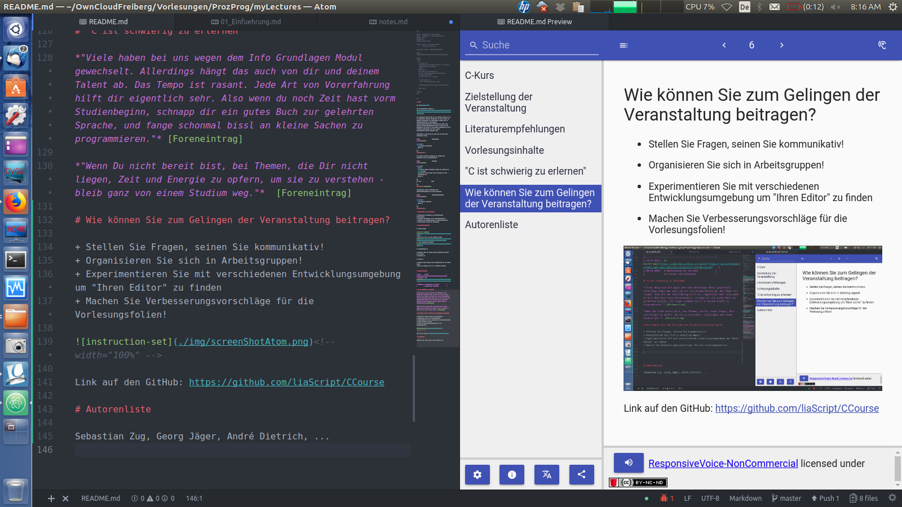
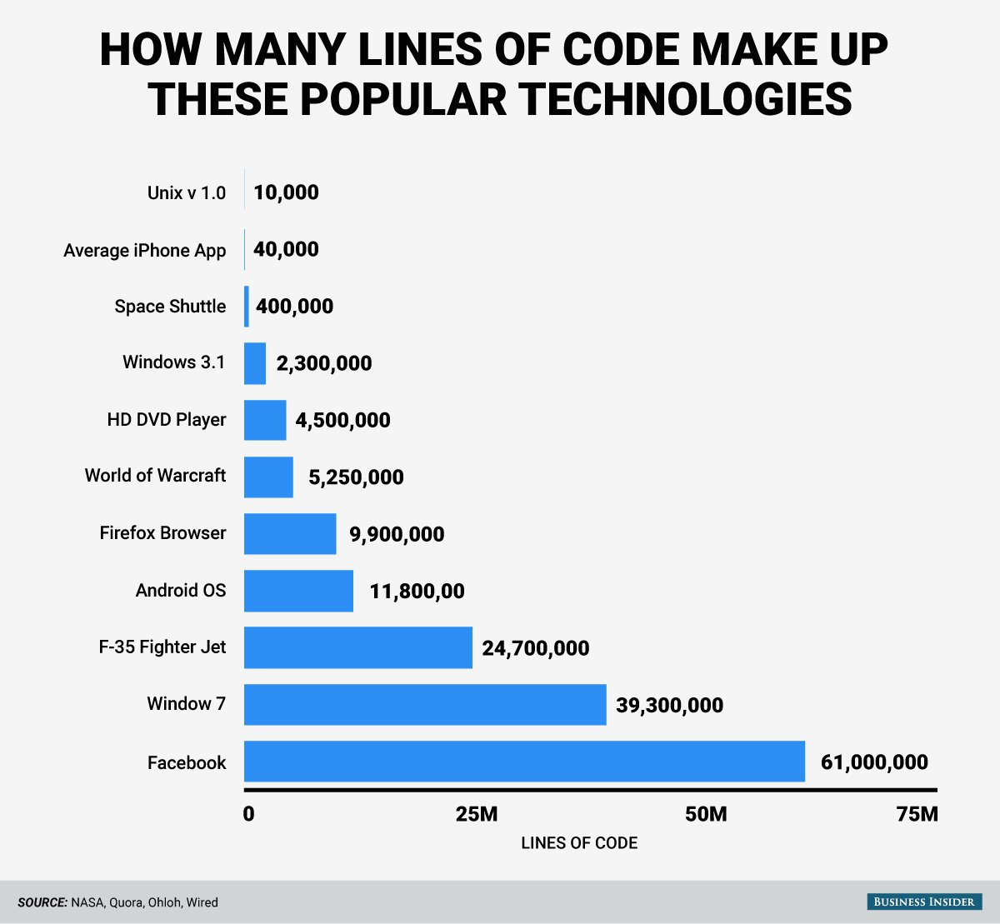

<!--

author:   Sebastian Zug & André Dietrich
email:    zug@ovgu.de   & andre.dietrich@ovgu.de
version:  0.0.1
language: de
narrator: Deutsch Female

import: https://raw.githubusercontent.com/liaScript/rextester_template/master/README.md

-->

# Vorlesung Softwareentwicklung - 0 - Einführung

** TU Bergakademie Freiberg - Sommersemester 2019**

```csharp    HelloWorld.cs
using System;

namespace Rextester
{
    public class Program
    {
        public static void Main(string[] args)
        {
            Console.WriteLine("Glück auf!");
        }
    }
}
```
@Rextester.eval(@CSharp)

## 0 - Organisatorisches

**Zielstellung der Veranstaltung**

* Verstehen verschiedener Programmierparadigmen
* Beherrschen von prozeduraler und objektorientierter Programmierung in C#
* Einführung in die Werkzeuge der Softwareentwicklung
* Nutzung moderner und aktueller Programmiertechniken

{{1}}
**Dozenten**

{{1}}
| Name             | Email                                      |
|:-----------------|:-------------------------------------------|
| Sebastian Zug    | sebastian.zug@informatik.tu-freiberg.de    |
| Galina Rudolf    | galina.rudolf@informatik.tu-freiberg.de    |
| Jonas Treumer    | jonas.treumer@informatik.tu-freiberg.de    |
| Ben Lorenz       | ben.lorenz@informatik.tu-freiberg.de       |
| Martin Reinhardt | martin.reinhardt@informatik.tu-freiberg.de |

Die Übungen beginnen in der Woche nach den Osterferien, finden dann aber an
zwei Terminen pro Woche statt!

{{2}}
**Zeitaufwand und Engagement**

{{2}}
Der Zeitaufwand beträgt 180h und setzt sich zusammen aus 60h Präsenzzeit und
120h Selbststudium. Letzteres umfasst die Vor- und Nachbereitung der
Lehrveranstaltungen, die eigenständige Lösung von Übungsaufgaben sowie die
Prüfungsvorbereitung.

{{2}}
*Sieben Minuten für sieben Punkte* ... Einbettung einer studentischen
Zusammenfassung in jeden Foliensatz. Wir organisieren Sie in Gruppen von 2
Studenten, die zu Beginn jeder Veranstaltung die zentralen Aspekte der  
vorangegangen Vorlesung komprimiert darstellt.

{{3}}
**Literaturhinweise**

{{3}}
Literaturhinweise werden zu verschiedenen Themen als Links oder Referenzen
in die Unterlagen integriert.

{{3}}
Es exisitieren eine vielzahl kommerzielle Angebote, die aber einzele Aspekte
in freien Tutorial vorstellen. In der Regel gibt es keinen geschlossenen Kurs
sondern erfordert eine individuelle Suche nach spezifischen Inhalten.

{{3}}
| Medium         | Bemerkung                                                       | Links                                                                              |
| -------------- | --------------------------------------------------------------- | ---------------------------------------------------------------------------------- |
| Online Kurse   | Leitfaden von Microsoft für C# aber auch die Werkzeuge          | [Link](https://docs.microsoft.com/de-de/dotnet/csharp/)                            |
|                | C# Tutorial for Beginners: Learn in 7 Days                      | [Link](https://www.guru99.com/c-sharp-tutorial.html)                               |
|                | Programmierkonzepte von C#                                      | [Link](https://docs.microsoft.com/de-de/dotnet/csharp/programming-guide/concepts/) |
| Videotutorials | Umfangreicher C# Kurs mit guten konzeptionellen Anmerkungen     | [Link](https://www.youtube.com/watch?v=M3lqkuZQBcM&t=2160s)                        |
|                | Einsteigerkurs als Ausgangspunkt für eine Tutorienreihe         | [Link](https://www.youtube.com/watch?v=gfkTfcpWqAY&t=151s)                         |
| Bücher         | J. Albahari, B. Albahari, "C# 7.0 in a Nutshell", O'Reilly 2017 |                                                                                    |
|                | H. Mössenböck, "Kompaktkurs C# 7", dpunkt.verlag                                                                |                                                                                    |

{{4}}
**Struktur der Vorlesungsunterlagen**

{{4}}
Hinweis: Die Vorlesung basiert in den ersten Woche in starkem Maße auf dem
Foliensatz von Herrn Dr. Martin Reinhardt, der die Veranstaltung im vergangenen Jahr
gehalten hat.

{{4}}
* Einordnung im Gesamtkontext (Entwicklungsmethodik, C#, Tools)
* Zusammenfassung der letzten Veranstaltung
* ... eigentlicher Inhalt ...
* Beispiel der Woche
* Anhang mit Referenzen und Literaturhinweisen

{{5}}
**Vorlesungsplan**

{{5}}
|     | Tag       | Inhalt der Vorlesung   |
|:--- | --------- |:---------------------- |
| 1   | 2. April  | Ausfall                |
|     | 3. April  | Einführung, Grundlagen |
| 2   | 9. April  |                        |
|     | 10. April |                        |
| 3.  | 16. April |                        |
|     | 17. April |                        |
| 4.  | 23. April |                        |
|     | 24. April |                        |
| 5.  | 30. April |                        |
|     |           | ...                    |

{{6}}
**Wie können Sie zum Gelingen der Veranstaltung beitragen**

{{6}}
* Stellen Sie Fragen, seinen Sie kommunikativ!
* Organisieren Sie sich in Arbeitsgruppen!
* Experimentieren Sie mit verschiedenen Entwicklungsumgebung um "Ihren Editor"
  zu finden
* Machen Sie Verbesserungsvorschläge für die Vorlesungsfolien!

{{6}}
<!-- width="100%" -->

{{6}}
Link auf den GitHub: https://github.com/liaScript/CCourse

## 1. Softwareentwicklung

{{0}}
**Worum geht es, was ist "Softwareentwicklung"?**

{{0}}
| Begriff               | Definitionsansatz                                                                                                                                |
| --------------------- | ------------------------------------------------------------------------------------------------------------------------------------------------ |
| Software als "Medium" | "Software war all das, was zum Funktionieren eines Computers notwendig, aber nicht Hardware ist."                                                |
|                       | "Software ist sinnlich nicht wahrnehmbar ... . Sie ist komplex und besteht aus umfangreichen Texten"                                             |
| Software als Ziel     | "Software macht den Computer nutzbar"                                                                                                            |
|                       | "Software ermöglicht die Abbildung von Prozessen auf einem Rechner"                                                                              |
| Software als Prozess  | "Software ist die Idee, die Lösung, die man sich für ein Problem ausgedacht hat, das Verfahren, das helfen soll ..."                             |
|                       | "Dabei sind Computerprogramme nicht nur als Beschreibung der auszuführenden Funktionen ... Vereinbarung zur Nutzung, ... Dokumentationsinhalte." |

{{1}}
*Tessen Freund: Software Engineering durch Modellierung wissensintensiver Entwicklungsprozesse, S. 25*
[Link google books](http://books.google.de/books?id=2HPldlxhBOkC&pg=PA25#v=onepage&q&f=false)

{{1}}
> Unter dem Begriff Softwareentwicklung versteht man die Konzeption
> und standardisierte Umsetzung von Softwareprojekten und die damit
> verbundenen Prozesse.

{{1}}
Abgrenzung zum Softwareengineering

{{1}}
> „Zielorientierte Bereitstellung und systematische Verwendung von Prinzipien,
> Methoden und Werkzeugen für die arbeitsteilige, ingenieurmäßige Entwicklung
> und Anwendung von umfangreichen Softwaresystemen.“ [Balzert, S. 36]

{{2}}
**Was heißt das, "ingenieurmäßig" oder "standardisiert"?**

{{2}}
Gemäß ISO 9126 gibt es die sechs folgenden Qualitätsmerkmale für Softwareprodukte:

{{2}}
<!-- width="80%" --> [^1]

{{2}}
Nachfolger ISO 25010: Zusätzlich

{{2}}
* Kompatibilität
* Sicherheit

{{2}}
Die Norm kann als eine Art Checkliste verstanden werden.

## 2. Und warum der ganze Aufwand?

{{0-1}}
<!-- width="80%" --> [^1]

{{1-2}}
Ariane

{{1-2}}
```ada  CodezeileAriane
P_M_DERIVE(T_ALG.E_BH) := UC_16S_EN_16NS (TDB.T_ENTIER_16S
                                   ((1.0/C_M_LSB_BH) *
                                   G_M_INFO_DERIVE(T_ALG.E_BH)))
```

{{2-3}}
Toll Connect

{{3-5}}
Und im Kleinen ...

{{3-5}}
Das folgende anschauliche Beispiel und die zugehörige Analyse entstammt der Vorlesung "Software Engineering"
von Prof. Dr. Schürr, TU Darmstadt.

{{3-5}}
```pascal
program SORT;
var a, b: file of integer;
    Feld: array [ 1 .. 10 ] of integer;
    i, j, k, l : integer
begin
    open ( a, ‘/Zahlen/Datei’);
    i := 1;
    while not eof ( a ) do
    begin
        read ( a, Feld [ i ] );
        i := i + 1
    end;
    l := i - 1;
    open ( b, ‘/Zahlen/Datei‘);
    for i := 2 to l do
    begin
        for j := l downto i do
            if Feld [ j - 1 ] > Feld [ j ] then
            begin
                k := Feld [j - 1];
                Feld [j - 1] := Feld[ j ]; Feld [ j ] := k
            end;
            write ( b , Feld [ i - 1 ] )
    end
end SORT;
```
{{3-5}}
Welche Probleme sehen Sie im Hinblick auf die zuvor genannten Qualitätsmerkmale

{{3-4}}
| Aspekt                 | Bewertung |
| Funktionalität         | ?         |
| Zuverlässigkeit        |           |
| Benutzbarkeit          |           |
| Effizienz              |           |
| Wartungsfreundlichkeit |           |
| Übertragbarkeit        |           |

{{4}}
| Aspekt                 | Bewertung                                                         |
| Funktionalität         | feste Feldlänge, das Programm stürzt bei mehr als 10 Einträgen ab |
| Zuverlässigkeit        | mehrfaches Öffnen ein und der selben Datei                                                                   |
| Benutzbarkeit          | im Programmcode enthaltene Dateinamen, feste Feldlänge            |
| Effizienz              | quadratischer Aufwand der Sortierung                              |
| Wartungsfreundlichkeit | fehlende Dokumentation, unverständliche Variablenbezeichner       |
| Übertragbarkeit        |                                                                   |

## 3. Struktuierung des Entwicklungsprozesses und Einordnung

**Abgrenzung am Beispiel des V-Prozesses**

<!-- width="80%" --> [^3]

**Agile Softwarentwicklung**


TODO


## 4. Computer-aided software engineering (CASE)

> *CASE is the use of computer-based support in the software development process*

**Klassifikation**

Anforderungsanalyse
* Spezifikation
* Modellierung

Code-Erstellung (Editoren)
* Editor, IDE
* Dokumentation

Ausführung und Testen
* Compiler, Interpreter
* IDE, Build-System
* Debugger

Koordination Entwicklungsprozess
* Projektverwaltung
* Code-Base Management und Versionierung
* Deployment
* Support

**Spezifische Werkzeuge oder eine geschlossene Suite?**

* Tools - einzelne Aktivitäten im Software Life-cycle
* Workbenches - mehrere Werkzeuge
* Environments - Kombination mehrerer Workbenches und Werkzeuge zur Unterstützung des kompletten Software Life-cycle

Texteditor vs. Integred development environment (IDE)

* Analyse des Workflows und der Formen der Zusammenarbeit
* Analyse der verwendeten Spezifikations und Modellierungstechniken, Programmiersprachen, etc.
* Analyse der Komplexität des Vorhabens, der erforderlichen Unterstützung
* Analyse der Rahmenbedingungen (Betriebssysteme, Kosten)

## Anhang

**Referenzen**

[^1] Wikipedia "ISO/IEC 9126", Autor *Sae1962*

[^2]
Dragan Radovanovic, Kif Leswing, "Google runs on 5000 times more code than the original space shuttle", 2016, https://www.weforum.org/agenda/2016/07/google-runs-on-5000-times-more-code-than-the-original-space-shuttle?utm_content=buffer45d4c&utm_medium=social&utm_source=twitter.com&utm_campaign=buffer

[^3] Wikipedia "V Modell", Autor *Michael Pätzold*

**Autoren**

Sebastian Zug, André Dietrich
