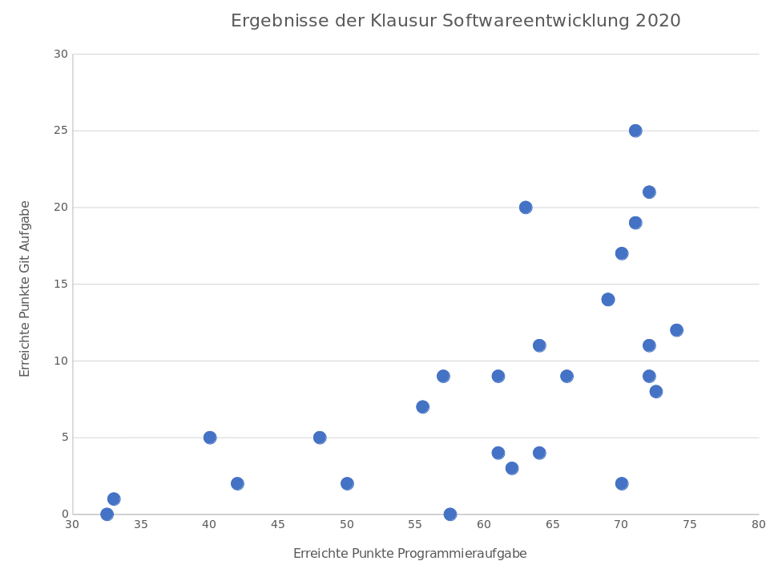
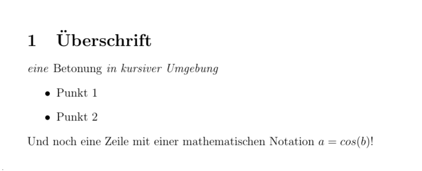

<!--

author:   Sebastian Zug, Galina Rudolf, André Dietrich, Fritz Apelt, `KoKoKotlin`
email:    sebastian.zug@informatik.tu-freiberg.de
version:  1.0.4
language: de
narrator: Deutsch Female
comment:  Motivation der Vorlesung Softwareentwicklung
logo:     https://liascript.github.io/img/bg-showcase-1.jpg
icon:     https://upload.wikimedia.org/wikipedia/commons/d/de/Logo_TU_Bergakademie_Freiberg.svg

import: https://raw.githubusercontent.com/liascript-templates/plantUML/master/README.md
        https://github.com/liascript/CodeRunner

-->

[](https://liascript.github.io/course/?https://github.com/TUBAF-IfI-LiaScript/VL_Softwareentwicklung/blob/master/00_Einfuehrung.md)


# Einführung

| Parameter                | Kursinformationen                                                                                                                                                                          |
| ------------------------ | ------------------------------------------------------------------------------------------------------------------------------------------------------------------------------------------ |
| **Veranstaltung:**       | `Vorlesung Softwareentwicklung`                                                                                                                                                            |
| **Semester**             | `Sommersemester 2022`                                                                                                                                                                      |
| **Hochschule:**          | `Technische Universität Freiberg`                                                                                                                                                          |
| **Inhalte:**             | `Motivation der Vorlesung "Softwareentwicklung" und Beschreibung der Organisation der Veranstaltung`                                                                                       |
| **Link auf den GitHub:** | [https://github.com/TUBAF-IfI-LiaScript/VL_Softwareentwicklung/blob/master/00_Einfuehrung.md](https://github.com/TUBAF-IfI-LiaScript/VL_Softwareentwicklung/blob/master/00_Einfuehrung.md) |
| **Autoren**              | @author                                                                                                                                                                                    |


---------------------------------------------------------------------

## Zielstellung der Veranstaltung

<!--style="width: 100%; max-width: 80vh;"-->


### Qualifikationsziele / Kompetenzen

Studierende sollen ...

- die Konzepte objektorientierten und interaktiven Programmierung verstehen,

- die Syntax und Semantik einer objektorientierten Programmiersprache
  beherrschen um Probleme kollaborativ bei verteilter Verantwortlichkeit von
  Klassen von einem Computer lösen lassen,

- in der Lage sein, interaktive Programme unter Verwendung einer
  objektorientierten Klassenbibliothek zu erstellen.

[Auszug aus dem Modulhandbuch 2020]


### Zielstellung der Veranstaltung

> _Wir lernen effizient guten Code in einem kleinen Team zu schreiben._

| Genereller Anspruch                                                                           | Spezifischer Anspruch                                                                                  |
| --------------------------------------------------------------------------------------------- | ------------------------------------------------------------------------------------------------------ |
| Verstehen verschiedener Programmierparadigmen UNABHÄNGIG von der konkreten Programmiersprache | Objektorientierte (und funktionale) Programmierung am Beispiel von C#                                  |
| praktische Einführung in die methodische Softwareentwicklung                                  | Arbeit mit ausgewählten UML Diagrammen und Entwurfsmustern                                             |
| Grundlagen der kooperativ/kollaborative Programmierung und Projektentwicklung                 | Verwendung von Projektmanagementtools und einer Versionsverwaltung für den Softwareentwicklungsprozess |

Obwohl Einstimmigkeit darüber besteht, dass kooperative Arbeit für Ingenieure
Grundlage der täglichen Arbeitswelt ist, bleibt die Wissensvermittlung im Rahmen
der Ausbildung nahezu aus.

> __Frage:__ _Welche Probleme sehen Sie bei der Teamarbeit? _

                                    {{1-2}}
********************************************************************************

> **Spezifisches Ziel:** Wir wollen Sie für die Konzepte und Werkzeuge der
> kollaborativen Arbeit bei der Softwareentwicklung "sensibilisieren".
>
> - Wer definiert die Feature, die unsere Lösung ausmachen?
> - Wie behalten wir bei synchronen Codeänderungen der Überblick?
> - Welchen Status hat die Erfüllung der Aufgabe X erreicht?
> - Wie können wir sicherstellen, dass Code in jedem Fall kompiliert und Grundfunktionalitäten korrekt ausführt?
> - ...

********************************************************************************

### Wozu brauche ich das?

> Anhand der Veranstaltung entwickeln Sie ein "Gefühl" für guten und schlechten
> Code und hinterfragen den Softwareentwicklungsprozess.

      {{1}}
********************************************************************************

**Beispiel 1: Mariner 1 Steuerprogramm-Bug (1962)**

      {{1}}
[^Atlas-Agena]

    --{{1}}--
Mariner 1 ging beim Start am 22. Juli 1962 durch ein fehlerhaftes Steuerprogramm verloren, als die Trägerrakete vom Kurs abkam und 293 Sekunden nach dem Start gesprengt werden musste. Ein Entwickler hatte einen Überstrich in der handgeschriebenen Spezifikation eines Programms zur Steuerung des Antriebs übersehen und dadurch statt geglätteter Messwerte Rohdaten verwendet, was zu einer fehlerhaften und potenziell gefährlichen Fehlsteuerung des Antriebs führte.

[Link auf Beschreibung des Bugs](http://www.nfranze.de/download/Diplomarbeit_Nico_Franze.pdf)

> **Potentieller Lösungsansatz**: Testen & Dokumentation

********************************************************************************

      {{2}}
**Beispiel 2: Toll-Collect On-Board-Units (2003)**

    --{{2}}--
Das Erfassungssystem für die Autobahngebühren für Lastkraftwagen sollte ursprünglich zum 31. August 2003 gestartet werden. Nachdem die organisatorischen und technischen Mängel offensichtlich geworden waren, erfolgte eine mehrfache Restrukturierung. Seit 1. Januar 2006 läuft das System, mit einer Verzögerung von über zwei Jahren, mit der vollen Funktionalität. Eine Baustelle war die On-Board-Units (OBU), diese konnte zunächst nicht in ausreichender Stückzahl geliefert und eingebaut werden, da Schwierigkeiten mit der komplexen Software der Geräte bestanden.

      {{2}}
********************************************************************************

Die On-Board-Units des Systems

- reagierten nicht auf Eingaben
- ließen sich nicht ausschalten
- schalteten sich grundlos aus
- zeigten unterschiedliche Mauthöhen auf identischen Strecken an
- wiesen Autobahnstrecken fehlerhaft als mautfrei/mautpflichtig aus

> **Potentieller Lösungsansatz**: Testen auf Integrationsebene, Projektkoordination

*******************************************************************************

[^Atlas-Agena]: wikimedia, Autor: NASA, [Link](https://de.wikipedia.org/wiki/Datei:Atlas_Agena_with_Mariner_1.jpg)

## Organisatorisches

<!--style="width: 100%; max-width: 80vh;"-->


### Dozenten

| Name          | Email                                   |
|:------------- |:--------------------------------------- |
| Sebastian Zug | sebastian.zug@informatik.tu-freiberg.de |
| Galina Rudolf | galina.rudolf@informatik.tu-freiberg.de |
| Nico Sonack   | nico.sonack@student.tu-freiberg.de      |
| Felix Busch   | Felix.Busch@student.tu-freiberg.de      |
| Anne Gierig   | anne.gierich@student.tu-freiberg.de     |


### Ablauf

    --{{0}}--
Jetzt wird es etwas komplizierter ... die Veranstaltung kombiniert nämlich zwei
Vorlesungen:

<!--data-type="none"-->
|                 | _Softwareentwicklung (SWE)_      | _Einführung in die Softwareentwicklung (EiS)_                                         |
| --------------- | -------------------------------- | ------------------------------------------------------------------------------------- |
| Hörerkreis      | Fakultät 1 + interessierte Hörer | Fakultät 4 - Studiengang Engineering                                                  |
| Leistungspunkte | 9                                | 6                                                                                     |
| Vorlesungen     | 28 (2 Feiertage)                 | 15 (bis 31. Mai 2021)                                                                 |
| Übungen         | ab Mai 2 x wöchentlich           | ab 25. April 8 Übungen                                                                |
|                 |                                  | zusätzliches Python Tutorial ab Juni                                                  |
| Prüfungsform    | Klausur oder Projekt             | maschinenbauspezifisches Software-Projekt (im Wintersemester 2021/22)                 |
|                 |                                  | Prüfungsvoraussetzung: Erfolgreiche Bearbeitung der finalen Aufgabe im Sommersemester |

> **Ermunterung an unsere EiS-Hörer**: Nehmen Sie an der ganzen Vorlesungsreihe
> teil. Den Einstieg haben Sie ja schon gelegt ...


### Struktur der Vorlesungen

<!--data-type="none"-->
| Woche | Tag       | Inhalt der Vorlesung                              | Bemerkung                  |
|:----- | --------- |:------------------------------------------------- | -------------------------- |
| 1     | 4. April  | Organisation, Einführung von GitHub und LiaScript |                            |
|       | 8. April  | Softwareentwicklung als Prozess                   |                            |
| 2     | 11. April | Konzepte von Dotnet und C#                        |                            |
|       | 15. April | _Karfreitag_                                      |                            |
| 3     | 18. April | _Ostermontag_                                     |                            |
|       | 22. April | Elemente der Sprache C# (Datentypen)              |                            |
| 4     | 25. April | Elemente der Sprache C# (Forts. Datentypen)       |                            |
|       | 29. April | Elemente der Sprache C# (Ein-/Ausgaben)           |                            |
| 5     | 2. Mai    | Programmfluss und Funktionen                      |                            |
|       | 6. Mai    | Strukturen / Konzepte der OOP                     |                            |
| 6     | 9. Mai    | Säulen Objektorientierter Programmierung          |                            |
|       | 13. Mai   | Klassenelemente in C#  / Vererbung                |                            |
| 7     | 16. Mai   | Klassenelemente in C#  / Vererbung                |                            |
|       | 20. Mai   | Versionsmanagement im Softwareentwicklungsprozess |                            |
| 8     | 23. Mai   | UML Konzepte                                      |                            |
|       | 27. Mai   | UML Diagrammtypen                                 |                            |
| 9     | 30. Mai   | UML Anwendungsbeispiel                            |                            |
|       | 3. Juni   | Testen                                            | Ende EiS Vorlesungsinhalte |
| 10    | 6. Juni   | _Pfingstmontag_                                   |                            |
|       | 10. Juni  | Dokumentation und Build Toolchains                |                            |
| 11    | 13. Juni  | Continuous Integration in GitHub                  |                            |
|       | 17. Juni  | Generics                                          |                            |
| 12    | 20. Juni  | Container                                         |                            |
|       | 24. Juni  | Delegaten                                         |                            |
| 13    | 27. Juni  | Events                                            |                            |
|       | 1. Juli   | Threadkonzepte in C#                              |                            |
| 14    | 4. Juli   | Taskmodell                                        |                            |
|       | 8. Juli   | Language Integrated Query                         |                            |
| 15    | 11. Juli  | Design Pattern                                    |                            |
|       | 15. Juli  |                                                   |                            |


### Durchführung

     {{0-1}}
************************************************************************

Die Vorlesung wurden im vergangenen Semester aufgezeichnet. Die Inhalte finden sich unter

https://teach.informatik.tu-freiberg.de/b/seb-blv-unz-kxu

> Diese Materialien können der Nachbereitung der Veranstaltung dienen, ersetzen aber nicht den Besuch der Vorlesung.

Die Vorlesung findet

- Montags, 11:00 - 12:30
- Freitags, 9:15 - 10:45

im Audimax 1001 statt.

Die Materialien der Vorlesung sind als Open-Educational-Ressources konzipiert
und stehen unter Github bereit.


> Wie können Sie sich einbringen?
>
> * __Allgemeine theoretische Fragen/Antworten__ ... Dabei können Sie sich über
>   github/ das Opal-Forum in die Diskussion einbringen.
>
> * __Rückmeldungen/Verbesserungsvorschläge zu den Vorlesungsmaterialien__ ...
>   _"Das versteht doch keine Mensch! Ich würde vorschlagen ..."_ ...
>   dann korrigieren Sie uns. Alle Materialien sind Open-Source. Senden Sie mir
>   einen Pull-Request und werden Sie Mitautor.

************************************************************************

     {{1-2}}
************************************************************************

Die Übungen bestehen aus selbständig zu bearbeitenden Aufgaben, wobei einzelne
Lösungen im Detail besprochen werden. Wir werden die Realisierung der Übungsaufgaben
über die Plattform GitHub abwickeln.

> Wie können Sie sich einbringen?
>
> * __Allgemeine praktische Fragen/Antworten__ ... in den genannten Foren bzw.
>   in den Übungsveranstaltungen
>
> * __Eigene Lösungen__ ... Präsentation der Implementierungen in den Übungen
>
> * __Individuelle Fragen__ ... an die Übungsleiter per Mail oder in einer
>   individuellen Session

Für die Übungen  werden wir Aufgaben
vorbereiten, mit denen die Inhalte der Vorlesung vertieft werden. Wir motivieren
Sie sich dafür ein Gruppen von 2 Studierenden zu organisieren.

<!-- style="display: block; margin-left: auto; margin-right: auto; max-width: 815px;" -->
```ascii
                   .-.       .-.
 Einführung C#    (0-2)     ( 3 ) Einführung Git/ GitHub
                   '-'       '-'  Teamarbeit
                     \       /
                      \     /
                       v   v
                        .-.
                       ( 4 )  Objektorientierte Programmierung
                        '-'
                         |
                         v
                        .-.
  Alle Teilnehmer      ( 5 )  Basiselemente Objektorientierte Programmierung
                        '-'
 ::::::::::::::::::::::::|:::::::::::::::::::::::::::::::::::::::::::
                         v
  Informatiker          .-.
  Mathematiker         ( 6 )  Erweiterte OOP Konzepte, Generics
                        '-'   Entwurfsmuster
                         |
                         v
                        .-.
                       ( 7 )  Collections, Delegaten, Events
                        '-'
```

<!--data-type="none"-->
| Index | C#     | GitHub | Teamarbeit | Inhalte / Teilaufgaben                                         | Woche |
| ----- | ------ | ------ | ---------- | -------------------------------------------------------------- |:-----:|
| 0     | Basics | nein   | nein       | Toolchain, Datentypen, Fehler, Ausdrücke,                      |   5   |
| 1     |        |        |            | Kontrollfluss, Arrays                                          |   6   |
| 2     |        |        |            | static Funktionen, Klasse und Struktur, Nullables              |   7   |
| 3     | -      | ja     | ja         | Github am Beispiel von Markdown                                |   8   |
| 4     | OOP    | ja     | ja         | Einführungsbeispiel OOP,                                       |   9   |
|       |        |        |            | *Anwendungsbeispiel:* Computersimulation                       |       |
| 5     | OOP    | ja     | ja         | Vererbung, virtuelle Methoden, Indexer, Überladene Operatoren, | 10-11 |
|       |        |        |            | *Anwendungsbeispiel:*  Smartphone (Entwurf mit UML)            |       |
| 6     | OOP    | ja     | ja         | Vererbung, abstract, virtuell, Generics                        | 12-13 |
|       |        |        |            | *Anwendungsbeispiel:* Zoo                                      |       |
| 7     | OOP    | ja     | ja         | Genererische Collections, Delegaten, Events                    | 14-15 |
|       |        |        |            | *Anwendungsbeispiel:* ???????                                  |       |


************************************************************************

### Prüfungen

In der Klausur werden neben den Programmierfähigkeiten und dem konzeptionellen
Verständnis auch die Werkzeuge der Softwareentwicklung adressiert!

- **Softwareentwicklung:**
  Konventionelle Klausur ODER Programmieraufgabe in Zweier-Team anhand einer selbstgewählten Aufgabe

- **Einführung in die Softwareentwicklung:**
  Teamprojekt und Projektpräsentationen (im Wintersemester 2022/23) bei bestandener Prüfungsvorleistung in Form einer Teamaufgabe im Sommersemester


     {{1}}



### Zeitaufwand und Engagement

Mit der Veranstaltung Softwareentwicklung verdienen Sie sich `9 CP`/`6 CP`. Eine
Hochrechnung mit der von der Kultusministerkonferenz vorgegebenen Formel
`1 CP = 30 Zeitstunden` bedeutet, dass Sie dem Fach im Mittel über dem Semester
`270 Stunden` widmen sollten ... entsprechend bleibt neben den Vorlesungen und
Übungen genügend Zeit für die Vor- und Nachbereitung der Lehrveranstaltungen,
die eigenständige Lösung von Übungsaufgaben sowie die Prüfungsvorbereitung.


    {{1}}
> "Erzähle mir und ich vergesse. Zeige mir und ich erinnere. Lass es mich tun
> und ich verstehe."
>
> -- _(Konfuzius, chin. Phiolsoph 551-479 v. Chr.)_


    {{2}}
********************************************************************************

**Wie können Sie zum Gelingen der Veranstaltung beitragen?**

+ Stellen Sie Fragen, seinen Sie kommunikativ!

+ Geben Sie uns Rückmeldungen in Bezug auf die Geschwindigkeit, Erklärmuster, etc.

+ Organisieren Sie sich in *interdisziplinären* Arbeitsgruppen!

+ Lösen Sie sich von vermeindlichen Grundwahrheiten:

  - *"in Python wäre ich drei mal schneller gewesen"*
  - *"VIM ... mehr Editor braucht kein Mensch!"*

********************************************************************************


### Literaturhinweise

> Literaturhinweise werden zu verschiedenen Themen als Links oder Referenzen
> in die Unterlagen integriert.

Es existiert eine Vielzahl kommerzielle Angebote, die aber einzelne Aspekte
in freien Tutorial vorstellen. In der Regel gibt es keinen geschlossenen Kurs
sondern erfordert eine individuelle Suche nach spezifischen Inhalten.

- **Online-Kurse:**

  + [Leitfaden von Microsoft für C# aber auch die Werkzeuge](https://docs.microsoft.com/de-de/dotnet/csharp/)
  + [C# Tutorial for Beginners: Learn in 7 Days](https://www.guru99.com/c-sharp-tutorial.html) [englisch]
  + [Einsteiger Tutorials](https://docs.microsoft.com/de-de/dotnet/csharp/tour-of-csharp/tutorials/) [deutsch]
  + [Programmierkonzepte von C#](https://docs.microsoft.com/de-de/dotnet/csharp/programming-guide/concepts/)

- **Video-Tutorials:**

  + !?[Umfangreicher C# Kurs mit guten konzeptionellen Anmerkungen](https://www.youtube.com/watch?v=GhQdlIFylQ8)
  + !?[Einsteigerkurs als Ausgangspunkt für eine Tutorienreihe](https://www.youtube.com/watch?v=gfkTfcpWqAY)
  + !?[Absoluter Einsteigerkurs](https://www.youtube.com/watch?v=l0aKBziWBH8)

  **Algorithmen**
  + [Codebeispiele](http://www.rosettacode.org/wiki/Category:Programming_Tasks)

- **Bücher:**

  + [C# 7.0 in a Nutshell - _J. Albahari, B. Albahari, O'Reilly 2017_](https://www.oreilly.com/library/view/c-70-in/9781491987643/)
  + [Kompaktkurs C# 7 - _H. Mössenböck, dpunkt.verlag_](https://dpunkt.de/produkt/kompaktkurs-c-7/)


## Werkzeuge der Veranstaltung

    --{{0}}--
Was sind die zentralen Tools unserer Veranstaltung?

* _Vorlesungstool_ -> BigBlueButton für die Aufzeichnungen aus dem vergangenen Semester  [Introduction](https://www.youtube.com/watch?v=uYYnryIM0Uw)
* _Entwicklungsplattform_ -> [GitHub](https://github.com/)
* _Beschreibungssprache für Lerninhalte_ -> [LiaScript](https://liascript.github.io/)


### Markdown
    {{1-2}}
> Markdown wurde von John Gruber und Aaron Swartz mit dem Ziel entworfen, die
> Komplexität der Darstellung so weit zu reduzieren, dass schon der Code sehr
> einfach lesbar ist. Als Auszeichnungselemente werden entsprechend möglichst
> kompakte Darstellungen genutzt.


    --{{1}}--
Markdown ist eine Auszeichnungssprache für die Gliederung und Formatierung von
Texten und anderen Daten. Analog zu HTML oder LaTex werden die Eigenschaften und
Organisation von Textelementen (Zeichen, Wörtern, Absätzen) beschrieben. Dazu
werden entsprechende "Schlüsselelemente" verwendet um den Text zu strukturieren.

    {{1-2}}
********************************************************************************

```markdown HelloWorld.md
# Überschrift

_eine **Hervorhebung** in kursiver Umgebung_

* Punkt 1
* Punkt 2

Und noch eine Zeile mit einer mathematischen Notation $a=cos(b)$!
```

---

<div id="markdown-example">
<h1>Überschrift</h1>
<i>eine <b>Hervorhebung</b> in kursiver Umgebung</i>
<ul>
  <li>Punkt 1</li>
  <li>Punkt 2</li>
</ul>
Und noch eine Zeile mit einer mathematischen Notation $a=cos(b)$!
</div>

********************************************************************************

      {{2-3}}
********************************************************************************

Eine gute Einführung zu Markdown finden Sie zum Beispiel unter:

* [MarkdownGuide](https://www.markdownguide.org/getting-started/)
* [GitHubMarkdownIntro](https://guides.github.com/features/mastering-markdown/)


Mit einem entsprechenden Editor und einigen Paketen macht das Ganze dann auch
Spaß

* Wichtigstes Element ist ein Previewer, der es Ihnen erlaubt "online" die
  Korrektheit der Eingaben zu prüfen
* Tools zur Unterstützung komplexerer Eingaben wie zum Beispiel der Tabellen
  (zum Beispiel für Atom mit [markdown-table-editor](https://atom.io/packages/markdown-table-editor))
* Visualisierungsmethoden, die schon bei der Eingabe unterstützen
* Rechtschreibprüfung (!)

********************************************************************************

#### Vergleich mit HTML

    --{{0}}--
Im Grunde wurde Markdown erfunden um nich umständlich HTML schreiben zu müssen
und wird zumeist in HTML übersetzt. Das dargestellte Beispiel zeigt den gleichen
Inhalt wie das Beispiel zuvor, es ist jedoch direkt viel schwerer zu editieren,
dafür bietet es weit mehr Möglichkeiten als Markdown. Aus diesem Grund erlauben
die meisten Markdown-Dialekte auch die Nutzung von HTML.

```html HelloWorld.html
<h1>Überschrift</h1>

<i>eine <b>Hervorhebung</b> in kursiver Umgebung</i>

<ul>
  <li>Punkt 1</li>
  <li>Punkt 2</li>
</ul>

Und noch eine Zeile mit einer mathematischen Notation
<math xmlns="http://www.w3.org/1998/Math/MathML">
  <semantics>
    <mrow>
      <mi>a</mi>
      <mo>=</mo>
      <mi>c</mi>
      <mi>o</mi>
      <mi>s</mi>
      <mo stretchy="false">(</mo>
      <mi>b</mi>
      <mo stretchy="false">)</mo>
    </mrow>
    <annotation encoding="application/x-tex">
      a=cos(b)
    </annotation>
  </semantics>
</math>!
```

#### Vergleich mit LaTex

    --{{0}}--
Eine vergleichbare Ausgabe unter LaTex hätte einen deutlich größeren Overhead,
gleichzeitig eröffnet das Textsatzsystem (über einzubindende Pakete) aber auch
ein wesentlich größeres Spektrum an Möglichkeiten und Features (automatisch
erzeugte Numerierungen, komplexe Tabellen, Diagramme), die Markdown nicht
umsetzen kann.

```latex  latexHelloWorld.tex
\documentclass[12pt]{article}
\usepackage[latin1]{inputenc}
\begin{document}
  \section{Überschrift}
  \textit{eine \emph{Betonung} in kursiver Umgebung}
  \begin{itemize}
    \item Punkt 1
    \item Punkt 2
  \end{itemize}
  Und noch eine Zeile mit einer mathematischen Notation $a=cos(b)$!
\end{document}
```

Das Ergebnis sieht dann wie folgt aus:



#### **LiaScript**

    --{{0}}--
Das Problem der meisten Markup-Sprachen und vor allem von Markdown ist, dass die
Inhalte nicht mehr nur für ein statisches Medium (Papier/PDF) geschrieben
werden. Warum sollte ein Lehrinhalt (vorallem in der Informatik), der vorraning
am Tablet/Smartphone/Notebook konsumiert wird nicht interaktiv sein?

       {{0-1}}
*******************************************************************************

LiaScript erweitert Markdown um interaktive Elemente wie:

* Ausführbarer Code
* Animationen & Sprachausgaben
* Visualisierung
* Quizze & Umfragen
* Erweiterbarkeit durch JavaScript und Macros
* ...

*******************************************************************************


           {{1-2}}
*******************************************************************************

**Einbindung von PlantUML zur Generierung von UML-Diagrammen**

    {{1}}
```code Example.plantUML
@startuml

abstract class AbstractList
abstract AbstractCollection
interface List
interface Collection

List <|-- AbstractList
Collection <|-- AbstractCollection

Collection <|- List
AbstractCollection <|- AbstractList
AbstractList <|-- ArrayList

class ArrayList {
  Object[] elementData
  size()
}

enum TimeUnit {
  DAYS
  HOURS
  MINUTES
}

annotation SuppressWarnings

@enduml
```
@plantUML.eval(png)

*******************************************************************************

                            {{2-3}}
*******************************************************************************


**Ausführbarer C# Code**

    --{{2}}--
Wichtig für uns sind die ausführbaren Code-Blöcke, die ich in der Vorlesung nutze, um Beispielimplementierungen zu evaluieren. Dabei werden zwei Formen unterschieden:

**C# 10 mit dotnet Unterstützung**

```csharp  Coderunner.cs9
using System;
using System.Collections.Generic;
using System.Collections;
using System.Linq;
using System.Text;

int n;
Console.Write("Number of primes: ");
n = int.Parse(Console.ReadLine());

ArrayList primes = new ArrayList();
primes.Add(2);

for(int i = 3; primes.Count < n; i++) {
	bool isPrime = true;
	foreach(int num in primes) isPrime &= i % num != 0;
	if(isPrime) primes.Add(i);
}

Console.Write("Primes: ");
foreach(int prime in primes) Console.Write($" {prime}");
```
```xml   -myproject.csproj
<Project Sdk="Microsoft.NET.Sdk">
  <PropertyGroup>
    <OutputType>Exe</OutputType>
    <TargetFramework>net5.0</TargetFramework>
  </PropertyGroup>
</Project>
```
@LIA.eval(`["Program.cs", "project.csproj"]`, `dotnet build -nologo`, `dotnet run -nologo`)

---

**C# 8 mit mono**

```csharp    HelloWorld.cs
using System;

namespace HelloWorld
{
  public class Program
  {
    static void Main(string[] args)
    {
      Console.WriteLine("Glück auf!");
    }
  }
}
```
@LIA.eval(`["main.cs"]`, `mono main.cs`, `mono main.exe`)

> **Frage:**
> Welche Unterschiede sehen Sie zwischen C#8 und C#10 Code schon jetzt?

*******************************************************************************

                            {{3-4}}
*******************************************************************************

** Quellen & Tools**

* Das Projekt: https://github.com/liascript/liascript
* Die Webseite: https://liascript.github.io
* Nützliches

  * [Dokumentation zu LiaScript](https://liascript.github.io/course/?https://raw.githubusercontent.com/liaScript/docs/master/README.md#1)
  * [YouTube Kanal zu LiaScript](https://www.youtube.com/channel/UCyiTe2GkW_u05HSdvUblGYg)

* Editoren

  - Für den [Atom](https://atom.io)-Editor von GitHub exitieren derzeit zwei Plugins:

    1. [liascript-preview](https://atom.io/packages/liascript-preview)

    2. [liascript-snippets](https://atom.io/packages/liascript-snippets)

  - Für den Einsatz anderer Editoren eignet sich auch der [LiaScript-DevServer](https://github.com/LiaScript/LiaScript-DevServer)


*******************************************************************************

### GitHub

    --{{0}}--
Der Kurs selbst wird als "Projekt" entwickelt. Neben den einzelnen Vorlesungen
finden Sie dort auch ein Wiki, Issues und die aggregierten Inhalte als
automatisch generiertes Skript.

Link zum GitHub des Kurses:
https://github.com/TUBAF-IfI-LiaScript/VL_Softwareentwicklung


> **Hinweise**
>
> 1. Mit den Features von GitHub machen wir uns nach und nach vertraut.
>
> 2. Natürlich bestehen neben Github auch alternative Umsetzungen für
>    das Projektmanagement wie das Open Source Projekt GitLab oder weitere
>    kommerzielle Tools BitBucket, Google Cloud Source Repositories etc.

### Entwicklungsumgebungen

    --{{0}}--
**Seien Sie neugierig und probieren Sie verschiedene Tools und Editoren aus!**

* [Atom](https://atom.io)

  !?[Tutorial](https://www.youtube.com/watch?v=EdBqjPSx8bA)

* [Visual Studio Code](https://code.visualstudio.com/)

  !?[Tutorial](https://www.youtube.com/watch?v=rOzXt--TXLg)

* [VIM/gVIM](https://www.vim.ort) / [neoVIM](https://neovim.io/)

  !?[C# Vim Development Setup](https://www.youtube.com/watch?v=qGl_Mb2C87c)

* weitere ...


## Aufgaben

- [ ] Legen Sie sich einen GitHub Account an (sofern dies noch nicht geschehen ist).
- [ ] Installieren Sie einen Editor Ihrer Wahl auf Ihrem Rechner, mit dem Sie Markdown-Dateien komfortabel bearbeiten können.
- [ ] Nutzen Sie das Wiki der Vorlesung um Ihre neuen Markdown-Kenntnisse zu erproben und versuchen Sie sich an folgenden Problemen:


- Recherchieren Sie weitere Softwarebugs. Dabei interessieren uns insbesondere
  solche, wo der konkrete Fehler direkt am Code nachvollzogen werden konnte.

- Fügen Sie eine kurze Referenz auf Ihren Lieblingseditor ein und erklären Sie,
  warum Sie diesen anderen Systemen vorziehen. Ergänzen Sie Links auf Tutorials
  und Videos, die anderen nützlich sein können.
