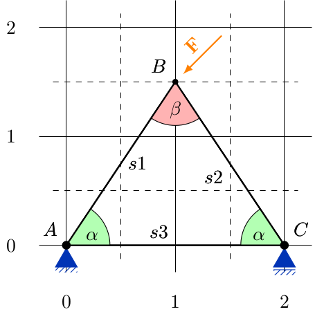
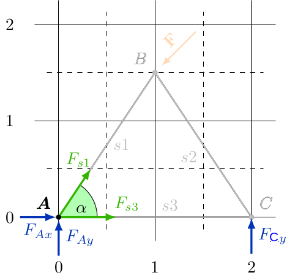
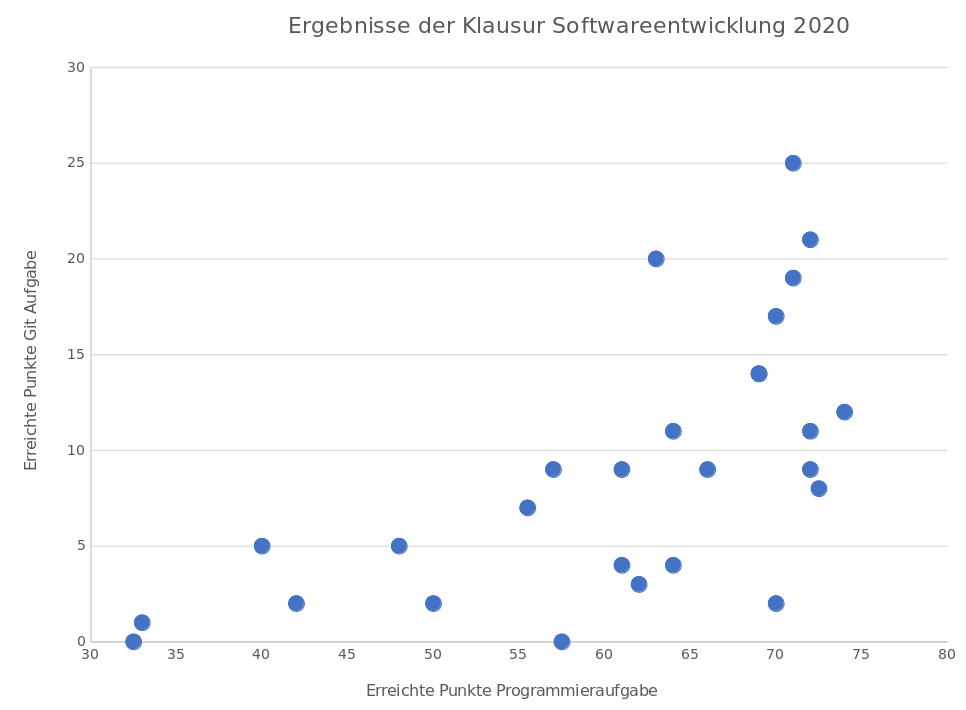
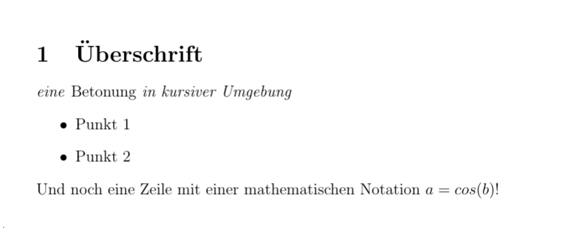

<!--

author:   Sebastian Zug; Galina Rudolf; André Dietrich; Fritz Apelt; `KoKoKotlin`
email:    sebastian.zug@informatik.tu-freiberg.de
version:  1.0.10
language: de
narrator: Deutsch Female
comment:  Motivation der Vorlesung "Softwareentwicklung" und Beschreibung der Organisation der Veranstaltung

import: https://raw.githubusercontent.com/liascript-templates/plantUML/master/README.md
        https://github.com/liascript/CodeRunner

import: https://raw.githubusercontent.com/TUBAF-IfI-LiaScript/VL_Softwareentwicklung/master/config.md

-->

[](https://liascript.github.io/course/?https://raw.githubusercontent.com/TUBAF-IfI-LiaScript/VL_Softwareentwicklung/master/00_Einfuehrung.md#1)


# Einführung

| Parameter                | Kursinformationen                                                                           |
| ------------------------ | ------------------------------------------------------------------------------------------- |
| **Veranstaltung:**       | `Vorlesung Softwareentwicklung`, `Softwareentwicklung und Objektorientierter Entwurf`, `Vorlesung Einführung in die Softwareentwicklung`           |
| **Teil:**                | `0/27`                                                                                      |
| **Semester**             | @config.semester                                                                            |
| **Hochschule:**          | @config.university                                                                          |
| **Inhalte:**             | @comment                                                                                    |
| **Link auf den GitHub:** | https://github.com/TUBAF-IfI-LiaScript/VL_Softwareentwicklung/blob/master/00_Einfuehrung.md |
| **Autoren**              | @author                                                                                     |


Ziele der heutigen Vorlesung:

+ inhaltliche Motivation der Veranstaltung
+ organisatorische Hinweise
+ Vorstellung von Werkzeugen der Veranstaltung

---------------------------------------------------------------------

## Inhalt der Veranstaltung

<!--style="width: 100%; max-width: 80vh;"-->

### Qualifikationsziele / Kompetenzen

Studierende sollen ...

- die Konzepte objektorientierten und interaktiven Programmierung verstehen,

- die Syntax und Semantik einer objektorientierten Programmiersprache
  beherrschen um Probleme kollaborativ bei verteilter Verantwortlichkeit von
  Klassen von einem Computer lösen lassen,

- in der Lage sein, interaktive Programme unter Verwendung einer
  objektorientierten Klassenbibliothek zu erstellen.

[Auszug aus dem Modulhandbuch]


### Zielstellung der Veranstaltung

> _Wir lernen effizient guten Code in einem kleinen Team zu schreiben._

| Genereller Anspruch                                                                           | Spezifischer Anspruch                                                                                  |
| --------------------------------------------------------------------------------------------- | ------------------------------------------------------------------------------------------------------ |
| Verstehen verschiedener Programmierparadigmen UNABHÄNGIG von der konkreten Programmiersprache | Objektorientierte (und funktionale) Programmierung am Beispiel von C# / Python                         |
| Praktische Einführung in die methodische Softwareentwicklung                                  | Systematisierung der Anforderungen an einen Code, Arbeit mit UML Diagrammen und Entwurfsmustern        |
| Grundlagen der kooperativ/kollaborative Programmierung und Projektentwicklung                 | Verwendung von Projektmanagementtools und einer Versionsverwaltung für den Softwareentwicklungsprozess |

### Im Fokus: Teamwork

Obwohl Einstimmigkeit darüber besteht, dass kooperative Arbeit für Ingenieure
Grundlage der täglichen Arbeitswelt ist, bleibt die Wissensvermittlung im Rahmen
der Ausbildung nahezu aus.

> __Frage:__ _Welche Probleme sehen Sie bei der Teamarbeit (kommaseparierte Stichpunkte)? _
>
>    [[___]]

                                    {{1-2}}
********************************************************************************

> **Spezifisches Ziel:** Wir wollen Sie für die Konzepte und Werkzeuge der
> kollaborativen Arbeit bei der Softwareentwicklung "sensibilisieren".
>
> - Wer definiert die Feature, die unsere Lösung ausmachen?
> - Wie behalten wir bei synchronen Codeänderungen der Überblick?
> - Welchen Status hat die Erfüllung der Aufgabe X erreicht?
> - Wie können wir sicherstellen, dass Code in jedem Fall kompiliert und Grundfunktionalitäten korrekt ausführt?
> - ...

********************************************************************************

### Warum das Ganze (Big Picture)? 

> Anhand der Veranstaltung entwickeln Sie ein "Gefühl" für guten und schlechten
> Codeentwürfen und hinterfragen den Softwareentwicklungsprozess.

      {{1-2}}
********************************************************************************

**Beispiel 1: Mariner 1 Steuerprogramm-Bug (1962)**

")

Mariner 1 ging beim Start am 22. Juli 1962 durch ein fehlerhaftes Steuerprogramm verloren, als die Trägerrakete vom Kurs abkam und 293 Sekunden nach dem Start gesprengt werden musste. Ein Entwickler hatte einen Überstrich in der handgeschriebenen Spezifikation eines Programms zur Steuerung des Antriebs übersehen und dadurch statt geglätteter Messwerte Rohdaten verwendet, was zu einer fehlerhaften und potenziell gefährlichen Fehlsteuerung des Antriebs führte.

> **Potentieller Lösungsansatz**: Testen & Dokumentation

********************************************************************************

      {{2}}
********************************************************************************

**Beispiel 2: Toll-Collect On-Board-Units (2003)**

Das Erfassungssystem für die Autobahngebühren für Lastkraftwagen sollte ursprünglich zum 31. August 2003 gestartet werden. Nachdem die organisatorischen und technischen Mängel offensichtlich geworden waren, erfolgte eine mehrfache Restrukturierung. Seit 1. Januar 2006 läuft das System, mit einer Verzögerung von über zwei Jahren, mit der vollen Funktionalität. Eine Baustelle war die On-Board-Units (OBU), diese konnte zunächst nicht in ausreichender Stückzahl geliefert und eingebaut werden, da Schwierigkeiten mit der komplexen Software der Geräte bestanden.

Die On-Board-Units des Systems

- reagierten nicht auf Eingaben
- ließen sich nicht ausschalten
- schalteten sich grundlos aus
- zeigten unterschiedliche Mauthöhen auf identischen Strecken an
- wiesen Autobahnstrecken fehlerhaft als mautfrei/mautpflichtig aus

> **Potentieller Lösungsansatz**: vollständige Spezifikation, Testen auf Integrationsebene, Projektkoordination

*******************************************************************************

### Warum das Ganze (Detail)? 

> __Das nachfolgende Beispiel sollte Ihnen bekannt sein. Welchen Vorteil bringt eine Lösung in Form eines Python Skripts?__

> Gegeben ist ein gleichschenkliges Stabwerk. Dieses besteht aus Stäben $s1$, $s2$ und $s3$ mit den Knoten $A(0,0)$, $B(1,1.5)$ und $C(2,0)$. Dabei ist Knoten $A$ ein Festlager und Knoten $C$ ein Loslager. Im folgenden ist das Stabwerk maßstäblich dargestellt mit der $x$-Achse in horizontaler Richtung und der $y$-Achse in vertikaler Richtung:
> 
> <!--style="width: 100%; max-width: 30vh;"-->
> 
> Im Knoten $B$ greift eine Kraft $\boldsymbol{F}$ an mit den Komponenten $\boldsymbol{F} = [-1, -1]\,\text{N}$.
>
> __Aufgaben__
>
> 1. Leiten Sie aus der Skizze das lineare Gleichungssystem der Form $\boldsymbol{A} \cdot \boldsymbol{x} = \boldsymbol{b}$ her, welches das gezeigte Fachwerk beschreibt und tragen Sie es hier ein. Dabei steht der Lösungsvektor $\boldsymbol{x}$ für die Stab- und Lagerkräfte im Stabwerk.
> 2. Berechnen Sie die Stab- und Lagerkräfte mit Hilfe der Numpy-Funktion [`numpy.linalg.solve`](https://numpy.org/doc/stable/reference/generated/numpy.linalg.solve.html), welche direkt ein System von linearen Gleichungssystemen iterativ lösen kann. Geben Sie die berechneten Kräfte formatiert aus.

Insgesamt gibt es in dieser Aufgabe 6 unbekannte Größen: Die Stabkräfte $F_{s1}$, $F_{s2}$ und $F_{s3}$, die Lagerkräfte im Knoten $A$ in $x$- und $y$-Richtung $F_{Ax}$ und $F_{Ay}$ sowie die Lagerkraft im Knoten $C$ in $y$-Richtung $F_{Cy}$. Daher müssen ebenfalls 6 Gleichungen aufgestellt werden, um die gesuchten Größen berechnen zu können.

Diese 6 Gleichungen erhält man, indem man in den drei Knotenpunkten jeweils das Kräftegleichgewicht in $x$- und $y$-Richtung aufstellt. Beispielhaft soll dieses Vorgehen am Knoten $A$ erläutert werden. In folgender Abbildung sind die Stabkräfte $F_{s1}$ und $F_{s2}$ sowie die Lagerkräfte am Knoten $A$ angezeichnet:



Die zwei Kräftegleichgewichte in $x$- und $y$-Richtung lauten dann wie folgt:

$$ \begin{align*} F_{s1} \cos{\alpha} + F_{s3} + F_{Ax}&= 0 \\ F_{s1} \sin{\alpha} + F_{Ay} &= 0 \end{align*} $$

Analog werden die Kräftegleichgewichte in den Knotenpunkten $B$ und $C$ gebildet. Anschließend können die Koeffizienten für die Koeffizientenmatrix und der konstante Vektor aufgestellt werden.

#### Schritt 1: Modellierung

Für alle 6 Gleichungen in den Knoten $A$, $B$ und $C$ gilt:

$$ \begin{align*} F_{s1} \cos{\alpha} + F_{s3} + F_{Ax} &= 0 \\ F_{s1} \sin{\alpha} + F_{Ay} &= 0 \\ -F_{s1} \sin{\frac{\alpha}{2}} + F_{s2} \sin{\frac{\alpha}{2}} - F_x &= 0 \\ -F_{s1} \cos{\frac{\alpha}{2}} - F_{s2} \cos{\frac{\alpha}{2}} - F_y &= 0 \\ - F_{s2} \cos{\alpha} - F_{s3}  &= 0 \\ F_{s2} \sin{\alpha} + F_{Cy} &= 0\end{align*}$$


Daraus kannn das linearen Gleichungssystem mit Koeffizientenmatrix $\boldsymbol{A}$ und konstantem Vektor $\boldsymbol{b}$ abgeleitet werden:

$$ \begin{pmatrix} \cos{\alpha} & 0 & 1 & 1 & 0 & 0 \\ \sin{\alpha} & 0 & 0 & 0 & 1 & 0 \\ -\sin{\frac{\beta}{2}} & \sin{\frac{\beta}{2}} & 0 & 0 & 0 & 0 \\ -\cos{\frac{\beta}{2}} & -\cos{\frac{\beta}{2}} & 0 & 0 & 0 & 0 \\ 0 & -\cos{\alpha} & -1 & 0 & 0 & 0 \\ 0 & \sin{\alpha} & 0 & 0 & 0 & 1\end{pmatrix} \cdot \begin{pmatrix} F_{s1} \\ F_{s2} \\ F_{s3} \\ F_{Ax} \\ F_{Ay} \\ F_{Cy} \end{pmatrix} = \begin{pmatrix} 0 \\ 0 \\ F_x \\ F_y \\ 0 \\ 0 \end{pmatrix} $$

Die Winkel $\alpha$ und $\beta$ können mit Hilfe des Arkustangens und der geometrischen Abmessungen direkt bestimmt werden:

$$ \begin{align*} \alpha &= \arctan{\frac{1.5}{1}} \approx 56{,}31^\circ \\ \beta &= 180^\circ - 2\,\alpha \approx 67{,}38^\circ \end{align*} $$

#### Schritt 2: Transformation

```python CalcSolution.py
# Laden der Module
import numpy as np

# Berechnung der Winkel
alpha = np.arctan(1.5/1)
beta = np.pi - 2*alpha

# Komponenten des Kraftvektors
Fx = -1
Fy = -1

# Koeffizientenmatrix
A = np.array([
    [np.cos(alpha), 0, 1, 1, 0, 0],
    [np.sin(alpha), 0, 0, 0, 1, 0],
    [-np.sin(0.5*beta), np.sin(0.5*beta), 0, 0, 0, 0],
    [-np.cos(0.5*beta), -np.cos(0.5*beta), 0, 0, 0, 0],
    [0, -np.cos(alpha), -1, 0, 0, 0],
    [0, np.sin(alpha), 0, 0, 0, 1]]
    )

b = np.array([0, 0, Fx, Fy, 0, 0])
x = np.linalg.solve(A, b)

print(f"Die Kräfte im Stabwerk sind wie folgt:")
print(f"    Stabkraft 1 = {x[0]:.3f} N")
print(f"    Stabkraft 2 = {x[1]:.3f} N")
print(f"    Stabkraft 3 = {x[2]:.3f} N")
print(f"    Lagerkraft Ax = {x[3]:.3f} N")
print(f"    Lagerkraft Ay = {x[4]:.3f} N")
print(f"    Lagerkraft Cy = {x[5]:.3f} N")
```
@LIA.eval(`["main.py"]`, `none`, `python3 main.py`, `*`)

#### Schritt 3: Analyse

Ein entscheidender Vorteil der skriptbasierten Lösung wird sichtbar, sobald wir die Eingangsgrößen variieren wollen. Im folgenden Beispiel wird $F_x$ im Bereich $[-5, 5]\,\text{N}$ durchlaufen (bei konstantem $F_y = -1\,\text{N}$) und die resultierende Stabkraft $F_{s1}$ aufgetragen.

> **Hinweis:** Da die Koeffizientenmatrix $\boldsymbol{A}$ nur von der Geometrie abhängt und der Vektor $\boldsymbol{b}$ linear in $F_x$ ist, ist auch die Lösung $\boldsymbol{x} = \boldsymbol{A}^{-1} \boldsymbol{b}$ **linear** in $F_x$. Die resultierende Kurve ist also eine Gerade — ein erster Hinweis auf den linearen Charakter des Modells.

```python ParameterStudy.py
import numpy as np
import matplotlib.pyplot as plt

alpha = np.arctan(1.5/1)
beta = np.pi - 2*alpha
Fy = -1

A = np.array([
    [np.cos(alpha), 0, 1, 1, 0, 0],
    [np.sin(alpha), 0, 0, 0, 1, 0],
    [-np.sin(0.5*beta), np.sin(0.5*beta), 0, 0, 0, 0],
    [-np.cos(0.5*beta), -np.cos(0.5*beta), 0, 0, 0, 0],
    [0, -np.cos(alpha), -1, 0, 0, 0],
    [0, np.sin(alpha), 0, 0, 0, 1]]
    )

Fx_range = np.linspace(-5, 5, 101)
Fs1 = np.zeros_like(Fx_range)

for i, Fx in enumerate(Fx_range):
    b = np.array([0, 0, Fx, Fy, 0, 0])
    x = np.linalg.solve(A, b)
    Fs1[i] = x[0]

plt.figure(figsize=(7, 4))
plt.plot(Fx_range, Fs1, label=r"$F_{s1}(F_x)$")
plt.axhline(0, color="gray", linewidth=0.5)
plt.axvline(0, color="gray", linewidth=0.5)
plt.xlabel(r"$F_x$ in N")
plt.ylabel(r"$F_{s1}$ in N")
plt.title(r"Stabkraft $F_{s1}$ in Abhängigkeit von $F_x$ (bei $F_y=-1\,$N)")
plt.grid(True)
plt.legend()
plt.tight_layout()
plt.savefig("Fs1_vs_Fx.png", dpi=120)
print("Plot gespeichert als Fs1_vs_Fx.png")
```
@LIA.eval(`["main.py"]`, `none`, `python3 main.py`, `*`)

## Organisatorisches

<!--style="width: 100%; max-width: 80vh;"-->

### Dozenten

<!--data-type="none"-->
| Name                    | Email                                    | Fakultät |
| :---------------------- | :--------------------------------------- | -------- |
| Prof. Dr. Sebastian Zug | sebastian.zug@informatik.tu-freiberg.de  | 1        |
| Volker Göhler           | volker.goehler@informatik.tu-freiberg.de | 1        |
| Niclas Laaser           |                                          | 1         |
| Dr. Martin Heinrich     | Martin.Heinrich@imfd.tu-freiberg.de      | 4        |

### Ablauf

    --{{0}}--
Jetzt wird es etwas komplizierter ... die Veranstaltung kombiniert nämlich zwei
Vorlesungen:

<!--data-type="none"-->
|                 | _Softwareentwicklung (SWE)_      | _Einführung in die Softwareentwicklung (EiS)_                               |
| --------------- | -------------------------------- | --------------------------------------------------------------------------- |
| Hörerkreis      | Fakultät 1 + interessierte Hörer | Fakultät 4 - Studiengang Engineering                                        |
| Leistungspunkte | 9                                | 6                                                                           |
| Vorlesungen     | 27 (3 Feiertage )                | 15 (bis 5. Juni 2026)                                                       |
| Übungen         | ab 20. April 2 x wöchentlich     | voraussichtlich ab XXX Mai 1 x wöchentlich (8 Termine)                      |
| Prüfungsform    | Klausur oder Projekt             | PVL-Testat in der zweiten Junihälftet für den ersten Teil der Veranstaltung |
|                 |                                  | maschinenbauspezifisches Software-Projekt (im Wintersemester 2025/26)       |
| OPAL Link | https://bildungsportal.sachsen.de/opal/auth/RepositoryEntry/53739290626?13 | https://bildungsportal.sachsen.de/opal/auth/RepositoryEntry/29670014981/CourseNode/1711683291041972009 |

> **Ermunterung an unsere EiS-Hörer**: Nehmen Sie an der ganzen Vorlesungsreihe
> teil. Den Einstieg haben Sie ja schon gelegt ...


### Struktur der Vorlesungen

<!--
  data-type="none"
-->
| Woche | Tag       | SWE                                               | Einführung in SWE |
| :---- | --------- | :------------------------------------------------ |-------------------|
| 1     | 06. April | _Ostermontag_<!-- class="holiday icon-easter" --> | _Ostermontag_<!-- class="holiday icon-easter" -->      |
|       | 10. April | Organisation, Einführung                         | gemeinsam<!-- class="icon-joined" -->         |
| 2     | 13. April | Softwareentwicklung als Prozess                  | gemeinsam<!-- class="icon-joined" -->         |
|       | 17. April | Konzepte von Dotnet und C#                        |                   |
| 3     | 20. April | Elemente der Sprache C# I                         | **Beginn der Übungen**<!-- class="icon-exercise" --> |
|       | 24. April | Elemente der Sprache C# II                        |                   |
| 4     | 27. April | Strukturen / Konzepte der OOP                     |                   |
|       | 01. Mai   | _Erster Mai_<!-- class="holiday icon-mayday" -->                                       |  _Erster Mai_<!-- class="holiday icon-mayday" -->      |
| 5     | 04. Mai   | Säulen Objektorientierter Programmierung          | gemeinsam<!-- class="icon-joined" -->          |
|       | 08. Mai   | Klassenelemente in C#  / Vererbung                |                   |
| 6     | 11. Mai   | Klassenelemente in C#  / Interfaces               |                   |
|       | 15. Mai   | Anwendungsbeispiel **TODO** Godot?                |                   |
| 7     | 18. Mai   | Versionsmanagement im SWE-Prozess I               | gemeinsam<!-- class="icon-joined" -->          |
|       | 22. Mai   | Versionsmanagement im SWE_Prozess II             | gemeinsam<!-- class="icon-joined" -->          |
| 8     | 25. Mai   | _Pfingstmontag_<!-- class="holiday icon-pentecoste" -->                                    |   _Pfingstmontag_<!-- class="holiday icon-pentecoste" -->  |
|       | 29. Mai   | UML Konzepte                                      | gemeinsam<!-- class="icon-joined" -->          |
| 9     | 01. Juni  | UML Diagrammtypen                                 | gemeinsam<!-- class="icon-joined" -->          |
|       | 05. Juni  | Anwendung und Fehlerfälle von KI                  | gemeinsam<!-- class="icon-joined" -->          |
| 10    | 08. Juni  | Generics                                          |                   |
|       | 12. Juni  | Container                                         |                   |
| 11    | 15. Juni  | Dokumentation und Build Toolchains                |                   | 
|       | 19. Juni  | Delegaten                                         |                   |
| 12    | 22. Juni  | Events                                            |                   |
|       | 26. Juni  | Threadkonzepte in C#                              |                   |
| 13    | 29. Juni  | Taskmodell                                        |                   |
|       | 03. Juli  | Testen                                            |                   |
| 14    | 06. Juli  | Continuous Integration in GitHub                  |                   |
|       | 10. Juli  | Design Pattern                                    |                   |
| 15    | 13. Juli  | Language Integrated Query                         |                   |
|       | 17. Juli  | GUI - MAUI                                        |                   |


### Durchführung

     {{0-1}}
************************************************************************

Die Vorlesung findet

- Montags,  18:00 - 19:30
- Freitags, 08:00 - 09:30

im Audimax 1001 (**SWE**) und in KKB-2030 (**Einführung in SWE**) statt,

> Achten Sie im Zeitplan auf die mit "gemeinsam" gekennzeichneten Termine, die wir hier im Audimax übergreifend anbieten.

Die Materialien der Vorlesung sind als Open-Educational-Ressources konzipiert
und stehen unter Github bereit.

https://github.com/TUBAF-IfI-LiaScript/VL_Softwareentwicklung

https://tubaf-ifi-liascript.github.io/softwareentwicklung.html

> Wie können Sie sich einbringen?
>
> * __Beiträge während der Vorlesungen__ ... Bringen Sie, soweit möglich Ihren Rechner mit. Wir bemühen uns die Inhalte in starkem Maße interaktiv zu gestalten.
>
> * __Allgemeine theoretische Fragen/Antworten__ ... Dabei können Sie sich über
>   github/ das Opal-Forum in die Diskussion einbringen.
>
> * __Rückmeldungen/Verbesserungsvorschläge zu den Vorlesungsmaterialien__ ...
>   _"Das versteht doch keine Mensch! Ich würde vorschlagen ..."_ ...
>   dann korrigieren Sie uns. Alle Materialien sind Open-Source. Senden Sie mir
>   einen Pull-Request und werden Sie Mitautor.

************************************************************************

     {{1-2}}
************************************************************************

Die Übungen bestehen aus selbständig zu bearbeitenden Aufgaben, wobei einzelne
Lösungen im Detail besprochen werden. Wir werden die Realisierung der Übungsaufgaben
über die Plattform [GitHub](https://github.com/) abwickeln.

> Wie können Sie sich einbringen?
>
> * __Allgemeine praktische Fragen/Antworten__ ... in den genannten Foren bzw.
>   in den Übungsveranstaltungen
>
> * __Eigene Lösungen__ ... Präsentation der Implementierungen in den Übungen
>
> * __Individuelle Fragen__ ... an die Übungsleiter per Mail oder in einer
>   individuellen Session

Für die Übungen  werden wir Aufgaben vorbereiten, mit denen die Inhalte der Vorlesung vertieft werden. 

> Hinweis auf das Agententeam und den damit einhergehenden Versuch während des Semester.

************************************************************************

### Prüfungen

In der Klausur werden neben den Programmierfähigkeiten und dem konzeptionellen
Verständnis auch die Werkzeuge der Softwareentwicklung adressiert!

- **Softwareentwicklung:**
  Konventionelle Klausur __ODER__ Programmieraufgabe in Zweier-Team anhand einer selbstgewählten Aufgabe

- **Einführung in die Softwareentwicklung:**
  Teamprojekt und Projektpräsentationen (im Wintersemester 2025/26) bei bestandener Prüfungsvorleistung in Form einer Teamaufgabe im Sommersemester


     {{1}}



### Zeitaufwand und Engagement

Mit der Veranstaltung Softwareentwicklung verdienen Sie sich `9 CP`/`6 CP`. Eine
Hochrechnung mit der von der Kultusministerkonferenz vorgegebenen Formel
`1 CP = 30 Zeitstunden` bedeutet, dass Sie dem Fach im Mittel über dem Semester
`270 / 180 Stunden` widmen sollten ... entsprechend bleibt neben den Vorlesungen und
Übungen genügend Zeit für die Vor- und Nachbereitung der Lehrveranstaltungen,
die eigenständige Lösung von Übungsaufgaben sowie die Prüfungsvorbereitung.


    {{1}}
> "Erzähle mir und ich vergesse. Zeige mir und ich erinnere. Lass es mich tun
> und ich verstehe."
>
> -- _(Konfuzius, chin. Phiolsoph 551-479 v. Chr.)_


    {{2}}
********************************************************************************

**Wie können Sie zum Gelingen der Veranstaltung beitragen?**

+ Stellen Sie Fragen, seinen Sie kommunikativ!

+ Geben Sie uns Rückmeldungen in Bezug auf die Geschwindigkeit, Erklärmuster, etc.

+ Organisieren Sie sich in *interdisziplinären* Arbeitsgruppen!

+ Lösen Sie sich von vermeindlichen Grundwahrheiten:

  - *"in Python wäre ich drei mal schneller gewesen"*
  - *"VIM ... mehr Editor braucht kein Mensch!"*

********************************************************************************


### Literaturhinweise

> Literaturhinweise werden zu verschiedenen Themen als Links oder Referenzen
> in die Unterlagen integriert.

Es existiert eine Vielzahl kommerzielle Angebote, die aber einzelne Aspekte
in freien Tutorial vorstellen. In der Regel gibt es keinen geschlossenen Kurs
sondern erfordert eine individuelle Suche nach spezifischen Inhalten.

- **Online-Kurse:**

  + [Einsteiger Tutorials](https://docs.microsoft.com/de-de/dotnet/csharp/tour-of-csharp/tutorials/) [deutsch]
  + [Programmierkonzepte von C#](https://docs.microsoft.com/de-de/dotnet/csharp/programming-guide/concepts/)

- **Video-Tutorials:**

  + !?[Umfangreicher C# Kurs mit guten konzeptionellen Anmerkungen](https://www.youtube.com/watch?v=GhQdlIFylQ8)
  + !?[Einsteigerkurs als Ausgangspunkt für eine Tutorienreihe](https://www.youtube.com/watch?v=gfkTfcpWqAY)
  + !?[Absoluter Einsteigerkurs](https://www.youtube.com/watch?v=l0aKBziWBH8)

  **Algorithmen**
  + [Codebeispiele](http://www.rosettacode.org/wiki/Category:Programming_Tasks)

## Werkzeuge der Veranstaltung

    --{{0}}--
Was sind die zentralen Tools unserer Veranstaltung?

* _Editoren_
* _Beschreibungssprache für Lerninhalte_ -> [LiaScript](https://liascript.github.io/)
* _Entwicklungsplattform_ -> [GitHub](https://github.com/)
* _KIs_ 


### Entwicklungsumgebungen

    --{{0}}--
**Seien Sie neugierig und probieren Sie verschiedene Tools und Editoren aus!**

* [Visual Studio Code](https://code.visualstudio.com/)

  !?[Tutorial](https://www.youtube.com/watch?v=rOzXt--TXLg)

* [neoVIM](https://neovim.io/)

  !?[C# Vim Development Setup](https://www.youtube.com/watch?v=qGl_Mb2C87c)

* weitere ...

### Markdown

    {{0-1}}
> Markdown wurde von John Gruber und Aaron Swartz mit dem Ziel entworfen, die
> Komplexität der Darstellung so weit zu reduzieren, dass schon der Code sehr
> einfach lesbar ist. Als Auszeichnungselemente werden entsprechend möglichst
> kompakte Darstellungen genutzt.


    {{0-1}}
Markdown ist eine Auszeichnungssprache für die Gliederung und Formatierung von
Texten und anderen Daten. Analog zu HTML oder LaTex werden die Eigenschaften und
Organisation von Textelementen (Zeichen, Wörtern, Absätzen) beschrieben. Dazu
werden entsprechende "Schlüsselelemente" verwendet um den Text zu strukturieren.

    {{1-2}}
********************************************************************************

```markdown HelloWorld.md
# Überschrift

_eine **Hervorhebung** in kursiver Umgebung_

* Punkt 1
* Punkt 2

Und noch eine Zeile mit einer mathematischen Notation $a=cos(b)$!
```

---

<div id="markdown-example">
<h1>Überschrift</h1>
<i>eine <b>Hervorhebung</b> in kursiver Umgebung</i>
<ul>
  <li>Punkt 1</li>
  <li>Punkt 2</li>
</ul>
Und noch eine Zeile mit einer mathematischen Notation $a=cos(b)$!
</div>

********************************************************************************

      {{2-3}}
********************************************************************************

Eine gute Einführung zu Markdown finden Sie zum Beispiel unter:

* [MarkdownGuide](https://www.markdownguide.org/getting-started/)
* [GitHubMarkdownIntro](https://guides.github.com/features/mastering-markdown/)


Mit einem entsprechenden Editor und einigen Paketen macht das Ganze dann auch
Spaß

* Wichtigstes Element ist ein Previewer, der es Ihnen erlaubt "online" die
  Korrektheit der Eingaben zu prüfen
* Tools zur Unterstützung komplexerer Eingaben wie zum Beispiel der Tabellen
  (zum Beispiel für Atom mit [markdown-table-editor](https://atom.io/packages/markdown-table-editor))
* Visualisierungsmethoden, die schon bei der Eingabe unterstützen
* Rechtschreibprüfung (!)

********************************************************************************

#### Vergleich mit HTML

    --{{0}}--
Im Grunde wurde Markdown erfunden um nich umständlich HTML schreiben zu müssen
und wird zumeist in HTML übersetzt. Das dargestellte Beispiel zeigt den gleichen
Inhalt wie das Beispiel zuvor, es ist jedoch direkt viel schwerer zu editieren,
dafür bietet es weit mehr Möglichkeiten als Markdown. Aus diesem Grund erlauben
die meisten Markdown-Dialekte auch die Nutzung von HTML.

```html HelloWorld.html
<h1>Überschrift</h1>

<i>eine <b>Hervorhebung</b> in kursiver Umgebung</i>

<ul>
  <li>Punkt 1</li>
  <li>Punkt 2</li>
</ul>

Und noch eine Zeile mit einer mathematischen Notation
<math xmlns="http://www.w3.org/1998/Math/MathML">
  <semantics>
    <mrow>
      <mi>a</mi>
      <mo>=</mo>
      <mi>c</mi>
      <mi>o</mi>
      <mi>s</mi>
      <mo stretchy="false">(</mo>
      <mi>b</mi>
      <mo stretchy="false">)</mo>
    </mrow>
    <annotation encoding="application/x-tex">
      a=cos(b)
    </annotation>
  </semantics>
</math>!
```

#### Vergleich mit LaTex

    --{{0}}--
Eine vergleichbare Ausgabe unter LaTex hätte einen deutlich größeren Overhead,
gleichzeitig eröffnet das Textsatzsystem (über einzubindende Pakete) aber auch
ein wesentlich größeres Spektrum an Möglichkeiten und Features (automatisch
erzeugte Numerierungen, komplexe Tabellen, Diagramme), die Markdown nicht
umsetzen kann.

```latex  latexHelloWorld.tex
\documentclass[12pt]{article}
\usepackage[latin1]{inputenc}
\begin{document}
  \section{Überschrift}
  \textit{eine \emph{Betonung} in kursiver Umgebung}
  \begin{itemize}
    \item Punkt 19
    \item Punkt 2
  \end{itemize}
  Und noch eine Zeile mit einer mathematischen Notation $a=cos(b)$!
\end{document}
```

Das Ergebnis sieht dann wie folgt aus:



#### **LiaScript**

    --{{0}}--
Das Problem der meisten Markup-Sprachen und vor allem von Markdown ist, dass die
Inhalte nicht mehr nur für ein statisches Medium (Papier/PDF) geschrieben
werden. Warum sollte ein Lehrinhalt (vorallem in der Informatik), der vorraning
am Tablet/Smartphone/Notebook konsumiert wird nicht interaktiv sein?

       {{0-1}}
*******************************************************************************

LiaScript erweitert Markdown um interaktive Elemente wie:

* Ausführbarer Code
* Animationen & Sprachausgaben
* Visualisierung
* Quizze & Umfragen
* Erweiterbarkeit durch JavaScript und Macros
* ...

*******************************************************************************


           {{1-2}}
*******************************************************************************

**Einbindung von PlantUML zur Generierung von UML-Diagrammen**

    {{1}}
```code Example.plantUML
@startuml

abstract class AbstractList
abstract AbstractCollection
interface List
interface Collection

List <|-- AbstractList
Collection <|-- AbstractCollection

Collection <|- List
AbstractCollection <|- AbstractList
AbstractList <|-- ArrayList

class ArrayList {
  Object[] elementData
  size()
}

enum TimeUnit {
  DAYS
  HOURS
  MINUTES
}

annotation SuppressWarnings

@enduml
```
@plantUML.eval(png)

*******************************************************************************

                            {{2-3}}
*******************************************************************************


**Ausführbarer Code**

> Ausführbaren Python-Code haben wir beim Stabwerk bereits gesehen. Hier wollen wir jetzt auf C# eingehen.

    --{{2}}--
Wichtig für uns sind die ausführbaren Code-Blöcke, die ich in der Vorlesung nutze, um Beispielimplementierungen zu evaluieren. Dabei werden zwei Formen unterschieden:

**C# 10 mit dotnet Unterstützung**

```csharp  Coderunner.cs9
using System;
using System.Collections.Generic;
using System.Collections;
using System.Linq;
using System.Text;

int n;
Console.Write("Number of primes: ");
n = int.Parse(Console.ReadLine());

ArrayList primes = new ArrayList();
primes.Add(2);

for(int i = 3; primes.Count < n; i++) {
	bool isPrime = true;
	foreach(int num in primes) isPrime &= i % num != 0;
	if(isPrime) primes.Add(i);
}

Console.Write("Primes: ");
foreach(int prime in primes) Console.Write($" {prime}");
```
```xml   -myproject.csproj
<Project Sdk="Microsoft.NET.Sdk">
  <PropertyGroup>
    <OutputType>Exe</OutputType>
    <TargetFramework>net6.0</TargetFramework>
  </PropertyGroup>
</Project>
```
@LIA.eval(`["Program.cs", "project.csproj"]`, `dotnet build -nologo`, `dotnet run -nologo`)

> Das Beispiel illustriert wie wichtig die EXPLIZITE Konfiguration ist. Auf dem Coderunnerserver ist die dotnet SDK in der Version 8.0 installiert. Um das Beispiel zum Laufen zu bringen, muss die Anforderung in der Konfigurationsdatei angepasst werden.

*******************************************************************************

                            {{3-4}}
*******************************************************************************

** Quellen & Tools**

* Das Projekt: https://github.com/liascript/liascript
* Die Webseite: https://liascript.github.io
* [Dokumentation zu LiaScript](https://liascript.github.io/course/?https://raw.githubusercontent.com/liaScript/docs/master/README.md#1)
* LiveEditor: https://liascript.github.io/LiveEditor/

> Demo: Einsatz eines LLM für die Generierung eines LiaScript Kurses

*******************************************************************************

### GitHub

    --{{0}}--
Der Kurs selbst wird als "Projekt" entwickelt. Neben den einzelnen Vorlesungen
finden Sie dort auch ein Wiki, Issues und die aggregierten Inhalte als
automatisch generiertes Skript.

Link zum GitHub des Kurses:
https://github.com/TUBAF-IfI-LiaScript/VL_Softwareentwicklung


> **Hinweise**
>
> 1. Mit den Features von GitHub machen wir uns nach und nach vertraut.
>
> 2. Natürlich bestehen neben Github auch alternative Umsetzungen für
>    das Projektmanagement wie das Open Source Projekt GitLab oder weitere
>    kommerzielle Tools BitBucket, Google Cloud Source Repositories etc.

!?[](https://private-user-images.githubusercontent.com/10922356/293702414-00a24602-dc63-4b9a-894b-80967b914513.mp4?jwt=eyJ0eXAiOiJKV1QiLCJhbGciOiJIUzI1NiJ9.eyJpc3MiOiJnaXRodWIuY29tIiwiYXVkIjoicmF3LmdpdGh1YnVzZXJjb250ZW50LmNvbSIsImtleSI6ImtleTUiLCJleHAiOjE3NzU3OTMzNzgsIm5iZiI6MTc3NTc5MzA3OCwicGF0aCI6Ii8xMDkyMjM1Ni8yOTM3MDI0MTQtMDBhMjQ2MDItZGM2My00YjlhLTg5NGItODA5NjdiOTE0NTEzLm1wND9YLUFtei1BbGdvcml0aG09QVdTNC1ITUFDLVNIQTI1NiZYLUFtei1DcmVkZW50aWFsPUFLSUFWQ09EWUxTQTUzUFFLNFpBJTJGMjAyNjA0MTAlMkZ1cy1lYXN0LTElMkZzMyUyRmF3czRfcmVxdWVzdCZYLUFtei1EYXRlPTIwMjYwNDEwVDAzNTExOFomWC1BbXotRXhwaXJlcz0zMDAmWC1BbXotU2lnbmF0dXJlPWIzODYwNjY0YTZmYTA0NTI4N2JmNmRhOGYwYTU4OTBlYTdjMmM0YTc3ZDFkNDk0YjA1Mzg3NGViOGQ4MTE0ZmUmWC1BbXotU2lnbmVkSGVhZGVycz1ob3N0In0.lPQaYMVlY-zR28_6VH2W0rxiOdOiHTvqx-LUrlaBsoc)


### LLMs und KI-gestützte Programmierung

In der Veranstaltung ist es ausdrücklich erwünscht, dass Sie mit LLMs wie ChatGPT, GitHub Copilot, Claude oder Cursor arbeiten. Diese Werkzeuge sind aus dem professionellen Arbeitsalltag nicht mehr wegzudenken und werden auch Ihre Tätigkeit als Softwareentwicklerin oder Softwareentwickler prägen. Sie können beim Generieren von Code helfen, beim Debuggen unterstützen, Refactorings vorschlagen, Tests erzeugen und Dokumentation schreiben.

#### Werkzeuglandschaft

Die KI-Werkzeuge unterscheiden sich in der Art, wie sie in den Entwicklungsprozess eingebunden sind:

<!--data-type="none"-->
| Werkzeugtyp | Beispiele | Arbeitsweise |
|-------------|-----------|--------------|
| **Chat-Interface** | ChatGPT, Claude.ai, Gemini | Dialogbasiert, außerhalb der IDE |
| **IDE-Integration (Autocomplete)** | GitHub Copilot, Supermaven | Inline-Vorschläge während des Tippens |
| **Agentische IDE** | Cursor, Windsurf, VS Code + Copilot Chat | Mehrdateien-Edits, Kontext aus dem Projekt |
| **Terminal-Agenten** | Claude Code, Aider, Codex CLI | Autonome Ausführung mit Tool-Zugriff |

#### Nutzung

Der entscheidende Punkt: LLMs sind **Werkzeuge, keine Orakel**. Ihre Qualität als Ergebnisquelle hängt direkt von drei Faktoren ab:

1. **Kontext, den Sie geben:** Je präziser Sie das Problem, die Randbedingungen und den existierenden Code beschreiben, desto brauchbarer der Vorschlag. "Schreib mir eine Sortierfunktion" ist schlechter als "Sortiere diese `List<Order>` nach `CreatedAt` absteigend, stabil, in C# mit LINQ".
2. **Ihre Fähigkeit, Vorschläge zu bewerten:** Ein Vorschlag, den Sie nicht verstehen, dürfen Sie nicht übernehmen. Das ist keine didaktische Phrase, sondern eine professionelle Anforderung — Sie sind für den Code verantwortlich, den Sie committen, nicht das Modell.
3. **Iteratives Vorgehen:** Selten ist der erste Vorschlag der beste. Nachfragen, präzisieren, Alternativen erbitten, Begründungen einfordern.

> Die Effizienz der Nutzung hängt stark von der Qualität der Eingabeaufforderung ab. Diese wiederum können Sie nur generieren, wenn Sie ein solides Wissen zur Algorithmen- und Softwareentwicklung haben.

#### Grenzen und typische Fehlerfälle

LLMs produzieren Text, der statistisch plausibel wirkt — nicht notwendigerweise Text, der korrekt ist. Typische Probleme, auf die Sie stoßen werden:

- **Halluzinierte APIs:** Das Modell schlägt Methoden oder Bibliotheken vor, die es nicht gibt, die aber plausibel klingen.
- **Veraltete Syntax:** Trainingsdaten haben einen Stichtag. Neue Sprachfeatures oder API-Änderungen kennt das Modell möglicherweise nicht.
- **Subtil falscher Code:** Der Code kompiliert und sieht richtig aus, enthält aber einen Off-by-One-Fehler, eine Race Condition oder eine fehlende Randfall-Behandlung.
- **Sicherheitslücken:** SQL-Injection, fehlende Input-Validierung, unsichere Kryptografie — all das wird mitgeneriert, wenn es im Kontext nicht ausgeschlossen wird.
- **Plausible, aber falsche Erklärungen:** Besonders heimtückisch, wenn Sie das Thema noch nicht kennen.

Ein wesentliches Ziel dieser Vorlesung ist es, dass Sie lernen, solche Fehler zu erkennen. Die Vorlesung in Woche 9 widmet sich den Anwendungsmöglichkeiten und Fehlerfällen von KI im Detail.

#### KI-Agenten im Übungsbetrieb

Die Übungen gehen einen Schritt weiter: Sie arbeiten in einem GitHub-Repository mit **mehreren KI-Agenten**, die Teammitglieder mit unterschiedlichen Persönlichkeiten simulieren — eine erfahrene Maintainerin, einen sorglosen Junior-Entwickler, eine skeptische Senior-Reviewerin und einen übermotivierten Projektmanager. Ziel ist nicht nur der Umgang mit den Werkzeugen, sondern auch die Erfahrung, wie Kommunikation, Code Reviews und Anforderungsmanagement in einem realistischen Team ablaufen. Details dazu finden Sie im Übungskonzept.

#### Klausur und Prüfungsleistungen

In der Klausur und in den Testaten haben Sie **keinen Zugriff** auf LLMs. Das hat einen einfachen Grund: Wir prüfen, ob Sie die Konzepte selbst verstanden haben. Wer sich in den Übungen ausschließlich auf KI-generierten Code verlässt, wird in der Prüfung scheitern. Nutzen Sie die Werkzeuge daher so, dass Sie dabei *lernen* — lassen Sie sich Dinge erklären, hinterfragen Sie Vorschläge, schreiben Sie zentrale Teile auch mal bewusst selbst.


## Aufgaben

https://github.com/TUBAF-IfI-LiaScript/VL_Softwareentwicklung

- [ ] Legen Sie sich einen GitHub Account an. Sie können neben Ihrem privaten Account auch einen temporären Account nutzen.
- [ ] Installieren Sie einen Editor Ihrer Wahl auf Ihrem Rechner, mit dem Sie Markdown-Dateien komfortabel bearbeiten können.
- [ ] Seien Sie der erste der am aktuellen LiaScript Dokument "meckert" ...
