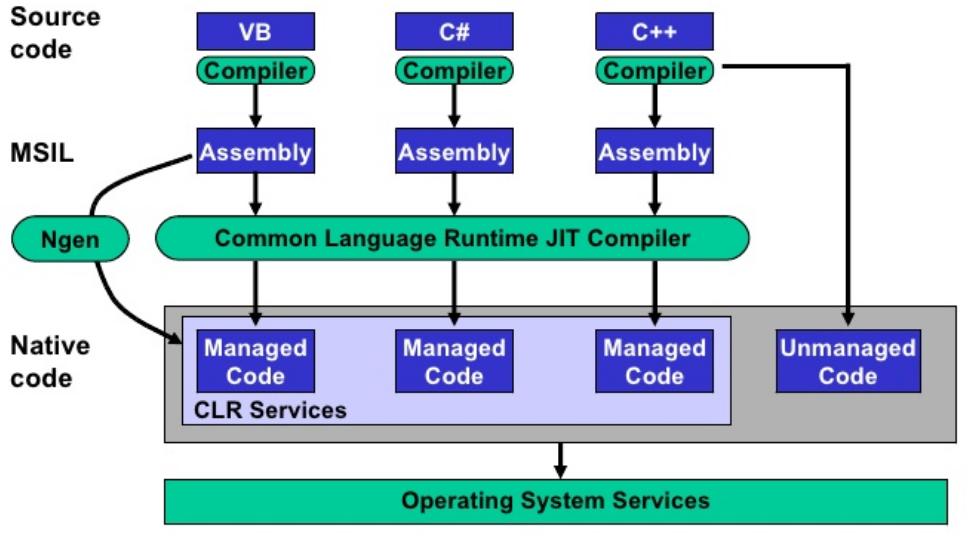

<!--

author:   Sebastian Zug & André Dietrich
email:    zug@ovgu.de   & andre.dietrich@ovgu.de
version:  0.0.1
language: de
narrator: Deutsch Female

import: https://raw.githubusercontent.com/liaScript/rextester_template/master/README.md

-->

# Vorlesung Softwareentwicklung - 1 - Grundlagen

**Fragen an die heutige Veranstaltung ...**

*

---------------------------------------------------------------------
Link auf die aktuelle Vorlesung im Versionsmanagementsystem GitHub

https://github.com/liaScript/CsharpCourse/blob/master/01_EinordnungCsharp.md

Die interaktive Form ist unter diese Link zu finden ->
[LiaScript Vorlesung 1](https://liascript.github.io/course/?https://raw.githubusercontent.com/liaScript/CsharpCourse/master/01_EinordnungCsharp.md#1)
---------------------------------------------------------------------

## 1. Programmierparadigmen

{{0-1}}
Ein Programmierparadigma bezeichnet die gedankliche, konzeptionelle Grundstruktur
die der Darstellung des Problems in Code zugrunde liegt.

{{0-1}}
Das Programmierparadigma:

{{0-1}}
* beschreibt den fundamentalen Programmierstil bzw. Eigenschaften von Programmiersprachen
* unterscheidet sich durch die Repräsentation der statischen und dynamischen Programmelemente
* Paradigma beruht auf Sprache, aber auch auf individuellem Stil.

{{1-4}}
<!--
style="width: 95%; max-width: 960px; display: block; margin-left: auto; margin-right: auto;"
-->
````````````
                                 Programmierparadigmen
                                           ┃
                         ┏━━━━━━━━━━━━━━━━━┻━━━━━━━━━━━━━━━━━━━━━━┓
            Imperative Programmierung                 Deklarative Programmierung
                       ┃                                          ┃
      ┏━━━━━━━━━━━━━━━━╋━━━━━━━━━━━━━━━┓                 ┏━━━━━━━━╋━━━━━━━━━┓
 Strukturiert    Prozedural    Objektorientiert    Funktional   Logisch    ....  

````````````
{{1-2}}
**Imperative Programmierung** ... Quellcode besteht aus einer Folge von Befehlen die in einer festen Reihenfolge abgearbeitet werden.

{{1-2}}
     + **Strukturierte  Programmierung** ... Verzicht bzw. Einschränkung des `Goto` Statements zugunsten von Kontrollstrukturen (Kernkonzepte: Verzweigungen,
     Schleifen)

{{1-2}}
     + **Prozedurale Programmierung** ... Zerlegung von Programmen in überschaubare Teile, die durch eine definierte Schnittstelle aufrufbar sind (Kernkonzepte: Funktion, Prozedur, Routine, Unterprogramm)

{{1-2}}
     + **Objektorientierte Programmierung** ... Kapselung von Daten und Funktionen in einem Konzept

{{1-2}}
**Deklarative Programmierung** ... • Es wird kein Lösungsweg implementiert, sondern nur angegeben, was gesucht ist.

{{1-2}}
     + **Funktionale Sprachen** ... Abbildung der Algorithmen auf funktionale Darstellungen

{{1-2}}
```haskell    prologBeispiel.cs
% Definition einer Funktion
fac 0 = 1
fac n = n * fac (n-1)

% Berechnung eines Ergebnisses
main = print (fac 42)
```
@Rextester.eval(@Haskell)

{{1-2}}
     + **Logische Sprachen** ... Ableitung einer Lösung aus einer Menge von Fakten

{{1-2}}
```prolog    prologBeispiel.cs
% Prolog Text mit Fakten
mann(adam).
mann(tobias).
mann(frank).
frau(eva).
frau(daniela).
frau(ulrike).
vater(adam,tobias).
vater(tobias,frank).
vater(tobias,ulrike).
mutter(eva,tobias).
mutter(daniela,frank).
mutter(daniela,ulrike).
%       ?- mann(tobias).
```
@Rextester.eval(@Prolog)

{{1-2}}
     + **Abfragesprachen** ... Generierung einer Auswahl von Daten

{{1-2}}
     + **Nebenläufig**, **Reflektiv**, **Generisch**, ...

{{2}}
Viele Sprachen unterstützen verschiedene Elemente der Paradigmen, bzw. entwickeln
sich in dieser Richtung weiter.

{{2}}
| Sprache | Paradigmen                                          |
| ------- | --------------------------------------------------- |
| Pascal  | imperativ, prozedural                               |
| C       | imperativ, prozedural                               |
| Ada     | imperativ, objektorientiert                         |
| Java    | imperativ, objektorientiert                         |
| Python  | imperativ, objektorientiert, funktional             |
| C#      | imperativ, prozedural, objektorientiert, funktional |                                                    |
| C++     | imperativ, prozedural, objektorientiert, funktional |
| Haskell | deklarativ, funktional                              |
| Prolog  | deklarativ, Logisch                                 |
| SQL     | deklarativ, Abfragesprache                          |

{{3}}
"Das ist ja alles gut und schön, aber ich ich bin C Programmierer"

{{3}}
> **Anti-Pattern Golden Hammer**: *if all you have is a hammer, everything looks like a nail.*

## 2. --- Warum also C#

C# wurde unter dem Codenamen *Cool* entwickelt, vor der Veröffentlichung aber
umbenannt. Der Name C Sharp leitet sich vom Zeichen Kreuz (♯, englisch sharp)
der Notenschrift ab, was dort für eine Erhöhung des Grundtons um einen Halbton
steht. C sharp ist also der englische Begriff für den Ton *cis* (siehe
Anspielung auf C++)

C#

+ ist eine moderne und durchdachte Sprache
+ enthält Elemente vieler verschiedener Paradigmen
+ ist plattformunabhängig
+ bietet eine breite Sammlung von Bibliotheken
+ integriert Bibliotheken und Konzepte für die GUI-Programmierung
+ kann mit anderen Sprachen über .NET interagieren
+ unterstützt Multi-Processing problemlos
+ ist typsicher
+ ...

### Historie

| Jahr | Version .NET     | Version C# | Ergänzungen                                                                                                                                                 |
| ---- | ---------------- | ---------- | ----------------------------------------------------------------------------------------------------------------------------------------------------------- |
| 2002 | 1.0              | 1.0        |                                                                                                                                                             |
| 2006 | 3.0              | 2.0        | Generics, Anonyme Methoden, Iteratoren, Private setters, Delegates                                                                                          |
| 2007 | 3.5              | 3.0        | Implizit typisierte Variablen, Objekt- und Collection-Initialisierer, Automatisch implementierte Properties, LINQ, Lambda Expressions                       |
| 2010 | 4.0              | 4.0        | Dynamisches Binding, Benannte und optionale Argumente, Generische Co- und Kontravarianz                                                                     |
| 2012 | 4.5              | 5.0        | Asynchrone Methoden                                                                                                                                         |
| 2015 | 4.6              | 6.0        | Exception Filters, Indizierte Membervariablen und Elementinitialisierer, Mehrzeilige String-Ausdrücke, Implementierung von Methoden mittels Lambda-Ausdruck |
| 2017 | 4.6.2/ .NET Core | 7.0        | Mustervergleiche (Pattern matching),  Binärliterale 0b..., Tupel                                                                                    |

Aktuell: Die Version C# 8.0 ist angekündigt und einige Sprachfeatures bereits publiziert ([Link](https://devblogs.microsoft.com/dotnet/building-c-8-0/))

### Konzepte und Einbettung

{{0-1}}
**Compilierung unter C** (zum Vergleich)

{{0-1}}
<!-- width="80%" --> [^1]

{{1}}
**.NET**

{{1-2}}
> *.NET Framework ist eine __Ausführungsumgebung__ für die Laufzeit, die Apps für*
> *.NET Framework verwaltet. Sie besteht aus der __Common Language Runtime__, die*
> *Speicherverwaltung und andere Systemdienste bereitstellt, und einer*
> *umfangreichen __Klassenbibliothek__, die Programmierern stabilen, zuverlässigen*
> *Code für alle wesentlichen Bereiche der App-Entwicklung zur Verfügung stellt.* [MSNET]

{{1-2}}
<!-- width="70%" --> [Bhogayta]

{{1-2}}
* ASP.NET ... ist ein Web Application Framework, mit dem sich dynamische Webseiten, Webanwendungen und Webservices entwickeln lassen.
*  ActiveX Data Objects (ADO) ... ist eine auf ActiveX basierende Schnittstelle zum Datenzugriff auf Datenbanken und tabellenartige Datenquellen über eine einheitliche API.
* Windows Forms ... ist ein GUI-Toolkit des Microsoft .NET Frameworks. Es ermöglicht die Erstellung grafischer Benutzeroberflächen (GUIs) für Windows.


{{2-3}}
*Frage: Des öfteren wird von .NET Framework und .NET Core gesprochen, was sind die Unterschiede?*

{{2-3}}
> *Think of .NET Core as a subset of .NET Framework that makes sense to be*
> *cross-platform, redesigned in a much more granular fashion. Microsoft .NET*
> *Core is the future of .NET and we are happy it has become open source now.* [BlogNET]

{{3-4}}
*Frage: Was sind Alternativen?*

{{3-4}}
Mono, DotGNU und Portable.NET sind Implementierungen der CLI.

{{4-5}}
*Frage:  Was bedeutet das für den "Build"-Prozess?*

{{4-5}}
<!-- width="90%" --> [Bhogayta]

{{4-5}}
Die spezifischen Compiler der einzelnen .NET Sprachen (C#. Visual Basic, F#) bilden den Quellcode
auf einen Zwischencode ab. Die Common Language Infrastructure (CLI) ist eine von ISO und ECMA
standardisierte offene Spezifikation (technischer Standard), die ausführbaren
Code und eine Laufzeitumgebung beschreibt.

{{4-5}}
```cil    CLI
.assembly HalloWelt { }
.assembly extern mscorlib { }
.method public static void Main() cil managed
{
    .entrypoint
    .maxstack 1
    ldstr "Hallo Welt!"
    call void [mscorlib]System.Console::WriteLine(string)
    ret
}
```

### Abgrenzung zu Java und C++


void *memcpy (void* destination, const void* source, size_t num);


## 4. Es wird konkret ... Hello World

```csharp    HelloWorld.cs
using System;

namespace Rextester // This namespace is necessary for Rextester API !
{
    public class Program
    {
        public static void Main(string[] args)
        {
            Console.WriteLine("Hello, world!");
        }
    }
}
```

*A) LiaScript Umgebung*

```csharp    HelloWorld_rex.cs
using System;

namespace Rextester // This namespace is necessary for Rextester API !
{
    public class Program
    {
        public static void Main(string[] args)
        {
            Console.WriteLine("Hello, world!");
        }
    }
}
```
@Rextester.eval(@CSharp)


*B) Mono Kommandozeile*

``` bash @output
▶ mcs helloWorld.cs

▶ ls
helloWorld.cs  helloWorld.exe

▶ mono helloWorld.exe
Hello, world!
```

Eine ausführliche Hilfe findet sich unter https://www.mono-project.com/docs/getting-started/mono-basics/
(Allerdings ist dort ein Typo passiert statt des Mono-Compilers wird der .NET
Compiler aufgerufen. Bitte genau hinschauen.)

*C) Monodeveloper*

<!-- width="80%" --> [ref](#8) [^3]


*D) .NET Kommandozeile*


*E) .NET Visual Code*


Evaluieren Sie auch den interaktiven Modus mit gsharp, csharp oder dem .NET
Interpreter unter Visual Studio.


## Anhang

**Referenzen**

[BlogNET] "What’s the difference Between .NET Core vs .NET Framework", https://www.amarinfotech.com/difference-between-net-core-2-0-vs-net-framework.html

[Thong] J. Thong, "What happens when you type GCC main.c", [Link](https://medium.com/@vietkieutie/what-happens-when-you-type-gcc-main-c-2a136896ade3)

[WikiCLI] Wikipedia "Visual overview of the Common Language Infrastructure (CLI)", Autor *Jarkko Piiroinen*

[MSNET] "Erste Schritte mit .NET Framework", [Link](https://docs.microsoft.com/de-de/dotnet/framework/get-started/)

[Bhogayta]  S. Bhogayta, "Introduction To Dotnet", [Link](https://www.slideshare.net/samirbhogayta/introduction-to-dotnet)

**Autoren**

Sebastian Zug, André Dietrich
