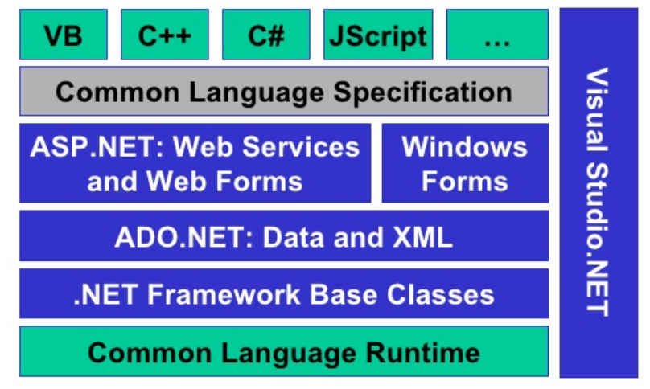
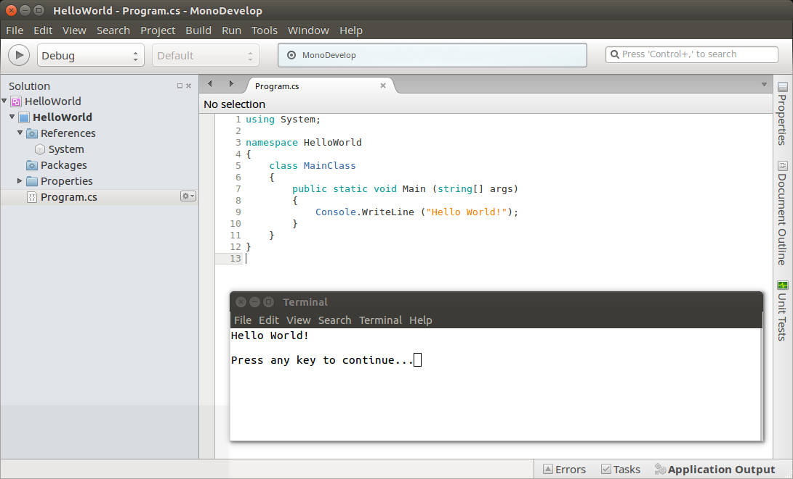

<!--

author:   Sebastian Zug & André Dietrich
email:    zug@ovgu.de   & andre.dietrich@ovgu.de
version:  0.0.1
language: de
narrator: Deutsch Female

import: https://raw.githubusercontent.com/liaScript/rextester_template/master/README.md

-->

# Vorlesung Softwareentwicklung - 1 - Einordnung der Sprache C#

Link auf die aktuelle Vorlesung im Versionsmanagementsystem GitHub

https://github.com/liaScript/CsharpCourse/blob/master/01_EinordnungCsharp.md

Die interaktive Form ist unter diese Link zu finden ->
[LiaScript Vorlesung 1](https://liascript.github.io/course/?https://raw.githubusercontent.com/liaScript/CsharpCourse/master/01_EinordnungCsharp.md#1)

---------------------------------------------------------------------

## Kontrollfragen

*1. Welches Programmierparadigma findet bei folgendem Codefragment Anwendung:*

```python    
print("Berechne die Summe von Zahlenreihen")
max_value = 10
sum = 0
for i in range(0, max_value + 1):
    sum += i
    print("{:>2d}".format(i) + "{:>5d}".format(sum))
```
@Rextester.eval(@Python)

[(X)] Imperative Programmierung
[( )] Logische Programmierung
[( )] Objektorientierte Programmierung
[[?]] Wohl in der Vorlesung nicht aufgepasst? :-)

---------------------------------------------------------------------

*2. .... hier folgen jetzt Ihre Fragen*

---------------------------------------------------------------------

## 1. Programmierparadigmen

{{0-1}}
Ein Programmierparadigma bezeichnet die gedankliche, konzeptionelle Grundstruktur
die der Darstellung des Problems in Code zugrunde liegt.

{{0-1}}
Das Programmierparadigma:

{{0-1}}
* beschreibt den fundamentalen Programmierstil bzw. Eigenschaften von Programmiersprachen
* unterscheidet sich durch die Repräsentation der statischen und dynamischen Programmelemente
* Paradigma beruht auf Sprache, aber auch auf individuellem Stil.

{{1-4}}
<!--
style="width: 85%; max-width: 860px; display: block; margin-left: auto; margin-right: auto;"
-->
````````````
                         Programmierparadigmen
                                  ┃
                ┏━━━━━━━━━━━━━━━━━┻━━━━━━━━━━━━━━━━━┓
    Imperative Programmierung         Deklarative Programmierung
                ┃                                   ┃
      ┏━━━━━━━━━┻━━━━━━━━┓                 ┏━━━━━━━━┻━━━━━━━━━┓
  Prozedural    Objektorientiert    Funktional             Logisch  

 Strukturierte Programmierung, Aspektorientierte Programmierung,
 Generative Programmierung, Generische Programmierung

````````````

                                       {{1-2}}
*******************************************************************************
* **Imperative Programmierung** ... Quellcode besteht aus einer Folge von Befehlen die in einer festen Reihenfolge abgearbeitet werden.

    + **Prozedurale Programmierung** ... Zerlegung von Programmen in überschaubare Teile, die durch eine definierte Schnittstelle aufrufbar sind (Kernkonzepte: Funktion, Prozedur, Routine, Unterprogramm)

    + **Objektorientierte Programmierung** ... Kapselung von Daten und Funktionen in einem Konzept

*******************************************************************************

                                       {{2-3}}
*******************************************************************************
* **Deklarative Programmierung** ... • Es wird kein Lösungsweg implementiert, sondern nur angegeben, was gesucht ist.

     + **Funktionale Sprachen** ... Abbildung der Algorithmen auf funktionale Darstellungen

```haskell  Haskell.hs
-- Definition einer Funktion
fac 0 = 1
fac n = n * fac (n-1)

-- Berechnung eines Ergebnisses
main = print (fac 42)
```
@Rextester.Haskell

     + **Logische Sprachen** ... Ableitung einer Lösung aus einer Menge von Fakten, Generierung einer Auswahl von Daten

```prolog    Prolog.pro
% Prolog Text mit Fakten
mann(adam).
mann(tobias).
mann(frank).
frau(eva).
frau(daniela).
frau(ulrike).
vater(adam,tobias).
vater(tobias,frank).
vater(tobias,ulrike).
mutter(eva,tobias).
mutter(daniela,frank).
mutter(daniela,ulrike).

grossvater(X,Y) :-
     vater(X,Z),
     vater(Z,Y).
```
```prolog Query
grossvater(adam,frank).
```
@Rextester._eval_(@uid,@Prolog,false,`@input(1)`)
*******************************************************************************


                                      {{3-4}}
*******************************************************************************

* **Weiter Konzepte** ... keine Spezifische Zuordenbarkeit

     + **Strukturierte  Programmierung** ... Verzicht bzw. Einschränkung des `Goto` Statements zugunsten von Kontrollstrukturen (Kernkonzepte: Verzweigungen,
     Schleifen)

     + **Nebenläufig**, **Reflektiv**, **Generisch**, ...

*******************************************************************************

                                    {{4-5}}
*******************************************************************************
Viele Sprachen unterstützen verschiedene Elemente der Paradigmen, bzw. entwickeln
sich in dieser Richtung weiter.

| Sprache | imperativ                    | deklarativ |
| ------- | ---------------------------- | ---------- |
| Pascal  | prozedural                   |            |
| C       | prozedural                   |            |
| Ada     | objektorientiert             |            |
| Java    | objektorientiert             |            |
| Python  | objektorientiert,            | funktional |
| C#      | prozedural, objektorientiert | funktional |
| C++     | prozedural, objektorientiert | funktional |
| Haskell |                              | funktional |
| Prolog  |                              | Logisch    |
| SQL     |                              | Logisch    |

Viele Paradigmen in einer Sprache am Beispiel eines Python Programmes ...
Berechnen Sie die Summe der Ziffern eines Arrays.

```python    
my_list = range(0,10)

# imperative
result = 0
for x in my_list:
    result += x
print("Result in imperative style      :" + str(result))

# procedural
result = 0
def do_add(list_of_numbers):
    result = 0
    for x in my_list:
        result += x
    return result
print("Result in procedural style      :" + str(do_add(my_list)))

# object oriented
class MyClass(object):
    def __init__(self, any_list):
        self.any_list = any_list
        self.sum = 0
    def do_add(self):
      self.sum = sum(self.any_list)
create_sum = MyClass(my_list)
create_sum.do_add()
print("Result in object oriented style :" + str(create_sum.sum))

# functional
import functools
result = functools.reduce(lambda x, y: x + y, my_list)
print("Result in functional style      :" + str(result))

```
@Rextester.eval(@Python)

*******************************************************************************

                                  {{5}}
*******************************************************************************
"Das ist ja alles gut und schön, aber ich ich bin C Programmierer!"

{{3}}
> **Anti-Pattern "Golden Hammer"**:
> *if all you have is a hammer, everything looks like a nail.*

Lösungsansätze:
* Individuell - Hinterfragen des Vorgehens und der Intuition, bewusste Weiterentwicklung des eigenen Horizontes (ohne auf jeden Zug auf zuspringen)
* im Team - Teilen Sie Ihre Erfahrungen im Team / der Community, besetzen Sie Teams mit Mitarbeitern unterschiedlichen Backgrounds (Technical Diversity)

Weitere Diskussion unter: https://sourcemaking.com/antipatterns/golden-hammer

*******************************************************************************

## 2. --- Warum also C#?

C# wurde unter dem Codenamen *Cool* entwickelt, vor der Veröffentlichung aber
umbenannt. Der Name C Sharp leitet sich vom Zeichen Kreuz (♯, englisch sharp)
der Notenschrift ab, was dort für eine Erhöhung des Grundtons um einen Halbton
steht. C sharp ist also der englische Begriff für den Ton *cis* (siehe
Anspielung auf C++)

C#

+ ist eine moderne und durchdachte Sprache
+ enthält Elemente vieler verschiedener Paradigmen
+ ist plattformunabhängig
+ bietet eine breite Sammlung von Bibliotheken
+ integriert Bibliotheken und Konzepte für die GUI-Programmierung
+ kann mit anderen Sprachen über .NET interagieren
+ unterstützt Multi-Processing problemlos
+ ist typsicher
+ ...

### Historie

| Jahr | Version .NET     | Version C# | Ergänzungen                                                                                                                                                 |
| ---- | ---------------- | ---------- | ----------------------------------------------------------------------------------------------------------------------------------------------------------- |
| 2002 | 1.0              | 1.0        |                                                                                                                                                             |
| 2006 | 3.0              | 2.0        | Generics, Anonyme Methoden, Iteratoren, Private setters, Delegates                                                                                          |
| 2007 | 3.5              | 3.0        | Implizit typisierte Variablen, Objekt- und Collection-Initialisierer, Automatisch implementierte Properties, LINQ, Lambda Expressions                       |
| 2010 | 4.0              | 4.0        | Dynamisches Binding, Benannte und optionale Argumente, Generische Co- und Kontravarianz                                                                     |
| 2012 | 4.5              | 5.0        | Asynchrone Methoden                                                                                                                                         |
| 2015 | 4.6              | 6.0        | Exception Filters, Indizierte Membervariablen und Elementinitialisierer, Mehrzeilige String-Ausdrücke, Implementierung von Methoden mittels Lambda-Ausdruck |
| 2017 | 4.6.2/ .NET Core | 7.0        | Mustervergleiche (Pattern matching),  Binärliterale 0b..., Tupel                                                                                    |

Aktuell: Die Version C# 8.0 ist angekündigt und einige Sprachfeatures bereits publiziert ([Link](https://devblogs.microsoft.com/dotnet/building-c-8-0/))

### Konzepte und Einbettung

                                        {{0-1}}
********************************************************************************

**Compilierung unter C** (zum Vergleich)

<!-- width="80%" -->

********************************************************************************

                                        {{1-2}}
********************************************************************************

**.NET**

> *.NET Framework ist eine __Ausführungsumgebung__ für die Laufzeit, die Apps für*
> *.NET Framework verwaltet. Sie besteht aus der __Common Language Runtime__, die*
> *Speicherverwaltung und andere Systemdienste bereitstellt, und einer*
> *umfangreichen __Klassenbibliothek__, die Programmierern stabilen, zuverlässigen*
> *Code für alle wesentlichen Bereiche der App-Entwicklung zur Verfügung stellt.* [MSNET](#9)

<!-- width="70%" --> [Bhogayta](#9)

* ASP.NET ... ist ein Web Application Framework, mit dem sich dynamische Webseiten, Webanwendungen und Webservices entwickeln lassen.
*  ActiveX Data Objects (ADO) ... ist eine auf ActiveX basierende Schnittstelle zum Datenzugriff auf Datenbanken und tabellenartige Datenquellen über eine einheitliche API.
* Windows Forms ... ist ein GUI-Toolkit des Microsoft .NET Frameworks. Es ermöglicht die Erstellung grafischer Benutzeroberflächen (GUIs) für Windows.

********************************************************************************


                                        {{2-3}}
********************************************************************************

*Frage: Des öfteren wird von .NET Framework und .NET Core gesprochen, was sind die Unterschiede?*

> *Think of .NET Core as a subset of .NET Framework that makes sense to be*
> *cross-platform, redesigned in a much more granular fashion. Microsoft .NET*
> *Core is the future of .NET and we are happy it has become open source now.* [BlogNET](#9)

********************************************************************************

                                        {{3-4}}
********************************************************************************
*Frage: Was sind Alternativen?*

Mono, DotGNU und Portable.NET sind Implementierungen der CLR.

********************************************************************************

                                      {{4-5}}
********************************************************************************
*Frage:  Was bedeutet das für den "Build"-Prozess?*

<!-- width="90%" --> [Bhogayta](#9)

Die spezifischen Compiler der einzelnen .NET Sprachen (C#. Visual Basic, F#) bilden den Quellcode
auf einen Zwischencode ab. Die Common Language Infrastructure (CLI) ist eine von ISO und ECMA
standardisierte offene Spezifikation (technischer Standard), die ausführbaren
Code und eine Laufzeitumgebung beschreibt.

```cil    CLI
.assembly HalloWelt { }
.assembly extern mscorlib { }
.method public static void Main() cil managed
{
    .entrypoint
    .maxstack 1
    ldstr "Hallo Welt!"
    call void [mscorlib]System.Console::WriteLine(string)
    ret
}
```

Ein Assembly umfasst:
* das Assemblymanifest, das die Assemblymetadaten enthält.
* die Typmetadaten.
* den CIL-Code
* Links auf mögliche Ressourcen.

Ein Assembly bildet:
* bildet eine Sicherheitsgrenze. Eine Assembly ist die Einheit, bei der Berechtigungen angefordert und erteilt werden. Weitere Informationen über Sicherheitsgrenzen bei Assemblys finden Sie unter Überlegungen zur Assemblysicherheit.
* bildet eine Typgrenze. Die Identität jedes Typs enthält den Namen der Assembly, in der dieser sich befindet. Wenn der Typ MyType in den Gültigkeitsbereich einer Assembly geladen wird, ist dieser nicht derselbe wie der Typ MyType, der in den Gültigkeitsbereich einer anderen Assembly geladen wurde.
* bildet eine Versionsgrenze. Die Assembly ist die kleinste, in verschiedenen Versionen verwendbare Einheit in der Common Language Runtime. Alle Typen und Ressourcen in derselben Assembly bilden eine Einheit mit derselben Version. Das Assemblymanifest beschreibt die von Ihnen für abhängige Assemblys angegebenen Versionsabhängigkeiten. Weitere Informationen über die Versionen finden Sie unter Assemblyversionen.
* bildet eine Bereitstellungseinheit. Beim Starten einer Anwendung müssen nur die von der Anwendung zu Beginn aufgerufenen Assemblys vorhanden sein. Andere Assemblys, z. B. Lokalisierungsressourcen oder Assemblys mit Hilfsklassen, können bei Bedarf abgerufen werden. Dadurch ist die Anwendung beim ersten Herunterladen einfach und schlank. Weitere Informationen über die Bereitstellung von Assemblys finden Sie unter Bereitstellung von Anwendungen.
* stellt die Einheit dar, in der die parallele Ausführung unterstützt wird. Weitere Informationen über das Ausführen mehrerer Versionen einer Assembly finden Sie unter Assemblys und parallele Ausführung.

********************************************************************************

                                  {{5-6}}
********************************************************************************
*Frage:  Was passiert unter der Haube der CLR?*

Für die *Managed Code Execution* stellt die CLR ein entsprechendes Set von Komponenten
bereit:

* Class Loader ... Einlesen der Assemblies in die CLR Ausführungsumgebung unter
Beachtung der Sicherheits-, Versions-, Typinformationen usw.
* Just-in-Time Compiler ... Abbildung der CIL auf den ausführbaren Maschinencode
* Code Execution und Debugging
* Garbage Collection ... der GC ist für die Bereinigung von Referenz-Objekten auf
dem Heap verantwortlich und wird von der CLR zu nicht-deterministischen Zeitpunkten
gestartet.

********************************************************************************

### Abgrenzung zu Java

vgl. Vortrag von Mössenböck ([link](https://www.dcl.hpi.uni-potsdam.de/teaching/componentVl05/slides/Net_VL2_01_Java-CS-Moessenboeck.pdf))

|                  | Java                                        | C#                                         |
| ---------------- | ------------------------------------------- | ------------------------------------------ |
| Veröffentlichung | 1995                                        | 2001                                       |
| Plattform        | (Java) Unix/Linux,  Windows, MacOS, Android | (.NET) Windows, Linux, Android, iOS, MacOS |
| VM               | Java-VM                                     | CLR                                        |
| Zwischencode     | Java-Bytecode                               | CIL                                        |
| JIT              | per Methoden                                | per Methode / gesamt                       |
| Komponenten      | Beans                                       | Assemblies                                           |
| Versionierung    | nein                                        | ja                                         |
| Leitidee         | Eine Sprache auf vielen Plattformen         | Viele Sprachen auf einer Plattformen       |

Beim Punkt "Leitidee" muss man kritisch fragen ob auf der C# Seite die
Programmiersprache oder das .NET Framework gemeint ist!

## 3. Es wird konkret ... Hello World

Die organisatorischen Schlüsselkonzepte in C# sind: **Programme**, **Namespaces**,
**Typen**, **Member** und **Assemblys**. C#-Programme bestehen aus mindestens einer
Quelldatei, von denen mindestens eine `Main` als einen Methodennamen hat
Programme deklarieren Typen, die Member enthalten, und können in Namespaces
organisiert werden.

Wenn C#-Programme kompiliert werden, werden sie physisch in Assemblys verpackt.
Assemblys haben diese unter Windows Betriebssystemen die Erweiterung .exe oder
.dll, je nachdem, ob sie Anwendungen oder Bibliotheken implementieren.

*A) LiaScript Umgebung*

```csharp    HelloWorld_rex.cs
using System;

namespace Rextester // This namespace is necessary for Rextester API !
{
    public class Program
    {
        public static void Main(string[] args)
        {
            Console.WriteLine("Hello, world!");
        }
    }
}
```
@Rextester.eval(@CSharp)


*B) Mono Kommandozeile*

Die Webseite des Mono Projekts ist unter [MonoProject](https://www.mono-project.com/) zu finden.

```csharp    HelloWorld.cs
using System;
namespace HelloWorld
{
    class Hello
    {
        static void Main()
        {
            Console.WriteLine("Hello World!");

            // Keep the console window open in debug mode.
            Console.WriteLine("Press any key to exit.");
            Console.ReadKey();
        }
    }
}
```

Eine ausführliche Hilfe findet sich unter https://www.mono-project.com/docs/getting-started/mono-basics/
(Allerdings ist dort ein Typo passiert statt des Mono-Compilers wird der .NET
Compiler aufgerufen. Bitte genau hinschauen.)

``` bash @output
▶ mcs --about
The Turbo C# compiler is Copyright 2001-2011, Novell, Inc. 2011-2016 Xamarin Inc, 2016-2017 Microsoft Corp

The compiler source code is released under the terms of the
MIT X11 or GNU GPL licenses

▶ mcs HelloWorld.cs

▶ ls
HelloWorld.cs  HelloWorld.exe

▶ mono HelloWorld.exe
Hello, world!
Press any key to exit.

▶ ikdasm HelloWorld.exe
...

```

Eine gute Hilfestellung zur Analyse von Assemblies findet sich unter [codeproject](https://www.codeproject.com/Articles/362076/Understanding-Common-Intermediate-Language-CIL)


*C) .NET Kommandozeile*

Das .NET Core Framework kann unter [.NET](https://dotnet.microsoft.com/download/linux-package-manager/rhel/sdk-current)
für verschiedene Betriebssystem heruntergeladen werden. Das SDK umfasst sowohl die
Bibliotheken, Laufzeitumgebung und Tools.

``` bash @output
▶ csc
Microsoft (R) Visual C# Compiler version 2.8.2.62916 (2ad4aabc)
Copyright (C) Microsoft Corporation. All rights reserved.
```

Leider muss dann wieder mono als Ausführungsumgebung herhalten, um mit der .NET
CLR zu arbeiten braucht es offenbar immer ein ganzes Projekt:

``` bash @output
▶ dotnet new console

▶ tree
.
├── bin
│   └── Debug
│       └── netcoreapp2.2
│           ├── dotnet.deps.json
│           ├── dotnet.dll
│           ├── dotnet.pdb
│           ├── dotnet.runtimeconfig.dev.json
│           └── dotnet.runtimeconfig.json
├── dotnet.csproj
├── obj
│   ├── Debug
│   │   └── netcoreapp2.2
│   │       ├── dotnet.AssemblyInfo.cs
│   │       ├── dotnet.AssemblyInfoInputs.cache
│   │       ├── dotnet.assets.cache
│   │       ├── dotnet.csprojAssemblyReference.cache
│   │       ├── dotnet.csproj.CoreCompileInputs.cache
│   │       ├── dotnet.csproj.FileListAbsolute.txt
│   │       ├── dotnet.dll
│   │       ├── dotnet.pdb
│   │       └── project.razor.json
│   ├── dotnet.csproj.nuget.cache
│   ├── dotnet.csproj.nuget.g.props
│   ├── dotnet.csproj.nuget.g.targets
│   └── project.assets.json
└── Program.cs

```

*C) .NET Visual Code*

Alternativ können Sie auch die Microsoft Visual Studio oder Visual Code Suite nutzen.
Diese kann man zum Beispiel auf unser gerade erstelltes Projekt anwenden


Evaluieren Sie auch den interaktiven Modus mit gsharp, csharp oder dem .NET
Interpreter unter Visual Studio.


*D) Monodeveloper*

<!-- width="80%" -->

## Anhang

**Referenzen**

[BlogNET] "What’s the difference Between .NET Core vs .NET Framework", https://www.amarinfotech.com/difference-between-net-core-2-0-vs-net-framework.html

[Thong] J. Thong, "What happens when you type GCC main.c", [Link](https://medium.com/@vietkieutie/what-happens-when-you-type-gcc-main-c-2a136896ade3)

[WikiCLI] Wikipedia "Visual overview of the Common Language Infrastructure (CLI)", Autor *Jarkko Piiroinen*

[MSNET] "Erste Schritte mit .NET Framework", [Link](https://docs.microsoft.com/de-de/dotnet/framework/get-started/)

[Bhogayta]  S. Bhogayta, "Introduction To Dotnet", [Link](https://www.slideshare.net/samirbhogayta/introduction-to-dotnet)

**Autoren**

Sebastian Zug, André Dietrich
