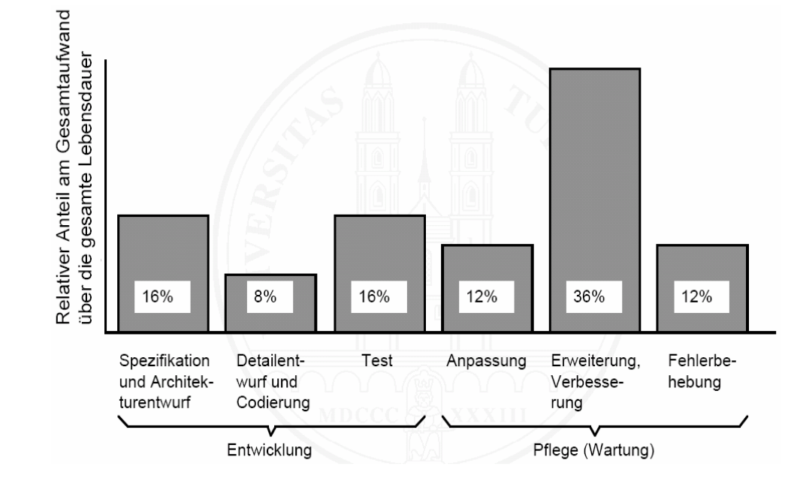
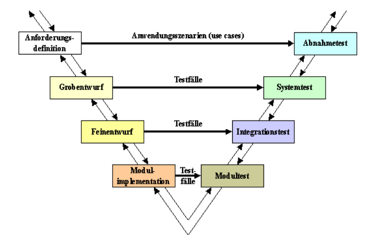

<!--

author:   Sebastian Zug & André Dietrich
email:    zug@ovgu.de   & andre.dietrich@ovgu.de
version:  0.0.1
language: de
narrator: Deutsch Female

import: https://raw.githubusercontent.com/liaScript/rextester_template/master/README.md

-->

# Vorlesung Softwareentwicklung - 1 - Softwareentwicklung als Prozess

**TU Bergakademie Freiberg - Sommersemester 2020**

Link auf die aktuelle Vorlesung im Versionsmanagementsystem GitHub

https://github.com/SebastianZug/CsharpCourse/blob/SoSe2020/01_Software.md

Die interaktive Form ist unter diese Link zu finden ->
[LiaScript Vorlesung 01](https://liascript.github.io/course/?https://raw.githubusercontent.com/SebastianZug/CsharpCourse/SoSe2020/01_Software.md#1)

---------------------------------------------------------------------

## 1. Softwareentwicklung


                                    {{0-1}}
*******************************************************************************

**Worum geht es, was ist "Software"?**

| Begriff               | Definitionsansatz                                                                                                                                |
| --------------------- | ------------------------------------------------------------------------------------------------------------------------------------------------ |
| Software als "Medium" | "Software war all das, was zum Funktionieren eines Computers notwendig, aber nicht Hardware ist."                                                |
|                       | "Software ist sinnlich nicht wahrnehmbar ... . Sie ist komplex und besteht aus umfangreichen Texten"                                             |
| Software als Ziel     | "Software macht den Computer nutzbar"                                                                                                            |
|                       | "Software ermöglicht die Abbildung von Prozessen auf einem Rechner"                                                                              |
| Software als Prozess  | "Software ist die Idee, die Lösung, die man sich für ein Problem ausgedacht hat, das Verfahren, das helfen soll ..."                             |
|                       | "Dabei sind Computerprogramme nicht nur als Beschreibung der auszuführenden Funktionen ... Vereinbarung zur Nutzung, ... Dokumentationsinhalte." |


*******************************************************************************

                                    {{1-2}}
*******************************************************************************

**Wie sieht der Lebenszyklus einer Software aus?**

> Ein Software-Lebenszyklus beschreibt den gesamten Prozess der Herstellung und
> des Betriebs Implementierung ausgehend von der kundenseitigen Problemstellung
> über die Realisierung und den Betrieb bis hin zur Ablösung der Software durch
> einen Nachfolger.

1. Problemstellung
2. Analyse Entwurf
3. Implementierung
4. Test
5. Markeinführung
6. Pflege/Wartung

Welche Querbeziehungen ("Während der Tests wird erkannt, dass die Implementierung Mängel aufweist.") zwischen den einzelenn Stufen sehen Sie?

**Welche Definitionen ergeben sich daraus für den Entwicklungsprozess?**

*Tessen Freund: Software Engineering durch Modellierung wissensintensiver Entwicklungsprozesse, S. 25*
[Link google books](http://books.google.de/books?id=2HPldlxhBOkC&pg=PA25#v=onepage&q&f=false)

> Unter dem Begriff Softwareentwicklung versteht man die Konzeption
> und standardisierte Umsetzung von Softwareprojekten und die damit
> verbundenen Prozesse.

... oder insbesondere auf große Projekte zielend

> „Zielorientierte Bereitstellung und systematische Verwendung von Prinzipien,
> Methoden und Werkzeugen für die arbeitsteilige, ingenieurmäßige Entwicklung
> und Anwendung von umfangreichen Softwaresystemen.“ [Balzert, S. 36]


*******************************************************************************

                                     {{2}}
*******************************************************************************

**Was heißt das, "ingenieurmäßig" oder "standardisiert"?**

Gemäß ISO 9126 gibt es die sechs folgenden Qualitätsmerkmale für
Softwareprodukte:

<!-- width="60%" --> [Wiki9126](#7)

Nachfolger ISO 25010: Zusätzlich

* Kompatibilität
* Sicherheit

Die Norm kann als eine Art Checkliste verstanden werden.


*******************************************************************************

## 2. Und warum der ganze Aufwand?

                                       {{0-3}}
*******************************************************************************


Steigende Komplexität der Softwareprodukte ...

<!-- width="80%" --> [Weforum](#7)


<!-- width="80%" --> [Lemburg1](#7)
*******************************************************************************


                                       {{1-3}}
*******************************************************************************


> **Merke:** Die Entwicklung kleiner Programme unterscheidet sich von der
> Entwicklung großer Programme!

| Kriterium                | Kleine Programme                                        | Große  Programme                                                           |
| ------------------------ | ------------------------------------------------------- | ------------------------------------------------------------------------- |
| Zeilenzahl               | bis zu ein paar 1000 Zeilen                             | Millionen von LOC                                                         |
| Einsatz                  | "Eigengebrauch"                                         | kommerzieller Einsatz von Dritten                                         |
| Anforderungsanalyse      | vage Idee                                               | präzise Spezifikation                                                     |
| Vorgehensmodell          | unstrukturiert                                          | strukturierter Entwicklungsprozesse                                       |
| Test und Validierung     | unter Realbedingungen am Endprodukt                     | Systematische Prüfstrategie                                               |
| Komplexität              | Überschaubare Zahl von Komponenten, Abhängigkeiten usw. | Hohe Komplexität, explizite Organisation in Struktureinheiten und Modulen |
| Dokumentation            | Fehlt in der Regel                                      | zwingend erforlderlich, permanente Pflege                                 |
| Planung und Organisation | Kaum Planung und Projektorganisation                    | zwingend erforderlich                                                     |

motiviert aus [Lemburg2](#7)

*******************************************************************************


                                       {{2-3}}
*******************************************************************************


**Fehler in der Softwareentwicklung**

1. Es wird mit der Codierung sofort angefangen.
2. Es wird nicht systematisch bzw. unzureichend getestet.
3. Eine Festlegung der Anforderungen/Qualitätsmerkmale fehlt
4. Standards und Richtlinien werden nicht beachtet
5. Die Dokumentation fehlt bzw. ist veraltet, unzureichend oder nicht adäquat
6. Ein Vorgehensmodell fehlt, bzw. wird nicht verfolgt
7. Eine Abnahme der Phasenergebnisse erfolgt nicht
8. Schlechte Namensvergabe wie z.B. File-, Klassen-, Methoden- und Variablennamen
9. Die Systemarchitektur ist nicht oder nur sehr umständlich erweiterbar (fehlende Datenkapselung, fehlende Modularität)
10. Die Schulung für die Software-Ersteller und -Anwender wird vernachlässigt oder als nichtnotwendig angesehen
11. Die Terminvorgaben sind unrealistisch
12. Begriffe werden nicht definiert
13. Die Auswahl der Werkzeuge/Methoden ist unzureichend vorbereitet

[Lemburg1](#7)

*******************************************************************************


                                     {{3-4}}
*******************************************************************************

**Ariane Jungfernflug**

V88 war die Startnummer des Erstflugs der europäischen Schwerlast-Trägerrakete
Ariane 5 am 4. Juni 1996. Die Rakete trug die Seriennummer 501. Der Flug endete
etwa 40 Sekunden nach dem Start, als die Rakete nach einer Ausnahmesituation in
der Software der Steuereinheit plötzlich vom Kurs abkam und sich kurz darauf
selbst zerstörte. Vier Cluster-Forschungssatelliten zur Untersuchung des
Erdmagnetfelds gingen dabei verloren (Schaden 290 Millionen Euro).

<!-- width="80%" --> [Golem](#7)

```ada
-- Overflow is correctly handled for the vertical component
L_M_BV_32 := TBD.T_ENTIER_16S((1.0 / C_M_LSB_BH) *
                                   G_M_INFO_DERIVE(T_ALG.E_BH));
if L_M_BV_32 > 32767 then
 P_M_DERIVE(T_ALG.E_BV) := 16#7FFF#;
elseif L_M_BV_32 < -32768 then
 P_M_DERIVE(T_ALG.E_BV) := 16#8000#;
else
 P_M_DERIVE(T_ALG.E_BV) := UC_16S_EN_16NS(TBD.T_ENTIER_16S(L_M_BV_32));
end if;

-- But not for the horizontal one
P_M_DERIVE(T_ALG.E_BH) := UC_16S_EN_16NS(TBD.T_ENTIER_16S
                                   ((1.0 / C_M_LSB_BH) *
                                   G_M_INFO_DERIVE(T_ALG.E_BH));
```

**Mars Rover**

Mars Pathfinder war ein US-amerikanischer Mars-Lander, der 1996 von der NASA eingesetzt wurde. Er brachte 1997 den ersten erfolgreichen Mars-Rover Sojourner auf die Marsoberfläche.

Bis zur letzten Übertragung am 27. September 1997 sendete Mars Pathfinder 16.500
von der Landeeinheit und 550 vom Rover aufgenommene Bilder sowie mehr als 15
chemische Analysen von Boden und Gestein zur Erde zurück, außerdem ausführliche
Wetterdaten. Als wahrscheinlichste Ursache für den Ausfall der Sonde wird
vermutet, dass die Batterien bei den tiefen Nachttemperaturen auf der Oberfläche
des Mars eingefroren sind.

<!-- width="80%" -->

http://people.cs.ksu.edu/~hatcliff/842/Docs/Course-Overview/pathfinder-robotmag.pdf


**Toll Connect**

Die Gebührenerhebung für LKW funktioniert auf deutschen Autobahn nach drei Methoden:
1. Buchung über das Internet vor Fahrtantritt gebucht werden,
2. Bezahlung an sogenannten „Mautstellen-Terminals“ oder
3. vollautomatische Abrechnung durch den Einsatz des GPS-Systems, die den Einbau von sogenannten On-Board-Units (OBU) erforderlich macht.

Mit dem Start des Lkw schaltet sich die OBU ein und lokalisiert die Position
des Fahrzeugs mittels Satellitennavigation. Die dabei gesammelten Daten werden
per Mobilfunk in ein Rechenzentrum übermittelt und dort für die
Rechnungsstellung verarbeitet.

Um eine Kontrolle sicherzustellen wurden  werden zum einen Lkws an den ca. 300 Kontrollbrücken fotografiert, zum anderen durch ca. 450 mobile Kontrollstellen überprüft. Die gewonnenen Daten werden mit den Daten im Zentralcomputer abgeglichen und ggf. entsprechende Maßnahmen eingeleitet.

Softwaretechnische Probleme bei der Einführung 2003:

* Die Maut-Terminals stürzten aufgrund von Software-Fehlern ab.
* Systemfehler in den Onboard-Units
* Schwierigkeiten bei der Systemintegration, dem korrekten Zusammenspiel aller Hardware- und Software-Komponenten.
* Fehler bei der Erfassung der Kennzeichen

*******************************************************************************

                                    {{5}}
*******************************************************************************
**Und im Kleinen ...**

Das folgende anschauliche Beispiel und die zugehörige Analyse entstammt der
Vorlesung "Software Engineering" von Prof. Dr. Schürr, TU Darmstadt.

```pascal
program SORT;
var a, b: file of integer;
    Feld: array [ 1 .. 10 ] of integer;
    i, j, k, l : integer
begin
    open ( a, ‘/Zahlen/Datei’);
    i := 1;
    while not eof ( a ) do
    begin
        read ( a, Feld [ i ] );
        i := i + 1
    end;
    l := i - 1;
    open ( b, ‘/Zahlen/Datei‘);
    for i := 2 to l do
    begin
        for j := l downto i do
            if Feld [ j - 1 ] > Feld [ j ] then
            begin
                k := Feld [j - 1];
                Feld [j - 1] := Feld[ j ];
                Feld [ j ] := k
            end;
        write ( b , Feld [ i - 1 ] )
    end
end SORT;
```

Welche Probleme sehen Sie im Hinblick auf die zuvor genannten Qualitätsmerkmale

*******************************************************************************

                                    {{5-6}}
| Aspekt                 | Bewertung |
| ---------------------- | --------- |
| Funktionalität         | ?         |
| Zuverlässigkeit        |           |
| Benutzbarkeit          |           |
| Effizienz              |           |
| Wartungsfreundlichkeit |           |
| Übertragbarkeit        |           |

                                     {{6}}
| Aspekt                 | Bewertung                                                                             |
| ---------------------- | ------------------------------------------------------------------------------------- |
| Funktionalität         | feste Feldlänge, das Programm stürzt bei mehr als 10 Einträgen ab                     |
| Zuverlässigkeit        | mehrfaches Öffnen ein und der selben Datei, keine Überprüfung der Exisitenz der Datei |
| Benutzbarkeit          | im Programmcode enthaltene Dateinamen, feste Feldlänge                                |
| Effizienz              | quadratischer Aufwand der Sortierung                                                  |
| Wartungsfreundlichkeit | fehlende Dokumentation, unverständliche Variablenbezeichner                           |
| Übertragbarkeit        |                                                                                       |

## 3. Struktuierung des Entwicklungsprozesses und Einordnung

**Warum ist Softwareentwicklung so herausfordernd**

*  Die Größe der zu lösenden Probleme. Software ist nicht einfacher, als die Probleme die sie löst. Je größer und schwieriger die Software, desto aufwendiger und schwieriger ist die Entwicklung.
* Die Tatsache, das Software ein immaterielles Produkt ist. Die Immaterialität macht das Arbeitenmit Software schwieriger als dasjenige mit materiellen Produkten vergleichbarer Komplexität, da die Risiken auch schwerer zu erkennen sind.
* Sich permanent verändernde Ziele aufgrund der Evolution. Schon das Bestimmen und Erreichen fixierter Ziele bei der Entwicklung ist keine leichte Aufgabe. Sich verändernde Ziele machen das ganze nochmal um eine Größenordnung schwieriger.
* Fehler infolge von Fehleinschätzungen zur Skalierung ("was im Kleinen geht, geht genauso im Großen"). Software-Entwicklung wird daher unbewusst meist als viel einfacher eingeschätzt, als sie tatsächlich ist. Dies führt zu unrealistischen Erwartungen und zu von Beginn an zu tiefen Kosten- und Terminschätzungen.
* Funktionierende Einzelkomponenten stellen noch lange kein funktionierendes Gesamtsystem sicher.

**Der Faktor Mensch**

<!-- width="60%" --> [Lemburg2](#7)

Hier ist eine koordinierte Interaktion und Kommunikation notwendig!


------------------------------------------------------------------------

**Ansätze zur Koodination**

*Erweitertes Wasserfallmodell*

<!-- width="60%" --> [Lemburg2](#7)

Eigenschaften des Wasserfallmodells:
* Aktivitäten sind in der vorgegebenen Reihenfolge und in der vollen Breite vollständigdurchzuführen.
* Am Ende jeder Aktivität steht ein fertiggestelltes Dokument, d.h. das Wasserfallmodell ist ein „dokumentgetriebenes“ Modell.
* Der Entwicklungsablauf ist sequentiell und als Top-down-Verfahren realisiert.
* Es ist einfach, verständlich und benötigt nur wenig Managementaufwand.

Vorteile:
* klare Abgrenzung der Phasen – einfache Möglichkeiten der Planung und Kontrolle
* bei stabilen Anforderungen und klarer Abschätzung von Kosten und Umfang ein sehr effektives Modell

Nachteile:
* Das Modell ist nur bei einfachen Projekten anwendbar – Unflexibel gegenüber Änderungen und im Vorgehen
* Frühes festschreiben der Anforderungen ist sehr problematisch und kann zu teuren Änderungenführen
* Fehler werden eventuell erst sehr spät erkannt und müssen mit erheblichen Aufwand  entfernt werden

------------------------------------------------------------------------
*V-Modell*

<!-- width="80%" --> [Lemburg2](#7)

Tätigkeitsbereiche des V-Modell: Softwareerstellung, Qualitätssicherung, Konfigurationsmanagement, Projektmanagement

Vorteile:
* Integrierte und detaillierte Darstellung von den Tätigkeitsbereichen
* Generisches Modell mit definierten Möglichkeiten zur Anpassung an projektspezifische Anforderungen
* Gut geeignet für große Projekte

Nachteile:
* Für kleine und mittlere Softwareentwicklungen führt das V-Modell zu einem unnötigen Overhead
* Die im V-Modell definierten Rollen (bis zu 25) sind für gängige Softwareentwicklungen nicht realistisch
* explizite Werkzeuge notwendig

------------------------------------------------------------------------

Die Nachteile aus den sehr statisch ausgerichteten Modellen lassen sich für größere Projekte kaum umsetzen. Modernere Ansätze lösen den stringenten Ablauf auf und fokussieren einem schnelleren Einsatz: *Agile Softwareentwicklung*, *Rational Unified Process*, *Spiralmodell*

Weitere Informationen zum Beispiel unter

https://www.dev-insider.de/was-ist-agile-softwareentwicklung-a-569187/

## 4. Ok, wir brauchen Unterstützung

> *CASE is the use of computer-based support in the software development process*

**Klassifikation nach dem Einsatzzweck**

Anforderungsanalyse
* Spezifikation
* Modellierung

Code-Erstellung (Editoren)
* Editor, IDE
* Dokumentation

Ausführung und Testen
* Compiler, Interpreter
* IDE, Build-System
* Debugger

Koordination Entwicklungsprozess
* Projektverwaltung
* Code-Base Management und Versionierung
* Deployment
* Support


                                   {{1}}
*******************************************************************************
**Spezifische Werkzeuge oder eine geschlossene Suite?**

* Tools - einzelne Aktivitäten im Software Life-cycle
* Workbenches - mehrere Werkzeuge
* Environments - Kombination mehrerer Workbenches und Werkzeuge zur
  Unterstützung des kompletten Software Life-cycle

Texteditor vs. Integred development environment (IDE)

* Analyse des Workflows und der Formen der Zusammenarbeit
* Analyse der verwendeten Spezifikations und Modellierungstechniken,
  Programmiersprachen, etc.
* Analyse der Komplexität des Vorhabens, der erforderlichen Unterstützung
* Analyse der Rahmenbedingungen (Betriebssysteme, Kosten)

*******************************************************************************

## Anhang

**Referenzen**

*[Golem]* Frank Wunderlich-Pfeiffer, "In den Neunzigern stürzte alles ab",
[Golem](https://www.golem.de/news/softwarefehler-in-der-raumfahrt-in-den-neunzigern-stuerzte-alles-ab-1511-117537.html)

*[Wiki9126]* Wikipedia "ISO/IEC 9126", Autor *Sae1962*

*[Lemburg1]* Prof. Dr. Thorsten Lemburg, Einführung in die Softwareentwicklung,
[Link](https://wr.informatik.uni-hamburg.de/_media/teaching/wintersemester_2010_2011/siw-2011-lemburg-einfuehrung_in_die_softwareentwicklung-druckversion.pdf)

*[Lemburg2]* Prof. Dr. Thorsten Lemburg, Einführung in die Softwareentwicklung - Seminar: Softwareentwicklung in der Wissenschaft, [Link](https://wr.informatik.uni-hamburg.de/_media/teaching/wintersemester_2010_2011/siw-2011-lemburg-einfuehrung_in_die_softwareentwicklung-ausarbeitung.pdf)

*[Weforum]*
Dragan Radovanovic, Kif Leswing, "Google runs on 5000 times more code than the original space shuttle", 2016, [Link](https://www.weforum.org/agenda/2016/07/google-runs-on-5000-times-more-code-than-the-original-space-shuttle?utm_content=buffer45d4c&utm_medium=social&utm_source=twitter.com&utm_campaign=buffer)

*[WikiVModell]* Wikipedia "V Modell", Autor *Michael Pätzold*
