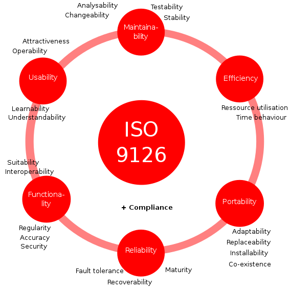
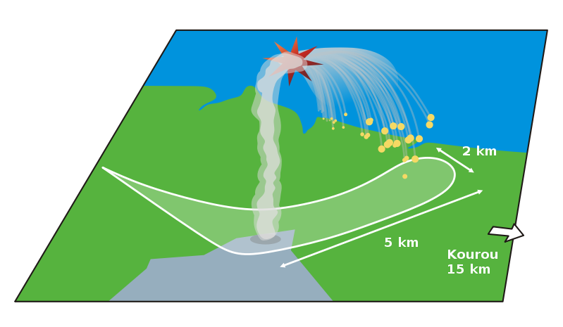

<!--

author:   Sebastian Zug, Galina Rudolf, André Dietrich, Christoph Pooch,`KoKoKotlin`, `Lina` & `Florian2501`
email:    sebastian.zug@informatik.tu-freiberg.de
version:  1.0.1
language: de
narrator: Deutsch Female

import: https://raw.githubusercontent.com/liascript-templates/plantUML/master/README.md
        https://raw.githubusercontent.com/liaTemplates/DigiSim/master/README.md
        https://github.com/liascript/CodeRunner

icon: https://upload.wikimedia.org/wikipedia/commons/d/de/Logo_TU_Bergakademie_Freiberg.svg
-->

[](https://liascript.github.io/course/?https://github.com/TUBAF-IfI-LiaScript/VL_Softwareentwicklung/blob/master/01_Software.md)

# Softwareentwicklung als Prozess

| Parameter                | Kursinformationen                                                                                                                                                                    |
| ------------------------ | ------------------------------------------------------------------------------------------------------------------------------------------------------------------------------------ |
| **Veranstaltung:**       | `Vorlesung Softwareentwicklung`                                                                                                                                                      |
| **Semester**             | `Sommersemester 2022`                                                                                                                                                                |
| **Hochschule:**          | `Technische Universität Freiberg`                                                                                                                                                    |
| **Inhalte:**             | `Definition des Softwarebegriffes und der Herausforderungen `                                                                                            |
| **Link auf den GitHub:** | [https://github.com/TUBAF-IfI-LiaScript/VL_Softwareentwicklung/blob/master/01_Software.md](https://github.com/TUBAF-IfI-LiaScript/VL_Softwareentwicklung/blob/master/01_Software.md) |
| **Autoren**              | @author                                                                                                                                                                              |


---------------------------------------------------------------------

## Softwareentwicklung


### Begriffsdefinition

| Begriff               | Definitionsansatz                                                                                                                                |
| --------------------- | ------------------------------------------------------------------------------------------------------------------------------------------------ |
| Software als "Medium" | *Software [ist] all das, was zum Funktionieren eines Computers notwendig, aber nicht Hardware ist.*                                                |
|                       | *Software ist sinnlich nicht wahrnehmbar ... . Sie ist komplex und besteht aus umfangreichen Texten*                                             |
| Software als Ziel     | *Software macht den Computer nutzbar*                                                                                                            |
|                       | *Software ermöglicht die Abbildung von Prozessen auf einem Rechner*                                                                             |
| Software als Prozess  | *Software ist die Idee, die Lösung, die man sich für ein Problem ausgedacht hat, das Verfahren, das helfen soll ...*                             |
|                       | *Dabei sind Computerprogramme nicht nur als Beschreibung der auszuführenden Funktionen ... Vereinbarung zur Nutzung, ... Dokumentationsinhalte.* |


### Lebenszyklus einer Software

> Ein Software-Lebenszyklus beschreibt den gesamten Prozess der Herstellung und
> des Betriebs Implementierung ausgehend von der kundenseitigen Problemstellung
> über die Realisierung und den Betrieb bis hin zur Ablösung der Software durch
> einen Nachfolger.

1. Problemstellung
2. Analyse Entwurf
3. Implementierung
4. Test
5. Markteinführung
6. Pflege/Wartung

Welche Querbeziehungen ("Während der Tests wird erkannt, dass die Implementierung Mängel aufweist.") zwischen den einzelnen Stufen sehen Sie?

**Welche Definitionen ergeben sich daraus für den Entwicklungsprozess?**

> "Unter dem Begriff Softwareentwicklung versteht man die Konzeption
> und standardisierte Umsetzung von Softwareprojekten und die damit
> verbundenen Prozesse." [^Freund, S. 25]

... oder insbesondere auf große Projekte zielend

> „Zielorientierte Bereitstellung und systematische Verwendung von Prinzipien,
> Methoden und Werkzeugen für die arbeitsteilige, ingenieurmäßige Entwicklung
> und Anwendung von umfangreichen Softwaresystemen.“ [^Balzert, S. 36]

[^Freund]: Tessen Freund: Software Engineering durch Modellierung wissensintensiver Entwicklungsprozesse, Dissertation, [Link google books](http://books.google.de/books?id=2HPldlxhBOkC&pg=PA25#v=onepage&q&f=false)

[^Balzert]: Helmut Balzert: Lehrbuch der Softwaretechnik: Basiskonzepte und Requirements Engineering, 2009

### Methodische Ziele

**Was heißt das, "ingenieurmäßig" oder "standardisiert"?**

Gemäß ISO 9126 gibt es die sechs folgenden Qualitätsmerkmale für
Softwareprodukte:

<!-- style="width: 50%; max-width=315px;" -->

[^Wiki9126]

Nachfolger ISO 25010: Zusätzlich

* Kompatibilität
* Sicherheit

Die Norm kann als eine Art Checkliste verstanden werden.

[^Wiki9126]: Von Sae1962 - Eigenes Werk, CC BY-SA 4.0, https://commons.wikimedia.org/w/index.php?curid=52216179

## Und warum der ganze Aufwand?


### Komplexität von Software

                                  {{0-1}}
*******************************************************************************

Steigende Komplexität der Softwareprodukte ...

<!--data-type="none"-->
| Projekt/Produkt      | Lines of Code | Jahr |
| -------------------- | -------------:| ---- |
| Unix v 1.0           |        10.000 | 1971 |
| Win32/Smile Virus    |        10.000 | 2002 |
| Space shuttle        |       400.000 |      |
| Windows 3.1          |     2.300.000 | 1992 |
| HD DVD Player (XBox) |     4.500.000 | 2001 |
| Firefox              |     9.900.000 | 2010 |
| Android              |    12.000.000 |      |
| F-35 Flugzeug        |    24.000.000 | 2013 |
| Facebook             |    62.000.000 |      |
| Autonomes Fahrzeug   |   100.000.000 |      |

Quelle unter anderem [^Weforum] und [^McCandless]

*******************************************************************************

                                  {{1-2}}
*******************************************************************************

Und wann entsteht der Aufwand? Wann muss ein Team Kosten in die Entwicklung investieren?

<!--data-type="none"-->
| Projektphase                         |             | Relativer Kosteanteil |
| ------------------------------------ | ----------- | --------------------- |
| Spezifikation und Architekturentwurf | Entwicklung | 16%                   |
| Detailentwurf und Kodierung          |             | 9%                    |
| Test                                 |             | 16%                   |
| Anpassung                            | Wartung     | 12%                   |
| Erweiterung und Verbesserung         |             | 36%                   |
| Fehlerbehebung                       |             | 12%                   |

Zahlwerte aus einem Diagramm in [^Lemburg]

*******************************************************************************


                                       {{2-3}}
*******************************************************************************

> **Merke:** Die Entwicklung kleiner Programme unterscheidet sich von der
> Entwicklung großer Programme!

| Kriterium                | Kleine Programme                                        | Große  Programme                                                          |
| ------------------------ | ------------------------------------------------------- | ------------------------------------------------------------------------- |
| Zeilenzahl               | bis zu ein paar 1000 Zeilen                             | Millionen von LOC                                                         |
| Einsatz                  | "Eigengebrauch"                                         | kommerzieller Einsatz von Dritten                                         |
| Anforderungsanalyse      | vage Idee                                               | präzise Spezifikation                                                     |
| Vorgehensmodell          | unstrukturiert                                          | strukturierter Entwicklungsprozesse                                       |
| Test und Validierung     | unter Realbedingungen am Endprodukt                     | Systematische Prüfstrategie                                               |
| Komplexität              | Überschaubare Zahl von Komponenten, Abhängigkeiten usw. | Hohe Komplexität, explizite Organisation in Struktureinheiten und Modulen |
| Dokumentation            | Fehlt in der Regel                                      | zwingend erforlderlich, permanente Pflege                                 |
| Planung und Organisation | Kaum Planung und Projektorganisation                    | zwingend erforderlich                                                     |

Darstellung entsprechen motiviert aus [^Lemburg2].


*******************************************************************************

[^Lemburg2]: Prof. Dr. Thorsten Lemburg, Einführung in die Softwareentwicklung - Seminar: Softwareentwicklung in der Wissenschaft, [Link](https://wr.informatik.uni-hamburg.de/_media/teaching/wintersemester_2010_2011/siw-2011-lemburg-einfuehrung_in_die_softwareentwicklung-ausarbeitung.pdf)

[^McCandless] David McCandless [https://informationisbeautiful.net/visualizations/million-lines-of-code/)] (https://informationisbeautiful.net/visualizations/million-lines-of-code/)

[^Weforum]: Dragan Radovanovic, Kif Leswing, "Google runs on 5000 times more code than the original space shuttle", 2016, [Link](https://www.weforum.org/agenda/2016/07/google-runs-on-5000-times-more-code-than-the-original-space-shuttle?utm_content=buffer45d4c&utm_medium=social&utm_source=twitter.com&utm_campaign=buffer)

### Fehler in der Softwareentwicklung

Die Zusammenfassung wurde durch die Ausführungen von [^Lemburg] motiviert

1. Management

    + Es wird mit der Codierung sofort angefangen.
    + Eine Festlegung der Anforderungen/Qualitätsmerkmale fehlt
    + Eine Abnahme der Phasenergebnisse erfolgt nicht
    + Ein Vorgehensmodell fehlt, bzw. wird nicht verfolgt
    + Die Schulung für die Software-Ersteller und -Anwender wird vernachlässigt oder als nicht notwendig angesehen
    + Die Terminvorgaben sind unrealistisch und nicht koordiniert.
    + Begriffe werden nicht definiert

2. Architektur

    + Die Systemarchitektur ist nicht oder nur sehr umständlich erweiterbar (fehlende Datenkapselung, fehlende Modularität)
    + Es wird ein unnützes Maß an Komplexität in den Entwurf integriert: "_Es könnte doch sein, dass ..._"

3. Entwicklungfluss

    + Die Auswahl der Werkzeuge/Methoden ist unzureichend vorbereitet
    + Es wird nicht systematisch bzw. unzureichend getestet.
    + Standards und Richtlinien werden nicht beachtet.

4. Dokumentation

    + Schlechte Namensvergabe wie z.B. File-, Klassen-, Methoden- und Variablennamen
    + Die Dokumentation fehlt bzw. ist veraltet, unzureichend oder nicht adäquat


[^Lemburg]: Prof. Dr. Thorsten Lemburg, Einführung in die Softwareentwicklung,
[Link](https://wr.informatik.uni-hamburg.de/_media/teaching/wintersemester_2010_2011/siw-2011-lemburg-einfuehrung_in_die_softwareentwicklung-druckversion.pdf)

### Konsequenzen von Fehlern im Prozess

> **Ariane Jungfernflug**

                                    {{1-2}}
*******************************************************************************

V88 war die Startnummer des Erstflugs der europäischen Schwerlast-Trägerrakete
Ariane 5 am 4. Juni 1996. Die Rakete trug die Seriennummer 501. Der Flug endete
etwa 40 Sekunden nach dem Start, als die Rakete nach einer Ausnahmesituation in
der Software der Steuereinheit plötzlich vom Kurs abkam und sich kurz darauf
selbst zerstörte. Vier Cluster-Forschungssatelliten zur Untersuchung des
Erdmagnetfelds gingen dabei verloren (Schaden 290 Millionen Euro).

 [^Ariane88]

```ada
-- Overflow is correctly handled for the vertical component
L_M_BV_32 := TBD.T_ENTIER_16S((1.0 / C_M_LSB_BH) *
                                   G_M_INFO_DERIVE(T_ALG.E_BH));
if L_M_BV_32 > 32767 then
 P_M_DERIVE(T_ALG.E_BV) := 16#7FFF#;      -- largest 16Bit number (Two's complement)
elseif L_M_BV_32 < -32768 then
 P_M_DERIVE(T_ALG.E_BV) := 16#8000#;      -- smallest negative 16Bit number
else
 P_M_DERIVE(T_ALG.E_BV) := UC_16S_EN_16NS(TBD.T_ENTIER_16S(L_M_BV_32));
end if;

-- But not for the horizontal one
P_M_DERIVE(T_ALG.E_BH) := UC_16S_EN_16NS(TBD.T_ENTIER_16S
                                   ((1.0 / C_M_LSB_BH) *
                                   G_M_INFO_DERIVE(T_ALG.E_BH));
```

*******************************************************************************


> **Mars Rover**

                                   {{2-3}}
*******************************************************************************

Mars Pathfinder war ein US-amerikanischer Mars-Lander, der 1996 von der NASA eingesetzt wurde. Er brachte 1997 den ersten erfolgreichen Mars-Rover Sojourner auf die Marsoberfläche.


Nach dem Beginn der Aufzeichnung von meteorologischen Daten mit dem Sojourner traten plötzlich scheinbar zufällige System-Zurücksetzungen auf. Das Betriebssystem bootete neu, was mit einem Datenverlust einher ging.
Diese Fehler waren aber auch schon auf der Erde aufgetreten ...

Durch Analyse des Logbuches zu diesem Zeitpunkt konnte festgestellt werden, dass es bei der Programmierung von "Sojourner" ein Problem gab. Dabei schlug die sogenannte [Prioritäten-Inversion](https://de.wikipedia.org/wiki/Priorit%C3%A4tsinversion) zu, die sich zeigt, wenn mehrere Prozesse ein und die selbe Ressource nutzen.

Weitere Informationen unter [What the media coudn't tell you about Mars Pathfinder](http://people.cs.ksu.edu/~hatcliff/842/Docs/Course-Overview/pathfinder-robotmag.pdf)

*******************************************************************************


> **Aggressiver Gandhi**

                                      {{3-4}}
*******************************************************************************

Der als friedlich bekannte Inder Mahatma Gandhi ist im Spiele Civilization 5 dafür bekannt, besonders gerne nukleare Waffen zu nutzen. Diese Affinität ist einen Programmierfehler im ersten Teil zuzuordnen, in welchem der Agressionswert bestimmt, wie wahrscheinlich es ist, dass der Herrscher eine atomare Waffe benutzt. Gandhi startet dort mit einem Aggressionswert von 1, jedoch bekommt jede Demokratie bei Spielstart -2 Aggresionspunkte, was zu einem Wert von -1 führt. Binär betrachtet entspricht das folgender 8 Bit Zahl:

1111 1111

Dieser Wert wird intern aber als ein unsigned char, also wie eine 8 Bit vorzeichenlosen Ganzzahl behandelt. Dies führt dazu, dass nicht eine -1 gelesen wird, sondern der Maximalwert dieses Datentyps 255.

*******************************************************************************

[^Ariane88]: Wikimedia, Autor Phrd, Fragment fallout zone of failed Ariane 501 launch. [Link](http://www.esa.int/esapub/bulletin/bullet89/images/dalm89f4.gif, https://commons.wikimedia.org/wiki/File:Ariane_501_Fallout_Zone.svg)

[^NasaMars]: wikimedia, Autor NASA/JPL, Panoramic image from Mars Pathfinder mission, public domain, as NASA is a government institution, [Link](https://commons.wikimedia.org/wiki/File:Mars_pathfinder_panorama_large.jpg)

### Und im Kleinen ...

                                     {{0-3}}
*******************************************************************************

Das folgende anschauliche Beispiel und die zugehörige Analyse ist durch ein Beispiel der Vorlesung "Software Engineering" von Prof. Dr. Schürr, (TU Darmstadt) motiviert.

> **Achtung:** Das folgende Codebeispiel enthält eine Fülle von Fehlern!

```c AllesFalsch.c
#include <stdio.h>

FILE *fp;

void main()
{
    fp = fopen("numbers.txt", "r");
    int a[10];
    int num = 0, l = 0;

    while(1){
      if (fscanf(fp, "%d", &num) == 1) {
          a[l] = num;
          l++;
      } else {
          break;
      }
    }
    for(int i=0; i<l; i++)
        printf("%5i ",a[i]);
    printf("\n");

    int aux;
    for(int i=2; i<l; i++){
      for(int j=l; j>i; j--){
        if (a[j-1] > a[j]){
          aux = a[j-1];
          a[j-1] = a[j];
          a[j] = aux;
        }
      }
    }
    for(int i=0; i<l; i++)
        printf("%5i ",a[i]);

    printf("\nAus Maus!\n");
}
```

> **Aufgabe:** Lesen Sie den Code, erklären Sie die Aufgabe, die er löst und identifizieren Sie Fehlerquellen.


*******************************************************************************

                                    {{1-2}}
*******************************************************************************

Welche Probleme sehen Sie im Hinblick auf die zuvor genannten Qualitätsmerkmale


| Aspekt                 | Bewertung |
| ---------------------- | --------- |
| Funktionalität         | ?         |
| Zuverlässigkeit        |           |
| Benutzbarkeit          |           |
| Effizienz              |           |
| Wartungsfreundlichkeit |           |
| Übertragbarkeit        |           |

*******************************************************************************

                                     {{2}}
*******************************************************************************

| Aspekt                 | Bewertung                                                                            |
| ---------------------- | ------------------------------------------------------------------------------------ |
| Funktionalität         | feste Feldlänge, das Programm stürzt bei mehr als 10 Einträgen ab                    |
| Zuverlässigkeit        | keine Überprüfung der Existenz der Datei, kein Schließen der Datei                   |
| Benutzbarkeit          | im Programmcode enthaltene Dateinamen, feste Feldlänge                               |
| Effizienz              | quadratischer Aufwand der Sortierung                                                 |
| Wartungsfreundlichkeit | fehlende Dokumentation, unverständliche Variablenbezeichner, redundante Codeelemente |
| Übertragbarkeit        |                                                                                      |

*******************************************************************************

## Herausforderungen

**Warum ist Softwareentwicklung so herausfordernd**

* Die Größe der zu lösenden Probleme. Software ist nicht einfacher, als die Probleme, die sie löst. Je größer und schwieriger die Software, desto aufwendiger und schwieriger ist die Entwicklung.
* Die Tatsache, dass Software ein immaterielles Produkt ist. Die Immaterialität macht das Arbeiten mit Software schwieriger als dasjenige mit materiellen Produkten vergleichbarer Komplexität, da die Risiken auch schwerer zu erkennen sind.
* Sich permanent verändernde Ziele aufgrund der Evolution. Schon das Bestimmen und Erreichen fixierter Ziele bei der Entwicklung ist keine leichte Aufgabe. Sich verändernde Ziele machen das ganze nochmal um eine Größenordnung schwieriger.
* Fehler infolge von Fehleinschätzungen zur Skalierung ("was im Kleinen geht, geht genauso im Großen"). Software-Entwicklung wird daher unbewusst meist als viel einfacher eingeschätzt, als sie tatsächlich ist. Dies führt zu unrealistischen Erwartungen und zu von Beginn an zu tiefen Kosten- und Terminschätzungen.
* Funktionierende Einzelkomponenten stellen noch lange kein funktionierendes Gesamtsystem sicher.

**Der Faktor Mensch**

In einem Projekt stellt sich die Frage wie viele Personen involviert sind und damit welche Komplexität der Entwicklungsfluss hat. In einem Team von 3 Personen wird muss sichergestellt sein, dass eine Information bei 2 Partnern ankommt. Die maximale Anzahl ergibt sich zu

$$N = \frac{n\cdot(n-1)}{2}$$.

<!--
style="width: 100%; max-width: 760px; display: block; margin-left: auto; margin-right: auto;"
-->
```ascii
  ^
  | Kommunikationspfade           o
  |
  |
  |
  |                        o <- ab hier mehr Kommunikationspfade
  |                             als involvierte Personen
  |
  |                 o  <- bis hierher linear
  |          o
  +---o--------------------------------------->                               .
      1      2      3      4      5      6
```
Grafik motiviert aus [^Lemburg2]

Hier ist eine koordinierte Interaktion und Kommunikation notwendig!


[^Lemburg2]: Prof. Dr. Thorsten Lemburg, Einführung in die Softwareentwicklung - Seminar: Softwareentwicklung in der Wissenschaft, [Link](https://wr.informatik.uni-hamburg.de/_media/teaching/wintersemester_2010_2011/siw-2011-lemburg-einfuehrung_in_die_softwareentwicklung-ausarbeitung.pdf)

## Ansätze zur Strukturierung der Aufgaben

                                     {{0}}
*******************************************************************************

*Erweitertes Wasserfallmodell*

<!--
style="width: 100%; max-width: 760px; display: block; margin-left: auto; margin-right: auto;"
-->
```ascii

 Anforderungen                          Problemanalyse, Systemspezifikation
   \
    Entwurf                             Grobentwurf, Feinentwurf
     \
      Umsetzung                         Implementierung, Integration
       \
        Überprüfung                     Testen des Systems
         \
          Betrieb und Wartung           Installation, Anpassung                .
```

Eigenschaften des Wasserfallmodells:

* Aktivitäten sind in der vorgegebenen Reihenfolge und in der vollen Breite vollständig durchzuführen.
* Am Ende jeder Aktivität steht ein fertiggestelltes Dokument, d.h. das Wasserfallmodell ist ein „dokumentgetriebenes“ Modell.
* Der Entwicklungsablauf ist sequentiell und als Top-down-Verfahren realisiert.
* Es ist einfach, verständlich und benötigt nur wenig Managementaufwand.

Vorteile:

* klare Abgrenzung der Phasen – einfache Möglichkeiten der Planung und Kontrolle
* bei stabilen Anforderungen und klarer Abschätzung von Kosten und Umfang ein sehr effektives Modell

Nachteile:

* Das Modell ist nur bei einfachen Projekten anwendbar – Unflexibel gegenüber Änderungen und im Vorgehen
* Frühes festschreiben der Anforderungen ist sehr problematisch und kann zu teuren Änderungen führen
* Fehler werden eventuell erst sehr spät erkannt und müssen mit erheblichen Aufwand  entfernt werden

*******************************************************************************

                                     {{1}}
*******************************************************************************

*V-Modell*

<!--
style="width: 100%; max-width: 760px; display: block; margin-left: auto; margin-right: auto;"
-->
```ascii
                         Szenarien
Anforderungen        ................>              Abnahmetest
   \ ^                                              / ^
    v \                  Testfälle                 v /
    Grobentwurf      ................>        Systemtest
      \ ^                                       / ^
       v \               Testfälle             v /
      Feinentwurf    ................>     Integrationstest
         \ ^                                 / ^
          v \            Testfälle          v /
        Modulimpl.   ................>    Modultest
            \ \                           / /
             \ +-------------------------+ /
              +---------------------------+                                    .
```


Tätigkeitsbereiche des V-Modell: Softwareerstellung, Qualitätssicherung, Konfigurationsmanagement, Projektmanagement

Vorteile:

* Integrierte und detaillierte Darstellung von den Tätigkeitsbereichen
* Generisches Modell mit definierten Möglichkeiten zur Anpassung an projektspezifische Anforderungen
* Gut geeignet für große Projekte

Nachteile:

* Für kleine und mittlere Softwareentwicklungen führt das V-Modell zu einem unnötigen Overhead
* Die im V-Modell definierten Rollen (bis zu 25) sind für gängige Softwareentwicklungen nicht realistisch
* explizite Werkzeuge notwendig

*******************************************************************************

                                     {{2}}
*******************************************************************************

> __Achtung:__ Die Nachteile aus den sehr statisch ausgerichteten Modellen lassen sich für größere Projekte kaum umsetzen. Modernere Ansätze lösen den stringenten Ablauf auf und fokussieren einem schnelleren Einsatz: *Agile Softwareentwicklung*, *Rational Unified Process*, *Spiralmodell* -  [Link](https://www.dev-insider.de/was-ist-agile-softwareentwicklung-a-569187/)


*******************************************************************************

## Ok, wir brauchen Unterstützung

> *CASE is the use of computer-based support in the software development process*

                                    {{0}}
*******************************************************************************

**Klassifikation nach dem Einsatzzweck**

+ Anforderungsanalyse

  * Spezifikation
  * Modellierung

+ Code-Erstellung (Editoren)

  * Editor, IDE
  * Dokumentation

+ Ausführung und Testen

  * Compiler, Interpreter
  * IDE, Build-System
  * Debugger

+ Koordination Entwicklungsprozess

  * Projektverwaltung
  * Code-Base Management und Versionierung
  * Deployment
  * Support

*******************************************************************************

                                   {{1}}
*******************************************************************************
**Grad der Integration verschiedener Funktionalitäten**

* Tools - einzelne Aktivitäten im Software Life-cycle
* Workbenches - mehrere Werkzeuge
* Integrated Development Environments - Kombination mehrerer Workbenches und Werkzeuge zur
  Unterstützung des kompletten Software Life-cycle

> Texteditor vs. Integrated Development Environment (IDE) ... worfür soll ich mich entscheiden?

* Analyse des Workflows und der Formen der Zusammenarbeit
* Analyse der verwendeten Spezifikations und Modellierungstechniken,
  Programmiersprachen, etc.
* Analyse der Komplexität des Vorhabens, der erforderlichen Unterstützung
* Analyse der Rahmenbedingungen (Betriebssysteme, Kosten)

*******************************************************************************

## Aufgaben

- [ ] Betrachten Sie die Darstellung unter [Webseite Programmwechsel](https://www.programmwechsel.de/lustig/management/schaukel-baum.html) und versuchen Sie die überspitzten Missverständnisse der einzelnen Protagonisten im Kontext eines Softwareprojektes zu stellen.
- [ ] Korrigieren Sie das `allesFalsch.c` Beispiel, verbessern Sie die Lesbarkeit des Codes.

<!--START_SKIP_IN_PDF-->

## Quizze

Wo entsteht der größte Zeit- bzw. Kostenaufwand bei kommerzieller Software?

- [( )] Entwurf
- [( )] Programmierung
- [(X)] Service/Wartung

Wann ist eine Software-Dokumentation wichtig?

- [[ ]] immer, man sollte auch bei kleinstenen Projekten eine möglichst detaillierte Dokumentation schreiben
- [[X]] bei (mittel-)großen Projekten
- [[x]] bei kleinen Projekten mit komplexem Code
- [[ ]] die Dokumentation ist generell nicht wichtig, erfahrene Programmierer finden sich selber zurecht

<!--END_SKIP_IN_PDF-->
