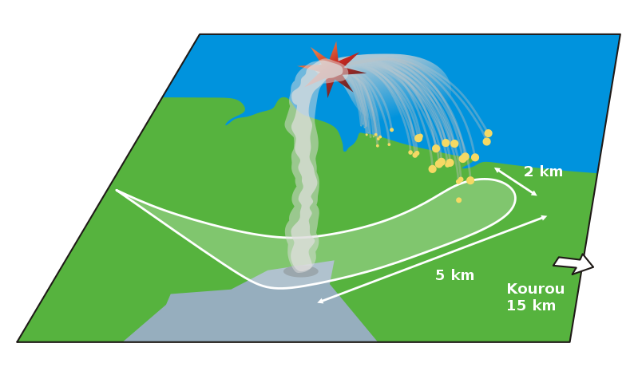

<!--

author:   Sebastian Zug; Galina Rudolf; André Dietrich; Christoph Pooch; `KoKoKotlin`; `Lina` & `Florian2501`
email:    sebastian.zug@informatik.tu-freiberg.de
version:  1.0.4
language: de
narrator: Deutsch Female
comment:  Definition des Softwarebegriffes, Softwareentwicklungszyklus, Fehler in der Softwareentwicklung, Softwarequalität
tags:      
logo:     

import: https://raw.githubusercontent.com/liascript-templates/plantUML/master/README.md
        https://raw.githubusercontent.com/liaTemplates/DigiSim/master/README.md
        https://github.com/liascript/CodeRunner

import: https://raw.githubusercontent.com/TUBAF-IfI-LiaScript/VL_Softwareentwicklung/master/config.md
        
-->

[](https://liascript.github.io/course/?https://github.com/TUBAF-IfI-LiaScript/VL_Softwareentwicklung/blob/master/01_Software.md)

# Softwareentwicklung als Prozess

| Parameter                | Kursinformationen                                                                        |
| ------------------------ | ---------------------------------------------------------------------------------------- |
| **Veranstaltung:**       | `Vorlesung Softwareentwicklung`                                                          |
| **Teil:**                | `1/27`                                                                                   |
| **Semester**             | @config.semester                                                                         |
| **Hochschule:**          | @config.university                                                                       |
| **Inhalte:**             | @comment                                                                                 |
| **Link auf den GitHub:** | https://github.com/TUBAF-IfI-LiaScript/VL_Softwareentwicklung/blob/master/01_Software.md |
| **Autoren**              | @author                                                                                  |


---------------------------------------------------------------------

## Softwareentwicklung

Was ist Software, welche Abläufe kennzeichnen den zugehörigen Entwicklungsprozess?


### Begriffsdefinition

| Begriff               | Definitionsansatz                                                                                                                                |
| --------------------- | ------------------------------------------------------------------------------------------------------------------------------------------------ |
| Software als "Medium" | *Software [ist] all das, was zum Funktionieren eines Computers notwendig, aber nicht Hardware ist.*                                                |
|                       | *Software ist sinnlich nicht wahrnehmbar ... . Sie ist komplex und besteht aus umfangreichen Texten*                                             |
| Software als Ziel     | *Software macht den Computer nutzbar*                                                                                                            |
|                       | *Software ermöglicht die Abbildung von Prozessen auf einem Rechner*                                                                             |
| Software als Ganzes   | *Dabei sind Computerprogramme nicht nur als Beschreibung der auszuführenden Funktionen ... Vereinbarung zur Nutzung, ... Dokumentationsinhalte.* |

> Software beschreibt die Umsetzung von Algorithmen, Datenstrukturen, Nutzerinterfaces usw. in Code, der auf einem Computer ausgeführt werden kann. 

### Lebenszyklus einer Software

> Ein Software-Lebenszyklus beschreibt den gesamten Prozess der Herstellung und
> des Betriebs von Software, ausgehend von der kundenseitigen Problemstellung
> über die Realisierung und den Betrieb bis hin zur Ablösung der Software durch
> einen Nachfolger.

1. Problemstellung
2. Analyse Entwurf
3. Implementierung
4. Test
5. Markteinführung
6. Pflege/Wartung

Welche Querbeziehungen ("Während der Tests wird erkannt, dass die Implementierung Mängel aufweist.") zwischen den einzelnen Stufen sehen Sie?

**Welche Definitionen ergeben sich daraus für den Entwicklungsprozess?**

> "Unter dem Begriff Softwareentwicklung versteht man die Konzeption
> und standardisierte Umsetzung von Softwareprojekten und die damit
> verbundenen Prozesse." [^Freund, S. 25]

... oder insbesondere auf große Projekte zielend

> „Zielorientierte Bereitstellung und systematische Verwendung von Prinzipien,
> Methoden und Werkzeugen für die arbeitsteilige, ingenieurmäßige Entwicklung
> und Anwendung von umfangreichen Softwaresystemen.“ [^Balzert, S. 36]

[^Freund]: Tessen Freund: Software Engineering durch Modellierung wissensintensiver Entwicklungsprozesse, Dissertation, [Link google books](http://books.google.de/books?id=2HPldlxhBOkC&pg=PA25#v=onepage&q&f=false)

[^Balzert]: Helmut Balzert: Lehrbuch der Softwaretechnik: Basiskonzepte und Requirements Engineering, 2009

### Methodische Ziele

**Was heißt das, "ingenieurmäßig" oder "standardisiert"?**

Die Qualität von Software lässt sich anhand standardisierter Merkmale bewerten. Die ursprüngliche Norm ISO 9126 (1991) definierte sechs Qualitätsmerkmale. Die aktuelle Fassung **ISO 25010:2023** erweitert das Modell auf **neun Qualitätsmerkmale** [^ISO25010]:

```@plantUML
@startmindmap
<style>
mindmapDiagram {
  .new2011 {
    BackgroundColor LightGreen
  }
  .new2023 {
    BackgroundColor Gold
  }
  .renamed {
    BackgroundColor LightBlue
  }
}
</style>
* ISO 25010:2023
right side
** Funktionale Eignung
** Leistungseffizienz
** Kompatibilität <<new2011>>
** Interaktionsfähigkeit <<renamed>>
** Zuverlässigkeit
left side
** Sicherheit <<new2011>>
** Wartbarkeit
** Flexibilität <<renamed>>
** Safety <<new2023>>
@endmindmap
```

Legende: <span style="background:#90EE90;padding:2px 6px;">grün</span> = neu in ISO 25010:2011, <span style="background:#FFD700;padding:2px 6px;">gelb</span> = neu in ISO 25010:2023, <span style="background:#ADD8E6;padding:2px 6px;">blau</span> = umbenannt/erweitert 2023

> **Frage an Sie:** Welche Software nutzen Sie täglich? Wo erleben Sie Verstöße gegen einzelne Qualitätsmerkmale? Ordnen Sie Ihre Beispiele den neun Kategorien zu.

                          {{1-2}}
*******************************************************

<!--data-type="none"-->
| Qualitätsmerkmal | Untermerkmale | Beschreibung |
|------------------|---------------|--------------|
| **Funktionale Eignung** | Vollständigkeit, Korrektheit, Angemessenheit | Erfüllt die Software die spezifizierten Aufgaben? |
| **Leistungseffizienz** | Zeitverhalten, Ressourcenverbrauch, Kapazität | Wie performant arbeitet die Software unter definierten Bedingungen? |
| **Kompatibilität** | Koexistenz, Interoperabilität | Kann die Software mit anderen Systemen zusammenarbeiten? |
| **Interaktionsfähigkeit** | Erkennbarkeit, Erlernbarkeit, Bedienbarkeit, Selbstbeschreibung, Inklusivität | Können Nutzer die Software effektiv und fehlerfrei bedienen? |
| **Zuverlässigkeit** | Reife, Verfügbarkeit, Fehlertoleranz, Wiederherstellbarkeit | Funktioniert die Software unter Fehlerbedingungen zuverlässig weiter? |
| **Sicherheit** | Vertraulichkeit, Integrität, Nachweisbarkeit, Authentizität, Resistenz | Ist die Software gegen unbefugten Zugriff und Manipulation geschützt? |
| **Wartbarkeit** | Modularität, Wiederverwendbarkeit, Analysierbarkeit, Modifizierbarkeit, Testbarkeit | Wie aufwendig ist es, die Software zu ändern und zu testen? |
| **Flexibilität** | Adaptierbarkeit, Installierbarkeit, Austauschbarkeit, Skalierbarkeit | Lässt sich die Software in andere Umgebungen übertragen und skalieren? |
| **Safety** | Betriebssicherheit, Risikominderung, Ausfallsicherheit | Verhindert die Software Gefährdungen für Menschen, Eigentum oder Umwelt? |

> Die Norm dient als Checkliste für die systematische Bewertung von Softwarequalität. Nicht jedes Merkmal ist für jedes Projekt gleich relevant — die Gewichtung hängt vom Kontext ab.

*******************************************************

[^ISO25010]: ISO/IEC 25010:2023, Systems and software engineering — Product quality model, [Link](https://www.iso.org/standard/78176.html). Überblick: [arc42 Quality Model](https://quality.arc42.org/articles/iso-25010-update-2023), [iso25000.com](https://iso25000.com/index.php/en/iso-25000-standards/iso-25010)

## Und warum der ganze Aufwand?


* **1940er–1950er:** Der Begriff "Programmierung" wird verwendet — Software entsteht als individuelle Handwerksarbeit ohne systematische Methodik.
* **1960er:** Massive Probleme bei der Softwareerstellung ("Softwarekrise") — Projekte scheitern regelmäßig an Kosten, Terminen und Qualität.

> "Die Hauptursache für die Softwarekrise liegt darin begründet, dass die Maschinen um einige Größenordnungen leistungsfähiger geworden sind! Um es ganz deutlich zu sagen: Solange es keine Maschinen gab, war Programmierung kein existierendes Problem; als wir ein paar schwache Computer hatten, wurde Programmierung zu einem geringen Problem, und nun, da wir gigantische Computer haben, ist die Programmierung ein ebenso gigantisches Problem." – Edsger Dijkstra: The Humble Programmer [^Dijkstra]

[^Dijkstra]: Edsger Dijkstra: The Humble Programmer (https://www.cs.utexas.edu/~EWD/ewd03xx/EWD340.PDF)

* **1968:** NATO Software Engineering Conference in Garmisch — "Software Engineering" wird erstmalig als eigenständige Disziplin gefordert.
* **1970er:** Erste Prozessmodelle entstehen (Wasserfallmodell, Royce 1970). Die Erkenntnis setzt sich durch, dass Software planbar entwickelt werden muss.
* **1980er–1990er:** Reifung der Disziplin — Qualitätsnormen (ISO 9126, 1991), das V-Modell wird im öffentlichen Sektor verpflichtend.
* **2001:** Das Agile Manifest markiert eine Gegenbewegung — weg von schwergewichtigen Prozessen, hin zu iterativer Entwicklung und Kundennähe.
* **2010er:** DevOps verschmilzt Entwicklung und Betrieb. Continuous Integration/Delivery wird zum Standard. Software Engineering wird zur Teamdisziplin mit hohem Automatisierungsgrad.
* **2020er:** KI-gestützte Werkzeuge verändern den Entwicklungsprozess erneut — Codegenerierung, automatisierte Reviews, agentenbasiertes Testen. Die Frage verschiebt sich von "Wie schreibe ich Code?" zu "Wie steuere und bewerte ich generierten Code?"

### Komplexität von Software

                                  {{0-1}}
*******************************************************************************

Steigende Komplexität der Softwareprodukte ...

<!--data-type="none"-->
| Projekt/Produkt             | Lines of Code  | Jahr | Quelle                |
| --------------------------- | --------------:| ---- | --------------------- |
| Unix v 1.0                  |         10.000 | 1971 | [^McCandless]         |
| Space Shuttle               |        400.000 | 1977 | [^McCandless]         |
| Windows 3.1                 |      2.300.000 | 1992 | [^McCandless]         |
| Firefox                     |     21.000.000 | 2024 | [^OpenHub]            |
| F-35 Kampfflugzeug          |     24.000.000 | 2013 | [^Weforum]            |
| Linux Kernel                |     40.000.000 | 2025 | [^LinuxToday]         |
| Windows 11                  |  60–80.000.000 | 2024 | [^WinLOC] (Schätzung) |
| Autonomes Fahrzeug          |    100.000.000 |      | [^McCandless]         |
| Google (alle Dienste)       |  2.000.000.000 | 2016 | [^GoogleMonorepo]     |

> **Anmerkung:** Lines of Code (LOC) sind ein grobes Maß — sie sagen wenig über Komplexität oder Qualität aus. Ein Gegenbeispiel: Tesla ersetzte 2024 über 300.000 Zeilen C++ im Autopilot-System durch ca. 3.000 Zeilen, die ein neuronales Netz aktivieren [^TeslaFSD]. Weniger Code kann also mehr Funktionalität bedeuten.

*******************************************************************************

                                  {{1-2}}
*******************************************************************************

Und wann entsteht der Aufwand? Wann muss ein Team Kosten in die Entwicklung investieren?

**Historische Perspektive (1980):**

Lientz und Swanson untersuchten 1980 in einer Studie mit 487 Unternehmen die Verteilung der Wartungsaufwände von Software [^Lientz1980]:

<!--data-type="none"-->
| Kategorie              | Anteil  | Beschreibung                                      |
| ---------------------- | -------:| ------------------------------------------------- |
| **Entwicklung gesamt** | **~40%** |                                                  |
| **Wartung gesamt**     | **~60%** |                                                  |
| davon perfektiv        |    >50% | Erweiterungen und Verbesserungen                  |
| davon adaptiv          |    <25% | Anpassung an neue Umgebungen                      |
| davon korrektiv        |    >20% | Fehlerbehebung                                    |
| davon präventiv        |     ~5% | Vorbeugende Maßnahmen                             |

> Die Mehrheit der Wartung war nicht Fehlerbehebung, sondern **Erweiterung** bestehender Funktionalität!

**Aktuelle Perspektive (2024):**

Ein IDC-Report untersuchte 2024, womit Entwickler ihre Arbeitszeit verbringen [^IDC2024]:

<!--data-type="none"-->
| Tätigkeit                          | Zeitanteil |
| ---------------------------------- | ----------:|
| Anwendungsentwicklung              |        16% |
| Anforderungen und Testfälle        |        14% |
| Sicherheit                         |        13% |
| CI/CD-Prozesse                     |        12% |
| Application Performance Monitoring |        12% |
| Deployment                         |        12% |
| Infrastruktur-Monitoring           |        11% |
| User Experience                    |        10% |

**Was hat sich verändert?**

* Die Kernaussage bleibt: Nur **16% der Arbeitszeit** entfallen auf die eigentliche Anwendungsentwicklung.
* **Security** ist als eigene Kategorie massiv gewachsen — 2023 noch 8%, 2024 bereits 13% [^IDC2024].
* **CI/CD, Deployment und Monitoring** machen zusammen 35% aus — operative Aufgaben, die es 1980 in dieser Form nicht gab.

[^Lientz1980]: Lientz, B.P. & Swanson, E.B., "Software Maintenance Management", Addison-Wesley, 1980. Originalpublikation: Lientz, B.P., Swanson, E.B. & Tompkins, G.E., "Characteristics of Application Software Maintenance", [Communications of the ACM, 21(6), 1978](https://dl.acm.org/doi/10.1145/359511.359522)

[^IDC2024]: IDC / Adam Resnick, "How Do Software Developers Spend Their Time?", 2024. Berichtet in: [InfoWorld](https://www.infoworld.com/article/3831759/developers-spend-most-of-their-time-not-coding-idc-report.html)

*******************************************************************************


                                       {{2-3}}
*******************************************************************************

> **Merke:** Die Entwicklung kleiner Programme unterscheidet sich von der
> Entwicklung großer Programme!

| Kriterium                | Kleine Programme                                        | Große  Programme                                                          |
| ------------------------ | ------------------------------------------------------- | ------------------------------------------------------------------------- |
| Zahl der Entwickler      | 1-2                                                     | > 2                                                                       |
| Zeilenzahl               | bis zu ein paar 1000 Zeilen                             | Millionen von LOC                                                         |
| Einsatz                  | "Eigengebrauch"                                         | kommerzieller Einsatz von Dritten                                         |
| Anforderungsanalyse      | vage Idee                                               | präzise Spezifikation                                                     |
| Vorgehensmodell          | unstrukturiert                                          | strukturierter Entwicklungsprozesse                                       |
| Test und Validierung     | unter Realbedingungen am Endprodukt                     | Systematische Prüfstrategie                                               |
| Komplexität              | Überschaubare Zahl von Komponenten, Abhängigkeiten usw. | Hohe Komplexität, explizite Organisation in Struktureinheiten und Modulen |
| Dokumentation            | Fehlt in der Regel                                      | zwingend erforderlich, permanente Pflege                                  |
| Planung und Organisation | Kaum Planung und Projektorganisation                    | zwingend erforderlich                                                     |

Darstellung entsprechend motiviert aus [^Lemburg2].


*******************************************************************************

[^Lemburg2]: Prof. Dr. Thorsten Lemburg, Einführung in die Softwareentwicklung - Seminar: Softwareentwicklung in der Wissenschaft, [Link](https://wr.informatik.uni-hamburg.de/_media/teaching/wintersemester_2010_2011/siw-2011-lemburg-einfuehrung_in_die_softwareentwicklung-ausarbeitung.pdf)

[^McCandless]: David McCandless, [Million Lines of Code](https://informationisbeautiful.net/visualizations/million-lines-of-code/)

[^Weforum]: Dragan Radovanovic, Kif Leswing, "Google runs on 5000 times more code than the original space shuttle", 2016, [Link](https://www.weforum.org/agenda/2016/07/google-runs-on-5000-times-more-code-than-the-original-space-shuttle)

[^OpenHub]: OpenHub, Mozilla Firefox Languages Summary, [Link](https://openhub.net/p/firefox/analyses/latest/languages_summary)

[^LinuxToday]: Linux Today, "Linux Kernel Source Code Surpasses 40 Million Lines", Januar 2025, [Link](https://www.linuxtoday.com/blog/linux-kernel-source-code-surpasses-40-million-lines-january-2025-update/)

[^WinLOC]: Windows Report, "How Many Lines of Code are There in Windows 11?", [Link](https://windowsreport.com/windows-11-how-many-lines-of-code/)

[^GoogleMonorepo]: Rachel Potvin, Josh Levenberg, "Why Google Stores Billions of Lines of Code in a Single Repository", Communications of the ACM, 2016, [Link](https://cacm.acm.org/research/why-google-stores-billions-of-lines-of-code-in-a-single-repository/)

[^TeslaFSD]: Tesla FSD v12: "Tesla's Neural Network Revolution: How Full Self-Driving Replaced 300,000 Lines of Code with AI", 2024, [Link](https://www.fredpope.com/blog/machine-learning/tesla-fsd-12)

### Technische Fehlerquellen und ihre Auswirkungen auf die Softwarequalität

Welche technischen Fehler führen zu welchen Qualitätsmängeln? Die folgende Tabelle ordnet typische Fehlerquellen den betroffenen Qualitätsmerkmalen nach ISO 25010 zu (motiviert durch [^Lemburg]):

<!--data-type="none"-->
| Fehlerquelle | Beispiel | Betroffene Qualitätsmerkmale |
|--------------|----------|------------------------------|
| Fehlende Modularität | Monolithische Architektur ohne Datenkapselung | Wartbarkeit, Flexibilität |
| Überflüssige Komplexität | "_Es könnte doch sein, dass ..._" | Wartbarkeit, Zuverlässigkeit |
| Unzureichendes Testen | Kein systematisches Testen, keine Randfälle | Zuverlässigkeit, Funktionale Eignung |
| Fehlende Dokumentation | Veraltete oder nicht vorhandene Dokumentation | Wartbarkeit, Interaktionsfähigkeit |
| Schlechte Benennung | Unverständliche Variablen-, Methoden-, Klassennamen | Wartbarkeit |
| Fehlende Eingabevalidierung | Nutzereingaben werden nicht geprüft | Sicherheit, Zuverlässigkeit |
| Keine Fehlerbehandlung | Abstürze statt kontrollierter Fehlermeldungen | Zuverlässigkeit, Safety |

> **Frage an Sie:** Welche dieser Fehlerquellen können durch Werkzeuge automatisch erkannt werden, und welche erfordern menschliches Urteil?

[^Lemburg]: Prof. Dr. Thorsten Lemburg, Einführung in die Softwareentwicklung,
[Link](https://wr.informatik.uni-hamburg.de/_media/teaching/wintersemester_2010_2011/siw-2011-lemburg-einfuehrung_in_die_softwareentwicklung-druckversion.pdf)

### Konsequenzen von Fehlern im Prozess

> **Ariane Jungfernflug**

                                    {{1-2}}
*******************************************************************************

V88 war die Startnummer des Erstflugs der europäischen Schwerlast-Trägerrakete
Ariane 5 am 4. Juni 1996. Die Rakete trug die Seriennummer 501. Der Flug endete
etwa 40 Sekunden nach dem Start, als die Rakete nach einer Ausnahmesituation in
der Software der Steuereinheit plötzlich vom Kurs abkam und sich kurz darauf
selbst zerstörte. Vier Cluster-Forschungssatelliten zur Untersuchung des
Erdmagnetfelds gingen dabei verloren (Schaden 290 Millionen Euro).

 [^Ariane88]

Der folgende (rekonstruierte) Ada-Code aus dem Trägheitsnavigationssystem (SRI) zeigt die Konvertierung eines 64-Bit-Gleitkommawerts (Horizontal Bias) in einen 16-Bit-Ganzzahlwert [^Ariane501Report]:

```ada
-- Overflow is correctly handled for the vertical component
L_M_BV_32 := TBD.T_ENTIER_16S((1.0 / C_M_LSB_BH) *
                                   G_M_INFO_DERIVE(T_ALG.E_BH));
if L_M_BV_32 > 32767 then
 P_M_DERIVE(T_ALG.E_BV) := 16#7FFF#;      -- largest 16Bit number (Two's complement)
elseif L_M_BV_32 < -32768 then
 P_M_DERIVE(T_ALG.E_BV) := 16#8000#;      -- smallest negative 16Bit number
else
 P_M_DERIVE(T_ALG.E_BV) := UC_16S_EN_16NS(TBD.T_ENTIER_16S(L_M_BV_32));
end if;

-- But not for the horizontal one
P_M_DERIVE(T_ALG.E_BH) := UC_16S_EN_16NS(TBD.T_ENTIER_16S
                                   ((1.0 / C_M_LSB_BH) *
                                   G_M_INFO_DERIVE(T_ALG.E_BH));
```

**Was passiert im Code?**

* `G_M_INFO_DERIVE(T_ALG.E_BH)` liefert den Sensorwert als **64-Bit-Gleitkommazahl**.
* `TBD.T_ENTIER_16S` ("Type Entier 16 Signé") konvertiert diesen in einen **16-Bit vorzeichenbehafteten Integer** (Wertebereich -32.768 bis 32.767). Überschreitet der Wert diesen Bereich, wirft Ada eine **Hardware-Exception** (Operand Error).
* **Vertikale Komponente (oben):** Vor der Konvertierung prüft eine `if`-Abfrage, ob der Wert im zulässigen Bereich liegt. Falls nicht, wird er auf das Maximum/Minimum gesättigt — der Overflow wird verhindert.
* **Horizontale Komponente (unten):** Dieselbe Konvertierung, aber **ohne Schutz**. Bei zu großen Werten stürzt das System ab.

**Warum fehlte die Prüfung?**

Von sieben kritischen Variablen waren nur vier gegen Overflow geschützt. Der Grund: Eine CPU-Auslastungsgrenze von **80%** war vorgegeben. Die Überlaufprüfungen für die drei übrigen Variablen (darunter BH) wurden weggelassen, weil eine Analyse der Ariane-4-Flugbahn gezeigt hatte, dass deren Werte den 16-Bit-Bereich nie überschreiten konnten. Diese Analyse war für Ariane 4 korrekt — wurde aber nicht für die stärkere Ariane 5 mit ihrer höheren horizontalen Beschleunigung wiederholt [^Ariane501Report].

**Zusätzlich:** Die Alignment-Software, in der der Fehler auftrat, wurde nach dem Liftoff gar nicht mehr benötigt — sie lief nur weiter, weil das eine Ariane-4-Anforderung war. Code, der nicht hätte laufen müssen, zerstörte die Rakete.

[^Ariane501Report]: Ariane 501 Inquiry Board, "ARIANE 5 — Flight 501 Failure", Report by the Inquiry Board, 1996, [Link](https://en.wikipedia.org/wiki/Ariane_flight_V88)

*******************************************************************************

> **Mars Rover**

                                   {{2-3}}
*******************************************************************************

Mars Pathfinder war ein US-amerikanischer Mars-Lander, der 1996 von der NASA eingesetzt wurde. Er brachte 1997 den ersten erfolgreichen Mars-Rover Sojourner auf die Marsoberfläche.


Nach dem Beginn der Aufzeichnung von meteorologischen Daten mit dem Sojourner traten plötzlich scheinbar zufällige System-Zurücksetzungen auf. Das Betriebssystem bootete neu, was mit einem Datenverlust einher ging.
Diese Fehler waren aber auch schon auf der Erde aufgetreten ...

Durch Analyse des Logbuches zu diesem Zeitpunkt konnte festgestellt werden, dass es bei der Programmierung von "Sojourner" ein Problem gab. Dabei schlug die sogenannte [Prioritäten-Inversion](https://de.wikipedia.org/wiki/Priorit%C3%A4tsinversion) zu, die sich zeigt, wenn mehrere Prozesse ein und die selbe Ressource nutzen.

Weitere Informationen unter [What the media couldn't tell you about Mars Pathfinder](http://people.cs.ksu.edu/~hatcliff/842/Docs/Course-Overview/pathfinder-robotmag.pdf)

*******************************************************************************


> **Das Jahr-2000-Problem (Y2K-Bug)**

                                      {{3-4}}
*******************************************************************************

In den 1960er–80er Jahren war Speicherplatz teuer. Viele Programmierer speicherten Jahreszahlen daher nur zweistellig — `99` statt `1999`. Die implizite Annahme: Das Jahrhundert ist immer `19`. Beim Jahreswechsel 1999 → 2000 wurde aus `99 + 1` aber `00`, was viele Systeme als das Jahr 1900 interpretierten.

```
// Typisches Datumsmuster der 1980er Jahre
struct date {
    char day;    // 1-31
    char month;  // 1-12
    char year;   // 0-99  ← hier liegt das Problem
};
```

> Weiterhin war es weit verbreitete Praxis, nicht vorhandene oder ungültige Dateninhalte mit der Zahl bzw. Ziffernkombination 00 („Nichts“) darzustellen und zu identifizieren – was mit dem Eintreten des Jahres 2000 dann zu Fehlinterpretationen geführt hätte, ggf. sogar zur Nichtverarbeitung ganzer, vermeintlich ungültiger Datensätze.[^Y2KWiki]

Die geschätzten weltweiten Kosten für die Behebung des Problems lagen bei rund **300 Milliarden US-Dollar** [^Y2KBrit]. Da die Prävention weitgehend erfolgreich war, blieb die befürchtete Katastrophe aus — was im Nachhinein dazu führte, dass viele das Problem für übertrieben hielten. Tatsächlich ist Y2K ein Beispiel für das *Vorbereitungsparadoxon*: Gerade weil die Korrektur funktionierte, wirkte die ursprüngliche Bedrohung überzeichnet.

> **Lerneffekt für die Softwareentwicklung:** Eine scheinbar harmlose Entwurfsentscheidung (2 statt 4 Stellen für das Jahr) kann Jahrzehnte später Milliardenkosten verursachen. Kurzfristige Optimierungen schaffen langfristige technische Schulden.

*******************************************************************************

[^Ariane88]: Wikimedia, Autor Phrd, Fragment fallout zone of failed Ariane 501 launch. [Link](http://www.esa.int/esapub/bulletin/bullet89/images/dalm89f4.gif, https://commons.wikimedia.org/wiki/File:Ariane_501_Fallout_Zone.svg)

[^NasaMars]: wikimedia, Autor NASA/JPL, Panoramic image from Mars Pathfinder mission, public domain, as NASA is a government institution, [Link](https://commons.wikimedia.org/wiki/File:Mars_pathfinder_panorama_large.jpg)

[^Y2KWiki]: Wikipedia, Year 2000 problem, [Link](https://en.wikipedia.org/wiki/Year_2000_problem)

[^Y2KBrit]: Britannica, Y2K bug, [Link](https://www.britannica.com/technology/Y2K-bug)

### Qualitätsmängel erkennen ...

                                     {{0-3}}
*******************************************************************************

Das folgende anschauliche Beispiel und die zugehörige Analyse ist durch ein Beispiel der Vorlesung "Software Engineering" von Prof. Dr. Schürr, (TU Darmstadt) motiviert.

> **Achtung:** Das folgende Codebeispiel enthält eine Fülle von Fehlern!

<!-- data-showGutter="true"-->
```c AllesFalsch.c
#include <stdio.h>

FILE *fp;

void main()
{
    fp = fopen("numbers.txt", "r");
    int a[10];
    int num = 0, l = 0;

    while(1){
      if (fscanf(fp, "%d", &num) == 1) {
          a[l] = num;
          l++;
      } else {
          break;
      }
    }
    for(int i=0; i<l; i++)
        printf("%5i ",a[i]);
    printf("\n");

    int aux;
    for(int i=2; i<l; i++){
      for(int j=l; j>i; j--){
        if (a[j-1] > a[j]){
          aux = a[j-1];
          a[j-1] = a[j];
          a[j] = aux;
        }
      }
    }
    for(int i=0; i<l; i++)
        printf("%5i ",a[i]);

    printf("\nAus Maus!\n");
}
```

> **Aufgabe:** Lesen Sie den Code, erklären Sie die Aufgabe, die er löst. Welche Qualitätsmängel sehen Sie?

> **Zusatzaufgabe** Finden sie zwei echte Bugs!

*******************************************************************************

                                    {{1-2}}
*******************************************************************************

Welche Probleme sehen Sie im Hinblick auf die zuvor genannten Qualitätsmerkmale


| Qualitätsmerkmal (ISO 25010) | Bewertung |
| ---------------------------- | --------- |
| Funktionale Eignung          | ?         |
| Zuverlässigkeit              |           |
| Interaktionsfähigkeit        |           |
| Leistungseffizienz           |           |
| Wartbarkeit                  |           |
| Sicherheit                   |           |
| Flexibilität                 |           |

*******************************************************************************

                                     {{2}}
*******************************************************************************

| Qualitätsmerkmal (ISO 25010) | Bewertung                                                                            |
| ---------------------------- | ------------------------------------------------------------------------------------ |
| Funktionale Eignung          | feste Feldlänge, das Programm stürzt bei mehr als 10 Einträgen ab                    |
| Zuverlässigkeit              | keine Überprüfung der Existenz der Datei, kein Schließen der Datei                   |
| Interaktionsfähigkeit        | im Programmcode enthaltene Dateinamen, feste Feldlänge                               |
| Leistungseffizienz           | quadratischer Aufwand der Sortierung                                                 |
| Wartbarkeit                  | fehlende Dokumentation, unverständliche Variablenbezeichner, redundante Codeelemente |
| Sicherheit                   | keine Eingabevalidierung, Buffer Overflow möglich                                    |
| Flexibilität                 | hartcodierter Dateiname, feste Arraygröße                                            |

Das Programm schließt zwei Bugs ein:

1. Der Vergleich schließt die Werte mit dem Index 0 aus da die Bedingung `i=2` lautet, aber die Indizes von 0 bis 9 gehen. Das führt zu einem unvollständigen Sortieren.
2. `l++` in Zeile 14 bewirkt das `l` hinter das Ende des Arrays zeigt. Damit sind Zugriffe auf `a[j]` wegen `j=l` in Zeile 25 undefiniert und können zu einem Absturz führen.

*******************************************************************************

## Herausforderungen

**Warum ist Softwareentwicklung so herausfordernd?**

* **Immaterialität:** Software kann man nicht anfassen, wiegen oder vermessen. Fehler sind unsichtbar, bis sie zuschlagen — bei der Ariane 5 steckte der Fehler jahrelang unbemerkt in einer Konvertierungsfunktion.
* **Komplexität ist nicht reduzierbar:** Software ist nicht einfacher als das Problem, das sie löst. Die LOC-Tabelle zeigt: Moderne Systeme umfassen Millionen bis Milliarden Zeilen Code.
* **Sich verändernde Anforderungen:** Schon fixierte Ziele zu erreichen ist schwierig. Wenn sich die Anforderungen während der Entwicklung ändern, wird es um eine Größenordnung schwieriger.
* **Fehleinschätzung der Skalierung:** "Was im Kleinen geht, geht genauso im Großen" — eine gefährliche Annahme. Das C-Beispiel funktioniert mit 5 Zahlen, stürzt aber bei 11 ab.
* **Integration:** Funktionierende Einzelkomponenten ergeben kein funktionierendes Gesamtsystem. Das SRI-Modul der Ariane 5 war für sich genommen korrekt — nur nicht im Kontext der neuen Rakete.

**Der Faktor Mensch**

In einem Projekt stellt sich die Frage, wie viele Personen involviert sind und welche Komplexität daraus für die Kommunikation entsteht. In einem Team von 3 Personen muss sichergestellt sein, dass eine Information bei 2 Partnern ankommt. Die maximale Anzahl der Kommunikationspfade ergibt sich zu

$$N = \frac{n\cdot(n-1)}{2}$$.

<!--
style="width: 100%; max-width: 760px; display: block; margin-left: auto; margin-right: auto;"
-->
```ascii
  ^
  | Kommunikationspfade           o
  |
  |
  |
  |                        o <- ab hier mehr Kommunikationspfade
  |                             als involvierte Personen
  |
  |                 o  <- bis hierher linear
  |          o
  +---o--------------------------------------->                               .
      1      2      3      4      5      6
```

Diese quadratische Zunahme hat eine direkte Konsequenz, die Frederick Brooks 1975 formulierte:

**Brooks-Gesetz:**

> "Der Einsatz zusätzlicher Arbeitskräfte bei bereits verzögerten Softwareprojekten verzögert sie nur noch weiter."
> – Frederick P. Brooks: *The Mythical Man Month*, 1975

Gründe:

* Einarbeitung neuer Teammitglieder kostet Zeit der bestehenden Mitglieder
* Aufgaben müssen neu aufgeteilt und Schnittstellen neu definiert werden
* Die Kommunikationspfade wachsen quadratisch — bei 10 statt 5 Personen steigt $N$ von 10 auf 45

## Ansätze zur Strukturierung der Aufgaben

Neben den technischen Fehlerquellen scheitern Softwareprojekte häufig an **organisatorischen Problemen** [^Lemburg]:

* Es wird mit der Codierung sofort angefangen — eine Festlegung der Anforderungen fehlt.
* Aufgabenzuordnungen sind unklar — es ist nicht klar, wer was macht.
* Kosten- und Terminschätzungen sind unrealistisch und nicht koordiniert.
* Abnahmen der Phasenergebnisse erfolgen nicht.
* Begriffe werden nicht einheitlich definiert.

Diese Probleme sind keine Qualitätsmängel im Sinne der ISO 25010, sondern **Prozessfehler**, die systematisch zu Qualitätsmängeln führen. Genau hier setzen Vorgehensmodelle an:

> Ein Vorgehensmodell zur Softwareentwicklung ist ein standardisierter, organisatorischer Rahmen für den idealen Ablauf eines Entwicklungsprojektes. Es dient dazu, die Softwareentwicklung übersichtlicher zu gestalten und in der Komplexität beherrschbar zu machen. [^WikiVorgehen]

[^WikiVorgehen]: [Wikipedia](https://de.wikipedia.org/wiki/Vorgehensmodell)

### Wasserfallmodell

<!--
style="width: 100%; max-width: 760px; display: block; margin-left: auto; margin-right: auto;"
-->
```ascii

 Anforderungen                          Problemanalyse, Systemspezifikation
   \
    Entwurf                             Grobentwurf, Feinentwurf
     \
      Umsetzung                         Implementierung, Integration
       \
        Überprüfung                     Testen des Systems
         \
          Betrieb und Wartung           Installation, Anpassung                .
```

Eigenschaften des Wasserfallmodells:

* Aktivitäten sind in der vorgegebenen Reihenfolge und in der vollen Breite vollständig durchzuführen.
* Am Ende jeder Aktivität steht ein fertiggestelltes Dokument, d.h. das Wasserfallmodell ist ein „dokumentgetriebenes“ Modell.
* Der Entwicklungsablauf ist sequentiell und als Top-down-Verfahren realisiert.
* Es ist einfach, verständlich und benötigt nur wenig Managementaufwand.

Vorteile:

* klare Abgrenzung der Phasen – einfache Möglichkeiten der Planung und Kontrolle
* bei stabilen Anforderungen und klarer Abschätzung von Kosten und Umfang ein sehr effektives Modell

Nachteile:

* Das Modell ist nur bei einfachen Projekten anwendbar – Unflexibel gegenüber Änderungen und im Vorgehen
* Frühes Festschreiben der Anforderungen ist sehr problematisch und kann zu teuren Änderungen führen
* Fehler werden eventuell erst sehr spät erkannt und müssen mit erheblichem Aufwand entfernt werden

Im erweiterten Wasserfallmodell fällt die strikte Vorgabe, eine Phase nach der anderen zu bearbeiten, weg — die Rückkehr in eine vorhergehende Phase ist möglich, um z.B. Fehler zu beheben.

### V-Modell

Zusätzlich zu den Entwicklungsphasen definiert das V-Modell das Vorgehen zur 
Qualitätssicherung (Testen), indem den einzelnen Entwicklungsphasen die Testphasen gegenübergestellt werden.

<!--
style="width: 100%; max-width: 760px; display: block; margin-left: auto; margin-right: auto;"
-->
```ascii
                         Szenarien
Anforderungen        ................>              Abnahmetest
   \ ^                                              / ^
    v \                  Testfälle                 v /
    Grobentwurf      ................>        Systemtest
      \ ^                                       / ^
       v \               Testfälle             v /
      Feinentwurf    ................>     Integrationstest
         \ ^                                 / ^
          v \            Testfälle          v /
        Modulimpl.   ................>    Modultest
            \ \                           / /
             \ +-------------------------+ /
              +---------------------------+                                    .
```


Tätigkeitsbereiche des V-Modell: Softwareerstellung, Qualitätssicherung (Reviews, Tests, Verifikationen bzw. Validierungen), Konfigurationsmanagement (Verwaltung und Kontrolle von Versionen, Änderungen und Abhängigkeiten), Projektmanagement (Zeitmanagement, Ressourcenplanung, Risikomanagement und Kommunikation)

Vorteile:

* Integrierte und detaillierte Darstellung von den Tätigkeitsbereichen
* Generisches Modell mit definierten Möglichkeiten zur Anpassung an projektspezifische Anforderungen
* Gut geeignet für große Projekte

Nachteile:

* Für kleine und mittlere Softwareentwicklungen führt das V-Modell zu einem unnötigen Overhead
* Die im V-Modell definierten Rollen (bis zu 25: Projektleiter, Auftragsgeber, Qualitätsmanager, Systemarchitekt, Softwareentwickler, Tester / Testmanager, ...) sind für gängige Softwareentwicklungen nicht realistisch
* explizite Werkzeuge notwendig


### Agile Softwareentwicklung 

Wasserfall und V-Modell setzen auf **Planbarkeit**: Anforderungen werden früh fixiert, Phasen sequentiell abgearbeitet. Das funktioniert, solange sich die Anforderungen nicht ändern — was in der Praxis selten der Fall ist.

Agile Methoden gehen vom Gegenteil aus: Anforderungen **werden** sich ändern. Die Entwicklung wird daher in kurze Zyklen aufgeteilt, in denen jeweils ein funktionsfähiges Inkrement entsteht.

<!--data-type="none"-->
|                                | Klassische Methoden                             | Agile Methoden                |
| ------------------------------ | ----------------------------------------------- | ----------------------------- |
| Anforderungen am Projektbeginn | klar definiert                                  | unscharf                      |
| Änderungsbereitschaft          | gering                                          | explizit                      |
| Anforderungsbeschreibung       | technische Sicht / Perspektive des Unternehmens | Kundensicht (Anwendungsfälle) |
| Entscheidungsfindung           | Gremien                                         | Team                          |
| Planung                        | durch Projektleiter                             | im Team                       |
| Kundeninteraktion              | Kunde oft unbekannt                             | Kunde als aktiver Teil        |

**Agiles Manifest (2001)**

Vier Leitsätze bilden die Grundlage agiler Methoden [^Manifesto]:

> * Individuen und Interaktionen sind wichtiger als Prozesse und Werkzeuge
> * Funktionierende Software ist wichtiger als umfassende Dokumentation
> * Zusammenarbeit mit dem Kunden ist wichtiger als Vertragsverhandlungen
> * Reagieren auf Veränderung ist wichtiger als das Befolgen eines Plans
>
> "Das heißt, obwohl wir die Werte auf der rechten Seite wichtig finden, schätzen wir die Werte auf der linken Seite höher ein."

[^Manifesto]: Kent Beck et al., Manifesto for Agile Software Development, 2001, [Link](https://agilemanifesto.org/iso/de/manifesto.html)

**Agile Methoden in der Praxis:**

* **Scrum:** Strukturierter, iterativer Ansatz für Teams
  
  - Sprints (Zeitboxen von 1–4 Wochen) mit klaren Zielen
  - Daily Stand-ups zur Synchronisation
  - Sprint Reviews und Retrospektiven zur kontinuierlichen Verbesserung

* **Extreme Programming (XP):** Fokus auf technische Exzellenz und Code-Qualität
  
  - Test-Driven Development (TDD) — erst Test, dann Code
  - Pair Programming (Arbeiten in Zweierteams)
  - Continuous Integration (automatisierte Builds und Tests nach jeder Änderung)

* **Kanban:** Visualisierung des Arbeitsflusses auf einem Board, Begrenzung paralleler Aufgaben (Work in Progress), kontinuierlicher Fluss statt fester Iterationen


## Werkzeuge im Entwicklungsprozess

Schon in den 1980er Jahren entstand die Idee, den Entwicklungsprozess durch Software zu unterstützen — damals unter dem Begriff *CASE (Computer-Aided Software Engineering)*. Heute ist werkzeuggestützte Entwicklung selbstverständlich, die Landschaft hat sich aber grundlegend verändert.

                                    {{0}}
*******************************************************************************

**Welche Aufgaben decken moderne Entwicklungswerkzeuge ab?**

<!--data-type="none"-->
| Aufgabe im Prozess           | Werkzeuge (Beispiele)                          |
| ---------------------------- | ---------------------------------------------- |
| Anforderungen und Planung    | Jira, GitHub Issues, Linear                    |
| Modellierung                 | PlantUML, draw.io, Enterprise Architect        |
| Code schreiben               | VS Code, Visual Studio, JetBrains Rider        |
| Bauen und Kompilieren        | dotnet CLI, MSBuild, CMake                     |
| Testen                       | xUnit, NUnit, pytest                           |
| Versionskontrolle            | Git, GitHub, GitLab                            |
| CI/CD                        | GitHub Actions, GitLab CI, Jenkins              |
| Dokumentation                | XML-Doku, Doxygen, Markdown                    |
| KI-Unterstützung             | GitHub Copilot, Claude Code, Cursor            |

> Diese Werkzeuge werden Sie im Laufe des Semesters kennenlernen — beginnend mit Git und VS Code.

*******************************************************************************

                                   {{1}}
*******************************************************************************

**Texteditor vs. IDE — wofür soll ich mich entscheiden?**

Die Entscheidung hängt vom Kontext ab:

<!--data-type="none"-->
| Kriterium                | Texteditor (vim, nano)         | IDE (VS Code, Visual Studio)          |
| ------------------------ | ------------------------------ | ------------------------------------- |
| Einstiegshürde           | niedrig (nano) / hoch (vim)    | mittel                                |
| Code-Vervollständigung   | keine oder Plugin              | integriert                            |
| Debugging                | extern (gdb, lldb)             | integriert, visuell                   |
| Refactoring              | manuell                        | automatisiert                         |
| Build-Integration        | Kommandozeile                  | integriert                            |
| Ressourcenverbrauch      | minimal                        | hoch                                  |

Für diese Vorlesung empfehlen wir **VS Code** mit der C#-Erweiterung — es bietet einen guten Kompromiss aus Funktionsumfang und Einstiegsfreundlichkeit.

*******************************************************************************

## Aufgaben

- [ ] Betrachten Sie die Darstellung unter [Webseite Programmwechsel](https://www.programmwechsel.de/lustig/management/schaukel-baum.html) und versuchen Sie die überspitzten Missverständnisse der einzelnen Protagonisten im Kontext eines Softwareprojektes zu stellen.
- [ ] Korrigieren Sie das `allesFalsch.c` Beispiel, verbessern Sie die Lesbarkeit des Codes.
