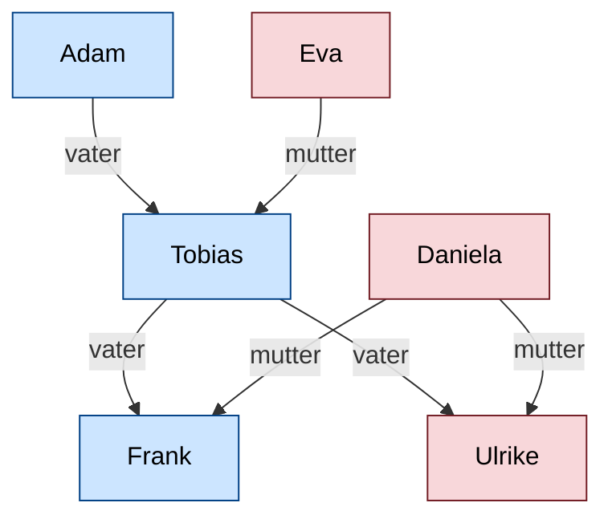

<!--

author:   Sebastian Zug, Galina Rudolf, André Dietrich, `fjangfaragesh`, `KoKoKotlin` & `Lina`
email:    sebastian.zug@informatik.tu-freiberg.de
version:  1.0.7
language: de
narrator: Deutsch Female
comment:  Programmierparadigmen und Einordnung von C#, Eigenschaften der Programmiersprache C#, .NET, Unterschiede zu anderen Sprachen/Konzepten
tags:      
logo:     

import: https://github.com/liascript/CodeRunner
        https://raw.githubusercontent.com/liaTemplates/tau-prolog/master/README.md
        https://raw.githubusercontent.com/liaTemplates/AlaSQL/master/README.md
        https://raw.githubusercontent.com/LiaTemplates/mermaid_template/master/README.md

import: https://raw.githubusercontent.com/TUBAF-IfI-LiaScript/VL_Softwareentwicklung/master/config.md

-->

[](https://liascript.github.io/course/?https://github.com/TUBAF-IfI-LiaScript/VL_Softwareentwicklung/blob/master/02_DotNet.md)

# .NET und Einordnung der Sprache C#

| Parameter                | Kursinformationen                                                                      |
| ------------------------ | -------------------------------------------------------------------------------------- |
| **Veranstaltung:**       | `Vorlesung Softwareentwicklung`                                                        |
| **Teil:**                | `2/27`                                                                                 |
| **Semester**             | @config.semester                                                                       |
| **Hochschule:**          | @config.university                                                                     |
| **Inhalte:**             | @comment                                                                               |
| **Link auf den GitHub:** | https://github.com/TUBAF-IfI-LiaScript/VL_Softwareentwicklung/blob/master/02_DotNet.md |
| **Autoren**              | @author                                                                                |


---------------------------------------------------------------------

## Programmierparadigmen

Ein Programmierparadigma bezeichnet die gedankliche, konzeptionelle Grundstruktur
die der Darstellung des Problems in Code zugrunde liegt.

Das Programmierparadigma:

* beschreibt den fundamentalen Programmierstil bzw. Eigenschaften von Programmiersprachen
* unterscheidet sich durch die Repräsentation der statischen und dynamischen Programmelemente
* beruht auf Sprache, aber auch auf individuellem Stil.

<!--
style="width: 100%; max-width: 860px; display: block; margin-left: auto; margin-right: auto;"
-->
```ascii

                         Programmierparadigmen
                                  |
                .-----------------+-----------------.
                |                                   |
    Imperative Programmierung         Deklarative Programmierung
                |                                   |
      .------------------.               .----------+---------.
      |                  |               |                    |
  Prozedural    Objektorientiert    Funktional             Logisch             .

```
                                      {{1-2}}
*******************************************************************************

+ __Imperative Programmierung__ - Quellcode besteht aus einer Folge von Befehlen die in einer festen Reihenfolge abgearbeitet werden.
+ __Deklarative Programmierung__ - es wird kein Lösungsweg implementiert, sondern nur angegeben, was gesucht ist.

| Paradigma                        | Leitidee                                                                               |
| -------------------------------- | -------------------------------------------------------------------------------------- |
| Prozedurale Programmierung       | Zerlegung von Programmen in überschaubare Teile                                        |
| Objektorientierte Programmierung | Abbildung von Daten und Funktionalität in einem Konzept                                |
| Funktionale Programmierung       | Abbildung der Algorithmen auf funktionale Darstellungen                                |
| Logische Programmierung          | Ableitung einer Lösung aus einer Menge von Fakten, Generierung einer Auswahl von Daten |


*******************************************************************************

### Beispiele  

                                      {{0-1}}
*******************************************************************************

> **Beispiel 1: Deklarativ mit Prolog**

```prolog    Prolog.pro
% Prolog Text mit Fakten
mann(adam).
mann(tobias).
mann(frank).
frau(eva).
frau(daniela).
frau(ulrike).
vater(adam,tobias).    % Adam ist Vater von Tobias
vater(tobias,frank).
vater(tobias,ulrike).
mutter(eva,tobias).
mutter(daniela,frank).
mutter(daniela,ulrike).

% Prolog Text mit Regeln
grossvater(X,Y) :-
     vater(X,Z),
     vater(Z,Y).
```
@Tau.program(Prolog.pro)

> Das Ganze ist ein gutes Beispiel für die Eignung unterschiedlicher Wissensrepräsentation für eine Maschine und den Menschen. 

Die modellierten Verwandtschaftsbeziehungen für den besseren Überblick:



```prolog Query
% Frage: Ist Adam der Großvater von Frank?
grossvater(adam,frank).
```
@Tau.query(Prolog.pro)

```prolog Query
% Frage: Wer ist der Großvater von Frank?
grossvater(X, frank).
```
@Tau.query(Prolog.pro)

*******************************************************************************

                                      {{1-2}}
*******************************************************************************

> **Beispiel 2: Deklarativ mit SQL**

``` sql
CREATE TABLE one;

-- ? gets replaced by the values in data.csv
INSERT INTO one SELECT * from ?;
```
``` text -data.csv
Region,Country,Item Type,Sales Channel,Order Priority,Order Date,Order ID,Ship Date,Units Sold,Unit Price,Unit Cost,Total Revenue,Total Cost,Total Profit
Middle East and North Africa,Libya,Cosmetics,Offline,M,10/18/2014,686800706,10/31/2014,8446,437.20,263.33,3692591.20,2224085.18,1468506.02
North America,Canada,Vegetables,Online,M,11/7/2011,185941302,12/8/2011,3018,154.06,90.93,464953.08,274426.74,190526.34
Middle East and North Africa,Libya,Baby Food,Offline,C,10/31/2016,246222341,12/9/2016,1517,255.28,159.42,387259.76,241840.14,145419.62
Asia,Japan,Cereal,Offline,C,4/10/2010,161442649,5/12/2010,3322,205.70,117.11,683335.40,389039.42,294295.98
Sub-Saharan Africa,Chad,Fruits,Offline,H,8/16/2011,645713555,8/31/2011,9845,9.33,6.92,91853.85,68127.40,23726.45
Europe,Armenia,Cereal,Online,H,11/24/2014,683458888,12/28/2014,9528,205.70,117.11,1959909.60,1115824.08,844085.52
Sub-Saharan Africa,Eritrea,Cereal,Online,H,3/4/2015,679414975,4/17/2015,2844,205.70,117.11,585010.80,333060.84,251949.96
Europe,Montenegro,Clothes,Offline,M,5/17/2012,208630645,6/28/2012,7299,109.28,35.84,797634.72,261596.16,536038.56
Central America and the Caribbean,Jamaica,Vegetables,Online,H,1/29/2015,266467225,3/7/2015,2428,154.06,90.93,374057.68,220778.04,153279.64
Australia and Oceania,Fiji,Vegetables,Offline,H,12/24/2013,118598544,1/19/2014,4800,154.06,90.93,739488.00,436464.00,303024.00
Sub-Saharan Africa,Togo,Clothes,Online,M,12/29/2015,451010930,1/19/2016,3012,109.28,35.84,329151.36,107950.08,221201.28
Europe,Montenegro,Snacks,Offline,M,2/27/2010,220003211,3/18/2010,2694,152.58,97.44,411050.52,262503.36,148547.16
Europe,Greece,Household,Online,C,11/17/2016,702186715,12/22/2016,1508,668.27,502.54,1007751.16,757830.32,249920.84
Sub-Saharan Africa,Sudan,Cosmetics,Online,C,12/20/2015,544485270,1/5/2016,4146,437.20,263.33,1812631.20,1091766.18,720865.02
Asia,Maldives,Fruits,Offline,L,1/8/2011,714135205,2/6/2011,7332,9.33,6.92,68407.56,50737.44,17670.12
Europe,Montenegro,Clothes,Offline,H,6/28/2010,448685348,7/22/2010,4820,109.28,35.84,526729.60,172748.80,353980.80
Europe,Estonia,Office Supplies,Online,H,4/25/2016,405997025,5/12/2016,2397,651.21,524.96,1560950.37,1258329.12,302621.25
North America,Greenland,Beverages,Online,M,7/27/2012,414244067,8/7/2012,2880,47.45,31.79,136656.00,91555.20,45100.80
Sub-Saharan Africa,Cape Verde,Clothes,Online,C,9/8/2014,821912801,10/3/2014,1117,109.28,35.84,122065.76,40033.28,82032.48
Sub-Saharan Africa,Senegal,Household,Offline,L,8/27/2012,247802054,9/8/2012,8989,668.27,502.54,6007079.03,4517332.06,1489746.97
```
@AlaSQL.eval_with_csv


``` sql
SELECT * FROM one Where Region == "North America";
```
@AlaSQL.eval


*******************************************************************************

### Abgrenzung zu anderen Konzepten

+ **Strukturierte Programmierung** ... Verzicht bzw. Einschränkung des `Goto` Statements zugunsten von Kontrollstrukturen (Kernkonzepte: Verzweigungen,
   Schleifen)
+ **Nebenläufig** ... gleichzeitig ausgeführte Abläufe (z.B. Threads, `async/await`)
+ **Reflektiv** ... Programm kann zur Laufzeit eigene Struktur inspizieren und verändern (`System.Reflection`)
+ **Generisch** ... Typen und Methoden über Typparameter (`List<T>`)
+ **Aspektorientiert** ... Funktionalität als „Aspekt" modular auslagern und über Join Points in den Programmablauf einweben (klassisch: Logging, Security — generell aber beliebige Belange)

### Paradigmen in der Praxis

Viele Sprachen unterstützen verschiedene Elemente der Paradigmen, bzw. entwickeln
sich in dieser Richtung weiter.

<!--data-type="none"-->
| Sprache | Jahr | imperativ                    | deklarativ             |
| ------- | ---- | ---------------------------- | ---------------------- |
| Pascal  | 1970 | prozedural                   |                        |
| C       | 1972 | prozedural                   |                        |
| Prolog  | 1972 |                              | logisch                |
| SQL     | 1974 |                              | logisch (rel./deklar.) |
| Ada     | 1980 | prozedural, objektorientiert |                        |
| C++     | 1985 | prozedural, objektorientiert | funktional             |
| Haskell | 1990 |                              | funktional             |
| Python  | 1991 | prozedural, objektorientiert | funktional             |
| Java    | 1995 | objektorientiert             | funktional             |
| C#      | 2002 | objektorientiert             | funktional             |

Viele Paradigmen in einer Sprache am Beispiel eines Python Programmes ...
Berechnen Sie die Summe der Ziffern eines Arrays.

```python    MultiParadigmen.py
my_list = range(0,10)

# imperative
result = 0
for x in my_list:
    result += x
print("Result in imperative style      :" + str(result))

# procedural
def do_add(list_of_numbers):
    result = 0
    for x in my_list:
        result += x
    return result
print("Result in procedural style      :" + str(do_add(my_list)))

# object oriented
class MyClass(object):
    def __init__(self, any_list):
        self.any_list = any_list
        self.sum = 0
    def do_add(self):
      self.sum = sum(self.any_list)
create_sum = MyClass(my_list)
create_sum.do_add()
print("Result in object oriented style :" + str(create_sum.sum))

# functional (map, filter, reduce)
import functools
result = functools.reduce(lambda x, y: x + y, my_list)
print("Result in functional style      :" + str(result))

```
@LIA.eval(`["main.py"]`, `none`, `python3 main.py`)


### Ja, aber ...

**"Das ist ja alles gut und schön, aber ich ich bin C Programmierer!"**

> **Anti-Pattern "Golden Hammer"**:
> *If all you have is a hammer, everything looks like a nail.*

Lösungsansätze:

* Individuell - Hinterfragen des Vorgehens und der Intuition, bewusste Weiterentwicklung des eigenen Horizontes (ohne auf jeden Zug aufzuspringen)
* im Team - Teilen Sie Ihre Erfahrungen im Team / der Community, besetzen Sie Teams mit Mitarbeitern unterschiedlichen Backgrounds (Technical Diversity)

Weitere Diskussion unter: [https://sourcemaking.com/antipatterns/golden-hammer](https://sourcemaking.com/antipatterns/golden-hammer)


## Warum also C#?

C# wurde unter dem Codenamen *Cool* entwickelt, vor der Veröffentlichung aber
umbenannt. Der Name C Sharp leitet sich vom Zeichen Kreuz (#, englisch sharp)
der Notenschrift ab, was dort für eine Erhöhung des Grundtons um einen Halbton
steht. C sharp ist also der englische Begriff für den Ton *cis* (siehe
Anspielung auf C++)

C#

+ ist **typsicher** mit expliziter Unterscheidung von Wert- und Referenztypen (`struct` vs. `class`)
+ bietet **automatische Speicherverwaltung** durch den Garbage Collector
+ enthält Elemente mehrerer Paradigmen (imperativ, objektorientiert, funktional)
+ ist **plattformunabhängig** (seit .NET Core / .NET 5+) für Windows, Linux, macOS, Android, iOS
+ integriert mit **LINQ** eine einheitliche Syntax für Datenabfragen über Collections, XML, JSON, Datenbanken
+ unterstützt **asynchrone Programmierung** nativ über `async`/`await` sowie parallele Verarbeitung über Tasks und die TPL
+ bietet **Pattern Matching, Records und Properties** als komfortable Sprachkonstrukte
+ stellt **Events und Delegaten** als First-Class-Konstrukte bereit (relevant u.a. für GUI-Programmierung mit MAUI/WPF)
+ ermöglicht **sprachübergreifende Interoperabilität** via Common Language Runtime (C#, F#, VB.NET)
+ verfügt über eine umfassende Standardbibliothek und ein etabliertes Ökosystem (NuGet)

### Historie der Sprache C#

<!--data-type="none"-->
| Jahr | Version .NET     | Version C# | Ergänzungen                                                                                                                                                                                 |
| ---- | ---------------- | ---------- | ------------------------------------------------------------------------------------------------------------------------------------------------------------------------------------------- |
| 2002 | 1.0              | 1.0        |                                                                                                                                                                                             |
| 2006 | 3.0              | 2.0        | Generics, Anonyme Methoden, Iteratoren, Private setters, Delegates                                                                                                                          |
| 2007 | 3.5              | 3.0        | Implizit typisierte Variablen, Objekt- und Collection-Initialisierer, Automatisch implementierte Properties, LINQ, Lambda Expressions                                                       |
| 2010 | 4.0              | 4.0        | Dynamisches Binding, Benannte und optionale Argumente, Generische Co- und Kontravarianz                                                                                                     |
| 2012 | 4.5              | 5.0        | Asynchrone Methoden                                                                                                                                                                         |
| 2015 | 4.6              | 6.0        | Exception Filters, Indizierte Membervariablen und Elementinitialisierer, Mehrzeilige String-Ausdrücke, Implementierung von Methoden mittels Lambda-Ausdruck                                 |
| 2017 | 4.6.2/ .NET Core | 7.0        | Mustervergleiche (Pattern matching),  Binärliterale 0b..., Tupel                                                                                                                            |
| 2019 | .NET Core 3      | 8.0        | Standardimplementierungen in Schnittstellen, Switch Expressions, statische lokale Funktionen, Index-Operatoren für Teilmengen                                                               |
| 2020 | .NET 5.0         | 9.0        | Datensatztypen (Records),   Eigenschafteninitialisierung, Anweisungen außerhalb von Klassen, Verbesserungen beim Pattern Matching                                                           |
| 2021 | .NET 6.0         | 10.0       | Erforderliche Eigenschaften, Null-Parameter-Prüfung, globale Using-Statements                                                                                                               |
| 2022 | .NET 7.0         | 11.0       | Generische Attribute, Zeilenumbrüche bei Stringinterpolation, Benötigte Member-Datenfelder, Default-Werte in struct-Datenstrukturen                                                         |
| 2023 | .NET 8.0         | 12.0       | Primäre Konstruktoren, Sammlungsausdrücke (u.a. für Arraytypen und generische Collections), Standardwerte für Lambdaausdrücke, ref readonly-Parameter, semantische Alias für Datentypen ... |
| 2024 | .NET 9.0         | 13.0       | Partielle Properties und partielle Indexer, Prioritäten bei der Auflösung von Überladungen, Neue Escape-Sequenzen, Indizierung vom Ende her mit einem neuen Operator                        |
| 2025 | .NET 10.0        | 14.0       | Extension Types, `field`-Schlüsselwort in Properties                                             |

**Take-aways aus der Versionshistorie:**

1. **Release-Rhythmus hat sich dramatisch beschleunigt.**
   2002 → 2006 vergingen vier Jahre bis zu Generics (C# 2.0), heute erscheint **jährlich** eine neue Version. Das erzwingt Dauerlernen und macht „C# gelernt" zu einem bewegten Ziel.

2. **Die Sprache driftet weg vom reinen OOP.**
   Wegmarken: LINQ/Lambdas (2007, funktional), `async/await` (2012, nebenläufig), Pattern Matching + Tupel (2017), Records/Immutability (2020), `required`/Primary Constructors (2021–23), Extension Types (2025). OOP ist nur noch *eines* der Paradigmen.

3. **Additive Evolution, kein Aufräumen.**
   Nichts wird entfernt. Alte Muster bleiben gültig neben neuen — die Sprache wächst monoton. Für ein einfaches Property existieren heute mehrere Schreibweisen.

4. **Viel Syntax-Zucker, weniger neue Konzepte.**
   Ab etwa C# 10 dominieren Schreibverkürzungen (Collection Expressions, Primary Constructors, `field`) statt grundlegend neuer Paradigmen. Das senkt die *lokale* Lernhürde, erhöht aber die *globale* Sprachgröße.

5. **Co-Evolution mit der Runtime.**
   Features wie `async`, `Span<T>` oder `ref struct` sind ohne Weiterentwicklung der .NET-Laufzeit nicht möglich — Sprache und Plattform werden gemeinsam entwickelt.


Die Sprache selbst ist unmittelbar mit der Ausführungsumgebung, dem .NET Konzept verbunden und war ursprünglich stark auf Windows Applikationen zugeschnitten.

### Konzepte und Einbettung

                                        {{0-2}}
********************************************************************************


.NET ist ein Sammelbegriff für mehrere Software-Plattformen von Microsoft (und Dritten) zur Entwicklung und Ausführung von Anwendungen. Die Plattform hat sich über zwei Jahrzehnte deutlich gewandelt — vom Windows-zentrierten .NET Framework hin zu einem plattformübergreifenden, einheitlichen .NET.

**Heute (Stand 2026)** existiert im Wesentlichen *ein* .NET: das seit Version 5.0 (2020) vereinheitlichte, quelloffene und plattformübergreifende .NET. Die aktuelle LTS-Version ist .NET 10 (Nov. 2025, 3 Jahre Support).

**Historischer Kontext** — drei Stränge wurden in das heutige .NET zusammengeführt:

+ **.NET Framework** (2002–2019): das klassische, ausschließlich unter Windows laufende Framework. Letzte Version ist 4.8; es erhält nur noch Sicherheitsupdates und gilt als Legacy.
+ **.NET Core** (2016–2019): die plattformübergreifende Neuentwicklung, die ab .NET 5.0 in den Hauptstrang übergegangen ist. Der Namenszusatz "Core" wurde mit der Vereinheitlichung fallengelassen.
+ **Mono / Xamarin**: eine ursprünglich unabhängige .NET-Implementierung für Linux/macOS/mobile Plattformen. Der Support für Xamarin endete im Mai 2024; die Nachfolge tritt MAUI (Teil von .NET) an.

Das Mono-Projekt wurde 2001 von Miguel de Icaza (Ximian) als freie .NET-Implementierung gestartet, kam 2003 zu Novell, 2011 zu Xamarin und 2016 mit Xamarin zu Microsoft. Mono hat die plattformübergreifende Entwicklung mit C# überhaupt erst ermöglicht und damit den Weg für das heutige .NET geebnet — auch wenn das Projekt selbst heute kaum noch eigenständig weiterentwickelt wird (https://www.mono-project.com/).

********************************************************************************

                                        {{1-2}}
********************************************************************************

**Unterstützte Plattformen und Anwendungstypen (.NET 10)**

| Anwendungstyp                         |             Windows              | Linux | macOS | Android | iOS |
| ------------------------------------- | :------------------------------: | :---: | :---: | :-----: | :-: |
| Konsole / Server / Web (ASP.NET Core) |                ✓                |  ✓   |  ✓   |         |     |
| Desktop — WPF / WinForms              |                ✓                |       |       |         |     |
| Cross-Platform UI — .NET MAUI         |                ✓                |       |  ✓   |   ✓    | ✓  |
| Web-Frontend — Blazor (WebAssembly)   | im Browser auf allen Plattformen |       |       |         |     |

Unterstützte Architekturen sind x64, ARM64 (inkl. Apple Silicon) sowie eingeschränkt x86/ARM32.

> **Release-Kadenz:** Microsoft veröffentlicht jährlich im November eine neue .NET-Version. Gerade Versionsnummern (8, 10, ...) sind **LTS** (Long Term Support, 3 Jahre); ungerade (7, 9, ...) sind **STS** (Standard Term Support, 18 Monate). Aktuell: .NET 10 (LTS, Nov. 2025), .NET 9 (STS, Nov. 2024).

Ziel des .NET-Ökosystems ist die Erhöhung der Anwendungskompatibilität zwischen verschiedenen Systemen und Plattformen. Programme, die das .NET Framework verwenden, werden in der Regel so ausgeliefert, dass benötigte Komponenten des Frameworks automatisch mit installiert werden.

********************************************************************************

                                      {{2-3}}
********************************************************************************

```ascii
 +--------------------------------------------------+
 |               .NET Anwendungen                   |
 +--------------------------------------------------+

 +--------------------------------------------------+
 |               Klassenbibliothek                  |
 +--------------------------------------------------+

 +--------------------------------------------------+
 |    Common Language Runtime (Laufzeitumgebung)    |
 +--------------------------------------------------+  

 +--------------------------------------------------+
 |     Betriebssystem (Windows, Linux, macOS)       |
 +--------------------------------------------------+                                                                                               .
```

* die Laufzeitumgebung (CLR) implementiert die Ausführungsplattform des .NET Codes. Sie umfasst die Sicherheitsmechanismen, Versionierung, automatische Speicherbereinigung und vor allem die Entkopplung der Programmausführung vom Betriebssystem.

* die Klassenbibliothek gliedern sich intern in Basisklassen und eigenen Bibliotheken für verschiedene Anwendungstypen:

   * Darstellung von Basisdatentypen und -ausnahmen
   * E/A-Operationen
   * Zugriff auf Informationen über geladene Typen
   * ...
   * ASP.NET ... ist ein Web Application Framework, mit dem sich dynamische Webseiten, Webanwendungen und Webservices entwickeln lassen.
   * MAUI ... ist ein GUI-Toolkit des .NET Frameworks. Es ermöglicht die Erstellung grafischer Benutzeroberflächen (GUIs) für Windows, macOS und Android / iOS.
   * ...

********************************************************************************

                                   {{3-5}}
********************************************************************************

*Compilierung unter C* (zur Erinnerung und zum Vergleich)

<!--
style="width: 100%; max-width: 860px; display: block; margin-left: auto; margin-right: auto;"
-->
```ascii
Sourcecode (.c, .cpp, .h)             |
                                     v
                                Preprocessing  Schritt 1: Präprozessor (cpp)
Erweiterter Sourcecode                |
                                     v
                                Compilation    Schritt 2: Compiler (gcc, g++)
Assembler Code (.s)                  |
                                     v
                                Assemblieren   Schritt 3: Assembler (as)
Maschinencode (.o, .obj)             |
                                     v
Statische Libs (.lib, .a)  ---->  Linken       Schritt 4: Linker (ld)
                                     |
Ausführbarer Maschinencode           v                                                                                     .
```

********************************************************************************

                                   {{4-5}}
********************************************************************************

*Build-Prozess mit C#*

<!--
style="width: 100%; max-width: 560px; display: block; margin-left: auto; margin-right: auto;"
-->
```ascii
                 +--------+     +--------+      +--------+
Source Code      | VB     |     | C++    |      | C#     |
                 +--------+     +--------+      +--------+
                 |Compiler|     |Compiler|      |Compiler|--------------+
                 .--------.     .--------.      .--------.              |
                     |              |               |                   |
                     v              v               v                   |
Common           +--------+     +--------+      +--------+              |
Intermediate     |Assembly|     |Assembly|      |Assembly|              |
Language         +--------+     +--------+      +--------+              |
                     |              |               |                   |
                     v              v               v                   |
                 +---------------------------------------+              |
                 | Common Language Runtime JIT Compiler  |              |
                 +---------------------------------------+              |
                     |              |               |                   |
                     v              v               v                   |
              .- - - - - - - - - - - - - - - - - - - - - - .            v
              !  +--------+     +--------+      +--------+ !       +---------+
              !  |Managed |     |Managed |      |Managed | !       |Unmanaged|
              !  | Code   |     | Code   |      | Code   | !       | Code    |
              !  +--------+     +--------+      +--------+ !       +---------+
              ! Common Language Runtime Services           !
              .- - - - - - - - - - - - - - - - - - - - - - .

               +-------------------------------------------------------------+
               |            Operating System Services                        |
               +-------------------------------------------------------------+
```

Die spezifischen Compiler der einzelnen .NET Sprachen (C#. Visual Basic, F#) bilden den Quellcode
auf einen Zwischencode ab. Die Common Language Infrastructure (CLI) ist eine von ISO und ECMA
standardisierte offene Spezifikation (technischer Standard), die ausführbaren
Code und eine Laufzeitumgebung beschreibt.

*Was passiert unter der Haube der CLR?*

Für die *Managed Code Execution* stellt die CLR ein entsprechendes Set von Komponenten
bereit:

* Class Loader ... Einlesen der Assemblies in die CLR Ausführungsumgebung unter Beachtung der Sicherheits-, Versions-, Typinformationen usw.
* Just-in-Time Compiler ... Abbildung der CIL auf den ausführbaren Maschinencode
* Code Execution und Debugging
* Garbage Collection ... der GC ist für die Bereinigung von Referenz-Objekten auf dem Heap verantwortlich und wird von der CLR zu nicht-deterministischen Zeitpunkten gestartet.


********************************************************************************

                                   {{5}}
********************************************************************************

```cil    CLI
.assembly HalloWelt { }
.assembly extern mscorlib { }
.method public static void Main() cil managed
{
    .entrypoint
    .maxstack 1
    ldstr "Hallo Welt!"
    call void [mscorlib]System.Console::WriteLine(string)
    ret
}
```

Ein Assembly umfasst:

* das Assemblymanifest, das die Assemblymetadaten enthält.
* die Typmetadaten.
* den CIL-Code
* Links auf mögliche Ressourcen.

Ein Assembly bildet:

* **bildet eine Sicherheitsgrenze** - Eine Assembly ist die Einheit, bei der Berechtigungen angefordert und erteilt werden.
* **bildet eine Typgrenze** - Die Identität jedes Typs enthält den Namen der Assembly, in der dieser sich befindet. Wenn der Typ `MyType` in den Gültigkeitsbereich einer Assembly geladen wird, ist dieser nicht derselbe wie der Typ `MyType`, der in den Gültigkeitsbereich einer anderen Assembly geladen wurde.
* **bildet eine Versionsgrenze** - Die Assembly ist die kleinste, in verschiedenen Versionen verwendbare Einheit in der Common Language Runtime. Alle Typen und Ressourcen in derselben Assembly bilden eine Einheit mit derselben Version.
* **bildet eine Bereitstellungseinheit** - Beim Starten einer Anwendung müssen nur die von der Anwendung zu Beginn aufgerufenen Assemblys vorhanden sein. Andere Assemblys, z. B. Lokalisierungsressourcen oder Assemblys mit Hilfsklassen, können bei Bedarf abgerufen werden. Dadurch ist die Anwendung beim ersten Herunterladen einfach und schlank.

********************************************************************************

### Abgrenzung zu Java

<!--data-type="none"-->
|                            | Java                                                 | C# / .NET                                          |
| -------------------------- | ---------------------------------------------------- | -------------------------------------------------- |
| Veröffentlichung           | 1995                                                 | 2001                                               |
| Plattformen                | Linux, Windows, macOS, Android                       | Windows, Linux, macOS, Android, iOS                |
| Laufzeitumgebung           | JVM (z. B. HotSpot, OpenJ9)                          | CLR (.NET)                                         |
| Zwischencode               | Java-Bytecode                                        | CIL (Common Intermediate Language)                 |
| Ausführung                 | JIT; optional AOT über GraalVM Native Image          | JIT (RyuJIT); optional Native AOT / ReadyToRun     |
| Module / Komponenten       | JAR, JPMS-Module (seit Java 9)                       | Assemblies (`.dll` / `.exe`)                       |
| Paketmanagement            | Maven, Gradle                                        | NuGet                                              |
| Sprachen auf der Plattform | Java, Kotlin, Scala, Clojure, Groovy, …              | C# (dominant), F#, VB.NET                          |


## Es wird konkret ...

Die organisatorischen Schlüsselkonzepte in C# sind: **Programme**, **Namespaces**,
**Typen**, **Member** und **Assemblys**. C#-Programme bestehen aus mindestens einer
Quelldatei, von denen mindestens eine `Main` als einen Methodennamen hat.
Programme deklarieren Typen, die Member enthalten, und können in Namespaces
organisiert werden.

Wenn C#-Programme kompiliert werden, werden sie physisch in Assemblys verpackt.
Assemblys haben unter Windows Betriebssystemen die Erweiterung .exe oder
.dll, je nachdem, ob sie Anwendungen oder Bibliotheken implementieren.

<!--
style="width: 100%; max-width: 560px; display: block; margin-left: auto; margin-right: auto;"
-->
```ascii
                                     C# Plattformen
                                           |
             .-----------------------------+------------------------.
             |                             |                        |  
             |                             |                        |
   A) Vorlesungsmaterialien          B) Webseiten               C) Lokal
          interaktiv                       |                     dotnet CLI
             |                             |
    .--------+---------.         .---------+---------.
    |                  |         |                   |
  mono (C#8)    dotnet (C#12)    |                   |
                                 |                   |
                          dotnetfiddle.net        repl.it
                             bis C#10               C#10                        .
```


*A) Vorlesungsmaterialien - LiaScript Umgebung*

Die LiaScript basierte Komplierung und Ausführung kann wie bereits erläutert auf der Basis von mono und dem dotnet Framework umgesetzt werden.

```csharp    Mono.cs
using System;

public class Program
{
    static void Main(string[] args)
    {
        Console.WriteLine("Hello, world!");
    }
}
```
@LIA.eval(`["main.cs"]`, `mcs main.cs`, `mono main.exe`)


```csharp  Coderunner.cs10
using System;

Console.WriteLine("Hello, world!");
```
```xml   -myproject.csproj
<Project Sdk="Microsoft.NET.Sdk">
  <PropertyGroup>
    <OutputType>Exe</OutputType>
    <TargetFramework>net8.0</TargetFramework>
  </PropertyGroup>
</Project>
```
@LIA.eval(`["Program.cs", "project.csproj"]`, `dotnet build -nologo`, `dotnet run -nologo`)


*B) Repl.it*

https://dotnetfiddle.net/

*C) .NET Kommandozeile*

Das .NET Core Framework kann unter [.NET](https://dotnet.microsoft.com/download/linux-package-manager/rhel/sdk-current)
für verschiedene Betriebssystem heruntergeladen werden. Das SDK umfasst sowohl die Bibliotheken, Laufzeitumgebung und Tools. An dieser Stelle sei nur auf die `dotnet` Tools verwiesen, die anderen Werkzeuge werden zu einem späteren Zeitpunk eingeführt.

``` bash
> dotnet new console
> dotnet build
> dotnet run
```

*D) .NET Visual Code*

Alternativ können Sie auch die Microsoft Visual Studio oder Visual Code Suite nutzen.
Diese kann man zum Beispiel auf unser gerade erstelltes Projekt anwenden

https://code.visualstudio.com/docs/languages/csharp

> Installieren Sie sich den GitHub CoPilot in Ihrer Umgebung.

https://code.visualstudio.com/shortcuts/keyboard-shortcuts-windows.pdf

## Hello World

Wir gehen den typischen Ablauf einmal Schritt für Schritt durch — vom leeren Ordner bis zur laufenden Anwendung — und sehen dabei, welche Dateien die `dotnet`-CLI in welcher Phase erzeugt.

```csharp    HelloWorld.cs
using System;

public class Program
{
    static void Main(string[] args)
    {
        Console.WriteLine("Hello, world!");
    }
}
```

### Schritt 1 — Projekt anlegen

```bash
> mkdir HelloWorld && cd HelloWorld
> dotnet new console
```

`dotnet new` ist der Template-Generator der CLI. Die Vorlage `console` erzeugt das minimale Gerüst einer Konsolenanwendung — **genau zwei Dateien**, die man fortan von Hand pflegt:

```csharp    Program.cs
// See https://aka.ms/new-console-template for more information
Console.WriteLine("Hello, World!");
```

```xml    HelloWorld.csproj
<Project Sdk="Microsoft.NET.Sdk">
  <PropertyGroup>
    <OutputType>Exe</OutputType>
    <TargetFramework>net10.0</TargetFramework>
    <RootNamespace>HelloWorld</RootNamespace>
    <ImplicitUsings>enable</ImplicitUsings>
    <Nullable>enable</Nullable>
  </PropertyGroup>
</Project>
```

Bemerkenswert an `Program.cs`: es gibt weder `Main`-Methode noch Klassenhülle. Das ist kein Sonderfall, sondern der Standard seit C# 9 / .NET 6 (**Top-Level-Statements**) — der Compiler generiert Klasse und `Main` im Hintergrund.

Die `.csproj` ist der Steuerstand des Projekts. Die Eigenschaften im Detail:

+ `Sdk="Microsoft.NET.Sdk"` — das Basis-SDK mit allen MSBuild-Regeln für ein .NET-Projekt.
+ `OutputType=Exe` — ausführbare Anwendung (Alternative: `Library` → DLL ohne Einstiegspunkt).
+ `TargetFramework=net10.0` — die Ziel-Laufzeit, gegen die kompiliert wird.
+ `ImplicitUsings=enable` — häufig genutzte `using`-Direktiven (`System`, `System.IO`, …) werden automatisch injiziert.
+ `Nullable=enable` — aktiviert die statische Null-Analyse (`string?` vs. `string`).

### Schritt 2 — Kompilieren

```bash
> dotnet build
```

Das ruft im Hintergrund **MSBuild** auf. MSBuild liest die `.csproj`, lädt das angegebene SDK, löst NuGet-Abhängigkeiten auf und übergibt die Quellen an den Roslyn-Compiler. Ergebnis: eine `.dll` mit CIL-Code unter `bin/Debug/net10.0/`.

### Schritt 3 — Ausführen

```bash
> dotnet run
```

`dotnet run` baut bei Bedarf neu und startet anschließend die Anwendung. Alternativ lässt sich die erzeugte DLL direkt starten:

```bash
> dotnet bin/Debug/net10.0/HelloWorld.dll      # portabel, überall lauffähig
> ./bin/Debug/net10.0/HelloWorld               # nativer Launcher (Apphost)
```

### Schritt 4 — Was ist entstanden?

Nach dem ersten Build sieht der Projektordner deutlich voller aus als vorher:

``` bash
> tree
.
├── bin
│   └── Debug
│       └── net10.0
│           ├── ref
│           │   └── HelloWorld.dll
│           ├── HelloWorld
│           ├── HelloWorld.deps.json
│           ├── HelloWorld.dll
│           ├── HelloWorld.pdb
│           ├── HelloWorld.runtimeconfig.dev.json
│           └── HelloWorld.runtimeconfig.json
├── obj
│   ├── Debug
│   │   └── net10.0
│   │       ├── apphost
│   │       ├── ref
│   │       │   └── HelloWorld.dll
│   │       ├── HelloWorld.AssemblyInfo.cs
│   │       ├── HelloWorld.AssemblyInfoInputs.cache
│   │       ├── HelloWorld.assets.cache
│   │       ├── HelloWorld.csprojAssemblyReference.cache
│   │       ├── HelloWorld.csproj.CoreCompileInputs.cache
│   │       ├── HelloWorld.csproj.FileListAbsolute.txt
│   │       ├── HelloWorld.dll
│   │       ├── HelloWorld.GeneratedMSBuildEditorConfig.editorconfig
│   │       ├── HelloWorld.genruntimeconfig.cache
│   │       └── HelloWorld.pdb
│   ├── project.assets.json
│   ├── project.nuget.cache
│   ├── HelloWorld.csproj.nuget.dgspec.json
│   ├── HelloWorld.csproj.nuget.g.props
│   └── HelloWorld.csproj.nuget.g.targets
├── Program.cs
└── HelloWorld.csproj
```

Im Projektstamm sind weiterhin nur die beiden selbst geschriebenen Dateien (`Program.cs` und `HelloWorld.csproj`) zu sehen — alles Übrige ist Build-Ausgabe und verteilt sich auf zwei Verzeichnisse. Beide darf man jederzeit löschen (`dotnet clean`); der nächste Build stellt sie wieder her. Entsprechend gehören sie per `.gitignore` **nicht** ins Repository.

**`obj/` — Zwischenprodukte des Builds**

Alles, was *während* des Übersetzens entsteht: Caches, generierter Code, Auflösung der NuGet-Pakete.

+ `HelloWorld.AssemblyInfo.cs` — automatisch generierte Metadaten (Version, Copyright, …), die früher von Hand gepflegt wurden.
+ `project.assets.json`, `*.nuget.*` — das Ergebnis der NuGet-Auflösung: welche Paketversionen, von wo.

**`bin/` — das Build-Ergebnis**

Unter `bin/Debug/net10.0/` liegt die fertige Anwendung. Der Pfad spiegelt *Konfiguration* (`Debug`/`Release`) und *Ziel-Framework* (`net10.0`) wider.

+ `HelloWorld.dll` — das eigentliche **Assembly** mit dem kompilierten CIL-Code. Das ist die portable Ausgabe, die auf jeder .NET-Laufzeit läuft.
+ `HelloWorld` (ohne Endung, unter Windows `.exe`) — der **Apphost**: ein kleiner nativer Launcher, der die CLR startet und die DLL lädt. Nur deshalb lässt sich `./HelloWorld` direkt aufrufen.
+ `HelloWorld.pdb` — Debug-Symbole, die Stacktraces und Debugging auf Quellcode-Ebene erlauben.
+ `HelloWorld.deps.json` — der Abhängigkeitsgraph zur Laufzeit: welche Assemblies und NuGet-Pakete geladen werden müssen.
+ `HelloWorld.runtimeconfig.json` — Laufzeit-Konfiguration: welche .NET-Version, GC-Einstellungen, Rollforward-Verhalten.
+ `ref/HelloWorld.dll` — eine **Reference Assembly**: nur öffentliche Signaturen, kein ausführbarer Code. Wird beim *Kompilieren* abhängiger Projekte verwendet und verkleinert inkrementelle Builds.

> **Fazit:** Die eigentliche Anwendung besteht aus genau *einer* DLL plus einer Handvoll JSON-Konfigurationsdateien. Der Rest ist Build-Infrastruktur — vom Compiler erzeugt, jederzeit löschbar, nicht ins Repository.

## Aufgaben

- [ ] Installieren Sie das .NET 9 auf Ihrem Rechner und erfreuen Sie sich an einem ersten "Hello World"
- [ ] Testen Sie mit einem Kommilitonen die Features von repl.it! Arbeiten Sie probeweise an einem gemeinsamen Dokument.
- [ ] Legen Sie sich einen GitHub-Account an.
