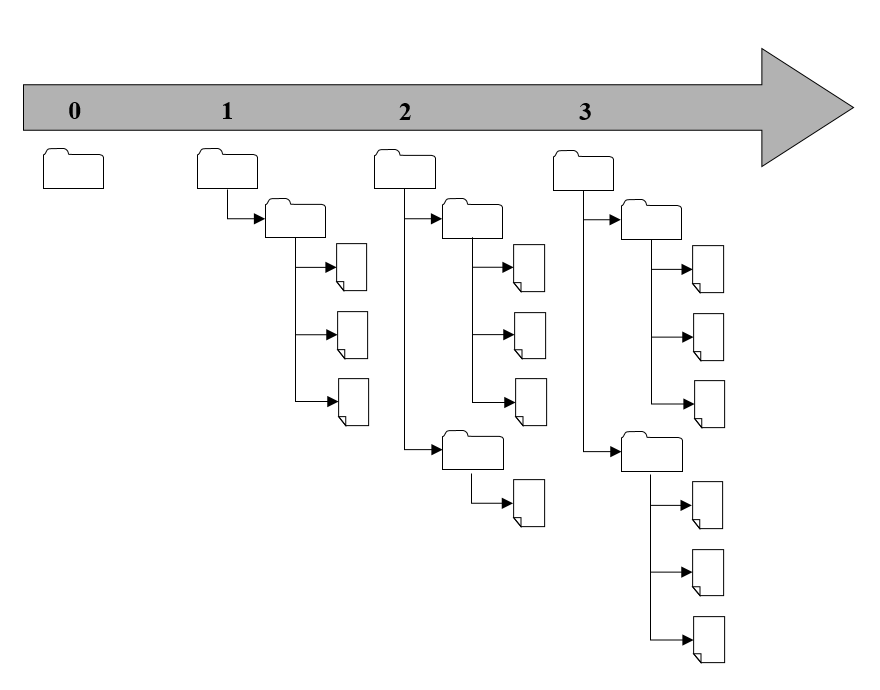

<!--

author:   Sebastian Zug & André Dietrich
email:    Sebastian.Zug@informatik.tu-freiberg.de & andre.dietrich@informatik.tu-freiberg.de
version:  0.0.1
language: de
narrator: Deutsch Female

import: https://raw.githubusercontent.com/liaScript/rextester_template/master/README.md
        https://raw.githubusercontent.com/liaTemplates/ExplainGit/master/README.md

-->

# Vorlesung Softwareentwicklung - 2 - Versionsverwaltung

** TU Bergakademie Freiberg - Sommersemester 2020**

Link auf die aktuelle Vorlesung im Versionsmanagementsystem GitHub

https://github.com/SebastianZug/CsharpCourse/blob/SoSe2020/02_Versionsverwaltung.md

Die interaktive Form ist unter diese Link zu finden ->
[LiaScript Vorlesung 02](https://liascript.github.io/course/?https://raw.githubusercontent.com/SebastianZug/CsharpCourse/SoSe2020/02_Versionsverwaltung.md#1)

---------------------------------------------------------------------

## 7 Fragen in 7 Minuten


**1. Bewerten Sie die Aussage: GitHub und git sind im Grunde das gleiche!**

[( )] Die Aussage stimmt.
[(X)] Die Aussage ist falsch
[[?]] Lassen Sie sich nicht von der Ähnlichkeit der Namen täuschen und recherchieren Sie noch mal!
***********************************************************************

                                {{1}}
GitHub implementiert einen git-Server, bietet aber gleichzeit g

***********************************************************************

__2. Jetzt sind Sie dran ...__

__3. ...__

__4. ...__

__5. ...__

__6. ...__

__7. ...__


## 1. Motivation

                                   {{0-2}}
******************************************************************************

Was war das umfangreicheste Dokument, an dem Sie bisher gearbeitet haben? Bei vielen sicher eine Hausarbeit am Gymnasium. Wie haben Sie Ihren Fortschritt organisiert?

1. Im schlimmsten Fall haben Sie sich gar keine Gedanken gemacht und immer wieder ins gleiche Dokument geschrieben, das in einem Ordner liegt, der alle zugehörigen Dateien umfasst.
2. Eine Spur besser ist die Idee wöchentlich neue Kopien des Ordners anzulegen und diese in etwa so zu benennen:

```console
▶ ls
myProject
myProject_test
myProject_newTest
myProject_Moms_corrections
...
```

3. Wenn Sie "einen Plan hatte", haben Sie täglich eine Kopie aller Dateien in einem Ordner angelegt und diese systematisch benannt.

```console
▶ ls
myProject_01042020
myProject_02042020
myProject_03042020
...
```

In den Ordnern gab es dann aber wieder das gleiche Durcheinander wie in (2), weil Sie bestimmte Texte gern kurzfristig sichern wollten. Teilweise haben sie diese dann gelöscht bevor die Kopie erstellt wurde, meistens aber einfach in einem `sonstiges` Ordner belassen.

******************************************************************************


                          {{1-2}}
******************************************************************************

Überlegen Sie sich kurz, wie Sie vorgehen müssen, um Antworten auf die folgenden Fragen zu finden:

* "Wann wurde der letzte Stand der Datei x.y gelöscht?"
* "In welcher Version habe ich die Anpassung der Überschriften vorgenommen?"
* "Wie kann ich dies trotz anderer zwischenzeitlicher Änderungen rückgängig machen?"
* "Warum habe ich davon keine Kopie gemacht?"
* "..."

In jedem Fall viel manuelle Arbeit ...

******************************************************************************

                          {{2-3}}
******************************************************************************

Und nun übertragen wir den Ansatz auf eine Softwareentwicklungsprojekt mit vielen Mitstreitern. Die Herausforderungen potenzieren sich.

0. Die Erstellung der Tageskopie müsste synchron erfolgen.
1. Ich muss in die Ordner schauen, um zu sehen welche Anpassungen vorgenommen wurden.
1. Ich weiß nicht welche die aktuelle Version einer Datei ist.
2. Es existieren plötzlich mehrere Varianten einer Datei mit Änderungen an unterschiedlichen Codezeilen.
3. Ich kann den Code nicht kompilieren, weil einzelne Dateien fehlen.
4. Ich kann eine ältere Version der Software nicht finden - "Gestern hat es noch funktioniert".
5. Meine Änderungen wurden von einem Mitstreiter einfach überschrieben.

******************************************************************************


### Lösungsansatz

Eine Versionsverwaltung ist ein System, das zur Erfassung von Änderungen an Dokumenten oder Dateien verwendet wird. Alle Versionen werden in einem Archiv mit Zeitstempel und Benutzerkennung gesichert und können später wiederhergestellt werden. Versionsverwaltungssysteme werden typischerweise in der Softwareentwicklung eingesetzt, um Quelltexte zu verwalten.

Ein Beispiel, wie ein Versionsmanagementsystem die Arbeit von verteilten Autoren unterstützt ist die Implementierung von Wikipedia. Jede Änderung eines Artikels wird dokumentiert. Alle Versionen bilden eine Kette, in der die letzte Version als gültige angezeigt wird. Entsprechend der Angaben kann nachvollzogen werden: wer wann was geändert hat. Damit ist bei Bedarf eine Rückkehr zu früheren Version möglich.

<!-- width="100%" -->

Hauptaufgaben:

+ Protokollierungen der Änderungen: Es kann jederzeit nachvollzogen werden, wer wann was geändert hat.
+ Wiederherstellung von alten Ständen einzelner Dateien: Somit können versehentliche Änderungen jederzeit wieder rückgängig gemacht werden.
+ Archivierung der einzelnen Stände eines Projektes: Dadurch ist es jederzeit möglich, auf alle Versionen zuzugreifen.
+ Koordinierung des gemeinsamen Zugriffs von mehreren Entwicklern auf die Dateien.
+ Gleichzeitige Entwicklung mehrerer Entwicklungszweige (engl. Branch) eines Projektes, was nicht mit der Abspaltung eines anderen Projekts (engl. Fork) verwechselt werden darf.

Dabei unterscheiden wir 3 typen von Repositories:

+ lokale Versionsverwaltungen auf dem Rechner des Entwicklers
+ zentrale Versionsverwaltungen auf einem Server
+ verteilte Versionsverwaltungen

### Strategien zur Konfliktvermeidung

**Herausforderung**

Das Beispiel entstammt dem Buch Version Control with Subversion [Subversion](#7)

Zwei Nutzer (Harry und Sally) arbeiten am gleichen Dokument (A), das auf einem
zentralen Server liegt:

+ Beide führen verschiedene Änderungen an ihren lokalen Versionendes Dokuments durch.
+ Die lokalen Versionen werden nacheinander in das Repository geschrieben.
+ Sally überschreibt dadurch eventuell Änderungenvon Harry.

Die zeitliche Abfolge der Schreibzugriffe bestimmt welche Variante des Dokuments A überlebt.

<!--
style="width: 100%; max-width: 560px; display: block; margin-left: auto; margin-right: auto;"
-->
```ascii
+----------------------------+---------------------------+
|        Repository          |       Repository          |
|        +-------+           |       +-------+           |
|        |   A   |           |       |   A   |           |
|        +-------+           |       +-------+           |
|         /     \            |                           |
|    read/       \read       |                           |
|       /         \          |                           |
|      v           v         |                           |
| +-------+    +-------+     | +-------+   +-------+     |
| |   A   |    |   A   |     | |   A'  |   |  A''  |     |
| +-------+    +-------+     | +-------+   +-------+     |
|   Harry        Sally       |   Harry       Sally       |
|                            |                           |
| Erzeugen der lokalen Kopie | Barbeitung                |
+----------------------------+---------------------------+
|        Repository          |       Repository          |
|        +-------+           |       +-------+           |
|        |   A'  |           |       |  A''  |           |
|        +-------+           |       +-------+           |
|         ^                  |              ^            |
|   write/                   |               \write      |
|       /                    |                \          |
|      /                     |                 \         |
| +-------+    +-------+     | +-------+   +-------+     |
| |   A'  |    |  A''  |     | |   A'  |   |  A''  |     |
| +-------+    +-------+     | +-------+   +-------+     |
|   Harry        Sally       |   Harry       Sally       |
|                            |                           |
|Harry schreibt seine Version|Sally übermittelt A''      |
+----------------------------+---------------------------+                     .
```

**Lösung I - Exklusives Bearbeiten (Sequenzialisierung)**

Bei der pessimistische Versionsverwaltung (*Lock Modify Unlock*) werden einzelne Dateien vor einer Änderung durch den Benutzer gesperrt und nach Abschluss der Änderung wieder freigegeben werden. Während sie gesperrt sind, verhindert das System Änderungen durch andere Benutzer. Der Vorteil dieses Konzeptes ist, dass kein Zusammenführen von Versionen erforderlich ist, da nur immer ein Entwickler eine Datei ändern kann.

<!--
style="width: 100%; max-width: 560px; display: block; margin-left: auto; margin-right: auto;"
-->
```ascii
+----------------------------+---------------------------+
|        Repository          |       Repository          |
|        ╔═══════╗           |       ╔═══════╗           |
|        ║   A   ║  locked   |       ║   A   ║  locked   |
|        ╚═══════╝           |       ╚═══════╝           |
|         ^/                 |             X             |
|    lock//read              |              \lock        |
|       //                   |               \           |
|      /v                    |                \          |
| +-------+    +-------+     | +-------+   +-------+     |
| |   A   |    |       |     | |   A'  |   |  A''  |     |
| +-------+    +-------+     | +-------+   +-------+     |
|   Harry        Sally       |   Harry       Sally       |
|                            |                           |
| Harry "locks", kopiert und | Sallys lock request wird  |
| beginnt die Bearbeitung    | blockiert                 |
+----------------------------+---------------------------+
|        Repository          |       Repository          |
|        +-------+           |       +-------+           |
|        |   A'  |           |       |  A''  |           |
|        +-------+           |       +-------+           |
|         ^^                 |             ^\            |
|   write//unlock            |         lock \\read       |
|       //                   |               \\          |
|      //                    |                \v         |
| +-------+    +-------+     | +-------+   +-------+     |
| |   A'  |    |  A''  |     | |   A'  |   |   A'  |     |
| +-------+    +-------+     | +-------+   +-------+     |
|   Harry        Sally       |   Harry       Sally       |
|                            |                           |
| Harry übermittelt seine    | Sally blockiert und liest |
| Version und löst den Lock  | die neue Version          |
+----------------------------+---------------------------+                     .
```

Welche Aspekte sehen Sie an dieser Lösung kritisch?

1. Administrative Probleme ... Gesperrte Dokumente werden vergessen zu entsperren.
2. Unnötige Sequentialisierung der Arbeit ... Wenn zwei Nutzer ein Dokument an verschiedenen Stellen ändern möchten, könnten sie dies auch gleichzeitig tun.
3. Keine Abbildung von übergreifenden Abhängigkeiten ... Zwei Nutzer arbeiten getrennt auf den Dokumenten A und B. Was passiert, wenn A von B abhängig ist? A und B passen nicht mehr zusammen. Die Nutzer müssen dieses Problem diskutieren.

**Lösung II - Kollaboratives Arbeiten mit Mischen (Mergen)**

Optimistische Versionsverwaltungen (*Copy Modify Merge*) versuchen die die Schwächen der pessimistischen Versionsverwaltung zu beheben, in dem siegleichzeitige Änderungen durch mehrere Benutzer an einer Datei zu lassen und anschließend diese Änderungen automatisch oder manuell zusammen führen (Merge).

<!--
style="width: 100%; max-width: 560px; display: block; margin-left: auto; margin-right: auto;"
-->
```ascii
+----------------------------+---------------------------+
|        Repository          |       Repository          |
|        +-------+           |       +-------+           |
|        |   A   |           |       |   A   |           |
|        +-------+           |       +-------+           |
|         /     \            |                           |
|    read/       \read       |                           |
|       /         \          |                           |
|      v           v         |                           |
| +-------+    +-------+     | +-------+   +-------+     |
| |   A   |    |   A   |     | |   A'  |   |  A''  |     |
| +-------+    +-------+     | +-------+   +-------+     |
|   Harry        Sally       |   Harry       Sally       |
|                            |                           |
| Erzeugen der lokalen Kopie | Barbeitung                |
+----------------------------+---------------------------+
|        Repository          |       Repository          |
|        +-------+           |       +-------+           |
|        |  A''  |           |       |  A''  |           |
|        +-------+           |       +-------+           |
|              ^             |         X                 |
|               \write       |   write/                  |
|                \           |       /                   |
|                 \          |      /                    |
| +-------+    +-------+     | +-------+   +-------+     |
| |   A'  |    |  A''  |     | |   A'  |   |  A''  |     |
| +-------+    +-------+     | +-------+   +-------+     |
|   Harry        Sally       |   Harry       Sally       |
|                            |                           |
|Sally schreibt ihre Version |Harries Schreibversuch wird|
|                            |blockiert                  |
+----------------------------+---------------------------+
|        Repository          |       Repository          |
|        +-------+           |       +-------+           |
|        |  A''  |           |       |  A''  |           |
|        +-------+           |       +-------+           |
|         /                  |                           |
|    read/                   |                           |
|       /                    |                           |
|      v                     |                           |
| +-------+    +-------+     | +-------+   +-------+     |
| | A',A''|    |  A''  |     | |   A*  |   |  A''  |     |
| +-------+    +-------+     | +-------+   +-------+     |
|   Harry        Sally       |   Harry       Sally       |
|                            |                           |
| Mergen der Kopien          | merge(A',A'')=A*          |
+----------------------------+---------------------------+
|        Repository          |       Repository          |
|        +-------+           |       +-------+           |
|        |   A*  |           |       |   A*  |           |
|        +-------+           |       +-------+           |
|         ^                  |              \            |
|   write/                   |               \read       |
|       /                    |                \          |
|      /                     |                 v         |
| +-------+    +-------+     | +-------+   +-------+     |
| |   A*  |    |  A''  |     | |   A*  |   |   A*  |     |
| +-------+    +-------+     | +-------+   +-------+     |
|   Harry        Sally       |   Harry       Sally       |
|                            |                           |
|Harry schreibt seine Version|Sally übermittelt A''      |
+----------------------------+---------------------------+                     .
```

Ablauf:

+ Harry und Sally kopierendas das Dokument A in ihre lokalen Ordner.
+ Beide arbeiten unabhängig daran und erzeugen die Versionen A' und A''
+ Sally schreibt als Erste das Dokument in das Repository zurück.
+ Harry kann das Dokument nun nicht mehr zurückschreiben, seine Version ist veraltet
+ Harry vergleicht seine lokale Version mit der aktuellen Version im Repository und mischt die Änderungen von Sally mit seinen Anpassungen
+ Die neue (gemischte) Version A\* wird zurückgeschrieben.
+ Sally muss eine neue Leseoperation realisieren, da Ihre lokale Version veraltet ist.

Welche Konsequenzen ergeben sich daraus?

+ Unser Dokument muss überhaupt kombinierbar sein! Auf ein binäres Format ließe sich das Konzept nicht anwenden!
+ Das Dokument liegt in zeitgleich in n-Versionen vor, die ggf. überlappende Änderungen umfassen.
+ Das zentrale Repository kennt die Version von Harry nur indirekt. Man kann zwar indirekt aus A'' und A* auf A' schließen, man verliert aber zum Beispiel die Information wann Harry seine Änderungen eingebaut hat.

Die Herausforderung liegt somit im Mischen von Dokumenten!

### _Mergen_ von Dokumenten

**Schritt 1: Identifikation von Unterschieden**

Zunächst einmal müssen wir feststellen an welchen Stellen es überhaupt Unterschiede
gibt. Welche Differenzen sehen Sie zwischen den beiden Dokumenten:

```markdown                      DokumentV1.md
TU
Bergakademie
Freiberg
Softwareentwicklung
Online Course
Sommersemester 2020
Lorem ipsum dolor sit amet, CONSETETUR sadipscing elitr, sed diam nonumy eirmod tempor invidunt ut labore et dolore magna aliquyam erat, sed diam voluptua. At vero eos et accusam et justo duo dolores et ea rebum. Stet clita kasd gubergren, no sea takimata sanctus est Lorem ipsum dolor sit amet.
```

```markdown                      DokumentV2.md


TU
Bergakademie
Freiberg
Softwareentwicklung
Sommersemester 2019
Lorem ipsum dolor sit amet, consetetur sadipscing elitr, sed diam nonumy eirmod tempor invidunt ut labore et dolore magna aliquyam erat, sed diam voluptua. At vero eos et accusam et justo duo dolores et ea rebum. Stet clita kasd gubergren, no sea takimata sanctus est Lorem ipsum dolor sit amet.
```

Offenbar wurden sowohl Lehrzeichen, als auch neue Zeilen eingeführt. In anderen Zeilen wurden Inhalte angepasst.

Nutzen wir das Tool `diff` um diese Änderungen automatisiert festzustellen. Die Zeilen, die mit `>` beginnen, sind nur in der ersten Datei vorhanden, diejenigen, die mit `<`, markieren das Vorkomen in der zweiten Datei. Die einzelnen Blöcke werden durch sogenannte change commands („Änderungsbefehle“) getrennt, die angeben, welche Aktion (Zeilen hinzufügen – a, ändern – c oder entfernen – d) in welchen Zeilen ausgeführt wurde.

```console
▶diff markdownV1.md markdownV2.md
0a1,3
>
>
>
5,7c8,9
< Online Course
< Sommersemester 2020
< Lorem ipsum dolor sit amet, CONSETETUR sadipscing elitr, ...
---
> Sommersemester 2019
> Lorem ipsum dolor sit amet, consetetur sadipscing elitr, ...
```

> **Merke**: Sehr lange Zeilen erschweren die Suche nach wirklichen Änderungen!

Dahinter steht das _Longest Common Subsequence_ Problem, dessen Algorithmen Sie bitte als Aufgabe 1 in dieser Woche recherchieren.

**Schritt 2: Mischen**

In der Praxis wird zwischen zwei Szenarien unterschieden:

1. Mischen unabhäniger Dokumente (2-Wege-Mischen) - Ziel ist die Erzeugung eines neuen Dokumentes, dass die gemeinsamen Komponenten und individuelle Teilmengen vereint.

2. Mischen von Dokumenten mit gemeinsamer Ursprung (3-Wege-Mischen) - Ziel ist die Integration möglichst aller Änderungen der neuen Dokumente in eine weiterentwickelte Version der des Ursprungsdokumentes

> Ein Paar von Änderung aus D1 bzw. D2 gegenüber einen Ausgangsdokument D0 kann unverträglich sein, wenn die Abbildung beiden Änderungen in einem gemeinsamen Dokument nicht möglich ist. In diesem Fall spricht man von einem Konflikt.

Bei einem Konflikt muss eine der beiden ̈Änderungen weggelassen werden. Die Entscheidung darüber kann anhand von zwei vorgehensweisen realisiert werden:

1. Nicht-interaktives Mischen: Es wird zunächst ein Mischergebnis erzeugt, das beide Änderungen umfasst. Über eine entsprechend Semantik werden die notwendigerweise dublizierten Stellen hervorgehoben. Ein Vorteil dieser Vorgehensweise ist, dass eine beliebige weitergehende Editierung zur Konfliktauflosung möglich ist.
2. Interaktives Mischen: Ein Entwickler wird unmittelbar in den Mischprozess eingebunden und um "Schritt-für-Schritt" Entscheidungen gebeten. Denkbare Entscheidungen dabei sind:

    + Übernahme der Änderung gemäß D1 oder D2,

    + Übernahme keiner Änderung,

    + Übernahme von modifizierten Änderung

### Revisionen

Bislang haben wir lediglich einzelne Dateien betrachtet. Logischerweise muss ein übergreifender Ansatz auf Ordnerstrukturen integrieren.

<!-- width="70%" --> [](#7)

Damit werden sowohl die Ordnerstruktur als auch die Dokumente als Struktur, wie auch deren Inhalte erfasst.

> Wichtig für die Nachvollziehbarkeit der Entwicklung ist somit die Kontinuität der Erfassung!

Wenn sich der Ordner- oder Dateiname ändert wollen wir trotzdem noch die gesamte History der Entwicklung innerhalb eines Dokuments kennen. Folglich muss ein Link zwischen altem und neuem Namen gesetzt werden.

### Formen der Versionsverwaltung

**Lokale Versionsverwaltung**
Bei der lokalen Versionsverwaltung wird oft nur eine einzige Datei versioniert, diese Variante wurde mit Werkzeugen wie SCCS und RCS umgesetzt. Sie findet auch heute noch Verwendung in Büroanwendungen, die Versionen eines Dokumentes in der Datei des Dokuments selbst speichern (Word).

**Zentrale Versionsverwaltung**
Diese Art ist als Client-Server-System aufgebaut, sodass der Zugriff auf ein Repository auch über Netzwerk erfolgen kann. Durch eine Rechteverwaltung wird dafür gesorgt, dass nur berechtigte Personen neue Versionen in das Archiv legen können. Die Versionsgeschichte ist hierbei nur im Repository vorhanden.

Dieses Konzept wurde vom Open-Source-Projekt Concurrent Versions System (CVS) populär gemacht, mit Subversion (SVN) neu implementiert und von vielen kommerziellen Anbietern verwendet.

<!--
style="width: 100%; max-width: 560px; display: block; margin-left: auto; margin-right: auto;"
-->
```ascii
                                +-----------------+
                                | V 21.09         |
                              +-----------------+ |
                              | V 21.10         | |
              Zentrales     +-----------------+ | |
              Repository    | V 21.11         | | |
                            |                 | |-+
                            |                 | |
                            |                 |-+
                            |                 |
                            +-----------------+
                                    |
          +-------------------------+--------------------------+
          |                         |                          |
  +-----------------+       +-----------------+       +-----------------+
  | V 21.11         |       | V 21.11         |       | V 21.11         |
  | ABCD            |       | GEFH            |       | IKLM            |
  |                 |       |                 |       |                 |
  +-----------------+       +-----------------+       +-----------------+
    User 1                    User 2                    User 3
    Lokale Kopien
```


**Verteilte Versionsverwaltung**
Die verteilte Versionsverwaltung (DVCS, distributed VCS) verwendet kein zentrales Repository mehr. Jeder, der an dem verwalteten Projekt arbeitet, hat sein eigenes Repository und kann dieses mit jedem beliebigen anderen Repository abgleichen. Die Versionsgeschichte ist dadurch genauso verteilt. Änderungen können lokal verfolgt werden, ohne eine Verbindung zu einem Server aufbauen zu müssen.

<!--
style="width: 100%; max-width: 560px; display: block; margin-left: auto; margin-right: auto;"
-->
```ascii
                                +-----------------+
                                | V 21.09         |
                              +-----------------+ |
                              | V 21.10         | |
              Zentrales     +-----------------+ | |
              Repository    | V 21.11         | | |
                            |                 | |-+
                            |                 | |
                            |                 |-+
                            |                 |
                            +-----------------+
                                    |
          +-------------------------+--------------------------+
          |                         |                          |
    +-----------------+      +-----------------+         +-----------------+
    | V 21.09         |      | V 21.09         |         | V 21.09         |
  +-----------------+ |    +-----------------+ |       +-----------------+ |
  | V 21.10         | |    | V 21.10         | |       | V 21.10         | |
+-----------------+ | |  +-----------------+ | |     +-----------------+ | |
| V 21.11         | | |  | V 21.11         | | |     | V 21.11         | | |
|                 | |-+  |                 | |-+   +-----------------+ | |-+
|                 | |    |                 | |     | V 21.12         | | |
|                 |-+    |                 |-+     |                 | |-+
|                 |      |                 |       |                 | |
+-----------------+      +-----------------+       |                 |-+
         |                        |                +-----------------+
         |                        |                          |
         |                        |                          |
+-----------------+       +-----------------+         +-----------------+
| V 21.11         |       | V 21.09         |         | V 21.12         |
| ABCD            |       | GEFH            |         | IKLM            |
|                 |       |                 |         |                 |
+-----------------+       +-----------------+         +-----------------+
  User 1                    User 2                      User 3

```

| Zentrale Versionsverwaltung                                       | Verteilte Versionsverwaltung                                |
| ----------------------------------------------------------------- | ----------------------------------------------------------- |
| Historie liegt nur auf dem Server                                 | gesamte Historie ist den lokalen Repositiories bekannt              |
| Zentrales Repository als Verbindungselement                       | n gleichberechtigte Repositories                            |
| Konflikte bei Manipulation eines Dokumentes durch mehrere Autoren | Existenz paralleler  Versionen eines Dokumentes abgesichert |
| Sequenz von Versionen                                             | gerichteter azyklischer Graph                               |

###Git

**Basisbefehle**

Die Entwicklungsgeschichte von git ist mit der des Linux Kernels verbunden:

| 1991 | 2002 | 2005 |
| ---- | ---- | ---- |
| Änderungen am Linux Kernel via patches und archive files      | Linux Kernel mit dem Tool BitKeeper verwaltet      | Bruch zwischen der vertreibenden Firma und der Linux Community     |

2005 wurde einen Anforderungsliste für eine Neuentwicklung definiert. Dabei wurde hervorgehoben, das insbesondere sehr große Projekte (Zahl der Entwickler, Features und Codezeilen, Dateien) unterstützen können muss. Daraus entstand `Git` als freie Software zur verteilten Versionsverwaltung von Dateien.

> Git dominiert entweder als einzelne Installation oder aber eingebettet in verschiedene Entwicklungsplattform die Softwareentwicklung!

Wie bekommen sie Git auf Ihren Windows-Rechner?

1. Variante 1: als Integralen Bestandteil in Ihrer Entwicklungsumgebung**
Die großen IDEs umfassen einen eigenen Git-Client, für einfachere Editoren muss dieser meist nachinstalliert werden.

2. Variante 2: als unabhänigige Installation
Unter [Link](https://phoenixnap.com/kb/how-to-install-git-windows) findet sich eine Schritt-für-Schritt Beschreibung für die Installation von Git unter Windows. Dabei wird sowohl ein Shell als auch eine GUI installiert.

3. Variante 3: mittels cygwin
Cygwin emuliert Linuxbefehle und Tools der Shell. Neben Compilern und einer Vielzahl von Entwicklertools können auch verschiedene Versionsverwaltungen installiert werden.

Eine übergreifende Erklärung für die Installation gibt zum Beispiel dieses [Tutorial](https://www.youtube.com/watch?v=Fk12ELJ9Bww).

**Einfache Anwendungsfälle**

_Einfaches Editieren_: Sie klonen das gesamte Repository, dass sich auf dem "Server-Rechner" befindet. Damit haben Sie eine vollständige Kopie aller Versionen in Ihrem Working Directory. Wenn wir annehmen, dass keine branches im Repository bestehen, dann können Sie direkt auf der Ihrer Arbeitskopie arbeiten und diese verändern. Danach generieren Sie einen Snappshot des Arbeitsstandes _Staging_. Ihre Version ist als relevant markiert und kann im lokalen Repository als neuer Eintrag abgelegt werden. Vielleicht wollen sie Ihren Algoritmus noch weiterentwickeln und speichern zu einem späteren Zeitpunk eine weitere Version. All diese Vorgänge betreffen aber zunächst nur Ihre Kopie, ein anderer Mitstreiter in diesem Repository kann darauf erst zurückgreifen, wenn Sie das Ganze an den Server übermittelt haben.

<!--
style="width: 100%; max-width: 560px; display: block; margin-left: auto; margin-right: auto;"
-->
```ascii
                     lokal                           remote
  ---------------------------------------------  --------------
  Arbeitskopie     "Staging"        Lokales          Remote
                                   Repository      Repository
                       |               |                 |
                       |               |    git clone    |
                       |               |<----------------|
       +-+- - - - - - -|- - - - - - - -|                 |
       | | Änderungen  |               |                 |
       | |             |               |                 |
       +-+             |               |                 |
        |   git add    |               |                 |
        |------------->|  git commit   |                 |
        |              |-------------->|                 |
       +-+             |               |                 |
       | | weitere     |               |                 |
       | | Änderungen  |               |                 |
       +-+             |               |                 |
        |   git add    |               |                 |
        +------------->|  git commit   |                 |
                       |-------------->|   git push      |
                       |               |---------------->|
                       |               |                 |                     .
```


Nehmen wir nun an, dass Ihr Kollege in dieser Zeit selbst das Remote Repository fortgeschrieben hat. In diesem Fall bekommen Sie bei Ihrem `push` eine Fehlermeldung, die sie auf die neuere Version hinweist. Nun "ziehen" Sie sich den aktuellen
Stand in Ihr Repository und kombinieren die Änderungen. Sofern keine Konflikte
entstehen, wird daraus ein neuer Commit generiert, den Sie dann mit Ihren Anpassungen an das Remote-Repository senden.

<!--
style="width: 100%; max-width: 560px; display: block; margin-left: auto; margin-right: auto;"
-->
```ascii
                     lokal                           remote
  ---------------------------------------------  --------------
  Arbeitskopie     "Staging"        Lokales          Remote
                                   Repository      Repository
                       |               |                 |
                       |               |    git clone    |
                       |               |<----------------|
       +-+- - - - - - -|- - - - - - - -|                 |
       | | Änderungen  |               |                 |
       | |             |               |                 |
       +-+             |               |                 |
        |   git add    |               |                 |
        |------------->|  git commit   |                 |
        |              |-------------->|                 |
       +-+             |               |                 |
       | | weitere     |               |                 |
       | | Änderungen  |               |                 |   git push
       +-+             |               |                 |<-------------
        |   git add    |               |                 |
        +------------->|  git commit   |                 |
                       |-------------->|   git push      |
                       |               |---------------X |
                       |               |   git fetch     |
                       |               |<--------------- |     git fetch
                       |               |   git merge     |   + git merge
                       |               |<--------------- |   = git pull
                       |               |   git push      |
                       |               |---------------->|                   .
```

| Befehl       | Vorgang                                                                      |
| ------------ | ---------------------------------------------------------------------------- |
| git clone    | Erzeugung eines lokalen Repositories                                         |
| git add      | Markiert eine Datei für das "Staging"                                        |
| git commit   | Übergabe aller Stage-Dokumente an das lokale Repository                      |
| git push     | Synchronisation des lokalen Repositories mit einem Remote Repository (fasst fetch und merge)                     |
| git fetch    | Übernahme der Versionen vom Remote Repository                                |
| git checkout | Wechsel zwischen Branches oder Zugriff auf Version des Projektes             |
| git merge    | Mischt die Änderungen des lokalen Repositories mit der aktullen Arbeitskopie |

Wie sieht ein üblicher Ablauf bei der Bearbeitung eines Projektes aus?

```console
▶ git clone https://gitlab.com/Sebastian_Zug/CsharpCIExample.git
Cloning into 'CsharpCIExample'...
remote: Enumerating objects: 95, done.
remote: Counting objects: 100% (95/95), done.
remote: Compressing objects: 100% (72/72), done.
remote: Total 95 (delta 40), reused 46 (delta 19)
Unpacking objects: 100% (95/95), done.
▶ cd CsharpCIExample
▶ ls
Doxyfile  Makefile  README.md  src  test
▶ cat README.md
# CsharpCIExample

Zeigt die Features von GitLab CI im Kontext eines C#-Projektes. Dabei sollen
insbesondere die automatisierten Test und Buildkonzepte vorgestellt werden.
```

Hier fügen wir nun einen ergänzenden Inhalt in README.md ein.

```console
▶ git status
On branch master
Your branch is ahead of 'origin/master' by 1 commit.
  (use "git push" to publish your local commits)

Changes not staged for commit:
        modified:   ../README.md
▶ git add README.md
▶ git commit -m "Adds additional information to README"
▶ git push
```

Um also danach auf eine bestimmte Version zurückzukehren können Sie mittels
`checkout` in der Historie suchen.

```console
% git checkout 9
Completing recent commit object name
9bfb686  -- [9bfb686] Replaces wrong path reference (50 minutes ago)
9757c47  -- [9757c47] Replaces cd.. by referencing project files directly (55 minutes ago)
99861ba  -- [HEAD~17] Includiert erweiterte before_script Anweisungen (5 days ago)
```

**Arbeiten mit Branches**

Die Organisation von Versionen in unterschiedlichen Branches ist ein zentrales
Element der Arbeit mit git. Branches sind Verzweigungen des Codes, die bestimmte
Entwicklungsziele kapseln.

<!-- height="300px" --> [seibert](#7)

Der größte Nachteil bei der Arbeit mit nur einem Branch liegt darin, dass bei einem
defekten Master(-Branch) die Arbeit sämtlicher Beteiligter unterbrochen wird. Branches
schaffen einen eignen (temporären) Raum für die Entwicklung neuer Features, ohne
die Stabilität des Gesamtsystems zu gefährden. Gleichzeitig haben die Entwickler den gesamten Verlauf eines Projekts in strukturierter Art zur Hand.

Nehmen wir an, dass Sie einen neuen Branch "feature_x" anlegen wollen, um eine
zusätzliche Klasse "newClass.cs" zu realisieren.

```
▶git checkout -b feature_x
▶touch newFile.txt
▶git add newClass.cs
▶git commit -m "Adds a new fancy feature"
▶git checkout master
▶git merge feature_x
```


## Git Einführung


``` text @ExplainGit.eval
git commit
git commit -m Hello World
git branch dev
git checkout dev
git commit -m dev commit
git checkout master
git commit -m master commit
```


## Anhang

**Referenzen**

[subversion]  Brian W. Fitzpatrick, Ben Collins-Sussman, C. Michael Pilato, Version Control with Subversion, 2nd Edition, O'Reilly Media

[max] Macs & Moritz, Sei (k)ein Schwachkopf: Versionsverwaltung mit Git unter Mac OS X, https://macs-moritz.com/sei-kein-schwachkopf-versionsverwaltung-mit-git-unter-mac-os-x

[seibert] Martin Seibert, Git-Workflows: Der Gitflow-Workflow (Teil 1), https://blog.seibert-media.net/blog/2014/03/31/git-workflows-der-gitflow-workflow-teil-1/
