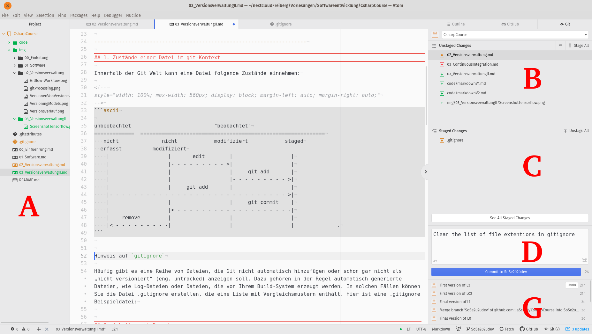

<!--

author:   Sebastian Zug & André Dietrich
email:    zug@ovgu.de   & andre.dietrich@ovgu.de
version:  0.0.1
language: de
narrator: Deutsch Female

import: https://raw.githubusercontent.com/liaScript/rextester_template/master/README.md
        https://raw.githubusercontent.com/liaTemplates/ExplainGit/master/README.md

-->

# Vorlesung Softwareentwicklung - 3 - Versionsverwaltung II
**TU Bergakademie Freiberg - Sommersemester 2020**

Link auf die aktuelle Vorlesung im Versionsmanagementsystem GitHub

https://github.com/SebastianZug/CsharpCourse/blob/SoSe2020/03_VersionsverwaltungII.md

Die interaktive Form ist unter diese Link zu finden ->
[LiaScript Vorlesung 03](https://liascript.github.io/course/?https://raw.githubusercontent.com/SebastianZug/CsharpCourse/SoSe2020/03_VersionsverwaltungII.md#1)

---------------------------------------------------------------------

## 1. Zustände einer Datei im git-Kontext

Sie kennen bereits die möglichen Zuständer einer Datei innerhalb der GitHub-Welt.

Wir unterscheiden zwischen `tracked` und `untracked` files, also Dateien, die vom Versionssystem berücksichtigt werden oder eben nicht. Nicht beobachtet können zum Beispiel Testdaten sein, die man nutzt, um den eigentlichen Algorithmus, der natürlich getrackt wird zu evaluieren. Wenn Dateien einmal mit `git add` erfasst wurden, gehören Sie zum Kreis der versionierten Dateien. Die Erfassung jeder Änderung kann nun mit `git add` in den Versionen Berücksichtigung finden.

<!--
style="width: 100%; max-width: 560px; display: block; margin-left: auto; margin-right: auto;"
-->
```ascii

unbeobachtet                           "beobachtet"
=============  ============================================================
   nicht              nicht            modifiziert            staged
  erfasst          modifiziert
    |                   |       edit        |                   |
    |                   |- - - - - - - - - >|                   |
    |                   |                   |     git add       |
    |                   |                   |- - - - - - - - - >|
    |                   |     git add       |                   |
    |- - - - - - - - - - - - - - - - - - - - - - - - - - - - - >|
    |                   |                   |     git commit    |
    |                   |< - - - - - - - - - - - - - - - - - - -|
    |    remove         |                   |                   |
    |< - - - - - - - - -|                   |                   |              .
```

Die Editoren unterstützen den Nutzer bei der Arbeit, in dem Sie die eigentlichen Commandozeilentools rund um die Arbeitsfläche anordnen.

<!-- width="100%" -->

| Bereich | Bedeutung                                                                                                                                                                                                                                  |
| ------- | ------------------------------------------------------------------------------------------------------------------------------------------------------------------------------------------------------------------------------------------ |
| A       | Darstellung der Dateien im Ordner, wobei der Typ über die führenden Symbole und der Zustand über die Farbgebung hervorgehoben wird (grün untracked Files, orange getrackte Dateien mit Änderungen).                                        |
| B       | Hier erfolgt die Darstellung der `Staged Changes` also der registrierten Änderungen. Offenbar ist die Datei `02_Versionsverwaltung.md` verändert worden, ohne dass ein entsprechendes `git add 02_Versionsverwaltung.md` ausgeführt wurde. |
| C       | Die Übersicht der erfassten Änderngen mit einem `stage` Status übernimmt die aus der darüber geführten Liste, wenn der Befehlt ausgeführt wurde. Offenbar ist dies fr `.gitignore` der Fall.                                               |
| D       | Die Übertragung ins lokale Repository wird gerade vorbereitet. Die Commit-Nachricht ist bereits eingegeben. Der Button zeigt den zugehörigen Branch.                                                                                       |
|         | G                                                 An dieser Stelle wird ein kurzes Log der letzten Commits ausgeben. Dies ermöglich das effiziente Durchsuchen der nach bestimmten Veränderungen.                                                                                                                                                                                          |

Die identischen Informationen lassen sich auch auf der Kommandozeile einsehen:

```console
▶git status
On branch SoSe2020dev
Your branch is up to date with 'origin/SoSe2020dev'.

Changes to be committed:
  (use "git reset HEAD <file>..." to unstage)

        modified:   .gitignore

Changes not staged for commit:
  (use "git add/rm <file>..." to update what will be committed)
  (use "git checkout -- <file>..." to discard changes in working directory)


        modified:   02_Versionsverwaltung.md
        deleted:    03_ContinuousIntegration.md

Untracked files:
  (use "git add <file>..." to include in what will be committed)

        03_VersionsverwaltungII.md
        code/
        img/03_VersionsverwaltungII/
```

```console
▶git log
commit d7603554c958c478f1ec600bd3ccea437d91ae9a (HEAD -> SoSe2020dev, origin/SoSe2020dev)
Author: Sebastian Zug <Sebastian.Zug@informatik.tu-freiberg.de>
Date:   Thu Apr 9 13:16:38 2020 +0200

    First version of L3

commit 39fc168222f4c7a7d062adcaccff17fe34bccbe3
Author: Sebastian Zug <Sebastian.Zug@informatik.tu-freiberg.de>
Date:   Thu Apr 9 13:16:12 2020 +0200

    First version of L02

commit 350c127c7dfbc61a81edc8bd148f605ee681a07a

Author: Sebastian Zug <Sebastian.Zug@informatik.tu-freiberg.de>
Date:   Tue Apr 7 07:01:02 2020 +0200

    Final version of L1
....
```

Häufig bettet ein Projekt Dateien ein, die Git nicht automatisch hinzufügen oder schon gar nicht als „nicht versioniert“ anzeigen soll. Beispiele dafür sind automatisch generierte Dateien, wie Log-Dateien oder die Binaries, die von Ihrem Build-System erzeugt wurden. In solchen Fällen können Sie die Datei .gitignore erstellen, die eine Liste mit Vergleichsmustern enthält. Hier ist eine .gitignore Beispieldatei:

```console     gitignoreExample
# ignore all .a files
*.a

# but do track lib.a, even though you're ignoring .a files above
!lib.a

# only ignore the TODO file in the current directory, not subdir/TODO
/TODO

# ignore all files in any directory named build
build/

# ignore doc/notes.txt, but not doc/server/arch.txt
doc/*.txt

# ignore all .pdf files in the doc/ directory and any of its subdirectories
doc/**/*.pdf
```

Unter [gitIgnoreBeispiele](https://github.com/github/gitignore) gibt es eine ganze Sammlung von Konfigurationen für bestimmte Projekttypen.

## 2. Arbeiten mit Branches

Die Organisation von Versionen in unterschiedlichen Branches ist ein zentrales
Element der Arbeit mit git. Branches sind Verzweigungen des Codes, die bestimmte
Entwicklungsziele kapseln.

Der größte Nachteil bei der Arbeit mit nur einem Branch liegt darin, dass bei einem
defekten Master(-Branch) die Arbeit sämtlicher Beteiligter unterbrochen wird. Branches
schaffen einen eignen (temporären) Raum für die Entwicklung neuer Features, ohne
die Stabilität des Gesamtsystems zu gefährden. Gleichzeitig haben die Entwickler den gesamten Verlauf eines Projekts in strukturierter Art zur Hand.

Wie sieht das zum Beispiel für unsere Kursmaterialien aus?

<!--
style="width: 100%; max-width: 560px; display: block; margin-left: auto; margin-right: auto;"
-->
```ascii

        vSoSe2019                                                   vSoSe2020
Master   O-----------------------------------------  ....  ---------O
          \                                                        ^
           \               Offizielle Versionen                   /
SoSe2020    \              O-->O                 O          ---->O
             \            ^     \               /
              v          /       v             /
SoSe2020dev    O->O---->O---->O->O---->O-->O->O      ....
               Vorlesung      Vorlesung
               00             01
```

Ein Branch in Git ist einfach ein Zeiger auf einen Commit zeigt. Der zentrale Branch wird zumeist als `master` bezeichnet.

### Generieren und Navigation über Branches

@@ Hinweis
    git branch feature
    git checkout feature
    git checkout 0e8bf9e
    git branch newFeature

``` text @ExplainGit.eval
git commit -m V1
git commit -m V2
git commit -m V3
```


### Mergoperationen über Branches
<!--
@@ Hinweis für die Realisierung
    git checkout master
    git branch hotfix
    git checkout hotfix
    git commit -m "Solve bug"
    git checkout master
    git merge hotfix
    You have performed a fast-forward merge.
    git branch -d hotfix
    git checkout newFeature
    git commit -m FeatureV3
    git checkout master
    git merge newFeature
    Beim fast-forward merge gibt es keine nachfolgende Version. Der master wird
    einfach auf den anderen branch verschoben.
    Im zweiten Fall läuft ein 3 Wege Merge ab
-->
Nehmen wir folgendes Scenario an. Sie arbeiten an einem Issue, dafür haben Sie
einen separaten Branch (newFeature) erzeugt und haben bereits einige Commits
realisiert. Beim Kaffeetrinken denken Sie über den Code von letzter Woche nach und Ihnen fällt ein Bug ein, den Sie noch nicht behoben haben. Jetzt aber schnell!

Legen Sie dafür einen neuen Branch an, commiten Sie eine Version und mergen
Sie diese mit dem Master. Kehren Sie dann in den Feature-Branch zurück und
beenden Sie die Arbeit. Mergen Sie auch diesen Branch mit dem Master.
Worin unterscheiden sich beide Vorgänge?

``` text @ExplainGit.eval
git branch newFeature
git checkout newFeature
git commit -m FeatureV1
git commit -m FeatureV2
```

Mergen ist eine nicht-destruktive Operation. Die bestehenden Branches werden auf keine Weise verändert. Das Ganze "bläht" aber den Entwicklungsbaum auf.

### Rebase mit einem Branche
<!--
@@ Hinweis für die Realisierung
    git checkout master
    git rebase newFeature
    git branch -d newFeature
-->

Zum `merge` exisitert auch noch eine alternative Operation. Mit `rebase` werden die Änderungen eins branches in einem Patch zusammengefasst. Dieser wird dann auf head angewandt.

``` text @ExplainGit.eval
git branch newFeature
git checkout newFeature
git commit -m FeatureV1
git commit -m FeatureV2
git checkout master
git commit -m V1
```


## Typische Abläufe

**Ergänzen eines Commits um zusätzliche Dateien**

Ein typisches Problem ist, dass sie im Entwicklungseifer nicht alle zugehörigen Dateien dem letzten Commit zu geordnet haben. Sie können nun einen weiteren Commit "hinterherschicken", dieses vorgehen zerstört aber Ihren Fluß.

```console
▶git add newClass.cs
▶git commit -m "Adds a new fancy feature"
▶touch newClass_api_documentation.md
▶git add newClass_api_documentation.md
▶git commit --amend -no-edit
```

**Letzte(n) Commits rückgängig machen**

Sie haben einen Commit realisiert, der Ihnen im Nachhinein als unsinnig erscheint und möchten diesen zurücknehmen. Die Veränderungen sollten aber erhalten bleiben. Nach dem Rückgesetzten des Commits liegen diese wieder so im Stage-Bereich, wie davor.

```console
▶git reset --soft HEAD^
```

Mit `HEAD^` geht von HEAD einen Schritt zurück HEAD^^/HEAD~2 geht 2 Committs zurück, …)

```console
▶git reset --hard HEAD^
```

ACHTUNG: Damit sind alle Veränderungen auch im Staging-Bereich UND im Working Directory WEG!!!

``` text @ExplainGit.eval
git commit -m V1
git commit -m V2
git commit -m V3
```

ExplainGit kann den Vorgang des `reset --soft` aus nachvollziehbaren gründen nicht abbilden.

**Umgestalten der History**

Ein sehr mächtiges Werkzeug ist der interaktive Modus von `git rebase`. Damit kann die
Geschichte neugeschrieben werden, wie es die git Dokumentation beschreibt. Im Grund können Sie damit Ihre Versionsgeschichte "aufräumen". Einzelne Commits umbenennen, löschen oder fusionieren. Dafür besteht ein eigenes Interface, dass Sie mit dem folgenden Befehl aufrufen können:

```console
▶git rebase -i HEAD~5

pick d2a06e4 Update main.yml
pick 78839b0 Reconfigures checkout
pick f70cfc7 Replaces wildcard by specific filename
pick 05b76f3 New pandoc command line
pick c56a779 Corrects md filename

# Rebase a3b07d4..c56a779 onto a3b07d4 (5 commands)
#
# Commands:
# p, pick = use commit
# r, reword = use commit, but edit the commit message
# e, edit = use commit, but stop for amending
# s, squash = use commit, but meld into previous commit
# f, fixup = like "squash", but discard this commit's log message
# x, exec = run command (the rest of the line) using shell
# d, drop = remove commit
#
# These lines can be re-ordered; they are executed from top to bottom.
#
# If you remove a line here THAT COMMIT WILL BE LOST.
#
# However, if you remove everything, the rebase will be aborted.
#
# Note that empty commits are commented out
```

Als Anwendungsfall habe ich mir meine Aktivitäten im Kontext einiger Experimente
mit den GitHub Actions, die im nächsten Abschnitt kurz eingeführt werden, ausgesucht.
Schauen wir zunächst auf den ursprünglichen Stand. Alle Experimente drehten sich darum, eine Datei anzupassen und dann auf dem Server die Korrektheit zu testen.

```console
▶
c56a779 - Sebastian Zug, 7 hours ago : Corrects md filename
05b76f3 - Sebastian Zug, 7 hours ago : New pandoc command line
f70cfc7 - Sebastian Zug, 8 hours ago : Replaces wildcard by specific filename
78839b0 - Sebastian Zug, 21 hours ago : Reconfigures checkout
d2a06e4 - Sebastian Zug, 22 hours ago : Update main.yml
...
aa04051 - Sebastian Zug, 23 hours ago : Restart action activities
4b22d12 - Sebastian Zug, 23 hours ago : Deleting old state
64075cc - Sebastian Zug, 24 hours ago : Update main.yml
01f341b - Sebastian Zug, 24 hours ago : Missing links added
...
29c8e68 - Sebastian Zug, 11 days ago : Update README.md
```

Unser lokaler Branch liegt nach dem Löschen aber um einiges hinter dem auf GitHub entsprechend müssen wir mit `git push --force` das Überschreiben erzwingen.


## Ein Wort zur Zusammenarbeit

Bitte haben Sie immer den spezifischen Kontext Ihres Projektes vor Augen. Üblicherweise legt man am Anfang, bei einem "kleinen Hack" keinen Wert auf formelle Abläufe und Stukturen. Diese sind
aber in großen Projekten unablässig.

Ein neues Feature wird in einem Issue beschrieben, in einem eigenen Branch implementiert, mit Commits beschrieben, auf den master branch abgebildet und das Issue mit Referenz auf den commit geschlossen.

Entsprechend ist die Dokumentation in Form der Issues und Commit-Messages der zentrale Schlüssel für die Interaktion im Softwareentwicklerteam. Entsprechend hoch ist Ihre Bedeutung anzusetzen.

Stöbern Sie dafür mal durch anderen Projekte (zum Beispiel [GitHub Tensorflow](https://github.com/tensorflow/tensorflow)) und informieren Sie sich über deren Policies.

<!-- width="100%" -->

Folgende Regeln sollte man für die Beschreibung eines Commits berücksichtigen:

+ Trennen Sie den Betreff durch eine Leerzeile vom folgenden Text
+ Beschränkt Sie sich bei der Betreffzeile auf maximal 50 Zeichen
+ Beginnen Sie die Betreffzeile mit einem Großbuchstaben
+ Schreiben Sie die Betreffzeile im Imperativ
+ Brechen Sie den Text der Message 72 Zeichen um
+ Beschreiben Sie in der Commit-Nachricht das was und warum, aber nicht das wie.

Eine weiterführende Diskussion zum Thema bietet zum Beispiel die Webseite [TheServerSide](https://www.theserverside.com/video/Follow-these-git-commit-message-guidelines).

## Automatisierung der Arbeit

TODO


## 1. Aufgaben

1. Recherchieren Sie die Methode des "Myers-diff-Algorithmus"
https://blog.jcoglan.com/2017/02/12/the-myers-diff-algorithm-part-1/

Erzeugen Sie ein Issue "Rechtschreibprüfung"
Erzeugen Sie ein Issue "Dokument in Markdown übertragen"
Erzeugen Sie ein Issue "Bilder ergänzen"
Ordnen Sie die Aufgaben zu!
Eröffnen Sie einen neuen Feature-Branch "SwitchToMarkdown"
Werfen Sie alle Rechtschreibfehler aus den Dokumenten. Dafür ist einer von Ihnen verantwortlich. Bitte lassen Sie den "KAUDERWELSCH" Eintrag im Text bestehen.
Bitten Sie Ihren Mitstreiter um ein Review. "Zufällig" findet er den oben genannten Eintrag und macht Sie per Issue Diskussion und Permalink drauf aufmerksam.
Sie korrieren diesen Fehler und
Stellen Sie die Dokumente auf eine Markdownsyntax um
"Simulieren" Sie weitere Aktivitäten, in dem Sie Grafiken einfügen.
Mergen Sie den Branch mit "master"
Schließen Sie die Issues, referenzieren Sie diese in Ihren Commits
Zusatzaufgabe: Integrieren Sie eine GitHub Action, die aus den Dokumenten die zugehörigen pdfs (nutzen Sie dafür das pandoc tool und ein entsprechendes Plugin) erzeugt.
