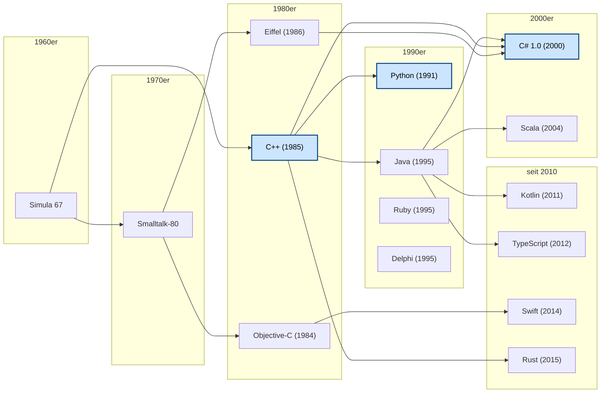

<!--

author:   Sebastian Zug, Galina Rudolf, André Dietrich, `Lina`
email:    sebastian.zug@informatik.tu-freiberg.de
version:  2.0.1
language: de
narrator: Deutsch Female
comment:  Klassenelemente in C# — was C# der Klasse spendiert: Felder, statische Mitglieder, Konstanten (const/readonly), Konstruktoren, Properties, Indexer, Operatorenüberladung, Finalizer
tags:
logo:
titel: Klassenelemente in C#

import: https://github.com/liascript/CodeRunner
        https://raw.githubusercontent.com/LiaTemplates/mermaid_template/master/README.md

import: https://raw.githubusercontent.com/TUBAF-IfI-LiaScript/VL_Softwareentwicklung/master/config.md

-->

[](https://liascript.github.io/course/?https://github.com/TUBAF-IfI-LiaScript/VL_Softwareentwicklung/blob/master/08_OOPGrundlagenII.md)

# Klassenelemente in C#

| Parameter                | Kursinformationen                                                                               |
| ------------------------ | ----------------------------------------------------------------------------------------------- |
| **Veranstaltung:**       | `Vorlesung Softwareentwicklung`                                                                 |
| **Teil:**                | `8/27`                                                                                          |
| **Semester**             | @config.semester                                                                                |
| **Hochschule:**          | @config.university                                                                              |
| **Inhalte:**             | @comment                                                                                        |
| **Link auf den GitHub:** | https://github.com/TUBAF-IfI-LiaScript/VL_Softwareentwicklung/blob/master/08_OOPGrundlagenII.md |
| **Autoren**              | @author                                                                                         |


---------------------------------------------------------------------

## Visionen der Objektorientierung

                                     {{0-1}}
*******************************************************************************

> Ein Objekt ist ein Bestandteil eines Programms, der Zustände enthalten kann. Diese Zustände werden von dem Objekt vor einem Zugriff von außen versteckt und damit geschützt. Außerdem stellt ein Objekt anderen Objekten Operationen zur Verfügung. Von außen kann dabei auf das Objekt ausschließlich zugegriffen werden, indem eine Operation auf dem Objekt aufgerufen wird.
Ein Objekt legt dabei selbst fest, wie es auf den Aufruf einer Operation reagiert. Die Reaktion kann in Änderungen des eigenen Zustands oder dem Aufruf von Operationen auf weiteren Objekte bestehen.

> **Merke**  *Ein Objekt ist eine zur Ausführungszeit vorhandene und für ihre Member Speicher allozierende Instanz, die sich aus der Spezifikation einer Klasse erschließt.*

Ideen der OOP:

* Objekte der *realen Welt* müssen sich in der Programmierung widerspiegeln
* Es geht nicht um das Manipulieren von Daten, sondern um Zustandsänderungen von Objekten
* Im Zentrum der objektorientierten Programmierung stehen Objekte, die miteinander kommunizieren

> **Merke** Wir haben zwei Herausforderungen zu meistern - Modellierung und Realisierung.

*******************************************************************************

                                     {{1-2}}
*******************************************************************************

**Beispiel - Simulationsumgebung Fußballspiel:**

+ 1 Objekt vom Typ "Spielsituation"
+ 1 Objekt vom Typ "Ball"
+ 2 Objekte vom Typ "Trainer"
+ 3 Objekte vom Typ "Schiedsrichter"
+ 22 Objekte vom Typ "Fußballspieler"

*******************************************************************************

                                     {{2-5}}
*******************************************************************************

**Welche Eigenschaften hat jedes Objekt des Typen "Spieler", "Trainer" bzw. "Schiedsrichter"?**

+ Name, Alter, Geschlecht, Gewicht, Größe
+ Position (x, y, z),
+ im Spiel, Geschwindigkeit
+ Mannschaft, Rolle (Stürmer, Tormann, Verteidiger), Nummer
+ physischer Zustand (topfit, ausgepowert, verletzt)

Einige der Eigenschaften ...

- ... ändern sich im Spielkontext, andere bleiben konstant
- ... lassen sich durchaus allen Personen zuordnen, anderen nur spezifischen Kategorien von Beteiligten.

*******************************************************************************

                                {{3-4}}
*******************************************************************************

**Welche Eigenschaften und Methoden (Fähigkeiten) sind für die Instanzen aller Teilnehmer gleich?**?

+ Name, Alter, Geschlecht, Gewicht, Größe
+ physischer Zustand (topfit, ausgepowert, verletzt)
+ `ändertPosition()`


**Welche Eigenschaften und Methoden (Fähigkeiten) sind unterschiedlich?**?

+ Rolle in der Mannschaft und Trikotnummer gibt es nur für Spieler
+ Mitglied einer Mannschaft bezieht Spieler und Trainer mit ein
+ ...


*******************************************************************************

                                     {{4-5}}
*******************************************************************************

**Welche Methoden sollten dem Objekt "Spieler" erlaubt sein und wie verändert dies deren Zustand**?

+ `FängtDenBall()` -> Wirkt sich auf den Zustand von Ball aus, die Position des Balles ist identisch mit der des Spielers ... und es gibt nur einen Ball!
+ `WirftDenBall()`
+ `Foul(Spieler gefoulterSpieler)` -> Wirkt sich auf die Fitness von `gefoulterSpieler` aus

Welche Schwachstellen sehen Sie bei unserem Modellierungsansatz — und welche Antworten hat OOP darauf?

> **Genau hier zahlt sich Objektorientierung aus:** Jede der drei Säulen aus 07a löst ein konkretes Problem, das wir gerade selbst gesehen haben.
>
> + **Redundanz** zwischen `Spieler`/`Trainer`/`Schiedsrichter` (Name, Alter, Position) → **Vererbung** aus einer gemeinsamen Basisklasse `Person`.
> + Zugriff auf fremden Zustand (`Foul()` verändert die Fitness eines anderen Spielers) → **Kapselung**: Änderungen laufen kontrolliert über Methoden, nicht über offene Felder.
> + Gleiches Methoden-Konzept mit unterschiedlichem Verhalten je Rolle (`ändertPosition()` für Spieler vs. Schiedsrichter) → **Polymorphie**: ein Aufruf, viele Reaktionen.
>
> Das ist der „große Wurf" der OOP — die Konzepte sind nicht akademisch, sondern direkte Antworten auf die Modellierungs-Schmerzen, die schon ein einfaches Fußballspiel auslöst.

*******************************************************************************

[^WikiOOP]: Eigene Darstellung in Anlehnung an die historische Übersicht von Nepomuk Frädrich (Wikimedia), erweitert um Sprachen ab 2000.

### Begriffe

| Begriff     | Bedeutung                                                                                                                                                                                                                        |
| ----------- | -------------------------------------------------------------------------------------------------------------------------------------------------------------------------------------------------------------------------------- |
| Klassen     | ... sind Vorlagen (Baupläne), aus denen Instanzen Objekte erzeugt werden.                                                                                                                                         |
| Objekt      | ... ist ein Element, welches Funktionen, Methoden, Prozeduren, einen inneren Zustand, oder mehrere dieser Dinge besitzt. Es leitet sich von  einer Spezifikation ab.                                                                     |
| Entität     | ... ist ein Objekt, welches eine Identität besitzt, welche unveränderlich ist. Beispielsweise kann eine Person ihre Adresse, Telefonnummer oder Namen ändern, ohne zu einer anderen Person zu werden. Eine Person ist also eine Entität. |
| Eigenschaft | ... bestimmt den Zustands eines Objekts. Der Zustand des Objektes setzt sich aus seinen Eigenschaften und Verbindungen zu anderen Objekten zusammen.                                                                                                                                                                                     |
| Methode    | ... ist ein Unterprogramm (Funktion oder Prozedur), welches das Verhalten von Objekten beschreibt und implementiert. Über Methoden können Objekte untereinander in Verbindung treten.           |                                                                                       |


### Historische Entwicklung von OOP

Objektorientierung ist kein Phänomen der 1990er Jahre. Der Grundgedanke entstand mit **Simula 67** in Oslo: einer Simulationssprache, die als erste Klassen, Vererbung und Objekte als eigenständige Sprachkonstrukte einführte (motiviert durch [^WikiOOP]). Aus Simula gehen zwei Linien hervor, die den OOP-Diskurs bis heute prägen:

+ **Smalltalk-Linie** (Xerox PARC, ab 1972) — *alles* ist ein Objekt, Kommunikation läuft über Nachrichten, dynamische Typisierung. Diese Vision lebt in Objective-C, Ruby und Python weiter.
+ **C++-Linie** (Bjarne Stroustrup, ab 1979) — OOP-Konstrukte werden auf das prozedurale C aufgesetzt, statisch typisiert, hardwarenah. Aus dieser Tradition stammen Java, C# und in jüngerer Zeit Rust.



> *Blau hervorgehoben:* C++, Python (Vorlesung 07a) und C# (Vorlesung 07 ff.) — die Sprachen, auf die wir in dieser Reihe regelmäßig Bezug nehmen.

Unsere drei Bezugssprachen positionieren sich in dieser Geschichte sehr unterschiedlich:

| Sprache    | Jahr | OOP-Charakteristik                                                                            |
| ---------- | ---- | --------------------------------------------------------------------------------------------- |
| **C++**    | 1985 | OOP als *Option* — Mehrfachvererbung, Templates; prozedurales C bleibt vollständig zugänglich |
| **Python** | 1991 | OOP als Default, aber multi-paradigmatisch; dynamische Typisierung, Duck Typing               |
| **C#**     | 2000 | OOP als *Leitparadigma* — Einzelvererbung + Interfaces; ab C# 7 zunehmend funktionale Züge    |

Seit den 2010er Jahren verschwimmen die Lager: Kotlin, TypeScript, Swift und Rust bedienen sich aus *beiden* Traditionen und ergänzen sie um funktionale, nebenläufige und speichersichere Konzepte. „Reine" OOP-Sprachen sind heute die Ausnahme — der Mainstream ist multi-paradigmatisch.

### Objekt-Klasse

https://docs.microsoft.com/de-de/dotnet/api/system.object?view=netframework-4.8

OOP Sprachen verfügen meist über eine zentrale Klasse, von der alle Klassen in
letztlich abgeleitet sind. Diese heißt bei diesen Sprachen Object. In Eiffel
wird sie mit ANY bezeichnet. Zu den wenigen Ausnahmen, in denen es keine solche
Klasse gibt, zählen C++ oder Python.

In den Sprachen mit zentraler Basisklasse erbt eine Klasse, für die keine
Basisklasse angegeben wird, implizit von dieser besonderen Klasse. Ein Vorteil
davon ist, dass allgemeine Funktionalität, beispielsweise für die Serialisierung,
Ausgaben, Hashwerte oder die Typinformation, dort untergebracht werden kann. Weiterhin ermöglicht es
die Deklaration von Variablen, denen ein Objekt jeder beliebigen Klasse
zugewiesen werden kann. Dies ist besonders hilfreich zur Implementierung von
Containerklassen, wenn eine Sprache keine generische Programmierung unterstützt.

```csharp                                      Initialisation
using System;

public class Program
{
  static void Main(string[] args){
    Console.WriteLine(typeof(int));
    Console.WriteLine(typeof(int).BaseType);
    Console.WriteLine(typeof(int).BaseType.BaseType);
  }
}
```
@LIA.eval(`["main.cs"]`, `mcs main.cs`, `mono main.exe`)


```csharp                           AccessMethods
using System;

public class Program
{
  static void Main(string[] args){
    Type t = typeof(Program);
    Console.WriteLine("------ Methods --------");
    System.Reflection.MethodInfo[] methodInfo = t.GetMethods();
    foreach (System.Reflection.MethodInfo mInfo in methodInfo)
      Console.WriteLine(mInfo.ToString());
  }
}
```
@LIA.eval(`["main.cs"]`, `mcs main.cs`, `mono main.exe`)

## Klassenelemente im Detail


> Klassen [und Strukturen] sind zwei der grundlegenden Konstrukte des allgemeinen Typsystems in .NET Framework. Bei beiden handelt es sich um eine Datenstruktur, die einen als logische Einheit zusammengehörenden Satz von Daten und Verhalten kapselt.

                                  {{0-1}}
******************************************************************************

Entsprechend können Klassenspezifikationen folgende Elemente umfassen:

| Member / Elemente   | englische Bezeichnung | Funktion                                                                                    |
| :------------------ | --------------------- | :------------------------------------------------------------------------------------------ |
| Felder              | *fields*              | Daten                                                                                       |
| Konstanten          | *constant*            | konstante Daten                                                                             |
| Eigenschaften       | *property*            | Daten und Zugriffsmethoden                                                                  |
| Methoden            | *method*              | Funktionen / Prozeduren                                                                     |
| Konstruktoren       | *constructor*         | Instanziierung einer Klasse                                                                 |
| Ereignisse          | *event*               | Informationsaustausch zwischen Klassen                                                      |
| Finalizer           | *finalizer*           | "Destruktoren"                                                                              |
| Indexer             | *indexer*             | Ähnlich Eigenschaften, Adressierung über Indizes                                            |
| Operatoren          | *operators*           | Set von '==', '+' etc. mit eigener Bedeutung                                                |
| Geschachtelte Typen | *embedded types*      | Integrierte Klassen oder Structs, die nur innerhalb einer Klasse/ Structs angewendet werden |

******************************************************************************
                                     {{1-2}}
******************************************************************************

```csharp         Klassenelemente
class Person{
  // *************** Felder ************************************************
  string name;                     // eine häufige Konvention, kleine Anfangs-
  public int Geburtsjahr;          // buchstaben = privat, groß = public

  // ************** Konstruktoren ******************************************
  public Person(string name, int geburtsjahr){
    this.name = name;
    Geburtsjahr = geburtsjahr;
  }

  // ************** Methoden ***********************************************
  int AktuellesAlter () => DateTime.Today.Year - Geburtsjahr;

  public override string ToString(){
     return name + " ist " + AktuellesAlter().ToString() + " Jahre alt.";
  }

  // ************* Operatoren **********************************************
  public static bool operator< (Person person1, Person Person2){
    // TODO Hausaufgabe
  }
}
```

Und wie legen wir eine Instanz an? Dazu sind mehrere Schritte notwendig:

```csharp
Person p;  // Generierung einer Referenzvariablen p auf dem Stack
p = new Person();  // Generierung einer Instanz im Heap
// alles zusammen
// Person p = new Person();
```

Als Operanden erwartet der new-Operator einen Klassennamen und eine Parameterliste,
die an den entsprechenden Konstruktor übergeben wird.


******************************************************************************
                                     {{2-3}}
******************************************************************************

|                              | Fields                                       | Methods                                      |
| ---------------------------- | -------------------------------------------- | -------------------------------------------- |
| Statisches Attribut          | `static`                                     | `static`                                     |
| Zugriffsattribute            | `public`, `internal`, `private`, `protected` | `public`, `internal`, `private`, `protected` |
| Vererbungsattribut           |                                              | `virtual`, `abstract`, `override`, `sealed`  |
| Unsafe Attribute             | `unsafe`                                     |                                              |
| Attribut Teilimplementierung |                                              | `partial`                                    |
| Unmanaged Code Attribute     |                                              | `unsafe extern`                              |
| Read-only Attribute          | `readonly`                                   |                                              |
| Threading Attribute          | `volatile`                                   |                                              |

******************************************************************************

### Felder

                                     {{0-1}}
******************************************************************************

Felder sind Variablen eines beliebigen Typs, die einer Klasse unmittelbar
zugeordnet sind. In Feldern werden die Daten abgelegt, die übergreifend
Verwendung finden.

Der Idee der Kapselung folgend, sollten nur methodenlokal relevante Variablen
auch dort deklariert werden.

Eine Klasse oder Struktur kann Instanzenfelder, statische Felder oder beides
gemischt verfügen.

```ascii

  +-----------------+   +-----------------+  +-----------------+                                                         .
  | Instanz 0       |   | Instanz 1       |  | Instanz 2       |
  +-----------------+   +-----------------+  +-----------------+
  | - Instanzfeld0  |   | - Instanzfeld0  |  | - Instanzfeld0  |
  | - Instanzfeld1  |   | - Instanzfeld1  |  | - Instanzfeld1  |
  |                 |   |                 |  |                 |
  | ..................... ✛ StatischesFeld0 .................. |
  | ..................... ✛ StatischesFeld1 .................. |
  |                 |   |                 |  |                 |
  +-----------------+   +-----------------+  +-----------------+
  | ✛ Method1()     |   | ✛ Method1()     |  | ✛ Method1()     |
  | ✛ Method2()     |   | ✛ Method2()     |  | ✛ Method2()     |
  +-----------------+   +-----------------+  +-----------------+
```

Instanzenfelder beziehen sich als Datensatz individuell auf die "eigene" Instanz,
statisches Felder gehören zur Klasse selbst und werden von allen Instanzen einer
Klasse gemeinsam verwendet. "Lokale" Änderungen, werden somit übergreifend
sichtbar.

```csharp    AnwendungStatischeVariablen
using System;
using System.Collections;
using System.Collections.Generic;

public class Person{
  string name;
  int index;
  public int Geburtsjahr;
  public static int Count;          // <- Statische Variable Count
  public Person(string name, int geburtsjahr){
    this.name = name;
    Geburtsjahr = geburtsjahr;
    index = Count;
    Count = Count + 1;
  }
  public override string ToString(){
     return name + " ist die " + (index+1).ToString() + " von " + Count.ToString() + " Personen";
  }
}
public class Program
{
  static void Main(string[] args){
    Person Student1 = new Person("Mickey", 1935);
    Console.WriteLine(Student1);
    Person Student2 = new Person("Donald", 1927);
    Console.WriteLine(Student1);
    Console.WriteLine(Student2);
  }
}
```
@LIA.eval(`["main.cs"]`, `mcs main.cs`, `mono main.exe`)

******************************************************************************

> **Erinnerung:** `const` und `readonly` als Modifizierer für unveränderliche Felder wurden bereits in Vorlesung **04** (`### Konstante Werte`) eingeführt — inklusive Vergleichstabelle und Compilezeit- vs. Laufzeit-Initialisierung. Für den Klassenkontext genügt hier ein Verweis auf zwei Anwendungsfälle:
>
> + `readonly` — jede Instanz erhält ein eigenes Feld, das im Instanz-Konstruktor *einmal* gesetzt und danach unveränderbar ist.
> + `static readonly` — die Klasse hält *einen gemeinsamen* Wert für alle Instanzen, der typischerweise im **statischen Konstruktor** initialisiert wird (siehe unten).

### Statische Konstruktoren

> **Wiederholung aus 07:** Die Grundlagen der Konstruktoren in C# — Standardkonstruktor, Überladung, Verkettung mit `: this(...)` und Object Initializer — wurden in [Vorlesung 07](07_OOPGrundlagenI.md) eingeführt. Hier ergänzen wir, was C# auf Klassenebene zusätzlich anbietet: **statische Konstruktoren**.

Statische Konstruktoren ...

+ ... werden verwendet, um `static`-Daten zu initialisieren oder um eine bestimmte Aktion auszuführen, die nur einmal ausgeführt werden muss.
+ ... können nicht über Zugriffsmodifizierer oder Parameter verfügen.
+ ... können nicht vererbt oder überladen werden.
+ ... werden automatisch vor dem Erzeugen der ersten Instanz ausgeführt und können nicht direkt aufgerufen werden. Damit hat der Nutzer keine Kontrolle, wann der Konstruktor ausgeführt wird.
+ ... werden kein zweites Mal aufgerufen, wenn eine Ausnahme ausgelöst wird.

```csharp    StaticConstructor
using System;

public class BAFStudent
{
   public static string Universität;
   public string NameStudent;
   static BAFStudent(){
     Console.WriteLine("Universität wird initialisiert");
     Universität = "TU BAF Freiberg";
   }
   public BAFStudent(string name){
     Console.WriteLine("Name wird initialisiert");
     NameStudent = name;
   }
}

public class Program
{
   static void Main(string[] args){
     BAFStudent student0 = new BAFStudent("Humboldt");
     Console.WriteLine("{0,20} - {1,-10}", BAFStudent.Universität, student0.NameStudent);
     BAFStudent student1 = new BAFStudent("Winkler");
     Console.WriteLine("{0,20} - {1,-10}", BAFStudent.Universität, student1.NameStudent);
   }
}
```
@LIA.eval(`["main.cs"]`, `mcs main.cs`, `mono main.exe`)

> **Ausblick:** Das `required`-Schlüsselwort ab C# 11 ergänzt die in 07 gezeigten Object Initializer um eine Pflicht-Setzung — Felder, die mit `required` markiert sind, müssen beim Initialisieren gesetzt werden. So lassen sich Initializer auch für Klassen einsetzen, in denen bestimmte Werte zwingend belegt sein müssen.

Im folgenden Beispiel verlangt `Name` zwingend einen Wert im Object Initializer, `Alter` ist optional. Versucht man eine `Person` *ohne* `Name` anzulegen, meldet der Compiler einen Fehler (CS9035).

```csharp     RequiredMembers
using System;

public class Person
{
    public required string Name { get; init; }
    public int? Alter { get; init; }

    public override string ToString()
        => $"{Name}" + (Alter is int a ? $" ({a})" : "");
}

public class Program
{
    static void Main(string[] args)
    {
        var humboldt = new Person { Name = "Alexander von Humboldt", Alter = 89 };
        var anonym   = new Person { Name = "Unbekannt" };

        Console.WriteLine(humboldt);
        Console.WriteLine(anonym);

        // Fehler CS9035: Required member 'Person.Name' must be set ...
        // var ohneName = new Person();
    }
}
```
```xml   -myproject.csproj
<Project Sdk="Microsoft.NET.Sdk">
  <PropertyGroup>
    <OutputType>Exe</OutputType>
    <TargetFramework>net8.0</TargetFramework>
  </PropertyGroup>
</Project>
```
@LIA.eval(`["Program.cs", "project.csproj"]`, `dotnet build -nologo`, `dotnet run -nologo`)

### Destruktoren / Finalizer

Mit Finalizern (die auch als Destruktoren bezeichnet werden) werden alle
erforderlichen endgültigen Bereinigungen durchgeführt, wenn eine Klasseninstanz
vom Garbage Collector gesammelt wird.

```csharp    FinalizerExample
using System;

public class Person
{
  public string name;
  public Person(string name){this.name = name;}
  ~Person() {Console.WriteLine("The {0} destructor is executing.", ToString());}
}

public class Program
{
  static void Main(string[] args)
  {
    Person Student1 = new Person("Mickey");
    Console.WriteLine(Student1.name);
    Console.WriteLine("Aus die Maus!");
  }
}
```
@LIA.eval(`["main.cs"]`, `mcs main.cs`, `mono main.exe`)

Der Finalizer ruft implizit die Methode `Finalize` aus der Basisklasse des Typs
`Objekt` auf.

### Eigenschaften

Eigenschaft (Properties) organisieren den Zugriff auf private Felder über einen
flexiblen Mechanismus zum Lesen, Schreiben oder Berechnen des Wertes. Entsprechend
können Eigenschaften wie öffentliche Datenmember verwendet werden. Damit
wird das Konzept der Kapselung auf effiziente Zugriffsmethoden abgebildet.

Ausgangspunkt:

<!-- --{{0}}-- Idee des Codefragments:
  * Fügen Sie eine Lese / Schreibmethode für die Variable Wochentag ein, die
    Prüft, ob die Eingabe zwischen Mo = 0 und Freitag = 4 liegt.
-->
```csharp    PropertyAusgangspunkt
using System;

public class Vorlesung{
  private byte wochentag;
}

public class Program
{
  static void Main(string[] args){
    Vorlesung SoWi = new Vorlesung();
    SoWi.wochentag = 24;
  }
}
```
@LIA.eval(`["main.cs"]`, `mcs main.cs`, `mono main.exe`)

C# hält, wie andere OOP Sprachen auch dafür eine eigene kompakte Syntax bereit,
die Aspekte der Felder und der Methoden kombiniert. Der aufrufende Nutzer
sieht eine Feld, der Zugriff kann aber über eine Methode konfiguriert werden.
Dabei können durchaus mehrere Eigenschaften auf eine private Variable verweisen.

Für den Benutzer eines Objekts erscheint eine Eigenschaft wie ein Feld; der
Zugriff auf die Eigenschaft erfordert dieselbe Syntax.

```csharp    PropertyExample
using System;

public class Vorlesung
{
  private byte wochentag;            // Private Variable
  public byte Wochentag              // Öffentliche Variable
  {
    get { return wochentag; }        // Property accessors
    set {
      if ((value < 7) & (value >= 0))
          wochentag = value;
      else
        Console.WriteLine("Fehlerhafte Eingabe!");
    }
  }
}

public class Program
{
  static void Main(string[] args)
  {
    Vorlesung SoWi = new Vorlesung();
    SoWi.Wochentag = 4;
    Console.WriteLine(SoWi.Wochentag);
  }
}
```
@LIA.eval(`["main.cs"]`, `mcs main.cs`, `mono main.exe`)

Die Accessoren können beliebig kombiniert werden. Eine Eigenschaft ohne einen
`set`-Accessor ist schreibgeschützt (nur lesbar). Eine Eigenschaft ohne einen
`get`-Accessor ist umgekehrt nur schreibbar (nicht lesbar).

Zudem lassen sich mit der *Fat Arrow* Notation die Darstellungen wiederum
verkürzen. Beispielhaft ist an folgendem Beispiel auch, dass sich die Properties
eine vollkommen andere Informationsstruktur bedienen als die eigentlichen
privaten Variablen abbilden (= Kapselung).

```csharp
decimal currentPrice, sharesOwned;

public decimal Worth
{
    get => currentPrice * SharesOwned;
    set => sharesOwned = value / currentPrice
}

// Kompakt für

public decimal Worth
{
    get { return currentPrice * SharesOwned; }
    set { sharesOwned = value / currentPrice; }
}
```

`set` verwendet dabei einen impliziten Parameter mit dem Namen `value`, dessen Typ der Typ der Eigenschaft ist.

Und wie sieht es mit dem Zugriffsschutz der Eigenschaften aus? Insbesondere
`set` sollte soweit wie möglich eingeschränkt werden. Dafür können `internal`,
`private` und `protected` genutzt werden.

Tatsächlich dürfen `get` und `set` **unterschiedliche Zugriffsattribute** tragen. Dabei gelten zwei Regeln:

+ höchstens *einer* der beiden Accessoren bekommt ein eigenes Modifizierer-Schlüsselwort,
+ dieses muss **strenger** sein als das der Eigenschaft selbst.

```csharp
public  string Name { get; private set; }     // ✓ außen lesbar, intern setzbar
public  string Name { get; protected set; }   // ✓ in Subklassen setzbar
public  string Name { protected get; set; }   // ✗ beide Seiten lockerer als sinnvoll
public  string Name { public get; set; }      // ✗ get nicht lockerer als die Property
private string Name { get; public set; }      // ✗ set lockerer als die Property
```

Das Standardmuster *„von außen nur lesen, intern setzen"* sieht damit so aus:

```csharp    AccessorAccessibility
using System;

public class Person
{
  public string Name { get; private set; }
  public Person(string name) => Name = name;
  public void Umbenennen(string neu) => Name = neu;   // intern erlaubt
}

public class Program
{
  static void Main(string[] args)
  {
    Person p = new Person("Humboldt");
    Console.WriteLine(p.Name);     // ok — get ist public
    p.Umbenennen("von Humboldt");
    Console.WriteLine(p.Name);
    // p.Name = "X";                // Compiler-Fehler: set ist private
  }
}
```
@LIA.eval(`["main.cs"]`, `mcs main.cs`, `mono main.exe`)

Wenn in den Eigenschaftenzugriffsmethoden keine zusätzliche Logik erforderlich ist, bietet sich die Verwendung von automatisch implementierten Eigenschaften.

```csharp
public int CustomerID { get; set; }
```

In diesem Fall erstellt der Compiler ein privates, anonymes, dahinter liegendes Feld, auf das nur über `get` und `set`-Accessoren zugegriffen werden kann.

### Indexer

Indexer bilden die Zugriffsmethodik für Arrays `MyArray[3]` auf Klassen ab, um
den Zugriff auf Arrays, Listen oder andere Container zu kapseln.  Dabei wird
folgende Notation benutzt:

```csharp
string [] words = "Das ist ein beispielhafter Text".Split();
//    Typ der Rückgabevariablen
//       |    this Referenz auf das eigene Objekt
//       |     |    Typ der Indexvariable
//       |     |     |      Bezeichner der Variable
//       v     v     v       v
public string this [int index]{
     get  {return words[index]; }
     set  {words[index] = value; }
}
```

Auch hier wird das Schlüsselwort `value` verwendet, um den Wert zu definieren, der zugewiesen wird.

Indexer müssen nicht durch einen Ganzzahlwert indiziert werden, es können auch andere Typen verwendet werden.

```csharp    IndexerExample
using System;


public class Months
{
  string[] months = {"Jan", "Feb", "März", "April", "Mai", "Juni", "Juli",
                     "Aug", "Sep", "Okt", "Nov", "Dez"};

  public string this[byte index]{
    get {return months[index];}
  }
}

public class Program
{
  static void Main(string[] args)
  {
    Months MonthList = new Months();
    Console.WriteLine(MonthList[5]);
  }
}
```
@LIA.eval(`["main.cs"]`, `mcs main.cs`, `mono main.exe`)

Was ist der Vorteil der Klasse + Indexer Lösung? Wie würden Sie die Indizierung
noch absichern?

> **Stichworte zur Auflösung:** Das interne Array bleibt `private` → keine Außenmanipulation; nur `get` → read-only. Absichern z. B. durch **Range-Check** im Getter (`throw new ArgumentOutOfRangeException(...)`) oder eleganter durch einen typsicheren Index, etwa `enum Monat { Jan, Feb, ..., Dez }` — dann erzwingt der Compiler gültige Werte.

### Operatorenüberladung in C\#

                                         {{0-1}}
******************************************************************************

Operatoren sind ein Set von Tokens, die grundlegende Operationen für
Grunddatentypen beschreiben.

```csharp
int a = 4;
int b = 7;
int c = a + b;                   // + Addition

string s1 = "Hello";
string s2 = "World";
string s3 = s1 + " " + s2;       // + für String Konkatenation
```

Analog zu Methoden können Operatoren überladen werden. Entsprechend wird
den Operatoren eine spezifische Bedeutung für die Klassen gegeben.

+ Operatoren werden in der Klasse überladen
+ Operatoren-Überladung ist immer static
+ Nutzung des Schlüsselwortes `operator`

**Überladbare Operatoren**

| Operator                                                | Bedeutung                                                             |
| ------------------------------------------------------- | --------------------------------------------------------------------- |
| `+`, `-`, `!`, `~`, `++`, `--`, `true`, `false`         | unäre Operatoren, überladbar                                          |
| `+`, `-`, `\*`, `/`, `%`, `&`, `^`, `<<`, `>>`          | binäre Operatoren, überladbar                                         |
| `==`, `!=`, `<`, `>`, `<=`, `>=`                        | Vergleichsoperatoren, überladbar                                      |
| `[]`, `()`                                              | nicht überladbar                                                      |
| `+=`, `-=`, `\*=`, `/=`, `%=`, `&=`, `^=`, `<<=`, `>>=` | Werden durch die zugehörigen binären Operatoren automatisch überladen |

******************************************************************************

                                       {{1-2}}
******************************************************************************

**Beispiel**

```csharp    Operatoren
using System;
using System.Reflection;
using System.ComponentModel.Design;

public class Vector {
  public double X;
  public double Y;

  public Vector (double x, double y){
    this.X = x;
    this.Y = y;
  }

  public static Vector operator +(Vector p1, Vector p2){
    return new Vector(p1.X + p2.X, p1.Y + p2.Y);
  }

  public static Vector operator -(Vector p1, Vector p2){
    return new Vector(p1.X - p2.X, p1.Y - p2.Y);
  }

  public override string ToString(){
    return "x = " + X.ToString() + ", y = " + Y.ToString();
  }
}

public class Program
{
  static void Main(string[] args)
  {
    Vector a = new Vector (3,4);
    Vector b = new Vector (9,6);
    Console.WriteLine (a+b);
  }
}
```
@LIA.eval(`["main.cs"]`, `mcs main.cs`, `mono main.exe`)

Die Operatoren += und -= werden dabei automatisch mit überladen.


******************************************************************************

                                       {{2-3}}
******************************************************************************

> **Merke:** Die Typen der Operanden beim Überladen von Operatoren müssen nicht übereinstimmen!

Nehmen wir an, dass wir eine Skalierung $r$ unseres Vektors einfügen wollen und dafür
dessen Länge manipulieren.

```csharp
// Es müssen beide Varianten implementiert werden!
public static Vector operator *(Vector p1, double ratio)
{
  return new Vector(p1.X * ratio, p1.Y * ratio);
}

public static Vector operator *(double ratio, Vector p1)
{
  return new Vector(p1.X * ratio, p1.Y * ratio);
}

static void Main(string[] args)
{
  Vector ptOne = new Vector(100, 100);
  Vector ptTwo = new Vector(40, 40);
  Console.WriteLine((ptOne * 2.5));
  Console.WriteLine((1 * ptOne));
}
```

Unäre Operatoren (++, --) können in gleicher Art und Weise überschrieben werden.


******************************************************************************

                                       {{3-4}}
******************************************************************************

Wann sind zwei Klasseninstanzen gleich? Müssen alle Inhalte übereinstimmen?
Gibt es besondere Felder, deren Übereinstimmung relevanter sind?

| class | Felder                                               |
| ----- | ---------------------------------------------------- |
| Haus  | Farbe der Fenster, Markise (ja/nein), Zahl der Räume |
| Tier  | Art, Rasse, Geschlecht                               |
| Datei | Typ, Inhalt, Namen                                   |

```csharp    EqualityOperator
using System;
using System.Reflection;
using System.ComponentModel.Design;

public class Vector {
  public double X;
  public double Y;
  public Vector (double x, double y){
    this.X = x;
    this.Y = y;
  }

  public static bool operator ==(Vector p1, Vector p2){
    return (p1.X == p2.X) && (p1.Y == p2.Y);
  }

  public static bool operator !=(Vector p1, Vector p2){
    return (p1.X != p2.X) || (p1.Y != p2.Y);
  }

  //public override bool Equals(object p){
  //  return ???
  //}
}

public class Program
{
  static void Main(string[] args)
  {
    Vector a = new Vector (3,4);
    Vector b = new Vector (9,6);
    Console.WriteLine (a == b);
  }
}
```
@LIA.eval(`["main.cs"]`, `mcs main.cs`, `mono main.exe`)

Eine redundanzfreie `Equals`-Implementierung delegiert über Pattern Matching an den bereits vorhandenen `operator ==`. Weil `Equals` und `GetHashCode` *konsistent* sein müssen (gleicher Inhalt → gleicher Hash), wird letzterer gleich mit überschrieben:

```csharp
public override bool Equals(object p) => p is Vector v && this == v;
public override int GetHashCode()      => HashCode.Combine(X, Y);
```

**Warum überhaupt `Equals` *und* `==` parallel?** C# besitzt zwei getrennte Gleichheits-Mechanismen, die an unterschiedlichen Stellen automatisch greifen:

| | `==` (Operator) | `.Equals()` (Methode) |
| --- | --- | --- |
| **Dispatch** | statisch — beim *Compilieren* anhand der *deklarierten* Typen aufgelöst | dynamisch (virtual) — zur *Laufzeit* anhand des *tatsächlichen* Typs aufgelöst |
| **Aufrufquelle** | Code mit konkretem Typ | Generics, Collections, Reflection, alles auf `object` |

Sobald ein `Vector` durch eine `object`- oder generische Variable wandert, greift `operator ==` nicht mehr — der Operator ist statisch gebunden und sieht den Typ an dieser Stelle nicht. Nur die virtuelle `Equals`-Methode zieht weiter durch. Praktisch zubeißend wird das bei jedem Container und LINQ-Aufruf:

```csharp
var liste = new List<Vector> { new Vector(3, 4) };
liste.Contains(new Vector(3, 4));            // greift auf Equals + GetHashCode

new HashSet<Vector> { new Vector(3, 4), new Vector(3, 4) };   // dito
new[] { new Vector(3, 4) }.Distinct();                         // dito
new Dictionary<Vector, string>();                              // dito
```

`List<T>.Contains`, `HashSet<T>`, `Dictionary<K,V>` und `Distinct()` rufen **`Equals` + `GetHashCode`** auf — niemals den überladenen `==`-Operator. Wenn nur `==` überschrieben ist, sind zwei wertgleiche Vektoren im `HashSet` plötzlich „verschieden" und `Contains` findet sie nicht.

> **Merke:** Wer Wertgleichheit will, überschreibt **alle vier zusammen** — `Equals`, `GetHashCode`, `operator ==`, `operator !=` — und hält sie konsistent. Genau diesen Boilerplate spart `record` automatisch ein.

> **Ausblick — `record` ab C# 9:** Der ganze Boilerplate aus `==`, `!=`, `Equals`, `GetHashCode` und `ToString` lässt sich seit C# 9 in einer einzigen Zeile erschlagen, sobald der Compiler die Klasse als **Record** kennt. Der Compiler generiert dann *wertbasierte* Gleichheit (Inhaltsvergleich aller Felder) automatisch — `Vector(3, 4) == Vector(3, 4)` ergibt `true`, ohne dass du einen einzigen Operator selbst schreibst.
>
> ```csharp
> public record Vector(double X, double Y);
> ```
>
> Für Klassen mit reiner Wert-Semantik (Koordinaten, Geld, Maße, DTOs) ist `record` heute die idiomatische Wahl — die manuelle Operator-Überladung bleibt dort relevant, wo Sie *abweichendes* Verhalten brauchen (z. B. Toleranz bei Gleitkomma: `Math.Abs(X - v.X) < 1e-9`).


******************************************************************************

## Beispiel der Woche ...

Entwickeln Sie eine Klassenstruktur für die Speicherung der Daten eines Studierenden.

```csharp    StudentBeispiel
using System;
using System.Collections.Generic;

public class Student
{
  private static int globalerZähler;
  private readonly int uid;
  public string Name { get; set; }
  private bool eingeschrieben;
  private List<string> fächer;

  static Student(){
    globalerZähler = 0;
  }

  public Student(string name)
  {
    Name = name;
    Eingeschrieben = true;
    uid = globalerZähler;
    fächer = new List<string>();
    Console.WriteLine("Der Studierende {0} (Nr. {1}) ist angelegt!", Name, uid);
    globalerZähler++;
  }

  public bool Eingeschrieben
  {
    get {return eingeschrieben;}
    set
    {
      if (eingeschrieben != value)
        eingeschrieben = value;
      else
      {
        if (value) Console.WriteLine("!Studierende {0} ist schon eingeschrieben!", Name);
        else Console.WriteLine("!Student {0} ist schon exmatrikuliert!", Name);
      }
     }
  }

  public void AddTopic(string Fächername){
    fächer.Add(Fächername);
  }

  public void PrintTopics(){
    Console.WriteLine("Student {0} hat folgende Fächer absolviert:", Name);
    foreach (string topic in fächer){
      Console.Write(topic + " ");
    }
    Console.WriteLine();
  }
}

public class Program
{
  static void Main(string[] args){
    Student student0 = new Student("Humboldt");
    student0.AddTopic("Softwareentwicklung");
    student0.AddTopic("Höhere Mathematik I");
    student0.AddTopic("Prozedurale Programmierung");
    student0.PrintTopics();
    student0.Eingeschrieben = true;
  }
}
```
@LIA.eval(`["main.cs"]`, `mcs main.cs`, `mono main.exe`)


## Aufgaben

Die folgenden Aufgaben erweitern das `Beispiel der Woche` um die in diesem Kapitel *neu* eingeführten Klassenelemente. Sie bauen aufeinander auf, lassen sich aber auch isoliert lösen.

- [ ] Fügen Sie einen Indexer `public string this[int i]` hinzu, der das *i*-te Fach aus `fächer` liefert. Nur `get`, kein `set` — die Liste bleibt von außen unveränderlich. Sichern Sie den Zugriff gegen Bereichsüberschreitung mit `ArgumentOutOfRangeException` ab.

```csharp
Console.WriteLine(student0[0]);   // erwartet: Softwareentwicklung
Console.WriteLine(student0[99]);  // erwartet: ArgumentOutOfRangeException
```

- [ ] Zwei `Student`-Instanzen sind genau dann „gleich", wenn ihre `uid` übereinstimmt — *nicht*, wenn Name oder Fächerliste zufällig identisch sind. Überladen Sie `operator ==` und `operator !=` und ziehen Sie `Equals(object)` und `GetHashCode()` **konsistent** mit (siehe Merke-Kasten im Abschnitt Operatorenüberladung). Prüfen Sie mit einem `HashSet`:

```csharp
var s1 = new Student("Humboldt");
var s2 = new Student("Humboldt");
var menge = new HashSet<Student> { s1, s2 };
Console.WriteLine(menge.Count);   // erwartet: 2 (verschiedene uid!)
Console.WriteLine(s1 == s2);      // erwartet: False
```

> *Diskussionspunkt:* Diese Wahl unterscheidet sich vom `Vector`-Beispiel weiter oben (dort: Inhaltsvergleich). Warum ist `uid` hier richtiger? Was bedeutet das für zwei Studierende, die beide „Schmidt" heißen?

- [ ] Schreiben Sie eine Variante `StudentRecord` als `record` mit `Name` und `Geburtsjahr`. Was bekommen Sie „kostenlos" (Gleichheit, `ToString`, Dekonstruktion)? Welches Problem entsteht, wenn die `uid` automatisch in den Wertvergleich einbezogen würde? Begründen Sie, warum `record` für **entitätsartige** Klassen mit eigener Identität *nicht* die richtige Wahl ist, für **wertartige** Typen wie `Vector` dagegen schon.

