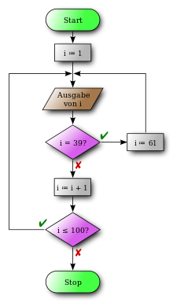

<!--

author:   Sebastian Zug & André Dietrich
email:    Sebastian.Zug@informatik.tu-freiberg.de & andre.dietrich@informatik.tu-freiberg.de
version:  0.0.1
language: de
narrator: Deutsch Female

import: https://raw.githubusercontent.com/liaScript/rextester_template/master/README.md

-->

# Softwareentwicklung - 8 - Programmfluss und Funktionen

**TU Bergakademie Freiberg - Sommersemester 2020**

Link auf die aktuelle Vorlesung im Versionsmanagementsystem GitHub

[https://github.com/SebastianZug/CsharpCourse/blob/SoSe2020/07_CsharpElementeIII.md](https://github.com/SebastianZug/CsharpCourse/blob/SoSe2020/08_ProgrammflussUndFunktionen.md)

Die interaktive Form ist unter diese Link zu finden ->
[LiaScript Vorlesung 08](https://liascript.github.io/course/?https://raw.githubusercontent.com/SebastianZug/CsharpCourse/SoSe2020/08_ProgrammflussUndFunktionen.md#1)

---------------------------------------------------------------------

## 7 Fragen in 7 Minuten

*1. Welches Keyword muss bei ... eingefügt werden, damit der Code die Ausgabe 2 erzeugt?*

```cs
class Program
{

    static void Sqrt(double input, ... double output)
    {
        output = Math.Sqrt(input);
    }

    static void Main(string[] args)
    {
        Sqrt(4d, ... double r);
        Console.WriteLine(r);
    }
}
```

[(X)] out
[( )] ref
[( )] unsafe

*2. Wieso kommt es zu einem Compilerfehler, wenn man versucht, dieses Programm zu kompilieren?*

```cs
class Program
{
    static void AddNum(int *p, int num)
    {
        *p = *p + num;
    }

    static void Main(string[] args)
    {
        int i = 10;
        Console.WriteLine("i: \t{0}", i);
        AddNum(&i, 10);
        Console.WriteLine("i + 10: {0}", i);
    }
}
```

[( )] C# unterstüzt keine Pointer
[(X)] Pointer ohne unsafe
[( )] `\t` ist keine valide Escape Sequenz
w
*3. Welches Inteface muss ein Objekt implementieren, damit man es im `foreach`-Loop verwenden kann?*

[( )] `interface ICollection`
[(X)] `interface IEnumerable`
[( )] `interface IQueue`

*4. In welchen Fällen sollte man ein `goto`-Statement verwenden?*

[( )] Niemals, `goto` ist immer bad practice
[(X)] Fallthrough bei Switch "simulieren" / geschachtelte Loops
[( )] geschachtelte If Blöcke / unendliche Loops

**5. Jetzt sind Sie dran ...**

**6. Jetzt sind Sie dran ...**

**7. Jetzt sind Sie dran ...**

## Anweisungen

In den vorangegegangenen Beispielen haben wir zu Illustrationszwecken bereits mehrfach
auf Kontrollstrukturen, die den Programmfluss steuern zurückgegriffen. Nunmehr
sollen diese in einem kurzen Überblick systematisch eingeführt werden.

Anweisungen  setzen sich zusammen aus Zuweisungen, Methodenaufrufen, Verzweigungen
Sprunganweisungen und Anweisungen zur Fehlerbehandlung.

Der letztgenannte Bereich wurde im Zusammenhang mit der Ein- und Ausgabe von Daten bereits thematisiert.

<!-- width="50%" --> [WikiFlow](#13)

### Verzweigungen

                                   {{0-1}}
********************************************************************************

**if**

Verzweigungen in C# sind allein aufgrund von boolschen Ausdrücken realisiert. Eine
implizite Typwandlung wie in C `if (value)` ist nicht vorgesehen. Dabei sind entsprechend kombinierte Ausdrücke möglich, die auf boolsche Operatoren basieren.

```csharp
if (BooleanExpression) Statement else Statement
```

```csharp       SimpleIf.cs
using System;

namespace Rextester
{
  public class Program
  {
    public static void Main(string[] args)
    {
        int a = 23, b = 3;
        if (a > 20 && b < 5)
        {
            Console.WriteLine("Wahre Aussage ");
        }
        else
        {
            Console.WriteLine("Falsche Aussage ");
        }
    }
  }
}
```
@Rextester.eval(@CSharp)

Warum brauche sollte ich in jedem Fall Klammern um Anweisungen setzen, gerade
wenn diese nur ein Zeile umfasst?

<!-- --{{1}}-- Idee des Codefragments:
  * Was passiert wenn A == false? Es gibt keine Ausgabe mehr. Wenn man aber
  eine Klammer um das innere if setzt, folgt daraus eine gänzlich andere
  Bedeutung.
-->
```csharp       BracesInIfStatements.cs
using System;

namespace Rextester
{
  public class Program
  {
    public static void Main(string[] args)
    {
        bool A = true, B = false;
        if (A)
        //{
          if (B)
            Console.WriteLine("Fall 1");  // A & B
        //}
          else
            Console.WriteLine("Fall 2");  // A & not B
    }
  }
}
```
@Rextester.eval(@CSharp)

Versuchen Sie nachzuvollziehen, welche Wirkung die Klammern in Zeile 11 und 14 hätten. Wie verändert sich die Logik des Ausdruckes?

> **Merke**: Das setzen der Klammern steigert die Lesbarkeit ... nur bei langen `else if` Reihen kann drauf verzichtet werden.

```csharp       BracesInIfStatements.cs
using System;

namespace Rextester
{
  public class Program
  {
    public static void Main(string[] args)
    {
      Console.WriteLine("Enter a character: ");
      char ch = (char)Console.Read();

      if (Char.IsUpper(ch))
          Console.WriteLine("The character is an uppercase letter.");
      else if (Char.IsLower(ch))
          Console.WriteLine("The character is a lowercase letter.");
      else if (Char.IsDigit(ch))
          Console.WriteLine("The character is a number.");
      else
          Console.WriteLine("The character is not alphanumeric.");
    }
  }
}
```
``` bash stdin
A
```
@Rextester._eval_(@uid,@CSharp,false,`@input(1)`)


********************************************************************************

                                   {{1-2}}
********************************************************************************
**switch**

Die `switch`-Anweisung ist eine Mehrfachverzweigung. Sie umfasst einen Ausdruck
und mehrere Anweisungsfolgen, die durch `case` eingeleitet werden.

Anders als bei vielen anderen Sprachen erlaubt C# `switch`-Verzweigungen anhand
auch von `string`s (zusätzlich zu allen Ganzzahl-Typen, bool, char, enums). Es
fehlt hier aber die Möglichkeit sogenannte *Fall Through*  durch das Weglassen
von `break`-Anweisungen zu realisieren. Jeder switch muss mit einem `break`,
`return`, `throw`, `continue` oder `goto` beendet werden. Interessant ist die
Möglichkeit auf `case: null` zu testen!

```csharp               switchExample.cs
using System;

namespace Rextester
{
  public class Program
  {
    public static void Main(string[] args)
    {
      string day = "Sonntag";
      string output;
      switch (day){
        case "Montag": case "Dienstag":
        case "Mittwoch": case "Donnerstag": case "Freitag":
          output = "Wochentag";
          break;
        case "Samstag": case "Sonntag":
          output = "Wochenende";
          break;
        default:
          output = "Kein Wochentag!";
          break;
      }
      Console.WriteLine(output);
    }
  }
}
```
@Rextester.eval(@CSharp)

Ein weiteres Anwendungsbeispiel ist die Implementierung eines Automaten. Nehmen wir an, dass wir einen Sequenzdetektor entwerfen wollen, der das Auftreten des Musters *a{c}df* in einem Signalverlauf erkennt!

<!--
style="width: 90%; max-width: 560px; display: block; margin-left: auto; margin-right: auto;"
-->
````ascii


                  .- 'a' -. .- 'c' -. .- 'd' -.
            .-.   |       | |       | |       |   .--.
            |  \  |       v |       v |       v  /   |
            |   v.-.      .-.       .-.       .-.    |
          !'a'  ( A )    ( B )     ( C )     ( D )  !'f'
            |   /'-'      '-'      ^'-'\\     '-'^   |
            '--'  ^        |      /     \\     |  \  |
                  |- !'c'--'     '- 'c' -'\    |   '-'
                  |                        \   |
                  |------- !'c' & !'d' -----'  |
                  |                            |
                  .------------- 'f' ----------.


````

```csharp        StateMachine.cs
using System;

namespace Rextester
{
  public class Program
  {
    enum states {A, B, C, D};
    public static void Main(string[] args)
    {
      string inputs;

      states state = states.A;
      Console.WriteLine("Geben Sie die Eingabefolge für die State-Machine vor: ");
      inputs = Console.ReadLine();
      bool sequence = false;
      foreach(char sign in inputs){
        Console.Write("{0} -> {1} ", state, sign);
        switch (state){
          case states.A:
            if (sign == 'a') state = states.B;
            break;
          case states.B:
            if (sign == 'c') state = states.C;
            else state = states.A;
            break;
          case states.C:
            if (sign == 'd') state = states.D;
            else if (sign != 'c') state = states.A;
            break;
          case states.D:
            if (sign == 'f') {
              state = states.A;
              sequence = true;
            }
            break;
        }
        Console.WriteLine("-> {0}", state);
        if (sequence)
        {
          Console.WriteLine("Sequenz erkannt!");
          sequence = false;
        }
      }
    }
  }
}
```
``` bash stdin
abaccdaafab
```
@Rextester._eval_(@uid,@CSharp,false,`@input(1)`)

C# 7.0 führt darüber hinaus das _pattern matching_ mit switch ein. Damit werden
komplexe Typ und Werte-Prüfungen innerhalb der case Statements möglich.

Eine beispielhafte Anwendung sei im folgenden Listing dargestellt.

```csharp
public static double ComputeArea_Version(object shape)
{
    switch (shape)
    {
        case Square s when s.Side == 0:
        case Circle c when c.Radius == 0:
        case Triangle t when t.Base == 0 || t.Height == 0:
        case Rectangle r when r.Length == 0 || r.Height == 0:
            return 0;

        case Square s:
            return s.Side * s.Side;
        case Circle c:
            return c.Radius * c.Radius * Math.PI;
        case Triangle t:
            return t.Base * t.Height / 2;
        case Rectangle r:
            return r.Length * r.Height;
    }
}
```

Codebeispiel aus [MSDoku](#11)

********************************************************************************

### Schleifen

Eine Schleife wiederholt einen Anweisungs-Block – den sogenannten
Schleifenrumpf oder Schleifenkörper –, solange die Schleifenbedingung als
Laufbedingung gültig bleibt bzw. als Abbruchbedingung nicht eintritt. Schleifen,
deren Schleifenbedingung immer zur Fortsetzung führt oder die keine
Schleifenbedingung haben, sind Endlosschleifen.

**Zählschleife - for**

```
for (initializer; condition; iterator)
    body
```

Üblich sind für alle drei Komponenten einzelne Anweisungen. Das erhöht die
Lesbarkeit, gleichzeitig können aber auch komplexere Anweisungen integriert
werden.

<!-- --{{1}}-- Idee des Codefragments:
  * Hinweis, dass Dekrementieren und Inkrementieren durch beliebige andere
  Funktionen ersetzt werden können.
-->
```csharp
using System;

namespace Rextester
{
  public class Program
  {
    public static void Main(string[] args)
    {
      for (int i = 0, j = 10;
           i<10 && j>5;
           Console.WriteLine("Start: i={0}, j={1}", i, j), i++, j--)
        {
            //empty
        }
    }
  }
}
```
@Rextester.eval(@CSharp)

**Kopf- Fußgesteuerte schleife - while/do while**

Eine `while`-Schleife führt eine Anweisung oder einen Anweisungsblock so lange
aus, wie ein angegebener boolescher Ausdruck gültig ist. Da der Ausdruck vor jeder
Ausführung der Schleife ausgewertet wird, wird eine while-Schleife entweder nie
oder mehrmals ausgeführt. Dies unterscheidet sich von der do-Schleife, die ein
oder mehrmals ausgeführt wird.

**Iteration - foreach**

Als alternative Möglichkeit zum Durchlaufen von Containern, die `IEnumerable`
implementieren bietet sich die Iteration mit `foreach` an. Dabei werden alle
Elemente nacheinander aufgerufen, ohne dass eine Laufvariable nötig ist.

<!-- --{{1}}-- Idee des Codefragments:
  * foreach (char in "TU Bergakademie")
-->
```csharp
using System;

namespace Rextester
{
  public class Program
  {
    public static void Main(string[] args)
    {
      int [] array = new int [] {1,2,3,4,5,6};
      foreach (int entry in array){
          Console.Write("{0} ", entry);
      }
    }
  }
}
```
@Rextester.eval(@CSharp)

### Sprünge

Während  bestimmte Positionen im Code adressiert, lassen sich mit
`break` Schleifen beenden, dient `continue` der Unterbrechung des aktuellen
Blockes.

| Sprunganweisung | Wirkung                                                                              |
| --------------- | ------------------------------------------------------------------------------------ |
| `break`         | beendet die Ausführung der nächsten einschließenden Schleife oder `switch`-Anweisung |
| `continue`      | realisiert einen Sprung in die nächste Iteration der einschließenden Schleife        |
| `goto <label>`  | Sprung an eine Stelle im Code, er durch das Label markiert ist                       |
| `return`                |     beendet die Ausführung der Methode, in der sie angezeigt wird und gibt den optional nachfolgenden Wert zurücksetzen                                                                                  |

<!-- --{{1}}-- Idee des Codefragments:
-->
```csharp   GoTo
using System;

namespace Rextester
{
  public class Program
  {
    public static void Main(string[] args)
    {
      int dummy = 0;
      for (int y = 0; y < 10; y++)
      {
        for (int x = 0; x < 10; x++)
        {
          if (x == 5 && y == 5)
          {
            goto Outer;
          }
        }
        dummy++;
      }
      Outer:
          Console.WriteLine(dummy);
    }
  }
}
```
@Rextester.eval(@CSharp)

Vgl. Links zur Diskussion um goto auf https://de.wikipedia.org/wiki/Sprunganweisung

## Funktionen in C#

Im Grunde ist die separate von Operationen, ohne die Einbettung in entsprechende
Klassen nur beschränkt zielführend. In C# können Funktionen und Prozeduren nur
als Methoden innerhalb von Klassen angelegt werden. Allerdings lassen sich
insbesondere die Konzepte der Parameterübergaben auch ohne dass zuvor die
OO-Konzepte besprochen wurden, erläutern.

C# kennt *benannte* und *anonyme* Methoden, in diesem Abschnitt wird nur auf
die benannten Methoden eingegangen, letztgenannte folgen zu einem späteren Zeitpunkt. Prozeduren sind Funktionen ohne Rückgabewert,
sie werden entsprechend als `void` deklariert.

<!-- --{{0}}-- Idee des Codefragments:
  * Bedeutung von void static
  * static void Calc(float p)            Überladen von Funktionen
-->
```csharp                    Functions
using System;

namespace Rextester
{
  public class Program
  {
    static void Calc(int p)               // Funktions / Methodendefinition
    {
      p = p + 1;
      Console.WriteLine(p);
    }

    public static void Main(string[] args)
    {
      Calc(5f);                           // Funktions / Methodenaufruf
    }
  }
}
```
@Rextester.eval(@CSharp)

### Verkürzte Darstellung

Methoden können in Kurzform in einer einzigen Zeile angegeben werden. Dafür nutzt
C# die Syntax von Lambda Ausdrücken, die für anonyme Funktionen verwendet werden. Dem `=>` entsprechend wird von der _Fat Arrow Syntax_ gesprochen.

```csharp                    Functions
using System;

namespace Rextester
{
  public class Program
  {
    public static string CombineNames(string fname, string lname) => $"{fname.Trim()} {lname.Trim()}";

    public static void Main(string[] args)
    {
      Console.WriteLine(CombineNames("Sebastian", "Zug     "));
    }
  }
}
```
@Rextester.eval(@CSharp)

Die oben genannte Funktion, die die Kundendaten von Lehrzeichen befreit, ist also äquivalent zur Darstellung von:

```csharp
public static string CombineNames(string fname, string lname)
{
   return$"{fname.Trim()} {lname.Trim()}";
}
```

Damit lassen sich einfache Funktionen sehr kompakt darstellen.

```csharp            FatArrowInAction.cs
public class Program
{
  // Prozedur
  static void Print(int p)  => Console.WriteLine(p);
  // Funktion
  static int Calc(int p)    => p+1;

  public static void Main(string[] args){
    int p = 6, result;
    result = Calc(p);
    print(result);
  }
}
```

### Übergeben von Parametern

                                       {{0-2}}
********************************************************************************

Ohne weitere Refrenzparameter werden Variablen an Funktionen bei

* Wertetypen (Basistypen, Enumerationen, structs, Tupel) mittels *pass-by-value*
* Referenztypen (Klassen, Interfaces, Arrays, Delegates) mittels *pass-by-reference*

an eine Funktion übergeben.

<!-- --{{1}}-- Idee des Codebeispiels FunctionParameters:
Ersetzen Sie die integer Variable p durch ein Array der Größe 1 und beobachten Sie das veränderte Ergebnis. Nutzen Sie das Schlüsselwort ref um eine datentypunabhängige pass-by-reference Übergabe zu realisieren.
-->
```csharp          FunctionParameters
using System;

namespace Rextester
{
  public class Program
  {
    static void Calc(int p)
    {
      p = p + 1;
      Console.WriteLine("Innerhalb von Calc {0}", p);
    }

    public static void Main(string[] args){
      int p = 6;
      Calc(p);
      Console.WriteLine("Innerhalb von Main {0}", p);
    }
  }
}
```
@Rextester.eval(@CSharp)

Welche Lösungen sind möglich den Zugriff einer Funktion auf eine übergebene
Variable generell sicherzustellen?

********************************************************************************

********************************************************************************

                                     {{2-3}}
********************************************************************************

**Ansatz 0 - Globale Variablen**

... sind in C# als isoliertes Konzept nicht implementiert, können aber als
statische Klassen realisiert werden.

```csharp          staticClassAsGlobalVariableContainer
using System;

namespace Rextester
{
  public static class Counter
  {
     public static int globalCounter = 0;
  }

  public class Program
  {
    static void IncrementsCounter(){
       Counter.globalCounter++;
    }
    public static void Main(string[] args){
      Console.WriteLine(Counter.globalCounter);
      IncrementsCounter();
      Console.WriteLine(Counter.globalCounter);
    }
  }
}
```
@Rextester.eval(@CSharp)

********************************************************************************

                                     {{3-4}}
********************************************************************************

**Ansatz 1 - Rückgabe des modifizierten Wertes**

```csharp
static int Calc( int input)
{
  // operationen über P
  int output = ... input
  return output;
}

public static void Main(string[] args){
  ...
  int p = 5;
  p = Calc(p);
  ...
}
```

********************************************************************************

                                     {{4-5}}
********************************************************************************

**Ansatz 2 - Übergabe als Referenz**

Bei der Angabe des `ref`-Attributes wird statt der Variablen in jedem Fall die
Adresse übergeben. Es ist aber lediglich ein Attribut der Parameterübergabe und
kann isoliert nicht genutzt werden, um die Adresse einer Variablen zu bestimmen
(vgl C: `int a=5; int *b=&a`).

Vorteil: auf beliebig viele Parameter ausweisbar, keine Synchronisation der
Variablennamen zwischen Übergabeparameter und Rückgabewert notwendig.

```csharp         UsageOfRef
using System;

namespace Rextester
{
  public class Program
  {
    static void Calc(ref int p)
    {
       p = p * 2;
    }
    public static void Main(string[] args){
      int p = 1;
      Console.WriteLine(p);
      Calc(ref p);
      Console.WriteLine(p);
    }
  }
}
```
@Rextester.eval(@CSharp)

`ref` kann auch auf Referenzdatentypen angewendet werden. Dort wirkt es sich nur dann aus, wenn an den betreffenden Parameter zugewiesen wird.

```csharp         UsageOfRefWithClasses
using System;

namespace Rextester
{
  public class Program
  {
    class Wrapper
    {
      public int Wrapped
      {
        get;
        set;
      }

      public Wrapper(int newWrapped)
      {
         Wrapped = newWrapped;
      }
    }

    static void Test1(Wrapper w)
    {
      w.Wrapped = 666;
      w = new Wrapper(999);
    }

    static void Test2(ref Wrapper w)
    {
      w.Wrapped = 666;
      w = new Wrapper(999);
    }

    public static void Main(string[] args)
    {
      //Test1:
      Wrapper myWrapper = new Wrapper(42);
      Test1(myWrapper);

      Console.WriteLine("Test1() without ref: myWrapper.Wrapped = {0}", myWrapper.Wrapped); //Prints 666

      //Test2:
      myWrapper = new Wrapper(42);
      Test2(ref myWrapper);

      Console.WriteLine("Test2() with ref: myWrapper.Wrapped = {0}", myWrapper.Wrapped); //Prints 999
    }
  }
}
```
@Rextester.eval(@CSharp)

Nur der Vollständigkeit halber sei erwähnt, dass Sie auch unter C# die Pointer-Direktiven wie unter C oder C++ verwenden können. Allerdings müssen
Sie Ihre Methoden dann explizit als `unsafe` deklarieren.

```csharp         Unsafe.cs
using System;

namespace Rextester
{
  public class Program
  {
    static unsafe void MIncrement(int* x)
    {
      *x = *x + 1;
    }

    unsafe static void Main(string[] args){
      int i = 42;
      MIncrement(&i);
      Console.WriteLine(i);
    }
  }
}
```

********************************************************************************

                                     {{5-6}}
********************************************************************************

**Ansatz 3 - Übergabe als out-Referenz**

`out` erlaubt die Übernahme von Rückgabewerten aus der aufgerufenen Methode.

```csharp
using System;

namespace Rextester
{
  public class Program
  {
    static void Calc(int p, out int output)
    {
      output = p + 1;
    }

    public static void Main(string[] args){
      int p = 6, r;
      Calc(p, out r);
      Console.WriteLine(r);
    }
  }
}
```
@Rextester.eval(@CSharp)

Interessant wird dieses Konzept durch die in C# 7.0 eingeführte Möglichkeit,
dass die Deklaration beim Aufruf selbst erfolgt. Im Zusammenhang mit impliziten
Variablendeklarationen kann man dann typunabhängig Rückgabewerte aus Funktionen
entgegennehmen.

Zudem sollte für eine sehr umfangreiches Set von Rückgabewerten geprüft werden,
ob diese wirklich alle benötig werden. Mit dem *discard* Platzhalter `out _` werden unnötige Deklarationen eingespart.

```csharp
// Defintion
static void SuperComplexMethod(out string result,
                               out int countA,
                               out int countB)
{
  // super complex
}

// Aufruf der Methode
SuperComplexMethod(out _, out _, out int count);
```

********************************************************************************

### Parameterlisten

C# erlaubt es Methoden zu definieren, die eine variable Zahl von Parametern
haben. Dabei wird der letzte Parameter als Array deklariert, so dass die
Informationen dann systematisch zu evaluieren sind. Dafür wird der `params`
Modifikator eingefügt.

```csharp    variableParameters.cs
using System;

namespace Parameters
{
  public class Program
  {
    static void Add(out int sum, params int [] list)
    {
      sum = 0;
      foreach(int i in list) sum+=i;
    }

    public static void Main(string[] args){
      int sum = 0;
      Add(out sum, 3, 3, 5 , 6);
      Console.WriteLine(sum);
    }
  }
}
```

Letztendlich wird damit eine Funktionalität realisiert, wie sie für
`Main(string[] args)` obligatorisch ist.

### Benannte und optionale Argumente

Funktionsdeklarationen können mit Default-Werten spezifiziert werden. Dadurch
wird auf der einen Seite Flexibilität über ein breites Interface garantiert,
auf der anderen aber lästige Tipparbeit vermieden. Der Code bleibt damit
übersichtlich.

```csharp
static void Sort(string [] s, int from, int to,
                 bool ascending, bool ignoreCases){}

static void Sort(string [] s,
                 int from = 0,
                 int to = -1,
                 bool ascending = true,
                 bool ignoreCases= false){}
```

Die *default*-Werte müssen aber der Reihenfolge nach "abgearbeitet" werden.
eine partielle Auswahl bestimmter Werte ist nicht möglich.

```csharp
string [] s = {'Rotkäpchen', 'Hänsel', 'Gretel', 'Hexe'};
//Aufruf     // implizit
Sort(s);     // from=0, to=-1, ascending = true, ignoreCases= false
Sort(s, 3);  // to=-1, ascending = true, ignoreCases= false
```

Darüber hinaus lässt sich die Reihenfolge der Parameter aber auch auflösen. Der
Variablenname wird dann explizit angegeben `,variablenname:Wert, `.

<!-- --{{1}}-- Idee des Beispiels:
          PrintDate(1, year:2019, month:12);
-->
```csharp
using System;

namespace Rextester
{
  public class Program
  {
    static void PrintDate(int day=1111, int month=2222, int year=3333 ){
      Console.WriteLine("Day {0} Month {1} Year {2}", day, month, year);
    }

    public static void Main(string[] args){
      PrintDate(year:2019);
    }
  }
}
```
@Rextester.eval(@CSharp)

### Überladen von Funktionen

Innerhalb der Konzepte von C# ist es explizit vorgesehen, dass Methoden gleichen
Namens auftreten, wenn diese sich in ihren Parametern unterscheiden:

* Anzahl der Parameter
* Parametertypen
* Paramterattribute (ref, out)

Ein bereits mehrfach genutztes Beispiel dafür ist die `System.Write`-Methode,
die unabhängig vom Typ der übergebenen Variable eine entsprechende Ausgabe
realisiert.


## Anhang

**Referenzen**

[MSDoku] C# Dokumentation, "Pattern Matching",  [Link](https://docs.microsoft.com/en-us/dotnet/csharp/pattern-matching)

[WikiFlow]  Wikipedia, "Flussdiagramm" Autor "Erik Streb", [Link](https://upload.wikimedia.org/wikipedia/commons/6/6b/Flowchart_de.svg)
