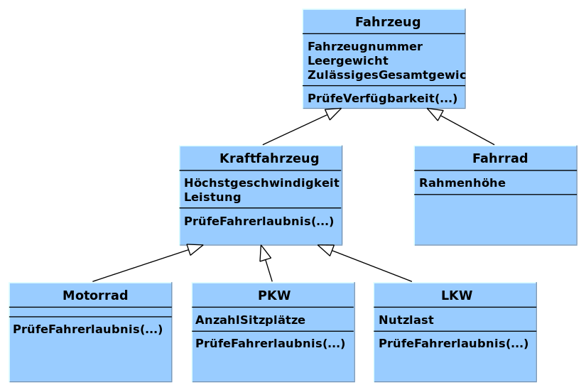

<!--

author:   Sebastian Zug, Galina Rudolf, André Dietrich
email:    sebastian.zug@informatik.tu-freiberg.de
version:  2.0.2
language: de
narrator: Deutsch Female
comment:  Vererbung in C# — explizite virtual/override-Disziplin, base-Konstruktoren, Zugriffsmodifizierer (protected, internal protected), Polymorphie und Methoden-Bindung, new-Verdecken vs. override, sealed, Casts mit is/as und Pattern Matching
tags:      
logo:     

import: https://github.com/liascript/CodeRunner

import: https://raw.githubusercontent.com/TUBAF-IfI-LiaScript/VL_Softwareentwicklung/master/config.md

-->

[](https://liascript.github.io/course/?https://github.com/TUBAF-IfI-LiaScript/VL_Softwareentwicklung/blob/master/10_Vererbung.md)

# Vererbung

| Parameter                | Kursinformationen                                                                         |
| ------------------------ | ----------------------------------------------------------------------------------------- |
| **Veranstaltung:**       | `Vorlesung Softwareentwicklung`                                                           |
| **Teil:**                | `10/27`                                                                                    |
| **Semester**             | @config.semester                                                                          |
| **Hochschule:**          | @config.university                                                                        |
| **Inhalte:**             | @comment                                                                                  |
| **Link auf den GitHub:** | https://github.com/TUBAF-IfI-LiaScript/VL_Softwareentwicklung/blob/master/10_Vererbung.md |
| **Autoren**              | @author                                                                                   |


---------------------------------------------------------------------

## Brücke: Vererbung von Python (07) nach C#

In **07** haben Sie Vererbung in Python kennengelernt — `class Dog(Animal):`, `super().__init__(...)`, beliebiges Überschreiben. C# behandelt dasselbe Konzept *strenger und expliziter*, weil große Codebasen und die Statik des Compilers das brauchen.

| Aspekt                       | Python (07)                           | C# (heute)                                                |
| ---------------------------- | ------------------------------------- | --------------------------------------------------------- |
| Erben von einer Basisklasse  | `class Dog(Animal):`                  | `public class Dog : Animal { ... }`                       |
| Mehrfachvererbung            | erlaubt                               | **nicht erlaubt** (nur über Interfaces — siehe VL 11)     |
| Eltern-Konstruktor aufrufen  | `super().__init__(name)`              | `: base(name)`                                            |
| Eltern-Methode aufrufen      | `super().make_noise()`                | `base.MakeNoise()`                                        |
| Methode überschreiben        | implizit (gleicher Name reicht)       | **explizit:** `virtual` in Basis + `override` in Kind     |
| Geschützter Zugriff für Erben | Konvention `_x`                      | **`protected`** (Compiler-erzwungen)                       |
| Versiegeln                   | nicht vorgesehen                      | `sealed` auf Klasse oder Methode                          |
| Typprüfung zur Laufzeit      | `isinstance(obj, Dog)`                | `obj is Dog`, Pattern Matching mit `switch`               |

> **Lernziele:** Sie können (1) eine C#-Vererbungshierarchie korrekt aufbauen, (2) erklären, *warum* C# `virtual`/`override` explizit verlangt, (3) `protected` von `private` und `internal` abgrenzen, (4) `new`-Verdecken von `override` unterscheiden, (5) Casts mit `is`/`as` und Pattern Matching anwenden.

> **Was kommt in 10?** — Abstrakte Klassen und **Interfaces** als C#-Lösung für Mehrfach-„Vererbung von Verträgen".

## Vererbung

                                      {{0-1}}
*****************************************************************************

> Vererbung bildet neben Kapselung und Polymorphie die zentrale Säule des
> objektorientierten Programmierens. Die Vererbung ermöglicht die Erstellung
> neuer Klassen, die ein in exisitierenden Klassen definiertes Verhalten
> wieder verwenden, erweitern und ändern. [MS.NET Programmierhandbuch]

**Beispiele**

Die Klasse, deren Member vererbt werden, wird **Basisklasse** genannt, die erbende
Klasse als **abgeleitete Klasse** bezeichnet.

| Basisklasse | abgeleitete Klassen                 | Gemeinsamkeiten                                                  |
| ----------- | ----------------------------------- | ---------------------------------------------------------------- |
| Fahrzeug    | Flugzeug, Boot, Automobil           | Position, Geschwindigkeit, Zulassungsnummer, Führerscheinpflicht |
| Datei       | Foto, Textdokument, Datenbankauszug | Dateiname, Dateigröße, Speicherort                               |
| Nachricht   | Email, SMS, Chatmessage             | Adressat, Inhalt, Datum der Versendung                           |



*****************************************************************************


                                      {{1-2}}
*****************************************************************************

**Umsetzung in C#**

```csharp    Vererbung
using System;
using System.Reflection;
using System.ComponentModel.Design;

public class Person {
  public int geburtsjahr;
  public string name;
}

public class Fußballspieler : Person {
  public byte rückennummer;
}

public class Schiedsrichter : Person {
  public bool assistent = true;
}

public class Program
{
  public static void Main(string[] args){
    Person Mensch = new Person {geburtsjahr = 1956, name = "Löw"};
    Console.WriteLine("{0,4} - {1}", Mensch.geburtsjahr, Mensch.name );
    Console.WriteLine("Felder in der Instanz '{0}' von '{1}'", Mensch.name, Mensch);
    var fields = Mensch.GetType().GetFields();
    foreach (FieldInfo field in fields){
       Console.WriteLine(" x " + field.Name);
    }
  }
}
```
@LIA.eval(`["main.cs"]`, `mcs main.cs`, `mono main.exe`)

> Wir sehen, dass die abgeleiteten Klassen `Fußballspieler` und `Schiedsrichter` die Member der Basisklasse `Person` erben. Damit können wir auf diese Member auch über Instanzen der abgeleiteten Klassen zugreifen. Alle Instanzen von `Person`, `Fußballspieler` und `Schiedsrichter` haben die Felder `geburtsjahr` und `name`.

> *Merke*: Im Unterschied zu Klassen ist für Structs unter C# keine Vererbung möglich!

> [!CAUTION]
> In C# kann jede Klassendefinition nur eine Basisklasse referenzieren. Im Sinne
einer realitätsnahen Modellierung wären Mehrfachvererbungen aber
durchaus zielführend. Ein Amphibienfahrzeug leitet sich aus den Basisklassen
Wasserfahrzeug und Landfahrzeug ab, ein Touchpad integriert die Member von
Eingabegerät und Ausgabegerät. C# verzichtet  drauf um Mehrdeutigkeiten und Fehler
ausschließen zu können, die aus gleichnamige Membern hervorgehen.

*****************************************************************************
                                  {{2-3}}
*****************************************************************************

** ... und wie erfolgt die Initialisierung?**

Konstruktoren werden nicht vererbt, jedoch

+ kann mit dem Schlüsselwort `base` auf die Konstruktoren der Basisklasse zurückgegriffen werden.
+ wird sofern aus der abgeleiteten Klasse kein expliziter Aufruf erfolgt, der **parameterlose** Konstruktor der Basisklasse aufgerufen.
+ existiert dieser nicht (weil die Basisklasse nur parametrisierte Konstruktoren hat), **muss** `: base(...)` explizit angegeben werden — der Compiler erzwingt das.

**Drei Fälle, drei Regeln:**

| Situation in der Basisklasse          | Was muss die abgeleitete Klasse tun?                |
| ------------------------------------- | --------------------------------------------------- |
| Kein Konstruktor definiert            | Nichts — Compiler ergänzt parameterlosen Default    |
| Parameterloser Konstruktor existiert  | Nichts — wird implizit aufgerufen                   |
| Nur parametrisierte Konstruktoren     | **`: base(...)` Pflicht** — sonst Compilerfehler    |

Das folgende Beispiel stellt beide Varianten direkt gegenüber — die abgeleitete Klasse `Fußballspieler` hat zwei Konstruktoren: einer ruft `Person()` *implizit* auf, der andere wählt *explizit* `Person(int)` über `: base(1)`.

```csharp    ImplicitConstructorCall
using System;
using System.Reflection;
using System.ComponentModel.Design;

public class Person {
  public int geburtsjahr;
  public string name;

  public Person() {
    geburtsjahr = 1984;
    name = "Unbekannt";
    Console.WriteLine("ctor of Person()");
  }

  public Person(string name, int geburtsjahr) {
    this.name = name;
    this.geburtsjahr = geburtsjahr;
    Console.WriteLine($"ctor of Person({name}, {geburtsjahr})");
  }
}

public class Fußballspieler : Person {
  public byte rückennummer;

  // Variante A: implizit — Compiler ergänzt : base() → ruft Person() auf
  public Fußballspieler() {
    Console.WriteLine("ctor of Fußballspieler()");
  }

  // Variante B: explizit — reicht name und geburtsjahr an Person(string, int) weiter
  public Fußballspieler(string name, int geburtsjahr, byte nr) : base(name, geburtsjahr) {
    rückennummer = nr;
    Console.WriteLine("ctor of Fußballspieler(string, int, byte)");
  }
}

public class Program
{
  public static void Main(string[] args){
    Console.WriteLine("--- Variante A: impliziter base()-Aufruf ---");
    Fußballspieler unbekannt = new Fußballspieler();
    Console.WriteLine("{0,4} - {1}", unbekannt.geburtsjahr, unbekannt.name);

    Console.WriteLine("--- Variante B: expliziter base(name, geburtsjahr)-Aufruf ---");
    Fußballspieler maier = new Fußballspieler("Maier", 1956, 7);
    Console.WriteLine("{0} ({1}) trägt Nummer {2}", maier.name, maier.geburtsjahr, maier.rückennummer);
  }
}
```
@LIA.eval(`["main.cs"]`, `mcs main.cs`, `mono main.exe`)

> **Reihenfolge der Ausgabe beachten:** Erst läuft der Basisklassen-Konstruktor, dann der der abgeleiteten Klasse. Eine Instanz wird also „von innen nach außen" aufgebaut — die Eltern-Felder sind initialisiert, bevor das Kind sie nutzen kann.

> **Was passiert, wenn `Person()` fehlt?** Entfernen Sie probehalber den parameterlosen `Person()`-Konstruktor. Variante A schlägt dann mit einem Compilerfehler fehl, weil der implizit erwartete `: base()`-Aufruf ins Leere greift — Variante B funktioniert weiter.

*****************************************************************************

## Zugriffsmechanismen

Wer darf auf welche Methoden, Properties, Variablen usw. zurückgreifen? Mit der Einführung
der Vererbung steigt die Komplexität der Sichtbarkeitsregeln nochmals an.

````ascii
| Zugriffsmodifizierer | Innerhalb eines Assemblys       || Außerhalb eines Assemblys      |
|                      | Vererbung      | Instanzierung  || Vererbung     | Instanzierung  |
| -------------------- | -------------- | -------------- || ------------- | -------------- |
| `public`             | ja             | ja             || ja            | ja             |
| `private`            | nein           | nein           || nein          | nein           |
| `protected`          | ja             | nein           || ja            | nein           |
| `internal`           | ja             | ja             || nein          | nein           |
| `ìnternal protected` | ja             | ja             || ja            | nein           |
````

`protected` definiert eine differenzierten Zugriff für geerbte und Instanz-Methoden. Während
bei geerbten Elementen uneingeschränkt zugegriffen werden kann, bleiben diese bei der
bloßen Anwendung geschützt.

Die Konzepte von `internal` setzen diese Überlegung fort und kontrollieren den Zugriff über Assembly-Grenzen.

### Member der Klasse

Kriterien der Zugriffsattribute:

+ innerhalb/außerhalb einer Klasse
+ innerhalb der Vererbungshierachie einer Klasse / außerhalb ("nutzt")
+ innerhalb des Assemblys / außerhalb

```ascii
                                      :  Variante I                       Variante II
                                      :  Übergreifendes gemeinsames       Separate Assemblies via
                                      :  Assembly                         dll-Referenz
                                      :
  +------------------------------+    : -.
  | Person                       |    :  |
  +------------------------------+    :  |
  | ✛ Geburtsjahr : int          |    :  |                                     +-------------------------+
  | ✛ Name : string              | ---:--|-------------------------------------| Person.dll              |
  | - email : string             |    :  |                                     +-------------------------+
  +------------------------------+    :  |                                                  |
  | ✛ BerechneAlter()            |    :  .    +------------------------+                    |
  | # SendEmail()                |    :   \   |  Assembly - Programm   |                    |
  +------------------------------+    :   /   +------------------------+                    |
                 ∆                    :  '                                                  |
                 |                    :  |                                                  |
                 |                    :  |                                                  |
  +------------------------------+    :  |                                -.                |
  | Fußballspieler               |    :  |                                 |                |
  +------------------------------+    :  |                                 |                |
  | - rückennummer: int          |    :  |                                 |                |
  | # geschosseneTore : int      |    :  |                                 |                |
  +------------------------------+    :  |                                 |                |
  | «property» Rückennummer: int |    :  |                                 |                |
  | - SendMessage()              |    :  |                                 |                |
  +------------------------------+    :  |                                 .                |
                "^"                   :  |                                  \   +-------------------------+
                 |                    :  |                                  /   | Assembly - Programm     |
                 |                    :  |                                 '    +-------------------------+
  +------------------------------+    :  |                                 |
  | Programm                     |    :  |                                 |
  +------------------------------+    :  |                                 |
  | ✛ Maier: Fußballspieler      |    :  |                                 |
  +------------------------------+    :  |                                 |
  | ✛ Main()                     |    :  |                                 |
  +------------------------------+    :  |                                 |
                                      : -'                                -'
```

### Klasse

Auch für Klassen selbst können Zugriffsattribute das Verhalten bestimmen:

+ Jede Klasse kann entweder als `public` oder `internal` deklariert sein (Standard: `internal`)
+ Klassen können mit `sealed` versiegelt werden. Damit ist das Erben davon ausgeschlossen (Bsp.: System.String)

## Statischer und dynamischer Typ

Bevor wir zur Polymorphie kommen, brauchen wir eine wichtige Unterscheidung. In einer Vererbungshierarchie kann eine Variable vom Basistyp eine Instanz einer abgeleiteten Klasse aufnehmen — der **statische Typ** (so wie er deklariert wurde) und der **dynamische Typ** (die tatsächlich referenzierte Instanz) können auseinanderlaufen.

```csharp    StaticDynamicType
using System;

class Animal
{
  public string Name;
  public Animal(string name) { Name = name; }
}

class Duck : Animal
{
  public Duck(string name) : base(name) { }
}

public class Program
{
  public static void Main(string[] args)
  {
    Animal a = new Animal("Bernd");   // statisch Animal, dynamisch Animal
    Animal b = new Duck("Alfred");    // statisch Animal, dynamisch Duck (Upcast — implizit ok)
    // Duck   c = new Animal("Erna"); // Compilerfehler: Animal ist nicht zwangsläufig eine Duck

    Console.WriteLine($"a: deklariert als Animal, tatsächlich {a.GetType().Name}");
    Console.WriteLine($"b: deklariert als Animal, tatsächlich {b.GetType().Name}");
  }
}
```
@LIA.eval(`["main.cs"]`, `mcs main.cs`, `mono main.exe`)

| Zuweisung                          | statischer Typ | dynamischer Typ | erlaubt?                  |
| ---------------------------------- | -------------- | --------------- | ------------------------- |
| `Animal a = new Animal("Bernd")`   | Animal         | Animal          | ja                        |
| `Animal b = new Duck("Alfred")`    | Animal         | Duck            | ja (Upcast, implizit)     |
| `Animal c = new Cow("Hilde")`      | Animal         | Cow             | ja (Upcast, implizit)     |
| `Duck d = new Animal("Erna")`      | —              | —               | **nein** (Compilerfehler) |

> [!CAUTION]
> Warum diese Unterscheidung wichtig ist: Zur Compile-Zeit weiß der Compiler nicht, welche konkreten Objekte das Programm zur Laufzeit erzeugen wird — die hängen von Benutzereingaben, Dateien, Datenbanken oder Listen ab, die erst während der Ausführung entstehen. Der Compiler kann also nur den statischen Typ garantieren ("hier wird irgendein Animal stehen"), während der dynamische Typ ("genau diese Duck") erst zur Laufzeit feststeht. Genau deshalb müssen Methodenaufrufe wie anim.makeSound() zur Laufzeit aufgelöst werden — und genau das ist Polymorphie. **Wäre alles zur Compile-Zeit bekannt, gäbe es keinen Bedarf für die Unterscheidung.**

> **Merke:** Der statische Typ wird vom Compiler verwendet, um zu prüfen, *welche Member überhaupt aufgerufen werden dürfen*. Der dynamische Typ entscheidet zur Laufzeit, *welche Implementierung tatsächlich läuft* — das ist die Grundlage für Polymorphie.

> **Merke:** Zuweisung *zur Basisklasse* (Upcast) ist immer sicher und passiert implizit. *Zur abgeleiteten Klasse* (Downcast) braucht einen expliziten Cast und kann zur Laufzeit fehlschlagen — Details im Abschnitt **Casts über Klassen** weiter unten.

## Laufzeit-Typprüfung mit `is`

Der dynamische Typ einer Variable lässt sich zur Laufzeit prüfen. Das ist nützlich, wenn eine Methode unterschiedliche Tiertypen entgegennimmt und je nach echtem Typ unterschiedlich reagieren soll.

+ `obj is Typ` liefert `true`, wenn `obj` dem angegebenen Typ *oder* einem davon abgeleiteten Typ entspricht
+ bei `null` liefert die Prüfung immer `false`

```csharp    IsCheck
using System;

class Animal
{
  public string Name;
  public Animal(string name) { Name = name; }
}

class Duck : Animal
{
  public Duck(string name) : base(name) { }
}

class Mallard : Duck        // Stockente — leitet von Duck ab
{
  public Mallard(string name) : base(name) { }
}

public class Program
{
  public static void Main(string[] args)
  {
    Animal a = new Mallard("Donald");

    Console.WriteLine($"a is Animal?  {a is Animal}");   // true
    Console.WriteLine($"a is Duck?    {a is Duck}");     // true (via Vererbung)
    Console.WriteLine($"a is Mallard? {a is Mallard}");  // true (exakter Typ)

    a = null;
    Console.WriteLine($"null is Animal? {a is Animal}"); // false
  }
}
```
@LIA.eval(`["main.cs"]`, `mcs main.cs`, `mono main.exe`)

## Polymorphie in C#

> **Merke:** *Polymorphie* (griech. „Vielgestaltigkeit") bezeichnet die Tatsache, dass derselbe Methodenaufruf — abhängig vom *dynamischen* Typ des Objekts — unterschiedliches Verhalten erzeugt.

Konkret: Methoden mit *gleicher Signatur* können auf verschiedenen Ebenen einer Vererbungshierarchie unterschiedliche Implementierungen haben. Welche Implementierung beim Aufruf tatsächlich läuft, wird erst *zur Laufzeit* entschieden — anhand des dynamischen Typs. Diese Auflösung heißt **dynamische Bindung**.

> **Warum brauchen wir das?** Stellen Sie sich vor, Sie wollen für unterschiedliche Tiere — Enten, Kühe, Hunde — jeweils das richtige Geräusch ausgeben. *Ohne* Polymorphie müssten Sie an jeder Aufrufstelle den Typ prüfen:

```csharp
// Mühsam, fehleranfällig, wächst mit jeder neuen Tierart
if (tier is Duck)      Console.WriteLine("Quack");
else if (tier is Cow)  Console.WriteLine("Muh");
else if (tier is Dog)  Console.WriteLine("Wuff");
```

*Mit* Polymorphie schreiben Sie stattdessen:

```csharp
tier.makeSound();      // die richtige Implementierung läuft automatisch
```

Eine neue Tierart hinzuzufügen heißt dann *nur*: eine neue Klasse anlegen — kein einziger `if`-Zweig muss angepasst werden. Das ist der eigentliche Wert der Vererbung.

### Überschreiben mit `virtual` und `override`

Damit das funktioniert, müssen wir dem Compiler explizit sagen, dass eine Methode überschreibbar ist und dass eine abgeleitete Klasse sie bewusst überschreibt. C# verlangt dafür zwei Schlüsselwörter:

- **`virtual`** an der Basisklassen-Methode: *„Diese Methode darf überschrieben werden."*
- **`override`** in der abgeleiteten Klasse: *„Ich überschreibe bewusst diese virtuelle Methode."*

```csharp    VirtualOverrideMinimal
using System;

class Animal
{
  public virtual void makeSound()              // <- darf überschrieben werden
  {
    Console.WriteLine("I'm an Animal");
  }
}

class Duck : Animal
{
  public override void makeSound()             // <- bewusst überschrieben
  {
    Console.WriteLine("Quack!");
  }
}

public class Program
{
  public static void Main(string[] args)
  {
    Animal a = new Animal();
    Animal d = new Duck();                     // statisch Animal, dynamisch Duck

    a.makeSound();    // -> "I'm an Animal"
    d.makeSound();    // -> "Quack!"   (dynamische Bindung greift)
  }
}
```
```xml   -myproject.csproj
<Project Sdk="Microsoft.NET.Sdk">
  <PropertyGroup>
    <OutputType>Exe</OutputType>
    <TargetFramework>net8.0</TargetFramework>
  </PropertyGroup>
</Project>
```
@LIA.eval(`["Program.cs", "project.csproj"]`, `dotnet build -nologo -warnaserror:CS0108`, `dotnet run -nologo`)

> **Hinweis:** Hier nutzen wir ausnahmsweise `dotnet build` statt `mcs`/`mono`, weil wir gleich eine Compiler-*Warnung* sehen wollen — und die zeigt `mono` nicht zuverlässig an.

Beide Methoden müssen dieselbe **Signatur** haben (Name + Parameterliste). Sonst handelt es sich um *Überladung* — eine ganz andere Mechanik.

**Probieren Sie aus:**

1. **`virtual` entfernen** (in `Animal`): **Compilerfehler** — `Duck.makeSound()` hat nichts zum Überschreiben.
2. **`override` entfernen** (in `Duck`): Der Code kompiliert mit *Warnung* `CS0108`, aber `d.makeSound()` druckt jetzt `"I'm an Animal"` — obwohl `d` doch eine `Duck` ist!

Punkt 2 ist überraschend und zugleich der Schlüssel zum Verständnis: Ohne `override` ist `Duck.makeSound()` für den Compiler eine *neue, unabhängige* Methode, die die Basisklassen-Methode *verdeckt* — keine Überschreibung. Der Compiler entscheidet die Methodenauswahl dann anhand des **statischen Typs** (`Animal`), nicht des dynamischen (`Duck`). Genau diesen Mechanismus behandeln wir gleich unter „Verdecken von Methoden" ausführlich.

> **Python-Vergleich:** In Python ist *jede* Methode implizit überschreibbar. C# verlangt die bewusste Entscheidung in der Basisklasse — was in größeren Codebasen unbeabsichtigte Überschreibungen verhindert.

### Polymorphie in Aktion

```csharp    Polymorphy.cs
using System;

class Animal
{
  public string Name;
  public Animal(string name){
    Name = name;
  }
  public virtual void makeSound(){
    Console.WriteLine("I'm an Animal");
  }
}

class Duck : Animal
{
  public Duck(string name) : base(name) { }
  public override void makeSound(){
    Console.WriteLine("{0} - Quack ({1})", Name, this.GetType().Name);
  }
}

class Cow : Animal
{
  public Cow(string name) : base(name) { }
  public override void makeSound(){
    Console.WriteLine("{0} - Muh ({1})", Name, this.GetType().Name);
  }
}

public class Program
{
  public static void Main(string[] args){
    Animal[] animals = new Animal[3];   // statischer Typ aller Elemente: Animal
    animals[0] = new Duck("Alfred");    // dynamischer Typ: Duck
    animals[1] = new Cow("Hilde");      // dynamischer Typ: Cow
    animals[2] = new Animal("Bernd");   // dynamischer Typ: Animal
    foreach (Animal anim in animals)
      anim.makeSound();                  // dynamische Bindung
  }
}
```
@LIA.eval(`["main.cs"]`, `mcs main.cs`, `mono main.exe`)

Obwohl die Schleifenvariable `anim` den statischen Typ `Animal` hat, läuft jeweils die Implementierung der *abgeleiteten* Klasse. Damit erlaubt die Polymorphie ein **gleichartiges Handling unterschiedlicher Klassen**, die über die Vererbung miteinander verknüpft sind.

Interessant ist die Möglichkeit die ursprüngliche Implementierung der Methode
aus der Basisklasse weiterhin zu nutzen und zu erweitern:

```csharp
class Horse : Animal
{
  public Horse(string name) : base(name) { }
  public override void makeSound()
  {
    base.makeSound();
    Console.WriteLine("Ich ziehe Kutschen");
  }
}
```

Dazu kann die Methode aus der Basisklasse über `base.<Methodenname>` aufgerufen
werden


### Verdecken von Methoden

Sollen die spezifischen Methoden aber nur im Kontext der Klasse realisierbar
sein, so werden sie vor der Basisklasse "verdeckt". Dazu ist das Schlüsselwort
`new` erforderlich. In diesem Fall wird keine dynamische Bindung realisiert,
sondern die Methode der Basisklasse aufgerufen.

```csharp    newOperator
using System;

class Animal
{
  public string Name;
  public Animal(string name){
    Name = name;
  }
  public virtual void makeSound(){
    Console.WriteLine("I'm an Animal");
  }
}

class Cat : Animal
{
  public Cat(string name) : base(name) { }
  public new void makeSound(){
    Console.WriteLine("{0} - Miau ({1})", Name, this.GetType().Name);
  }
}

public class Program
{
  public static void Main(string[] args){
    Cat myCat = new Cat("Kity");
    myCat.makeSound();
    Animal myCatAsAnimal = new Cat("KatziTatzi");
    myCatAsAnimal.makeSound();
  }
}
```
@LIA.eval(`["main.cs"]`, `mcs main.cs`, `mono main.exe`)

Verdeckt werden können alle Klassenmember einer Basisklasse:

+ Felder
+ Properties und Indexer
+ Methoden usw.

Wenn kein Schlüsselwort angegeben ist, wird implizit `new` angenommen. Im oben
genannten Beispiel folgt daraus, dass die in `Cat` implementierte Ausgabe ausschließlich
von Objekten des statischen Typs `Cat` aufgerufen werden kann. Testen Sie die
Wirkung und ersetzen Sie `new` durch `override`.

Das folgende Beispiel entstammt dem C# Programmierhandbuch und kann unter
[Link](https://docs.microsoft.com/de-de/dotnet/csharp/programming-guide/classes-and-structs/versioning-with-the-override-and-new-keywords) nachgelesen werden.

Nehmen wir an, dass Ihre Software eine Grafikbibliothek nutzt, die folgende
Funktionen bietet:

```csharp
class GraphicsClass
{
    public virtual void DrawLine() { }
    public virtual void DrawPoint() { }
}
```

Sie haben darauf aufbauend eine umfangreiches Framework geschieben und in einer
Klasse, die von GraphicsClass erbt eine Methode `DrawRectangle` implementiert.

```csharp
class YourDerivedGraphicsClass : GraphicsClass
{
    public void DrawRectangle() { }
}
```

Nun entwickelt der Hersteller eine neue Version von GraphicsClass und
integriert eine eigene Realisierung von `DrawRectangle`. Sobald Sie Ihre
Anwendung neu gegen die Bibliothek kompilieren, erhalten Sie vom Compiler eine
Warnung. Diese Warnung informiert Sie darüber, dass Sie das gewünschte Verhalten
der DrawRectangle-Methode in Ihrer Anwendung bestimmen müssen.  Welche
Möglichkeiten haben Sie - override oder new oder umbenennen? Welche Konsequenzen
ergeben sich daraus?

### Zusammenfassung 

| Kriterium            | Virtuelle Methode       | Nicht-virtuelle Methode      |
| -------------------- | ----------------------- | ---------------------------- |
| Schlüsselwort        | `virtual` / `override`  | (kein Schlüsselwort) / `new` |
| Überschreibbar?      | Ja                      | Nein (nur versteckbar)       |
| Laufzeitbindung      | Spät (dynamic dispatch) | Früh (static dispatch)       |
| Polymorphie möglich? | Ja                      | Nein                         |


## Versiegeln von Klassen oder Membern

Die Mechanismen der Vererbung und Polymorphie können aber auch aufgehoben werden,
wenn ein Schutz notwendig ist. Das Schlüsselwort `sealed` ermöglicht es sowohl
Klassen von der Rolle als Basisklasse auszuschließen als auch das Überschreiben
von Methoden zu verhindern.

```csharp
class A {}
sealed class B : A {}
```

Im Beispiel erbt die Klasse B von der Klasse A, allerdings kann keine Klasse von
der Klasse B erben.

> **Merke:** Da Strukturen implizit versiegelt sind, können sie nicht geerbt werden.

```csharp    sealedMethods
using System;

sealed public class Animal
{
  public string Name;
  public Animal(string name){
    Name = name;
  }
  public virtual void makeSound(){
    Console.WriteLine("I'm a Crocodile");
  }
}

class Cat : Animal
{
  public Cat(string name) : base(name) { }
  public sealed override void makeSound(){   // sealed schützt die Cat.makeSound methode
    Console.WriteLine("{0} - Miau ({1})", Name, this.GetType().Name);
  }
}

class Tiger : Cat
{
  public Tiger(string name) : base(name) { }
  public override void makeSound(){
    Console.WriteLine("{0} - Grrrr ({1})", Name, this.GetType().Name);
  }
}

public class Program
{
  public static void Main(string[] args){
    Tiger evilTiger = new Tiger("Shir Khan");
    evilTiger.makeSound();
  }
}
```
@LIA.eval(`["main.cs"]`, `mcs main.cs`, `mono main.exe`)

## Casts über Klassen

> **Kompakt-Abschnitt.** Wir behandeln hier nur die Grundlagen (Upcast, Downcast, `is`/`as`). Die Vertiefung **Pattern Matching** mit `switch`-Typmustern verschieben wir in eine der späteren Vorlesungen (Generics / Container).

Konvertierungen zwischen unterschiedlichen Datentypen lassen sich auch
auf Klassen anwenden, allerdings sind hier einige Besonderheiten zu beachten.

+ **Upcast** (Kind → Basis): immer sicher → Compiler lässt ihn *implizit* zu
+ **Downcast** (Basis → Kind): zur Compile-Zeit nicht garantierbar → muss *explizit* geschrieben werden

gecastet werden. Zunächst ein Beispiel für einen *upcast* anhand unseres
Fußballbeispiels. Zugriffe auf Member, die  in der Basisklasse nicht enthalten
sind führen logischerweise zum Fehler.

```csharp    Upcast
using System;

public class Person {
  public int geburtsjahr;
  public string name;
}

public class Fußballspieler : Person {
  public byte rückennummer;
}

public class Program
{
  public static void Main(string[] args)
  {
    Fußballspieler champ = new Fußballspieler {
      geburtsjahr = 1956,
      name = "Maier",
      rückennummer = 13
    };

    // Upcast: implizit, immer sicher
    Person human = champ;

    // Was geht?
    Console.WriteLine($"{human.name} ({human.geburtsjahr})");  // ok — in Person definiert

    // Was geht NICHT?
    // Console.WriteLine(human.rückennummer);
    // → Compilerfehler: 'Person' enthält keine Definition für 'rückennummer'.
    //   Der Compiler sieht nur, was der STATISCHE Typ (Person) zulässt —
    //   obwohl das Objekt selbst weiterhin eine Fußballspieler-Instanz ist:
    Console.WriteLine($"Dynamischer Typ: {human.GetType().Name}");           // -> Fußballspieler
    Console.WriteLine($"human is Fußballspieler? {human is Fußballspieler}"); // -> True
  }
}
```
@LIA.eval(`["main.cs"]`, `mcs main.cs`, `mono main.exe`)

> **Merke:** Beim Upcast verändert sich nicht das Objekt, sondern die Brille, durch die der Compiler es sieht. Die `rückennummer` ist im Speicher weiterhin da — sie ist nur über die `Person`-Variable nicht mehr ansprechbar.

In umgekehrter Richtung vollzieht sich der *Downcast*: eine Variable vom Basistyp wird auf einen abgeleiteten Typ gecastet. Der Compiler kann diese Sicherheit nicht garantieren — also muss der Cast **explizit** geschrieben werden und kann zur **Laufzeit** fehlschlagen.

```csharp    Downcast
using System;

public class Person {
  public int geburtsjahr;
  public string name;
}

public class Fußballspieler : Person {
  public byte rückennummer;
}

public class Program
{
  public static void Main(string[] args)
  {
    // Fall 1: sicherer Downcast — das Objekt IST in Wahrheit ein Fußballspieler
    Person human = new Fußballspieler {
      geburtsjahr = 1956, name = "Maier", rückennummer = 7
    };
    Fußballspieler champ = (Fußballspieler) human;             // ok
    Console.WriteLine($"{champ.name} trägt die Nummer {champ.rückennummer}");

    // Fall 2: unsicherer Downcast — das Objekt ist KEIN Fußballspieler
    Person echterMensch = new Person { name = "Schmidt", geburtsjahr = 1980 };
    try {
      Fußballspieler x = (Fußballspieler) echterMensch;        // wirft InvalidCastException
      Console.WriteLine(x.rückennummer);
    }
    catch (InvalidCastException ex) {
      Console.WriteLine($"Cast fehlgeschlagen: {ex.Message}");
    }
  }
}
```
@LIA.eval(`["main.cs"]`, `mcs main.cs`, `mono main.exe`)

> **Merke:** Ein Downcast ist nur dann erlaubt, wenn der *dynamische* Typ tatsächlich passt. Den Compiler interessiert das nicht — er lässt jeden Downcast zu, weil er den dynamischen Typ ja nicht kennt. Die Laufzeit prüft dann *wirklich* und wirft im Fehlerfall eine `InvalidCastException`.

### `as` — Downcast ohne Exception

Statt mit Cast-Klammern `(T) x` lässt sich ein Downcast auch mit dem `as`-Operator schreiben. Der Unterschied: Bei einem **fehlerhaften** Cast liefert `as` einfach `null` zurück, statt eine Exception zu werfen. Das ist genau dann nützlich, wenn der Cast *vielleicht* klappt und Sie ohne `try/catch` reagieren möchten.

| Operator | bei Erfolg         | bei Misserfolg         |
| -------- | ------------------ | ---------------------- |
| `(T) x`  | Referenz vom Typ T | `InvalidCastException` |
| `x as T` | Referenz vom Typ T | `null`                 |
| `x is T` | `true`             | `false`                |

### Wozu brauche ich das? — Ein typisches Beispiel

Nehmen wir an, wir schreiben einen Logger, der *beliebige* `Person`-Objekte ausgeben soll — einschließlich der spezielleren `Fußballspieler`. Wäre die Ausgabe als Methode an die Klasse selbst gebunden, würde sie sich im Code verstreuen — eine zentrale Logger-Klasse ist meist die bessere Lösung. Diese muss aber den *dynamischen* Typ erkennen, um die richtigen Felder auszugeben — und genau dafür kombinieren wir `is` und `as`:

```csharp    LoggerCast
using System;

public class Person
{
  public int geburtsjahr;
  public string name;
}

public class Fußballspieler : Person
{
  public byte rückennummer;
}

public static class Logger
{
  public static void Print(Person person)
  {
    Console.WriteLine($"{person.name} ({person.geburtsjahr})");

    // Erst prüfen, dann sicher casten:
    if (person is Fußballspieler)
    {
      Fußballspieler spieler = person as Fußballspieler;       // sicher, weil is-true
      Console.WriteLine($"  Rückennummer: {spieler.rückennummer}");
    }
  }
}

public class Program
{
  public static void Main(string[] args)
  {
    Person mensch = new Person { name = "Schmidt", geburtsjahr = 1956 };
    Logger.Print(mensch);

    Fußballspieler champ = new Fußballspieler {
      name = "Müller", geburtsjahr = 1967, rückennummer = 13
    };
    Logger.Print(champ);
  }
}
```
@LIA.eval(`["main.cs"]`, `mcs main.cs`, `mono main.exe`)

> **Praxis-Hinweis:** Das `is`-then-`as`-Muster ist so häufig, dass C# eine Abkürzung anbietet — `if (person is Fußballspieler spieler) { ... }` deklariert die typisierte Variable direkt mit. Dieses **Pattern Matching** behandeln wir in einer späteren Vorlesung ausführlich.

## Aufgaben

- [ ] **Übersetzen (Animal → Dog → Puppy).** Übertragen Sie die mehrstufige Hierarchie aus 07 (Python: `Animal` → `Dog` → `Puppy` mit `super()`-Kette) nach C#. Markieren Sie `describe()` als `virtual` und in jeder Stufe als `override`. Rufen Sie über eine `Animal`-Variable, der ein `Puppy` zugewiesen ist, `describe()` auf und beobachten Sie die Ausgabe.

- [ ]  **`new` vs. `override`.** Schreiben Sie dieselbe Hierarchie mit `new` statt `override` in `Dog.describe()`. Was ändert sich, wenn Sie über eine `Animal`-Variable auf das Objekt zugreifen? Erklären Sie das Ergebnis im Hinblick auf statische und dynamische Bindung.

- [ ]  **`protected` ausprobieren.** Geben Sie `Animal` ein `protected int age;` und schreiben Sie in `Dog` eine Methode, die das Alter erhöht. Versuchen Sie anschließend, von außerhalb der Klassenhierarchie auf `age` zuzugreifen — der Compiler sollte Sie ablehnen.
