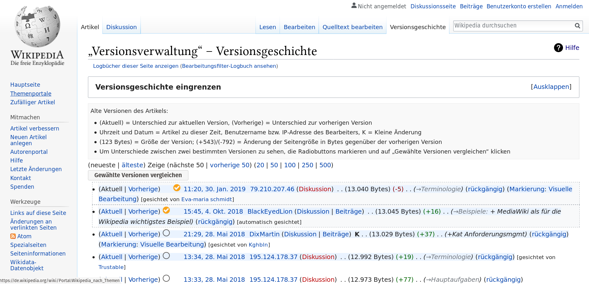
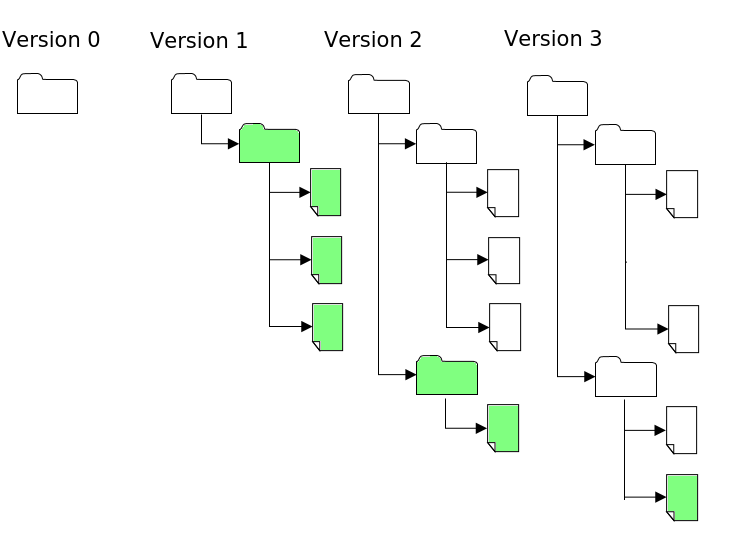
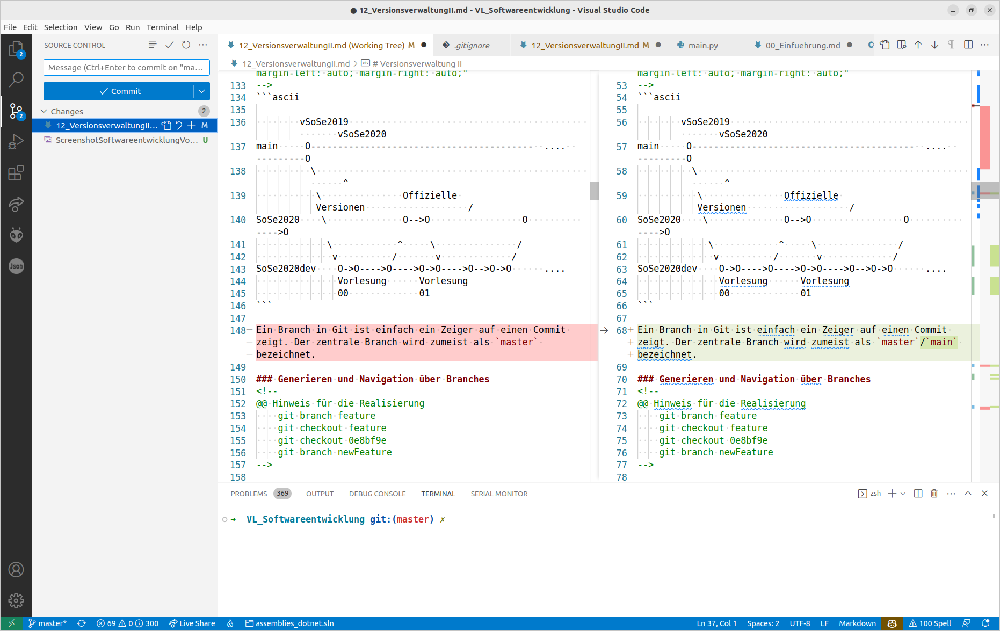

<!--

author:   Sebastian Zug, Galina Rudolf, André Dietrich & `JohannaKlinke`
email:    sebastian.zug@informatik.tu-freiberg.de
version:  1.0.7

language: de
narrator: Deutsch Female

import: https://github.com/liascript/CodeRunner
        https://raw.githubusercontent.com/liaTemplates/ExplainGit/master/README.md
        https://raw.githubusercontent.com/liascript-templates/plantUML/master/README.md
        https://github.com/LiaTemplates/Pyodide

icon: https://upload.wikimedia.org/wikipedia/commons/d/de/Logo_TU_Bergakademie_Freiberg.svg
-->

[](https://liascript.github.io/course/?https://github.com/TUBAF-IfI-LiaScript/VL_Softwareentwicklung/blob/master/11_VersionsverwaltungI.md)

# Versionsverwaltung I

| Parameter                | Kursinformationen                                                                                                                                                                          |
| ------------------------ | ------------------------------------------------------------------------------------------------------------------------------------------------------------------------------------------ |
| **Veranstaltung:**       | `Vorlesung Softwareentwicklung`                                                                                                                                                            |
| **Semester**             | `Sommersemester 2022`                                                                                                                                                                      |
| **Hochschule:**          | `Technische Universität Freiberg`                                                                                                                                                          |
| **Inhalte:**             | `Motivation der Versionsverwaltung in der Softwareentwicklung`                                                                                                                                |
| **Link auf den GitHub:** | [https://github.com/TUBAF-IfI-LiaScript/VL_Softwareentwicklung/blob/master/11_VersionsverwaltungI.md](https://github.com/TUBAF-IfI-LiaScript/VL_Softwareentwicklung/blob/master/11_VersionsverwaltungI.md) |
| **Autoren**              | @author                                                                                                                                                                                    |


---------------------------------------------------------------------

## Motivation

                                   {{0-2}}
******************************************************************************

Was war das umfangreicheste Dokument, an dem Sie bisher gearbeitet haben? Bei vielen sicher eine Hausarbeit am Gymnasium. Wie haben Sie Ihren Fortschritt organisiert?

1. Im schlimmsten Fall haben Sie sich gar keine Gedanken gemacht und immer wieder ins gleiche Dokument geschrieben, das in einem Ordner liegt, der alle zugehörigen Dateien umfasst.
2. Eine Spur besser ist die Idee wöchentlich neue Kopien des Ordners anzulegen und diese in etwa so zu benennen:

```console
▶ ls
myProject
myProject_test
myProject_newTest
myProject_Moms_corrections
...
```

3. Wenn Sie "einen Plan hatte", haben Sie täglich eine Kopie aller Dateien in einem Ordner angelegt und diese systematisch benannt.

```console
▶ ls
myProject_01042021
myProject_02042021
myProject_03042021
...
```

In den Ordnern gab es dann aber wieder das gleiche Durcheinander wie in (2), weil Sie bestimmte Texte gern kurzfristig sichern wollten. Teilweise haben sie diese dann gelöscht bevor die Kopie erstellt wurde, meistens aber einfach in einem `sonstiges` Ordner belassen.

******************************************************************************


                          {{1-2}}
******************************************************************************

Überlegen Sie sich kurz, wie Sie vorgehen müssen, um Antworten auf die folgenden Fragen zu finden:

* "Wann wurde der letzte Stand der Datei x.y gelöscht?"
* "In welcher Version habe ich die Anpassung der Überschriften vorgenommen?"
* "Wie kann ich dies trotz anderer zwischenzeitlicher Änderungen rückgängig machen?"
* "Warum habe ich davon keine Kopie gemacht?"
* "..."

In jedem Fall viel manuelle Arbeit ...

******************************************************************************

                          {{2-3}}
******************************************************************************

Und nun übertragen wir den Ansatz auf eine Softwareentwicklungsprojekt mit vielen Mitstreitern. Die Herausforderungen potenzieren sich.

1. Die Erstellung der Tageskopie müsste synchron erfolgen.
2. Ich muss in die Ordner schauen, um zu sehen welche Anpassungen vorgenommen wurden.
3. Ich weiß nicht welche die aktuelle Version einer Datei ist.
4. Es existieren plötzlich mehrere Varianten einer Datei mit Änderungen an unterschiedlichen Codezeilen.
5. Ich kann den Code nicht kompilieren, weil einzelne Dateien fehlen.
6. Ich kann eine ältere Version der Software nicht finden - "Gestern hat es noch funktioniert".
7. Meine Änderungen wurden von einem Mitstreiter einfach überschrieben.

******************************************************************************

### Lösungsansatz

Eine Versionsverwaltung ist ein System, das zur Erfassung von Änderungen an Dokumenten oder Dateien verwendet wird. Alle Versionen werden in einem Archiv mit Zeitstempel und Benutzerkennung gesichert und können später wiederhergestellt werden. Versionsverwaltungssysteme werden typischerweise in der Softwareentwicklung eingesetzt, um Quelltexte zu verwalten.

Ein Beispiel, wie ein Versionsmanagementsystem die Arbeit von verteilten Autoren unterstützt ist die Implementierung von Wikipedia. Jede Änderung eines Artikels wird dokumentiert. Alle Versionen bilden eine Kette, in der die letzte Version als gültige angezeigt wird. Entsprechend der Angaben kann nachvollzogen werden: wer wann was geändert hat. Damit ist bei Bedarf eine Rückkehr zu früheren Version möglich.



                                {{1-2}}
******************************************************************************

Hauptaufgaben:

+ Protokollierungen der Änderungen: Es kann jederzeit nachvollzogen werden, wer wann was geändert hat.
+ Wiederherstellung von alten Ständen einzelner Dateien: Somit können versehentliche Änderungen jederzeit wieder rückgängig gemacht werden.
+ Archivierung der einzelnen Stände eines Projektes: Dadurch ist es jederzeit möglich, auf alle Versionen zuzugreifen.
+ Koordinierung des gemeinsamen Zugriffs von mehreren Entwicklern auf die Dateien.
+ Gleichzeitige Entwicklung mehrerer Entwicklungszweige (engl. Branch) eines Projektes, was nicht mit der Abspaltung eines anderen Projekts (engl. Fork) verwechselt werden darf.

******************************************************************************


### Strategien zur Konfliktvermeidung

**Herausforderung**

Das Beispiel entstammt dem Buch _Version Control with Subversion_ [^Subversion]

Zwei Nutzer (Harry und Sally) arbeiten am gleichen Dokument (A), das auf einem
zentralen Server liegt:

+ Beide führen verschiedene Änderungen an ihren lokalen Versionendes Dokuments durch.
+ Die lokalen Versionen werden nacheinander in das Repository geschrieben.
+ Sally überschreibt dadurch eventuell Änderungenvon Harry.

Die zeitliche Abfolge der Schreibzugriffe bestimmt welche Variante des Dokuments A überlebt.

<!--
style="width: 100%; max-width: 560px; display: block; margin-left: auto; margin-right: auto;"
-->
```ascii
+----------------------------+---------------------------+
|        Repository          |       Repository          |
|        +-------+           |       +-------+           |
|        |   A   |           |       |   A   |           |
|        +-------+           |       +-------+           |
|         /     \            |                           |
|    read/       \read       |                           |
|       /         \          |                           |
|      v           v         |                           |
| +-------+    +-------+     | +-------+   +-------+     |
| |   A   |    |   A   |     | |   A'  |   |  A''  |     |
| +-------+    +-------+     | +-------+   +-------+     |
|   Harry        Sally       |   Harry       Sally       |
|                            |                           |
| Erzeugen der lokalen Kopie | Barbeitung                |
+----------------------------+---------------------------+
|        Repository          |       Repository          |
|        +-------+           |       +-------+           |
|        |   A'  |           |       |  A''  |           |
|        +-------+           |       +-------+           |
|         ^                  |              ^            |
|   write/                   |               \write      |
|       /                    |                \          |
|      /                     |                 \         |
| +-------+    +-------+     | +-------+   +-------+     |
| |   A'  |    |  A''  |     | |   A'  |   |  A''  |     |
| +-------+    +-------+     | +-------+   +-------+     |
|   Harry        Sally       |   Harry       Sally       |
|                            |                           |
|Harry schreibt seine Version|Sally übermittelt A''      |
+----------------------------+---------------------------+                     .
```

**Lösung I - Exklusives Bearbeiten (Sequenzialisierung)**

Bei der pessimistische Versionsverwaltung (*Lock Modify Unlock*) werden einzelne Dateien vor einer Änderung durch den Benutzer gesperrt und nach Abschluss der Änderung wieder freigegeben werden. Während sie gesperrt sind, verhindert das System Änderungen durch andere Benutzer. Der Vorteil dieses Konzeptes ist, dass kein Zusammenführen von Versionen erforderlich ist, da nur immer ein Entwickler eine Datei ändern kann.

<!--
style="width: 100%; max-width: 560px; display: block; margin-left: auto; margin-right: auto;"
-->
```ascii
+----------------------------+---------------------------+
|        Repository          |       Repository          |
|        ╔═══════╗           |       ╔═══════╗           |
|        ║   A   ║  locked   |       ║   A   ║  locked   |
|        ╚═══════╝           |       ╚═══════╝           |
|         ^/                 |             X             |
|    lock//read              |              \lock        |
|       //                   |               \           |
|      /v                    |                \          |
| +-------+    +-------+     | +-------+   +-------+     |
| |   A   |    |       |     | |   A'  |   |  A''  |     |
| +-------+    +-------+     | +-------+   +-------+     |
|   Harry        Sally       |   Harry       Sally       |
|                            |                           |
| Harry "locks", kopiert und | Sallys lock request wird  |
| beginnt die Bearbeitung    | blockiert                 |
+----------------------------+---------------------------+
|        Repository          |       Repository          |
|        +-------+           |       +-------+           |
|        |   A'  |           |       |  A''  |           |
|        +-------+           |       +-------+           |
|         ^^                 |             ^\            |
|   write//unlock            |         lock \\read       |
|       //                   |               \\          |
|      //                    |                \v         |
| +-------+    +-------+     | +-------+   +-------+     |
| |   A'  |    |  A''  |     | |   A'  |   |   A'  |     |
| +-------+    +-------+     | +-------+   +-------+     |
|   Harry        Sally       |   Harry       Sally       |
|                            |                           |
| Harry übermittelt seine    | Sally blockiert und liest |
| Version und löst den Lock  | die neue Version          |
+----------------------------+---------------------------+                     .
```

Welche Aspekte sehen Sie an dieser Lösung kritisch?

1. Administrative Probleme ... Gesperrte Dokumente werden vergessen zu entsperren.
2. Unnötige Sequentialisierung der Arbeit ... Wenn zwei Nutzer ein Dokument an verschiedenen Stellen ändern möchten, könnten sie dies auch gleichzeitig tun.
3. Keine Abbildung von übergreifenden Abhängigkeiten ... Zwei Nutzer arbeiten getrennt auf den Dokumenten A und B. Was passiert, wenn A von B abhängig ist? A und B passen nicht mehr zusammen. Die Nutzer müssen dieses Problem diskutieren.

**Lösung II - Kollaboratives Arbeiten mit Mischen (Mergen)**

Optimistische Versionsverwaltungen (*Copy Modify Merge*) versuchen die die Schwächen der pessimistischen Versionsverwaltung zu beheben, in dem sie gleichzeitige Änderungen durch mehrere Benutzer an einer Datei zu lassen und anschließend diese Änderungen automatisch oder manuell zusammen führen (Merge).

<!--
style="width: 100%; max-width: 560px; display: block; margin-left: auto; margin-right: auto;"
-->
```ascii
+----------------------------+---------------------------+
|        Repository          |       Repository          |
|        +-------+           |       +-------+           |
|        |   A   |           |       |   A   |           |
|        +-------+           |       +-------+           |
|         /     \            |                           |
|    read/       \read       |                           |
|       /         \          |                           |
|      v           v         |                           |
| +-------+    +-------+     | +-------+   +-------+     |
| |   A   |    |   A   |     | |   A'  |   |  A''  |     |
| +-------+    +-------+     | +-------+   +-------+     |
|   Harry        Sally       |   Harry       Sally       |
|                            |                           |
| Erzeugen der lokalen Kopie | Barbeitung                |
+----------------------------+---------------------------+
|        Repository          |       Repository          |
|        +-------+           |       +-------+           |
|        |  A''  |           |       |  A''  |           |
|        +-------+           |       +-------+           |
|              ^             |         X                 |
|               \write       |   write/                  |
|                \           |       /                   |
|                 \          |      /                    |
| +-------+    +-------+     | +-------+   +-------+     |
| |   A'  |    |  A''  |     | |   A'  |   |  A''  |     |
| +-------+    +-------+     | +-------+   +-------+     |
|   Harry        Sally       |   Harry       Sally       |
|                            |                           |
|Sally schreibt ihre Version |Harries Schreibversuch wird|
|                            |blockiert                  |
+----------------------------+---------------------------+
|        Repository          |       Repository          |
|        +-------+           |       +-------+           |
|        |  A''  |           |       |  A''  |           |
|        +-------+           |       +-------+           |
|         /                  |                           |
|    read/                   |                           |
|       /                    |                           |
|      v                     |                           |
| +-------+    +-------+     | +-------+   +-------+     |
| | A',A''|    |  A''  |     | |   A*  |   |  A''  |     |
| +-------+    +-------+     | +-------+   +-------+     |
|   Harry        Sally       |   Harry       Sally       |
|                            |                           |
| Mergen der Kopien          | merge(A',A'')=A*          |
+----------------------------+---------------------------+
|        Repository          |       Repository          |
|        +-------+           |       +-------+           |
|        |   A*  |           |       |   A*  |           |
|        +-------+           |       +-------+           |
|         ^                  |              \            |
|   write/                   |               \read       |
|       /                    |                \          |
|      /                     |                 v         |
| +-------+    +-------+     | +-------+   +-------+     |
| |   A*  |    |  A''  |     | |   A*  |   |   A*  |     |
| +-------+    +-------+     | +-------+   +-------+     |
|   Harry        Sally       |   Harry       Sally       |
|                            |                           |
|Harry schreibt seine Version|Sally übermittelt A''      |
+----------------------------+---------------------------+                     .
```

Ablauf:

+ Harry und Sally kopieren das das Dokument A in ihre lokalen Ordner.
+ Beide arbeiten unabhängig daran und erzeugen die Versionen A' und A''
+ Sally schreibt als Erste das Dokument in das Repository zurück.
+ Harry kann das Dokument nun nicht mehr zurückschreiben, seine Version ist veraltet
+ Harry vergleicht seine lokale Version mit der aktuellen Version im Repository und mischt die Änderungen von Sally mit seinen Anpassungen
+ Die neue (gemischte) Version A\* wird zurückgeschrieben.
+ Sally muss eine neue Leseoperation realisieren, da Ihre lokale Version veraltet ist.

Welche Konsequenzen ergeben sich daraus?

+ Unser Dokument muss überhaupt kombinierbar sein! Auf ein binäres Format ließe sich das Konzept nicht anwenden!
+ Das Dokument liegt in zeitgleich in n-Versionen vor, die ggf. überlappende Änderungen umfassen.
+ Das zentrale Repository kennt die Version von Harry nur indirekt. Man kann zwar indirekt aus A'' und A* auf A' schließen, man verliert aber zum Beispiel die Information wann Harry seine Änderungen eingebaut hat.

Die Herausforderung liegt somit im Mischen von Dokumenten!

[^Subversion]: Brian W. Fitzpatrick, Ben Collins-Sussman, C. Michael Pilato, Version Control with Subversion, 2nd Edition, O'Reilly Media

### Mischen von Dokumenten

**Schritt 1: Identifikation von Unterschieden**

Zunächst einmal müssen wir feststellen an welchen Stellen es überhaupt Unterschiede
gibt. Welche Differenzen sehen Sie zwischen den beiden Dokumenten:

```markdown                      DokumentV1.md
TU
Bergakademie
Freiberg
Softwareentwicklung
Online Course
Sommersemester 2020
Lorem ipsum dolor sit amet, CONSETETUR sadipscing elitr, sed diam nonumy eirmod tempor invidunt ut labore et dolore magna aliquyam erat, sed diam voluptua. At vero eos et accusam et justo duo dolores et ea rebum. Stet clita kasd gubergren, no sea takimata sanctus est Lorem ipsum dolor sit amet.
```

```markdown                      DokumentV2.md


TU
Bergakademie
Freiberg
Softwareentwicklung
Sommersemester 2019
Lorem ipsum dolor sit amet, consetetur sadipscing elitr, sed diam nonumy eirmod tempor invidunt ut labore et dolore magna aliquyam erat, sed diam voluptua. At vero eos et accusam et justo duo dolores et ea rebum. Stet clita kasd gubergren, no sea takimata sanctus est Lorem ipsum dolor sit amet.
```

Offenbar wurden sowohl Lehrzeichen, als auch neue Zeilen eingeführt. In anderen Zeilen wurden Inhalte angepasst.

Nutzen wir das Tool `diff` um diese Änderungen automatisiert festzustellen. Die Zeilen, die mit `>` beginnen, sind nur in der ersten Datei vorhanden, diejenigen, die mit `<`, markieren das Vorkomen in der zweiten Datei. Die einzelnen Blöcke werden durch sogenannte change commands („Änderungsbefehle“) getrennt, die angeben, welche Aktion (Zeilen hinzufügen – a, ändern – c oder entfernen – d) in welchen Zeilen ausgeführt wurde.

```console
▶diff DokumentV1.md DokumentV2.md
0a1,3
>
>
>
5,7c8,9
< Online Course
< Sommersemester 2020
< Lorem ipsum dolor sit amet, CONSETETUR sadipscing elitr, ...
---
> Sommersemester 2019
> Lorem ipsum dolor sit amet, consetetur sadipscing elitr, ...
```

> **Merke**: Sehr lange Zeilen erschweren die Suche nach wirklichen Änderungen!

Dahinter steht das _Longest Common Subsequence_ Problem, dessen Umsetzung kurz dargestellt werden soll.

```python   lcs_example.py
def lcs_algo(S1, S2, m, n):
    L = [[0 for x in range(n+1)] for x in range(m+1)]

    # Building the matrix in bottom-up way
    for i in range(m+1):
        for j in range(n+1):
            if i == 0 or j == 0:
                L[i][j] = 0
            elif S1[i-1] == S2[j-1]:
                L[i][j] = L[i-1][j-1] + 1
            else:
                L[i][j] = max(L[i-1][j], L[i][j-1])

    index = L[m][n]

    lcs_algo = [""] * (index+1)
    lcs_algo[index] = ""

    i = m
    j = n
    while i > 0 and j > 0:

        if S1[i-1] == S2[j-1]:
            lcs_algo[index-1] = S1[i-1]
            i -= 1
            j -= 1
            index -= 1

        elif L[i-1][j] > L[i][j-1]:
            i -= 1
        else:
            j -= 1

    # Printing the sub sequences
    print("S1 : " + S1 + "\nS2 : " + S2)
    print("LCS: " + "".join(lcs_algo))


S1 = "Das ist ein Test"
S2 = "und das ist ein weiterer Test mit mehr Zeichen"
m = len(S1)
n = len(S2)
lcs_algo(S1, S2, m, n)
```
@Pyodide.eval

**Schritt 2: Mischen**

In der Praxis wird zwischen zwei Szenarien unterschieden:

1. Mischen unabhängiger Dokumente (2-Wege-Mischen) - Ziel ist die Erzeugung eines neuen Dokumentes, dass die gemeinsamen Komponenten und individuelle Teilmengen vereint.

2. Mischen von Dokumenten mit gemeinsamen Ursprung (3-Wege-Mischen) - Ziel ist die Integration möglichst aller Änderungen der neuen Dokumente in eine weiterentwickelte Version des Ursprungsdokumentes

> Ein Paar von Änderung aus D1 bzw. D2 gegenüber einen Ausgangsdokument D0 kann unverträglich sein, wenn die Abbildung beider Änderungen in einem gemeinsamen Dokument nicht möglich ist. In diesem Fall spricht man von einem Konflikt.

Bei einem Konflikt muss eine der beiden ̈Änderungen weggelassen werden. Die Entscheidung darüber kann anhand von zwei Vorgehensweisen realisiert werden:

1. Nicht-interaktives Mischen: Es wird zunächst ein Mischergebnis erzeugt, das beide Änderungen umfasst. Über eine entsprechende Semantik werden die notwendigerweise duplizierten Stellen hervorgehoben. Ein Vorteil dieser Vorgehensweise ist, dass ein beliebiges weitergehendes Editieren zur Konfliktauflösung möglich ist.
2. Interaktives Mischen: Ein Entwickler wird unmittelbar in den Mischprozess eingebunden und um "Schritt-für-Schritt" Entscheidungen gebeten. Denkbare Entscheidungen dabei sind:

    + Übernahme der Änderung gemäß D1 oder D2,

    + Übernahme keiner Änderung,

    + Übernahme von modifizierten Änderung

### Revisionen

Bislang haben wir lediglich einzelne Dateien betrachtet. Logischerweise muss ein übergreifender Ansatz auch Ordnerstrukturen integrieren.



Damit werden sowohl die Ordnerstruktur als auch die Dokumente als Struktur, wie auch deren Inhalte, erfasst.

> Wichtig für die Nachvollziehbarkeit der Entwicklung ist somit die Kontinuität der Erfassung!

Wenn sich der Ordner- oder Dateiname ändert wollen wir trotzdem noch die gesamte History der Entwicklung innerhalb eines Dokuments kennen. Folglich muss ein Link zwischen altem und neuem Namen gesetzt werden.

### Formen der Versionsverwaltung

**Lokale Versionsverwaltung**
Bei der lokalen Versionsverwaltung wird oft nur eine einzige Datei versioniert, diese Variante wurde mit Werkzeugen wie SCCS und RCS umgesetzt. Sie findet auch heute noch Verwendung in Büroanwendungen, die Versionen eines Dokumentes in der Datei des Dokuments selbst speichern (Word).

**Zentrale Versionsverwaltung**
Diese Art ist als Client-Server-System aufgebaut, sodass der Zugriff auf ein Repository auch über Netzwerk erfolgen kann. Durch eine Rechteverwaltung wird dafür gesorgt, dass nur berechtigte Personen neue Versionen in das Archiv legen können. Die Versionsgeschichte ist hierbei nur im Repository vorhanden.

Dieses Konzept wurde vom Open-Source-Projekt Concurrent Versions System (CVS) populär gemacht, mit Subversion (SVN) neu implementiert und von vielen kommerziellen Anbietern verwendet.

<!--
style="width: 100%; max-width: 560px; display: block; margin-left: auto; margin-right: auto;"
-->
```ascii
                                +-----------------+
                                | V 21.09         |
                              +-----------------+ |
                              | V 21.10         | |
              Zentrales     +-----------------+ | |
              Repository    | V 21.11         | | |
                            |                 | |-+
                            |                 | |
                            |                 |-+
                            |                 |
                            +-----------------+
                                    |
          +-------------------------+--------------------------+
          |                         |                          |
  +-----------------+       +-----------------+       +-----------------+
  | V 21.11         |       | V 21.11         |       | V 21.11         |
  | ABCD            |       | GEFH            |       | IKLM            |
  |                 |       |                 |       |                 |
  +-----------------+       +-----------------+       +-----------------+
    User 1                    User 2                    User 3
    Lokale Kopien
```


**Verteilte Versionsverwaltung**
Die verteilte Versionsverwaltung (DVCS, distributed VCS) verwendet kein zentrales Repository mehr. Jeder, der an dem verwalteten Projekt arbeitet, hat sein eigenes Repository und kann dieses mit jedem beliebigen anderen Repository abgleichen. Die Versionsgeschichte ist dadurch genauso verteilt. Änderungen können lokal verfolgt werden, ohne eine Verbindung zu einem Server aufbauen zu müssen.

<!--
style="width: 100%; max-width: 560px; display: block; margin-left: auto; margin-right: auto;"
-->
```ascii
                                +-----------------+
                                | V 21.09         |
                              +-----------------+ |
                              | V 21.10         | |
              Zentrales     +-----------------+ | |
              Repository    | V 21.11         | | |
                            |                 | |-+
                            |                 | |
                            |                 |-+
                            |                 |
                            +-----------------+
                                    |
          +-------------------------+--------------------------+
          |                         |                          |
    +-----------------+      +-----------------+         +-----------------+
    | V 21.09         |      | V 21.09         |         | V 21.09         |
  +-----------------+ |    +-----------------+ |       +-----------------+ |
  | V 21.10         | |    | V 21.10         | |       | V 21.10         | |
+-----------------+ | |  +-----------------+ | |     +-----------------+ | |
| V 21.11         | | |  | V 21.11         | | |     | V 21.11         | | |
|                 | |-+  |                 | |-+   +-----------------+ | |-+
|                 | |    |                 | |     | V 21.12         | | |
|                 |-+    |                 |-+     |                 | |-+
|                 |      |                 |       |                 | |
+-----------------+      +-----------------+       |                 |-+
         |                        |                +-----------------+
         |                        |                          |
         |                        |                          |
+-----------------+       +-----------------+         +-----------------+
| V 21.11         |       | V 21.09         |         | V 21.12         |
| ABCD            |       | GEFH            |         | IKLM            |
|                 |       |                 |         |                 |
+-----------------+       +-----------------+         +-----------------+
  User 1                    User 2                      User 3

```

| Zentrale Versionsverwaltung                                       | Verteilte Versionsverwaltung                                |
| ----------------------------------------------------------------- | ----------------------------------------------------------- |
| Historie liegt nur auf dem Server                                 | gesamte Historie ist den lokalen Repositiories bekannt              |
| Zentrales Repository als Verbindungselement                       | n gleichberechtigte Repositories                            |
| Konflikte bei Manipulation eines Dokumentes durch mehrere Autoren | Existenz paralleler  Versionen eines Dokumentes abgesichert |
| Sequenz von Versionen                                             | gerichteter azyklischer Graph                               |

## Git

**Geschichte und Einsatz**

Die Entwicklungsgeschichte von git ist mit der des Linux Kernels verbunden:

| Jahr | Methode der Versionsverwaltungen                               |
| ---- | -------------------------------------------------------------- |
| 1991 | Änderungen am Linux Kernel via patches und archive files       |
| 2002 | Linux Kernel mit dem Tool BitKeeper verwaltet                  |
| 2005 | Bruch zwischen der vertreibenden Firma und der Linux Community |
| 2021 | Die aktuelle Version ist 2.31.1                                |

2005 wurde einen Anforderungsliste für eine Neuentwicklung definiert. Dabei wurde hervorgehoben, dass sie insbesondere sehr große Projekte (Zahl der Entwickler, Features und Codezeilen, Dateien) unterstützen können muss. Daraus entstand `Git` als freie Software zur verteilten Versionsverwaltung von Dateien.

> Git dominiert entweder als einzelne Installation oder aber eingebettet in verschiedene Entwicklungsplattform die Softwareentwicklung!

**Wie bekommen sie Git auf Ihren Windows-Rechner?**

1. Variante 1: als Integralen Bestandteil in Ihrer Entwicklungsumgebung (Visual Studio Code)
Die großen IDEs umfassen einen eigenen Git-Client, für einfachere Editoren muss dieser meist nachinstalliert werden.

2. Variante 2: als unabhänigige Installation
Unter [Link](https://phoenixnap.com/kb/how-to-install-git-windows) findet sich eine Schritt-für-Schritt Beschreibung für die Installation von Git unter Windows. Dabei wird sowohl ein Shell als auch eine GUI installiert.

3. Variante 3: mittels cygwin
Cygwin emuliert Linuxbefehle und Tools der Shell. Neben Compilern und einer Vielzahl von Entwicklertools können auch verschiedene Versionsverwaltungen installiert werden.

Eine übergreifende Erklärung für die Installation gibt zum Beispiel dieses [Tutorial](https://www.youtube.com/watch?v=Fk12ELJ9Bww).

### Zustandsmodell einer Datei in Git

Dateien können unterschiedliche Zustände haben, mit denen sie in Git-Repositories markiert sind.

                       {{0-1}}
********************************************************************************

```text @plantUML.png
@startuml
hide empty description
[*] --> Untracked : Erzeugen einer Datei
Untracked --> Staged : Hinzufügen zum Repository
Unmodified --> Modified : Editierung der Datei
Modified --> Staged : Markiert als neue Version
Staged --> Unmodified : Bestätigt als neue Version
Unmodified --> Untracked : Löschen aus dem Repository
@enduml
```

********************************************************************************

                        {{1-2}}
********************************************************************************

```text @plantUML.png
@startuml
hide empty description
[*] --> Untracked : Erzeugen einer Datei
Untracked --> Staged : Hinzufügen zum Repository\n <color:Red> ""git add""
Unmodified --> Modified : Editierung der Datei
Modified --> Staged : Markiert als neue Version\n  <color:Red>  ""git add""
Staged --> Unmodified : Bestätigt als neue Version\n   <color:Red>  ""git commit""
Unmodified --> Untracked : Löschen aus dem Repository\n   <color:Red>  ""git remove""
@enduml
```

********************************************************************************

### Grundlegende Anwendung (lokal!)

> **Merke:** Anders als bei svn können Sie mit git eine völlig autonome Versionierung auf Ihrem Rechner realisieren. Ein Server ist dazu *zunächst* nicht nötig.

Aus dem Zustandmodell einer Datei ergeben sich drei Ebenen auf der wir eine Datei in Git Perspektivisch einordnen können - Arbeitsverzeichis, Stage und Repository.

> **Achtung:** Die folgende Darstellung dient hauptsächlich der didaktischen Hinführung zum Thema!

```ascii
                     lokal                           remote
  ---------------------------------------------  --------------
  Arbeitskopie     "Staging"        Lokales          Remote
                                   Repository      Repository
                       |               |                          
                       |               |            Dazu kommen               
                       |               |            wir morgen!          
       +-+- - - - - - -|- - - - - - - -|                          
       | | Änderungen  |               |                          
       | |             |               |                          
       +-+             |               |                          
        |   git add    |               |                          
        |------------->|  git commit   |                          
        |              |-------------->|                          
       +-+             |               |                          
       | | weitere     |               |                          
       | | Änderungen  |               |                          
       +-+             |               |                          
        |   git add    |               |                          
        +------------->|  git commit   |                          
                       |-------------->|                          
                       |               |                                                 |               |                                       .
```


Phase 1: Anlegen des Projektes und initaler Commit

```
mkdir GitBasicExample
cd GitBasicExample
git init
touch README.md
// Hier kommen jetzt einige Anpassungen in README.md dazu
git add README.md
git commit -m "Add first commit!"
git status
```

Phase 2: Generieren unseres DotNet Projektes

```
cd GitBasicExample
dotnet new console -o MyApp
cd MyApp
dotnet run    // Nur zur Testzwecken
git status
git add MyApp.csproj
git add Program.cs
git commit -m "Add inital dotnet project!"
git log --oneline
```

> **Merke:** Beschränken Sie die versionierten Dateien auf ein Minimum! Der gesamte Umfang des dotnet-Projektes gehört nur in seltenen Fällen ins Repository!


Phase 3: Arbeit im Projekt

```
// Veränderungen im Programmcode
git add Program.cs
git commit -m "Change output of project!"
git log --oneline
```

Bis hier her haben wir lediglich eine Erfassung unserer Aktivitäten umgesetzt. Wir können anhand der Log-Files einen Überblick darüber behalten, wann welche Änderungen in welcher Datei realisiert wurden.

### "Kommando zurück"

Nun wird es aber interessanter! Lassen Sie uns jetzt aber zwischen den Varianten navigieren.

**Variante 1 - Reset**

`git reset` löscht die Historie bis zu einem Commit. Adressieren können wir die Commits relativ zum `HEAD` `git reset HEAD~1` oder mit der jeweiligen ID `git reset <commit-id>`.

Wichtig sind dabei die Parameter des Aufrufes:

| Attribut            | Bedeutung                                                                |
| ------------------- | ------------------------------------------------------------------------ |
| `git reset --soft`  | uncommit changes, changes are left staged (index).                       |
| `git reset --mixed` | (default): uncommit + unstage changes, changes are left in working tree. |
| `git reset --hard`  | uncommit + unstage + delete changes, nothing left.                       |

``` text @ExplainGit.eval
git commit -m V1
git commit -m V2
git commit -m V3
```

**Variante 2 - Revert**

Häufig möchte man nicht die gesamte Historie zurückgehen und alle Änderungen verwerfen, sondern vielmehr eine Anpassung zurücknehmen und deren Auswirkung korrigieren. Eine Anpassung würde aber bedeuten, dass alle nachgeordneten Commits angepasst werden müssten.

``` text @ExplainGit.eval
git commit -m V1
git commit -m V2
git commit -m V3
```

**Variante 3 - Rebase**

Ein sehr mächtiges Werkzeug ist der interaktive Modus von `git rebase`. Damit kann die
Geschichte neugeschrieben werden, wie es die git Dokumentation beschreibt. Im Grund können Sie damit Ihre Versionsgeschichte "aufräumen". Einzelne Commits umbenennen, löschen oder fusionieren. Dafür besteht ein eigenes Interface, dass Sie mit dem folgenden Befehl aufrufen können:

```console
▶git rebase -i HEAD~5

pick d2a06e4 Update main.yml
pick 78839b0 Reconfigures checkout
pick f70cfc7 Replaces wildcard by specific filename
pick 05b76f3 New pandoc command line
pick c56a779 Corrects md filename

# Rebase a3b07d4..c56a779 onto a3b07d4 (5 commands)
#
# Commands:
# p, pick = use commit
# r, reword = use commit, but edit the commit message
# e, edit = use commit, but stop for amending
# s, squash = use commit, but meld into previous commit
# f, fixup = like "squash", but discard this commit's log message
# x, exec = run command (the rest of the line) using shell
# d, drop = remove commit
#
# These lines can be re-ordered; they are executed from top to bottom.
#
# If you remove a line here THAT COMMIT WILL BE LOST.
#
# However, if you remove everything, the rebase will be aborted.
#
# Note that empty commits are commented out
```

Als Anwendungsfall habe ich mir meine Aktivitäten im Kontext einiger Experimente
mit den GitHub Actions, die im nächsten Abschnitt kurz eingeführt werden, ausgesucht.
Schauen wir zunächst auf den ursprünglichen Stand. Alle Experimente drehten sich darum, eine Datei anzupassen und dann auf dem Server die Korrektheit zu testen.

```console
▶
c56a779 - Sebastian Zug, 7 hours ago : Corrects md filename
05b76f3 - Sebastian Zug, 7 hours ago : New pandoc command line
f70cfc7 - Sebastian Zug, 8 hours ago : Replaces wildcard by specific filename
78839b0 - Sebastian Zug, 21 hours ago : Reconfigures checkout
d2a06e4 - Sebastian Zug, 22 hours ago : Update main.yml
...
aa04051 - Sebastian Zug, 23 hours ago : Restart action activities
4b22d12 - Sebastian Zug, 23 hours ago : Deleting old state
64075cc - Sebastian Zug, 24 hours ago : Update main.yml
01f341b - Sebastian Zug, 24 hours ago : Missing links added
...
29c8e68 - Sebastian Zug, 11 days ago : Update README.md
```

Unser lokaler Branch liegt nach dem Löschen aber um einiges hinter dem auf GitHub entsprechend müssen wir mit `git push --force` das Überschreiben erzwingen.

### Was kann schief gehen?

1. **Ups, die Datei sollte im Commit nicht dabei sein (Unstage)**

```
... ein neues Feature wird in sourceA.cs implementiert
... ein Bug in Codedatei sourceB.cs korrigiert
... wir wollen schnell sein und fügen alle Änderungen als staged ein
git add *
... Aber halt! Die beiden Dinge gehören doch nicht zusammen!
git reset
```

``` text @ExplainGit.eval
git commit -m V1
git commit -m V2
git commit -m V3
```

2. **Ups, eine Datei in der Version vergessen! (Unvollständiger Commit)**

```
... eine neue Codedatei source.cs anlegen
... zugehörige Anpassungen in der README.md erklären
git add README.md
git commit -m "Hinzugefügt neues Feature"
... Leider wurde die zugehörige Code Datei vergessen!
git add source.cs
git commit --amend --no-edit
... Hinzufügen der Datei ohne die Log Nachricht anzupassen
```

### Ich sehe was, was Du nicht siehst ...

Häufig bettet ein Projekt Dateien ein, die Git nicht automatisch hinzufügen oder schon gar nicht als „nicht versioniert“ anzeigen soll. Beispiele dafür sind automatisch generierte Dateien, wie Log-Dateien oder die Binaries, die von Ihrem Build-System erzeugt wurden. In solchen Fällen können Sie die Datei .gitignore erstellen, die eine Liste mit Vergleichsmustern enthält. Hier ist eine .gitignore Beispieldatei:

```console     gitignoreExample
# ignore all .a files
*.a

# but do track lib.a, even though you're ignoring .a files above
!lib.a

# only ignore the TODO file in the current directory, not subdir/TODO
/TODO

# ignore all files in any directory named build
build/

# ignore doc/notes.txt, but not doc/server/arch.txt
doc/*.txt

# ignore all .pdf files in the doc/ directory and any of its subdirectories
doc/**/*.pdf
```

Unter [gitIgnoreBeispiele](https://github.com/github/gitignore) gibt es eine ganze Sammlung von Konfigurationen für bestimmte Projekttypen.

## Kommandozeile oder keine Kommandozeile

Die Editoren unterstützen den Nutzer bei der Arbeit, in dem Sie die eigentlichen Commandozeilentools rund um die Arbeitsfläche anordnen.

<!-- width="100%" -->

| Bereich | Bedeutung                                                                                                                                                                                                                                  |
| ------- | ------------------------------------------------------------------------------------------------------------------------------------------------------------------------------------------------------------------------------------------ |
| A       | Darstellung der Dateien im Ordner, wobei der Typ über die führenden Symbole und der Zustand über die Farbgebung hervorgehoben wird (grün untracked Files, orange getrackte Dateien mit Änderungen).                                        |
| B       | Hier erfolgt die Darstellung der `Staged Changes` also der registrierten Änderungen. Offenbar ist die Datei `02_Versionsverwaltung.md` verändert worden, ohne dass ein entsprechendes `git add 02_Versionsverwaltung.md` ausgeführt wurde. |
| C       | Die Übersicht der erfassten Änderngen mit einem `stage` Status übernimmt die aus der darüber geführten Liste, wenn der Befehlt ausgeführt wurde. Offenbar ist dies fr `.gitignore` der Fall.                                               |
| D       | Die Übertragung ins lokale Repository wird gerade vorbereitet. Die Commit-Nachricht ist bereits eingegeben. Der Button zeigt den zugehörigen Branch.                                                                                       |
|         | G                                                 An dieser Stelle wird ein kurzes Log der letzten Commits ausgeben. Dies ermöglich das effiziente Durchsuchen der nach bestimmten Veränderungen.                                                                                                                                                                                          |

Die identischen Informationen lassen sich auch auf der Kommandozeile einsehen:

```console
▶git status
On branch SoSe2020dev
Your branch is up to date with 'origin/SoSe2020dev'.

Changes to be committed:
  (use "git reset HEAD <file>..." to unstage)

        modified:   .gitignore

Changes not staged for commit:
  (use "git add/rm <file>..." to update what will be committed)
  (use "git checkout -- <file>..." to discard changes in working directory)


        modified:   02_Versionsverwaltung.md
        deleted:    03_ContinuousIntegration.md

Untracked files:
  (use "git add <file>..." to include in what will be committed)

        03_VersionsverwaltungII.md
        code/
        img/03_VersionsverwaltungII/
```

```console
▶git log
commit d7603554c958c478f1ec600bd3ccea437d91ae9a (HEAD -> SoSe2020dev, origin/SoSe2020dev)
Author: Sebastian Zug <Sebastian.Zug@informatik.tu-freiberg.de>
Date:   Thu Apr 9 13:16:38 2020 +0200

    First version of L3

commit 39fc168222f4c7a7d062adcaccff17fe34bccbe3
Author: Sebastian Zug <Sebastian.Zug@informatik.tu-freiberg.de>
Date:   Thu Apr 9 13:16:12 2020 +0200

    First version of L02

commit 350c127c7dfbc61a81edc8bd148f605ee681a07a

Author: Sebastian Zug <Sebastian.Zug@informatik.tu-freiberg.de>
Date:   Tue Apr 7 07:01:02 2020 +0200

    Final version of L1
....
```

## Aufgaben

- [ ] Legen Sie sich einen GitHub Account an.
- [ ] Experimentieren Sie mit lokalen Repositories!
