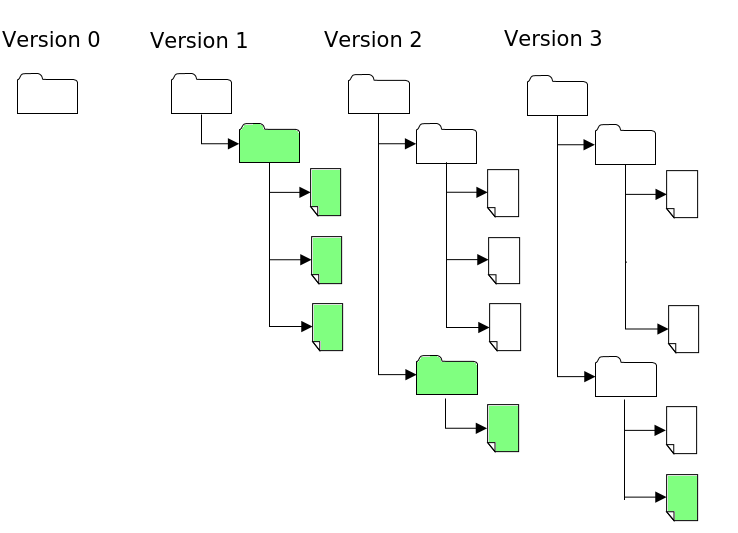
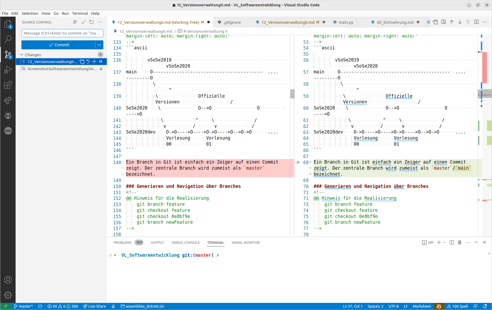

<!--

author:   Sebastian Zug, Galina Rudolf, André Dietrich & `JohannaKlinke`
email:    sebastian.zug@informatik.tu-freiberg.de
version:  1.0.13
language: de
narrator: Deutsch Female
comment:  Motivation der Versionsverwaltung in der Softwareentwicklung, Diskussion der zentraler / dezentraler Ansätze, Umsetzung von merge Operation, Einführung in die Verwendung von Git
tags:      
logo:     

import: https://github.com/liascript/CodeRunner
        https://raw.githubusercontent.com/liaTemplates/ExplainGit/master/README.md
        https://raw.githubusercontent.com/liascript-templates/plantUML/master/README.md

import: https://raw.githubusercontent.com/TUBAF-IfI-LiaScript/VL_Softwareentwicklung/master/config.md

-->

[](https://liascript.github.io/course/?https://github.com/TUBAF-IfI-LiaScript/VL_Softwareentwicklung/blob/master/11_VersionsverwaltungI.md)

# Versionsverwaltung I

| Parameter                | Kursinformationen                                                                                   |
| ------------------------ | --------------------------------------------------------------------------------------------------- |
| **Veranstaltung:**       | `Vorlesung Softwareentwicklung`                                                                     |
| **Teil:**                | `11/27`                                                                                              |
| **Semester**             | @config.semester                                                                                    |
| **Hochschule:**          | @config.university                                                                                  |
| **Inhalte:**             | @comment                                                                                            |
| **Link auf den GitHub:** | https://github.com/TUBAF-IfI-LiaScript/VL_Softwareentwicklung/blob/master/11_VersionsverwaltungI.md |
| **Autoren**              | @author                                                                                             |


---------------------------------------------------------------------

## Motivation

                                   {{0-2}}
******************************************************************************

Was war das umfangreicheste Dokument, an dem Sie bisher gearbeitet haben? Bei vielen sicher eine Hausarbeit am Gymnasium. Wie haben Sie Ihren Fortschritt organisiert?

1. Im schlimmsten Fall haben Sie sich gar keine Gedanken gemacht und immer wieder ins gleiche Dokument geschrieben, das in einem Ordner liegt, der alle zugehörigen Dateien umfasst.
2. Eine Spur besser ist die Idee wöchentlich neue Kopien des Ordners anzulegen und diese in etwa so zu benennen:

```console
▶ ls
myProject
myProject_test
myProject_newTest
myProject_Moms_corrections
...
```

3. Wenn Sie "einen Plan hatten", haben Sie täglich eine Kopie aller Dateien in einem Ordner angelegt und diese systematisch benannt.

```console
▶ ls
myProject_01042021
myProject_02042021
myProject_03042021
...
```

In den Ordnern gab es dann aber wieder das gleiche Durcheinander wie in (2), weil Sie bestimmte Texte gern kurzfristig Sichern wollten. Teilweise haben sie diese dann gelöscht bevor die Kopie erstellt wurde, meistens aber einfach in einem `sonstiges` Ordner belassen.

******************************************************************************


                          {{1-2}}
******************************************************************************

Überlegen Sie sich kurz, wie Sie vorgehen müssen, um Antworten auf die folgenden Fragen zu finden:

* "Wann wurde der letzte Stand der Datei x.y gelöscht?"
* "In welcher Version habe ich die Anpassung der Überschriften vorgenommen?"
* "Wie kann ich dies trotz anderer zwischenzeitlicher Änderungen rückgängig machen?"
* "Warum habe ich davon keine Kopie gemacht?"
* "..."

In jedem Fall viel manuelle Arbeit ...

******************************************************************************

                          {{2-3}}
******************************************************************************

Und nun übertragen wir den Ansatz auf eine Softwareentwicklungsprojekt mit vielen Mitstreitern. Die Herausforderungen potenzieren sich.

1. Die Erstellung der Tageskopie müsste synchron erfolgen.
2. Ich muss in die Ordner schauen, um zu sehen welche Anpassungen vorgenommen wurden.
3. Ich weiß nicht welche die aktuelle Version einer Datei ist.
4. Es existieren plötzlich mehrere Varianten einer Datei mit Änderungen an unterschiedlichen Codezeilen.
5. Ich kann den Code nicht kompilieren, weil einzelne Dateien fehlen.
6. Ich kann eine ältere Version der Software nicht finden - "Gestern hat es noch funktioniert".
7. Meine Änderungen wurden von einem Mitstreiter einfach überschrieben.

******************************************************************************

## Vergleichbare Probleme

Eine Versionsverwaltung ist ein System, das zur Erfassung von Änderungen an Dokumenten oder Dateien verwendet wird. Alle Versionen werden in einem Archiv mit Zeitstempel und Benutzerkennung gesichert und können später wiederhergestellt werden. Versionsverwaltungssysteme werden typischerweise in der Softwareentwicklung eingesetzt, um Quelltexte zu verwalten.

Ein Beispiel, wie ein Versionsmanagementsystem die Arbeit von verteilten Autoren unterstützt ist die Implementierung von Wikipedia. Jede Änderung eines Artikels wird dokumentiert. Alle Versionen bilden eine Kette, in der die letzte Version als gültige angezeigt wird. Entsprechend der Angaben kann nachvollzogen werden: wer wann was geändert hat. Damit ist bei Bedarf eine Rückkehr zu früheren Version möglich.

Schauen Sie sich live an, wie Wikipedia die Versionsgeschichte des Artikels *Versionsverwaltung* verwaltet — jede Bearbeitung ist mit Zeitstempel, Autor und Diff dokumentiert:

<iframe src="https://de.wikipedia.org/w/index.php?title=Versionsverwaltung&action=history" width="100%" height="500px" style="border: 1px solid #ccc;"></iframe>

                                {{1-2}}
******************************************************************************

Hauptaufgaben:

+ Protokollierungen der Änderungen: Es kann jederzeit nachvollzogen werden, wer wann was geändert hat.
+ Wiederherstellung von alten Ständen einzelner Dateien: Somit können versehentliche Änderungen jederzeit wieder rückgängig gemacht werden.
+ Archivierung der einzelnen Stände eines Projektes: Dadurch ist es jederzeit möglich, auf alle Versionen zuzugreifen.
+ Koordinierung des gemeinsamen Zugriffs von mehreren Entwicklern auf die Dateien.
+ Gleichzeitige Entwicklung mehrerer Entwicklungszweige (engl. Branch) eines Projektes, was nicht mit der Abspaltung eines anderen Projekts (engl. Fork) verwechselt werden darf.

******************************************************************************


## Strategien zur Konfliktvermeidung

                                {{0-1}}
******************************************************************************

**Herausforderung**

Das Beispiel entstammt dem Buch _Version Control with Subversion_ [^Subversion]

Zwei Nutzer (Harry und Sally) arbeiten am gleichen Dokument (A), das auf einem
zentralen Server liegt:

+ Beide führen verschiedene Änderungen an ihren lokalen Versionen des Dokuments durch.
+ Die lokalen Versionen werden nacheinander in das Repository geschrieben.
+ Sally überschreibt dadurch eventuell Änderungenvon Harry.

Die zeitliche Abfolge der Schreibzugriffe bestimmt welche Variante des Dokuments A überlebt.

<!--
style="width: 100%; max-width: 860px; display: block; margin-left: auto; margin-right: auto;"
-->
```ascii
+----------------------------+---------------------------+
|        Repository          |       Repository          |
|        +-------+           |       +-------+           |
|        |   A   |           |       |   A   |           |
|        +-------+           |       +-------+           |
|         /     \            |                           |
|    read/       \read       |                           |
|       /         \          |                           |
|      v           v         |                           |
| +-------+    +-------+     | +-------+   +-------+     |
| |   A   |    |   A   |     | |   A'  |   |  A''  |     |
| +-------+    +-------+     | +-------+   +-------+     |
|   Harry        Sally       |   Harry       Sally       |
|                            |                           |
| Erzeugen der lokalen Kopie | Barbeitung                |
+----------------------------+---------------------------+
|        Repository          |       Repository          |
|        +-------+           |       +-------+           |
|        |   A'  |           |       |  A''  |           |
|        +-------+           |       +-------+           |
|         ^                  |              ^            |
|   write/                   |               \write      |
|       /                    |                \          |
|      /                     |                 \         |
| +-------+    +-------+     | +-------+   +-------+     |
| |   A'  |    |  A''  |     | |   A'  |   |  A''  |     |
| +-------+    +-------+     | +-------+   +-------+     |
|   Harry        Sally       |   Harry       Sally       |
|                            |                           |
|Harry schreibt seine Version| Sally übermittelt A''     |
+----------------------------+---------------------------+                     .
```

******************************************************************************


                                {{1-2}}
******************************************************************************

**Lösung I - Exklusives Bearbeiten (Sequenzialisierung)**

Bei der pessimistischen Versionsverwaltung (*Lock Modify Unlock*) werden einzelne Dateien vor einer Änderung durch den Benutzer gesperrt und nach Abschluss der Änderung wieder freigegeben werden. Während sie gesperrt sind, verhindert das System Änderungen durch andere Benutzer. Der Vorteil dieses Konzeptes ist, dass kein Zusammenführen von Versionen erforderlich ist, da nur immer ein Entwickler eine Datei ändern kann.

<!--
style="width: 100%; max-width: 860px; display: block; margin-left: auto; margin-right: auto;"
-->
```ascii
+----------------------------+---------------------------+
|        Repository          |       Repository          |
|        ╔═══════╗           |       ╔═══════╗           |
|        ║   A   ║  locked   |       ║   A   ║  locked   |
|        ╚═══════╝           |       ╚═══════╝           |
|         ^/                 |             X             |
|    lock//read              |              \lock        |
|       //                   |               \           |
|      /v                    |                \          |
| +-------+    +-------+     | +-------+   +-------+     |
| |   A   |    |       |     | |   A'  |   |  A''  |     |
| +-------+    +-------+     | +-------+   +-------+     |
|   Harry        Sally       |   Harry       Sally       |
|                            |                           |
| Harry "locks", kopiert und | Sallys lock request wird  |
| beginnt die Bearbeitung    | blockiert                 |
+----------------------------+---------------------------+
|        Repository          |       Repository          |
|        +-------+           |       +-------+           |
|        |   A'  |           |       |  A''  |           |
|        +-------+           |       +-------+           |
|         ^^                 |             ^\            |
|   write//unlock            |         lock \\read       |
|       //                   |               \\          |
|      //                    |                \v         |
| +-------+    +-------+     | +-------+   +-------+     |
| |   A'  |    |  A''  |     | |   A'  |   |   A'  |     |
| +-------+    +-------+     | +-------+   +-------+     |
|   Harry        Sally       |   Harry       Sally       |
|                            |                           |
| Harry übermittelt seine    | Sally blockiert und liest |
| Version und löst den Lock  | die neue Version          |
+----------------------------+---------------------------+                     .
```

Welche Aspekte sehen Sie an dieser Lösung kritisch?

1. Administrative Probleme ... Gesperrte Dokumente werden vergessen zu entsperren.
2. Unnötige Sequentialisierung der Arbeit ... Wenn zwei Nutzer ein Dokument an verschiedenen Stellen ändern möchten, könnten sie dies auch gleichzeitig tun.
3. Keine Abbildung von übergreifenden Abhängigkeiten ... Zwei Nutzer arbeiten getrennt auf den Dokumenten A und B. Was passiert, wenn A von B abhängig ist? A und B passen nicht mehr zusammen. Die Nutzer müssen dieses Problem diskutieren.


******************************************************************************

                                {{2-3}}
******************************************************************************

**Lösung II - Kollaboratives Arbeiten mit Mischen (Mergen)**

Optimistische Versionsverwaltungen (*Copy Modify Merge*) versuchen die die Schwächen der pessimistischen Versionsverwaltung zu beheben, in dem sie gleichzeitige Änderungen durch mehrere Benutzer an einer Datei zu lassen und anschließend diese Änderungen automatisch oder manuell zusammen führen (Merge).

<!--
style="width: 100%; max-width: 860px; display: block; margin-left: auto; margin-right: auto;"
-->
```ascii
+----------------------------+---------------------------+
|        Repository          |       Repository          |
|        +-------+           |       +-------+           |
|        |   A   |           |       |   A   |           |
|        +-------+           |       +-------+           |
|         /     \            |                           |
|    read/       \read       |                           |
|       /         \          |                           |
|      v           v         |                           |
| +-------+    +-------+     | +-------+   +-------+     |
| |   A   |    |   A   |     | |   A'  |   |  A''  |     |
| +-------+    +-------+     | +-------+   +-------+     |
|   Harry        Sally       |   Harry       Sally       |
|                            |                           |
| Erzeugen der lokalen Kopie | Bearbeitung               |
+----------------------------+---------------------------+
|        Repository          |       Repository          |
|        +-------+           |       +-------+           |
|        |  A''  |           |       |  A''  |           |
|        +-------+           |       +-------+           |
|              ^             |         X                 |
|               \write       |   write/                  |
|                \           |       /                   |
|                 \          |      /                    |
| +-------+    +-------+     | +-------+   +-------+     |
| |   A'  |    |  A''  |     | |   A'  |   |  A''  |     |
| +-------+    +-------+     | +-------+   +-------+     |
|   Harry        Sally       |   Harry       Sally       |
|                            |                           |
|Sally schreibt ihre Version |Harry's Schreibversuch wird|
|                            |blockiert                  |
+----------------------------+---------------------------+
|        Repository          |       Repository          |
|        +-------+           |       +-------+           |
|        |  A''  |           |       |  A''  |           |
|        +-------+           |       +-------+           |
|         /                  |                           |
|    read/                   |                           |
|       /                    |                           |
|      v                     |                           |
| +-------+    +-------+     | +-------+   +-------+     |
| | A',A''|    |  A''  |     | |   A*  |   |  A''  |     |
| +-------+    +-------+     | +-------+   +-------+     |
|   Harry        Sally       |   Harry       Sally       |
|                            |                           |
| Mergen der Kopien          | merge(A',A'')=A*          |
+----------------------------+---------------------------+
|        Repository          |       Repository          |
|        +-------+           |       +-------+           |
|        |   A*  |           |       |   A*  |           |
|        +-------+           |       +-------+           |
|         ^                  |              \            |
|   write/                   |               \read       |
|       /                    |                \          |
|      /                     |                 v         |
| +-------+    +-------+     | +-------+   +-------+     |
| |   A*  |    |  A''  |     | |   A*  |   |   A*  |     |
| +-------+    +-------+     | +-------+   +-------+     |
|   Harry        Sally       |   Harry       Sally       |
|                            |                           |
|Harry schreibt seine Version|Sally übermittelt A''      |
+----------------------------+---------------------------+                     .
```

Ablauf:

+ Harry und Sally kopieren das Dokument A in ihre lokalen Ordner.
+ Beide arbeiten unabhängig daran und erzeugen die Versionen A' und A''
+ Sally schreibt als Erste das Dokument in das Repository zurück.
+ Harry kann das Dokument nun nicht mehr zurückschreiben, seine Version ist veraltet
+ Harry vergleicht seine lokale Version mit der aktuellen Version im Repository und mischt die Änderungen von Sally mit seinen Anpassungen
+ Die neue (gemischte) Version A\* wird zurückgeschrieben.
+ Sally muss eine neue Leseoperation realisieren, da Ihre lokale Version veraltet ist.

Welche Konsequenzen ergeben sich daraus?

+ Unser Dokument muss überhaupt kombinierbar sein! Auf ein binäres Format ließe sich das Konzept nicht anwenden!
+ Das Dokument liegt in zeitgleich in n-Versionen vor, die ggf. überlappende Änderungen umfassen.
+ Das zentrale Repository kennt die Version von Harry nur indirekt. Man kann zwar indirekt aus A'' und A* auf A' schließen, man verliert aber zum Beispiel die Information wann Harry seine Änderungen eingebaut hat.

> Die Herausforderung liegt somit im Mischen von Dokumenten!

******************************************************************************

[^Subversion]: Brian W. Fitzpatrick, Ben Collins-Sussman, C. Michael Pilato, Version Control with Subversion, 2nd Edition, O'Reilly Media


### Mischen von Dokumenten

**Schritt 1: Identifikation von Unterschieden**

Zunächst einmal müssen wir feststellen an welchen Stellen es überhaupt Unterschiede
gibt. Welche Differenzen sehen Sie zwischen den beiden Dokumenten:

```markdown                      DokumentV1.md
TU
Bergakademie
Freiberg
Softwareentwicklung
Online Course
Sommersemester 2020
Lorem ipsum dolor sit amet, CONSETETUR sadipscing elitr, sed diam nonumy eirmod tempor invidunt ut labore et dolore magna aliquyam erat, sed diam voluptua. At vero eos et accusam et justo duo dolores et ea rebum. Stet clita kasd gubergren, no sea takimata sanctus est Lorem ipsum dolor sit amet.
```

```markdown                      DokumentV2.md


TU
Bergakademie
Freiberg
Softwareentwicklung
Sommersemester 2019
Lorem ipsum dolor sit amet, consetetur sadipscing elitr, sed diam nonumy eirmod tempor invidunt ut labore et dolore magna aliquyam erat, sed diam voluptua. At vero eos et accusam et justo duo dolores et ea rebum. Stet clita kasd gubergren, no sea takimata sanctus est Lorem ipsum dolor sit amet.
```

Offenbar wurden sowohl Lehrzeichen, als auch neue Zeilen eingeführt. In anderen Zeilen wurden Inhalte angepasst.

Nutzen wir das Tool `diff` um diese Änderungen automatisiert festzustellen. Die Zeilen, die mit `>` beginnen, sind nur in der ersten Datei vorhanden, diejenigen, die mit `<`, markieren das Vorkommen in der zweiten Datei. Die einzelnen Blöcke werden durch sogenannte change commands („Änderungsbefehle“) getrennt, die angeben, welche Aktion (Zeilen hinzufügen – a, ändern – c oder entfernen – d) in welchen Zeilen ausgeführt wurde.

```console
▶diff DokumentV1.md DokumentV2.md
0a1,3
>
>
>
5,7c8,9
< Online Course
< Sommersemester 2020
< Lorem ipsum dolor sit amet, CONSETETUR sadipscing elitr, ...
---
> Sommersemester 2019
> Lorem ipsum dolor sit amet, consetetur sadipscing elitr, ...
```

> **Merke**: Sehr lange Zeilen erschweren die Suche nach wirklichen Änderungen!

Dahinter steht das _Longest Common Subsequence_ Problem, dessen Umsetzung kurz dargestellt werden soll.

```python   lcs_example.py
def lcs_algo(S1, S2, m, n):
    L = [[0 for x in range(n+1)] for x in range(m+1)]

    # Teil 1: Matrixaufbau
    for i in range(m+1):
        for j in range(n+1):
            if i == 0 or j == 0:
                L[i][j] = 0
            elif S1[i-1] == S2[j-1]:
                L[i][j] = L[i-1][j-1] + 1
            else:
                L[i][j] = max(L[i-1][j], L[i][j-1])

    index = L[m][n]

    # Teil 2: Rückverfolgung der LCS
    lcs_algo = [""] * (index+1)
    lcs_algo[index] = ""

    i = m
    j = n
    while i > 0 and j > 0:

        if S1[i-1] == S2[j-1]:
            lcs_algo[index-1] = S1[i-1]
            i -= 1
            j -= 1
            index -= 1

        elif L[i-1][j] > L[i][j-1]:
            i -= 1
        else:
            j -= 1

    # Printing the sub sequences
    print("S1 : " + S1 + "\nS2 : " + S2)
    print("LCS: " + "".join(lcs_algo))


S1 = "ABCDGH"
S2 = "AEDFHR"
m = len(S1)
n = len(S2)
lcs_algo(S1, S2, m, n)
```
@LIA.eval(`["main.py"]`, `none`, `python3 main.py`)

**Warum ist das Ergebnis `ADH`?**

LCS steht für *Longest Common **Subsequence*** — nicht *Substring*! Der Unterschied ist entscheidend:

- Eine **Substring** wäre ein zusammenhängender Teil (z. B. `ABC` in `ABCDGH`).
- Eine **Subsequence** ist eine Folge von Zeichen, die in *beiden* Strings in der *gleichen Reihenfolge* vorkommen — aber **nicht zusammenhängend** sein müssen.

Gehen wir Zeichen für Zeichen durch:

```
S1: A B C D G H
S2: A E D F H R
```

Welche Zeichen erscheinen in **beiden** Strings, und zwar in der **gleichen Reihenfolge**?

| Zeichen | Position in S1 | Position in S2 | Reihenfolge konsistent? |
| ------- | -------------- | -------------- | ----------------------- |
| **A**   | 0              | 0              | ✓                       |
| **D**   | 3              | 2              | ✓ (kommt nach A)        |
| **H**   | 5              | 4              | ✓ (kommt nach D)        |

Daraus ergibt sich `ADH` — Länge 3.

Die Matrix `L[i][j]` im Python-Code speichert für jedes Präfix-Paar `(S1[:i], S2[:j])` die Länge der jeweils längsten gemeinsamen Subsequence; die Rückverfolgung am Ende rekonstruiert dann die Zeichenfolge selbst.

> **Bezug zur Versionsverwaltung:** Genau das ist das Prinzip hinter `diff` — das Tool findet die längste gemeinsame Subsequence zwischen zwei Dateien und markiert alles, was *nicht* dazugehört, als Änderung (hinzugefügt oder gelöscht).

**Schritt 2: Mischen**

Das LCS-Ergebnis ist die **Grundlage für das Mischen**. Bleiben wir bei unserem Beispiel `S1 = "ABCDGH"` und `S2 = "AEDFHR"` mit LCS = `ADH`:

```
S1:  A   B C D     G H
S2:  A E     D F     H R
LCS: A       D       H    <- gemeinsames Skelett
```

Die LCS bildet das **gemeinsame Skelett** beider Versionen. Alles, was *zwischen* den LCS-Zeichen liegt, ist eine Änderung gegenüber der jeweils anderen Seite:

| Position relativ zur LCS | Nur in S1 (entfernt in S2) | Nur in S2 (hinzugefügt in S2) |
| ------------------------ | -------------------------- | ----------------------------- |
| nach `A`, vor `D`        | `B C`                      | `E`                           |
| nach `D`, vor `H`        | `G`                        | `F`                           |
| nach `H`                 | —                          | `R`                           |

Beim **Mischen** stellt sich nun für jede dieser Lücken die Frage: *Was übernehmen wir?* Wenn beide Seiten an derselben Lücke unterschiedliche Inhalte einfügen (wie `B C` vs. `E`), entsteht ein **Konflikt**.

In der Praxis wird zwischen zwei Szenarien unterschieden:

1. Mischen unabhängiger Dokumente (2-Wege-Mischen) - Ziel ist die Erzeugung eines neuen Dokumentes, dass die gemeinsamen Komponenten und individuelle Teilmengen vereint. Die LCS liefert hier direkt das gemeinsame Skelett.

2. Mischen von Dokumenten mit gemeinsamen Ursprung (3-Wege-Mischen) - Ziel ist die Integration möglichst aller Änderungen der neuen Dokumente in eine weiterentwickelte Version des Ursprungsdokumentes. Hier werden *zwei* LCS-Berechnungen durchgeführt: D0↔D1 und D0↔D2. Aus dem Vergleich beider Diffs erkennt das System, ob Änderungen kompatibel sind oder kollidieren.

> Ein Paar von Änderung aus D1 bzw. D2 gegenüber einen Ausgangsdokument D0 kann unverträglich sein, wenn die Abbildung beider Änderungen in einem gemeinsamen Dokument nicht möglich ist. In diesem Fall spricht man von einem Konflikt.

Bei einem Konflikt muss eine der beiden ̈Änderungen weggelassen werden. Die Entscheidung darüber kann anhand von zwei Vorgehensweisen realisiert werden:

1. Nicht-interaktives Mischen: Es wird zunächst ein Mischergebnis erzeugt, das beide Änderungen umfasst. Über eine entsprechende Semantik werden die notwendigerweise duplizierten Stellen hervorgehoben. Ein Vorteil dieser Vorgehensweise ist, dass ein beliebiges weitergehendes Editieren zur Konfliktauflösung möglich ist.
2. Interaktives Mischen: Ein Entwickler wird unmittelbar in den Mischprozess eingebunden und um "Schritt-für-Schritt" Entscheidungen gebeten. Denkbare Entscheidungen dabei sind:

    + Übernahme der Änderung gemäß D1 oder D2,

    + Übernahme keiner Änderung,

    + Übernahme von modifizierten Änderungen

### Revisionen

Bislang haben wir lediglich einzelne Dateien betrachtet. Logischerweise muss ein übergreifender Ansatz auch Ordnerstrukturen integrieren.



Damit werden sowohl die Ordnerstruktur als auch die Dokumente als Struktur, wie auch deren Inhalte, erfasst.

> Wichtig für die Nachvollziehbarkeit der Entwicklung ist somit die Kontinuität der Erfassung!

Wenn sich der Ordner- oder Dateiname ändert wollen wir trotzdem noch die gesamte History der Entwicklung innerhalb eines Dokuments kennen. Folglich muss ein Link zwischen altem und neuem Namen gesetzt werden.

### Formen der Versionsverwaltung

**Lokale Versionsverwaltung**
Bei der lokalen Versionsverwaltung wird oft nur eine einzige Datei versioniert, diese Variante wurde mit Werkzeugen wie SCCS und RCS umgesetzt. Sie findet auch heute noch Verwendung in Büroanwendungen, die Versionen eines Dokumentes in der Datei des Dokuments selbst speichern (Word).

**Zentrale Versionsverwaltung**
Diese Art ist als Client-Server-System aufgebaut, sodass der Zugriff auf ein Repository auch über Netzwerk erfolgen kann. Durch eine Rechteverwaltung wird dafür gesorgt, dass nur berechtigte Personen neue Versionen in das Archiv legen können. Die Versionsgeschichte ist hierbei nur im Repository vorhanden.

Dieses Konzept wurde vom Open-Source-Projekt Concurrent Versions System (CVS) populär gemacht, mit Subversion (SVN) neu implementiert und von vielen kommerziellen Anbietern verwendet.

<!--
style="width: 100%; max-width: 560px; display: block; margin-left: auto; margin-right: auto;"
-->
```ascii
                                +-----------------+
                                | V 21.09         |
                              +-----------------+ |
                              | V 21.10         | |
              Zentrales     +-----------------+ | |
              Repository    | V 21.11         | | |
                            |                 | |-+
                            |                 | |
                            |                 |-+
                            |                 |
                            +-----------------+
                                    |
          +-------------------------+--------------------------+
          |                         |                          |
  +-----------------+       +-----------------+       +-----------------+
  | V 21.11         |       | V 21.11         |       | V 21.11         |
  | ABCD            |       | EFGH            |       | IJKL            |
  |                 |       |                 |       |                 |
  +-----------------+       +-----------------+       +-----------------+
    User 1                    User 2                    User 3
    Lokale Kopien
```


**Verteilte Versionsverwaltung**
Die verteilte Versionsverwaltung (DVCS, distributed VCS) verwendet kein zentrales Repository mehr. Jeder, der an dem verwalteten Projekt arbeitet, hat sein eigenes Repository und kann dieses mit jedem beliebigen anderen Repository abgleichen. Die Versionsgeschichte ist dadurch genauso verteilt. Änderungen können lokal verfolgt werden, ohne eine Verbindung zu einem Server aufbauen zu müssen.

<!--
style="width: 100%; max-width: 560px; display: block; margin-left: auto; margin-right: auto;"
-->
```ascii
                                +-----------------+
                                | V 21.09         |
                              +-----------------+ |
                              | V 21.10         | |
              Zentrales     +-----------------+ | |
              Repository    | V 21.11         | | |
                            |                 | |-+

          |                         |                          |
    +-----------------+      +-----------------+         +-----------------+
    | V 21.09         |      | V 21.09         |         | V 21.09         |
  +-----------------+ |    +-----------------+ |       +-----------------+ |
  | V 21.10         | |    | V 21.10         | |       | V 21.10         | |
+-----------------+ | |  +-----------------+ | |     +-----------------+ | |
| V 21.11         | | |  | V 21.11         | | |     | V 21.11         | | |
|                 | |-+  |                 | |-+   +-----------------+ | |-+
|                 | |    |                 | |     | V 21.12         | | |
|                 |-+    |                 |-+     |                 | |-+
|                 |      |                 |       |                 | |
+-----------------+      +-----------------+       |                 |-+
         |                        |                +-----------------+
         |                        |                          |
         |                        |                          |
+-----------------+       +-----------------+         +-----------------+
| V 21.11         |       | V 21.09         |         | V 21.12         |
| ABCD            |       | GEFH            |         | IKLM            |
|                 |       |                 |         |                 |
+-----------------+       +-----------------+         +-----------------+
  User 1                    User 2                      User 3

```

| Zentrale Versionsverwaltung                                       | Verteilte Versionsverwaltung                                |
| ----------------------------------------------------------------- | ----------------------------------------------------------- |
| Historie liegt nur auf dem Server                                 | gesamte Historie ist den lokalen Repositiories bekannt              |
| Zentrales Repository als Verbindungselement                       | n gleichberechtigte Repositories                            |
| Konflikte bei Manipulation eines Dokumentes durch mehrere Autoren | Existenz paralleler  Versionen eines Dokumentes abgesichert |
| Sequenz von Versionen                                             | gerichteter azyklischer Graph                               |

## Git

**Geschichte und Einsatz**

Die Entwicklungsgeschichte von git ist mit der des Linux Kernels verbunden:

| Jahr | Methode der Versionsverwaltungen                         |
| ---- | -------------------------------------------------------- |
| 1991 | Änderungen am Linux Kernel via patches und archive files |
| 2002 | Linux Kernel mit dem Tool BitKeeper verwaltet            |
| 2005 | Entwicklung von Git                                      |
| 2026 | Die aktuelle Version ist 2.43.x                          |

2005 wurde einen Anforderungsliste für eine Neuentwicklung definiert. Dabei wurde hervorgehoben, dass sie insbesondere sehr große Projekte (Zahl der Entwickler, Features und Codezeilen, Dateien) unterstützen können muss. Daraus entstand `Git` als freie Software zur verteilten Versionsverwaltung von Dateien.

> Git dominiert entweder als einzelne Installation oder aber eingebettet in verschiedene Entwicklungsplattformen die Softwareentwicklung!

Heute findet sich Git praktisch überall — sowohl in den großen Hosting-Plattformen (GitHub, GitLab, Bitbucket, Azure DevOps) als auch in nahezu allen Entwicklungsumgebungen (VS Code, JetBrains, Visual Studio) als integrierter Bestandteil.

### Installation und Erstkonfiguration

**Installation**

| Plattform   | Vorgehen                                                                                                       |
| ----------- | -------------------------------------------------------------------------------------------------------------- |
| **Windows** | [git-scm.com/download/win](https://git-scm.com/download/win) — Installer inkl. Git Bash (Linux-Shell-Emulation) |
| **macOS**   | `brew install git` (Homebrew) oder über die Xcode Command Line Tools                                            |
| **Linux**   | `sudo apt install git` (Debian/Ubuntu) bzw. `sudo dnf install git` (Fedora)                                     |

In den meisten IDEs ist Git bereits integriert. Eine *separate* Installation ist trotzdem sinnvoll, weil die Kommandozeile (a) volles Feature-Set bietet und (b) bei Problemen besseres Debugging erlaubt.

**Erstkonfiguration**

Bevor Sie Ihren ersten Commit anlegen können, muss Git wissen, *wer* committed. Diese Information wird in jeden Commit eingebettet und ist später nicht ohne weiteres änderbar:

```console
▶ git config --global user.name  "Max Mustermann"
▶ git config --global user.email "max.mustermann@student.tu-freiberg.de"
```

Empfehlenswert ist außerdem, den Standard-Branch-Namen auf `main` zu setzen und einen sinnvollen Editor für Commit-Messages festzulegen:

```console
▶ git config --global init.defaultBranch main
▶ git config --global core.editor "code --wait"   # VS Code als Commit-Editor
```

> **Merke:** Nutzen Sie die **gleiche E-Mail-Adresse** wie in Ihrem GitHub-Account — sonst werden Ihre Commits dort später nicht Ihrem Profil zugeordnet.

### Zustandsmodell einer Datei in Git

Dateien können unterschiedliche Zustände haben, mit denen sie in Git-Repositories markiert sind.

                       {{0-1}}
********************************************************************************

```text @plantUML.png
@startuml
hide empty description
[*] --> Untracked : Erzeugen einer Datei
Untracked --> Staged : Hinzufügen zum Repository
Unmodified --> Modified : Editierung der Datei
Modified --> Staged : Markiert als neue Version
Staged --> Unmodified : Bestätigt als neue Version
Unmodified --> Untracked : Löschen aus dem Repository
@enduml
```

********************************************************************************

                        {{1-2}}
********************************************************************************

```text @plantUML.png
@startuml
hide empty description
[*] --> Untracked : Erzeugen einer Datei
Untracked --> Staged : Hinzufügen zum Repository <color:Red> ""git add""
Unmodified --> Modified : Editierung der Datei
Modified --> Staged : Markiert als neue Version  <color:Red>  ""git add""
Staged --> Unmodified : Bestätigt als neue Version  <color:Red>  ""git commit""
Unmodified --> Untracked : Löschen aus dem Repository   <color:Red>  ""git remove""
@enduml
```

********************************************************************************

### Weitere Einführung

| Stufe der Einführung                                              | GitExplain | Demo |
| ----------------------------------------------------------------- | ---------- | ---- |
| _Git_ - Lokale Verwendung von Git in einer Sequenz von Änderungen | X          | X    |
| _Git_ - Interaktion mit einem Remote-Repository                   | X          | X    |
| _Git_ - Nutzung von Branches                                      |            | X    |
| _Github_ - Verknüpfungen                                          |            | X    |

> GitExplain eröffnet die Möglichkeit einer visuellen Darstellung der Änderungen im Repository, bringt aber einige Einschränkungen bei der Nutzung des Befehlsumfanges mit.

> Demos zeigen zwar das Grundsätzliche Vorgehen, sind aber in Bezug auf die Nachvollziehbarkeit beschränkt.

### Grundlegende Anwendung (lokal!)

> **Merke:** Anders als bei svn können Sie mit git eine völlig autonome Versionierung auf Ihrem Rechner realisieren. Ein Server ist dazu *zunächst* nicht nötig.

Aus dem Zustandmodell einer Datei ergeben sich drei Ebenen auf der wir eine Datei in Git Perspektivisch einordnen können - Arbeitsverzeichis, Stage und Repository.

> **Achtung:** Die folgende Darstellung dient hauptsächlich der didaktischen Hinführung zum Thema!

```ascii
                     lokal                           remote
  ---------------------------------------------  --------------
  Arbeitskopie     "Staging"        Lokales          Remote
                                   Repository      Repository
                       |               |                          
                       |               |            Dazu kommen   
                       |               |            wir gleich !  
       +-+- - - - - - -|- - - - - - - -|                          
       | | Änderungen  |               |                          
       | |             |               |                          
       +-+             |               |                          
        |   git add    |               |                          
        |------------->|  git commit   |                          
        |              |-------------->|                          
       +-+             |               |                          
       | | weitere     |               |                          
       | | Änderungen  |               |                          
       +-+             |               |                          
        |   git add    |               |                          
        +------------->|  git commit   |                          
                       |-------------->|                          
                       |               |
                       |               |                                       .
```


Phase 1: Anlegen des Projektes und initaler Commit

```
mkdir GitBasicExample
cd GitBasicExample
git init
touch README.md
// Hier kommen jetzt einige Anpassungen in README.md dazu
git add README.md
git commit -m "Add first commit!"
git status
```

Phase 2: Generieren unseres DotNet Projektes

```
cd GitBasicExample
dotnet new console -o MyApp
cd MyApp
dotnet run    // Nur zur Testzwecken
git status
git add MyApp.csproj
git add Program.cs
git commit -m "Add inital dotnet project!"
git log --oneline
```

> **Merke:** Beschränken Sie die versionierten Dateien auf ein Minimum! Der gesamte Umfang des dotnet-Projektes gehört nur in seltenen Fällen ins Repository!

Phase 3: Arbeit im Projekt

```
// Veränderungen im Programmcode
git add Program.cs
git commit -m "Change output of project!"
git log --oneline
```

Bis hier her haben wir lediglich eine Erfassung unserer Aktivitäten umgesetzt. Wir können anhand der Log-Files einen Überblick darüber behalten, wann welche Änderungen in welcher Datei realisiert wurden.

Wie sieht aber die dahinterliegende Datenstruktur aus?

``` text @ExplainGit.eval
git commit -m V1
git commit -m V2
git commit -m V3
```

### "Kommando zurück"

Nun wird es aber interessanter! Lassen Sie uns jetzt aber zwischen den Varianten navigieren.

**Variante 1 - Reset (Zurücksetzen)**

`git reset` löscht die Historie bis zu einem Commit. Adressieren können wir die Commits relativ zum `HEAD` `git reset HEAD~1` oder mit der jeweiligen ID `git reset <commit-id>`.

``` text @ExplainGit.eval
git commit -m V1
git commit -m V2
git commit -m V3
```

Wichtig sind dabei die Parameter des Aufrufes. Erinnern Sie sich an die drei Ebenen aus dem Zustandsmodell: **Arbeitsverzeichnis** (Ihre Dateien auf der Platte), **Staging-Bereich** (das, was mit `git add` markiert wurde) und **Repository** (die committeten Versionen). Die drei Reset-Varianten unterscheiden sich darin, *wie weit* sie diese Ebenen zurückdrehen:

| Attribut            | Standard?         | Repository (HEAD) | Staging-Bereich | Arbeitsverzeichnis | Wirkung in Worten                                                                                                                                                       |
| ------------------- | ----------------- | ----------------- | --------------- | ------------------ | ----------------------------------------------------------------------------------------------------------------------------------------------------------------------- |
| `git reset --soft`  |                   | zurückgesetzt     | unverändert     | unverändert        | Der Commit wird "rückgängig gemacht" — die Änderungen liegen aber weiterhin staged bereit. **Anwendungsfall:** Sie wollen einen Commit aufteilen oder neu formulieren.   |
| `git reset --mixed` | ✓ (Default)       | zurückgesetzt     | zurückgesetzt   | unverändert        | Commit und Staging werden zurückgenommen, Ihre Datei-Änderungen bleiben aber erhalten. **Anwendungsfall:** Sie wollen `git add`-Entscheidungen neu treffen.              |
| `git reset --hard`  |                   | zurückgesetzt     | zurückgesetzt   | zurückgesetzt      | Alles wird auf den Stand des Ziel-Commits zurückgesetzt — **Ihre lokalen Änderungen gehen verloren!** ⚠️ **Anwendungsfall:** Sie wollen einen Fehlversuch komplett wegwerfen. |

**Konkretes Mini-Szenario:** Sie haben gerade `git commit -m "Add feature X"` gemacht und merken sofort, dass die Commit-Message Murks ist:

- `git reset --soft HEAD~1` → Commit weg, Dateien bleiben staged. Sie können sofort mit einer besseren Message neu committen.
- `git reset --mixed HEAD~1` → Commit weg, Staging weg. Sie können einzelne Dateien selektiv neu staged committen.
- `git reset --hard HEAD~1` → Commit weg, Dateien zurückgesetzt. **Alle Änderungen seit dem Vor-Commit sind gelöscht.**

> **Merke:** `--hard` ist eine der wenigen Git-Operationen, die wirklich Daten *vernichten* kann. Wenn Sie unsicher sind, prüfen Sie vorher mit `git status` und `git log`, was Sie verlieren würden.


**Variante 2 - Revert**

Häufig möchte man nicht die gesamte Historie zurückgehen und alle Änderungen verwerfen, sondern vielmehr eine einzelne Anpassung zurücknehmen. Genau das leistet `git revert`: Statt einen Commit aus der Historie zu *entfernen*, erzeugt es einen **neuen Commit**, der die Änderungen des Ziel-Commits aufhebt.

| Aspekt              | `git reset`                              | `git revert`                                            |
| ------------------- | ---------------------------------------- | ------------------------------------------------------- |
| Wirkung auf Historie | **Schreibt sie um** — Commits verschwinden | **Erweitert sie** — neuer "Anti-Commit"                 |
| Sicher für Remote?  | ❌ Nein (Force-Push nötig)               | ✓ Ja (ganz normaler Push)                               |
| Anwendung           | Lokale Fehlversuche wegwerfen            | Bereits gepushte Commits zurücknehmen                   |

> **Faustregel:** Geteilte Historie nie umschreiben. Sobald ein Commit gepusht ist und andere damit arbeiten könnten, ist `revert` der einzige saubere Weg.

``` text @ExplainGit.eval
git commit -m V1
git commit -m V2
git commit -m V3
```

> Eine dritte Variante — `git rebase` — werden wir in Versionsverwaltung II im Kontext der Arbeit mit Branches kennenlernen.

### Was kann schief gehen?

1. **Ups, die Datei sollte im Commit nicht dabei sein (Unstage)**

```
... ein neues Feature wird in `sourceA.cs` implementiert
... ein Bug in Codedatei `sourceB.cs` korrigiert
... wir wollen schnell sein und fügen alle Änderungen als staged ein
git add *
... Aber halt! Die beiden Dinge gehören doch nicht zusammen!
git reset    # default Konfiguration entspricht reset --mixed HEAD
... Alle Änderungen sind jetzt unstaged, wir können sie jetzt selektiv hinzufügen
```

2. **Ups, eine Datei in der Version vergessen! (Unvollständiger Commit)**

```
... eine neue Codedatei source.cs anlegen
... zugehörige Anpassungen in der README.md erklären
git add README.md
git commit -m "Hinzugefügt neues Feature"
... Leider wurde die zugehörige Code Datei vergessen!
git add source.cs
git commit --amend --no-edit
... Hinzufügen der Datei ohne die Log Nachricht anzupassen
```

### Ich sehe was, was Du nicht siehst ...

Häufig bettet ein Projekt Dateien ein, die Git nicht automatisch hinzufügen oder schon gar nicht als „nicht versioniert“ anzeigen soll. Beispiele dafür sind automatisch generierte Dateien, wie Log-Dateien oder die Binaries, die von Ihrem Build-System erzeugt wurden. In solchen Fällen können Sie die Datei .gitignore erstellen, die eine Liste mit Vergleichsmustern enthält. Hier ist eine .gitignore Beispieldatei:

```console     gitignoreExample
# ignore all .a files
*.a

# but do track lib.a, even though you're ignoring .a files above
!lib.a

# only ignore the TODO file in the current directory, not subdir/TODO
/TODO

# ignore all files in any directory named build
build/

# ignore doc/notes.txt, but not doc/server/arch.txt
doc/*.txt

# ignore all .pdf files in the doc/ directory and any of its subdirectories
doc/**/*.pdf
```

Unter [gitIgnoreBeispiele](https://github.com/github/gitignore) gibt es eine ganze Sammlung von Konfigurationen für bestimmte Projekttypen.

###  Verteiltes Versionsmanagement

_Einfaches Editieren_: Sie klonen das gesamte Repository, dass sich auf dem "Server-Rechner" befindet. Damit haben Sie eine vollständige Kopie aller Versionen in Ihrem Working Directory. Wenn wir annehmen, dass keine branches im Repository bestehen, dann können Sie direkt auf der Ihrer Arbeitskopie arbeiten und diese verändern. Danach generieren Sie einen Snappshot des Arbeitsstandes _Staging_. Ihre Version ist als relevant markiert und kann im lokalen Repository als neuer Eintrag abgelegt werden. Vielleicht wollen sie Ihren Algorithmus noch weiterentwickeln und speichern zu einem späteren Zeitpunk eine weitere Version. All diese Vorgänge betreffen aber zunächst nur Ihre Kopie, ein anderer Mitstreiter in diesem Repository kann darauf erst zurückgreifen, wenn Sie das Ganze an den Server übermittelt haben.

```ascii
                     lokal                           remote
  ---------------------------------------------  --------------
  Arbeitskopie     "Staging"        Lokales          Remote
                                   Repository      Repository
                       |               |                 |
                       |               |    git clone    |
                       |               |<----------------|
       +-+- - - - - - -|- - - - - - - -|                 |
       | | Änderungen  |               |                 |
       | |             |               |                 |
       +-+             |               |                 |
        |   git add    |               |                 |
        |------------->|  git commit   |                 |
        |              |-------------->|                 |
       +-+             |               |                 |
       | | weitere     |               |                 |
       | | Änderungen  |               |                 |
       +-+             |               |                 |
        |   git add    |               |                 |
        +------------->|  git commit   |                 |
                       |-------------->|   git push      |
                       |               |---------------->|
                       |               |                 |                     .
```


_Kooperatives Arbeiten:_ Nehmen wir nun an, dass Ihr Kollege in dieser Zeit selbst das Remote Repository fortgeschrieben hat. In diesem Fall bekommen Sie bei Ihrem `push` eine Fehlermeldung, die sie auf die neuere Version hinweist. Nun "ziehen" Sie sich den aktuellen
Stand in Ihr Repository und kombinieren die Änderungen. Sofern keine Konflikte
entstehen, wird daraus ein neuer Commit generiert, den Sie dann mit Ihren Anpassungen an das Remote-Repository senden.

```ascii
                     lokal                           remote
  ---------------------------------------------  --------------
  Arbeitskopie     "Staging"        Lokales          Remote
                                   Repository      Repository
                       |               |                 |
                       |               |    git clone    |
                       |               |<----------------|
       +-+- - - - - - -|- - - - - - - -|                 |
       | | Änderungen  |               |                 |
       | |             |               |                 |
       +-+             |               |                 |
        |   git add    |               |                 |
        |------------->|  git commit   |                 |
        |              |-------------->|                 |
       +-+             |               |                 |
       | | weitere     |               |                 |
       | | Änderungen  |               |                 |   git push
       +-+             |               |                 |<-------------
        |   git add    |               |                 |
        +------------->|  git commit   |                 |
                       |-------------->|   git push      |
                       |               |---------------X |
                       |               |   git fetch     |
                       |               |<--------------- |     git fetch
                       |               |   git merge     |   + git merge
                       |               |<--------------- |   = git pull
                       |               |   git push      |
                       |               |---------------->|                   .
```


Versuchen wir das ganze noch mal etwas plastischer nachzuvollziehen. Rechts oben sehen Sie unser Remote-Repository auf dem Server. Im mittleren Bereich den Status unseres lokalen Repositories.


``` text @ExplainGit.eval
create origin
```

## Kommandozeile oder keine Kommandozeile

Die Editoren unterstützen den Nutzer bei der Arbeit, in dem Sie die eigentlichen Commandozeilentools rund um die Arbeitsfläche anordnen.

<!-- width="100%" -->

| Bereich | Bedeutung                                                                                                                                                                                                                                  |
| ------- | ------------------------------------------------------------------------------------------------------------------------------------------------------------------------------------------------------------------------------------------ |
| A       | Darstellung der Dateien im Ordner, wobei der Typ über die führenden Symbole und der Zustand über die Farbgebung hervorgehoben wird (grün untracked Files, orange getrackte Dateien mit Änderungen).                                        |
| B       | Hier erfolgt die Darstellung der `Staged Changes` also der registrierten Änderungen. Offenbar ist die Datei `02_Versionsverwaltung.md` verändert worden, ohne dass ein entsprechendes `git add 02_Versionsverwaltung.md` ausgeführt wurde. |
| C       | Die Übersicht der erfassten Änderngen mit einem `stage` Status übernimmt die aus der darüber geführten Liste, wenn der Befehlt ausgeführt wurde. Offenbar ist dies fr `.gitignore` der Fall.                                               |
| D       | Die Übertragung ins lokale Repository wird gerade vorbereitet. Die Commit-Nachricht ist bereits eingegeben. Der Button zeigt den zugehörigen Branch.                                                                                       |
|         | G                                                 An dieser Stelle wird ein kurzes Log der letzten Commits ausgeben. Dies ermöglich das effiziente Durchsuchen der nach bestimmten Veränderungen.                                                                                                                                                                                          |

Die identischen Informationen lassen sich auch auf der Kommandozeile einsehen:

```console
▶git status
On branch master
Your branch is up to date with 'origin/master'.

Changes to be committed:
  (use "git restore --staged <file>..." to unstage)

        modified:   .gitignore

Changes not staged for commit:
  (use "git add <file>..." to update what will be committed)
  (use "git restore <file>..." to discard changes in working directory)

        modified:   11_VersionsverwaltungI.md
        deleted:    alt_ContinuousIntegration.md

Untracked files:
  (use "git add <file>..." to include in what will be committed)

        12_VersionsverwaltungII.md
        code/
        img/11_VersionsverwaltungI/
```

```console
▶git log --oneline
5b04f0b (HEAD -> master, origin/master) Merge branch 'master'
4563132 Revise L07 and L09
585f88c ci: update LiaScript badge
8143af0 Merge branch 'master'
54dc14e Replace Wildcards
...
```

## Aufgaben

- [ ] Recherchieren Sie die Methode des "Myers-diff-Algorithmus" https://blog.jcoglan.com/2017/02/12/the-myers-diff-algorithm-part-1/
- [ ] Legen Sie sich einen GitHub Account an.
- [ ] Experimentieren Sie mit lokalen Repositories!
