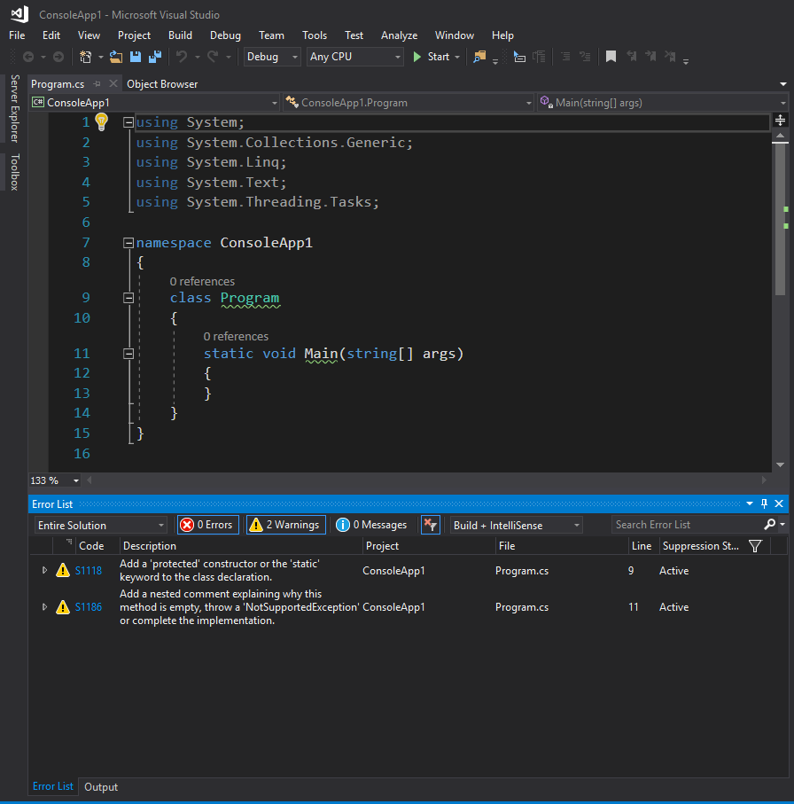

<!--

author:   Sebastian Zug & André Dietrich
email:    zug@ovgu.de   & andre.dietrich@ovgu.de
version:  0.0.1
language: de
narrator: Deutsch Female

import: https://raw.githubusercontent.com/LiaTemplates/Rextester/master/README.md
import: https://raw.githubusercontent.com/LiaTemplates/WebDev/master/README.md
-->

# Vorlesung Softwareentwicklung - 13 - Testen, Unittest

--------------------------------------------------------------------
Link auf die aktuelle Vorlesung im Versionsmanagementsystem GitHub

https://github.com/liaScript/CsharpCourse/blob/master/13_Testen.md

Die interaktive Form ist unter diese Link zu finden ->
[LiaScript Vorlesung 13](https://liascript.github.io/course/?https://raw.githubusercontent.com/liaScript/CsharpCourse/master/13_Testen.md#1)

---------------------------------------------------------------------

**Wie weit sind wir schon gekommen?**

c# Schlüsselwörter:

| abstract    | as       | base     |`bool`      |`break`     |`byte`     |
|`case`       |`catch`   | char     |`checked`   |`class`     | const     |
|`continue`   |`decimal` | default  | delegate   |`do`        |`double`   |
|`else`       |`enum`    | event    | explicit   | extern     |`false`    |
|`finally`    | fixed    |`float`   |`for`       |`foreach`   |`goto`     |
|`if`         | implicit | in       |`int`       | interface  |`internal` |
| is          | lock     |`long`    |`namespace` |`new`       | null      |
| object      | operator |`out`     | override   |`params`    |`private`  |
| protected   |`public`  | readonly |`ref`       |`return`    |`sbyte`    |
| sealed      |`short`   | sizeof   | stackalloc |`static`    |`string`   |
|`struct`     |`switch`  |`this`    |`throw`     |`true`      |`try`      |
| typeof      |`uint`    |`ulong`   |`unchecked` | unsafe     |`ushort`   |
|`using`      | virtual  |`void`    | volatile   |`while`     |           |


Auf die Auführung der kontextabhängigen Schlüsselwörter wie `where` oder
`ascending` wurde hier verzichtet.

---

## Kontrollfragen

*1. Hier stehen jetzt Ihre Fragen ...*

---------------------------------------------------------------------

## 1. Softwarefehler


                                    {{0-1}}
*******************************************************************************

Bekannte Softwarefehler und deren Folgen:

+ Beim Kampfflugzeug F-16 brachte der Autopilot das Flugzeug in Rückenlage, wenn der Äquator überflogen wurde. Dies kam daher, dass man keine „negativen“ Breitengrade als Eingabedaten bedacht hatte. Dieser Fehler wurde sehr spät während der Entwicklung der F-16 anhand eines Simulators entdeckt und beseitigt.

+ 1999 verpasste die NASA-Sonde Mars Climate Orbiter den Landeanflug auf den Mars, weil die Programmierer unterschiedliche Maßsysteme verwendeten (ein Team verwendete das metrische und das andere das angloamerikanische) und beim Datenaustausch es so zu falschen Berechnungen kam. Eine Software wurde so programmiert, dass sie sich nicht an die vereinbarte Schnittstelle hielt, in der die metrische Einheit Newton × Sekunde festgelegt war. Die NASA verlor dadurch die Sonde

+ Zwischen 1985 und 1987 gab es mehrere Unfälle[8] mit dem medizinischen Bestrahlungsgerät Therac-25. Infolge einer Überdosis, die durch fehlerhafte Programmierung und fehlende Sicherungsmaßnahmen verursacht wurde, mussten Organe entfernt werden, und es verstarben drei Patienten.

+ Das Jahr-2000-Problem, auch als Millennium-Bug (zu deutsch „Millennium-Fehler“) oder Y2K-Bug bezeichnet, ist ein Computer­problem, das im Wesentlichen durch die Behandlung von Jahreszahlen als zweistellige Angabe innerhalb von Computersystemen entstanden ist.


Softwarefehler sind sowohl Sicherheitstechnisch wie ökonomisch ein erhebliches Risiko. Die IX-Studie ermittelte für Deutschland folgende Werte:

+ Ca. 84,4 Mrd. Euro betragen die jährlichen Verluste durch Softwarefehler in Mittelstands- und Großunternehmen
+ Ca. 14,4 Mrd. Euro jährlich (35,9 % des IT-Budgets) werden für die Beseitigung von Programmfehlern verwendet;
+ Ca. 70 Mrd. Euro betragen die Produktivitätsverluste durch Computerausfälle aufgrund fehlerhafter Software

*******************************************************************************


                                    {{1-2}}
*******************************************************************************

**Was sind Softwarefehler eigentlich?**

Ein Programm- oder Softwarefehler ist, angelehnt an die allgemeine Definition für „Fehler“

> „Nichterfüllung einer Anforderung“ [EN ISO 9000:2005]

Konkret definiert sich der Fehler danach als

>  „Abweichung des IST (beobachtete, ermittelte, berechnete Zustände oder Vorgänge) vom SOLL (festgelegte, korrekte Zustände und Vorgänge), wenn sie die vordefinierte Toleranzgrenze [die auch 0 sein kann] überschreitet.“

Im Rahmen dieser Veranstaltung lassen wir Lexikalische Fehler und Syntaxfehler außen vor. Diese sind in der Regel über den Compiler identifizierbar. Darüber hinaus existieren aber :

| Semantische Fehler      | Anweisung ist zwar syntaktisch fehlerfrei, aber inhaltlich trotzdem fehlerhaft                                                 |
| Logische Fehler         | Algorithmus weißt inhaltliche Fehler auf (plus stat minus, kleiner statt kleiner gleich, fehlende Synchronisation, usw.)       |
| Designfehler            | Strukturelle Mängel auf der Modul oder Systemebene, die das Zusammenspiel der Komponenten, deren Erweiterung, usw. verhindern. |
| Fehler im Bedienkonzept | Unintuitive Benutztung, das Programm "fühlt sich komisch an"                                                                   |

*******************************************************************************

                                    {{2-3}}
*******************************************************************************

**Wann entstehen Fehler im Projekt?**

Problem- und Systemanalyse:

+ Die Anforderungen und Qualitätsmerkmale werden nicht festgelegt.
+ Es fehlen eindeutige Begriffsdefinitionen.

Systementwurf:

+ Die Systemarchitektur ist gar nicht oder nur mit großem Aufwand erweiterbar.
+ Das System ist nicht modular aufgebaut, die Daten sind nicht gekapselt.

Feinentwurf:

+ Schnittstellen sind nicht hinreichend spezifiziert
+ Interaktionsmodelle weisen Lücken auf

Codierung

+ Programmier-Standards bzw. -Richtlinien werden nicht beachtet.
+ Die Namensvergabe ist ungünstig.

Betrieb und Wartung:

+ Die Dokumentation fehlt ganz, ist veraltet oder nicht adäquat.
+ Die Schulung der Anwender wird vernachlässigt.
+ Das Konfigurationsmanagement ist unzureichend.

<!--
style="width: 100%; max-width: 560px; display: block; margin-left: auto; margin-right: auto;"
-->
````````````

          ^
 Fehler-  | +---------+         
 kosten   | |         |         
          | |         |      
          | |         |      
          | |         |                    
          | |         +----------+     
          | |         |          |        
          | |         |          +----------+         
          | |         |          |          +----------+         
          | |         |          |          |          +---------+
          | | Analyse | System-  | Imple-   | Integra- | Betrieb |
          | |         | entwurf  | mentier- | tion &   | und     |
          | |         |          | ung      | Tests    | Wartung |
          ----------------------------------------------------------->
                                              Software Lebenszyklus


````````````

*******************************************************************************

## 2. Testen als Teil der Qualitätssicherung


                                    {{0-1}}
*******************************************************************************

**Welche Tests werden in das Projekt integriert?**

<!--
style="width: 100%; max-width: 560px; display: block; margin-left: auto; margin-right: auto;"
-->
````````````

         +------------------------------------------------------>   Zeit
         |
         |      Analyse                             Abnahmetest       KUNDE
         |          \                                   ^
         |           v                                 /          -.
         |        Grobentwurf                   Systemtests        |
         |             \                             ^             |
         |              v                           /              |
         |           Feinentwurf             Integrationstests     \  ENTWICKLER
 Detail- |                \                       ^                /
 grad    |                 v                     /                 |
         |             Implementierung  --> Modultests             |
         |                                                        -'
         v    
````````````

Der Modultest, auch Komponententest oder Unittest genannt, ist ein Test auf der Ebene der einzelnen Module der Software. Testgegenstand ist die Funktionalität innerhalb einzelner abgrenzbarer Teile der Software (Module, Programme oder Unterprogramme, Units oder Klassen). Testziel dieser häufig durch den Softwareentwickler selbst durchgeführten Tests ist der Nachweis der technischen Lauffähigkeit und korrekter fachlicher (Teil-) Ergebnisse.
Integrationstest

Der Integrationstest bzw. Interaktionstest testet die Zusammenarbeit voneinander abhängiger Komponenten. Der Testschwerpunkt liegt auf den Schnittstellen der beteiligten Komponenten und soll korrekte Ergebnisse über komplette Abläufe hinweg nachweisen.
Systemtest

Der Systemtest ist die Teststufe, bei der das gesamte System gegen die gesamten Anforderungen (funktionale und nicht-funktionale Anforderungen) getestet wird. Gewöhnlich findet der Test auf einer Testumgebung statt und wird mit Testdaten durchgeführt. Die Testumgebung soll die Produktivumgebung des Kunden simulieren, d. h. ihr möglichst ähnlich sein. In der Regel wird der Systemtest durch die realisierende Organisation durchgeführt.
Abnahmetest

Ein Abnahmetest, Verfahrenstest, Akzeptanztest oder auch User Acceptance Test (UAT) ist das Testen der gelieferten Software durch den Kunden. Der erfolgreiche Abschluss dieser Teststufe ist meist Voraussetzung für die rechtswirksame Übernahme der Software und deren Bezahlung. Dieser Test kann unter Umständen (z. B. bei neuen Anwendungen) bereits auf der Produktionsumgebung mit Kopien aus Echtdaten durchgeführt werden.

*******************************************************************************

                                            {{1-2}}
*******************************************************************************

**Warum geht es dann trotzdem schief?**

+ Es ist angeblich keine Zeit für systematische Tests vorhanden (Termindruck).
+ Die Notwendigkeit für systematische Tests wird nicht erkannt.
+ Die Tests werden manuell realisiert.
+ Die Erstellung von Testspezifikationen für systematische Tests wird nicht entwicklungsbegleitend durchgeführt.
+ Die Testebenen weisen eine unterschiedliche Realisierung auf (Modultests top, Systemtests flop)

*******************************************************************************

### Definition

Es gibt unterschiedliche Definitionen für den Softwaretest:

> „the process of operating a system or component under specified conditions, observing or recording the results and making an evaluation of some aspects of the system or component.“ [ANSI/IEEE Std. 610.12-1990 ]


> „Test […] der überprüfbare und jederzeit wiederholbare Nachweis der Korrektheit eines Softwarebausteines relativ zu vorher festgelegten Anforderungen“ ist. [Denert]


> "Unter Testen versteht man den Prozess des Planens, der Vorbereitung und der Messung, mit dem Ziel, die Eigenschaften eines IT-Systems festzustellen und den Unterschied zwischen dem tatsächlichen und dem erforderlichen Zustand aufzuzeigen. [Pol]

Welche Unterschiede sehen Sie?

### Ablauf beim Testen

<!--
style="width: 100%; max-width: 560px; display: block; margin-left: auto; margin-right: auto;"
-->
````````````
                   +------------------------------------------------+
                   |                                                |
             +-----+-----+      +-----------+      +------------+   |    +------------+
          +->| Testfälle |-+ +->| Testdaten |-+ +->| Ergebnisse |-+ | +->| Protokolle |
          |  +-----------+ | |  +-----------+ | |  +------------+ | | |  +------------+
          |                | |                | |                 | | |                 
          |                | |                | |                 | | |                 
          |                | |                | |                 | | |                 
          |                v |                v |                 v v |               
  .---------------.  .---------------.  .--------------.  .---------------.           
  | Entwerfen der |->| Erstellen der |->| Testaus-     |->| Vergleich der |      
  | Testfälle     |  | Testdaten     |  | führung      |  | Ergebnisse    |         
  .---------------.  .---------------.  .--------------.  .---------------.      

````````````
[Somm01]

### Klassifikation Testmethoden

<!--
style="width: 100%; display: block; margin-left: auto; margin-right: auto;"
-->
````````````
                            Prüfmethoden                                     
                                  |                                         
                +-----------------+------------------+                   
                |                                    |              
            statisch                              dynamisch           
                |                                    |
    +-----------+----+              +----------------+----------------+
    |                |              |                |                |
  verifi-         analy-         struktur-     spezifikations-    diversifi-
  zierend         sierend        orientiert    orientiert         zierend
                                    |                               
                            +-------+--------+
                            |                |
                      kontrollfluss-     datenfluss-
                      orientiert         bezogen        


````````````
[nach Liggesmeyer02]

**Statische Code Analysen**

Statische Code-Analyse ist ein statisches
Software-Testverfahren, das zur Übersetzungszeit durchgeführt wird. Der
Quelltext wird hierbei einer Reihe formaler Prüfungen unterzogen, bei denen
bestimmte Sorten von Fehlern entdeckt werden können, noch bevor die
entsprechende Software (z. B. im Modultest) ausgeführt wird. Die Methodik gehört
zu den falsifizierenden Verfahren, d. h., es wird die Anwesenheit von Fehlern
bestimmt.

+ **Codeanalyse** ... In Anlehnung an das klassische Programm Lint wird der Vorgang der Analyse eines Codefragments auch als linten  (englisch linting) bezeichnet.

    Das folgende Beispiel zeigt die Ausgabe des Tools SonarLinter angewendet auf die
    initiale Implementierung einer Konsolenanwendung unter Visual Studio 2017. Welche
    Fehler können Sie ausmachen?

<!-- width="100%" -->

+ Codereviews ... Reviews sind manuelle Überprüfungen der Arbeitsergebnisse der Softwareentwicklung. Jedes Arbeitsergebnis kann einer Durchsicht durch eine andere Person unterzogen werden.

    Der untersuchte Gegenstand eines Reviews kann verschieden sein. Es wird vor
    allem zwischen einem Code-Review (Quelltext) und einem Architektur-Review
    (Softwarearchitektur, insbesondere Design-Dokumente) unterschieden.

**Dynamische Code Analysen**

Dynamische Software-Testverfahren sind bestimmte Prüfmethoden, um mit
Softwaretests Fehler in der Software aufzudecken. Besonders sollen
Programmfehler erkannt werden, die in Abhängigkeit von dynamischen
Laufzeitparametern auftreten, wie variierende Eingabeparameter, Laufzeitumgebung
oder Nutzer-Interaktion.
Wesentliche Aufgabe der einzelnen Verfahren ist die Bestimmung geeigneter Testfälle für den Test der Software.

+ strukturorientiert ... Strukturorientierte Verfahren bestimmen Testfälle auf Basis des Softwarequellcodes (Whiteboxtest). Dabei steht entweder die enthaltenen Daten oder aber die Kontrollstruktur, die die Verarbeitung der Daten steuert, im Fokus.

+ spezifikationsorientiert ...  die sogenannten Black-Box Verfahren werden zum Abgleich des vorgegebenen, spezifizierten und des realen Verhaltens einer Methode genutzt. Beim Modultest wird z. B. gegen die Modulspezifikation getestet, beim Schnittstellentest gegen die Schnittstellenspezifikation und beim Abnahmetest gegen die fachlichen Anforderungen, wie sie etwa in einem Pflichtenheft niedergelegt sind.

+ diversifizierend .. Diese Tests analysieren die Ergebnisse verschiedener Versionen einer Software gegeneinander. Es findet entsprechend kein Vergleich zwischen den Testergebnissen und der Spezifikation statt! Zudem kann im Gegensatz zu den funktions- und strukturorientierten Testmethoden kein Vollständigkeitskriterium definiert werden. Die notwendigen Testdaten werden mittels einer der anderen Techniken, per Zufall oder Aufzeichnung einer Benutzer-Session erstellt.

## 3. Planung von Tests

Im folgenden sollen unterschiedliche Black- und White-Box-Tests angewandt werden
um eine Klasse MyMathFunctions, die zwei Methoden implementiert, zu testen:

```csharp
static class MyMathFunctions{
  //Fakultät der Zahl i
  public int fak(int i) {...}
  // Grösstergemeinsamer Teiler von i, j und k
  public int ggt(inti, intj, intk) {...}
}
```

Ein vollständiges Testen aller `int` Werte ($2^{31}$ bis $2^{31}-1$) bedeutet für die Funktion
`fak()` $2^{32}$ und für `ggt()` $2^{32} \cdot 2^{32} \cdot 2^{32}$ Kombinationen. Testen aller möglichen Eingaben ist damit nicht möglich. Für Variablen mit unbestimmtem Wertebereich (`string`) lässt sich nicht einmal die Menge der möglichen Kombinationen darstellen.

### Black-Box-Testing / Spezifikationsorientiert

> Black-Box-Testing ... Grundlage der Testfallentwicklung ist die Spezifikation
> des Moduls. Die Interna des Softwareelements sind nicht bekannt.

Die Güte der Testfälle ist definiert über die Abdeckung möglicher Kombinationen
der Eingangsparameter.

Für Black-Box-Testing existieren unterschiedliche Ausprägungen:

+ Äquivalenzklassenanalyse [Link](https://de.wikipedia.org/wiki/%C3%84quivalenzklassentest)
+ Grenzwertanalyse [Link](https://www.youtube.com/watch?v=GshMbff3mzw)
+ Ursache Wirkungsgraphen
+ Zustandsbasierte Testmethoden

Problematisch ist dabei, dass spezifische Lösungen, wie zum Beispiel in folgendem Fall

```csharp
static class MyMathFunctions{
  public int fak (int i){
    if ( i==1 ) return 0;
    elseif (i == 2) return 1;
    elseif  ... Ergebnisse für 3 und 4 ...
    elseif (i == 5) return 120;
    else return i * fak(i-1);  
  }
}
```

mit Testfällen `fak(5)==120`, `fak(6)==720` und `fak(10)==3628800` verborgen
bleiben. Die Fehler für `fak(1)` und `fak(2)` bleiben verborgen.

### White-Box-Testing / Strukturorientiert

> White-Box-Testing ... beim „quelltextbasierten Testen“ sind die Interna des
> getesteten Softwareelements bekannt und werden zur Bestimmung der Testfälle
> verwendet

White-Box-Testing-Verfahrend zerlegen das Programm (statisch oder dynamisch)
entsprechend dem Kontrollfluß. Die Güte der Testfälle wird danach beurteilt,
wie groß der Anteil der abgedeckten Programmpfade ist. Die Bewertung kann dabei
anhand differenzierter Metriken erfolgen:

+ Zeilenabdeckung
+ Anweisungsüberdeckung
+ Zweigüberdeckung
+ Pfadüberdeckung
+ ...

**C_0 Anweisungsüberdeckung**

Anweisungsüberdeckung (auch $C_0$-Test genannt) zerlegt das Programm statisch in
seine Anweisungen und bestimmt den Anteil der in den Testfällen berücksichtigten
Anweisungen. Üblich ist eine Prüfung von 95%-100% aller Anweisungen durch als
$C-0$-Kriterium anzustreben:

$$
C_0 = \frac{Anzahl überdeckte Anzahl}{Gesamtanzahl der Anweisungen}
$$

```csharp
static class MyMathFunctions{
  public int fak (int i){                    // Anweisung
    if ( i==1 ) return 0;                    // 1
    elseif (i == 2) return 1;                // 2
    elseif  ... Ergebnisse für 3 und 4 ...   // 3 - 4
    elseif (i == 5) return 120;              // 5
    else return i * fak(i-1);                // 6
  }
}
```

Der oben genannten Black-Box-Test $i = {5, 6, 10}$ adressierte lediglich 2
der Anweisungen und generiert damit ein $C_0 = \frac{2}{6} = 0.33$. Mit dem Wissen
um die Codestruktur, kann der White-Box-Test sehr schnell den Nachweis erbringen,
dass das gezeigte Black-Box-Vorgehen nur unzureichend die Qualität des Codes
abprüft.

```csharp
static class MyMathFunctions{
  public int fak (int i){                    // Anweisung
    int [] facArray = new int [10];          // 1
    facArray[0] = 1;                         // 2
    facArray[1] = 1;        
    ...
    facArray[9] = 1;                         // 9
    // besser:
    // int [] facArray = new int[] { 1, 3, 5, 7, 9 };
    if ( i<10 ) return fakArray[i];          // 10 + 11
    else return i * fak(i-1);                // 12
  }
}
```

Mit dem Testfall $i = 1$ lassen sich hingegen vermeindlich $11/12 = 0.91$ der
Anweisungen abdecken, die Fehleinschätzung ist aber offensichtlich. Gleichwohl
sind die fest hinterlegten Werte aus Erfahrung heraus auch besonders anfällig
für Copy-&-Paste-Fehler.

**C_1 Zweigüberdeckungstest**

Der Zweigüberdeckungstest  umfasst den
Anweisungsüberdeckungstest vollständig. Für den C1–Test müssen strengere
Kriterien erfüllt werden als beim Anweisungsüberdeckungstest. Im Bereich des
kontrollflussorientierten Testens wird der Zweigüberdeckungstest als
Minimalkriterium angewendet. Mit Hilfe des Zweigüberdeckungstests lassen sich
nicht ausführbare Programmzweige aufspüren. Anhand dessen kann man dann
Softwareteile, die oft durchlaufen werden, gezielt optimieren.

Die [Zyklomatische Komplexität](https://de.wikipedia.org/wiki/McCabe-Metrik) gibt an, wie viele Testfälle höchstens nötig sind, um eine Zweigüberdeckung zu erreichen.

$$
C_1 = \frac{Anzahl überdeckten Zweige}{Gesamtanzahl der Zweige}
$$

```csharp
static class MyMathFunctions{
  public int fak (int i){                    // Verzweigungen
    int [] facArray = new int [10];          //
    facArray[0] = 1;                         //
    facArray[1] = 1;        
    ...
    facArray[9] = 1;                         //
    // besser:
    // int [] facArray = new int[] { 1, 3, 5, 7, 9 };
    if ( i<10 ) return fakArray[i];          // 1. Verzweigung
    else return i * fak(i-1);                //
  }
}
```

Mit dem Testfall $i = 1$ ergibt sich eine $C_1$-Abdeckung von $0.5$.

**C_2 Pfadüberdeckung**

Das $C_1$ Kriterium berücksichtigt keine Schleifen im zu untersuchenden Code.
Der "Pfad" beschreibt gegenüber dem "Zweig" aber eben auch die mehrfache
Ausfühung ein und des selben Zweiges. Diese Untersuchung muss entsprechend  
Schleifen in variabler Durchlaufzahl umsetzten.

**C_3 Bedingungsüberdeckungstest**

$C_3$ Tests extrahieren die Bedingungen die zum Eintritt in die Schleifen führen
und generieren Testfälle, die alle Kombinationen abdecken.

## 4. Und jetzt konkret!

Idee 1: Wir implementieren unsere eigenen Testmethoden.

```csharp          ManuellesTesten
using System;

namespace Rextester
{
  // Zu testende Klasse
  public class Calculator
  {  
    public static int DivideTwoValues(double x, double y, ref double result){
      if (y != 0){
        result = x / y;
        return 0;
      }
      else return -1;
    }
  }

  // Testklasse
  public class TestCalculator{
    public static void Test_DivideMethod(){
      double result = 0;
      int state = Calculator.DivideTwoValues(3,4, ref result);
      if ((state == 0) & (result == 0.75))
      {
        Console.WriteLine("Test bestanden !");
      }
      else{
        Console.WriteLine("Test fehlgeschlagen");
      }
    }
  }

  // Anwendungsprogramm
  public class Program
  {  
    public static void Main(string[] args)
    {
      //double result = 0;
      //int state = Calculator.DivideTwoValues(3,4, ref result);
      //Console.WriteLine(state);

      TestCalculator.Test_DivideMethod();
    }
  }
}
```
@Rextester.eval(@CSharp)

Welche Funktionalität fehlt Ihnen in diesem Setup? Welche weitergehenden Features
würden Sie für unsere Testmethoden vorschlagen.


Idee 2: Wir nutzen ein Test-Framework

```csharp    TestCase MStest
[TestClass]   // <-- Framework specifisch
public class CalculatorTests
{
    [TestMethod]   // <-- Framework specifisch
    public void TestMethod1()
    {
        // Arrange
        double result;
        double x = 3, y = 4;
        int state;
        double expected = 0.75;

        // Act
        int state = Calculator.DivideTwoValues(x, y, ref result);

        // Assert
        Assert.AreEqual(result, expected);
        //       ^---- Framework specifisch
    }
}
```

Vorteile:

+ Leistungsfähige API (automatisierte Tests, variable Input-Parameter, Berücksichtigung von Exceptions)
+ "Standardisiertes" Nutzungskonzept
+ Integration in die Entwicklungsumgebungen

Nachteil:

+ verschiedene Interpretationen und Performance der Frameworks

Die wichtigsten Tools unter C# sind xUnit, nunit, MSTest. Einen guten Überblick zum Vergleich der Schlüsselworte liefert [Link](http://www.anarsolutions.com/automated-unit-testing-tools-comparison/)

> Demo zur Anwendung des Testing-Frameworks unter Visual Studio


## Anhang

**Referenzen**

[Somm01]  Ian Sommerville: Software Engineering, Pearson Education, 6. Auflage, 2001

[Denert]  Ernst Denert: Software-Engineering. Methodische Projektabwicklung. Springer, Berlin u. a. 1991, ISBN 3-540-53404-0.

[Pol] Martin Pol, Tim Koomen, Andreas Spillner: Management und Optimierung des Testprozesses. Ein praktischer Leitfaden für erfolgreiches Testen von Software mit TPI und TMap. 2., aktualisierte Auflage. dpunkt.Verlag, Heidelberg 2002, ISBN 3-89864-156-2.

[Liggesmeyer] Peter Liggesmeyer, "Software-Qualität - Testen, Analysieren und Verifizieren von Software", Springer, 2002

**Autoren**

Sebastian Zug, André Dietrich
