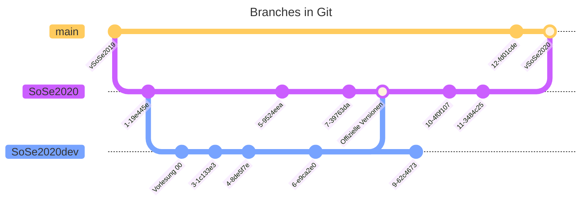
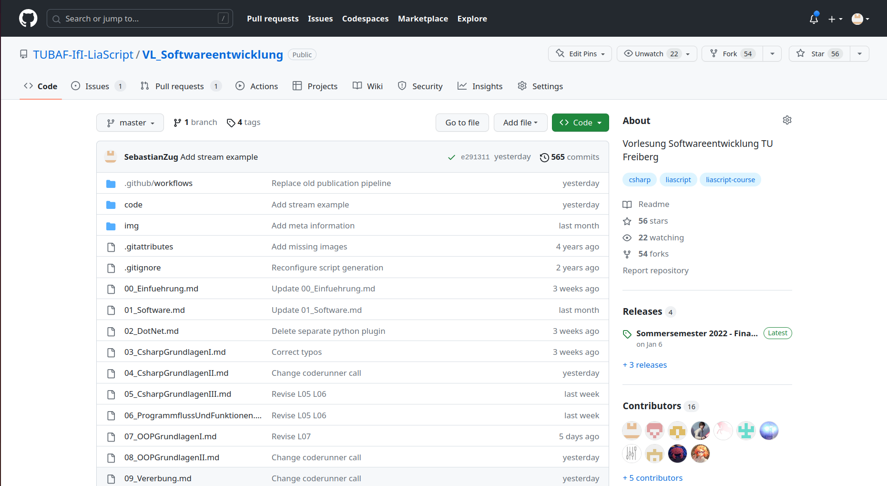
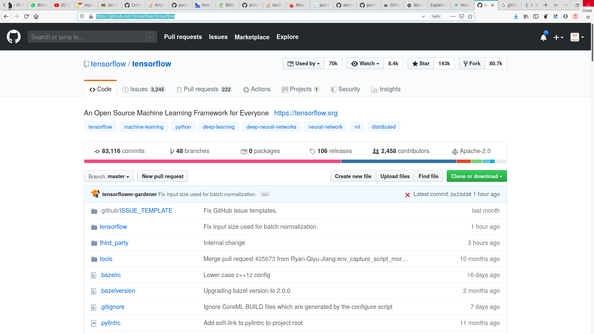

<!--

author:   Sebastian Zug, Galina Rudolf, Volker Göhler, André Dietrich & `Lesestein`
email:    sebastian.zug@informatik.tu-freiberg.de
version:  1.0.4
language: de
narrator: Deutsch Female
comment:  Versionsverwaltung mit Git und GitHub, Automatisierung von Arbeitsabläufen auf dem Versionsserver
tags:      
logo:     

import: https://github.com/liascript/CodeRunner
        https://raw.githubusercontent.com/liascript-templates/plantUML/master/README.md
        https://raw.githubusercontent.com/liaTemplates/ExplainGit/master/README.md
        https://raw.githubusercontent.com/liaScript/mermaid_template/master/README.md

import: https://raw.githubusercontent.com/TUBAF-IfI-LiaScript/VL_Softwareentwicklung/master/config.md

-->

[](https://liascript.github.io/course/?https://github.com/TUBAF-IfI-LiaScript/VL_Softwareentwicklung/blob/master/13_VersionsverwaltungII.md)

# Versionsverwaltung II

| Parameter                | Kursinformationen                                                                                    |
| ------------------------ | ---------------------------------------------------------------------------------------------------- |
| **Veranstaltung:**       | `Vorlesung Softwareentwicklung`                                                                      |
| **Teil:**                | `13/27`                                                                                               |
| **Semester**             | @config.semester                                                                                     |
| **Hochschule:**          | @config.university                                                                                   |
| **Inhalte:**             | @comment                                                                                             |
| **Link auf den GitHub:** | https://github.com/TUBAF-IfI-LiaScript/VL_Softwareentwicklung/blob/master/13_VersionsverwaltungII.md |
| **Autoren**              | @author                                                                                              |


---------------------------------------------------------------------

## Arbeiten mit Branches

Die Organisation von Versionen in unterschiedlichen Branches ist ein zentrales
Element der Arbeit mit git. Branches sind Verzweigungen des Codes, die bestimmte
Entwicklungsziele kapseln.

Der größte Nachteil bei der Arbeit mit nur einem Branch liegt darin, dass bei einem
defekten Master(-Branch) die Arbeit sämtlicher Beteiligter unterbrochen wird. Branches
schaffen einen eignen (temporären) Raum für die Entwicklung neuer Features, ohne
die Stabilität des Gesamtsystems zu gefährden. Gleichzeitig haben die Entwickler den gesamten Verlauf eines Projekts in strukturierter Art zur Hand.

Wie sieht das zum Beispiel für unsere Kursmaterialien aus?




Ein Branch in Git ist einfach ein Zeiger auf einen Commit zeigt. Der zentrale Branch wird zumeist als `master`/`main` bezeichnet.

### Generieren und Navigation über Branches

Ein Branch ist technisch gesehen lediglich ein **Zeiger auf einen Commit**. Das macht Branches in Git extrem leichtgewichtig — anders als bei älteren Systemen wird *keine* Kopie der Dateien angelegt.

Die zentralen Befehle:

| Befehl                          | Wirkung                                                              |
| ------------------------------- | -------------------------------------------------------------------- |
| `git branch`                    | Listet alle lokalen Branches auf, markiert den aktiven mit `*`       |
| `git branch <name>`             | Legt einen neuen Branch an (ohne dorthin zu wechseln)                |
| `git switch <name>`             | Wechselt auf einen existierenden Branch (seit Git 2.23 empfohlen)    |
| `git switch -c <name>`          | Legt einen neuen Branch an und wechselt direkt dorthin               |
| `git branch -d <name>`          | Löscht einen Branch (nur wenn gemerged)                              |
| `git branch -D <name>`          | Erzwingt das Löschen — Vorsicht!                                     |

> **Hinweis:** Die früher verbreiteten Befehle `git checkout <branch>` bzw. `git checkout -b <branch>` funktionieren weiterhin, vermischen aber das Wechseln zwischen Branches mit dem Wiederherstellen einzelner Dateien. Die neueren Befehle `git switch` und `git restore` trennen diese Aufgaben sauberer.

Probieren wir das interaktiv aus. Wir legen drei Commits auf `master` an, verzweigen dann in einen Feature-Branch und ergänzen dort weitere Versionen:

``` text @ExplainGit.eval
git commit -m V1
git commit -m V2
git branch newFeature
git checkout newFeature
git commit -m FeatureV1
git commit -m FeatureV2
git checkout master
git commit -m V3
```

Beobachten Sie, wie sich die beiden Zweige unabhängig voneinander entwickeln. Der `HEAD`-Zeiger gibt jeweils an, an welcher Position Sie aktuell arbeiten.


### Mergoperationen über Branches
<!--
@@ Hinweis für die Realisierung
    git checkout master
    git branch hotfix
    git checkout hotfix
    git commit -m "Solve bug"
    git checkout master
    git merge hotfix
    You have performed a fast-forward merge.
    git branch -d hotfix
    git checkout newFeature
    git commit -m FeatureV3
    git checkout master
    git merge newFeature
    Beim fast-forward merge gibt es keine nachfolgende Version. Der master wird
    einfach auf den anderen branch verschoben.
    Im zweiten Fall läuft ein 3 Wege Merge ab
-->
Nehmen wir folgendes Scenario an. Sie arbeiten an einem Issue, dafür haben Sie
einen separaten Branch (newFeature) erzeugt und haben bereits einige Commits
realisiert. Beim Kaffeetrinken denken Sie über den Code von letzter Woche nach und Ihnen fällt ein Bug ein, den Sie noch nicht behoben haben. Jetzt aber schnell!

Legen Sie dafür einen neuen Branch an, commiten Sie eine Version und mergen
Sie diese mit dem Master. Kehren Sie dann in den Feature-Branch zurück und
beenden Sie die Arbeit. Mergen Sie auch diesen Branch mit dem Master.
Worin unterscheiden sich beide Vorgänge?

``` text @ExplainGit.eval
git branch newFeature
git checkout newFeature
git commit -m FeatureV1
git commit -m FeatureV2
```

Mergen ist eine nicht-destruktive Operation. Die bestehenden Branches werden auf keine Weise verändert. Das Ganze "bläht" aber den Entwicklungsbaum auf.

### Rebase mit einem Branch

Zum `merge` existiert eine alternative Operation: `rebase`. Während `merge` einen neuen Merge-Commit erzeugt, der zwei Entwicklungsstränge zusammenführt, **schreibt `rebase` die Historie um**: Die Commits eines Branches werden so umgeschrieben, als wären sie nacheinander auf einem anderen Branch entstanden.

```ascii
   Ausgangslage:                Nach 'git rebase master':

   A---B---C  master            A---B---C  master
        \                                  \
         D---E  newFeature                  D'---E'  newFeature
```

Die Commits `D` und `E` werden zu *neuen* Commits `D'` und `E'` — gleicher Inhalt, aber neue Commit-Hashes und neuer Basis-Commit.

``` text @ExplainGit.eval
git branch newFeature
git checkout newFeature
git commit -m FeatureV1
git commit -m FeatureV2
git checkout master
git commit -m V1
```

#### Interaktiver Rebase

Ein mächtiges Werkzeug ist der interaktive Modus mit `git rebase -i HEAD~5`. Damit können Sie Ihre Versionsgeschichte "aufräumen": Commits umbenennen (`reword`), zusammenfassen (`squash`), neu ordnen oder löschen (`drop`):

```console
▶git rebase -i HEAD~5

pick d2a06e4 Update main.yml
squash 78839b0 Reconfigures checkout
pick f70cfc7 Replaces wildcard by specific filename
reword 05b76f3 New pandoc command line
drop c56a779 Corrects md filename

# Commands:
# p, pick    = use commit
# r, reword  = use commit, but edit the commit message
# s, squash  = use commit, but meld into previous commit
# f, fixup   = like "squash", but discard this commit's log message
# d, drop    = remove commit
```

#### Warum ist Rebase gefährlich?

> **Achtung:** Wenden Sie `rebase` **niemals auf bereits gepushte Commits an**, an denen andere Personen weiterarbeiten könnten!

Die "fatalen Auswirkungen" sind konkret:

1. **Divergierende Historien:** Weil `rebase` neue Commit-Hashes erzeugt, hat Ihr lokales Repository nach einem Rebase eine *andere* Geschichte als das Remote-Repository. Ein `git push` wird abgelehnt — und ein `git push --force` würde die Commits Ihrer Mitstreiter überschreiben.
2. **Verlorene Arbeit für andere:** Wenn ein Kollege auf einem der "alten" Commits aufgebaut hat, hängt seine Arbeit nach Ihrem Force-Push an einem Commit, der offiziell nicht mehr existiert.
3. **Konflikte pro Commit:** Bei einem `merge` lösen Sie Konflikte *einmal*. Bei einem `rebase` müssen Sie potenziell für *jeden* umgeschriebenen Commit einzeln auflösen.

**Faustregel:** Rebase nur auf lokalen, noch nicht gepushten Branches einsetzen. Auf geteilten Branches (`master`, `main`, `develop`) immer `merge`.

### Am Beispiel

> __Auftrag 2:__ Erweitern Sie das Projekt um eine weitere Funktion, die die Anzahl der Zeilen in der Datei zählt. Nutzen Sie dafür einen eigenen Branch.

## Arbeit mit GitHub


Github integriert einen git-Dienst und stellt darauf aufbauend weitere Werkzeuge bereit.

| Bezeichnung         | Bedeutung                                                             |
| ------------------- | --------------------------------------------------------------------- |
| `Issue`             | Aufgabenbeschreibungen mit zugehörigen Diskussionen                   |
| `Pull-Request` (PR) | Anfrage zum Merge einer eignen Lösung mit der existierenden Codebasis |
| `Review`            | Vorgänge zur Evaluation von Pull-Requests                             |
| `Action`            | Möglichkeit der automatisierten Realisierung von Abläufen             |
| `Project`           | Verwaltungsebene von Aufgabenbeschreibungen                           |

<!-- width="100%" -->

> Softwareprojekte sind soziale Ereignisse - entsprechend integriert Github auch Aspekte zur Vernetzung (`Discussion`), der Anerkennung (`Stars`) und Follow Mechanismen.

> Neben Github existieren weitere Plattformen für das Hosten von Projekten. Eine völlig eigenständige Nutzung ermöglicht die GitLab Community Edition (CE) von GitLab die als Open-Source-Software unter der MIT-Lizenz entwickelt wird.

Lassen Sie uns die Verwendung anhand vdes Open Source Projektes Tensorflow erörtern [https://github.com/tensorflow/tensorflow](https://github.com/tensorflow/tensorflow)

### Issues

Issues dienen dem Sammeln von Benutzer-Feedback, dem Melden von Software-Bugs und der Strukturierung von Aufgaben, die Sie erledigen möchten. Dabei sind Issues umittelbar mit Versionen verknüpft, diese können dem Issue zugeordnet werden.

Sie können eine Pull-Anfrage mit einer Ausgabe verknüpfen, um zu zeigen, dass eine Korrektur in Arbeit ist und um die Ausgabe automatisch zu schließen, wenn jemand die Pull-Anfrage zusammenführt.

Um über die neuesten Kommentare in einer Ausgabe auf dem Laufenden zu bleiben, können Sie eine Ausgabe beobachten, um Benachrichtigungen über die neuesten Kommentare zu erhalten.

https://guides.github.com/features/issues/

> Im Tensorflow Projekt sind aktuell etwa 2000 Issues offen, über 35000 wurden bereits bearbeitet. Eine Menge Koordinationsarbeit ... wie halten wir da Ordnung?

```
If you open a GitHub Issue, here is our policy:

    It must be a bug/performance issue or a feature request or a build issue or a documentation issue (for small doc fixes please send a PR instead).
    Make sure the Issue Template is filled out.
    The issue should be related to the repo it is created in.

Here's why we have this policy: We want to focus on the work that benefits the whole community, e.g., fixing bugs and adding features. Individual support should be sought on Stack Overflow or other non-GitHub channels. It helps us to address bugs and feature requests in a timely manner.
```

1. Als potentieller Mitstreiter - Durchsuchen geht vor Schreiben eines neuen Issues
2. Strukturieren Sie die Meldung von Problemen (ermutigen Sie die Meldenden, spezifisch zu sein)
3. Nutzen Sie Label aber generieren Sie keinen bunten Strauß 
4. Referenzieren Sie die entsprechenden Personen im Issue 
5. Vergessen Sie Issues nicht zu schließen

Das zugehörige Template findet sich unter [https://github.com/tensorflow/tensorflow/blob/master/ISSUE_TEMPLATE.md](https://github.com/tensorflow/tensorflow/blob/master/ISSUE_TEMPLATE.md)

> __Auftrag 3:__ Fügen Sie Ihrem Projekt ein Issue hinzu, dass die Erweiterung der Analyse Funktion um einen Wortzähler vorsieht.

### Pull requests und Reviews

Natürlich wollen wir nicht, dass "jeder" Änderungen ungesehen in unseren Code einspeist. Entsprechend kapseln wir ja auch unseren Master-Branch. Den Zugriff regeln sowohl die Rechte der einzelnen Mitstreiter als auch die
Pull-Request und Review Konfiguration.

| Status des Beitragenden | Einreichen des Codes                                                                                                                                                                                                                              |
| ----------------------- | ------------------------------------------------------------------------------------------------------------------------------------------------------------------------------------------------------------------------------------------------- |
| Collaborator            | Auschecken des aktuellen Repositories und Arbeit. Wenn die Arbeit in einem eigenen Branch erfolgt, wird diese mit einem Pull-Request angezeigt und gemerged.                                                                                      |
| non Collaborator        | Keine Möglichkeit seine Änderungen unmittelbar ins Repository zu schreiben. Der Entwickler erzeugtn eine eigene Remote Kopie (_Fork_) des Repositories und dortige Realsierung der Änderungen.  Danach werden diese als Pull-Request eingereicht. |

Wird ein Pull Request akzeptiert, so spricht man von einem _Merge_, wird er geschlossen, so spricht man von einem _Close_. Vor dem Merge sollte eine gründliche Prüfung sichergestellt werden, diese kann in Teilen automatisch erfolgen oder durch Reviews [Doku](https://github.com/features/code-review/)

> Achtung: Forks sind Kopien bestehender Repositories. Sie ermöglichen die Arbeit in einem eigenen Repo. 

### Automatisierung der Arbeit

Hervorragend! Wir sind nun in der Lage die Entwicklung unseres Codes zu "verwalten". Allerdings sagt noch niemand, dass ein eingereichter Code auch lauffähig ist. Wie können wir aber möglichst schnell realisieren, dass etwas schief geht? Es wäre wünschenswert, dass wir unmittelbar mit den Aktivitäten unserer Entwickler entsprechende Tests durchführen und zum Beispiel deren Commits zurückweisen.

An dieser Stelle wollen wir zunächst die Möglichkeiten des _Continuous Integration_ aufzeigen, die differenzierte Diskussion einer Folge von Build und Test-Schritten folgt später. Wir werden diese Möglichkeit im Rahmen der Übungsaufgaben nutzen, um Ihre Lösungen zu testen.

GitHub stellt dafür die sogenannten _Actions_ zur Verfügung. Dies sind Verarbeitungsketten, die auf verschiedensten Architekturen, Betriebssystemen, Konfigurationen usw. laufen können. Damit haben wir die Möglichkeit einen Quellcode für verschiedene Plattformen zu bauen und zu testen oder eine Dokumentation zu erstellen.

Ein _Workflow_ wird durch vordefinierten _Trigger_ ausgelöst. Dies können das Anlegen einer Datei, ein Commit oder ein Pull Request sein. Danach wird das System konfiguriert und die Folge der Verarbeitungsschritte gestartet.

<!--
style="width: 100%; max-width: 560px; display: block; margin-left: auto; margin-right: auto;"
-->
```ascii
    +------+
    |      |\           +----> Check Syntax
  +-|      +-+          |
  | | File.a |          |               +---> Windows 10   --+
+-| +--------+  Commit  |               |                    |
| | File.b  |  ---------+----> Build ---+---> Ubuntu 18.04 --+
| +---------+           |               |                    |
| File.c   |            |               +---> MacOS ---------+
+----------+            |                                    |
                        +----> Test <------------------------+
                        |
                        +----> Generierung Dokumentation                     .
```

GitHub gliedert diese Punkte in _Workflows_ und _Jobs_ in einer hierachischen Struktur, die über `yaml` Files beschrieben werden. Eine kurze Einführung zur Syntax findet sich unter [Wikipedia](https://de.wikipedia.org/wiki/YAML).

Ein minimales Beispiel zur Veranschaulichung der Struktur:

```yaml   hello.yaml
name: Hello World
on: [push]

jobs:
  greet:
    runs-on: ubuntu-latest
    steps:
      - name: Checkout repository
        uses: actions/checkout@v4
      - name: Show environment
        run: pwd && whoami && ls -la
```

Realistischer wird es bei einem Workflow, der einen .NET-Build kompiliert und Tests ausführt — also genau das, was später Ihre Übungsaufgaben prüft:

```yaml   dotnet-ci.yaml
name: .NET Build and Test
on:
  push:
    branches: [ master ]
  pull_request:
    branches: [ master ]

jobs:
  build:
    runs-on: ubuntu-latest
    steps:
      - name: Checkout repository
        uses: actions/checkout@v4

      - name: Setup .NET
        uses: actions/setup-dotnet@v4
        with:
          dotnet-version: '8.0.x'

      - name: Restore dependencies
        run: dotnet restore

      - name: Build
        run: dotnet build --no-restore --configuration Release

      - name: Run tests
        run: dotnet test --no-build --configuration Release --verbosity normal
```

Beobachten Sie die Struktur: Der Workflow wird durch `push` oder `pull_request` auf `master` ausgelöst, läuft auf einem frischen Ubuntu-Container und durchläuft vier Schritte (Checkout, Setup, Build, Test). Schlägt ein Schritt fehl, bricht der Workflow ab und der zugehörige PR wird in GitHub rot markiert.

Spannend wird die Sache durch die breite Community rund um die Actions. Diese stellt häufig benötigte _Steps_ bereits fertig zur Verfügung — wie hier `actions/checkout` und `actions/setup-dotnet`.

Die Dokumentation zu den GitHub-Actions findet sich unter [https://github.com/features/actions](https://github.com/features/actions). Ein umfangreicheres Beispiel finden Sie in unserem Projektordner im aktuellen Branch `SoSe2020`. Hier werden alle LiaScript-Dateien in ein pdf umgewandelt.

> **Merke** Workflow files müssen unter `.github\workflows\*.yml` abgelegt werden.

> __Auftrag 4:__ Integrieren Sie einen automatischen Lauf Ihres Codes in Ihren Workflow.

## Organisation

Bitte haben Sie immer den spezifischen Kontext Ihres Projektes vor Augen. Üblicherweise legt man am Anfang, bei einem "kleinen Hack" keinen Wert auf formelle Abläufe und Strukturen. Diese sind aber in großen Projekten unablässig.

Ein neues Feature wird in einem Issue beschrieben, in einem eigenen Branch implementiert, mit Commits beschrieben, auf den master branch abgebildet und das Issue mit Referenz auf den commit geschlossen.

Entsprechend ist die Dokumentation in Form der Issues und Commit-Messages der zentrale Schlüssel für die Interaktion im Softwareentwicklerteam. Entsprechend hoch ist Ihre Bedeutung anzusetzen.

### Contribution.md Dateien

Lassen Sie uns die Inhalte einer solchen Datei anhand eines konkreten Beispiels analysieren [https://github.com/tensorflow/tensorflow/blob/master/CONTRIBUTING.md](https://github.com/tensorflow/tensorflow/blob/master/CONTRIBUTING.md)

### Commit Messages


https://cbea.ms/git-commit/

Stöbern Sie dafür mal durch anderen Projekte (zum Beispiel [GitHub Tensorflow](https://github.com/tensorflow/tensorflow)) und informieren Sie sich über deren Policies.

<!-- width="100%" -->

```
Kurze (72 Zeichen oder weniger) Zusammenfassung

Ausführlicherer erklärender Text. Umfassen Sie ihn auf 72 Zeichen. Die Leerzeile
Zeile, die die Zusammenfassung vom Textkörper trennt, ist entscheidend (es sei
denn, Sie lassen den den Textkörper ganz weg).

Schreiben Sie Ihre Commit-Nachricht im Imperativ: "Fix bug" und nicht "Fixed
Fehler" oder "Behebt Fehler". Diese Konvention stimmt mit den Commit-Nachrichten
überein die von Befehlen wie "git merge" und "git revert" erzeugt werden.

Weitere Absätze kommen nach Leerzeilen.

- Aufzählungspunkte sind für eine Liste von Anpassungen in Ordnung.
- ... und noch einer
```
Folgende Regeln sollte man für die Beschreibung eines Commits berücksichtigen:

+ Trennen Sie den Betreff durch eine Leerzeile vom folgenden Text
+ Beschränkt Sie sich bei der Betreffzeile auf maximal 50 Zeichen
+ Beginnen Sie die Betreffzeile mit einem Großbuchstaben
+ Schreiben Sie die Betreffzeile im Imperativ
+ Brechen Sie den Text der Message 72 Zeichen um


> **Merke:** Beschreiben Sie in der Commit-Nachricht das was und warum, aber nicht das wie.

Das _Semantic Versioning_ geht einen Schritt weiter und gibt den Commit-Messages eine feste Satzstruktur, vgl. [entwickler.de](https://entwickler.de/online/development/commit-messages-git-579873267.html)

### Dinge die man nicht tun sollte

Vermeiden Sie es, 

+ ... die Commit-Nachrichten zu ändern, nachdem Sie sie bereits gepusht haben.
+ ... mehrere Änderungen in einem Commit zu mischen.
+ ... überkomplexe Branchstrukturen - wählen Sie ein klar verständliches Modell.
+ ... ungetesteten Code zu pushen oder zu mergen 
+ ... Issues ohne Verantwortlichen zu erstellen
+ ... Commits ohne Issue-Referenz zu erstellen
+ ... Branches "offen" zu lassen 
+ ... 

## Aufgaben

!?[alt-text](https://www.youtube.com/watch?v=SWYqp7iY_Tc)

- [ ] Richten Sie sich für Ihren GitHub-Account einen SSH basierten Zugriff ein (erspart einem das fortwährende Eingeben eines Passwortes).

!?[](https://www.youtube.com/watch?v=snCP3c7wXw0)

- [ ] Sie sollten Ihre erste Einladung für einen GitHub Classroom bereits per OPAL erhalten haben. Ausgehend davon werden Sie aufgefordert sich in Zweierteams zu organisieren und werden dann gemeinsam erste Gehversuche unter git zu unternehmen.
