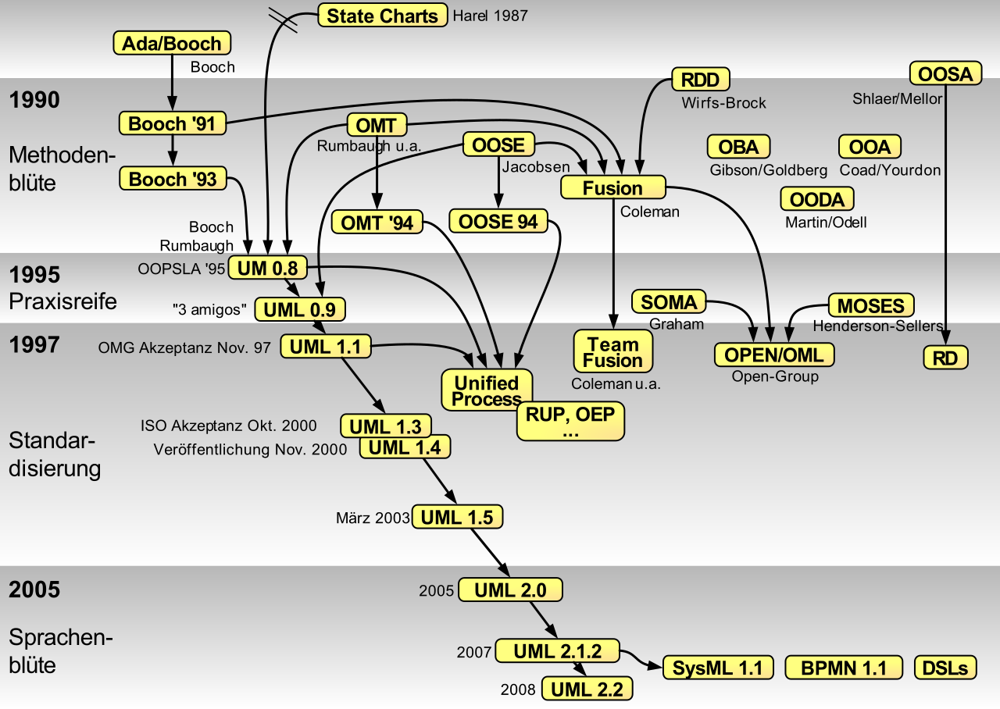
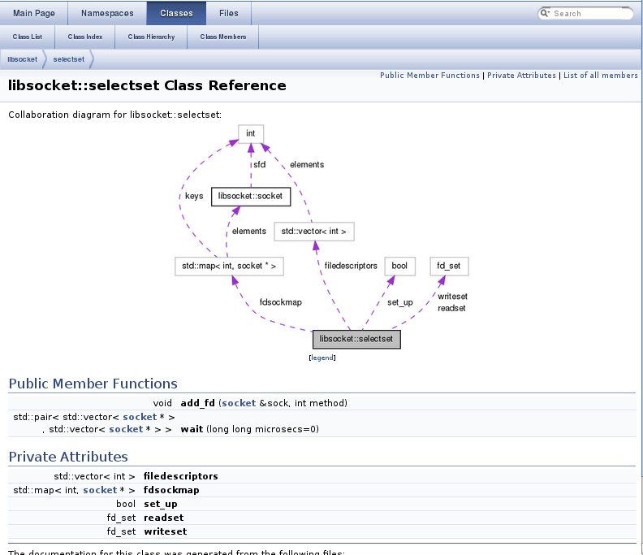
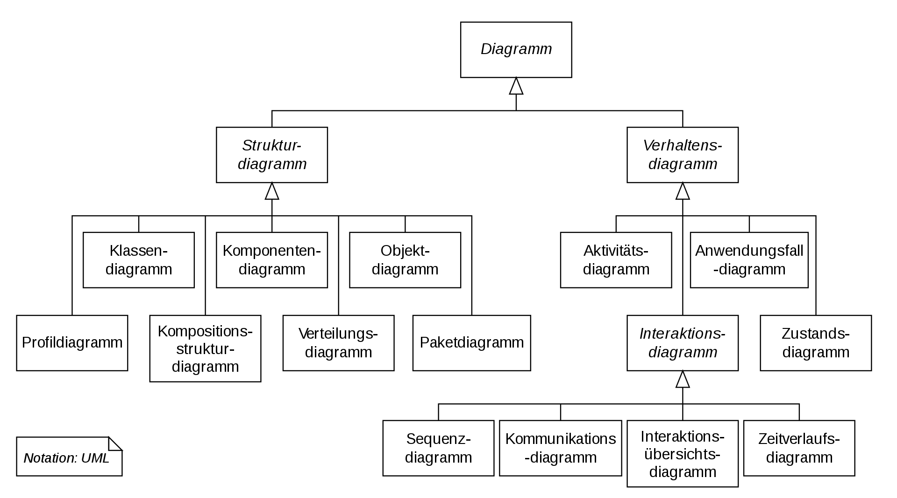

<!--

author:   Sebastian Zug, Galina Rudolf & André Dietrich
email:    sebastian.zug@informatik.tu-freiberg.de
version:  1.0.8
language: de
narrator: Deutsch Female
comment:  Motivation der Modellierung von Software, Anforderungserhebung (Lasten-/Pflichtenheft), V-Modell, OO-Analyse und Design, Unified Modeling Language
tags:      
logo:     
title: Modellierung von Software I

import: https://github.com/liascript/CodeRunner
        https://raw.githubusercontent.com/liascript-templates/plantUML/master/README.md
        https://raw.githubusercontent.com/liaTemplates/ExplainGit/master/README.md

import: https://raw.githubusercontent.com/TUBAF-IfI-LiaScript/VL_Softwareentwicklung/master/config.md

link: https://raw.githubusercontent.com/TUBAF-IfI-LiaScript/VL_Softwareentwicklung/master/css/styles.css

-->

[](https://liascript.github.io/course/?https://github.com/TUBAF-IfI-LiaScript/VL_Softwareentwicklung/blob/master/14_UML_ModellierungI.md)

# Modellierung von Software

| Parameter                | Kursinformationen                                                                                |
| ------------------------ | ------------------------------------------------------------------------------------------------ |
| **Veranstaltung:**       | `Vorlesung Softwareentwicklung`                                                                  |
| **Teil:**                | `14/27`                                                                                           |
| **Semester**             | @config.semester                                                                                 |
| **Hochschule:**          | @config.university                                                                               |
| **Inhalte:**             | @comment                                                                                         |
| **Link auf den GitHub:** | https://github.com/TUBAF-IfI-LiaScript/VL_Softwareentwicklung/blob/master/14_UML_ModellierungI.md |
| **Autoren**              | @author                                                                                          |


---------------------------------------------------------------------

## Motivation des Modellierungsgedankens

> **Motivation:** Warum modellieren wir Software? Warum nicht einfach losprogrammieren? Was sind die Vorteile von Modellen — und was sind die Risiken?

### Modellierung aus der Codeperspektive


               {{0-1}}
************************************************

```python   ugly_version.py
class Report:
    def __init__(self, title, content):
        self.title = title
        self.content = content

    def generate_report(self):
        return f"Report: {self.title}\n{self.content}"

    def save_to_file(self, filename):
        with open(filename, 'w') as f:
            f.write(self.generate_report())

    def send_via_email(self, email_address):
        print(f"Sending report to {email_address}...")
        # (Hier würde tatsächliche E-Mail-Logik stehen)


# Verwendung
report = Report("Monatsbericht", "Umsatz ist gestiegen.")
report.save_to_file("bericht.txt")
report.send_via_email("chef@firma.de")
```

> Was gefällt Ihnen nicht an diesem Code?

************************************************

            {{1-2}}
************************************************

<section class="flex-container">

<div class="flex-child" style="min-width: 300px">

> Besser! Aber was genau ist jetzt besser ... und wie kann ich bei einem größeren Projekt den Überblick behalten? Hier kommt die **Modellierung** ins Spiel: Sie hilft uns, die Struktur und die Beziehungen in unserem Code zu visualisieren — und damit schneller zu verstehen, was wo passiert.

```python   improved_version.py
from abc import ABC, abstractmethod

# ----- Domänenmodell -----
class Report:
    def __init__(self, title, content):
        self.title = title
        self.content = content

    def generate(self):
        return f"Report: {self.title}\n{self.content}"


# ----- Abstrakte Klassen -----
class ReportSaver(ABC):
    def __init__(self, target: str):
        self.target = target

    @abstractmethod
    def save(self, report: Report):
        pass


class ReportSender(ABC):
    def __init__(self, target: str):
        self.target = target

    @abstractmethod
    def send(self, report: Report):
        pass


# ----- Implementierungen -----
class FileSaver(ReportSaver):
    def save(self, report: Report):
        with open(self.target, 'w') as f:
            f.write(report.generate())
        print(f"Report saved to {self.target}")


class EmailSender(ReportSender):
    def send(self, report: Report):
        print(f"Sending report to {self.target}...")
        print(report.generate())


if __name__ == "__main__":
    report = Report("Monatsbericht", "Umsatz ist gestiegen.")
    
    saver = FileSaver("bericht.txt")
    saver.save(report)

    sender = EmailSender("chef@firma.de")
    sender.send(report)
```

</div>

<div class="flex-child" style="min-width: 300px">

> Wir stellen die Relationen im Code grafisch dar und haben damit die Möglichkeit die "Architektur" unseres Codes zu verstehen. In diesem Fall haben wir drei Klassen: `Report`, `ReportSaver` und `ReportSender`. `ReportSaver` und `ReportSender` sind abstrakte Klassen, die von `FileSaver` und `EmailSender` implementiert werden.

```text @plantUML
@startuml

' ===== Abstrakte Basisklassen =====
abstract class ReportSaver {
    - target: str
    + __init__(target: str)
    + save(report: Report)
}

abstract class ReportSender {
    - target: str
    + __init__(target: str)
    + send(report: Report)
}

' ===== Konkrete Implementierungen =====
class FileSaver {
    + save(report: Report)
}

class EmailSender {
    + send(report: Report)
}

' ===== Datenklasse =====
class Report {
    - title: str
    - content: str
    + __init__(title: str, content: str)
    + generate(): str
}

' ===== Vererbungsbeziehungen =====
ReportSaver <|-- FileSaver
ReportSender <|-- EmailSender

' ===== Verwendungsbeziehungen =====
FileSaver ..> Report : uses
EmailSender ..> Report : uses

@enduml
```

</div>

</section>

************************************************

### Modellierung aus der Projektperspektive

Im ersten Abschnitt haben wir gesehen, wie aus *unstrukturiertem* Code ein
*strukturiertes* objektorientiertes Programm entsteht — und wie hilfreich ein
Klassendiagramm bei dieser Reise war. Doch im realen Projekt fehlt am Anfang
nicht nur die Struktur, es fehlt sogar der Code: Wir bekommen einen *Auftrag* und
müssen daraus erst ein lauffähiges System ableiten. Wie kommt man dort hin?

                                       {{0-2}}
****************************************************************************

**Kunde TU Bergakademie Freiberg (Rektorat):** *„Entwickeln Sie für uns einen Online-Shop, über den Studierende, Alumni und Mitarbeitende TUBAF-Merchandising — Hoodies, Tassen, Notizbücher, Bergmannsabzeichen — bestellen können.“*

> [!CAUTION]
> Das klingt überschaubar ... welche Fragen würden Sie aber mit dem Kunden klären, bevor Sie sich daran machen und munter Code schreiben?

****************************************************************************

                                       {{1-2}}
****************************************************************************

**Mögliche Rückfragen — schauen wir den Auftrag genauer an:**

*Wer soll das eigentlich nutzen?*

+ Wer ist "Studierende:r" — nur aktuell Immatrikulierte? Auch Beurlaubte? Promovierende? Erasmus-Gäste?
+ Sollen **Alumni** Sonderkonditionen behalten — und wie weist man später nach, dass jemand TUBAF-Alumnus ist?
+ Dürfen auch **Externe** bestellen (Schüler:innen am Tag der offenen Tür, Tagungsgäste, Eltern)?
+ Wie loggen sich Studierende ein? Mit dem TUBAF-Login (Sie kennen das aus OPAL/SELMA) — oder mit einem neuen Konto? Und was passiert nach der Exmatrikulation?

*Was passiert eigentlich nach dem Bestellen?*

+ Wer **packt und verschickt** die Pakete? Der Shop ist nicht "fertig" damit, dass eine Bestellung in der Datenbank steht.
+ Was passiert bei einer **Rücksendung**? Wer prüft die Ware, wer erstattet das Geld?
+ Wer **pflegt den Produktkatalog** — Texte, Bilder, Preise, Lagerbestand? Eine einzelne Person? Ein dezentrales Team?
+ Was, wenn ein Artikel **ausverkauft** ist? Vorbestellung, Warteliste, einfach ausblenden?

*Wer trägt die Verantwortung — und was kostet das?*

+ Wer ist eigentlich der **wirtschaftliche Betreiber**? Die Universität selbst darf als öffentliche Einrichtung nicht einfach Handel treiben — braucht es einen Förderverein oder eine Tochtergesellschaft?
+ Welche **Daten** speichert der Shop über die Nutzer:innen — und wer darf sie sehen? *(Stichwort: Datenschutz/DSGVO)*
+ Wer ist verantwortlich, wenn etwas schiefläuft — eine Falschlieferung, ein Hackerangriff, ein Ausfall am Black Friday? *(Stichwort: AGB, Impressum, Haftung)*
+ Wer kümmert sich um das System **in zwei Jahren**? *(häufig vergessen: Software ist nicht "fertig" mit dem Go-Live)*

> **Was Profis außerdem noch prüfen würden — als Stichworte zum Selbstweiterlesen:**
> Barrierefreiheit (BITV 2.0 für öffentliche Stellen), PCI-DSS bei Kreditkartenzahlungen, Umsatzsteuer bei EU- und Drittland-Verkäufen, Markenrecht beim TUBAF-Logo, Service-Level-Agreements, Backup-Konzepte, Lasttests für Semesterstart-Spitzen. Diese Themen sind kein Vorlesungs­stoff, aber gut zu wissen, dass es sie gibt.

> **Beobachtung:** Aus einem einzigen Satz („Bauen Sie uns einen Online-Shop.“) wurden in wenigen Minuten **zwölf konkrete Fragen** — und das war noch die *Kurzliste*. Genau deshalb braucht es ein **strukturiertes Vorgehen** zur Anforderungs­erhebung — und genau das ist das nächste Thema.

****************************************************************************

                                        {{2-3}}
****************************************************************************

Betrachten Sie die klassische Karikatur („Wie das Projekt vom Kunden beschrieben wurde, wie der Projektleiter es verstand, …, was der Kunde wirklich wollte“). Diese fasst die bisherige Diskussion auf humorvolle Weise zusammen: Es zeigt, wie leicht es zu Missverständnissen kommen kann, wenn Anforderungen nicht klar und präzise formuliert werden — und wie wichtig es ist, diese Anforderungen sorgfältig zu erheben und zu dokumentieren.

Die Grafik konnte aus urheberrechtlichen Gründen nicht eingebunden werden. Sie ist aber unter [diesem Link](https://www.programmwechsel.de/lustig/management/schaukel-baum.html) zu finden.

> **Kernbotschaft:** Die größte Quelle für gescheiterte Software­projekte sind nicht Bugs, sondern **unvollständig oder falsch verstandene Anforderungen**. Bevor wir über Code, Klassen oder Diagrammtypen sprechen, müssen wir *präzise* festhalten, was das System leisten soll — und für wen.

****************************************************************************

## Formalisierung des Prozesses

                                       {{0-1}}
****************************************************************************

Die klassische Antwort auf das Anforderungsproblem ist eine zweistufige Dokumentation. Sie trennt die Sicht des **Auftraggebers** („Was soll das System können?“) von der Sicht des **Auftragnehmers** („Wie wird es umgesetzt?“):

1. Das **Lastenheft** beschreibt alle Anforderungen und Wünsche des Auftraggebers an ein zukünftiges System, u.a. *funktionale Anforderungen*: Was soll das System tun? (Features, Anwendungsfälle).

   Beispiel aus dem Lastenheft (was? — Kundensicht): _Der TUBAF-Merchandising-Shop soll es Studierenden, Alumni, Mitarbeitenden und externen Besuchern ermöglichen, Hochschul-Merchandising (Bekleidung, Schreibwaren, Sammlerstücke wie Bergmannsabzeichen) online zu bestellen. Ziel ist ein nutzerfreundlicher, performanter und mobiltauglicher Shop mit einfacher Produktsuche, sicherem Bestellprozess sowie gängigen Zahlungsmethoden (Rechnung, Kreditkarte, PayPal). Studierende mit gültigem TUBAF-Login sollen Sonderkonditionen erhalten._

2. Das **Pflichtenheft** beschreibt, wie die Anforderungen des Lastenhefts umgesetzt werden sollen, d.h. es enthält detaillierte Spezifikationen und Entwürfe für die Realisierung des Systems und enthält ebenfalls einen Abschnitt zu funktionalen Anforderungen.

   Beispiel aus dem Pflichtenheft (wie? — Entwicklersicht): _Der TUBAF-Merchandising-Shop wird als ASP.NET-Core-Anwendung in C# umgesetzt und verwendet eine PostgreSQL-Datenbank. Die Produktsuche wird über ein Volltext-Suchfeld mit Autovervollständigung realisiert. Die Authentifizierung erfolgt wahlweise über das zentrale TUBAF-Shibboleth-SSO (für Studierende und Mitarbeitende) oder als Gastbestellung. Der Bestellprozess besteht aus folgenden Schritten:_

    - Warenkorb anzeigen und bearbeiten
    - Anmeldung via TUBAF-Login oder Gastbestellung
    - Anwendung der Studierenden-Sonderkonditionen bei gültigem TUBAF-Status
    - Eingabe der Lieferadresse
    - Auswahl der Zahlungsart (Stripe-Integration für Kreditkarte und PayPal, Rechnungskauf nur mit TUBAF-Login)
    - Bestellübersicht mit Bestätigungsfunktion
    - Automatischer E-Mail-Versand der Bestellbestätigung

****************************************************************************

                                       {{1-2}}
****************************************************************************

Der Übergang vom Lasten- zum Pflichtenheft ist selbst schon ein
Kommunikationsprozess zwischen Auftraggeber und Auftragnehmer. Genau diesen
Ablauf kann man — als kleinen Vorgeschmack auf die nächste Vorlesung — bereits
mit einem **Sequenzdiagramm** in UML beschreiben:

```text @plantUML.png
@startuml
actor Auftraggeber
actor Auftragnehmer

== Initiale Anforderungen ==
Auftraggeber -> Auftragnehmer : übermittelt Lastenheft
note right of Auftraggeber
Lastenheft: beschreibt Ziel, Zweck, Anforderungen
aus Sicht des Auftraggebers
end note

== Analyse und Rückfragen ==
Auftragnehmer -> Auftraggeber : stellt Verständnisfragen
Auftraggeber -> Auftragnehmer : klärt offene Punkte

== Erstellung Pflichtenheft ==
Auftragnehmer -> Auftragnehmer : erstellt Pflichtenheft
note right of Auftragnehmer
Pflichtenheft: technische Umsetzung
basierend auf Lastenheft
end note
Auftragnehmer -> Auftraggeber : übergibt Pflichtenheft

== Abstimmung ==
Auftraggeber -> Auftragnehmer : gibt Rückmeldung
alt Änderungen notwendig?
    Auftragnehmer -> Auftragnehmer : überarbeitet Pflichtenheft
    Auftragnehmer -> Auftraggeber : übermittelt aktualisiertes Pflichtenheft
end

== Freigabe ==
Auftraggeber -> Auftragnehmer : gibt Pflichtenheft frei
note right of Auftraggeber
Nach Freigabe beginnt die Umsetzung
end note

@enduml
```

> **Merke:** Das Lastenheft beschreibt die Anforderungen aus Sicht des Auftraggebers, während das Pflichtenheft die technische Umsetzung dieser Anforderungen aus Sicht des Auftragnehmers beschreibt.

> **Merke:** Bereits hier sehen wir, dass UML-Diagramme nicht nur am Ende eines Projekts zur Dokumentation entstehen — sie sind ein **Kommunikationswerkzeug** schon in der Auftragsphase, lange bevor der erste Code geschrieben wird.

*******************************************

### Kategorien von Anforderungen

Anforderungen lassen sich grob in zwei Klassen einteilen:

+ **Funktionale Anforderungen** beschreiben, *was* das System tun soll: konkrete Features, Anwendungsfälle, Eingaben und erwartete Ausgaben („Der Nutzer kann einen TUBAF-Hoodie in den Warenkorb legen“, „Studierende mit gültigem TUBAF-Login erhalten 10 % Rabatt“).
+ **Nicht-funktionale Anforderungen** beschreiben *Qualitätseigenschaften* des Systems: Performance, Sicherheit, Wartbarkeit, Verfügbarkeit, Benutzbarkeit („Die Produktsuche liefert in unter 200 ms Ergebnisse“, „personenbezogene Daten werden gemäß DSGVO verschlüsselt gespeichert“, „der Shop ist auch zum Semesterstart bei Lastspitzen verfügbar“).

UML-Diagramme adressieren vor allem die funktionalen Anforderungen — nicht-funktionale Anforderungen werden meistens textuell oder durch andere Mittel (Lasttests, Sicherheitskonzepte) erfasst.

### Wann ist eine Anforderung *gut*?

Gute Formulierung betrifft vor allem das **Lastenheft**: Hier hält der Auftraggeber fest, *was* das System leisten soll — und genau hier richtet vage Sprache den größten Schaden an. Eine Anforderung aufzuschreiben ist leicht; sie *brauchbar* zu formulieren ist die eigentliche Kunst. Die häufigsten Fehler: zu **vage**, **nicht überprüfbar** oder **mehrdeutig**. Vergleichen Sie diese Lastenheft-Einträge:

| ❌ schlecht                                    | ✅ gut                                                                                          |
| --------------------------------------------- | --------------------------------------------------------------------------------------------- |
| „Das System soll **schnell** sein.“           | „Bei einer Produktdatenbank mit 1.000 Artikeln liefert die Suche unter Normal-Last (50 gleichzeitige Nutzeranfragen) in 95 % der Fälle innerhalb von 200 ms Ergebnisse; Nachweis im Lasttest bis Ende Q3/2026.“                 |
| „Der Shop soll **benutzerfreundlich** sein.“  | „Ein Erstnutzer schließt eine Bestellung **ohne Hilfe in unter 3 Minuten** ab.“               |
| „Studierende bekommen einen **Rabatt**.“      | „Nutzer mit gültigem TUBAF-Login erhalten **10 % Rabatt** auf Bekleidung (nicht auf Sammlerstücke).“ |
| „Das System soll **sicher** sein.“            | „Anmeldedaten werden **verschlüsselt** gespeichert; nach **5 Fehlversuchen** wird das Konto für **15 Minuten** gesperrt.“ |

Die linke Spalte klingt sinnvoll, lässt sich aber **nicht abnehmen**: Woran würde der Abnahmetest (vgl. V-Modell) erkennen, ob „schnell“ erfüllt ist? Die rechte Spalte ist *testbar* — und genau das ist das entscheidende Kriterium.

> **Merkregel — die Testbarkeitsfrage:** *„Könnte ich einen Test schreiben, der eindeutig mit ja oder nein beantwortet, ob diese Anforderung erfüllt ist?“* Wenn nicht, ist die Anforderung noch zu vage.

Eine gängige Eselsbrücke für gute Anforderungen ist **SMART**: **S**pezifisch, **M**essbar, **A**kzeptiert, **R**ealistisch, **T**erminiert. Vor allem *messbar* trennt die beiden Spalten oben.

> **Lastenheft vs. Pflichtenheft:** Die *gute* Spalte beschreibt weiterhin nur das **Was** (Lastenheft) — sie sagt etwa „verschlüsselt gespeichert“, aber nicht, *mit welchem Verfahren*. Das **Wie** (z.B. „Passwörter werden mit dem bcrypt-Algorithmus gehasht“) legt erst das **Pflichtenheft** fest, wenn der Auftragnehmer die Anforderung technisch umsetzt. Eine gut formulierte Lastenheft-Anforderung ist die Vorlage, die das Pflichtenheft dann präzisiert.

> **Brücke:** Genau diese testbaren Anforderungen werden später in der Vorlesung [zum Testen](https://github.com/TUBAF-IfI-LiaScript/VL_Softwareentwicklung/blob/master/19_Testen.md) zur Grundlage konkreter Testfälle. Eine nicht-testbare Anforderung kann man auch nicht automatisiert prüfen.

### Wie verzahnen wir den Entwicklungsprozess?

Lasten- und Pflichtenheft sind die *Artefakte* — aber wie ordnen sich diese in den **Gesamtprozess** der Softwareentwicklung ein? Ein klassisches Vorgehensmodell ist das **V-Modell**:

<!--
style="width: 100%; max-width: 860px; display: block; margin-left: auto; margin-right: auto;"
-->
````````````

         +------------------------------------------------------>   Zeit
         |
         |      Analyse                             Abnahmetest
         |          \                                   ^
         |           v                                 /
         |        Grobentwurf                   Systemtests
         |             \                             ^
         |              v                           /
         |           Feinentwurf             Integrationstests
 Detail- |                \                       ^
 grad    |                 v                     /
         |             Implementierung  --> Modultests
         |
         v
````````````

> Das V-Modell ist ein Vorgehensmodell, das den Softwareentwicklungsprozess in Phasen organisiert. Zusätzlich zu den Entwicklungsphasen definiert das V-Modell auch die Evaluationsphasen, in welchen den einzelnen Entwicklungsphasen Testphasen gegenübergestellt werden. (vgl. zum Beispiel [Link](https://www.johner-institut.de/blog/iec-62304-medizinische-software/v-modell/))

Für uns relevant ist die **linke Hälfte**: Analyse, Grob- und Feinentwurf sind genau die Phasen, in denen **modelliert** wird — mit Lasten-/Pflichtenheft als Grundlage und UML-Diagrammen als Werkzeug. Die rechte Hälfte zeigt: Jede Modellierungsphase hat eine korrespondierende Testphase.

Der entscheidende Gedanke des V-Modells ist, dass **jedes Dokument der linken Seite seinen Prüfstein auf der rechten Seite hat**. In einer typischen Lesart:

| Entwicklungsphase (links) | Dokument            | Testphase (rechts) | prüft gegen …      |
| ------------------------- | ------------------- | ------------------ | ------------------ |
| Analyse                   | **Lastenheft** (Was) | Abnahmetest        | das Lastenheft     |
| Grobentwurf               | **Pflichtenheft** (Wie) | Systemtest         | das Pflichtenheft  |
| Feinentwurf               | techn. Spezifikation | Integrationstest   | die Schnittstellen |
| Implementierung           | Code                | Modultest          | die einzelnen Units |

So schließt sich der Bogen: Das **Lastenheft** steht am Anfang (links oben) *und* ist gleichzeitig der Maßstab für die **Abnahme** ganz am Ende (rechts oben) — geprüft wird gegen das, was der Kunde ursprünglich wollte. Genau deshalb muss eine Lastenheft-Anforderung *testbar* formuliert sein (siehe oben).

> **Achtung — keine starre Norm:** Die obige Zuordnung ist eine didaktische Vereinfachung. Lasten- und Pflichtenheft sind ursprünglich Begriffe aus dem Projektmanagement (DIN 69901), nicht originär V-Modell-Artefakte; je nach V-Modell-Variante (klassisches V-Modell, V-Modell 97, V-Modell XT) heißen die Phasen und Dokumente unterschiedlich und werden teils anders zugeordnet. Wichtig ist das *Prinzip* — Entwicklungsphase ↔ zugehörige Testphase —, nicht die exakte Benennung.

> **Achtung:** Das V-Modell ist nur eine Variante eines Vorgehensmodells. Moderne, **agile Entwicklungsansätze** (Scrum, Kanban) durchlaufen diese Phasen iterativ in kurzen Zyklen, statt sie einmal sequentiell zu durchlaufen — vgl. zum Beispiel [diesen Überblick](https://entwickler.de/online/agile/agile-methoden-einfuehrung-209035.html). Auch agile Methoden brauchen Anforderungen — sie kapseln sie meist in *User Stories* statt in einem großen Lastenheft. Das **Bedürfnis nach Modellen** bleibt in beiden Welten gleich.

### Objektorientierte Analyse, objektorientiertes Design

Die **objektorientierte Analyse (OO-Analyse)** ist der Prozess der Analyse von Anforderungen aus der Perspektive von Objekten und deren Interaktionen. Die Anforderungen werden in verschiedene Klassen (Objekte) zerlegt, die Daten und Verhalten gemeinsam haben, typische Benutzungsabläufe (Use Cases) werden dokumentiert, um das Verhalten des Systems aus Sicht der Benutzer darzustellen. Ziel ist es, ein **Modell** zu erstellen, das das System und seine Eigenschaften klar darstellt.

Das **objektorientierte Design (OO-Design)** setzt das Modell aus der Analyse in eine detaillierte Softwarearchitektur um. Dabei werden die verschiedenen Klassen, ihre Methoden und Interaktionen spezifiziert. 

Als Standardnotation für OOA/OOD wird UML (Unified Modeling Language) verwendet. 

**Wie kommt man vom Text zum Modell?** Eine bewährte erste Heuristik ist die *Substantiv-Verb-Analyse*: Man unterstreicht im Anforderungstext die **Substantive** (Kandidaten für Klassen und Attribute) und die **Verben** (Kandidaten für Methoden und Beziehungen).

Nehmen wir einen Satz aus unserem Lastenheft:

> *„Ein **Kunde** legt **Artikel** in einen **Warenkorb** und löst damit eine **Bestellung** aus. Studierende erhalten einen **Rabatt**.“*

Die unterstrichenen Substantive liefern die ersten **Klassen-Kandidaten**:

<section class="flex-container">

<div class="flex-child" style="min-width: 280px">

| Substantiv  | wird zu …                       |
| ----------- | ------------------------------- |
| Kunde       | Klasse `Kunde`                  |
| Artikel     | Klasse `Artikel`                |
| Warenkorb   | Klasse `Warenkorb`              |
| Bestellung  | Klasse `Bestellung`             |
| Rabatt      | Attribut/Strategie an `Kunde`?  |

</div>

<div class="flex-child" style="min-width: 280px">

```text @plantUML.png
@startuml
class Kunde
class Artikel
class Warenkorb
class Bestellung

Kunde "1" --> "1" Warenkorb : besitzt
Warenkorb "1" --> "*" Artikel : enthält
Kunde "1" --> "*" Bestellung : löst aus
Bestellung "1" --> "*" Artikel : umfasst
@enduml
```

</div>

</section>

> **Achtung — keine Mechanik, sondern Heuristik:** Die Substantiv-Verb-Analyse liefert *Kandidaten*, keine fertige Lösung. Nicht jedes Substantiv wird eine Klasse (ist „Rabatt“ eine eigene Klasse, ein Attribut oder eine Berechnungsregel?), und manche Klassen tauchen im Text gar nicht wörtlich auf. Modellierung bleibt eine **Entwurfsentscheidung** — das Werkzeug hilft beim Start, ersetzt aber nicht das Nachdenken.

## Unified Modeling Language

> Die Unified Modeling Language, kurz UML, dient zur Modellierung, Dokumentation, Spezifikation und Visualisierung komplexer Softwaresysteme unabhängig von deren Fach- und Realisierungsgebiet. Sie liefert die Notationselemente gleichermaßen für statische und dynamische Modelle zur Analyse, Design und Architektur und unterstützt insbesondere objektorientierte Vorgehensweisen. [^Jeckle]

UML ist die etablierte, **standardisierte Notation** für die Modellierung objektorientierter Softwaresysteme. Im Projektalltag von 2026 koexistiert sie zunehmend mit leichtgewichtigeren Notationen wie *Mermaid* (für Doc-as-Code direkt in Git-Repositories) oder dem *C4-Modell* (für Architektur­skizzen). Sie alle teilen denselben Grundgedanken: strukturierte grafische Sprache statt Freihand-Skizze. UML bleibt der umfangreichste Werkzeugkasten — und dadurch der natürliche Einstieg.

**Was ist UML — und was ist sie nicht?**

Bevor wir uns in Diagrammtypen vertiefen, lohnt ein nüchterner Blick. UML ist ein *Werkzeug*, kein Allheilmittel. Sie ist…

+ … **keine** Programmiersprache (sie wird nicht ausgeführt, nur gelesen),
+ … **keine** rein formale Sprache (verschiedene Interpretationen sind möglich),
+ … **kein** vollständiger Ersatz für textuelle Beschreibungen,
+ … **keine** vollständige, eindeutige Abbildung aller Anwendungsfälle,
+ … **keine** Methode oder Vorgehensmodell — UML *bietet die Notation*, der Prozess (V-Modell, Scrum, …) ist davon unabhängig.

Der erste Kontakt zu UML besteht häufig darin, dass Diagramme in UML im Rahmen von Softwareprojekten zu erstellen, zu verstehen oder zu beurteilen sind:

+ Projektauftraggeber prüfen und bestätigen die Anforderungen an ein System, die Business Analysten in Anwendungsfalldiagrammen in UML festgehalten haben;
+ Softwareentwickler realisieren Arbeitsabläufe, die Wirtschaftsanalytiker in Aktivitätsdiagrammen beschrieben haben;
+ Systemingenieure implementieren, installieren und betreiben Softwaresysteme basierend auf einem Implementationsplan, der als Verteilungsdiagramm vorliegt.

UML enthält dabei Bezeichner (Begriffe) für die meisten Elemente der Modellierung und legt mögliche Beziehungen zwischen diesen Elementen fest. Sie definiert weiterhin grafische Notationen für diese Begriffe und für **statische Strukturen** und **dynamische Abläufe**, die man mit diesen Begriffen formulieren kann.

> **Merke:**  Die grafische Notation ist jedoch nur ein Aspekt, der durch UML geregelt wird. UML legt in erster Linie fest, mit welchen Begriffen und welchen Beziehungen zwischen diesen Begriffen sogenannte Modelle spezifiziert werden.

**UML-Modell und Diagramme**

**UML-Modell**: ist eine abstrakte Darstellung eines Systems, das alle relevanten Informationen über die Struktur und das Verhalten des Systems enthält. Es umfasst nicht nur Diagramme, sondern auch die (nicht darstellbaren) Beziehungen, Constraints und anderen Metadaten, die die Modellierung ausmachen.

**UML-Diagramme**: sind verschiedene grafische Darstellungen, die unterschiedliche Aspekte des Systems betonen. Es gibt mehrere Arten von UML-Diagrammen, die unterschiedliche Perspektiven auf ein realweltliches Problem zeigen. Ein UML-Modell beinhaltet die Menge aller seiner Diagramme. 


[^Jeckle]:  Mario Jeckle, Christine Rupp, Jürgen Hahn, Barbara Zengler, Stefan Queins, UML 2 glasklar, Hanser Verlag, 2004

### Geschichte (Kurzüberblick)

UML (aktuell UML 2.5) ist durch die Object Management Group (OMG) als auch die ISO (ISO/IEC 19505) genormt. Entstanden ist sie Mitte der 1990er Jahre aus der Konsolidierung dreier konkurrierender Vorgängermethoden — der **Booch-Methode** (*Grady Booch*), der **Object Modeling Technique** (*James Rumbaugh*) und **OOSE** (*Ivar Jacobson*). Die "drei Amigos" vereinten ihre Ansätze bei Rational Software zu UML 1 (1997), das von der OMG als Industriestandard übernommen wurde. UML 2 (2005) erweiterte den Sprachumfang und verbesserte die Semantik.



[^WikiUMLHist]: https://commons.wikimedia.org/w/index.php?curid=7892951, Autor GuidoZockoll, Mitarbeiter der oose.de Dienstleistungen für Innovative Informatik GmbH - derivative work: File:OO-historie.svg : AxelScheithauer, oose.de Dienstleistungen für Innovative Informatik GmbH - derivative work: Chris828 (talk) - File:Objektorientieren methoden historie.png and File:OO-historie.svg, CC BY-SA 3.0

### UML Werkzeuge

* Tools zur Modellierung - Unterstützung des Erstellungsprozesses, Überwachung der Konformität zur graphischen Notation der UML

    *Herausforderungen:* Transformation und Datenaustausch zwischen unterschiedlichen Tools

* Quellcoderzeugung - Generierung von Sourcecode aus den Modellen

    *Herausforderungen:* Synchronisation der beiden Repräsentationen, Abbildung widersprüchlicher Aussagen aus verschiedenen Diagrammtypen

* Reverse Engineering / Dokumentation - UML-Werkzeuge bilden Quelltext als Eingabe auf entsprechende UML-Diagramme und Modelldaten ab

    *Herausforderungen:* Abstraktionskonzept der Modelle führt zu verallgemeinernden Darstellungen, die ggf. Konzepte des Codes nicht reflektieren.




**Darstellung von UML im Rahmen dieser Vorlesung**

Die Vorlesungsunterlagen der Veranstaltung "Softwareentwicklung" setzen auf die domainspezifische Beschreibungssprache **PlantUML** auf, die verschiedene Aspekte in einer einheitlichen und übersichtlichen Weise darstellt — und sich als Textquelle bestens in die in den Vorlesungen 11/12 eingeführte **Versionskontrolle** mit Git einfügt (Stichwort *Doc-as-Code*: Diagramme im Repository, mit Pull-Request-Review, Diff und Historie).

http://plantuml.com/de/

> **Hinweis – verwandte Werkzeuge:** Neben PlantUML hat sich in den letzten Jahren **Mermaid** als De-facto-Standard für Diagramme in Markdown-Dateien etabliert. GitHub, GitLab, Obsidian und viele Wikis rendern Mermaid-Diagramme nativ — ohne externes Werkzeug. Mermaid deckt nicht den vollen UML-Sprachumfang ab, aber für die in dieser Vorlesung relevanten Diagrammtypen (Klassen-, Sequenz-, Aktivitäts-, Use-Case-Diagramme) reicht es meist aus. Wer Architektur­skizzen auf einem höheren Abstraktionsniveau erstellen will, sollte einen Blick auf das **C4-Modell** (Simon Brown) werfen — eine schlanke Notation für System-Kontext, Container, Komponenten und Code.

https://github.blog/developer-skills/github/include-diagrams-markdown-files-mermaid/

> **Hinweis – vollständige UML2-Compliance:** PlantUML und Mermaid decken die *häufig genutzten* UML2-Diagrammtypen sehr gut ab, stoßen aber bei selten verwendeten Konstrukten (etwa Pins und Object Nodes im Aktivitätsdiagramm, History-Zustände, Composite Structure) an Grenzen. Wer den vollständigen Standard inklusive der spezielleren Diagrammtypen ausreizen möchte, findet in [**Modelio**](https://github.com/ModelioOpenSource/Modelio) (GPL-3.0, Java/Eclipse-basiert) einen frei verfügbaren CASE-Editor mit XMI-Import/-Export. Der Preis: Die `.modelio`-Workspaces sind nicht doc-as-code-tauglich und integrieren sich daher schlecht in den Git-Workflow. Im professionellen Umfeld dominieren kommerzielle Werkzeuge wie *Enterprise Architect* oder *Visual Paradigm*.

> [!TIP]
> LiaScript unterstützt sowohl PlantUML als auch Mermaid — und bietet damit die Möglichkeit, beide Notationen direkt in den Vorlesungsunterlagen zu verwenden. Die Einbettung kann nativ oder interaktiv erfolgen.

```text ClassDiagram
@startuml
class Car

Driver - Car : drives >
Car *- Wheel : have 4 >
Car -- Person : < owns

@enduml
```
@plantUML.eval(png)


```text GanttChart
@startuml
robust "Web Browser" as WB
concise "Web User" as WU

@0
WU is Idle
WB is Idle

@100
WU is Waiting
WB is Processing

@300
WB is Waiting
@enduml
```
@plantUML.eval(png)

[^WikiDoxygen]:  https://commons.wikimedia.org/w/index.php?curid=24966914, Doxygen-Beispielwebseite, Autor Der Messer - Eigenes Werk, CC BY-SA 3.0

### Diagramm-Typen



[^WikiUMLDiagrammTypes]: https://upload.wikimedia.org/wikipedia/commons/thumb/d/da/UML-Diagrammhierarchie.svg/1200px-UML-Diagrammhierarchie.svg.png, Autor "Stkl"- derivative work: File: UML-Diagrammhierarchie.png: Sae1962, CC BY-SA 4.0


**Strukturdiagramme**

| Diagrammtyp                  | Zentrale Frage                                                                                                           |
| ---------------------------- | ------------------------------------------------------------------------------------------------------------------------ |
| Klassendiagramm              | Welche Klassen bilden das Systemverhalten ab und in welcher Beziehung stehen diese?                                      |
| Paketdiagramm                | Wie kann ich mein Modell in Module strukturieren?                                                                        |
| Objektdiagramm               | Welche Instanzen bestehen zu einem bestimmten Zeitpunkt im System?                                                       |
| Kompositionsstrukturdiagramm | Wie sieht die interne Struktur einer Klasse, Komponente, eines Subsystems aus?                                               |
| Komponentendiagramm          | Wie lassen sich die Klassen zu wiederverwendbaren Komponenten (Module, Bibliotheken etc) zusammenfassen und wie werden deren Beziehungen definiert? |
| Verteilungsdiagramm          | Wie werden Softwareanwendungen und -komponenten auf Hardwareknoten (Server, Geräte, Netzwerke) verteilt?                 |

**Verhaltensdiagramme**

| Diagrammtyp                    | Zentrale Frage                                                                                |
| ------------------------------ | --------------------------------------------------------------------------------------------- |
| Use-Case-Diagramm              | Was leistet mein System überhaupt? Welche Anwendungen müssen abgedeckt werden?                |
| Aktivitätsdiagramm             | Wie lassen sich die Stufen eines Prozesses beschreiben? Fließen auch Daten in den Prozess?    |
| Zustandsautomat                | Welche Abfolge von Zuständen wird für eine Sequenz von Einganginformationen realisiert   |
| Sequenzdiagramm                | Wer tauscht mit wem welche Informationen aus? Wie bedingen sich lokale Abläufe untereinander? Wie ist die zeitliche Reihenfolge des Nachrichtenaustauschs? |
| Kommunikationsdiagramm         | Wer tauscht mit wem welche Informationen aus?                                                 |
| Timing-Diagramm                | Wie hängen die Zustände verschiedener Akteure zeitlich voneinander ab?                        |
| Interaktionsübersichtsdiagramm | Über welche Interaktionen verfügt das System, wie laufen sie ab?                              |

## Aufgaben

- [ ] **Transfer auf eine andere Domäne:** Stellen Sie sich vor, die TU Freiberg beauftragt Sie mit einem webbasierten System zur *Anmeldung und Bewertung von Prüfungsleistungen*. Skizzieren Sie dafür ein erstes Lastenheft (1 Seite): Was soll das System leisten? Wer sind die beteiligten Akteure? Welche funktionalen und nicht-funktionalen Anforderungen sehen Sie?
- [ ] Zeichnen Sie für den Webshop ein einfaches **Sequenzdiagramm** der Auftragsklärung (Auftraggeber ↔ Auftragnehmer) in PlantUML oder Mermaid und committen Sie es in Ihr Projekt-Repository.
