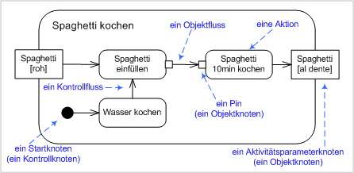
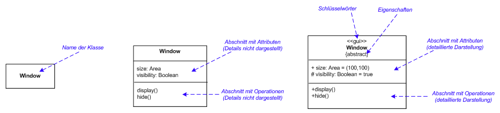
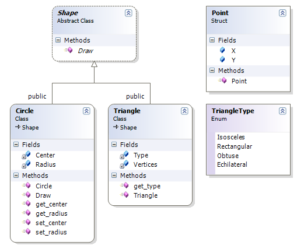

<!--

author:   Sebastian Zug, Galina Rudolf & André Dietrich
email:    sebastian.zug@informatik.tu-freiberg.de
version:  1.0.0
language: de
narrator: Deutsch Female

import: https://github.com/liascript/CodeRunner
        https://raw.githubusercontent.com/liascript-templates/plantUML/master/README.md
        https://github.com/LiaTemplates/Pyodide

icon: https://upload.wikimedia.org/wikipedia/commons/d/de/Logo_TU_Bergakademie_Freiberg.svg
-->

[](https://liascript.github.io/course/?https://github.com/TUBAF-IfI-LiaScript/VL_Softwareentwicklung/blob/master/14_UML_ModellierungII.md)

# Modellierung von Software

| Parameter                | Kursinformationen                                                                                                                                                                          |
| ------------------------ | ------------------------------------------------------------------------------------------------------------------------------------------------------------------------------------------ |
| **Veranstaltung:**       | `Vorlesung Softwareentwicklung`                                                                                                                                                            |
| **Semester**             | `Sommersemester 2021`                                                                                                                                                                      |
| **Hochschule:**          | `Technische Universität Freiberg`                                                                                                                                                          |
| **Inhalte:**             | `Ausgewählte UML Diagrammtypen`                                                                                                                                |
| **Link auf den GitHub:** | [https://github.com/TUBAF-IfI-LiaScript/VL_Softwareentwicklung/blob/master/14_UML_ModellierungII.md](https://github.com/TUBAF-IfI-LiaScript/VL_Softwareentwicklung/blob/master/14_UML_ModellierungII.md) |
| **Autoren**              | @author                                                                                                                                                                                    |


---------------------------------------------------------------------

## Neues aus Github

**Wann wird gearbeitet?**      

<!--
data-type="heatmap"
data-title="Commit Anzahl"
data-transpose="true"
data-ylabel = "Wochentage (0 = Montag, 7 = Sonntag)"
data-xlabel = "Stunden des Tages"
data-show
-->
| Stunde |   0 |   1 |   2 |   6 |   7 |   8 |   9 |  10 |  11 |  12 |  13 |  14 |  15 |  16 |  17 |  18 |  19 |  20 |  21 |  22 |  23 |
| ------:| ---:| ---:| ---:| ---:| ---:| ---:| ---:| ---:| ---:| ---:| ---:| ---:| ---:| ---:| ---:| ---:| ---:| ---:| ---:| ---:| ---:|
|      1 | nan | nan | nan | nan | nan | nan | nan |   2 | nan |   3 |   2 | nan | nan | nan |   1 | nan | nan | nan | nan | nan | nan |
|      2 | nan | nan | nan | nan |   2 | nan | nan | nan |   2 |   8 | nan |  10 |  24 |   3 | nan | nan | nan | nan | nan | nan | nan |
|      3 | nan | nan | nan | nan | nan | nan | nan |   1 |   4 |   6 |   7 |  25 |  22 | nan | nan | nan | nan | nan |   1 | nan |   2 |
|      4 |   2 | nan | nan |   2 |   2 | nan |   5 |   8 |   7 | nan | nan |  29 |  16 |  14 |  12 | nan |   2 |   1 | nan | nan | nan |
|      5 | nan | nan |   1 | nan | nan |   2 | nan |  12 |  10 |   3 |   1 |   2 |   2 | nan |   4 |   3 | nan | nan | nan | nan | nan |
|      6 | nan | nan | nan | nan | nan |   1 | nan | nan | nan |   1 |   2 |   4 |   7 |   7 |   2 | nan | nan |   4 |   1 | nan | nan |
|      7 | nan | nan | nan | nan | nan | nan | nan |   2 |   4 |   3 |   8 |   5 |   4 |   2 |   4 | nan | nan | nan | nan | nan | nan |


**Was ist ein guter Commit?**

Das folgende Diagramm zeigt die Commits pro Aufgabe

<!--
data-type="heatmap"
data-title="Commit Anzahl"
data-ylabel = "Team ID"
data-xlabel = "Task"
data-show
-->
| Task    |   0 |   1 |   2 |   3 |   4 |   5 |   6 |   7 |   8 |   9 |  10 |  11 |  12 |  13 |  14 |  15 |  16 |
| ---:| ---:| ---:| ---:| ---:| ---:| ---:| ---:| ---:| ---:| ---:| ---:| ---:| ---:| ---:| ---:| ---:| ---:|
|   3 |   7 |  15 |  12 |   8 |  18 |  10 |   5 |   8 |  45 |  21 |   5 |   8 |  18 |   8 |   6 |   6 |   3 |
|   4 | nan | nan | nan |  15 |  13 |  18 |   3 |   5 |   5 |   9 |   4 |   3 |  19 |   2 |   3 |  24 | nan |

... und wie viele unterschiedliche Dateien wurden dabei editiert?

<!--
data-type="heatmap"
data-title="Editierte Dateien"
data-ylabel = "Team ID"
data-xlabel = "Task"
data-show
-->
|   Task |   0 |   1 |   2 |   3 |   4 |   5 |   6 |   7 |   8 |   9 |   10 |   11 |   12 |   13 |   14 |   15 |   16 |
|-------:|----:|----:|----:|----:|----:|----:|----:|----:|----:|----:|-----:|-----:|-----:|-----:|-----:|-----:|-----:|
|      3 |   5 |   3 |   2 |  15 |   4 |   5 |   2 |   6 |   3 |  16 |    2 |    2 |    7 |    2 |    2 |    4 |    2 |
|      4 | nan | nan | nan |  26 |  11 |   7 |   5 |   6 |   8 |   6 |    5 |    7 |    7 |    1 |    2 |    6 |  nan |


## UML Diagrammtypen

<!-- width="90%" --> [^WikiUMLDiagrammTypes]

[^WikiUMLDiagrammTypes]: https://upload.wikimedia.org/wikipedia/commons/thumb/d/da/UML-Diagrammhierarchie.svg/1200px-UML-Diagrammhierarchie.svg.png, Autor "Stkl"- derivative work: File: UML-Diagrammhierarchie.png: Sae1962, CC BY-SA 4.0

Im folgenden werden wir uns aus den beiden Hauptkategorien jeweils folgende Diagrammtypen genauer anschauen:

+ Verhaltensdiagramme

  + Anwendungsfall Diagramm
  + Aktivitätsdiagramm
  + Sequenzdiagramm

+ Strukturdiagramm

  + Klassendiagramm
  + Objektdiagramm

### Anwendungsfall Diagramm

> Das Anwendungsfalldiagramm (Use-Case Diagramm) abstrahiert das erwartete
> Verhalten eines Systems und wird dafür eingesetzt, die Anforderungen an ein
> System zu spezifizieren.

Ein Anwendungsfalldiagramm stellt keine
Ablaufbeschreibung dar! Diese kann stattdessen mit einem Aktivitäts-, einem
Sequenz- oder einem Kollaborationsdiagramm (ab UML 2.x Kommunikationsdiagramm)
dargestellt werden.

**Basiskonzepte**

Elemente:

+ Systemgrenzen werden durch Rechtecke gekennzeichnet.
+ Akteure werden als „Strichmännchen“ dargestellt, dies können sowohl Personen (Kunden, Administratoren) als auch technische Systeme sein (manchmal auch ein Bandsymbol verwendet). Sie ordnen den Symbolen Rollen zu
+ Anwendungsfälle werden in Ellipsen dargestellt. Üblich ist die Kombination aus Verb und ein Substantiv `Kundendaten Ändern`.
+ Beziehungen zwischen Akteuren und Anwendungsfällen müssen durch Linien gekennzeichnet werden. Man unterscheidet "Association", "Include", "Extend" und "Generalization".


**Verfeinerung**

Use-Case Diagramme erlauben die Abstraktion von Elementen auf der Basis von Generalisierungen. So können Akteure von einander erben und redundante Beschreibungen von Verhalten über `<<extend>>` oder `<<include>>` (unter bestimmten Bedingungen) erweitert werden.


|                |                            |          |
| -------------- | ------------------------------------------------ | ------------------------------------------------ |
|                | `<<include>>` Beziehung                          | `<<extend>>` Beziehung                           |
| Bedeutung      | Ablauf von A schließt den Ablauf von B immer ein | Ablauf von A kann optional um B erweitert werden |
| Anwendung      | Hierachische Zerlegung                           | Abbildung von Sonderfällen                       |
| Abhängigkeiten | A muss B bei der Modellierung berücksichtigen    | Unabhängige Modellierung möglich                 |


**Anwendungsfälle**

+ Darstellung der wichtigsten Systemfunktionen
+ Austausch mit dem Anwender und dem Management auf der Basis logischer, handhabbarer Teile
+ Dokumentation des Systemüberblicks und der Außenschnittstellen
+ Indentifikation von Anwendungsfällen

**Vermeiden Sie ...**

+ ... eine zu detaillierte Beschreibung von Operationen und Funktionen
+ ... nicht funktionale Anforderungen mit einem Use-Case abbilden zu wollen
+ ... Use-Case Analysen aus Entwicklersicht durchzuführen
+ ... zu viele Use-Cases in einem Diagramm abzubilden (max. 10)

[^Jeckle]: Mario Jeckle, Christine Rupp, Jürgen Hahn, Barbara Zengler, Stefan Queins, UML 2 glasklar, Hanser Verlag, 2004

### Aktivitätsdiagramm

> Aktivitätsdiagramme stellen die Vernetzung von elementaren Aktionen und deren
> Verbindungen mit Kontroll- und Datenflüssen grafisch dar.

**Aktivitätsmodellierung in UML1**

|  | |
|Aktivitätsdiagramme.plantUML | ActivityUser.plantUML |

Bis UML 1.x waren Aktivitätsdiagramme eine Mischung aus Zustandsdiagramm,
Petrinetz und Ereignisdiagramm, was zu theoretischen und praktischen Problemen
führte.

**Erweiterung des Konzeptes in UML2**

> "Was früher Aktivitäten waren sind heute Aktionen."

UML2 strukturiert das Konzept der Aktivitätsmodellierung neu und führt als übergeordnete
Gliederungsebene Aktivitäten ein, die Aktionen, Objektknoten sowie Kontrollelemente der
Ablaufsteuerung und verbindende Kanten umfasst. Die Grundidee ist dabei, dass neben dem
Kontrollfluss auch der Objektfluss modelliert wird.

+ Aktivitäten definieren Strukturierungselemente für Aktionen, die durch Ein- und Ausgangsparameter, Bedingungen, zugehörige Aktionen und Objekte sowie einen
Bezeichner gekennzeichnet sind.

<!--
style="width: 80%; max-width: 860px; display: block; margin-left: auto; margin-right: auto;"
-->
````ascii

     .---------------------------------------------------.
     | Flächenberechnung Rechteck     ≪ precondition ≫   |
     |                                   Höhe ≥ 0        |
 +---+----+                              Breite ≥ 0      |
 | Höhe   |----˃                                         |
 +---+----+                                          +---+----+
     |                                          ----˃| Fläche |
 +---+----+                                          +---+----+
 | Breite |----˃                                         |
 +---+----+                                              |
     |                                                   |
     .---------------------------------------------------.
````


+ Aktionen stehen für den Aufruf eines Verhaltens oder die Bearbeitung von Daten, die innerhalb einer Aktivität nicht weiter zerlegt wird.

<!--
style="width: 80%; max-width: 860px; display: block; margin-left: auto; margin-right: auto;"
-->
````ascii

 +--------------------------+
 |   ≪ localPrecondition ≫  |\
 |                          +-+
 |  Papier vorhanden          |
 +----------------------------+
               \
                \
     .-----------------------.         .-------------------------.
     | Einladung verschicken |  ----˃  | Getränke einkaufen      |
     .-----------------------.         .-------------------------.
                  \
                   \
         +----------------------------+
         | ≪ localPostcondition ≫     |\
         |                            +-+
         |  Hälfte der Gäste angenommen |
         +------------------------------+

````

+ Objekte repräsentieren Daten und Werte, die innerhalb der Aktivität manipuliert werden. Damit ergibt sich ein nebeneinander von Kontroll- und Objektfluss.

<!--
style="width: 80%; max-width: 860px; display: block; margin-left: auto; margin-right: auto;"
-->
````ascii
                      Kontrollfluss
     .-------------.                    .-------------.
     | Aktion      |------------------> | Aktion      |
     .-------------.                    .-------------.

 ---------------------------------------------------------------

             Ausgabe-                 Eingabe-
              pin                      pin
                       Objektfluss
    .-------------._                   _.-------------.
    | Aktion      |_|----------------˃|_| Aktion      |
    .-------------.                     .-------------.


    .-------------.   +-------------+     .-------------.
    | Aktion      |---| Objekt      |---˃ | Aktion      |
    .-------------.   +-------------+     .-------------.
````


+ Signale und Ereignisse sind die Schnittstellen für das Auslösen einer Aktion

<!--
style="width: 90%; max-width: 860px; display: block; margin-left: auto; margin-right: auto;"
-->
````ascii

 +--------------.       .----------------+       .------------------------.
 |    Sende      \       \  Erster Gast  |------˃| Vorbereitungen beenden |
 |    Signal     /       /  eingetroffen |       .------------------------.
 +--------------.       .----------------+
````

**Beispiel**



Beispiels auf Anwendungsfall [Link](https://www.youtube.com/watch?v=VaKCZOhVJkQ)

**Anwendungsfälle**

+ Verfeinerung von Anwendungsfällen (aus den Use Case Diagrammen)
+ Darstellung von Abläufen mit fachlichen Ausführungsbedingungen
+ Darstellung für Aktionen im Fehlerfall oder Ausnahmesituationen

[^WikiActivityDiagram]: Wikimedia, Autor Gubaer, UML2 Aktivitätsdiagramm,  https://commons.wikimedia.org/wiki/File:Uml-Activity-Beispiel2.svg

### Sequenzdiagramm

> Sequenzdiagramme beschreiben den Austausch von Nachrichten zwischen Objekten mittels Lebenslinien.

Ein Sequenzdiagramms besteht aus einem Kopf- und einem Inhaltsbereich. Von jedem Kommunikationspartner geht eine Lebenslinie (gestrichelt) aus. Es sind zwei synchrone Operationsaufrufe, erkennbar an den Pfeilen mit ausgefüllter Pfeilspitze, dargestellt. Notationsvarianten für synchrone und asynchrone Nachrichten

Eine Nachricht wird in einem Sequenzdiagramm durch einen Pfeil dargestellt, wobei der Name der Nachricht über den Pfeil geschrieben wird. Nachrichten können:

+ Operationsaufrufe einer Klasse sein
+ Ergebnisse einer Operation
+ Signale
+ Interaktionen mit dem Nutzern
+ das Setzen einer Variablen

Synchrone Nachrichten werden mit einer gefüllten Pfeilspitze, asynchrone Nachrichten mit einer offenen Pfeilspitze gezeichnet.

Die schmalen Rechtecke, die auf den Lebenslinien liegen, sind Aktivierungsbalken, die den Focus of Control anzeigen, also jenen Bereich, in dem ein Objekt über den Kontrollfluss verfügt, und aktiv an Interaktionen beteiligt ist.


**Beispiel**


**Bestandteile**

| Name                   | Beschreibung                                                                                                          |
| ---------------------- | --------------------------------------------------------------------------------------------------------------------- |
| Objekt                 | Dient zur Darstellung einer Klasse oder eines Objekts im Kopfbereich.                                                 |
| Nachrichtensequenzen   | Modelliert den Informationsfluss zwischen den Objekten                                                                |
| Aktivitätsbalken       | Repräsentiert die Zeit, die ein Objekt zum Abschließen einer Aufgabe benötigt.                                        |
| Paket                  | Strukturiert das Sequenzdiagramm                                                                                      |
| Lebenslinien-Symbol    | Stellt durch die Ausdehnung nach unten den Zeitverlauf dar.                                                           |
| Fragmente              | Kapseln Sequenzen in „Wenn-dann“-Szenarien, optionalen Interaktionen, Schleifen, etc.                                 |
| Alternativen-Symbol    | Stellt eine Auswahl zwischen zwei oder mehr Nachrichtensequenzen (die sich in der Regel gegenseitig ausschließen) dar |
| Interaktionsreferenzen | Binden Submodelle und deren Ergebnisse ein  deren                                                                     |

**Beispiel**

|  |
|Alkoholkontrolle.plantUML |

[^WikiSequenceDiagram]: Wikimedia, Autor Coupling_loss_graph.svg, UML of message sequence, https://commons.wikimedia.org/wiki/File:CheckEmail.svg

### Klassendiagramme

> Ein Klassendiagramm ist eine grafischen Darstellung (Modellierung) von Klassen, Schnittstellen sowie deren Beziehungen.

**Beispiel**

Nehmen wir an, sie planen die Software für ein Online-Handel System. Es soll
sowohl verschieden Nutzertypen (*Customer* und *Administrator*) als auch die Objekt *ShoppingCart* und *Order* umfassen.

```text @plantUML.png
@startuml
skinparam classAttributeIconSize 0
abstract class User{
  -userId: string
  -password: string
  -email: string
  -loginStatus: string
  +verifyLogin():bool
  +login()
}

class Customer{
  -customerName: string
  +register()
  +updateProfile()
}

class Administrator{
  -adminName: string
  +updateCatlog(): bool
}

class ShoppingCart{
  -cartId: int
  +addCartItem()
  +updateQuantity()
  +checkOut()
}

class Order{
  -orderId: int
  -customerId: int
  -shippingId: int
  -dateCreated: date
  -dateShipped: date
  -status: string
  +updateQuantity()
  +checkOut()
}

class ShippingInfo{
  -shipingId: int
  -shipingType: string
  +updateShipingInfo()
}

User <|-- Customer
User <|-- Administrator
Customer "1" *-- "0..*" ShoppingCart
Customer "1" *-- "0..*" Order
Order "1" *-- "1" ShippingInfo

@enduml
```

#### Klassen

                        {{0-2}}
********************************************************************************

Klassen werden durch Rechtecke dargestellt, die entweder nur den Namen der
Klasse (fett gedruckt) tragen oder zusätzlich auch Attribute, Operationen und
Eigenschaften spezifiziert haben.  Oberhalb des Klassennamens können
Schlüsselwörter in Guillemets und unterhalb des Klassennamens in
geschweiften Klammern zusätzliche Eigenschaften (wie {abstrakt}) stehen.

Elemente der Darstellung :

| Eigenschaften | Bedeutung                                                                    |
| ------------- | ---------------------------------------------------------------------------- |
| Attribute     | beschreiben die Struktur der Objekte: Bestandteile und darin enthalten Daten |
| Operationen   | Beschreiben das Verhalten der Objekte (Methoden)                             |
| Zusicherungen | Bedingungen, Voraussetzungen und Regeln, die die Objekte erfüllen müssen     |
| Beziehungen   | Beziehungen einer Klasse zu anderen Klassen                                  |

Wenn die Klasse keine Eigenschaften oder Operationen besitzt, kann die unterste
horizontale Linie entfallen.




********************************************************************************

                                  {{1-2}}
********************************************************************************

**Objekte vs. Klassen**

| Klassendiagramm                                                                                                                                                                                                                                                                                                                                   | Beispielhaftes Objektdiagramm                                                                          |
| ------------------------------------------------------------------------------------------------------------------------------------------------------------------------------------------------------------------------------------------------------------------------------------------------------------------------------------------------- | ------------------------------------------------------------------------------------------ |
|  |   |

Darstellung motiviert nach _What is Object Diagram?_, https://www.visual-paradigm.com/guide/uml-unified-modeling-language/what-is-object-diagram/, Autor unbekannt


********************************************************************************

                                  {{2}}
********************************************************************************

> **Merke:** Vermeiden Sie bei der Benennung von Klassen, Attributen, Operationen usw. sprachspezifische Zeichen

```python KlasseMitUmlaut.py
class Zähler:
    """A simple example class"""
    i = 12345

A = Zähler()
print(A.i)
```
@LIA.eval(`["main.py"]`, `python -m compileall .`, `python main.pyc`)


```c KlasseMitUmlaut.cpp
#include <iostream>

class Zähler{
  public:
   int i = 12345;
};   

int main()
{
  Zähler A = Zähler();
  std::cout << A.i;
  return 0;
}
```
@LIA.eval(`["main.cpp"]`, `g++ main.cpp -o a.out`, `./a.out`)


********************************************************************************

                                  {{3}}
********************************************************************************

**Sichtbarkeitsattribute**

<!--
style="width: 100%; display: block; margin-left: auto; margin-right: auto;"
-->
````ascii

| Zugriffsmodifizierer | Innerhalb eines Assemblys       || Außerhalb eines Assemblys      |
|                      | Vererbung      | Instanzierung  || Vererbung     | Instanzierung  |
| -------------------- | -------------- | -------------- || ------------- | -------------- |
| `public`             | ja             | ja             || ja            | ja             |
| `private`            | nein           | nein           || nein          | nein           |
| `protected`          | ja             | nein           || ja            | nein           |
| `internal`           | ja             | ja             || nein          | nein           |
| `ìnternal protected` | ja             | ja             || ja            | nein           |

````

**public, private**

Die Sichtbarkeitsattribute `public` und `private` sind unabhängig vom Vererbungs-, Instanzierungs- oder Paketstatus einer Klasse. Im Beispiel kannn der TrafficOperator nicht
auf die Geschwindigkeiten der Instanzen von Car zurückgreifen.

")

**protected**

Die abgeleitete Klassen Bus und PassagerCar erben von Car und übernehmen damit deren Methoden. Die Zahl
der Sitze wird beispielsweise mit ihrem Initialisierungswert von 5 auf 40 gesetzt.
Zudem muss die Methode `StopAtStation` auch auf die Geschwindigkeit zurückgreifen können.

")

**internal**

Ein Member vom Typ `protected internal` einer Basisklasse kann von jedem Typ innerhalb seiner enthaltenden Assembly aus zugegriffen werden.

")

> **Merke: ** Der UML Standard kennt nur `+ public`, `- private`, `# protected` und `~ internal`. Das C# spezifische `internal protected` ist als weitere Differenzierungsmöglichlichkeit nicht vorgesehen.

********************************************************************************

                                  {{4}}
********************************************************************************

**Attribute**

> **Merke:** In der C# Welt sprechen wir bei Attributen von Membervariablen und Feldern.

Im einfachsten Fall wird ein Attribut durch
einen Namen repräsentiert, der in der Klasse eindeutig sein muss - Die Klasse
bildet damit den Namensraum der enthaltenen Attribute.

Entsprechend der Spezifikation sind folgende Elemente eines Attributes
definierbar:

```
[Sichtbarkeit] [/] Name [: Typ] [ Multiplizität ] [= Vorgabewert] [{Eigenschaftswert}]
```

+ *Sichtbarkeit* ... vgl. vorheriger Absatz
    Das "/" bedeutet, dass es sich um ein abgeleitetes Attribut handelt, dessen
    Daten von anderen Attributen abhängt
+ *Name* ... des Attributes, Leer und Sonderzeichen sollten weggelassen werden, um zu vermeiden, dass Sie bei der Implementierung Probleme generieren.

+ *Typ* ... UML verwendet zwar einige vordefinierte Typen (Integer, String, Boolean) beinhaltet aber keine Einschränkungen zu deren Wertebereich!

+ *Multiplizität* ... die Zahlenwerte in der rechteckigen Klammer legen eine Ober- und Untergrenze der Anzahl (Kardinalitäten) von Instanzen eines Datentyps fest.

| Beispiel | Bedeutung                                                                |
| -------- | ------------------------------------------------------------------------ |
| `0..1`   | optionales Attribut, das aber höchstens in einer Instanz zugeordnet wird |
| `1..1`   | zwingendes Attribut                                                      |
| `0..n`   | optionales Attribute mit beliebiger Anzahl                               |
| `1..*`   | zwingend mit beliebiger Anzahl größer Null                               |
| `n..m`   | allgemein beschränkte Anzahl größer 0                                    |

+ *Vorgabewerte* ... definieren die automatische Festlegung des Attributes auf einen bestimmten Wert

+ *Eigenschaftswerte* ... bestimmen die besondere Charakteristik des Attributes

| Eigenschaft | Bedeutung                                                                     |
| ----------- | ----------------------------------------------------------------------------- |
| `readOnly`  | unveränderlicher Wert                                                         |
| `subsets`   | definiert die zugelassen Belegung als Untermenge eines anderen Attributs      |
| `redefines` | überschreiben eines ererbten Attributes                                       |
| `ordered`   | Inhaltes eines Attributes treten in geordneter Reihenfolge ohne Dublikate auf |
| `bag`       | Attribute dürfen ungeordnet und mit Dublikaten versehen enthalten sein        |
| `sequence`  | legt fest, dass der Inhalt sortiert, aber ohne Dublikate ist                  |
| `composite` |                                                                               |

Daraus ergeben sich UML-korrekte Darstellungen

| Attributdeklaration              | Korrekt | Bemerkung                                                                          |
| -------------------------------- | ------- | ---------------------------------------------------------------------------------- |
| `public zähler:int `             | ja      | Umlaute sind nicht verboten                                                        |
| `/ alter`                        | ja      | Datentypen müssen nicht zwingend angegeben werden                                  |
| `privat adressen: String [1..*]` | ja      | Menge der Zeichenketten                                                            |
| `protected bruder Person`        | ja      | Datentyp kann neben den Basistypen jede andere Klasse oder eine Schnittstelle sein |
| String                           | nein    | Name des Attributes fehlt                                                          |
| privat, public name: String      | nein    | Fehler wegen mehrfachen Zugriffsattributen                                         |

")

```csharp    AttributeExample
using System;

namespace Rextester
{
  class Example
  {
    int attribute1;
    public int attribute2;
    public static double pi = 3.14;
    private bool attribute3;
    protected short attribute4;
    internal const string attribute5 = "Test";
    B attribute6;
    System.Collections.Speciallized.StringCollection attribute7;
    private int wert;
    Object attribute8{
      get{return wert * 10;}
    }
  }
}
```

********************************************************************************

                                  {{5}}
********************************************************************************

**Operationen**

> **Merke:** In der C# Welt sprechen wir bei Operationen von Methoden.

Operationen werden durch  mindestens ihren Nahmen sowie wahlfrei weitere Angaben
definiert. Folgende Aspekte können entsprechend der UML Spezifikation beschrieben werden:

```
[Sichtbarkeit] Name (Parameterliste) [: Rückgabetyp] [{Eigenschaftswert}]
```

Dabei ist die Parameterliste durch folgende Elemente definiert:

```
[Übergaberichtung] Name [: Typ] [Multiplizität] [= Vorgabewert][{Eigenschaftswert}]
```

+ *Sichbarkeit* ... analog Attribute
+ *Name* ... analog Attribute
+ *Parameterliste* ... Aufzählung der durch die aufrufende Methode übergebenden Parameter, die im folgenden nicht benannten Elemente folgend den Vorgaben, die bereits für die Attribute erfasst wurden:

    + *Übergaberichtung* ... Spezifiziert die Form des Zugriffes (`in` = nur lesender Zugriff, `out` = nur schreibend (reiner Rückgabewert), `inout` = lesender und schreibender Zugriff)

  + *Vorgabewert* ... default-Wert einer Übergabevariablen

+ *Rückgabetyp* ... Datentyp oder Klasse, der nach der Operationsausführung zurückgegeben wird.

+ *Eigenschaftswert* ... Angaben zu besonderen Charakteristika der Operation


")

```csharp    OperationsExample
using System;

class Example
{
  public static void operation1(){
    // Implementierung
  }

  private int operation2 (int param1 = 5)
  {
    // Implementierung
    return value;
  }

  protected void operation3 (ref C param3)
  {
    // Implementierung
    param3 = ...
  }

  internal B operation4 (out StringCollection param3)
  {
    // Implementierung
    return value;
  }
}
```

********************************************************************************

[^WikiUMLClass]: https://de.wikipedia.org/wiki/Klassendiagramm#/media/Datei:UmlCd_Klasse-3.svg, Autor Gubaer, CC BY-SA 3.0

#### Schnittstellen

Eine Schnittstelle wird ähnlich wie eine Klasse mit einem Rechteck dargestellt, zur Unterscheidung aber mit dem Schlüsselwort `interface` gekennzeichnet.

")

Eine alternative Darstellung erfolgt in der LolliPop Notation, die die grafische Darstellung etwas entkoppelt.

")


```csharp    OperationsExample
using System;

interface Sortierliste{
  void einfuegen (Eintrag e);
  void loeschen (Eintrag e);
}

class Datenbank : SortierteListe
{
  void einfuegen (Eintrag e) {//Implementierung};
  void loeschen (Eintrag e) {//Implementierung};
}
```

#### Beziehungen

Die Möglichkeiten der Verknüpfung zwischen Klassen und Interfaces lassen sich wie folgt gliedern:

| Beziehung                             | Darstellung                                                                                                                                          | Bedeutung                                                                                  |
| ------------------------------------- | ---------------------------------------------------------------------------------------------------------------------------------------------------- | ------------------------------------------------------------------------------------------ |
| Generalisierung                       |  | gerichtete Beziehung zwischen einer generelleren und einer spezielleren Klasse (Vererbung) |
| Assoziationen (ohne Anpassung)        |           | beschreiben die Verknüpfung allgemein                                                      |
| Assoziation (Komposition/Aggregation) |   | Bildet Beziehungen von einem Ganzen und seinen Teilen ab                                   |


## Aufgaben

- [ ] Experimentieren Sie mit der automatischen Extraktion von UML Diagrammen für Ihre Computer-Simulation aus den Übungen
- [ ] Evaluieren Sie das Add-On "Class Designer" für die Visual Studio Umgebung



https://docs.microsoft.com/de-de/visualstudio/ide/class-designer/how-to-add-class-diagrams-to-projects?view=vs-2019
