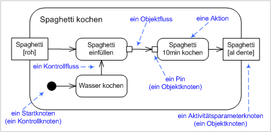
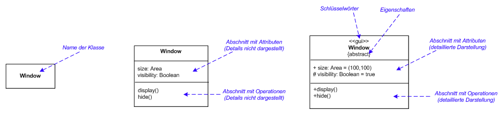
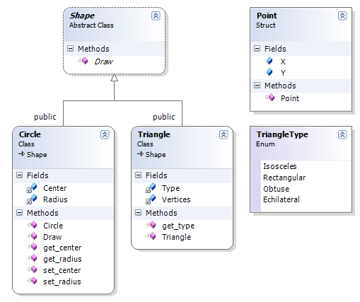

<!--

author:   Sebastian Zug, Galina Rudolf & André Dietrich
email:    sebastian.zug@informatik.tu-freiberg.de
version:  1.0.8
language: de
narrator: Deutsch Female
comment:  Klassifikation von UML Diagrammtypen, Anwendungsfall Diagramm, Aktivitätsdiagramm, Sequenzdiagramm, Klassendiagramm, UML Tools
tags:      
logo:     
title: Modellierung von Software II

import: https://github.com/liascript/CodeRunner
        https://raw.githubusercontent.com/liascript-templates/plantUML/master/README.md

import: https://raw.githubusercontent.com/TUBAF-IfI-LiaScript/VL_Softwareentwicklung/master/config.md

link: https://raw.githubusercontent.com/TUBAF-IfI-LiaScript/VL_Softwareentwicklung/master/css/styles.css

-->

[](https://liascript.github.io/course/?https://github.com/TUBAF-IfI-LiaScript/VL_Softwareentwicklung/blob/master/14_UML_ModellierungII.md)

# Modellierung von Software

| Parameter                | Kursinformationen                                                                                  |
| ------------------------ | -------------------------------------------------------------------------------------------------- |
| **Veranstaltung:**       | `Vorlesung Softwareentwicklung`                                                                    |
| **Teil:**                | `14/27`                                                                                            |
| **Semester**             | @config.semester                                                                                   |
| **Hochschule:**          | @config.university                                                                                 |
| **Inhalte:**             | @comment                                                                                           |
| **Link auf den GitHub:** | https://github.com/TUBAF-IfI-LiaScript/VL_Softwareentwicklung/blob/master/14_UML_ModellierungII.md |
| **Autoren**              | @author                                                                                            |


---------------------------------------------------------------------

## Organisatorisches 

Projektarbeiten als Leistungsnachweis für die Vorlesung Softwareentwicklung.

https://github.com/ComputerScienceLecturesTUBAF/SoftwareentwicklungSoSe2026_Projektaufgaben

## Worum es heute geht

In der vorangegangenen Vorlesung haben wir gesehen, *warum* wir modellieren:
Aus einem unklaren Kundenauftrag müssen präzise, kommunizierbare Anforderungen
werden — festgehalten in Lasten- und Pflichtenheft, eingebettet in einen
Entwicklungsprozess wie das V-Modell. UML ist dabei die formale Notation, mit
der wir die Modelle aufschreiben.

Heute geht es um die **Werkzeuge selbst**: Wir lernen die wichtigsten
UML-Diagrammtypen im Detail kennen und sehen, welche Fragen sie jeweils
beantworten. Dabei begleitet uns ein durchgehendes Beispiel — der **TUBAF-Merchandising-Shop** aus
der letzten Vorlesung.

> **Merke:** UML-Diagramme sind ein wichtiges Hilfsmittel, um die Anforderungen und das Design eines Systems zu visualisieren und zu kommunizieren. Sie helfen dabei, komplexe Zusammenhänge verständlich darzustellen und dienen als Grundlage für die Implementierung.


> [OMG-Spezifikation](https://www.omg.org/spec/UML/2.5.1/PDF)

Im folgenden werden wir uns aus den beiden Hauptkategorien jeweils folgende Diagrammtypen genauer anschauen:

+ Verhaltensdiagramme

  + Anwendungsfall Diagramm
  + Aktivitätsdiagramm
  + Sequenzdiagramm

+ Strukturdiagramme

  + Klassendiagramm

## Anwendungsfall Diagramm

> [!TIP]
> Das Anwendungsfalldiagramm (Use-Case Diagramm) abstrahiert das erwartete
> Verhalten eines Systems und wird dafür eingesetzt, die Anforderungen an ein
> System zu spezifizieren.

### Grundlagen

Ein Anwendungsfalldiagramm ist eine grafische Darstellung der *funktionalen Anforderungen* eines Systems. Es zeigt die verschiedenen Anwendungsfälle (Use Cases), Akteure und deren Interaktionen.

**Basiskonzepte — Erste Abstraktionsebene**

Wir starten mit einer **groben Sicht** auf den TUBAF-Merchandising-Shop. Auf dieser Abstraktionsebene fassen wir alle kaufenden Nutzer als einen einzigen Sammelakteur *Kunde* zusammen — Differenzierungen kommen im nächsten Schritt.

```text @plantUML.png
@startuml
left to right direction
skinparam packageStyle rectangle

actor "Kunde" as Kunde
actor "ShopAdmin" as Admin
actor "Lagerist" as Lager
actor "Zahlungsdienst" as Payment

rectangle "TUBAF-Merchandising-Shop" {
  (Merchandise anzeigen) as UC1
  (In den Warenkorb legen) as UC2
  (Bestellung abschließen) as UC3
  (Katalog pflegen) as UC4
  (Versand vorbereiten) as UC5

  Kunde -- UC1
  Kunde -- UC2
  Kunde -- UC3
  Admin -- UC4
  Lager -- UC5
}

UC3 -- Payment
@enduml
```

An diesem Diagramm sehen wir alle vier Notations-Elemente:

+ **Systemgrenzen** werden durch Rechtecke gekennzeichnet — hier der *TUBAF-Merchandising-Shop*. Alles innerhalb gehört zum modellierten System, die Akteure agieren von außen.
+ **Akteure** werden als „Strichmännchen" dargestellt — das können Personen (*Kunde*, *ShopAdmin*, *Lagerist*) oder technische Systeme (*Zahlungsdienst*) sein. Sie ordnen den Symbolen Rollen zu.
+ **Anwendungsfälle** werden in Ellipsen dargestellt. Üblich ist die Kombination aus Verb und Substantiv (`Bestellung abschließen`).
+ **Beziehungen** zwischen Akteuren und Anwendungsfällen werden durch Linien gekennzeichnet. Man unterscheidet *Association*, *Include*, *Extend* und *Generalization*.

**Verfeinerung — Konkretisierung des Sammelakteurs**

In der ersten Sicht haben wir *den Kunden* als einheitlichen Akteur modelliert. In der Praxis verbergen sich dahinter mindestens zwei unterschiedliche Rollen: **Gäste** (anonyme Besucher) und **TUBAF-Studierende** (authentifiziert über das hochschul­interne Single-Sign-On). Beide *sind Kunden* im Shop-Sinn — sie unterscheiden sich aber in ihren Rechten (Studi-Rabatt) und ihrer Authentifizierung.

Use-Case-Diagramme erlauben diese Konkretisierung durch zwei Mechanismen: **Akteur-Generalisierung** (Gast und Studierende erben vom Sammelakteur *Kunde*) sowie die Verfeinerung von Abläufen über **`<<include>>`** (verpflichtende Teilschritte) und **`<<extend>>`** (optionale Erweiterungen unter Bedingungen).


|                |                            |          |
| -------------- | ------------------------------------------------ | ------------------------------------------------ |
|                | `<<include>>` Beziehung                          | `<<extend>>` Beziehung                           |
| Bedeutung      | Ablauf von A schließt den Ablauf von B immer ein | Ablauf von A kann optional um B erweitert werden |
| Anwendung      | Hierachische Zerlegung                           | Abbildung von Sonderfällen                       |
| Abhängigkeiten | A muss B bei der Modellierung berücksichtigen    | Unabhängige Modellierung möglich                 |

> [!CAUTION]
> Beachten Sie die unterschiedliche Richtung der Pfeile: `<<include>>` zeigt von der übergeordneten Anwendungsfall zu dem inkludierten Anwendungsfall, während `<<extend>>` von der Erweiterung zum Basis-Anwendungsfall zeigt. Wer den Pfeil schickt, ist abhängig vom Empfänger.

```text @plantUML.png
@startuml
left to right direction

actor "Kunde" as Kunde
actor "Gast" as Gast
actor "Studierende:r\n(TUBAF-Login)" as Student

' Konkretisierung: Gast und Studierende sind beide Kunden im Shop-Sinn
Gast --|> Kunde
Student --|> Kunde

rectangle "TUBAF-Merchandising-Shop" {
  usecase "Merchandise anzeigen" as UC1
  usecase "In den Warenkorb legen" as UC2
  usecase "Bestellung abschließen" as UC3
  usecase "Zahlung durchführen" as UC4
  usecase "Gutschein einlösen" as UC5
  usecase "Studi-Rabatt anwenden" as UC6
}

' Basis-Interaktionen (für alle Kunden — wandert an den Sammelakteur)
Kunde -- UC1
Kunde -- UC2
Kunde -- UC3

' Studi-spezifisch
Student -- UC6

' include: Immer bei Bestellung
UC3 ..> UC4 : <<include>>

' extend: Optionaler Gutschein
UC3 <.. UC5 : <<extend>>\n[Bedingung: Gutschein vorhanden]

' extend: Studi-Rabatt nur für TUBAF-Studierende mit gültigem Login
UC3 <.. UC6 : <<extend>>\n[Bedingung: gültiger TUBAF-Login]

' Detaillierte Bedingungen als Notizen
note right of UC5
Bedingung für Erweiterung:
Nur wenn ein gültiger Gutschein
im Kundenkonto oder Warenkorb vorhanden ist
end note

note right of UC6
Bedingung für Erweiterung:
Nur wenn der TUBAF-Status
über Shibboleth-SSO bestätigt wurde
end note

@enduml
```

> **Lesart der Konkretisierung:** Die Linien `Gast --|> Kunde` und `Studierende --|> Kunde` sind **Akteur-Generalisierungen** — Gast *ist ein* Kunde, Studierende *ist ein* Kunde. Damit erben beide automatisch alle Use-Case-Verbindungen, die am Sammel­akteur *Kunde* hängen (UC1, UC2, UC3). Im Diagramm zeichnen wir diese geerbten Verbindungen nicht doppelt — DRY-Prinzip auch in der Modellierung. Studi-spezifisch ist nur UC6 (*Studi-Rabatt anwenden*), den wir direkt an *Studierende* anhängen.
>
> **Vorsicht — kontroverse Praxis:** Akteur-Generalisierung ist UML-konform, wird aber in der Praxis skeptisch gesehen, weil die Bedeutung von "ist ein" bei Akteuren weniger eindeutig ist als bei Klassen.

**Anwendungsfälle**

> Achtung: Ein Anwendungsfalldiagramm stellt keine Ablaufbeschreibung dar! Diese kann stattdessen mit einem Aktivitäts-, einem Sequenz- oder einem Kommunikationsdiagramm dargestellt werden.

+ Darstellung der wichtigsten Systemfunktionen
+ Austausch mit dem Anwender und dem Management auf der Basis logischer, handhabbarer Teile
+ Dokumentation des Systemüberblicks und der Außenschnittstellen
+ Indentifikation von Anwendungsfällen

> [!TIP]
> Halten Sie komplexe `<extend>` Bedingungen in separaten Dokumenten fest.

### Diskussion

Der TUBAF-Shop mit seinen sechs Use-Cases wirkt überschaubar — fast banal. In realen Projekten sieht die Situation anders aus: Use-Case-Diagramme sind oft das *erste vertragsrelevante Engineering-Artefakt* eines Projekts und können sich in mehreren Dimensionen entfalten.

+ **Skalierung mit dem Systemumfang.** TUBAF-Shop: 6 Use-Cases. Ein realer Online-Shop: 50–200 Use-Cases. Ein ERP-System: mehrere *tausend* Use-Cases, hierarchisch organisiert in Paketen. 
+ **Granularität ist eine schwierige Designentscheidung.** Zu fein modelliert ist *"Knopf drücken"* oder *"Feld ausfüllen"* — das sind UI-Interaktionen, keine Use-Cases. Zu grob ist *"System nutzen"* — sagt nichts aus. Cockburn-Faustregel: Ein Use-Case sollte einen **abgeschlossenen Geschäftswert** liefern (*User Goal Level* — typischerweise 5–20 Minuten Nutzungs­dauer, mit klarem Erfolgs­ergebnis). *"Bestellung abschließen"* erfüllt das; *"Warenkorb-Icon anklicken"* nicht.
+ **Akteur-Identifikation ist nicht trivial.** Wer ist *"der Kunde"* im TUBAF-Shop wirklich? Anonymer Besucher? Eingeloggter Studi? Lehrstuhl-Sekretariat, das im Auftrag mehrerer Kollegen bestellt? 
+ **Das Diagramm ist nur die Spitze des Eisbergs.** Was Sie hier sehen, zeigt **welche** Use-Cases es gibt und **wer** sie nutzt. Die eigentliche Arbeit steckt in den **Use-Case-Beschreibungen**.
+ **Politische Dimension.** Use-Cases sind oft das **erste vertraglich relevante Dokument** zwischen Auftraggeber und Auftragnehmer (siehe Lasten- und Pflichtenheft aus VL 13). Was *nicht* im Use-Case-Katalog steht, wird typischerweise auch *nicht* implementiert — und Nachforderungen werden teuer. 
> **Pragmatische Konsequenz:** Ein Anwendungsfall-Diagramm ist *einfach zu zeichnen*, aber *schwer richtig zu modellieren*. Die formale Notation lernen Sie in einer Stunde — die Modellierungs-Disziplin, die nötig ist, um ein tragfähiges Anforderungs­dokument zu erzeugen, ist Berufserfahrung von Jahren. 

## Aktivitätsdiagramm

> [!TIP]
> Aktivitätsdiagramme stellen die Vernetzung von elementaren Aktionen und deren Verbindungen mit Kontroll- und Datenflüssen grafisch dar.

### Ausgangspunkt UML 1.x-Modellierung

Elemente UML 1.x:

+ Aktivitätszustände (Activity States)
+ Übergänge (Transitions)
+ Startzustand (Initial State)
+ Endzustand (Final State)
+ Entscheidungsknoten (Decision Nodes)
+ Synchronisationsbalken
+ Aktivitätspartitionen (Swimlanes)

<section class="flex-container">
<div class="flex-child">

```text @plantUML.png
@startuml
start

repeat
  :Artikel suchen;
  :Artikel in den \nWarenkorb legen;
repeat while (Weitere Artikel?)
:Art der Bezahlung\n wählen;
fork
:Überweisung;
fork again
:Bankeinzug;
end fork
:Lieferanschrift\n auswählen;
stop
@enduml
```

</div>
<div class="flex-child">

```text @plantUML.png
@startuml
|User|
start
repeat
:SchreibeDaten;
if (Speicher voll?) then (nein)
 :Ausgabe Speichergröße;
else (ja)
  |#AntiqueWhite|Admin|
  :Vergrößere Speicher;
  :Ausgabe zus. Speicher;
endif
|User|
:Speichern;
repeat while (Weitere Datensätze?)
stop
@enduml
```

</div>
</section>

An den beiden Beispielen lassen sich die zentralen Schwächen ablesen:

+ **Konzeptioneller Mischmasch.** UML 1.x-Aktivitätsdiagramme waren formal als *Spezialfall eines Zustands­automaten* definiert — sahen aber aus wie Flussdiagramme. Was im linken Diagramm wie "Aktion ausführen" wirkt, war semantisch ein "Zustand", der durch Transitionen verlassen wird. Die Sprache war eine Mischung aus **Zustandsdiagramm**, **Petrinetz** und **Ereignis­diagramm** ohne saubere Trennung.

+ **Kein expliziter Objektfluss.** Beide Diagramme zeigen nur, *was* nach *wann* passiert (Kontrollfluss). Welche **Daten** zwischen den Aktivitäten fließen — z. B. der zusammen­gestellte Warenkorb, der zur Bezahlung wandert — bleibt unsichtbar. Erst UML 2 führte Objektknoten und Pins ein.

+ **Nebenläufigkeit nur grob darstellbar.** Im linken Beispiel laufen "Überweisung" und "Bankeinzug" parallel — aber semantisch ist unklar, ob beide ausgeführt werden müssen oder eines reicht. UML 2 differenziert hier sauber zwischen **Fork/Join** (alle Zweige) und **Decision/Merge** (einer von vielen).

+ **Schwache Partitions-Semantik.** Im rechten Diagramm wechselt der Verantwortliche zwischen *User* und *Admin* (Swimlanes). In UML 1.x waren Swimlanes rein dekorativ; in UML 2 erhalten sie eine formale Bedeutung als *Activity Partitions* mit klar zuordenbarem Verhalten.

+ **Keine Ausnahme­behandlung.** Was passiert im linken Beispiel, wenn die Zahlung fehlschlägt? Im rechten, wenn das Vergrößern des Speichers misslingt? UML 1.x hatte dafür kein Konstrukt — UML 2 ergänzte *Interruptible Regions* und *Exception Handlers*.

Diese Schwächen führten dazu, dass Aktivitätsdiagramme in der Praxis oft *intuitiv als Flussdiagramme* gelesen wurden — entgegen ihrer eigentlichen Definition. UML 2 hat die Sprache deshalb neu fundiert: Aktivitätsdiagramme basieren seitdem auf einer **Token-Semantik** (vergleichbar mit Petrinetzen), die Kontroll- und Objektfluss gleichberechtigt behandelt.

### Erweiterung des Konzeptes in UML2

| Bereich                           | UML 1.x                                               | UML 2.x                                                                                     |
| --------------------------------- | ----------------------------------------------------- | ------------------------------------------------------------------------------------------- |
| **Strukturmodell**                | einfaches Kontrollflussmodell (ähnlich Flussdiagramm) | basiert auf **aktivitätsbasiertem Zustandsautomaten** mit Tokens (ähnlich **Petri-Netzen**) |
| **Objektfluss**                   | rudimentär                                            | **explizite Darstellung von Datenflüssen** zwischen Aktionen möglich                        |
| **Pins**                          | nicht vorhanden                                       | **Input- und Output-Pins** ermöglichen feingranulare Kontrolle über Daten                   |
| **Partitions (Swimlanes)**        | einfach                                               | weiterhin vorhanden, aber besser formalisiert                                               |
| **Unteraktivitäten**              | eingeschränkt                                         | **Call Behavior Action** für Wiederverwendung anderer Aktivitäten                           |
| **Nebenläufigkeit (Concurrency)** | schwer modellierbar                                   | durch **Fork/Join-Nodes** sauber formalisiert                                               |
| **Signale und Ereignisse**        | kaum genutzt                                          | erweiterte Unterstützung für **Signal Send/Receive Actions**                                |
| **Exception Handling**            | nicht vorhanden                                       | neu eingeführt mit **Interruptible Regions** und **Exception Handlers**                     |
| **Zustandsübergänge**             | implizit                                              | explizite Modellierung möglich                                                              |


> "Was früher Aktivitäten waren sind heute Aktionen."

UML2 strukturiert das Konzept der Aktivitätsmodellierung neu und führt als übergeordnete
Gliederungsebene Aktivitäten ein, die Aktionen, Objektknoten sowie Kontrollelemente der
Ablaufsteuerung und verbindende Kanten umfasst. Die Grundidee ist dabei, dass neben dem
Kontrollfluss auch der Objektfluss modelliert wird.

+ Aktivitäten definieren Strukturierungselemente für Aktionen, die durch Ein- und Ausgangsparameter, Bedingungen, zugehörige Aktionen und Objekte sowie einen Bezeichner gekennzeichnet sind.

+ Aktionen stehen für den Aufruf eines Verhaltens oder die Bearbeitung von Daten, die innerhalb einer Aktivität nicht weiter zerlegt wird.

+ Objekte repräsentieren Daten und Werte, die innerhalb der Aktivität manipuliert werden. Damit ergibt sich ein nebeneinander von **Kontroll-** und **Objektfluss**.

   * *Kontrollfluss* — die Pfeile signalisieren nur, *wann* die nächste Aktion ausgeführt wird:
   * *Objektfluss mit explizitem Objektknoten* — der durchlaufende Datenwert wird als eigenständiger Knoten zwischen die Aktionen gesetzt. So lässt sich der Datentyp oder Zustand des Objekts kennzeichnen, das von Aktion zu Aktion weitergereicht wird:

+ Signale und Ereignisse sind die Schnittstellen für das Auslösen einer Aktion. UML2 unterscheidet das *Send-Signal* (Fünfeck mit Spitze nach rechts) vom *Receive-Event* (Fünfeck mit Einkerbung links):

### Beispiel

> **UML2-Notation mit Pins:** Eine kompaktere Schreibweise von UML2 nutzt **Input-** und **Output-Pins** direkt an den Aktions-Rechtecken — kleine Quadrate am Rand der Aktion, die den Datenfluss markieren. Diese Notation ist in PlantUML nicht direkt verfügbar; in der Praxis greift man bei dieser Art von Detail auf CASE-Werkzeuge zurück (siehe Werkzeug-Hinweise in der vorherigen Vorlesung). Das **Gesamtbeispiel** weiter unten zeigt eine reichere UML2-Darstellung mit Pins und Objektknoten in der Wikimedia-Variante.



Das Beispiel modelliert das Kochen von Spaghetti und führt alle wichtigen UML2-Konzepte auf einen Blick zusammen. Es lohnt sich, die Elemente einzeln zu lesen:

+ Die *Aktivität* **„Spaghetti kochen"** ist der äußere Rahmen — sie hat einen Eingangsparameter (`Spaghetti [roh]`) und einen Ausgangsparameter (`Spaghetti [al dente]`), beide als **Aktivitätsparameterknoten** am Rand gezeichnet. Sie entsprechen Eingangs- und Rückgabewert einer Methode.

+ Die *Aktionen* (`Spaghetti einfüllen`, `Wasser kochen`, `Spaghetti 10min kochen`) sind die elementaren Verarbeitungsschritte. Hier wird nichts weiter zerlegt.

+ **Kontroll- und Objektfluss laufen parallel.** Der Pfeil vom *Startknoten* (schwarzer Kreis) zu `Wasser kochen` ist ein **Kontrollfluss** — er sagt nur, *wann* die Aktion ausgeführt wird, ohne ein Datenobjekt zu übergeben. Der Pfeil von `Spaghetti [roh]` zu `Spaghetti einfüllen` ist dagegen ein **Objektfluss** — er übergibt zugleich ein Datenobjekt UND aktiviert die Aktion. Eine Aktion kann mehrere Eingangs-Tokens benötigen (manche Kontroll-, manche Objekt-Tokens) — sie startet erst, wenn alle vorhanden sind. Genau das ist die **Token-Semantik** aus dem Petrinetz-Modell.

+ **Pins** sind die kleinen Quadrate am Rand der Aktionen (z. B. zwischen `Spaghetti einfüllen` und `Spaghetti 10min kochen`). Sie sind die kompakte Schreibweise für Objektknoten: Output-Pin der einen Aktion = Input-Pin der nächsten. In PlantUML lässt sich das nicht direkt darstellen — in CASE-Werkzeugen wie Modelio oder Enterprise Architect schon.

> **Merke:** Ein Pfeil im UML2-Aktivitätsdiagramm sagt nicht automatisch "Kontrollfluss" — er sagt "Token-Weitergabe". Ob es ein Kontroll- oder ein Objekt-Token ist, hängt davon ab, *was* an seinen Enden hängt (eine Aktion direkt oder ein Objektknoten/Pin).

**Anwendung**

+ Verfeinerung von Anwendungsfällen (aus den Use Case Diagrammen)
+ Darstellung von Abläufen mit fachlichen Ausführungsbedingungen
+ Darstellung für Aktionen im Fehlerfall oder Ausnahmesituationen

> Das nachfolgende Video zeigt die Erstellung von Aktivitätsdiagrammen und arbeitet dabei die Unterschiede von UML 1.x und UML 2.x heraus.

!?[Link](https://www.youtube.com/watch?v=VaKCZOhVJkQ)

## Sequenzdiagramm

> Sequenzdiagramme beschreiben den Austausch von Nachrichten zwischen Objekten mittels Lebenslinien.

Ein Sequenzdiagramms besteht aus einem Kopf- und einem Inhaltsbereich. Von jedem Kommunikationspartner geht eine **Lebenslinie** (gestrichelt) aus. 

Eine Nachricht wird in einem Sequenzdiagramm durch einen Pfeil dargestellt, wobei der Name der Nachricht über den Pfeil geschrieben wird. Nachrichten können sein:

+ Operationsaufrufe einer Klasse
+ Ergebnisse einer Operation, Antwortsnachricht (gestrichelte Linien)
+ Signale
+ Interaktionen mit den Nutzern
+ das Setzen einer Variablen

Für synchrone und asynchrone Operationsaufrufe (Nachrichten) gibt es verschiedene Notationsvarianten.
**Synchrone Nachrichten** werden mit einer gefüllten Pfeilspitze, **asynchrone Nachrichten** mit einer offenen Pfeilspitze gezeichnet.

Die schmalen Rechtecke, die auf den Lebenslinien liegen, sind **Aktivierungsbalken**, die den Focus of Control anzeigen, also jenen Bereich, in dem ein Objekt über den Kontrollfluss verfügt, und aktiv an Interaktionen beteiligt ist.

**Beispiel**

```text @plantUML.png

@startuml
actor Kunde
participant "Webbrowser" as Browser
participant "Shop-Frontend" as Frontend
participant "Shop-Backend" as Backend
participant "Zahlungsdienst" as Payment

Kunde -> Browser : Produktseite aufrufen
activate Browser
Browser -> Frontend : HTTP GET /produkt/123
activate Frontend
Frontend -> Backend : Produktdaten abrufen
activate Backend
Backend --> Frontend : Produktdetails
deactivate Backend
Frontend --> Browser : HTML mit Produktinformationen
deactivate Frontend
deactivate Browser

Kunde -> Browser : In den Warenkorb legen
activate Browser
Browser -> Frontend : HTTP POST /warenkorb
activate Frontend
Frontend -> Backend : Warenkorb aktualisieren
activate Backend
Backend --> Frontend : OK
deactivate Backend
Frontend --> Browser : Rückmeldung „Produkt im Warenkorb“
deactivate Frontend
deactivate Browser

Kunde -> Browser : Bestellung auslösen
activate Browser
Browser -> Frontend : HTTP POST /checkout
activate Frontend
Frontend -> Backend : Bestellung erstellen
activate Backend
Backend -> Payment : Zahldaten prüfen
activate Payment
Payment --> Backend : Zahlung bestätigt
deactivate Payment
Backend --> Frontend : Bestellung abgeschlossen
deactivate Backend
Frontend --> Browser : Bestellbestätigung
deactivate Frontend
deactivate Browser

Browser -> Kunde : Anzeige „Vielen Dank für Ihre Bestellung!“
@enduml
```


**Bestandteile**

| Name                   | Beschreibung                                                                                                          |
| ---------------------- | --------------------------------------------------------------------------------------------------------------------- |
| Objekt                 | Dient zur Darstellung eines Objekts (:Klasse) im Kopfbereich.                                                         |
| Nachrichtensequenzen   | Modelliert den Informationsfluss zwischen den Objekten                                                                |
| Aktivitätsbalken       | Repräsentiert die Zeit, die ein Objekt zum Abschließen einer Aufgabe benötigt.                                        |
| Akteur                | Repräsentiert einen Nutzer (Strichmännchen)                                                                            |
| Lebenslinien-Symbol    | Stellt durch die Ausdehnung nach unten den Zeitverlauf dar.                                                           |
| Fragmente              | Kapseln Sequenzen in Szenarien, wie optionalen Interaktionen (opt), Alternativen (alt), Schleifen (Loop), Parallelität (par)  |
| Interaktionsreferenzen | Binden Submodelle und deren Ergebnisse ein  (ref)                                                                     |

> Parallel laufende Aktivitäten bei unterschiedlichen Akteuren sind damit unmittebar ersichtlich. 

```text @plantUML.png
@startuml
actor User
participant System
participant ServiceA
participant ServiceB

User -> System : Anfrage starten
activate System

System -> ServiceA : Task A starten
activate ServiceA

System -> ServiceB : Task B starten
activate ServiceB

' Beide Services arbeiten parallel
ServiceA --> System : Task A Ergebnis
deactivate ServiceA

ServiceB --> System : Task B Ergebnis
deactivate ServiceB

' System wartet auf beide Ergebnisse
System -> User : Ergebnis liefern
deactivate System
@enduml
```

**Beispiel — komplexer Bestellprozess im TUBAF-Shop**

Das folgende Diagramm zeigt den vollständigen Bestellprozess mit Studi-Rabatt-Prüfung — inklusive **paralleler Validierungen** (`par`), **alternativer Pfade** (`alt`), **optionaler Erweiterungen** (`opt`) und **Fehlerbehandlung**:

```text @plantUML.png
@startuml
actor "Studierende:r" as Studi
participant "Shop-Frontend" as Frontend
participant "Bestellservice" as Bestellung
participant "Lagerservice" as Lager
participant "Shibboleth-SSO" as SSO
participant "Zahlungsdienst" as Payment

Studi -> Frontend : Checkout starten
activate Frontend

par Login- und Bestand prüfen
  Frontend -> SSO : TUBAF-Login prüfen
  activate SSO
  ||10||
  SSO --> Frontend : Studi-Status: bestätigt
  deactivate SSO
else
  Frontend -> Lager : Artikelverfügbarkeit prüfen
  activate Lager
  Lager --> Frontend : alle Artikel verfügbar
  deactivate Lager
end

alt Studi-Status bestätigt
  Frontend -> Bestellung : Bestellung mit Studi-Rabatt anlegen
  activate Bestellung
else kein gültiger Login
  Frontend -> Bestellung : Bestellung zum Normalpreis anlegen
  activate Bestellung
end

Bestellung --> Frontend : Bestell-Id, Gesamtsumme
deactivate Bestellung

opt Gutschein eingegeben
  Frontend -> Bestellung : Gutschein einlösen
  activate Bestellung
  Bestellung --> Frontend : aktualisierte Summe
  deactivate Bestellung
end

Frontend -> Payment : Zahlung auslösen
activate Payment
||15||
Payment --> Frontend : Zahlung bestätigt
deactivate Payment

Frontend -> Bestellung : Bestellung freigeben
activate Bestellung
Bestellung --> Frontend : Versand vorbereitet
deactivate Bestellung

Frontend --> Studi : Bestellbestätigung anzeigen
deactivate Frontend
@enduml
```

> **Was zeigt das Diagramm?**
>
> - **`par`-Fragment:** Login-Prüfung beim Shibboleth-SSO und Bestandsprüfung beim Lagerservice laufen *parallel* — beide Antworten werden gebraucht, bevor es weitergeht.
> - **`alt`-Fragment:** Je nach Ergebnis der Login-Prüfung wird die Bestellung *mit Studi-Rabatt* oder *zum Normalpreis* angelegt — beides exklusiv.
> - **`opt`-Fragment:** Der Gutschein-Schritt ist *optional* und nur durchlaufen, wenn der Kunde einen Code eingegeben hat. Das spiegelt direkt das `<<extend>>` aus dem Use-Case-Diagramm wider.
> - **`||15||`:** Zeitliche Verzögerung — z. B. 15 Zeiteinheiten Wartezeit auf die SSO- oder Zahlungs-Antwort. Im Sequenzdiagramm visualisiert das Latenz an realen Schnittstellen.
> - **`activate`/`deactivate`:** Die schmalen Rechtecke auf den Lebenslinien zeigen, *welche Komponente gerade aktiv ist* (Focus of Control). Im `par`-Block sind dadurch *zwei* Aktivierungsbalken gleichzeitig sichtbar.

**Anwendung**

+ Verfeinerung von Anwendungsfällen (aus den Use Case Diagrammen)
+ Darstellung von Kommunikation zwischen Systemkomponenten
+ Darstellung der Steuerung des Programmflusses und die
+ Darstellung der Behandlung von Ausnahmen 

**Sequenzdiagramm vs. Aktivitätsdiagramm**

+ Beide können zur Beschreibung von Use Cases und einzelnen Methoden einer Klasse verwendet werden
+ bieten unterschiedliche Perspektiven und Betrachtungsweisen auf diese Elemente:
+ Aktivität: Visualisierung der Ablaufschritte, Darstellung/Dokumentation von komplexen Geschäftsprozessen oder Systemabläufen
+ Sequenz: Darstellung von Interaktionen zwischen Objekten, einschließlich Aufrufen von Methoden einer Klasse, betonen die zeitliche Abfolge der Kommunikation

## Klassendiagramme

> Ein Klassendiagramm ist eine grafischen Darstellung (Modellierung) von Klassen, Schnittstellen sowie deren Beziehungen.

**Beispiel — TUBAF-Merchandising-Shop**

Wir greifen das durchgehende Beispiel aus den Use-Case- und Sequenzdiagrammen auf
und modellieren jetzt die *statische Struktur* des Shops. Anders als im
Use-Case-Diagramm — wo wir nur die Rollen *Gast* und *Studierende:r* gebraucht
haben — ist das Datenmodell reicher: wir unterscheiden **kaufende** Nutzer (Gast,
TUBAF-Angehörige) von **verwaltenden** Nutzern (ShopAdmin), und innerhalb der
TUBAF-Angehörigen wieder *Studierende* und *Mitarbeiter*. Dazu kommen die
Geschäftsobjekte *MerchandiseArtikel*, *Warenkorb*, *Bestellung* und *Versandinfo*.

```text @plantUML.png
@startuml
left to right direction
skinparam classAttributeIconSize 0

abstract class Nutzer{
  -nutzerId: string
  -email: string
  -loginStatus: string
  +verifyLogin(): bool
  +login()
}

abstract class Kunde{
  +legeInWarenkorb(a: MerchandiseArtikel)
  +bestelle()
}

class Gast{
  -gastName: string
  +register()
}

abstract class TUBAFAngehoeriger{
  -tubafLogin: string
  +verifyShibbolethStatus(): bool
}

class Studierende{
  -matrikelnummer: string
  -studienfach: string
}

class Mitarbeiter{
  -mitarbeiterId: string
  -institut: string
}

class ShopAdmin{
  -adminName: string
  +updateKatalog(): bool
}

class MerchandiseArtikel{
  -artikelId: int
  -bezeichnung: string
  -preis: decimal
  -bestand: int
}

class Warenkorb{
  -warenkorbId: int
  +addArtikel()
  +updateMenge()
  +checkOut()
}

class Bestellung{
  -bestellId: int
  -datumErstellt: date
  -datumVersand: date
  -status: string
  +bestaetigen()
  +stornieren()
}

class Versandinfo{
  -versandId: int
  -versandArt: string
  +updateVersandinfo()
}

Nutzer <|-- Kunde
Nutzer <|-- ShopAdmin
Kunde <|-- Gast
Kunde <|-- TUBAFAngehoeriger
TUBAFAngehoeriger <|-- Studierende
TUBAFAngehoeriger <|-- Mitarbeiter

Kunde "1" *-- "0..*" Warenkorb
Kunde "1" *-- "0..*" Bestellung
Warenkorb "1" o-- "0..*" MerchandiseArtikel
Bestellung "1" *-- "1" Versandinfo

@enduml
```

> **Modellierungs-Diskussion — warum diese Hierarchie?**
>
> Die naheliegende Intuition wäre: "Drei Nutzertypen → drei Klassen unter
> *Nutzer*, fertig." Oder noch knapper: "Studierende erbt von Gast, weil beide
> browsen können." Beides ist **falsch** — und genau hier zeigt sich, dass
> Klassendiagramme ein Designwerkzeug sind, nicht ein Abbild der Akteure.
>
> **Warum erbt *Studierende* nicht von *Gast*?** Ein/e Studierende:r *ist* kein
> Gast — *Gast* meint hier den anonymen, nicht-authentifizierten Besucher.
> Studierende und Gast sind disjunkte Nutzertypen. Liskov-Test: An jeder Stelle,
> an der ein Gast erwartet wird, müsste auch ein/e Studierende:r einsetzbar sein
> — das passt hier semantisch nicht.
>
> **Warum die abstrakte Zwischenklasse *Kunde*?** Warenkorb und Bestellung
> gehören semantisch zu *kaufenden* Nutzern. Würden wir sie an *Nutzer* hängen,
> hätte auch *ShopAdmin* einen Warenkorb — das wäre Unfug. *Kunde* bündelt das
> Kauf-Verhalten genau bei denen, die kaufen (Gast und TUBAF-Angehörige).
>
> **Warum *TUBAFAngehoeriger* als weitere abstrakte Klasse?** Sowohl Studierende
> als auch Mitarbeiter authentifizieren sich über das TUBAF-SSO und teilen das
> Attribut `tubafLogin`. Diese Gemeinsamkeit landet in einer abstrakten
> Zwischen­klasse — sonst hätten wir Code-Duplikation in beiden konkreten Klassen.
>
> **Bezug zum Use-Case-Diagramm:** Dort haben wir den Sammelakteur *Kunde* in
> *Gast* und *Studierende:r* konkretisiert (Akteur-Generalisierung). Diese
> Hierarchie wandert hier ins Klassenmodell — wird aber an zwei Stellen *reicher*:
>
> + Auf der einen Seite kommt **TUBAFAngehoeriger** als Zwischenklasse dazu, weil
>   Studierende und Mitarbeiter im Datenmodell gemeinsame Attribute teilen, die
>   im Use-Case-Diagramm (das nur Rollen kennt) nicht aufgetaucht waren.
> + Auf der anderen Seite kommt **ShopAdmin** dazu, der aus der reinen Kunden-Sicht
>   herausfällt — Admins kaufen nicht, sie verwalten. Im Use-Case-Diagramm war das
>   ein eigener Akteur außerhalb der Kunden-Hierarchie; hier wird es eine eigene
>   Klasse unter *Nutzer*, parallel zu *Kunde*.
>
> Die zentrale Botschaft: **Akteur-Modell und Klassen-Modell sind verwandt,
> aber nicht identisch.** Akteure sind *Rollen mit Berechtigungen*, Klassen sind
> *Datenstrukturen und Verhalten*. Das eine kann das andere informieren, ersetzt
> es aber nicht — und Verfeinerungen passieren auf beiden Seiten unabhängig.

### Klassen

                        {{0-1}}
********************************************************************************

Klassen werden durch Rechtecke dargestellt, die entweder nur den Namen der
Klasse (fett gedruckt, abstrakte und Interfaces evtl. kursiv) tragen oder zusätzlich auch Attribute, Operationen und
Eigenschaften spezifiziert haben.  Oberhalb des Klassennamens können
Schlüsselwörter in _Guillemets_ ('<< >>') und unterhalb des Klassennamens in
geschweiften Klammern zusätzliche Eigenschaften (wie {abstrakt}) stehen.
Mit Schlüsselwörtern können zusätzliche Informationen oder Meta-Eigenschaften zur Standardsemantik der Elemente hinzugefügt werden. Sie bieten eine Möglichkeit, benutzerdefinierte Modellierungskonzepte hinzuzufügen oder vorhandene Konzepte zu präzisieren.

Elemente der Darstellung:

| Eigenschaften | Bedeutung                                                                         |
| ------------- | --------------------------------------------------------------------------------- |
| Attribute     | Beschreiben die Struktur der Objekte: die Bestandteile und darin enthaltene Daten |
| Operationen   | Beschreiben das Verhalten der Objekte (Methoden)                                  |
| Zusicherungen | Bedingungen, Voraussetzungen und Regeln, die die Objekte erfüllen müssen          |
| Beziehungen   | Beziehungen einer Klasse zu anderen Klassen                                       |

Wenn die Klasse keine Eigenschaften oder Operationen besitzt, können die entsprechenden Abschnitte wegfallen.




********************************************************************************

                                  {{1}}
********************************************************************************

> **Merke:** Vermeiden Sie bei der Benennung von Klassen, Attributen, Operationen usw. sprachspezifische Zeichen — Umlaute und Sonderzeichen sind in der UML zwar erlaubt, führen bei der Code-Generierung in vielen Zielsprachen aber zu Problemen.

```text @plantUML.png
@startuml
skinparam classAttributeIconSize 0

class Zähler{
  +i: int = 12345
}
@enduml
```

Der Bezeichner *Zähler* wäre in C# zwar legal, in vielen Werkzeugketten (Code-Generatoren, Datei­namen, JSON-Schlüssel) aber problematisch. Empfehlung: Klassen- und Attributnamen ASCII-konform halten (`Zaehler`, `Counter`).

********************************************************************************

                                  {{2}}
********************************************************************************

**Sichtbarkeitsattribute — Notation**

Die Sichtbarkeit einzelner Attribute und Operationen wird durch ein vorangestelltes Symbol gekennzeichnet:

| Symbol | UML-Bezeichnung | Bedeutung                                                                     |
| ------ | --------------- | ----------------------------------------------------------------------------- |
| `+`    | public          | von überall sichtbar                                                          |
| `-`    | private         | nur innerhalb der Klasse                                                      |
| `#`    | protected       | innerhalb der Klasse und ihrer Subklassen                                     |
| `~`    | package         | innerhalb desselben Pakets (in C#: `internal`)                                |

```text @plantUML.png
@startuml
skinparam classAttributeIconSize 0
hide circle
class MerchandiseArtikel{
  - artikelId: int
  - preis: decimal
  # setPreis(neuerPreis: decimal)
  + getPreis(): decimal
  ~ aktualisiereBestand(menge: int)
}
@enduml
```

> **Merke:** Der UML-Standard kennt nur die vier obenstehenden Sichtbarkeiten. Sprachspezifische Differenzierungen wie `internal protected` in C# sind in UML nicht vorgesehen — die Sprach-Realität entscheidet jeweils, wie streng diese Notation interpretiert wird (vgl. Abschnitt *UML vs. Implementierungssprache* weiter unten).

> **Hinweis:** Die *Semantik* der einzelnen Sichtbarkeiten — was genau `protected` bei Vererbung erlaubt, wie sich `internal` über Assembly-Grenzen verhält — wird in **VL 09 (Vererbung)** ausführlich behandelt. Hier liegt der Fokus auf der UML-Notation.

********************************************************************************

                                  {{3}}
********************************************************************************

**Attribute**

> **Merke:** In der C# Welt sprechen wir bei Attributen von Membervariablen und Feldern.

Im einfachsten Fall wird ein Attribut durch
einen Namen repräsentiert, der in der Klasse eindeutig sein muss - Die Klasse
bildet damit den Namensraum der enthaltenen Attribute.

Entsprechend der Spezifikation sind folgende Elemente eines Attributes
definierbar:

```
[Sichtbarkeit] [/] Name [: Typ] [ Multiplizität ] [= Vorgabewert] [{Eigenschaftswert}]
```

+ *Sichtbarkeit* ... vgl. vorheriger Absatz
    Das "/" bedeutet, dass es sich um ein abgeleitetes Attribut handelt.
+ *Name* ... des Attributes, Leer und Sonderzeichen sollten weggelassen werden, um zu vermeiden, dass Sie bei der Implementierung Probleme generieren.

+ *Typ* ... UML verwendet zwar einige vordefinierte Typen (Integer, Real, String, Boolean, UnlimitedNatural) beinhaltet aber keine Einschränkungen zu deren Wertebereich!

+ *Multiplizität* ... die Zahlenwerte in der rechteckigen Klammer legen eine Ober- und Untergrenze der Anzahl (Kardinalitäten) von Instanzen eines Datentyps fest.

| Beispiel | Bedeutung                                                                |
| -------- | ------------------------------------------------------------------------ |
| `0..1`   | optionales Attribut, das aber höchstens in einer Instanz zugeordnet wird |
| `1..1`   | zwingendes Attribut                                                      |
| `0..n`   | optionales Attribute mit beliebiger Anzahl                               |
| `1..*`   | zwingend mit beliebiger Anzahl größer Null                               |
| `n..m`   | allgemein beschränkte Anzahl größer 0                                    |

+ *Vorgabewerte* ... definieren die automatische Festlegung des Attributes auf einen bestimmten Wert

+ *Eigenschaftswerte* ... bestimmen die besondere Charakteristik des Attributes

| Eigenschaft | Bedeutung                                                                     |
| ----------- | ----------------------------------------------------------------------------- |
| `readOnly`  | unveränderlicher Wert                                                         |
| `subsets`   | definiert die zugelassene Belegung als Untermenge eines anderen Attributs     |
| `redefines` | überschreiben eines ererbten Attributes                                       |
| `ordered`   | Inhalte eines Attributes treten in geordneter Reihenfolge ohne Duplikate auf  |
| `bag`       | Attribute dürfen ungeordnet und mit Duplikaten versehen enthalten sein        |
| `sequence`  | legt fest, dass der Inhalt sortiert ist, Duplikate sind erlaubt               |
| `composite` | starke Abhängigkeitsbeziehungen                                               |

<section class="flex-container">
<div class="flex-child">

```text @plantUML.png
@startuml
skinparam classAttributeIconSize 0
hide circle
class Example{
  attribute1: int
  + attribute2: int
  {static} public : double = 3.14
  - attribute3: boolean
  # attribute4: short
  ~ attribute5: String = "Test" {readonly}
  attribute6: B[0..1]{composite}
  attribute7: String [0..1]{ordered}
  / attribute8
}

class B{
  attributeX: int
}
@enduml
```

</div>
<div class="flex-child">

```csharp    AttributeExample
using System;

class Example
{
  int attribute1;
  public int attribute2;
  public static double pi = 3.14;
  private bool attribute3;
  protected short attribute4;
  internal const string attribute5 = "Test";
  B attribute6;
  System.Collections.Specialized.StringCollection attribute7;
  Object attribute8{
    get{return wert * 10;}
  }
}
```

</div>
</section>

Daraus ergeben sich UML-korrekte Darstellungen

| Attributdeklaration              | Korrekt | Bemerkung                                                                          |
| -------------------------------- | ------- | ---------------------------------------------------------------------------------- |
| `public zähler:int `             | ja      | Umlaute sind nicht verboten                                                        |
| `/ alter`                        | ja      | Datentypen müssen nicht zwingend angegeben werden                                  |
| `privat adressen: String [1..*]` | ja      | Menge der Zeichenketten                                                            |
| `protected bruder: Person`       | ja      | Datentyp kann neben den Basistypen jede andere Klasse oder eine Schnittstelle sein |
| String                           | nein    | Name des Attributes fehlt                                                          |
| privat, public name: String      | nein    | Fehler wegen mehrfachen Zugriffsattributen                                         |

********************************************************************************

                                  {{4}}
********************************************************************************

**Operationen**

> **Merke:** In der C# Welt sprechen wir bei Operationen von Methoden.

Operationen werden durch  mindestens ihren Nahmen sowie wahlfrei weitere Angaben
definiert. Folgende Aspekte können entsprechend der UML Spezifikation beschrieben werden:

```
[Sichtbarkeit] Name (Parameterliste) [: Rückgabetyp] [{Eigenschaftswert}]
```

Dabei ist die Parameterliste durch folgende Elemente definiert:

```
[Übergaberichtung] Name [: Typ] [Multiplizität] [= Vorgabewert][{Eigenschaftswert}]
```

+ *Sichbarkeit* ... analog Attribute
+ *Name* ... analog Attribute
+ *Parameterliste* ... Aufzählung der durch die aufrufende Methode übergebenden Parameter, die im folgenden nicht benannten Elemente folgend den Vorgaben, die bereits für die Attribute erfasst wurden:

    + *Übergaberichtung* ... Spezifiziert die Form des Zugriffes (`in` = nur lesender Zugriff, `out` = nur schreibend (reiner Rückgabewert), `inout` = lesender und schreibender Zugriff)

  + *Vorgabewert* ... default-Wert einer Übergabevariablen

+ *Rückgabetyp* ... Datentyp oder Klasse, der nach der Operationsausführung zurückgegeben wird.

+ *Eigenschaftswert* ... Angaben zu besonderen Charakteristika der Operation


<section class="flex-container">
<div class="flex-child">

```text @plantUML.png
@startuml
skinparam classAttributeIconSize 0
hide circle
class Example{
   + {static} operation1()
   - operation2(in param1: int = 5): int {readonly}
   # operation3(inout param2 : C)
   ~ operation4(out param3: String [1..*] {ordered}): B
}
@enduml
```

</div>
<div class="flex-child">

```csharp    OperationsExample
using System;

class Example
{
  public static void operation1(){
    // Implementierung
  }

  private int operation2 (int param1 = 5)
  {
    // Implementierung
    return value;
  }

  protected void operation3 (ref C param2)
  {
    // Implementierung
    param3 = ...
  }

  internal B operation4 (out StringCollection param3)
  {
    // Implementierung
    return value;
  }
}
```

</div>
</section>

********************************************************************************

[^WikiUMLClass]: https://de.wikipedia.org/wiki/Klassendiagramm#/media/Datei:UmlCd_Klasse-3.svg, Autor Gubaer, CC BY-SA 3.0

### Schnittstellen

Eine Schnittstelle wird ähnlich wie eine Klasse mit einem Rechteck dargestellt, zur Unterscheidung aber mit dem Schlüsselwort `interface` gekennzeichnet.


Eine alternative Darstellung erfolgt in der LolliPop Notation, die die grafische Darstellung etwas entkoppelt.

")


```csharp    OperationsExample
using System;

interface SortierteListe{
  void einfuegen (Eintrag e);
  void loeschen (Eintrag e);
}

class Datenbank : SortierteListe
{
  void einfuegen (Eintrag e) {//Implementierung};
  void loeschen (Eintrag e) {//Implementierung};
}
```

### Beziehungen

Die Stärke des Klassendiagramms liegt nicht in den einzelnen Klassen, sondern in den **Beziehungen** zwischen ihnen — also darin, wie das System als Ganzes verbunden ist. UML kennt dafür vier Grundtypen, die sich in **Strichart**, **Pfeilspitze** und **Multiplizität** unterscheiden.

| Beziehung           | Notation                  | Bedeutung                                                                                                       |
| ------------------- | ------------------------- | --------------------------------------------------------------------------------------------------------------- |
| **Assoziation**     | durchgezogene Linie       | "kennt" — eine Klasse hat eine Referenz auf die andere, ohne Besitzverhältnis                                   |
| **Aggregation**     | Linie mit leerer Raute    | "hat" — schwaches Ganzes-Teil-Verhältnis, Teile existieren auch ohne das Ganze                                  |
| **Komposition**     | Linie mit gefüllter Raute | "besteht aus" — starkes Ganzes-Teil-Verhältnis, Teile existieren nicht ohne das Ganze                           |
| **Generalisierung** | Linie mit leerem Dreieck  | "ist ein" — Vererbung von Eigenschaften und Verhalten von der allgemeineren auf die speziellere Klasse          |

**Beispiel am TUBAF-Shop**

```text @plantUML.png
@startuml
skinparam classAttributeIconSize 0
hide circle

abstract class TUBAFAngehoeriger
class Studierende
abstract class Kunde
class Warenkorb
class MerchandiseArtikel
class Bestellung
class Adresse

' Generalisierung: Studierende ist eine konkrete TUBAF-Angehörige
Studierende --|> TUBAFAngehoeriger

' Komposition: ein Warenkorb gehört genau einem Kunden; ohne Kunden keine Existenz
Kunde "1" *-- "0..*" Warenkorb : besitzt

' Aggregation: Artikel existieren unabhängig vom Warenkorb
Warenkorb "1" o-- "0..*" MerchandiseArtikel : enthält

' Komposition: Bestellung gehört genau einem Kunden
Kunde "1" *-- "0..*" Bestellung : tätigt

' Assoziation: Bestellung kennt eine Adresse, ohne Besitzverhältnis
Bestellung "1" -- "1" Adresse : Lieferadresse
@enduml
```

> **Lesart:** *Komposition* bei `Kunde *-- Warenkorb` heißt: Wird der Kunden-Account gelöscht, verschwinden auch seine Warenkörbe. *Aggregation* bei `Warenkorb o-- MerchandiseArtikel` heißt: Wird der Warenkorb geleert, bleiben die Artikel im Katalog bestehen. Die Unterscheidung wirkt subtil — sie macht aber Aussagen über *Lebensdauer* und *Verantwortlichkeit*.

**Multiplizitäten**

Die Zahlen an den Linienenden (`1`, `0..*`, `1..*`) heißen *Multiplizitäten* und geben an, wie viele Instanzen auf jeder Seite beteiligt sind:

| Notation | Bedeutung                                   | Beispiel im Shop                                       |
| -------- | ------------------------------------------- | ------------------------------------------------------ |
| `1`      | genau eins                                  | jede Bestellung hat genau eine Lieferadresse           |
| `0..1`   | keins oder eins (optional)                  | ein Kunde kann (muss aber nicht) eine Standard-Versandadresse haben |
| `0..*`   | beliebig viele (auch null)                  | ein Warenkorb kann leer oder voll sein                 |
| `1..*`   | mindestens eins                             | eine Bestellung enthält mindestens einen Artikel       |
| `n..m`   | zwischen n und m                            | maximal 50 Artikel pro Warenkorb                       |

> **Vorsicht — häufige Verwechslung:** Die Multiplizität steht *gegenüber* der Klasse, auf die sie sich bezieht. `Kunde "1" *-- "0..*" Warenkorb` heißt: *Ein* Kunde besitzt *null bis viele* Warenkörbe — nicht umgekehrt.

## UML vs. Implementierungssprache

> **Kernbotschaft:** Ein UML-Klassendiagramm ist **sprachunabhängig**. Es beschreibt die Struktur eines Systems, nicht seine Realisierung. Wie ein Konzept aus dem Diagramm konkret im Code aussieht, hängt von der gewählten Zielsprache ab — und manche UML-Konstrukte haben in einer Sprache eine *direkte* Entsprechung, in einer anderen nur eine *Konvention* oder gar nichts.

Das wird besonders deutlich, wenn man dieselbe UML-Klasse in C# und in Python umsetzt:

```text @plantUML.png
@startuml
skinparam classAttributeIconSize 0
hide circle

class Bestellung{
  - bestellId: int
  - status: string
  + bestaetigen()
  # validieren(): bool
}
@enduml
```

**Umsetzung in C#:**

```csharp
public class Bestellung {
    private int bestellId;
    private string status;

    public void Bestaetigen() { /* ... */ }
    protected bool Validieren() { /* ... */ return true; }
}
```

**Umsetzung in Python:**

```python
class Bestellung:
    def __init__(self):
        self._bestell_id: int = 0       # protected per Konvention
        self.__status: str = ""         # private per Name Mangling

    def bestaetigen(self) -> None:      # public
        ...

    def _validieren(self) -> bool:      # protected per Konvention
        ...
```

**Wo sich die Interpretationen unterscheiden:**

| UML-Konzept                  | C#                                          | Python                                                   |
| ---------------------------- | ------------------------------------------- | -------------------------------------------------------- |
| `-` private                  | `private` Schlüsselwort, hart erzwungen     | `__name` mit Name Mangling — *Konvention*, umgehbar      |
| `#` protected                | `protected` Schlüsselwort, vom Compiler geprüft | `_name` — reine Konvention, kein Compiler-Schutz     |
| `+` public                   | `public` Schlüsselwort                      | Default — kein Präfix                                    |
| `~` package / `internal`     | `internal` (Assembly-Grenze)                | keine direkte Entsprechung — Modul-Konvention            |
| **Interfaces**               | eigenes `interface`-Schlüsselwort           | `abc.ABC` + `@abstractmethod` oder Duck Typing           |
| **Abstrakte Klasse**         | `abstract class`                            | `ABC`-Basisklasse oder per Konvention                    |
| **Mehrfachvererbung**        | nur über Interfaces erlaubt                 | echte Mehrfachvererbung mit MRO erlaubt                  |
| **Properties** (`/abgeleitet`) | `get`/`set`-Accessoren als Sprachfeature  | `@property`-Decorator                                    |
| **Aggregation ↔ Komposition** | syntaktisch nicht unterscheidbar           | syntaktisch nicht unterscheidbar                         |
| **Multiplizität `0..*`**     | meist `List<T>`                             | meist `list[T]`                                          |

**Was das didaktisch bedeutet:**

+ Ein UML-Diagramm ist **kein Code-Bauplan im 1:1-Sinn**. Es legt die *Struktur* und die *gewünschten Eigenschaften* fest — der Entwickler übersetzt sie in die Idiome der Zielsprache.
+ Manche UML-Konstrukte sind in der Zielsprache **gar nicht durchsetzbar**. Wer in Python ein `private`-Attribut modelliert, dokumentiert eine *Absicht* — verhindern kann die Sprache den Zugriff nicht.
+ Der Unterschied zwischen **Aggregation und Komposition** lebt nur im Diagramm. Keine Mainstream-Sprache hat dafür eigene Schlüsselwörter — was bleibt, ist die Verantwortung der Entwicklerin, das Lebenszeit-Verhältnis im Code (z. B. durch Konstruktor­injektion vs. interne Erzeugung) sichtbar zu machen.
+ UML ist deshalb auch nützlich als **Kommunikations­medium zwischen Teams**, die in unterschiedlichen Sprachen arbeiten — und als **Brücke**, wenn ein System portiert wird.

**Beziehungen in C# — was tatsächlich sichtbar wird**

Besonders deutlich wird die Sprach­lücke bei den **Beziehungen** des Klassendiagramms. Von den fünf Beziehungstypen haben nur zwei in C# eine direkte syntaktische Entsprechung:

| UML-Beziehung      | C#-Umsetzung                                    | Eigenes Sprach­konstrukt? |
| ------------------ | ----------------------------------------------- | ------------------------- |
| Assoziation        | Feld/Property mit Referenz                      | ✗                         |
| Aggregation        | Feld/Liste, von außen befüllt                   | ✗                         |
| Komposition        | Feld/Liste, intern per `new` erzeugt            | ✗                         |
| **Generalisierung** | `: Basisklasse` + `abstract`/`virtual`/`override` | ✓                       |
| **Realisierung**    | `: IInterface` + `interface`-Definition        | ✓                         |

*Assoziation* (`Bestellung kennt Adresse`) — Referenz wird *von außen* übergeben:

```csharp
public class Bestellung {
    public Adresse Lieferadresse { get; set; }   // einfache Referenz
}
```

*Aggregation* (`Warenkorb enthält Artikel`) — Artikel existieren unabhängig, werden von außen hinzugefügt:

```csharp
public class Warenkorb {
    public List<MerchandiseArtikel> Artikel { get; } = new();
    public void Hinzufuegen(MerchandiseArtikel a) => Artikel.Add(a);
}
```

*Komposition* (`Bestellung enthält Bestellpositionen`) — Bestellpositionen werden *intern erzeugt* und sterben mit der Bestellung. Eine Bestellposition (Artikel + Menge + Einzelpreis-Snapshot zum Zeitpunkt der Bestellung) hat keine Identität außerhalb genau dieser Bestellung:

```csharp
public class Bestellung {
    private List<Bestellposition> positionen = new();   // privat, keine Setter

    public Bestellposition NeuePosition(MerchandiseArtikel a, int menge) {
        var pos = new Bestellposition(a, menge, a.Preis);   // selbst erzeugt
        positionen.Add(pos);
        return pos;
    }
}
```

*Generalisierung* und *Realisierung* — die einzigen Beziehungen mit Sprach­konstrukten:

```csharp
public abstract class TUBAFAngehoeriger : Nutzer { /* ... */ }    // Generalisierung
public class Studierende : TUBAFAngehoeriger { /* ... */ }

public interface ISortierteListe { /* ... */ }                    // Realisierung
public class Datenbank : ISortierteListe { /* ... */ }
```

> **Das Kern­ergebnis:** Aggregation und Komposition sehen in C# *gleich aus* — ihre Unterscheidung lebt nur im Lebens­zyklus. Erkennbar wird Komposition über drei Code-Indikatoren: (a) die Liste ist `private`, (b) sie wird *intern* mit `new` erzeugt, (c) es gibt keinen öffentlichen Setter, der die Liste durch eine fremde ersetzt. Wer das nicht diszipliniert codiert, verliert die Modellierungs­absicht beim Übergang vom Diagramm zum Code.

> **Praxis­konsequenz:** Wenn die Aggregation-vs.-Komposition-Unterscheidung später wichtig wird (z. B. *Cascading Delete* in einer Datenbank, *Ownership* in einer Domain-Driven-Architektur), gehört sie ins UML-Diagramm. Aus dem Code allein lässt sie sich nicht mehr rekonstruieren.

> **Merke:** Wenn Sie ein UML-Diagramm lesen, fragen Sie sich nicht "wie heißt das Schlüsselwort dafür", sondern "welche *Eigenschaft* wird hier gefordert" — und übersetzen Sie diese Eigenschaft in die Mittel Ihrer Zielsprache.

## Verwendung von UML Tools

Verwendung von Klassendiagrammen

+ ... unter Umbrello (UML Diagramm Generierung / Code Generierung)

+ ... unter Microsoft Studio [Link](https://docs.microsoft.com/de-de/visualstudio/ide/class-designer/how-to-add-class-diagrams-to-projects?view=vs-2019))



!?[VisualStudio](https://www.youtube.com/watch?v=syYyQ7LlcPc)

+ ... unter Visual Studio Code mit PlantUML oder UMLet (siehe Codebeispiele zu dieser Vorlesung)

+ ... unter Visual Studio Code mit [PlantUmlClassDiagramGenerator](https://github.com/pierre3/PlantUmlClassDiagramGenerator)

## Aufgaben

- [ ] Experimentieren Sie mit [Umbrello](https://umbrello.kde.org/)
- [ ] Experimentieren Sie mit der automatischen Extraktion von UML Diagrammen für Ihre Computer-Simulation aus den Übungen
- [ ] Evaluieren Sie das Add-On "Class Designer" für die Visual Studio Umgebung
