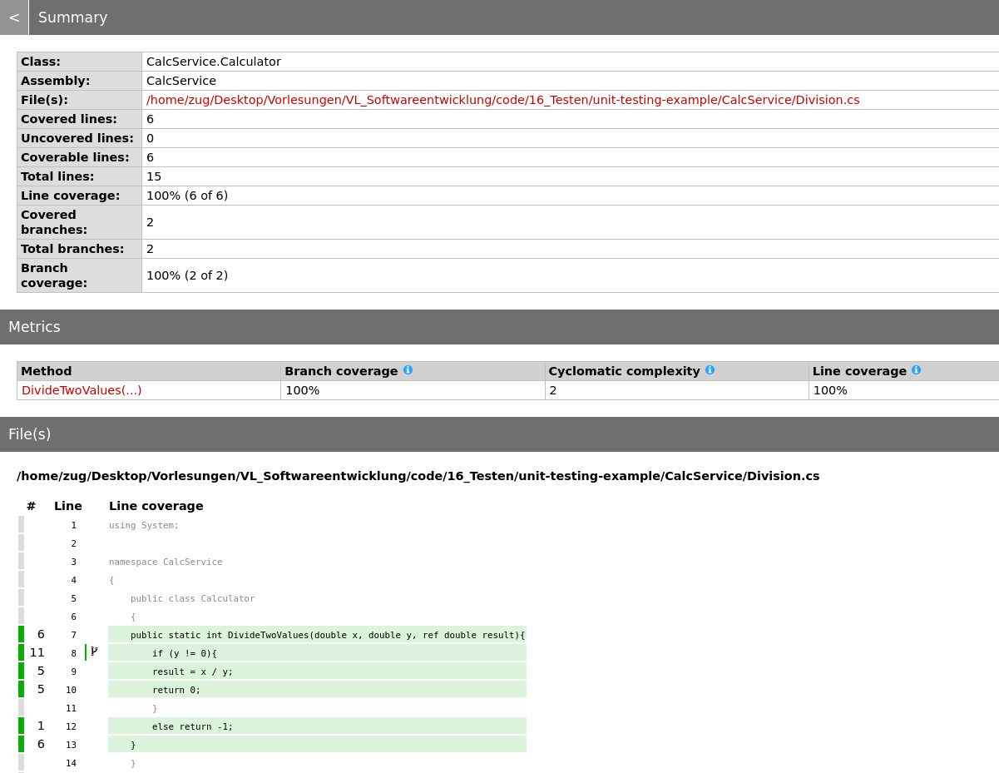

<!--

author:   Sebastian Zug, Galina Rudolf & André Dietrich
email:    sebastian.zug@informatik.tu-freiberg.de
version:  1.0.5
language: de
narrator: Deutsch Female

import: https://github.com/liascript/CodeRunner
        https://raw.githubusercontent.com/liascript-templates/plantUML/master/README.md
        https://raw.githubusercontent.com/liaTemplates/ExplainGit/master/README.md

icon: https://upload.wikimedia.org/wikipedia/commons/d/de/Logo_TU_Bergakademie_Freiberg.svg
-->

[](https://liascript.github.io/course/?https://github.com/TUBAF-IfI-LiaScript/VL_Softwareentwicklung/blob/master/16_Testen.md)

# Modellierung von Software

| Parameter                | Kursinformationen                                                                                                                                                                |
| ------------------------ | -------------------------------------------------------------------------------------------------------------------------------------------------------------------------------- |
| **Veranstaltung:**       | `Vorlesung Softwareentwicklung`                                                                                                                                                  |
| **Semester**             | `Sommersemester 2022`                                                                                                                                                            |
| **Hochschule:**          | `Technische Universität Freiberg`                                                                                                                                                |
| **Inhalte:**             | `Einbettung des Testens in den Softwareentwicklungsprozess`                                                                                                                      |
| **Link auf den GitHub:** | [https://github.com/TUBAF-IfI-LiaScript/VL_Softwareentwicklung/blob/master/16_Testen.md](https://github.com/TUBAF-IfI-LiaScript/VL_Softwareentwicklung/blob/master/16_Testen.md) |
| **Autoren**              | @author                                                                                                                                                                          |


---------------------------------------------------------------------

## Neues aus der GitHub Woche

                  {{0-1}}
****************************************************************

Wann arbeiten Sie üblicherweise?
-------------------------------

<!--
data-type="heatmap"
data-title="Commit Anzahl"
data-xlabel="Wochentage"
data-ylabel="Stunden des Tages"
-->
|            | 9   | 10  | 11  | 12  | 13  | 14  | 15  | 16  | 17  | 18  | 19  | 20  | 21  | 22  |
| ---------- | --- | --- | --- | --- | --- | --- | --- | --- | --- | --- | --- | --- | --- | --- |
| Montag     |     |     |     |     | 3   | 38  | 37  |     |     |     |     |     |     |     |
| Dienstag   |     |     | 36  | 36  |     | 15  | 1   |     |     |     |     | 1   |     | 1   |
| Mittwoch   | 19  | 12  | 1   |     |     |     |     | 3   |     |     |     |     |     |     |
| Donnerstag |     |     |     |     |     |     |     |     |     |     |     |     | 2   |     |
| Freitag    |     |     | 3   |     |     |     | 3   | 1   |     |     | 3   |     |     |     |


Zum Vergleich die Übungsslots:

 + Mo 14 Uhr
 + Di 14 Uhr
 + Di 11 Uhr
 + Mi 9:15

****************************************************************


             {{1-2}}
****************************************************************


Wie stabil sind die Teams?
-------------------------------

<!--
data-type="none"
data-title="Commit Anzahl"
data-transpose="false"
-->
| teamKey | Task 3                             | Task 4                                     |
| ------- | ----------------------------------- | ------------------------------------- |
| 0       | [0, 1]                              | <!-- style="background: coral"-->[0]  |
| 1       | [5]                                 | [5]                                   |
| 2       | [8, 7]                              | [8, 7]                                |
| 3       | <!-- style="background: red"-->  [] | <!-- style="background: red"-->[]     |
| 4       | [9, 10]                             | [9, 10]                               |
| 5       | [11, 12]                            | [11, 12]                              |
| 6       | [13, 14]                            | [13, 14]                              |
| 7       | [16, 15]                            | <!-- style="background: coral"-->[16] |
| 8       | [18, 19]                            | [18, 19]                              |
| 9       | [20, 21]                            | [20, 21]                              |
| 10      | [22, 23]                            | [22, 23]                              |
| 11      | [24, 25]                            | [24, 25]                              |
| 12      | [26, 27]                            | [26, 27]                              |
| 13      | [28, 29]                            | <!-- style="background: coral"-->[28] |
| 14      | [30, 31]                            | [30, 31]                              |
| 15      | [32, 33]                            | [32, 33]                              |
| 16      | [34, 35]                            | <!-- style="background: red"-->[]     |
| 17      | [36, 37]                            | [36, 37]                              |

****************************************************************

## Exkurs - Abhängigkeitsmanagment / Paketmanagement

> **Merke:** Erfinde das Rad nicht neu!

Wie schaffen es erfahrene Entwickler innerhalb kürzester Zeit Prototypen mit beeindruckender Funktionalität zu entwerfen? Sicher, die Erfahrung spielt hier eine Große Rolle aber auch die Wiederverwendung von existierendem Code. Häufig wiederkehrende Aufgaben wie zum Beispiel:

+ das Logging
+ der Zugriff auf Datenquellen
+ mathematische Operationen
+ Datenkapselung und Abstraktion
+ ...

werden bereits durch umfangreiche Bibliotheken implementiert und werden entsprechend nicht neu geschrieben.

Ok, dann ziehe ich mir eben die zugehörigen Repositories in mein Projekt und kann die Bibliotheken nutzen. In individuell genutzten Implementierungen mag das ein gangbarer Weg sein, aber das Wissen um die zugehörigen Abhängigkeiten - Welche Subbibliotheken und welches .NET Framework werden vorausgesetzt? -  liegt so nur implizit vor.

Entsprechend brauchen wir ein Tool, mit dem wir die Abhängigkeiten UND den eigentlichen Code kombinieren und einem Projekt hinzufügen können.
`NuGet` löst diese Aufgabe für .NET und schließt auch gleich die Mechanismen zur Freigabe von Code ein. NuGet definiert dabei, wie Pakete für .NET erstellt, gehostet und verarbeitet werden.

Ein `NuGet`-Paket ist eine gepackte Datei mit der Erweiterung `.nupkg` die:
+ den kompilierten Code (DLLs),
+ ein beschreibendes Manifest, in dem Informationen wie die Versionsnummer des Pakets, ggf. der Speicherort des Source Codes oder die Projektwebseite enthalten sind sowie
+ die Abhängigkeiten von anderen Paketen und dessen Versionen
enthalten sind
Ein Entwickler, der seinen Code veröffentlichen möchte generiert die zugehörige Struktur und läd diese auf einen `NuGet` Server. Unter dem [Link](https://www.nuget.org/) kann dieser durchsucht werden.

**Anwendungsbeispiel: Symbolisches Lösen von Mathematischen Gleichungen**

Eine entsprechende Bibliothek steht unter [Projektwebseite](https://symbolics.mathdotnet.com/). Das Ganze wird als `Nuget` Paket gehostet [MathNet](https://www.nuget.org/packages/MathNet.Symbolics/).

Unter der Annahme, dass wir `dotnet` als Buildtool benutzen ist die Einbindung denkbar einfach.

```
dotnet new console -o SymbolicMath
cd SymbolicMath
dotnet add package MathNet.Symbolics
Determining projects to restore...
Writing /tmp/tmpNsaYtc.tmp
info : Adding PackageReference for package 'MathNet.Symbolics' into project '/home/zug/Desktop/Vorlesungen/VL_Softwareentwicklung/code/16_Testen/ConditionalBuild/ConditionalBuild.csproj'.
info :   GET https://api.nuget.org/v3/registration5-gz-semver2/mathnet.symbolics/index.json
...
```

Danach findet sich in unserer Projektdatei `.csproj` ein entsprechender Eintrag

```xml
<Project Sdk="Microsoft.NET.Sdk">

  <PropertyGroup>
    <OutputType>Exe</OutputType>
    <TargetFramework>net5.0</TargetFramework>
  </PropertyGroup>

  <ItemGroup>
    <PackageReference Include="MathNet.Symbolics" Version="0.24.0" />
  </ItemGroup>
</Project>
```

```csharp PreprocessorConsts.cs
using System;
using System.Collections.Generic;
using MathNet.Symbolics;
using Expr = MathNet.Symbolics.SymbolicExpression;  // Platzhalter für verkürzte Schreibweise

class Program
{
  static void Main(string[] args)
  {
    Console.WriteLine("Beispiele für die Verwendung des MathNet.Symbolics Paketes");
    var x = Expr.Variable("x");
    var y = Expr.Variable("y");
    var a = Expr.Variable("a");
    var b = Expr.Variable("b");
    var c = Expr.Variable("c");
    var d = Expr.Variable("d");
    Console.WriteLine("a+a =" + (a + a + a).ToString());
    Console.WriteLine("(2 + 1 / x - 1) =" + (2 + 1 / x - 1).ToString());
    Console.WriteLine("((a / b / (c * a)) * (c * d / a) / d) =" + ((a / b / (c * a)) * (c * d / a) / d).ToString());
    Console.WriteLine("Der zugehörige Latex Code lautet " + ((a / b / (c * a)) * (c * d / a) / d).ToLaTeX());
  }
}
```
```-xml  PreprocessorConsts.csproj
<Project Sdk="Microsoft.NET.Sdk">
  <PropertyGroup>
    <OutputType>Exe</OutputType>
    <TargetFramework>net5.0</TargetFramework>
  </PropertyGroup>
  <ItemGroup>
    <PackageReference Include="MathNet.Symbolics" Version="0.24.0" />
  </ItemGroup>
</Project>
```
@LIA.eval(`["Program.cs", "project.csproj"]`, `dotnet build -nologo`, `dotnet run -nologo`)


## Softwarefehler

                                    {{0-1}}
*******************************************************************************

Zu Erinnerung an die bereits diskutierten Softwarefehler ...

> 1999 verpasste die NASA-Sonde Mars Climate Orbiter den Landeanflug auf den Mars, weil die Programmierer unterschiedliche Maßsysteme verwendeten (ein Team verwendete das metrische und das andere das angloamerikanische) und beim Datenaustausch es so zu falschen Berechnungen kam. Eine Software wurde so programmiert, dass sie sich nicht an die vereinbarte Schnittstelle hielt, in der die metrische Einheit Newton × Sekunde festgelegt war. Die NASA verlor dadurch die Sonde. [Quelle](https://www.bernd-leitenberger.de/mco.shtml)

Softwarefehler sind sowohl sicherheitstechnisch wie ökonomisch ein erhebliches Risiko. Eine Studie der Zeitschrift iX ermittelte 2013 für Deutschland folgende Werte:

+ Ca. 84,4 Mrd. Euro betragen die jährlichen Verluste durch Softwarefehler in Mittelstands- und Großunternehmen
+ Ca. 14,4 Mrd. Euro jährlich (35,9 % des IT-Budgets) werden für die Beseitigung von Programmfehlern verwendet;
+ Ca. 70 Mrd. Euro betragen die Produktivitätsverluste durch Computerausfälle aufgrund fehlerhafter Software

*******************************************************************************


                                    {{1-2}}
*******************************************************************************

**Was sind Softwarefehler eigentlich?**

Ein Programm- oder Softwarefehler ist, angelehnt an die allgemeine Definition für „Fehler“

> „Nichterfüllung einer Anforderung“ [EN ISO 9000:2005]

Konkret definiert sich der Fehler danach als

>  „Abweichung des IST (beobachtete, ermittelte, berechnete Zustände oder Vorgänge) vom SOLL (festgelegte, korrekte Zustände und Vorgänge), wenn sie die vordefinierte Toleranzgrenze [die auch 0 sein kann] überschreitet.“

Im Rahmen dieser Veranstaltung lassen wir Lexikalische Fehler und Syntaxfehler außen vor. Diese sind in der Regel über den Compiler identifizierbar. Darüber hinaus existieren aber :

| Fehlertyp               | Folgen                                                                                                                                                          |
| ----------------------- | --------------------------------------------------------------------------------------------------------------------------------------------------------------- |
| Logisch/semantische Fehler      | Anweisung ist zwar syntaktisch fehlerfrei, aber inhaltlich trotzdem fehlerhaft (plus statt minus, kleiner statt kleiner gleich, fehlende Synchronisation, usw.) |
| Designfehler            | Strukturelle Mängel auf der Modul oder Systemebene, die das Zusammenspiel der Komponenten, deren Erweiterung, usw. verhindern.                                  |
| Fehler im Bedienkonzept | Unintuitive Benutztung, das Programm "fühlt sich komisch an"                                                                                                    |

Darüber hinaus ist es wichtig zwischen Laufzeit- und Designzeitfehlern zu unterscheiden.

*******************************************************************************

                                    {{2-3}}
*******************************************************************************

**Wann entstehen Fehler im Projekt?**

Problem- und Systemanalyse:

+ Die Anforderungen und Qualitätsmerkmale werden nicht festgelegt.
+ Es fehlen eindeutige Begriffsdefinitionen.

Systementwurf:

+ Die Systemarchitektur ist gar nicht oder nur mit großem Aufwand erweiterbar.
+ Das System ist nicht modular aufgebaut, die Daten sind nicht gekapselt.

Feinentwurf:

+ Schnittstellen sind nicht hinreichend spezifiziert
+ Interaktionsmodelle weisen Lücken auf

Codierung

+ Programmier-Standards bzw. -Richtlinien werden nicht beachtet.
+ Die Namensvergabe ist ungünstig.

Betrieb und Wartung:

+ Die Dokumentation fehlt ganz, ist veraltet oder nicht adäquat.
+ Die Schulung der Anwender wird vernachlässigt.
+ Das Konfigurationsmanagement ist unzureichend.

<!--
style="width: 100%; max-width: 560px; display: block; margin-left: auto; margin-right: auto;"
-->
````````````

          ^
 Fehler-  | +---------+
 kosten   | |         |
          | |         |
          | |         |
          | |         |
          | |         +----------+
          | |         |          |
          | |         |          +----------+
          | |         |          |          +----------+
          | |         |          |          |          +---------+
          | | Analyse | System-  | Imple-   | Integra- | Betrieb |
          | |         | entwurf  | mentier- | tion &   | und     |
          | |         |          | ung      | Tests    | Wartung |
          ----------------------------------------------------------->
                                              Software Lebenszyklus


````````````

*******************************************************************************

## Testen als Teil der Qualitätssicherung


                                    {{0-1}}
*******************************************************************************

**Welche Tests werden in das Projekt integriert?**

<!--
style="width: 100%; max-width: 560px; display: block; margin-left: auto; margin-right: auto;"
-->
````````````

         +------------------------------------------------------>   Zeit
         |
         |      Analyse                             Abnahmetest       KUNDE
         |          \                                   ^
         |           v                                 /          -.
         |        Grobentwurf                   Systemtests        |
         |             \                             ^             |
         |              v                           /              |
         |           Feinentwurf             Integrationstests      \  ENTWICKLER
 Detail- |                \                       ^                 /
 grad    |                 v                     /                 |
         |             Implementierung  --> Modultests             |
         |                                                        -'
         v
````````````

| Bezeichnung                                | Ebene                                                                                                                          | Durchführender / Ziel                                                                                                                                     |
| ------------------------------------------ | ------------------------------------------------------------------------------------------------------------------------------ | --------------------------------------------------------------------------------------------------------------------------------------------------------- |
| Modultest, Komponententest oder Unittest   | Funktionalität innerhalb einzelner abgrenzbarer Teile der Software (Module, Programme oder Unterprogramme, Units oder Klassen) | häufig durch den Softwareentwickler selbst, Nachweis der technischen Lauffähigkeit und korrekter fachlicher (Teil-) Ergebnisse                            |
| Integrationstest, Interaktionstest         | Zusammenarbeit voneinander abhängiger Komponenten                                                                              | Testschwerpunkt liegt auf den Schnittstellen der beteiligten Komponenten und soll korrekte Ergebnisse über komplette Abläufe hinweg nachweisen            |
| Systemtest                                 | Gesamtes System wird gegen die gesamten Anforderungen (funktionale und nicht-funktionale Anforderungen) getestet               | Test in einer Testumgebung statt / wird mit Testdaten  durchgeführt - Simulation einer realistischen Umgebung                                             |
| Abnahmetest, Verfahrenstest, Akzeptanztest | Testen der gelieferten Software durch den Kunden                                                                               | Rechtlich bindende Evaluation der Software und deren Bezahlung, unter Umständen bereits auf der Produktionsumgebung mit Kopien aus Echtdaten durchgeführt |

*******************************************************************************

                                            {{1-2}}
*******************************************************************************

**Warum geht es dann trotzdem schief?**

+ Es ist angeblich keine Zeit für systematische Tests vorhanden (Termindruck).
+ Die Notwendigkeit für systematische Tests wird nicht erkannt.
+ Die Tests werden manuell realisiert.
+ Die Erstellung von Testspezifikationen für systematische Tests wird nicht entwicklungsbegleitend durchgeführt.
+ Die Testebenen weisen eine unterschiedliche Realisierung auf (Modultests top, Systemtests flop)

*******************************************************************************

### Definition

Es gibt unterschiedliche Definitionen für den Softwaretest:

> „the process of operating a system or component under specified conditions, observing or recording the results and making an evaluation of some aspects of the system or component.“ [ANSI/IEEE Std. 610.12-1990 ]

> „Test […] der überprüfbare und jederzeit wiederholbare Nachweis der Korrektheit eines Softwarebausteines relativ zu vorher festgelegten Anforderungen“ ist. [^Denert]

> "Unter Testen versteht man den Prozess des Planens, der Vorbereitung und der Messung, mit dem Ziel, die Eigenschaften eines IT-Systems festzustellen und den Unterschied zwischen dem tatsächlichen und dem erforderlichen Zustand aufzuzeigen. [^Pol]

Welche Unterschiede sehen Sie in den Definitionen?

[^Denert]:  Ernst Denert: Software-Engineering. Methodische Projektabwicklung. Springer, Berlin u. a. 1991, ISBN 3-540-53404-0.

[^Pol]: Martin Pol, Tim Koomen, Andreas Spillner: Management und Optimierung des Testprozesses. Ein praktischer Leitfaden für erfolgreiches Testen von Software mit TPI und TMap. 2., aktualisierte Auflage. dpunkt.Verlag, Heidelberg 2002, ISBN 3-89864-156-2.

### Ablauf beim Testen

<!--
style="width: 100%; max-width: 560px; display: block; margin-left: auto; margin-right: auto;"
-->
````````````
                   +------------------------------------------------+
                   |                                                |
             +-----+-----+      +-----------+      +------------+   |    +------------+
          +->| Testfälle |-+ +->| Testdaten |-+ +->| Ergebnisse |-+ | +->| Protokolle |
          |  +-----------+ | |  +-----------+ | |  +------------+ | | |  +------------+
          |                | |                | |                 | | |
          |                | |                | |                 | | |
          |                | |                | |                 | | |
          |                v |                v |                 v v |
  .---------------.  .---------------.  .--------------.  .---------------.
  | Entwerfen der |->| Erstellen der |->| Testaus-     |->| Vergleich der |
  | Testfälle     |  | Testdaten     |  | führung      |  | Ergebnisse    |
  .---------------.  .---------------.  .--------------.  .---------------.

````````````
Abbildung motiviert durch [^Somm01]

[^Somm01]:  Ian Sommerville: Software Engineering, Pearson Education, 6. Auflage, 2001

1. Entwerfen der Testfälle

+ Analyse der Anforderungen, Dokumentationen um erforderliche Testbedingungen festzulegen
+ Nachvollziehbarkeit der Entscheidungen, Weiterentwicklung bei Anpassungen in den Anforderungen bzw. der Spezifikation

2. Spezifizieren der Testfälle

+ Ausarbeitung der eigentlichen Beschreibung der Testfälle und Testdaten
+ Definition der erwarteten Resultate

3. Testausführung

+ (variable) Reihung der Testfälle  unter Berücksichtigung von Vor- und Nachbedingungen um Quereffekte abzubilden

4. Evaluation der Ergebnisse

### Klassifikation Testmethoden

<!--
style="width: 100%; display: block; margin-left: auto; margin-right: auto;"
-->
````````````
                            Prüfmethoden
                                  |
                +-----------------+------------------+
                |                                    |
            statisch                              dynamisch
                |                                    |
    +-----------+----+              +----------------+----------------+
    |                |              |                |                |
  verifi-         analy-         struktur-     spezifikations-    diversifi-
  zierend         sierend        orientiert    orientiert         zierend
                               (white box)     (black box)
                                    |
                            +-------+--------+
                            |                |
                      kontrollfluss-     datenfluss-
                      orientiert         bezogen                               .


````````````
Abbildung motivierte aus [^Liggesmeyer]

**Statische Code Analysen**

Statische Code-Analyse ist ein statisches
Software-Testverfahren, das zur Übersetzungszeit durchgeführt wird. Der
Quelltext wird hierbei einer Reihe formaler Prüfungen unterzogen, bei denen
bestimmte Sorten von Fehlern entdeckt werden können, noch bevor die
entsprechende Software (z. B. im Modultest) ausgeführt wird. Die Methodik gehört
zu den falsifizierenden Verfahren, d. h., es wird die Anwesenheit von Fehlern
bestimmt.

+ **Codeanalyse** ... In Anlehnung an das klassische Programm Lint wird der Vorgang der Analyse eines Codefragments auch als linten  (englisch linting) bezeichnet.

    Das folgende Beispiel zeigt die Ausgabe des Tools SonarLinter angewendet auf die
    initiale Implementierung einer Konsolenanwendung unter Visual Studio 2017. Welche
    Fehler können Sie ausmachen?


Eine Übersicht zu den Standard-Regeln findet sich unter [Link](https://github.com/DotNetAnalyzers/StyleCopAnalyzers/blob/master/DOCUMENTATION.md).

+ Codereviews ... Reviews sind manuelle Überprüfungen der Arbeitsergebnisse der Softwareentwicklung. Jedes Arbeitsergebnis kann einer Durchsicht durch eine andere Person unterzogen werden.

    Der untersuchte Gegenstand eines Reviews kann verschieden sein. Es wird vor
    allem zwischen einem Code-Review (Quelltext) und einem Architektur-Review
    (Softwarearchitektur, insbesondere Design-Dokumente) unterschieden.

**Dynamische Code Analysen**

Dynamische Software-Testverfahren sind bestimmte Prüfmethoden, um mit
Softwaretests Fehler in der Software aufzudecken. Besonders sollen
Programmfehler erkannt werden, die in Abhängigkeit von dynamischen
Laufzeitparametern auftreten, wie variierende Eingabeparameter, Laufzeitumgebung
oder Nutzer-Interaktion.
Wesentliche Aufgabe der einzelnen Verfahren ist die Bestimmung geeigneter Testfälle für den Test der Software.

+ strukturorientiert ... Strukturorientierte Verfahren bestimmen Testfälle auf Basis des Softwarequellcodes (Whiteboxtest). Dabei steht entweder die enthaltenen Daten oder aber die Kontrollstruktur, die die Verarbeitung der Daten steuert, im Fokus.

+ spezifikationsorientiert ...  die sogenannten Black-Box Verfahren werden zum Abgleich des vorgegebenen, spezifizierten und des realen Verhaltens einer Methode genutzt. Beim Modultest wird z. B. gegen die Modulspezifikation getestet, beim Schnittstellentest gegen die Schnittstellenspezifikation und beim Abnahmetest gegen die fachlichen Anforderungen, wie sie etwa in einem Pflichtenheft niedergelegt sind.

+ diversifizierend .. Diese Tests analysieren die Ergebnisse verschiedener Versionen einer Software gegeneinander. Es findet entsprechend kein Vergleich zwischen den Testergebnissen und der Spezifikation statt! Zudem kann im Gegensatz zu den funktions- und strukturorientierten Testmethoden kein Vollständigkeitskriterium definiert werden. Die notwendigen Testdaten werden mittels einer der anderen Techniken, per Zufall oder Aufzeichnung einer Benutzer-Session erstellt.

[^Liggesmeyer]: Peter Liggesmeyer, "Software-Qualität - Testen, Analysieren und Verifizieren von Software", Springer, 2002

## Planung von Tests

Nehmen wir an, wir hätten eine Klasse MyMathFunctions mit zwei Methoden implementiert und sollen diese testen ...

```csharp
static class MyMathFunctions{
  //Fakultät der Zahl i
  public static int fak(int i) {...}
  // Grösstergemeinsamer Teiler von i, j und k
  public static int ggt(int i, int j, int k) {...}
}
```

> **Frage:** Mit wie vielen Tests könnten wir die Korrektheit der Implementierung nachweisen?

                 {{1-2}}
********************************************************************************

Ein vollständiges Testen aller `int` Werte ($2^{31}$ bis $2^{31}-1$) bedeutet für die Funktion `fak()` $2^{32}$ und für `ggt()` $2^{32} \cdot 2^{32} \cdot 2^{32}$ Kombinationen. Testen aller möglichen Eingaben ist damit nicht möglich. Für Variablen mit unbestimmtem Wertebereich (`string`) lässt sich nicht einmal die Menge der möglichen Kombinationen darstellen.

********************************************************************************

### Black-Box-Testing / Spezifikationsorientiert
> Black-Box-Testing ... Grundlage der Testfallentwicklung ist die Spezifikation
> des Moduls. Die Interna des Softwareelements sind nicht bekannt.

Die Güte der Testfälle ist definiert über die Abdeckung möglicher Kombinationen
der Eingangsparameter.

Für Black-Box-Testing existieren unterschiedliche Ausprägungen:

+ Äquivalenzklassenanalyse
+ Grenzwertanalyse [Link](https://www.youtube.com/watch?v=GshMbff3mzw)
+ Zustandsbasierte Testmethoden

Problematisch ist dabei, dass spezifische Lösungen, wie zum Beispiel in folgendem Fall. Der Entwickler hat hier beschlossen die Performance der Berechnung der Fakultät zu steigern, um die Performance des Algorithmus für Werte kleiner 5 zu verbessern (hypothetisches Beispiel!).

```csharp
static class MyMathFunctions{
  public int fak (int i){
    if ( i==1 ) return 0;
    elseif (i == 2) return 1;
    elseif  ... Ergebnisse für 3 und 4 ...
    elseif (i == 5) return 120;
    else return i * fak(i-1);
  }
}
```

Mit den alleinigen Testfällen `fak(5)==120`, `fak(6)==720` und `fak(10)==3628800` bleiben mögliche Fehler für `fak(1)` und `fak(2)` verborgen.

### White-Box-Testing / Strukturorientiert

> White-Box-Testing ... beim „quelltextbasierten Testen“ sind die Interna des
> getesteten Softwareelements bekannt und werden zur Bestimmung der Testfälle
> verwendet

White-Box-Testing-Verfahren zerlegen das Programm (statisch oder dynamisch)
entsprechend dem Kontrollfluss. Die Güte der Testfälle wird danach beurteilt,
wie groß der Anteil der abgedeckten Programmpfade ist. Die Bewertung kann dabei
anhand differenzierter Metriken erfolgen:

+ Zeilenabdeckung
+ Anweisungsüberdeckung
+ Zweigüberdeckung
+ Pfadüberdeckung
+ ...

**C_0 Anweisungsüberdeckung**

Anweisungsüberdeckung (auch $C_0$-Test genannt) zerlegt das Programm statisch in
seine Anweisungen und bestimmt den Anteil der in den Testfällen berücksichtigten
Anweisungen. Üblich ist eine Prüfung von 95%-100% aller Anweisungen durch als
$C-0$-Kriterium anzustreben:

$$
C_0 = \frac{Anzahl überdeckte Anzahl}{Gesamtanzahl der Anweisungen}
$$

```csharp
static class MyMathFunctions{
  public int fak (int i){                    // Anweisung
    if ( i==1 ) return 0;                    // 1
    elseif (i == 2) return 1;                // 2
    elseif  ... Ergebnisse für 3 und 4 ...   // 3 - 4
    elseif (i == 5) return 120;              // 5
    else return i * fak(i-1);                // 6
  }
}
```

Der oben genannten Black-Box-Test $i = \{5, 6, 10\}$ adressierte lediglich 2
der Anweisungen und generiert damit ein $C_0 = \frac{2}{6} = 0.33$. Mit dem Wissen
um die Codestruktur, kann der White-Box-Test sehr schnell den Nachweis erbringen,
dass das gezeigte Black-Box-Vorgehen nur unzureichend die Qualität des Codes
abprüft.

```csharp
static class MyMathFunctions{
  public int fak (int i){                    // Anweisung
    int [] facArray = new int [10];          // 1
    facArray[0] = 1;                         // 2
    facArray[1] = 1;
    ...
    facArray[9] = 1;                         // 9
    // besser:
    // int [] facArray = new int[] { 1, 3, 5, 7, 9 };
    if ( i<10 ) return fakArray[i];          // 10 + 11
    else return i * fak(i-1);                // 12
  }
}
```

Mit dem Testfall $i = 1$ lassen sich hingegen vermeindlich $11/12 = 0.91$ der
Anweisungen abdecken, die Fehleinschätzung ist aber offensichtlich. Gleichwohl
sind die fest hinterlegten Werte aus Erfahrung heraus auch besonders anfällig
für Copy-&-Paste-Fehler.

**C_1 Zweigüberdeckungstest**

Der Zweigüberdeckungstest  umfasst den
Anweisungsüberdeckungstest vollständig. Für den C1–Test müssen strengere
Kriterien erfüllt werden als beim Anweisungsüberdeckungstest. Im Bereich des
kontrollflussorientierten Testens wird der Zweigüberdeckungstest als
Minimalkriterium angewendet. Mit Hilfe des Zweigüberdeckungstests lassen sich
nicht ausführbare Programmzweige aufspüren. Anhand dessen kann man dann
Softwareteile, die oft durchlaufen werden, gezielt optimieren.

Die [Zyklomatische Komplexität](https://de.wikipedia.org/wiki/McCabe-Metrik) gibt an, wie viele Testfälle höchstens nötig sind, um eine Zweigüberdeckung zu erreichen.

$$
C_1 = \frac{Anzahl überdeckten Zweige}{Gesamtanzahl der Zweige}
$$

```csharp
static class MyMathFunctions{
  public int fak (int i){                    // Verzweigungen
    int [] facArray = new int [10];          //
    facArray[0] = 1;                         //
    facArray[1] = 1;
    ...
    facArray[9] = 1;                         //
    // besser:
    // int [] facArray = new int[] { 1, 3, 5, 7, 9 };
    if ( i<10 ) return fakArray[i];          // 1. Verzweigung
    else return i * fak(i-1);                //
  }
}
```

Mit dem Testfall $i = 1$ ergibt sich eine $C_1$-Abdeckung von $0.5$.

**C_2 Pfadüberdeckung**

Das $C_1$ Kriterium berücksichtigt keine Schleifen im zu untersuchenden Code.
Der "Pfad" beschreibt gegenüber dem "Zweig" aber eben auch die mehrfache
Ausführung ein und des selben Zweiges. Diese Untersuchung muss entsprechend
Schleifen in variabler Durchlaufzahl umsetzten.

**C_3 Bedingungsüberdeckungstest**

$C_3$ Tests extrahieren die Bedingungen die zum Eintritt in die Schleifen führen
und generieren Testfälle, die alle Kombinationen abdecken.

```csharp
static class MyMathFunctions{
  public int fak (int i){                    // Verzweigungen
    boolean a, b;
    if (a || b) { ... }
    else { ... }
  }
}
```
<!-- data-type="none" -->
|      | Test                                         | Testfälle im Beispiel                |
| ---- | -------------------------------------------- | ------------------------------------ |
| C_3a | Einfachbedingungsüberdeckungstest            | 2 (a = b = true sowie a = b = false) |
| C_3b | Mehrfachbedingungsüberdeckungstest           | $2^n$                                |
| C_3c | minimaler Mehrfachbedingungsüberdeckungstest | $<=2^n$                              |


## Und jetzt konkret!


> **Zu Erinnerung:** Testen ist der Vergleich eines Ergebnisses mit einem erwarteten Resultat.

### Exkurs: Attribute in C#

Im Folgenden werden wir Atttribute als Hilfsmittel verwenden. Entsprechend soll an dieser Stelle ein kurzer Einschub die Möglichkeiten dieser Zuordnung von Metainformationen zum C# Code verdeutlichen.

Attribute erlaube es Zusatzinformationen oder Bedingungen in Code (Assemblys, Typen, Methoden, Eigenschaften usw.) einzubinden. Nach dem Zuordnen eines Attributs zu einer Programmentität kann das Attribut zur Laufzeit mit einer Technik namens Reflektion abgefragt werden.

In C# sind Attribute Klassen, die von der Attribute-Basisklasse erben. Alle Klassen, die von Attribute erben, können als eine Art von „Tag“ für andere Codeelemente verwendet werden. Beispielsweise gibt es das Attribut ObsoleteAttribute. Mit diesem Attribut wird gekennzeichnet, dass der Code veraltet ist und nicht mehr verwendet werden sollte.

Beispiele für Standardattribute sind:

| Name                                                                     | Bedeutung                                                                                                                                                          |
| ------------------------------------------------------------------------ | ------------------------------------------------------------------------------------------------------------------------------------------------------------------ |
| `[Obsolete]`, `[Obsolete("ThisClass is obsolete. Use ThisClass2 instead.")`] |                                                                                                                                                                    |
| `[Conditional("Test")]`                                                    | Wenn die Zeichenfolge nicht einer #define-Anweisung entspricht, werden alle Aufrufe dieser Methode (aber nicht die Methode selbst) durch den C#-Compiler entfernt. |

Attribute werden in rechteckigen Klammern den jeweiligen Codeelementen vorangestellt. Es können mehrere davon kombiniert werden.

```csharp   ConditionalExample.cs
#define CONDITION1
#define CONDITION2
using System;
using System.Diagnostics;

class Test
{
  static void Main()
  {
    Console.WriteLine("Standard Code ");
    Method0(0);
    Console.WriteLine("Calling Method1");
    Method1(3);
    Console.WriteLine("Calling Method2");
    Method2();
  }

  public static void Method0(int x)
  {
      Console.WriteLine("Here we run actual algorithm.");
  }

  [Conditional("CONDITION1")]
  public static void Method1(int x)
  {
      Console.WriteLine("CONDITION1 is defined");
  }

  [Conditional("CONDITION1"), Conditional("CONDITION2")]
  public static void Method2()
  {
      Console.WriteLine("CONDITION1 or CONDITION2 is defined");
  }
}
```
@LIA.eval(`["main.cs"]`, `mono main.cs`, `mono main.exe`)

Die Festlegung der Kompilierungsvorgänge anhand von Hinhalten der eigentlichen Code Dateien scheint "unglücklich". Es bietet sich natürlich an, die zugehörigen Konfigurationen in unsere Projektdateien auszulagern.

```csharp PreprocessorConsts.cs
using System;
using System.Diagnostics;

class Test
{
  static void Main()
  {
    Console.WriteLine("Standard Code ");
    Method0(0);
    Console.WriteLine("Calling Method1");
    Method1(3);
    Console.WriteLine("Calling Method2");
    Method2();
  }

  public static void Method0(int x)
  {
      Console.WriteLine("Here we run actual algorithm.");
  }

  [Conditional("CONDITION1")]
  public static void Method1(int x)
  {
      Console.WriteLine("CONDITION1 is defined");
  }

  [Conditional("CONDITION1"), Conditional("CONDITION2")]
  public static void Method2()
  {
      Console.WriteLine("CONDITION1 or CONDITION2 is defined");
  }
}
```
```-xml  PreprocessorConsts.csproj
<Project Sdk="Microsoft.NET.Sdk">
  <PropertyGroup>
    <OutputType>Exe</OutputType>
    <TargetFramework>net5.0</TargetFramework>
    <DefineConstants>CONDITION2;</DefineConstants>
  </PropertyGroup>
</Project>
```
@LIA.eval(`["Program.cs", "project.csproj"]`, `dotnet build -nologo`, `dotnet run -nologo`)


### Idee 1: Eigenen Testmethoden

```csharp          ManuellesTesten
using System;

// Zu testende Klasse
public class Calculator
{
  public static int DivideTwoValues(double x, double y, ref double result){
    if (y != 0){
      result = x / y;
      return 0;
    }
    else return -1;
  }
}

// Testklasse
public class TestCalculator{
  public static void Test_DivideMethod(){
    double result = 0;
    int state = Calculator.DivideTwoValues(3,4, ref result);
    if ((state == 0) & (result == 0.75))
    {
      Console.WriteLine("Test bestanden !");
    }
    else{
      Console.WriteLine("Test fehlgeschlagen");
    }
  }
}

// Anwendungsprogramm
public class Program
{
  public static void Main(string[] args)
  {
    //double result = 0;
    //int state = Calculator.DivideTwoValues(3,4, ref result);
    //Console.WriteLine($"Das Ergebnis lautet {result}, der State {state}.");
    TestCalculator.Test_DivideMethod();
  }
}
```
@LIA.eval(`["main.cs"]`, `mono main.cs`, `mono main.exe`)

Welche Funktionalität fehlt Ihnen in diesem Setup? Welche weitergehenden Features
würden Sie für unsere Testmethoden vorschlagen.

### Idee 2: Test-Frameworks

```csharp    TestCase MStest
[TestClass]   // <-- Framework spezifisch
public class CalculatorTests
{
    [TestMethod]   // <-- Framework spezifisch
    public void TestMethod1()
    {
        // Arrange
        double result;
        double x = 3, y = 4;
        int state;
        double expected = 0.75;

        // Act
        int state = Calculator.DivideTwoValues(x, y, ref result);

        // Assert
        Assert.AreEqual(result, expected);
        //       ^---- Framework specifisch
    }
}
```

Vorteile:

+ Leistungsfähige API (automatisierte Tests, variable Input-Parameter, Berücksichtigung von Exceptions)
+ "Standardisiertes" Nutzungskonzept
+ Integration in die Entwicklungsumgebungen

Nachteil:

+ verschiedene Interpretationen und Performance der Frameworks

Die wichtigsten Tools unter C# sind [xUnit](https://xunit.net/), [nunit](https://nunit.org/), [MSTest](https://docs.microsoft.com/de-de/dotnet/core/testing/unit-testing-with-mstest). Einen guten Überblick zum Vergleich der Schlüsselworte liefert [Link](http://www.anarsolutions.com/automated-unit-testing-tools-comparison/)

Hierzu nutzen wir das xunit Framework. Eine Folge von Tests für unsere `DivideTwoValues()` Methode könnte dann wie folgt aussehen.

```csharp
using Xunit;

public class Test_DivideTwoValues
{
    [Fact]
    public void Check_StateEqualPositiveInputs()
    {
        // Arrange
        double result = 0;
        double dividend = 5;
        double divisor = dividend;
        int expected = 0;
        // Act
        var state = Calculator.DivideTwoValues(dividend, divisor, ref result);
        // Assert
        Assert.Equal(expected, state);
    }

    [Fact]
    public void Check_StateZeroAsDivended()
    {
        // Arrange
        double result = 0;
        double dividend = 5;
        double divisor = 0;
        int expected = -1;
        // Act
        var state = Calculator.DivideTwoValues(dividend, divisor, ref result);
        // Assert
        Assert.True(expected == state);
    }

    [Theory]                                             // Übergabe von variablen Parametersets
    [InlineData(10, 2, 5)]
    [InlineData(5, 2, 2.5)]
    [InlineData(double.MaxValue, double.MaxValue, 1)]    // Edge Cases
    [InlineData(double.MaxValue, 1, double.MaxValue)]
    public void Check_ResultCalculation(double dividend, double divisor, double expected)
    {
        // Arrange
        double result = 0;
        // Act
        var state = Calculator.DivideTwoValues(dividend, divisor, ref result);
        // Assert
        Assert.Equal(expected, result);
    }
}
```

Wie setzen wir das Ganze um?

```
dotnet new sln -o unit-testing-example
cd unit-testing-example
dotnet new classlib -o CalcService         // Code der Divisionsoperation einfügen
mv CalcService/Class1.cs CalcService/Division.cs
dotnet sln add ./CalcService/CalcService.csproj
dotnet new xunit -o CalcService.Tests      // obigen Testcode einfügen
dotnet add ./CalcService.Tests/CalcService.Tests.csproj reference ./CalcService/CalcService.csproj
dotnet sln add ./CalcService.Tests/CalcService.Tests.csproj
```

Damit entsteht eine `solution`, die zwei `project` umfasst - die eigentliche Anwendung als `classlib` und die Testfälle.

```
.
├── CalcService
│   ├── CalcService.csproj
│   ├── Division.cs
├── CalcService.Tests
│   ├── CalcService.Tests.csproj
│   └── UnitTest1.cs
└── unit-testing-example.sln
```

Das Ausführen der Tests ist nun mit `dotnet test` möglich.

Eine automatische Generierung von Test Merkmalen ist mit Hilfe zusätzlicher Tools, die in dotnet integriert sind möglich.

```
dotnet add package coverlet.collector
dotnet tool install --global dotnet-reportgenerator-globaltool
dotnet tool install --global coverlet.console

dotnet test --collect:"XPlat Code Coverage" --results-directory:"./.coverage"
reportgenerator "-reports:.coverage/**/*.cobertura.xml" "-targetdir:.coverage-report/" "-reporttypes:HTML;"
```

Das Argument "XPlat Code Coverage" bezieht sich auf das Zwischenformat der Darstellung. Das `./.coverage` dient zur Angabe des Verzeichnisses, in dem die Ergebnisse gespeichert werden sollen. Wenn keines angegeben wird, wird standardmäßig ein TestResults-Verzeichnis innerhalb jedes Projekts verwendet. `reportgenerator` erzeugt dann die entsprechende html-Repräsentation.


