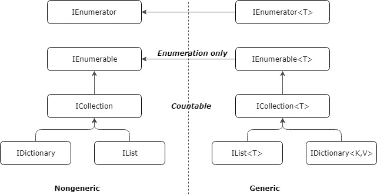

<!--

author:   Sebastian Zug & André Dietrich
email:    zug@ovgu.de   & andre.dietrich@ovgu.de
version:  0.0.1
language: de
narrator: Deutsch Female

import: https://raw.githubusercontent.com/LiaTemplates/Rextester/master/README.md
import: https://raw.githubusercontent.com/LiaTemplates/WebDev/master/README.md
-->

# Vorlesung Softwareentwicklung - 16 - Generics

--------------------------------------------------------------------
Link auf die aktuelle Vorlesung im Versionsmanagementsystem GitHub

https://github.com/liaScript/CsharpCourse/blob/master/16_Generics.md

Die interaktive Form ist unter diese Link zu finden ->
[LiaScript Vorlesung 16](https://liascript.github.io/course/?https://raw.githubusercontent.com/liaScript/CsharpCourse/master/16_Generics.md#1)

---------------------------------------------------------------------

**Wie weit sind wir schon gekommen?**

c# Schlüsselwörter:

| abstract    | as       | base     |`bool`      |`break`     |`byte`     |
|`case`       |`catch`   | char     |`checked`   |`class`     | const     |
|`continue`   |`decimal` | default  | delegate   |`do`        |`double`   |
|`else`       |`enum`    | event    | explicit   | extern     |`false`    |
|`finally`    | fixed    |`float`   |`for`       |`foreach`   |`goto`     |
|`if`         | implicit | in       |`int`       | interface  |`internal` |
| is          | lock     |`long`    |`namespace` |`new`       | null      |
| object      | operator |`out`     | override   |`params`    |`private`  |
| protected   |`public`  | readonly |`ref`       |`return`    |`sbyte`    |
| sealed      |`short`   | sizeof   | stackalloc |`static`    |`string`   |
|`struct`     |`switch`  |`this`    |`throw`     |`true`      |`try`      |
| typeof      |`uint`    |`ulong`   |`unchecked` | unsafe     |`ushort`   |
|`using`      | virtual  |`void`    | volatile   |`while`     |           |


Auf die Auführung der kontextabhängigen Schlüsselwörter wie `where` oder
`ascending` wurde hier verzichtet.

---

## Kontrollfragen

*1. Hier stehen jetzt Ihre Fragen ...*

---------------------------------------------------------------------

## 0. Motivation

Warum das alles? Wieso brauchen wir generische Typen? Kann ich nicht die Boxing- und
Unboxing Methoden unter C# nutzen, um die Anforderungen abzudecken?

```csharp      IComparable
using System;
using System.Collections;

namespace Rextester
{
  public class Program{
     public static void Main(string[] args){
          ArrayList list = new ArrayList();
          list.Add(223);
          list.Add("Hello");
          //int val = (int)list[0];
     }
   }
}
```
@Rextester.eval(@CSharp)

Dokumentation von ArrayList

https://docs.microsoft.com/de-de/dotnet/api/system.collections.arraylist?view=netframework-4.8

                                 {{1-3}}
********************************************************************************

Erläutern Sie die Anwendung von generischen Typen anhand des folgenden UML-Diagramms.

<!-- width="50%" -->


********************************************************************************

                                 {{2-3}}
********************************************************************************

Was passiert eigentlich hinter den Kulissen? Im Unterschied zu C++ Templates werden
C# Generics nicht zur Compile-Zeit konkretisiert, sondern zunächst in einen generischen Zwischencode übersetzt. Die eigentliche Konkretisierung findet zur Laufzeit statt, wobei
Referenz- und Wertdatentypen unterschiedlich behandelt werden. Für jeden Werttyp, der den Platzhalter ersetzt wird eine konkrete Klasse erzeugt, während sich alle Referenztypen eine einzige Konkretisierung teilen. Das Laufzeitsystem erzeugt den typentsprechenden Code erst erst mit ersten Instanzierung der konkreten Klasse.

********************************************************************************


## 1. Generische Methoden


                                   {{0-1}}
********************************************************************************

```csharp      GenericMethod
using System;

namespace Rextester
{
    public class Program{

      // Tauscht zwei Variablen lhs und rhs
      static void Swap<T>(ref T lhs, ref T rhs)
      {
           T temp;
           temp = lhs;
           lhs = rhs;
           rhs = temp;
      }

      public static void Main(string[] args){
            int a = 99;
            int b = 1;
        //    ^
        //    ------ Abstimmung der Typen
        //    v
            Swap<int>(ref a, ref b);
            System.Console.WriteLine("a=" + a + " ,b=" + b);

            float x = 99F;
            float y = 1.2345F;
            Swap<float>(ref x, ref y);
            System.Console.WriteLine("x=" + x + " ,y=" + y);
        }
    }
}
```
@Rextester.eval(@CSharp)

Sie können das Typargument auch weglassen, der Compiler löst den Typ entsprechend auf. Eine Einschränkung oder ein Rückgabewert genügen ihm zur Ableitung des Typparameters nicht. Damit ist ein Typrückschluss bei Methoden ohne Parameter nicht möglich! Damit bewirken:

```csharp      
Swap<int>(ref a, ref b);  // und
Swap(ref a, ref b);
```

einen analogen Aufruf.

********************************************************************************
                                     {{1-3}}
********************************************************************************

Welches Problem sehen Sie in folgendem Code-Fragment, bei dem eine generische Methode in einer  

```csharp    
class SampleClass<T>
{
    void Swap(ref T lhs, ref T rhs) { }
}
```

********************************************************************************
                                     {{2-3}}
********************************************************************************


Wenn eine generische Methode definiert wird, die die gleichen Typparameter wie die übergeordnete Klasse verwendet (hier `T`), gibt der Compiler die Warnung CS0693 aus. Innerhalb des Gültigkeitsbereichs der Methode
wird der "äußere Klassentyp" durch den "inneren Methodentyp" ausgeblendet. Damit soll der Entwickler, der ggf. zwei unterschiedliche Typen avisiert darauf hingewiesen werden, dass diese hier keine Berücksichtung finden.


```     .NET Dokumentation
Compilerwarnung (Stufe 3) CS0693

Der Typparameter "Typparameter" hat denselben Namen wie der Typparameter des
äußeren Typs "Typ".

Dieser Fehler tritt bei einem generischen Member, z. B. einer Methode in einer
generischen Klasse, auf. Da der Typparameter der Methode nicht notwendigerweise
mit dem Typparameter der Klasse übereinstimmt, können Sie ihm nicht den gleichen
Namen geben. Weitere Informationen finden Sie unter Generic Methods (Generische
Methoden).

Um diese Situation zu vermeiden, verwenden Sie für einen der Typparameter einen
anderen Namen.

```
********************************************************************************


                                     {{3-4}}
********************************************************************************

Verwenden Sie Beschränkungen, analog zu den generischen Typen, sinnvolle Einschränkungen für die Typparametern in Methoden gewährleisten. Das folgende Beispiel gibt als Beschränkung die Implementierung des Interfaces IComparable<T> an, um unseren Vergleich zu realisieren.

```csharp      IComparable
using System;

namespace Rextester
{
    public class Program{

      static void SwapIfGreater<T>(ref T lhs, ref T rhs) where T : System.IComparable<T> {
          T temp;
          if (lhs.CompareTo(rhs) > 0)
          {
              temp = lhs;
              lhs = rhs;
              rhs = temp;
          }
      }

      public static void Main(string[] args){
            int a = 99;
            int b = 1;
            SwapIfGreater<int>(ref a, ref b);
            System.Console.WriteLine("a=" + a + " ,b=" + b);
        }
    }
}
```
@Rextester.eval(@CSharp)

Was verbirgt sich hinter dem Interface `IComparable`? Werfen Sie einen Blick auf die
entsprechende Dokumentation und benennen Sie die Methoden, die in Klassen, die dieses
Interface implementieren, exisitieren müssen.

https://docs.microsoft.com/de-de/dotnet/api/system.icomparable?view=netframework-4.8

> Achtung: Dieses Beispiel benutzt die typbehaftete Variante des IComparable
> Interfaces! Diese generiert über das Boxing und Unboxing einen unnötigen
> Aufwand und ist wie zu Beginn gezeigt nicht typsicher. Ersetzen Sie
> IComparable durch Icomparable <T>.

```csharp      IComparable
using System;

namespace Rextester
{
    public class Animal : IComparable {
      private int size;
      private int weight;

      public Animal(int size, int weight){
        this.size = size;
        this.weight = weight;
      }

      public int Size{
        get { return size;}
      }

      public int Weight{
        get { return weight;}
      }

      public override string ToString(){
        return "size " + size + " weight " + weight;
      }

      public int CompareTo (object obj){
        if (obj == null) return 1;
        else {
          Animal otherAnimal = obj as Animal;
          return (otherAnimal.size - size);
        }
      }
    }

    public class Program{

      static void SwapIfGreater<T>(ref T lhs, ref T rhs) where T : System.IComparable{
          T temp;
          if (lhs.CompareTo(rhs) > 0)
          {
              temp = lhs;
              lhs = rhs;
              rhs = temp;
          }
      }

      public static void Main(string[] args){
            Animal AnimalA = new Animal(30, 10);
            Console.WriteLine(AnimalA);
            Animal AnimalB = new Animal(230, 3);
            Console.WriteLine(AnimalB);

            SwapIfGreater<Animal>(ref AnimalA, ref AnimalB);
            Console.WriteLine(AnimalA);
            Console.WriteLine(AnimalB);
        }
    }
}
```
@Rextester.eval(@CSharp)

********************************************************************************

## 2. Reflektionen

Da die Konkretisierung von Generics erst zur Laufzeit realisiert werden, ist  es
ggf. notwendig die spezifischen Parameter des Datentyps zur Laufzeit
auszuwerten. Im folgenden sollen die Beispiele die Bedeutung diese Vorgehens
aufzeigen.

```csharp      IComparable
using System;
using System.Reflection;

namespace Rextester
{
    public class Base {}

    class SampleClass<T> where T : Base, new()
    {
        void Swap(ref T lhs, ref T rhs) { }
    }

    public class Program{

      public static void Main(string[] args){
        Type t = typeof(SampleClass<>);
        Console.WriteLine("Liegt ein generischer Typ vor? {0}",
                    t.IsGenericTypeDefinition);
        Console.WriteLine("Wie ist der Typparameter benannt? {0}",
                                t.GetGenericArguments());

        Type[] defparams = t.GetGenericArguments();
        foreach (Type tp in defparams){
          Console.WriteLine("\r\nType parameter: {0}", tp.Name);
          Type[] tpConstraints = tp.GetGenericParameterConstraints();
          Console.WriteLine("\t{0}", tpConstraints);
        }
      }
    }
}
```
@Rextester.eval(@CSharp)

Im folgenden Beispiel soll eine Liste für zwei Klassen dienen, die
unterschiedliche Felder umfassen. Die Werte der Felder und die Feldnamen sollen
ausgegeben werden.

Anmerkung: In der verwendeten Konfiguration gibt `GetType().GetFields()`
lediglich die als public markierten Felder zurück. Entsprechend wurden diese in
Angestellter und Kunde definiert.

```csharp      BeispielAnwendungReflektionen
using System;
using System.Reflection;

namespace Rextester
{
    public abstract class Human{
       public Human (string name, int alter){
          this.Name = name;
          this.Alter = alter;
       }
       public string Name;
       public int Alter;
    }

    public class Angestellter : Human{
       public int BeiUnsSeit = 0;
       public Angestellter(string name, int alter, int beiUnsSeit) : base(name, alter){
         this.BeiUnsSeit = beiUnsSeit;
       }
    }

    public class Kunde : Human{
       public int KundeSeit = 0;
       public bool Premium = true;
       public Kunde(string name, int alter, int kundeSeit) : base(name, alter){
         this.KundeSeit = kundeSeit;
       }
    }

    class LinkedList<T> where T : Human
    {
      public class Node{
          public Node next;
          public T data;
          public Node(Node next, T data){
              this.next = next;
              this.data = data;
          }
      }

      public Node head;
      public LinkedList(T initial) {
          head = new Node(null, initial);
      }

      public void Add(T value){
          Node current = head;
          while (current.next != null){
              current = current.next;
          }
          current.next = new Node(null, value);
      }
      public void Print(){
          Node current = head;
          var Fields = current.data.GetType().GetFields();
          foreach (var Field in Fields)
            Console.Write("{0,-25}",Field.Name);
          Console.WriteLine();
          while (true) {
              Fields = current.data.GetType().GetFields();
              foreach (var Field in Fields){
                Console.Write("{0,-25}", Field.GetValue(current.data));
              }
              Console.WriteLine();
              if (current.next == null) break;
              current = current.next;  
          }
      }
    }

    public class Program{
      public static void Main(string[] args){
        LinkedList<Angestellter> AngestelltenListe = new LinkedList<Angestellter>(new Angestellter("Peter", 42, 4));
        AngestelltenListe.Add(new Angestellter("Viola", 39, 14));
        AngestelltenListe.Add(new Angestellter("Miriam", 32, 5));
        AngestelltenListe.Print();
        Console.WriteLine();

        LinkedList<Kunde> KundeListe = new LinkedList<Kunde>(new Kunde("Peter", 42, 4));
        KundeListe.Add(new Kunde("Viola", 39, 14));
        KundeListe.Add(new Kunde("Miriam", 32, 5));
        KundeListe.Print();
      }
    }
}
```
@Rextester.eval(@CSharp)


## 3. Containerklassen

>  *"Of course, we love bugs ... but not on run-time!"* (Youtube Tutorial Generics in .NET)

<!-- width="70%" --> [jbceEdge](#7)

> Hinweis: In diesem Abschnitt wird ausschließlich über die generischen
> Versionen  der Collections gesprochen. Wie bereits gezeigt lassen sich mit den
> nicht-generischen  Varianten rasch Laufzeitfehler generieren, die um jeden Preis
> vermieden werden  sollen.

### Grundlagen

Collection Typen finden sich in unterschiedlichen Ausprägungen in allen
Programmiersprachen  und sind wegen der häufigen Verwendung Bestandteil der
entsprechenden Bibliotheken. An dieser Stelle sollen zunächst einzelne
Datenstrukturen gegenübergestellt werden.

Folgendes Klassendiagramm zeigt die Generischen

<!-- size="350px" -->

| Schnittstelle | Spezifizierte Funktionen        |
| ------------- | ------------------------------- |
| IEnumerable   | GetEnumerator()                 |
| ICollection   | Count(), Add(), Remove()        |
| IList         | IndexOf(), Insert(), RemoveAt() |
| IDictionary   | Keys(), Values(), TryGetValue() |

                                     {{1-2}}
********************************************************************************

Im Folgenden sollen Beispiele für die aufgeführten Datenstrukturen dargestellt werden.

| C# Collection | Bezeichnung                                   | Bedeutung                                                                                                        |                                                                                                              |
| ------------- | --------------------------------------------- | ---------------------------------------------------------------------------------------------------------------- | ------------------------------------------------------------------------------------------------------------ |
| List          | unsortiertes Datenfeld indizierbarer Elemente | Im Unterschied zum Array "beliebig" erweiterbar                                                                  | [Link](https://docs.microsoft.com/de-de/dotnet/api/system.collections.generic.list-1?view=netframework-4.8)  |
| SortedList    | sortiertes Datenfeld                          | Abbildung der Reihenfolge über einen numerischen Schlüssel                                                       |    [Link](https://docs.microsoft.com/de-de/dotnet/api/system.collections.generic.sortedlist-2?view=netframework-4.8)                                                                                                          |
| Stack         | LIFO Datenstruktur                            |                                                                                                                  | [Link](https://docs.microsoft.com/de-de/dotnet/api/system.collections.generic.stack-1?view=netframework-4.8) |
| Queue         | FIFO Datenstruktur                            |                                                                                                                  | [Link](https://docs.microsoft.com/de-de/dotnet/api/system.collections.generic.queue-1?view=netframework-4.8) |
| Dictionary     | assoziatives Datenfeld                        | ... Datenstruktur mit nicht-numerischen (fortlaufenden ) Schlüsseln, um die enthaltenen Elemente zu adressieren. |  [Link](https://docs.microsoft.com/de-de/dotnet/api/system.collections.generic.dictionary-2?view=netframework-4.8)                                                                                                            |

********************************************************************************

### Anwendung der Generic Collections

**List<T>**

```csharp      ListExample
using System;
using System.Reflection;
using System.Collections.Generic;

namespace Rextester
{
    public class Program{
      public static void Main(string[] args){
        // Initialisieren mit Basiswerten, Ergänzungen der Liste
        var animals = new List<string>() { "bird", "dog" };
        animals.Add("cat");
        animals.Add("lion");
        // Fügt mehrere Objekte in die Liste ein
        animals.InsertRange(1, new string[] { "frog", "snake" });
        foreach (string value in animals)
        {
            Console.WriteLine("RESULT: " + value);
        }
        Console.WriteLine("In der Liste finden sich " + animals.Count + " Elemente");
        Console.WriteLine("Für die Liste reservierter Speicher (Einträge) " + animals.Capacity);
        Console.WriteLine("lion findet sich an " + animals.IndexOf("lion") + " Stelle");
        animals.Remove("lion");
        Console.WriteLine("In der Liste finden sich nun " + animals.Count + " Elemente");
      }
    }
}
```
@Rextester.eval(@CSharp)

**Dictionary<T, U>**

```csharp      DictionaryExample
using System;
using System.Reflection;
using System.Collections.Generic;

namespace Rextester
{
    public class Program{
      public static void Main(string[] args){
         Dictionary<string, int> Telefonbuch = new Dictionary<string, int>();
         Telefonbuch.Add("Peter", 1234);
         Telefonbuch.Add("Paula", 5234);

         foreach( string s in Telefonbuch.Keys   )
         {
            Console.Write("Key = {0}", s);
         }

         // Enthält das Dictionary bestimmte Einträge?
         if (Telefonbuch.ContainsKey("Paula")){
             Console.WriteLine(Telefonbuch["Paula"]);
         }
         // Effektiver Zugriff
         int value;
         string key = "Peter";
         if (Telefonbuch.TryGetValue(key, out value))
         {
             Telefonbuch[key] = value + 1;
             Console.WriteLine("Wert von " + key + " " + Telefonbuch[key]);
         }
         // Mehrfache Nennung eines Eintrages
      }
    }
}
```
@Rextester.eval(@CSharp)


## Anhang

**Referenzen**

[jbceEdge] Joti Chand, C# – Collections, http://jbcedge.com/blog/2018/03/08/c-collections/


**Autoren**

Sebastian Zug, André Dietrich
