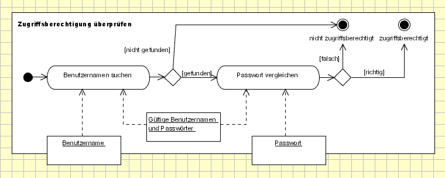

<!--

author:   Sebastian Zug, Galina Rudolf & André Dietrich
email:    sebastian.zug@informatik.tu-freiberg.de
version:  1.0.4
language: de
narrator: Deutsch Female
comment:  Fallbeispiel UML Modellierung
tags:      
logo:     
title: Modellierung von Software III

import: https://github.com/liascript/CodeRunner
        https://raw.githubusercontent.com/liascript-templates/plantUML/master/README.md
        https://raw.githubusercontent.com/liaTemplates/ExplainGit/master/README.md

import: https://raw.githubusercontent.com/TUBAF-IfI-LiaScript/VL_Softwareentwicklung/master/config.md

-->

# Modellierung von Software

| Parameter                | Kursinformationen                                                                                   |
| ------------------------ | --------------------------------------------------------------------------------------------------- |
| **Veranstaltung:**       | `Vorlesung Softwareentwicklung`                                                                     |
| **Teil:**                | `15/27`                                                                                             |
| **Semester**             | @config.semester                                                                                    |
| **Hochschule:**          | @config.university                                                                                  |
| **Inhalte:**             | @comment                                                                                            |
| **Link auf den GitHub:** | https://github.com/TUBAF-IfI-LiaScript/VL_Softwareentwicklung/blob/master/15_UML_ModellierungIII.md |
| **Autoren**              | @author                                                                                             |

---------------------------------------------------------------------

## Beispielszenario UML-Modellierung

Das folgende Beispiel entspricht der Analyse, die auf der Webseite [Link](http://www.highscore.de/uml/titelseite.html) von Boris Schäling beschrieben wird (CC BY-NC-ND 3.0 DE)[^UMLTutorial].

Hier sind auch weitergehende Informationen und Designdiskussionen zu finden.  Die entsprechenden
Texte sind jeweils in kursiver Schrift gehalten, Ergänzungen für die Einbettung
in dieser Vorlesung entsprechend hervorgehoben. Ein zusätzliches Durcharbeiten der Originalunterlagen wird empfohlen.

Der Anforderungskatalog an den beispielhaft zur realisierenden Onlineshop gliedert sich wie folgt:

+ *Alle im Online-Shop erhältlichen Artikel besitzen eine eindeutige Artikelnummer, einen Namen und einen Preis. Außerdem sollen Artikel aus dem Angebot entfernt werden können, ohne ihre Daten aus dem System zu löschen.*

+ *Während des Bestellvorgangs geben Kunden eine Rechnungs- und Lieferanschrift ein. Grundsätzlich wird zwischen diesen beiden Anschriften nicht unterschieden. Wenn ein Kunde es verlangt, kann er jedoch unterschiedliche Adressen für Rechnung und Lieferung angeben.*

+ *Die Rechnungs- und Lieferanschrift bestehen aus der Anrede, die Kunden aus einer Liste wählen, dem Vor- und Nachnamen, der Straße, Hausnummer, Postleitzahl und dem Ort. Da Bestellungen europaweit ausgeliefert werden, wählen Kunden außerdem ihr Land aus einer Liste aus. Für die Zustellung über einen Paketdienst ins Ausland ist es notwendig, dass Kunden auch ihre Telefonnummer angeben. Darüber hinaus müssen sie ihre Email-Adresse angeben, an die am Ende des Bestellvorgangs eine Bestätigungsmail geschickt wird.*

+ *Kunden dürfen wählen, auf welche Weise sie ihre Bestellung bezahlen möchten. Als Zahlungsmethoden stehen Nachnahme, Bankeinzug und Vorauskasse zur Verfügung. Je nach gewählter Zahlungsmethode fallen zusätzliche Kosten an. Außerdem muss beachtet werden, dass je nach Land, in das die Bestellung ausgeliefert werden soll, unterschiedlich hohe Kosten für Zahlungsmethoden anfallen: Zum Beispiel ist die Nachnahmegebühr im Inland geringer als die Nachnahmegebühr bei einem Versand ins Ausland.*

+ *Was für Kosten für Zahlungsmethoden gilt, trifft auch auf Verpackungs- und Versandkosten zu: Diese fallen je nach Land unterschiedlich hoch aus.*

+ *Es dürfen nur Bestellungen aus Ländern entgegengenommen werden, bei denen die Kosten von mindestens einer Zahlungsmethode bekannt sind. Ist also für ein Land nicht bekannt, was ein Versand per Nachnahme, Bankeinzug oder Vorauskasse an Kosten verursacht, darf für dieses Land keine Bestellung entgegengenommen werden. Dieses Land darf also nicht bei Eingabe einer Lieferanschrift ausgewählt werden können.*

+ *Es dürfen für eine Bestellung in ein Land nur die Zahlungsmethoden angeboten werden, für die die Kosten der Zahlungsmethoden für dieses Land bekannt sind. Ist zum Beispiel nicht bekannt, was ein Versand per Nachnahme nach Italien kosten würde, darf die Nachnahme als Zahlungsmethode für Bestellungen aus Italien natürlich nicht angeboten werden. Sind lediglich die Kosten für eine Zahlungsmethode bekannt, hat der Kunde keine Wahl und wird automatisch zu dieser Zahlungsmethode weitergeleitet.*

+ *Wenn der Wert einer Bestellung eine festgelegte Grenze überschreitet, werden keine Verpackungs- und Versandkosten in Rechnung gestellt.*

+ *Kundendaten müssen bei der Eingabe auf Vollständigkeit und Richtigkeit überprüft werden, soweit dies technisch möglich ist. Fehlen Daten oder sind Daten falsch angegeben, müssen verständliche Fehlermeldungen ausgegeben werden, die gleichzeitig erklären, wie der Fehler behoben werden kann.*

+ *In vielen Ländern, in die geliefert wird, gibt es einen Distributor, an den Bestellungen im Online-Shop weitergeleitet werden. Das muss auf sicherem Weg geschehen, da mit Kunden- und Bestelldaten natürlich verantwortungsvoll umgegangen wird. Gleichzeitig soll diese Weitergabe jedoch automatisiert sein, um den Aufwand zur Auslieferung von Bestellungen niedrig zu halten. Da diese Distributoren mit unterschiedlichen Softwaresystemen arbeiten, müssen Kunden- und Bestelldaten im jeweils richtigen Format weitergegeben werden.*

+ *Da es nicht für jedes Land, in das geliefert wird, einen dort ansässigen Distributor gibt, sind einige Distributoren für mehrere Länder verantwortlich.*

Nach welchen Aspekten lassen die Anforderungen des Kunden strukturieren:

+ Datenformate und -inhalte "Die Rechnungsadresse besteht aus Anrede ..."
+ Verhalten
     - Kundensicht - "Kunden dürfen wählen"
     - Betreibersicht - "Diese [Versandkosten] fallen ja nach Land unterschiedlich hoch aus"
+ Systemparameter

[^UMLTutorial]: Boris Schäling, "Der moderne Softwareentwicklungsprozess mit UML, Kapitel 3: Das Aktivitätsdiagramm" http://www.highscore.de/uml/titelseite.html

### Use-Case Diagramm

**Basisabläufe**

Welche Elemente unserer Anforderungsliste werden in Bezug auf Anwendungsfälle
mit dieser  Darstellung nicht abgedeckt?

**Verfeinerung des Anwendungsfalldiagramms**

+ systeminterne Prüfung der Anschriften
+ Abbildung von Alternativen und unterschiedlichen Konsequenzen bei der Wahl  der Zahlungsmethode

Was fehlt noch?

**Anwendungsfälle des Distributors**

Welche Zusammenhänge konnten wir bisher nicht abbilden?

### Aktivitätsdiagramme

Die Aktivitäten rund um die Eingabe der Anschrift lassen sich im einfachsten
Fall als Sequenz Eingaben verstehen. Unter UML 1 könnte man das folgendermaßen
darstellen:

| Variante I | Variante II |
| ---------- | ----------- |
|    <!-- width="100%" -->            | <!-- width="100%" -->           |

UML 2 für eine stärkere Differenzierung in die Aktivitätsdiagramme ein. Was sind
die Hauptmerkmale?

Leider Unterstützt *plantUML* die Features diese Feature noch nicht, so dass hier
auf eine Grafik des Originaltutorials zurückgegriffen wird:

### Klassendiagramme

Konzentrieren wir uns zunächst auf einzelne Aspekte der Modellierung, um darauf aufbauend die

das gesamte Diagramm zu entwerfen.

**Ausgangspunkt Angebot / Artikel**

*Angebote* sind Sammlungen von *Artikeln* die in einer Kategorie (Sportgerät, Kleidung, usw.) liegen. Wie fassen wir also die Datenanforderungen aus unserer Spezifikation zusammen?

Assoziationen und Eigenschaften sind äquivalent in der Darstellung, entsprechend repräsentieren die folgenden beiden Diagramme eine analoge Aussage.

| Variante I | Variante II |
| ---------- | ----------- |
|    <!-- width="100%" -->            | <!-- width="100%" -->           |

**Integration des Warenkorbes**

Der Warenkorb bildet die Menge der bestellten Artikel ab, entsprechend wird hier eine 1:n-Beziehung zwischen der Klasse Warenkorb und der Klasse `BestellteArtikel` definiert. `BestellteArtikel` erbt dabei von Artikel und erweitert die Felder um den Eintrag Anzahl.

Zudem bilden wir in der Klasse Warenkorb unsere Anforderung nach einer Bestellumfang gebundenen Versandkostenhöhe ab. Es wird davon ausgegangen, dass der Kunde hier eine Landes- und Versandart und Zahlungsmethodenunabhängige Lösung wünscht. Daher besitzt die Klasse Warenkorb neben der Assoziation zur Klasse Artikel eine statische Eigenschaft KostenfreiAb (diese ist unterstrichen). Die Membervariable gibt einen Euro-Betrag an, ab dem für die Lieferung der bestellten Ware keine Verpackungs- und Versandkosten in Rechnung gestellt werden.

<!-- width="100%" -->

Die Klasse Bestellung umfasst zwei private Eigenschaften vom Typ Anschrift: Lieferanschrift und Rechnungsanschrift. Dabei gibt es genau eine Rechnungsanschrift, eine Lieferanschrift ist aber nicht zwingend ist. Ist keine Lieferanschrift angegeben, wird der Warenkorb an die Rechnungsanschrift ausgeliefert.

Bestellung fasst jeweils ein Objekt vom Typ Warenkorb und eines vom Typ Anschrift zusammen. Anhand der Komposition wird deutlich, dass eine Bestellung ohne die anderen beiden Klassen nicht existieren kann.

Die Klasse Anschrift enthält zahlreiche private Eigenschaften vom Typ `string`. Bis auf die Telefonnummer sind alle Angaben Pflicht. Hinzu kommt ein Member vom Objekttyp Land, das neben der nationalen Zuordnung auch die Höhe der Versand- und Verpackungskosten umfasst.

<!-- width="80%" -->

**Zahlungsmethoden**

Das Anforderungsset des Kunden beschreibt 3 Zahlungsmethoden für die Abrechnung der Bestellung: Bankeinzug, Nachnahme, Vorauskasse. Lediglich im Falle des Bankeinzuges müssen weitere Daten erhoben werden. Bitte beachten Sie, das die Basisklasse Zahlungsmethode als abstrakte Klasse definiert wurde, um zu vermeiden, dass davon (sinnlose) Instanzen gebildet werden können.

<!-- width="60%" -->

**Und nun alles zusammen**

Was bisher fehlte, war der Distributor, der, wie in unserem Use-Case Diagramm modelliert, per Benutzername und Kennwort auf den Online-Shop zugreifen möchte, um Bestell- und Kundendaten herunterzuladen. Die Klasse Distributor ist entsprechend mit den Klassen Bestellung und Land verknüpft. Diese Assoziationen drücken aus, dass der Distributor auf beliebig viele Bestellungen zugreifen kann und für mindestens ein Land verantwortlich ist, in das er Bestellungen auszuliefern hat. Die Klasse Format umfasst die Methoden zur Generierung der Ausgabeformate für die Daten, da davon ausgegangen wird, die dass die weitere Bearbeitung mit alternativen Programmen realisiert wird.

<!-- width="100%" -->

[^UMLTutorial]: Boris Schäling, "Der moderne Softwareentwicklungsprozess mit UML, Kapitel 3: Das Aktivitätsdiagramm" http://www.highscore.de/uml/titelseite.html
