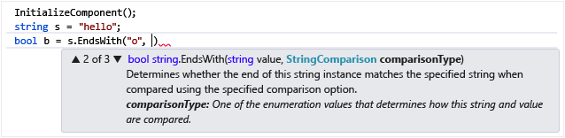
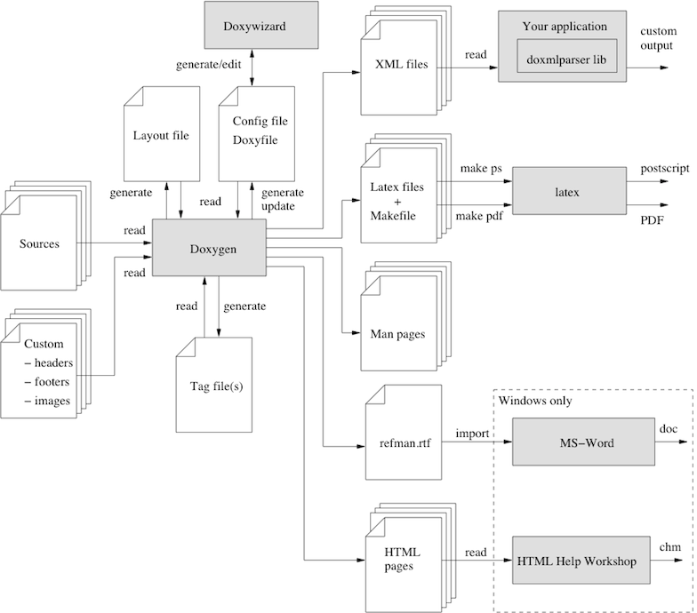

<!--

author:   Sebastian Zug, Galina Rudolf & André Dietrich
email:    sebastian.zug@informatik.tu-freiberg.de
version:  1.0.9
language: de
narrator: Deutsch Female
comment:  Ziele von Dokumentation, Build Tools dotnet, MSBuild und Make
tags:      
logo:     

import: https://github.com/liascript/CodeRunner
        https://raw.githubusercontent.com/liascript-templates/plantUML/master/README.md

import: https://raw.githubusercontent.com/TUBAF-IfI-LiaScript/VL_Softwareentwicklung/master/config.md

-->

[](https://liascript.github.io/course/?https://github.com/TUBAF-IfI-LiaScript/VL_Softwareentwicklung/blob/master/18_Dokumentation_BuildTools.md)

# Dokumentation und Build-Tools

| Parameter                | Kursinformationen                                                                                        |
| ------------------------ | -------------------------------------------------------------------------------------------------------- |
| **Veranstaltung:**       | `Vorlesung Softwareentwicklung`                                                                          |
| **Teil:**                | `18/27`                                                                                                   |
| **Semester**             | @config.semester                                                                                         |
| **Hochschule:**          | @config.university                                                                                       |
| **Inhalte:**             | @comment                                                                                                 |
| **Link auf den GitHub:** | https://github.com/TUBAF-IfI-LiaScript/VL_Softwareentwicklung/blob/master/18_Dokumentation_BuildTools.md |
| **Autoren**              | @author                                                                                                  |


---------------------------------------------------------------------

## Dokumentation

**Wer braucht schon eine Doku?**

> *Eine Softwaredokumentation ist mangelhaft, wenn ihre Inhalte in einem nennenswertem Umfang nicht (mehr) aktuell sind, nicht mit den im Programm vorhandenen Dialogen übereinstimmen oder gar nicht dokumentiert sind. ... Eine Softwaredokumentation ist mangelhaft, wenn sie den Anwender nicht in die Lage versetzt, die Software im Bedarfsfalle erneut oder auf einer anderen Anlage zu installieren.* [LG Bonn, 19.12.2003]

Als Softwaredokumentation bezeichnet man die Beschreibung einer Software für
Entwickler, Anwender oder Benutzer. Entsprechend den unterschiedlichen Rollen,
wird erläutert, wie die Software funktioniert, was sie erzeugt und verarbeitet
(z. B. Daten), wie sie zu benutzen ist, was zu ihrem Betrieb erforderlich ist
und auf welchen Grundlagen sie entwickelt wurde.

### Einteilung von Dokumentation

                             {{0-1}}
*******************************************************
*Klassifikation 1 - Intern/Extern* 

... bezieht sich dabei auf die Frage, ob das Ganze
für den internen Gebrauch oder den externen Gebrauch, also zur Weitergabe an
Kunden, realisiert werden muss. Letztgenannte Variante unterliegt einer Vielzahl
von rechtlichen Normierungen und Standards!

*******************************************************

                             {{1-2}}
*******************************************************

*Klassifikation 2 - Inhalt*

| Art der Dokumentation      | Bezug                                                                                                                                                                                                                                                                                                                                                                                                                                                                                                                                                                                                   |
| -------------------------- | ------------------------------------------------------------------------------------------------------------------------------------------------------------------------------------------------------------------------------------------------------------------------------------------------------------------------------------------------------------------------------------------------------------------------------------------------------------------------------------------------------------------------------------------------------------------------------------------------------- |
| Installationsdokumentation | Beschreibung der erforderlichen Hardware und Software, mögliche Betriebssysteme und -Versionen, vorausgesetzte Software-Umgebung, wie etwa Standardbibliotheken und Laufzeitsysteme. Erläuterung der Prozeduren zur Installation, außerdem zur Pflege (Updates) und De-Installation, bei kleinen Produkten eine Readme-Datei-Datei.                                                                                                                                                                                                                                                                     |
| Benutzerdokumentation      | Informationsmaterial für die tatsächlichen Endbenutzer, etwa über die Benutzerschnittstelle. Den Anwendern kann auch die Methodendokumentation zugänglich gemacht werden, um Hintergrundinformationen und ein allgemeines Verständnis für die Funktionen der Software zu vermitteln.                                                                                                                                                                                                                                                                                                                    |
| Datendokumentation         | Oft sind nähere Beschreibungen zu den Daten erforderlich. Es sind die Interpretation der Informationen in der realen Welt, Formate, Datentypen, Beschränkungen (Wertebereich, Größe) zu benennen. Die Datendokumentation kann oft in zwei Bereiche aufgeteilt werden: Innere Datenstrukturen, wie sie nur für Programmierer sichtbar sind und Äußere Datendokumentation für solche Datenelemente, die für Anwender sichtbar sind – von Endbenutzern einzugebende und von der Software ausgegebene Informationen. Dazu gehört auch die detaillierte Beschreibung möglicher Import-/Exportschnittstellen. |
| Testdokumentation          | Nachweis von Testfällen, mit denen die ordnungsgemäße Funktion jeder Version des Produkts getestet werden können, sowie Verfahren und Szenarien, mit denen in der Vergangenheit erfolgreich die Richtigkeit überprüft wurde.                                                                                                                                                                                                                                                                                                                                                                            |
| Entwicklungsdokumentation  | Nachweis der einzelnen Versionen auf Grund von Veränderungen, der jeweils zugrundegelegten Ziele und Anforderungen und der als Vorgaben benutzten Konzepte (z. B. in Lastenheften und Pflichtenheften); beteiligte Personen und Organisationseinheiten; erfolgreiche und erfolglose Entwicklungsrichtungen; Planungs- und Entscheidungsunterlagen etc.                                                                                                                                                                                                                                                  |

> Häufig fasst ein Projekt alle Arten der Dokumentation gleichermaßen zusammen. Im folgenden soll zum Beispiel die Implementierung der avrlibc für Mikrocontroller der AtTiny, AtMega und XMega Familie auf die entsprechenden Beiträge hin untersucht werden.
> https://www.nongnu.org/avr-libc/


*******************************************************

                             {{2-3}}
*******************************************************

*Klassifikation 3 - Autoren*

Entwickler:

+ empfindet die Softwaredokumentation oft als lästiges Übel
+ generiert ggf. sehr spezifische Dokumentationen ohne Anspruch auf Allgemeinverständlichkeit
+ ist aber der unmittelbare Experte!

Technischer Redakteur:

+ fehlendes technisches Detailwissen, dichter am Wissensstand des Kunden
+ geeignetes Abstraktionsvermögen
+ erfahren im Dokumentenmanagement

*******************************************************

### Analyse des Bedarfes

> E. Aghajani et al., "Software Documentation: The Practitioners' Perspective," 2020 IEEE/ACM 42nd International Conference on Software Engineering (ICSE), Seoul, Korea (South), 2020, pp. 590-601.

https://homepages.dcc.ufmg.br/~figueiredo/disciplinas/papers/icse20aghajani.pdf

### Programmiererdokumentation

> "Code is like humor. When you have to explain it, it's bad."

> "Warum soll ich dokumentieren, es ist doch mein Code!"

> "Bei einem gut geschriebenen und formatierten Code braucht man weniger zu dokumentieren."

Denken Sie in Zielgruppen, wenn Sie die Dokumentation erstellen. Welche Hilfestellung
erwartet welcher Nutzer der Implementierung? Welche Voraussetzungen können Sie annehmen?

Entsprechend differenzieren wir Zielgruppen und fragen uns welche Personenkreise wir
davon bedienen wollen. Aus dieser Fragestellung ergeben sich die Schwerpunkte
der Dokumentationsarbeit:

+ Praktiker ... starker Bezug zur Umsetzung, benötigt Code-Kommentare, Code-Beispiele
+ Systematiker ... liest zuerst einmal die Grundlagen, bemüht sich alle Hintergrundinfo zu API/Framework, zu erfassen. Benötigt Architekturbeschreibung, Konzepte allgemeiner Programmieraufgaben (Error handling, Lokalisierung &Co.)
+ Bedarfsleser ... situationsgetriebene Auswertung der Dokumentation, erwartet Antworten auf spezifische Fragen, benötigt Code-Kommentare, Hintergrundinformationen und Code-Beispiele

```text @plantUML
@startuml
'Copyright 2019 Amazon.com, Inc. or its affiliates. All Rights Reserved.
'SPDX-License-Identifier: MIT (For details, see https://github.com/awslabs/aws-icons-for-plantuml/blob/master/LICENSE)

!include <awslib/AWSCommon>
!include <awslib/AWSSimplified>

!include <awslib/General/Users>

Users(USER1, "interner Anwender", " ")
Users(USER2, "externer Anwender", " ")
Users(USER3, "interner Entwickler", " ")
Users(USER4, "externer Entwickler", " ")
Users(USER5, "Management", " ")

card Anwendungsentwickler as ENTWICKLER
file API_Dokumentation as DOKU1
file Systemdokumentation as DOKU2
storage System as SYSTEM

USER1 --> ENTWICKLER
USER3 --> ENTWICKLER
USER1 --> DOKU1
USER2 --> DOKU1
USER3 --> DOKU2
USER4 --> DOKU2
USER4 --> SYSTEM
USER5 --> DOKU2


ENTWICKLER .. SYSTEM
ENTWICKLER .. DOKU1
ENTWICKLER .. DOKU2
@enduml
```

_Abbildung motiviert aus  [^codecentric]_

Das Diagramm verdeutlicht, dass sich **Dokumentationsart und Zielgruppe**
gegenseitig bedingen — nicht jede Nutzergruppe greift auf dieselben Artefakte zu.
Mit `System` ist dabei das **laufende Produkt selbst** gemeint (der ausgelieferte,
ausführbare Code) — also kein Dokument, sondern das Artefakt, das die beiden
Dokumentationen _beschreiben_:

- **Anwender** (intern wie extern) interessieren sich für die **API-Dokumentation**
  (`DOKU1`) — sie wollen die Software _benutzen_, nicht verstehen, wie sie gebaut ist.
- **Entwickler** und das **Management** benötigen dagegen die **Systemdokumentation**
  (`DOKU2`) mit Architektur- und Hintergrundinformationen.
- Nur der **externe Entwickler** greift direkt auf das **System** selbst zu.
- Der **Anwendungsentwickler** (`ENTWICKLER`) ist die zentrale Quelle: Er speist
  beide Dokumentationen und das System (gestrichelte Verbindungen).


> [!IMPORTANT]
> Die Konsequenz für die Praxis: Bevor man dokumentiert, klärt man _für wen_ — die
Zielgruppe bestimmt Inhalt, Detailtiefe und Form (vgl. die drei Lesertypen oben).

**Konkretisierung am Beispiel eines Wetterdienstes**

Machen wir das Schema an einem realen System fest — der Vorhersage-Plattform
eines Wetterdienstes (z. B. dem [Open-Data-Angebot des DWD](https://opendata.dwd.de/)).
`System` ist hier die laufende Software, die Messdaten einsammelt, Vorhersagen
berechnet und ausliefert:

| Rolle im Diagramm        | Wer das im Wetterdienst ist                       | Was er/sie braucht                                       |
| ------------------------ | ------------------------------------------------- | -------------------------------------------------------- |
| externer Anwender        | Bürger mit einer Wetter-App                        | nur das _Produkt_ (die App-Ausgabe)                      |
| externer Entwickler      | beauftragte Fremdfirma, die ein Vorhersage-Modul baut | **Systemdoku** (`DOKU2`) **+** Zugriff auf das **System** |
| interner Anwender        | Meteorolog:in an der Fachoberfläche                | das Produkt (die interne Bedienoberfläche)               |
| interner Entwickler      | Betriebsteam des Rechenzentrums                   | **Systemdoku** (`DOKU2`): Architektur, Betrieb           |
| Management               | Behördenleitung                                   | **Systemdoku** (`DOKU2`): Überblick, Konzepte            |

Hier lohnt ein genauer Blick auf den **externen Entwickler**: „extern" heißt
_nicht_ automatisch „nur API-Nutzer". Die beauftragte Fremdfirma arbeitet im
Unterauftrag _am_ System mit — sie erweitert es, statt es nur zu benutzen.
Deshalb ist sie im Diagramm die einzige externe Rolle, die _sowohl_ die interne
Systemdokumentation (`DOKU2`) _als auch_ das System selbst berührt — genau wie
ein interner Entwickler. Der entscheidende Unterschied verläuft also nicht
zwischen „intern" und „extern", sondern zwischen **benutzen** (Anwender → API-Doku)
und **mitentwickeln** (Entwickler → Systemdoku + System).

Der Kontrast wird damit besonders greifbar: Die **API-Dokumentation** (`DOKU1`)
ist _öffentlich_ und beschreibt nur die Schnittstelle (welche URL liefert die
Temperatur für Freiberg?) — sie genügt dem App-Hersteller, der die Open-Data-API
konsumiert. Die **Systemdokumentation** (`DOKU2`) bleibt _intern_ und erklärt,
_wie_ die Vorhersage zustande kommt — sie bekommt nur, wer am System mitbaut.


[^codecentric]:  Uwe Friedrichsen, Optimale Systemdokumentation mit agilen Prinzipien, 06/11, https://www.codecentric.de/publikation/optimale-systemdokumentation-mit-agilen-prinzipien/


Entsprechend ergeben sich vielfältige Dokumentationstypen, die ggf. erfasst werden sollten:

+ Programmier Kochbuch
+ Wiki
+ Code Kommentare
+ API Dokumentation

die in unterschiedlichen Formaten (online, offline, html, pdf, doc, usw.) realisiert werden können.

### Benutzerdokumentation

Auch die Benutzerdokumentation muss einer starken Zielgruppenorientierung unterliegen sowie unterschiedliche Konzepte der Handhabung einer Software beschreiben. Für Handbücher lassen sich zum Beispiel folgende Typen unterscheiden:

+ Trainings-Handbuch
+ Referenz-Handbuch
+ Referenzkarte (auch als Cheat-Sheets bezeichnet)
+ Benutzer-Leitfaden

> Beispiele:
> 
> - Python Pandas [Cheat Sheet](https://pandas.pydata.org/Pandas_Cheat_Sheet.pdf)
> - Python Paket PyGithub [Dokumentation](https://pygithub.readthedocs.io/en/stable/index.html)


### Realisierung der Dokumentation in Csharp

> Merke: Anhand einer Semantik werden aus formlosen Kommentaren automatisch auswertbare Elemente einer Benutzerdokumentation!

Gliederungselemente für die Dokumentationsgenerierung sind dabei:

+ Zuordnungen von Informationen zu Klassen, Methoden, Variablen
+ Erläuterung von Methodensignaturen (Input/Outputs)
+ Beschreibung der Funktion von Variablen, Properties usw.
+ Integration von Beispielcode

Unter C\# wird hinsichtlich der Darstellung zusätzlich zwischen Kommentaren mit
`//` oder `/*  */` und Dokumentationsinhalten unterschieden, die mit `///`
eingeleitet werden.

```csharp    Documentation.cs
using System;

// Eine zweielementige Vektorklasse ohne Methoden
public class Vector {
  public double X;
  public double Y;
  public Vector (double x, double y){
    this.X = x;
    this.Y = y;
  }
  // Hinweis: C# verlangt operator == und != immer paarweise.
  public static bool operator ==(Vector p1, Vector p2){
    // TODO die Methode müsste noch implementiert werden.
    throw new NotImplementedException();
  }
  public static bool operator !=(Vector p1, Vector p2){
    // hier hatte ich keine Lust mehr
    // TODO die Methode müsste noch implementiert werden.
    throw new NotImplementedException();
  }
}

/// <summary>
///  KLasse mit dem Einsprungspunkt für die Main zu Testzwecken.
/// </summary>
public class Program
{
  /// <summary>
  ///  Main Funktion mit expemplarischer Initialisierung zweier Vektoren.
  /// </summary>
  public static void Main(string[] args)
  {
    Vector a = new Vector (3,4);
    Vector b = new Vector (9,6);
    // Console.WriteLine (a == b);  // wirft NotImplementedException - bitte ausprobieren!
    Console.WriteLine ("Vektoren a und b wurden angelegt.");
  }
}
```
```xml   -project.csproj
<Project Sdk="Microsoft.NET.Sdk">
  <PropertyGroup>
    <OutputType>Exe</OutputType>
    <TargetFramework>net8.0</TargetFramework>
  </PropertyGroup>
</Project>
```
@LIA.eval(`["Documentation.cs", "project.csproj"]`, `dotnet build -nologo`, `dotnet run -nologo`)

> Anmerkung: Bauen Sie nie Rückgabewerte für nicht ausimplementierte Klassenelemente ein ohne eine `throw new NotImplementedException();` zu integrieren. Kommentieren Sie die `a == b`-Zeile ein und beobachten Sie, dass der ehrliche Programmabbruch der stillen Falschausgabe (`return true;`) vorzuziehen ist.
>
> Der Compiler weist zusätzlich mit zwei Warnungen (`CS0660`/`CS0661`) darauf hin,
> dass zu einem `operator ==` üblicherweise auch `Equals()` und `GetHashCode()`
> überschrieben werden sollten — ein weiterer Beleg dafür, dass das Beispiel
> bewusst unfertig ist.

Über entsprechende Tags lassen sich den Dokumentationsfragmenten Bedeutungen
geben, die eine entsprechende Gliederung und Zuordnung erlaubt:

| Tag           | Erklärung                                                                              |
| ------------- | ------------------------------------------------------------------------------------- |
| `<summary>`   | Umfasst kurze Informationen über einen Typ oder Member.                               |
| `<remarks>`   | Ergänzt weiterführende Informationen zu Typen und Membern.                            |
| `<returns>`   | Beschreibt den Rückgabewert einer Methode                                             |
| `<value>`     | Beschreibt Bedeutung einer Eigenschaft                                                |
| `<example>`   | Ermöglicht mit `<code>` die Einbettung von (Code-)Beispielen.                         |
| `<para>`      | Ermöglicht die Beschreibung der Eingabeparameter einer Methode                        |
| `<c>`         | Indikator für Inline-Codefragmente                                                    |
| `<exception>` | Erlaubt die Beschreibung möglicher Exceptions, die in einer Methode auftreten können. |
| `<see>`       | Klickbare Links in Verbindung mit `<cref>`                                             |


Was lässt sich damit umsetzen?

```csharp    FunctionWithDocumentation
  // Divides an integer by another and returns the result
  // Codebeispiel aus der Microsoft Dokumentation
  // siehe https://docs.microsoft.com/de-de/dotnet/csharp/codedoc

  /// <summary>
  /// Divides an integer <paramref name="a"/> by another integer <paramref name="b"/> and returns the result.
  /// </summary>
  /// <returns>
  /// The quotient of two integers.
  /// </returns>
  /// <example>
  /// <code>
  /// int c = Math.Divide(4, 5);
  /// if (c > 1)
  /// {
  ///     Console.WriteLine(c);
  /// }
  /// </code>
  /// </example>
  /// <exception cref="System.DivideByZeroException">Thrown when <paramref name="b"/> is equal to 0.</exception>
  /// See <see cref="Math.Divide(double, double)"/> to divide doubles.
  /// <seealso cref="Math.Add(int, int)"/>
  /// <seealso cref="Math.Subtract(int, int)"/>
  /// <seealso cref="Math.Multiply(int, int)"/>
  /// <param name="a">An integer dividend.</param>
  /// <param name="b">An integer divisor.</param>
  public static int Divide(int a, int b)
  {
      return a / b;
  }
```

Offensichtlich bläht diese Struktur den Code, der im Beispiel aus insgesamt
4 Zeilen besteht unschön auf. Die Lesbarkeit, die ja eigentlich gesteigert werden
sollte leidet darunter. Welche Lösungsmöglichkeit sehen Sie?

**Separate Dokumentationsdateien**

Mit dem `<include>`-Tag lassen sich externe Dokumentationen während des
Generierungsprozesses referenzieren. Damit umfasst die Dokumentation lediglich
einen entsprechenden Link in Kombination mit einem einfachen Kommentar.

```xml    Doku
<docs>
    <members name="math">
        <Math>
            <summary>
            The main <c>Math</c> class.
            Contains all methods for performing basic math functions.
            </summary>
            <remarks>
            <para>This class can add, subtract, multiply and divide.</para>
            <para>These operations can be performed on both integers and doubles.</para>
            </remarks>
        </Math>
        <AddInt>
            <summary>
            Adds two integers <paramref name="a"/> and <paramref name="b"/> and returns the result.
            </summary>
            <returns>
            The sum of two integers.
            </returns>
        </AddInt>
        <DivideInt>
            <summary>
            Divides an integer <paramref name="a"/> by another integer <paramref name="b"/> and returns the result.
            </summary>
            <returns>
            The quotient of two integers.
            </returns>
        </DivideInt>
    </members>
</docs>
```

```csharp    InvolvingDocFile
// Adds two integers and returns the result
/// <include file='docs.xml' path='docs/members[@name="math"]/AddInt/*'/>
public static int Add(int a, int b)
{
    // If any parameter is equal to the max value of an integer
    // and the other is greater than zero
    if ((a == int.MaxValue && b > 0) || (b == int.MaxValue && a > 0))
        throw new System.OverflowException();

    return a + b;
}
```

> Anmerkung: Leider funktioniert dieser Mechanismus unter dem gleich vorzustellendem Tool Doxygen nicht.

**Konkrete Umsetzung mit C\#**

**Anwendung 1:** Generierung separater XML Dateien zur Verwendung in Visual Studio
Code oder Visual Studio. Um die entsprechende XML Datei sollte den gleichen
Namen tragen wie das Assembly und sich im gleichen Ordner befinden.

```
csc -out:MyAssembly.exe File.cs -doc:MyAssembly.xml
```

Aufbauend auf den Inhalten der XML Datei ist IntelliSense in Visual Studio dann
in der Lage, die Textinformationen zu Klassen und Membern bei der Eingabe
anzuzeigen.



Sie können die Parameterinformation manuell aufrufen, indem Sie
STRG+UMSCHALT+LEERTASTE drücken (die alternativen Methoden mit der Maus braucht
ohnehin niemand).

**Anwendung 2:** Die XML basierten Dokumentationsinhalte können in html oder pdf Dokumente transformiert werden, um eine losgelöste Dokumentation darzustellen. Hierfür können externe Tools herangezogen werden. Beispiele dafür sind [Javadoc](https://docs.oracle.com/javase/8/docs/technotes/tools/windows/javadoc.html), [Sphinx](http://www.sphinx-doc.org/en/master/) oder [Doxygen](http://www.doxygen.nl/index.html). Ursprünglich bot Microsoft eine eigene
Toolchain für die Code-Generierung an, diese wird gegenwärtig unter dem Projektnamen
Sandcastle als Open-Source Projekt weitergeführt.

https://github.com/EWSoftware/SHFB

Im folgenden soll beispielhaft auf die Anwendung von Doxygen eingegangen werden.
Das vollständige, lauffähige Beispiel liegt im Repository unter
`code/18_ToolChain/doxywizard`. Es dokumentiert die folgende `intDivide`-Methode:

```csharp
namespace doxyexample
{
  public class Program
  {
    /// <summary>
    /// Divides an integer <paramref name="a"/> by another integer <paramref name="b"/> and returns the result.
    /// </summary>
    /// <returns> The quotient of two integers. </returns>
    /// <exception cref="System.DivideByZeroException">Thrown when <paramref name="b"/> is equal to 0.</exception>
    public static int intDivide(int a, int b)
    {
        return a / b;
    }
    // ...
  }
}
```

Die Steuerung des Generierungsprozesses erfolgt über das `Doxyfile`. Drei
Einstellungen lohnen einen genaueren Blick:

| Flag             | Wert im Beispiel | Wirkung                                                          |
| ---------------- | ---------------- | --------------------------------------------------------------- |
| `EXTRACT_ALL`    | `YES`            | Auch undokumentierte Elemente werden erfasst (Abdeckung sichtbar)|
| `INPUT`          | `doxyexample`    | Verzeichnis/Dateien, die eingelesen werden                       |
| `GENERATE_HTML`  | `YES`            | Erzeugt die durchsuchbare HTML-Dokumentation                     |

Der Aufruf reduziert sich damit auf einen einzigen Befehl:

```bash
doxygen Doxyfile      # liest das Doxyfile, erzeugt ./html/index.html
```



!?[doxygenmovie](https://www.youtube.com/watch?v=-V_vHZPOZfY)

Am Beispielprojekt `code/18_ToolChain/doxywizard` lassen sich darüber hinaus zwei
Verbesserungen der Darstellung nachvollziehen — probieren Sie es selbst aus:

1. Auswertung der Doxygen Ausgaben im Hinblick auf die Abdeckung der Dokumentation.

2. Einbindung des Quellcodes über das SOURCE_BROWSER Flag.

   Anpassung des entsprechenden Eintrages von `NO` auf `YES`.

```
# If the SOURCE_BROWSER tag is set to YES then a list of source files will be
# generated. Documented entities will be cross-referenced with these sources.
#
# Note: To get rid of all source code in the generated output, make sure that
# also VERBATIM_HEADERS is set to NO.
# The default value is: NO.

SOURCE_BROWSER         = NO
```

3. Integration des Projektfiles README.md in die Dokumentation.

```
INPUT                 += README.md
USE_MDFILE_AS_MAINPAGE = README.md
```

[^Doxygen]: Manual - Getting started, http://www.doxygen.nl/manual/starting.html

[^MS_VisualStudio]: Dokumentation Microsoft Visual Studio, https://docs.microsoft.com/de-de/visualstudio/ide/using-intellisense?view=vs-2019

## Build Tools

**Konzepte**

Wir haben bisher über das Compilieren des Codes und die Realisierung von Tests
gesprochen, nun kommt auch noch die Erstellung einer Dokumentation hinzu ...
und für all diese Teilaspekte gibt es jeweils eigne Tools. Das möchte doch niemand
manuell angehen!

```
dotnet build myproject
dotnet run myproject
...
doxygen Doxyfile
...
```

Wie kann man den Codeerstellungsprozess automatisieren und organisieren ohne
jedes mal über eine Vielzahl von CLI-Parametern nachdenken zu müssen? Welche
Aspekte sollte diese Straffung des Entwicklungsflusses abdecken:

+ Auflösung der Abhängigkeiten von anderen Paketen
+ Kompilierung
+ Anwendung von Qualitätsmetriken
+ Programmausführung
+ Tests
+ Generierung der Dokumentation

Dabei wäre es sinnvoll, wenn ausgehend von einer tatsächlichen Veränderung der
Eingabendateien eine Realsierung des gewünschten Targets erfolgt.

| Vorgang                            | Kompilierung | Tests | Qualitätscheck | Doku |
| ---------------------------------- |:------------:|:-----:|:--------------:|:----:|
| Änderung in einer Code Datei       |      X       |   X   |       X        |  X   |
| Hinzufügen eines Tests             |              |   X   |                |      |
| Anpassen einer Dokumentationsdatei |              |       |                |  X   |

Um diese Idee abzubilden müssen wir offenbar Abhängigkeiten beschreiben, die
ausgehend von einer Veränderung, eine bestimmte Folge von Aktionen auslösen.
Ausgangspunkt für diese Aktionen können unterschiedliche Quellen sein (vgl.
Generierung der Dokumentation in obiger Tabelle).

Den ersten Punkt der Liste - die _Auflösung der Abhängigkeiten von anderen
Paketen_ - betrachten wir gleich beim Werkzeug `dotnet` im Exkurs zum
Paketmanagement (NuGet) genauer.

### dotnet

`dotnet` ist ein Tool für das Verwalten von .NET-Quellcode und Binärdateien. Das
Programm stellt Befehle zur Verfügung, die bestimmte Aufgaben erfüllen, die zudem
jeweils über eigene Argumente verfügen.

| Befehl         | Bedeutung                                                          |
| -------------- | ------------------------------------------------------------------ |
| dotnet new     | Initialisiert ein C#- oder F#-Projekt für eine bestimmte Vorlage.  |
| dotnet restore | Stellt die Abhängigkeiten für eine bestimmte Anwendung wieder her. |
| dotnet build   | Erstellt eine .NET Core-Anwendung.                                 |
| dotnet clean   | Bereinigen von Buildausgaben.                                      |
| dotnet test    | Ausführen der entsprechenden Testanwendungen                       |

Beispielanwendung: Entwerfen Sie eine C# Programm, dass Excel-Files erstellt, für
die bestimmte Felder vorinitialisiert sind.

```
export DOTNET_SKIP_FIRST_TIME_EXPERIENCE=1
dotnet --help
dotnet new console -n MyExcelGenerator
cd MyExcelGenerator
cat MyExcelGenerator.csproj
dotnet add package EPPlus
cat MyExcelGenerator.csproj
... Program.cs anpassen ...
dotnet build
dotnet run
soffice -calc myworkbook.xlsx
```

`dotnet` ermöglicht keine Definition von Abhängigkeiten (ohne auf MSBuild
zurückzugreifen) standardisiert aber den Erstellungs- und Testprozess, sowie das
Pakethandling!


### MSBuild

MSBuild ist Build-Tool, das insbesondere für das Erstellen von .NET-basierten
Anwendungen genutzt wird. Microsofts Visual Studio ist in wesentlichem Maße von
MSBuild abhängig; umgekehrt besteht diese Abhängigkeit nicht.

Im Wesentlichen besteht MSBuild aus der Datei `msbuild.exe` und dll-Dateien, die
auch im .NET Framework enthalten sind, und XML-Schemas, nach deren Vorgaben die
von msbuild.exe verwendeten Projektdateien aufgebaut sind. Wegen der
XML-Basiertheit wird MSBuild auch als Auszeichnungssprache eingeordnet.

```
<Project xmlns="http://schemas.microsoft.com/developer/msbuild/2003">
  <Target Name="A">
    <Message Text="Hello World!"/>
  </Target>
</Project>
```

Innerhalb der xml-Struktur definieren Sie sogenannte Targets als Einsprungpunkte
für den Erstellungsprozess. Im Beispiel sind dies zunächst nur HelloWorld-Ausgaben,
im Weiteren wurde dies auf konkrete Kompiliervorgänge ausgeweitet.

Ein spezifisches Target kann mit `msbuild filename /t:targetname` aufgerufen
werden.

```
<Project xmlns="http://schemas.microsoft.com/developer/msbuild/2003">
  <Target Name="A">
    <Message Text="Hello World! A"/>
  </Target>
    <Target Name="B" DependsOnTargets="A">
    <Message Text="Hello World! B"/>
  </Target>
</Project>
```

Ein minimales Konfigurationsfile für die Build-Prozess einer einzelnen C# Datei
könnte folgende Konfiguration haben:

```
<Project xmlns="http://schemas.microsoft.com/developer/msbuild/2003">
  <ItemGroup>
    <Compile Include="helloworld.cs" />
  </ItemGroup>
  <Target Name="Build">
    <Csc Sources="@(Compile)"/>
  </Target>
</Project>
```

In der Praxis hängt man eigene Schritte an die vordefinierten Targets an. Das
Beispiel unter `code/18_ToolChain/msbuildProject` (Aufruf via `dotnet build` bzw.
`dotnet msbuild /t:SayHello`) zeigt die wichtigsten Mechanismen:

```xml    buildExample.csproj
<Project Sdk="Microsoft.NET.Sdk">

  <PropertyGroup>
    <OutputType>Exe</OutputType>
    <TargetFramework>net8.0</TargetFramework>
    <AssemblyName>MSBuildExample</AssemblyName>
  </PropertyGroup>

  <!-- läuft automatisch NACH dem Standard-Build -->
  <Target Name="CustomPostBuild" AfterTargets="Build">
    <Message Text="✅ Build abgeschlossen: $(AssemblyName).dll" Importance="high" />
  </Target>

  <!-- manuell aufrufbar: dotnet msbuild /t:SayHello -->
  <Target Name="SayHello">
    <Message Text="👋 Hello from SayHello target!" Importance="high" />
  </Target>

  <!-- Abhängigkeit: erst Clean, dann Build, dann diese Meldung -->
  <Target Name="CustomRebuild" DependsOnTargets="Clean;Build">
    <Message Text="♻️ CustomRebuild abgeschlossen." Importance="high" />
  </Target>

</Project>
```

+ `AfterTargets="Build"` — hängt einen Schritt _automatisch_ an ein bestehendes Ziel an (hier: Meldung nach jedem Build).
+ `DependsOnTargets="Clean;Build"` — bildet genau die Abhängigkeitsidee aus obiger Tabelle ab: `CustomRebuild` zieht zuerst `Clean` und `Build` nach sich.
+ Ein freistehendes Target wie `SayHello` ist ein manueller Einsprungpunkt.

Die zuvor besprochenen dotnet Befehle bauen auf MSBuild auf und kapseln diese.
Die Ausführung von `dotnet build` entspricht `dotnet msbuild -restore -target:Build`.

Arbeiten Sie auch die Dokumentation von MSBuild durch, diese stellt auch das umfangreiche
Featureset (vordefinierte Targets, integierte Tools, die Möglichkeit externe Anwendungen einzubetten) vor, das deutlich über die Beispiele hinausgeht.

https://docs.microsoft.com/de-de/visualstudio/msbuild/msbuild?view=vs-2019

### Make

`make` wird  beispielsweise verwendet, um in Projekten, die aus vielen verschiedenen
Dateien mit Quellcode bestehen, automatisiert alle Arbeitsschritte (Übersetzung,
Linken, Dateien kopieren etc.) zu steuern, bis hin zum Fertigen von ausführbaren
Programmen.

`make` liest ein sogenanntes *Makefile* (ACHTUNG Großschreibung erforderlich) und
realisiert den beschriebenen Übersetzungsprozesses entsprechend der Abhängigkeiten.

```console
A: B
  generate_A

B: D E
  generate_B
```

Gelesen wird das als _"`A` hängt von `B` ab; um `A` zu erzeugen, führe
`generate_A` aus"_. Ruft man `make A` auf, ergibt sich folgender Ablauf — und
zwar **nur**, wenn die Zieldatei älter als ihre Abhängigkeiten ist (zeitstempel-
gesteuert):

```text
$ make A
  → A benötigt B
      → B benötigt D und E   (sind vorhanden/aktuell)
      → generate_B           # B wird zuerst gebaut
  → generate_A               # danach A
```

Genau hier liegt der Unterschied zu MSBuild: MSBuild-Targets werden über
explizite Namen/`DependsOnTargets` angestoßen, `make` entscheidet anhand der
**Datei-Zeitstempel**, ob ein Schritt überhaupt nötig ist.

Daneben können Sie entsprechende Makros `$(MAKRO_NAME)`, `wildcard` und Platzhalter
verwenden, um die Beschreibung effizienter und kompakter zu gestalten. Ein
typisches Makefile für eine eingebettetes C Projekt (Arduino) stellt sich wie
folgt dar:

```console   Makefile
# Source, Executable, Includes, Library Defines
INCL   = loop.h defs.h
SRC    = a.c b.c d.c      # c Code-Dateien
OBJ    = $(SRC:.c=.o)
LIBS   = -lgen
EXE    = program

 # Compiler, Linker Defines
CC      = /usr/bin/gcc
CFLAGS  = -ansi -pedantic -Wall -O2
LIBPATH = -L.
LDFLAGS = -o $(EXE) $(LIBPATH) $(LIBS)
RM      = /bin/rm -f

# Compile and Assemble C Source Files into Object Files
%.o: %.c
       $(CC) -c $(CFLAGS) $*.c

# Link all Object Files with external Libraries into Binaries
$(EXE): $(OBJ)
       $(CC) $(LDFLAGS) $(OBJ)

# Objects depend on these Libraries
$(OBJ): $(INCL)

# Clean Up Objects, Exectuables, Dumps out of source directory
clean:
       $(RM) $(OBJ) $(EXE) core a.out
```

> MERKE: Die Einschübe im MAKEFILE sind keine Leerzeichen, sondern Tabulatorshifts!

Drei Konstrukte aus dem Beispiel verdienen einen genaueren Blick, weil sie den
kompakten Stil eines typischen Makefiles ausmachen:

**1. Pattern Rules & Automatische Variablen** — Die Regel `%.o: %.c` ist eine
_Schablone_: Das `%` (genannt _Stem_) steht für einen beliebigen Dateinamen und
gilt damit für `a.o`, `b.o`, `d.o` gleichermaßen, ohne dass man jede Datei
einzeln auflisten muss. Innerhalb des Rezeptes referenzieren _automatische
Variablen_ die beteiligten Dateien:

| Variable | Bedeutung                              | im Beispiel `a.o: a.c` |
| -------- | -------------------------------------- | ---------------------- |
| `$@`     | das Ziel (target)                      | `a.o`                  |
| `$<`     | die _erste_ Abhängigkeit               | `a.c`                  |
| `$^`     | _alle_ Abhängigkeiten                  | `a.c`                  |
| `$*`     | der Stem (das, wofür `%` steht)        | `a`                    |

Die Zeile `$(CC) -c $(CFLAGS) $*.c` übersetzt also für jede `.c`-Datei genau die
passende Quelldatei in ihr `.o`-Pendant — eine einzige Regel ersetzt beliebig
viele konkrete.

**2. Phony Targets** — `clean` ist kein Dateiname, sondern ein _Kommando-Ziel_.
Existierte zufällig eine Datei namens `clean` im Verzeichnis, würde `make` sie
für aktuell halten und das Rezept nie ausführen (Zeitstempel-Logik!). Deshalb
deklariert man solche Ziele explizit als _phony_:

```makefile
.PHONY: clean
clean:
	$(RM) $(OBJ) $(EXE) core a.out
```

**3. Default Goal** — Ruft man `make` _ohne_ Argument auf, wird das **erste** in
der Datei definierte Target gebaut (im Beispiel die Regel für `$(EXE)`). Aus
diesem Grund steht das Haupt-Build-Ziel konventionell oben und `clean` weiter
unten.

Das Hilfsprogramm `make` ist Teil des POSIX-Standards.

## Einordnung der drei Werkzeuge

Die drei vorgestellten Werkzeuge bedienen dieselbe Grundidee — _aus einer
Veränderung von Eingabedateien die nötigen Schritte ableiten_ — auf
unterschiedlichen Abstraktionsebenen:

|                  | `dotnet`                       | MSBuild                          | `make`                              |
| ---------------- | ------------------------------ | -------------------------------- | ----------------------------------- |
| Abstraktionsebene| hoch (Kommando-Wrapper)        | mittel (XML-Targets)             | niedrig (Regeln + Shell)            |
| Konfiguration    | `*.csproj` (Konvention)        | `*.csproj`/`*.targets` (XML)     | `Makefile` (Regeln)                 |
| Trigger-Modell   | Befehl pro Aufgabe             | Targets & `DependsOnTargets`     | Datei-Zeitstempel                   |
| Plattform/Ökosystem | .NET                        | .NET / Visual Studio             | sprachunabhängig (POSIX)            |
| Typischer Einsatz| Alltag im .NET-Projekt         | Feinsteuerung des .NET-Builds    | C/C++, Embedded, beliebige Pipelines|

> **Merke:** `dotnet` kapselt MSBuild, MSBuild ist das eigentliche Build-Engine
> dahinter. `make` steht daneben als sprachunabhängiger Klassiker. Wer das
> _Abhängigkeitsdenken_ einmal verstanden hat, findet sich in allen drei wieder.

**Ausblick — vom lokalen Build zur Pipeline:** Genau diese Build-Tools sind die
Bausteine, die in einer **CI/CD-Pipeline** (z. B. GitHub Actions, vgl. Vorlesung
zum Versionsmanagement) automatisch bei jedem Push ausgeführt werden. Ein
Workflow ruft am Ende nichts anderes auf als `dotnet build`, `dotnet test` und
`doxygen` — nur eben serverseitig und für jeden Commit.

## Beispiel der Woche

> **Merke:** Erfinde das Rad nicht neu!

Das `dotnet add package`-Kommando oben hat im Hintergrund das Paketmanagement
angestoßen. Werfen wir einen genaueren Blick darauf. Häufig wiederkehrende
Aufgaben wie zum Beispiel:

+ das Logging
+ der Zugriff auf Datenquellen
+ mathematische Operationen
+ Datenkapselung und Abstraktion
+ ...

werden bereits durch umfangreiche Bibliotheken implementiert und werden entsprechend nicht neu geschrieben.

Ok, dann ziehe ich mir eben die zugehörigen Repositories in mein Projekt und kann die Bibliotheken nutzen. In individuell genutzten Implementierungen mag das ein gangbarer Weg sein, aber das Wissen um die zugehörigen Abhängigkeiten - Welche Subbibliotheken und welches .NET Framework werden vorausgesetzt? -  liegt so nur implizit vor.

Entsprechend brauchen wir ein Tool, mit dem wir die Abhängigkeiten UND den eigentlichen Code kombinieren und einem Projekt hinzufügen können.
`NuGet` löst diese Aufgabe für .NET und schließt auch gleich die Mechanismen zur Freigabe von Code ein. NuGet definiert dabei, wie Pakete für .NET erstellt, gehostet und verarbeitet werden.

Ein `NuGet`-Paket ist eine gepackte Datei mit der Erweiterung `.nupkg` die:

+ den kompilierten Code (DLLs),
+ ein beschreibendes Manifest, in dem Informationen wie die Versionsnummer des Pakets, ggf. der Speicherort des Source Codes oder die Projektwebseite enthalten sind sowie
+ die Abhängigkeiten von anderen Paketen und dessen Versionen
enthalten sind
Ein Entwickler, der seinen Code veröffentlichen möchte generiert die zugehörige Struktur und läd diese auf einen `NuGet` Server. Unter dem [Link](https://www.nuget.org/) kann dieser durchsucht werden.

**Anwendungsbeispiel: Symbolisches Lösen von Mathematischen Gleichungen**

Eine entsprechende Bibliothek steht unter [Projektwebseite](https://symbolics.mathdotnet.com/). Das Ganze wird als `Nuget` Paket gehostet [MathNet](https://www.nuget.org/packages/MathNet.Symbolics/).

Unter der Annahme, dass wir `dotnet` als Buildtool benutzen ist die Einbindung denkbar einfach.

```
dotnet new console -o SymbolicMath
cd SymbolicMath
dotnet add package MathNet.Symbolics
Determining projects to restore...
Writing /tmp/tmpNsaYtc.tmp
info : Adding PackageReference for package 'MathNet.Symbolics' into project '.../SymbolicMath/SymbolicMath.csproj'.
info :   GET https://api.nuget.org/v3/registration5-gz-semver2/mathnet.symbolics/index.json
...
```

Danach findet sich in unserer Projektdatei `.csproj` ein entsprechender Eintrag

```xml
<Project Sdk="Microsoft.NET.Sdk">

  <PropertyGroup>
    <OutputType>Exe</OutputType>
    <TargetFramework>net8.0</TargetFramework>
  </PropertyGroup>

  <ItemGroup>
    <PackageReference Include="MathNet.Symbolics" Version="0.24.0" />
  </ItemGroup>
</Project>
```

> Die `Version`-Angabe im `PackageReference` pinnt das Paket auf einen definierten
> Stand. Damit ist der Build reproduzierbar - jeder, der das Projekt auscheckt,
> erhält dieselbe Bibliotheksversion. Build-Tools wie `dotnet` lösen darüber hinaus
> die _transitiven_ Abhängigkeiten (Pakete, die MathNet seinerseits benötigt)
> automatisch mit auf.

```csharp SymbolicMath.cs
using System;
using System.Collections.Generic;
using MathNet.Symbolics;
using Expr = MathNet.Symbolics.SymbolicExpression;  // Platzhalter für verkürzte Schreibweise

class Program
{
  static void Main(string[] args)
  {
    Console.WriteLine("Beispiele für die Verwendung des MathNet.Symbolics Paketes");
    var x = Expr.Variable("x");
    var y = Expr.Variable("y");
    var a = Expr.Variable("a");
    var b = Expr.Variable("b");
    var c = Expr.Variable("c");
    var d = Expr.Variable("d");
    Console.WriteLine("a+a+a =" + (a + a + a).ToString());
    Console.WriteLine("(2 + 1 / x - 1) =" + (2 + 1 / x - 1).ToString());
    Console.WriteLine("((a / b / (c * a)) * (c * d / a) / d) =" + ((a / b / (c * a)) * (c * d / a) / d).ToString());
    Console.WriteLine("Der zugehörige Latex Code lautet " + ((a / b / (c * a)) * (c * d / a) / d).ToLaTeX());
  }
}
```
```-xml  SymbolicMath.csproj
<Project Sdk="Microsoft.NET.Sdk">
  <PropertyGroup>
    <OutputType>Exe</OutputType>
    <TargetFramework>net8.0</TargetFramework>
  </PropertyGroup>
  <ItemGroup>
    <PackageReference Include="MathNet.Symbolics" Version="0.24.0" />
  </ItemGroup>
</Project>
```
@LIA.eval(`["SymbolicMath.cs", "SymbolicMath.csproj"]`, `dotnet build -nologo`, `dotnet run -nologo`)


## Aufgaben der Woche

1. **Dokumentation:** Versehen Sie die `intDivide`-Methode aus
   `code/18_ToolChain/doxywizard` mit einem `<param>`-Tag für beide Parameter
   und generieren Sie die HTML-Dokumentation mit `doxygen Doxyfile`.

2. **MSBuild:** Ergänzen Sie im Projekt `code/18_ToolChain/msbuildProject` ein
   eigenes Target `Docs`, das nach dem Build eine Meldung ausgibt. Rufen Sie es
   über `dotnet msbuild /t:Docs` auf.

3. **make:** Schreiben Sie ein minimales `Makefile`, das eine einzelne `.c`- oder
   `.cs`-Datei übersetzt, und beobachten Sie, dass ein erneutes `make` ohne
   Quelltextänderung **nichts** tut. Erklären Sie warum.
