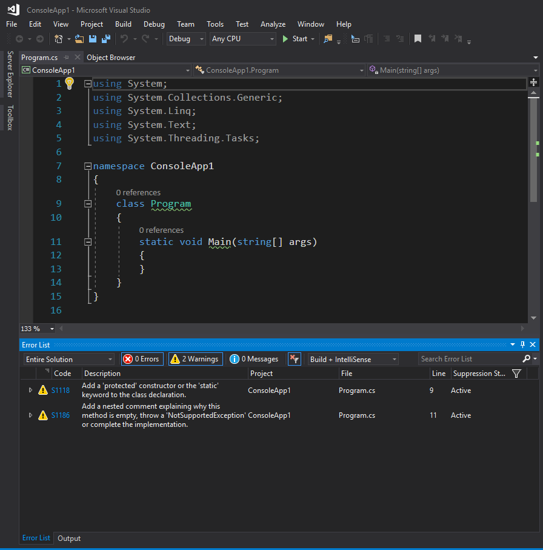
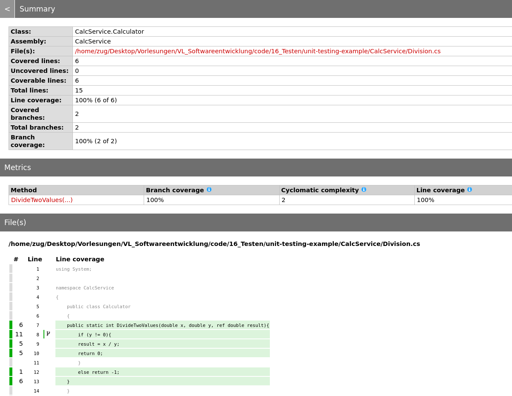

<!--

author:   Sebastian Zug, Galina Rudolf & André Dietrich
email:    sebastian.zug@informatik.tu-freiberg.de
version:  1.0.12
language: de
narrator: Deutsch Female
comment:  Softwarefehler, Testen zur Qualitätssicherung, Planung von Tests, Konzepte und Umsetzung in dotnet
tags:      
logo:     
title: Software-Testen

import: https://github.com/liascript/CodeRunner

import: https://raw.githubusercontent.com/TUBAF-IfI-LiaScript/VL_Softwareentwicklung/master/config.md

-->

[](https://liascript.github.io/course/?https://github.com/TUBAF-IfI-LiaScript/VL_Softwareentwicklung/blob/master/19_Testen.md)

# Testen von Software

| Parameter                | Kursinformationen                                                                      |
| ------------------------ | -------------------------------------------------------------------------------------- |
| **Veranstaltung:**       | `Vorlesung Softwareentwicklung`                                                        |
| **Teil:**                | `19/27`                                                                                |
| **Semester**             | @config.semester                                                                       |
| **Hochschule:**          | @config.university                                                                     |
| **Inhalte:**             | @comment                                                                               |
| **Link auf den GitHub:** | https://github.com/TUBAF-IfI-LiaScript/VL_Softwareentwicklung/blob/master/19_Testen.md |
| **Autoren**              | @author                                                                                |


---------------------------------------------------------------------


## Softwarefehler

                                    {{0-1}}
*******************************************************************************

Zu Erinnerung an die bereits diskutierten Softwarefehler ...

> 1999 verpasste die NASA-Sonde Mars Climate Orbiter den Landeanflug auf den Mars, weil die Programmierer unterschiedliche Maßsysteme verwendeten (ein Team verwendete das metrische und das andere das angloamerikanische) und beim Datenaustausch es so zu falschen Berechnungen kam. Eine Software wurde so programmiert, dass sie sich nicht an die vereinbarte Schnittstelle hielt, in der für den Impuls die metrische Einheit Newtonsekunde (N·s) festgelegt war – geliefert wurden jedoch Werte in der angloamerikanischen Einheit Pound-force-Sekunde (lbf·s). Die NASA verlor dadurch die Sonde. [Quelle](https://www.bernd-leitenberger.de/mco.shtml)

Softwarefehler sind sowohl sicherheitstechnisch wie ökonomisch ein erhebliches Risiko. Das **Consortium for Information & Software Quality (CISQ)** beziffert die Kosten schlechter Softwarequalität in den USA für das Jahr 2022 [^CISQ]:

+ Ca. **2,41 Billionen US-Dollar** betragen die jährlichen Gesamtkosten schlechter Softwarequalität (fehlerhafte Software, gescheiterte IT-Projekte, Betriebsstörungen).
+ Ca. **1,52 Billionen US-Dollar** davon entfallen auf aufgelaufene *technische Schulden* (technical debt) – also den Aufwand, um über die Zeit angehäufte strukturelle Mängel im Code nachträglich zu beheben.

[^CISQ]: Consortium for Information & Software Quality (CISQ): *The Cost of Poor Software Quality in the US: A 2022 Report*, November 2022. https://www.it-cisq.org/the-cost-of-poor-quality-software-in-the-us-a-2022-report/

*******************************************************************************


                                    {{1-2}}
*******************************************************************************

**Was sind Softwarefehler eigentlich?**

Ein Programm- oder Softwarefehler ist, angelehnt an die allgemeine Qualitätsterminologie. Die Norm DIN EN ISO 9000:2015 unterscheidet dabei:

> *Nichtkonformität* – „Nichterfüllung einer Anforderung“ (3.6.9)
>
> *Fehler* (defect) – „Nichtkonformität in Bezug auf einen beabsichtigten oder festgelegten Gebrauch“ (3.6.10)

Der Unterschied liegt im Gebrauchsbezug: Jeder *Fehler* ist eine *Nichtkonformität*, aber nicht jede Nichtkonformität ist ein Fehler.

| Situation                                                                                       | Nichtkonformität? | Fehler (defect)? |
| ----------------------------------------------------------------------------------------------- | :---------------: | :--------------: |
| Variablennamen verletzen den vereinbarten Coding-Standard (Funktion ist korrekt)                |        ja         |       nein       |
| Pflichtangabe „PLZ“ wird nicht validiert – ein Bestellformular akzeptiert leere Felder          |        ja         |        ja        |
| Die Doku nennt eine veraltete Versionsnummer, das Programm läuft aber wie spezifiziert          |        ja         |       nein       |
| Eine Zinsberechnung rundet falsch und überweist Kunden zu wenig Geld                            |        ja         |        ja        |

Die ersten beiden Beispiele verletzen jeweils eine *Anforderung* (Coding-Standard bzw. aktuelle Doku), beeinträchtigen aber nicht den beabsichtigten Gebrauch der Software – es sind Nichtkonformitäten, aber keine Fehler im engeren Sinn. Die anderen beiden wirken sich direkt auf die Nutzung aus und sind damit *Fehler*.

Konkret definiert sich der Fehler danach als

>  „Abweichung des IST (beobachtete, ermittelte, berechnete Zustände oder Vorgänge) vom SOLL (festgelegte, korrekte Zustände und Vorgänge), wenn sie die vordefinierte Toleranzgrenze [die auch 0 sein kann] überschreitet.“

Im Rahmen dieser Veranstaltung lassen wir Lexikalische Fehler und Syntaxfehler außen vor. Diese sind in der Regel über den Compiler identifizierbar. Darüber hinaus existieren aber :

| Fehlertyp                      | Folgen                                                                                                                                                          |
| ------------------------------ | --------------------------------------------------------------------------------------------------------------------------------------------------------------- |
| Spezifikations-/Anforderungsfehler | Die Software tut korrekt das Falsche – die Anforderung selbst war falsch, unvollständig oder missverständlich. Entsteht, bevor eine Zeile Code geschrieben ist. |
| Logische / semantische Fehler  | Anweisung ist zwar syntaktisch fehlerfrei, aber inhaltlich trotzdem fehlerhaft (plus statt minus, kleiner statt kleiner gleich, falsche Schleifengrenze, usw.) |
| Designfehler                   | Strukturelle Mängel auf der Modul- oder Systemebene, die das Zusammenspiel der Komponenten, deren Erweiterung, usw. verhindern.                                  |
| Nebenläufigkeitsfehler         | Race Conditions, Deadlocks, fehlende Synchronisation – treten oft nicht-deterministisch und nur unter bestimmten Timing-Bedingungen auf.                        |
| Fehler im Bedienkonzept        | Unintuitive Benutzung, das Programm "fühlt sich komisch an"                                                                                                     |

Darüber hinaus ist es wichtig zwischen Laufzeit- und Designzeitfehlern zu unterscheiden.

*******************************************************************************

                                    {{2-3}}
*******************************************************************************

**Wann entstehen Fehler im Projekt?**

| Phase                      | Typische Fehlerquellen                                                                                                              |
| -------------------------- | ----------------------------------------------------------------------------------------------------------------------------------- |
| Problem- und Systemanalyse | Anforderungen und Qualitätsmerkmale werden nicht festgelegt; es fehlen eindeutige Begriffsdefinitionen.                             |
| Systementwurf              | Die Systemarchitektur ist gar nicht oder nur mit großem Aufwand erweiterbar; das System ist nicht modular aufgebaut, die Daten sind nicht gekapselt. |
| Feinentwurf                | Schnittstellen sind nicht hinreichend spezifiziert; Interaktionsmodelle weisen Lücken auf.                                          |
| Codierung                  | Programmier-Standards bzw. -Richtlinien werden nicht beachtet; die Namensvergabe ist ungünstig.                                     |
| Betrieb und Wartung        | Die Dokumentation fehlt ganz, ist veraltet oder nicht adäquat; die Schulung der Anwender wird vernachlässigt; das Konfigurationsmanagement ist unzureichend. |


```ascii

          ^
 Fehler-  | +---------+
 kosten   | |         |
          | |         |
          | |         |
          | |         |
          | |         +----------+
          | |         |          |
          | |         |          +----------+
          | |         |          |          +----------+
          | |         |          |          |          +---------+
          | | Analyse | System-  | Imple-   | Integra- | Betrieb |
          | |         | entwurf  | mentier- | tion &   | und     |
          | |         |          | ung      | Tests    | Wartung |
          ----------------------------------------------------------->
                                              Software Lebenszyklus                                   .
```

*******************************************************************************

## Testen als Teil der Qualitätssicherung


                                    {{0-1}}
*******************************************************************************

**Welche Tests werden in das Projekt integriert?**

<!--
style="width: 100%; max-width: 560px; display: block; margin-left: auto; margin-right: auto;"
-->
````````````

         +------------------------------------------------------>   Zeit
         |
         |      Analyse                             Abnahmetest       KUNDE
         |          \                                   ^
         |           v                                 /          -.
         |        Grobentwurf                   Systemtests        |
         |             \                             ^             |
         |              v                           /              |
         |           Feinentwurf             Integrationstests      \  ENTWICKLER
 Detail- |                \                       ^                 /
 grad    |                 v                     /                 |
         |             Implementierung  --> Modultests             |
         |                                                        -'
         v
````````````

| Bezeichnung                                | Ebene                                                                                                                          | Durchführender / Ziel                                                                                                                                     |
| ------------------------------------------ | ------------------------------------------------------------------------------------------------------------------------------ | --------------------------------------------------------------------------------------------------------------------------------------------------------- |
| Modultest, Komponententest oder Unittest   | Funktionalität innerhalb einzelner abgrenzbarer Teile der Software (Module, Programme oder Unterprogramme, Units oder Klassen) | häufig durch den Softwareentwickler selbst, Nachweis der technischen Lauffähigkeit und korrekter fachlicher (Teil-) Ergebnisse                            |
| Integrationstest, Interaktionstest         | Zusammenarbeit voneinander abhängiger Komponenten                                                                              | Testschwerpunkt liegt auf den Schnittstellen der beteiligten Komponenten und soll korrekte Ergebnisse über komplette Abläufe hinweg nachweisen            |
| Systemtest                                 | Gesamtes System wird gegen die gesamten Anforderungen (funktionale und nicht-funktionale Anforderungen) getestet               | Test in einer Testumgebung statt / wird mit Testdaten  durchgeführt - Simulation einer realistischen Umgebung                                             |
| Abnahmetest, Verfahrenstest, Akzeptanztest | Testen der gelieferten Software durch den Kunden                                                                               | Rechtlich bindende Evaluation der Software und deren Bezahlung, unter Umständen bereits auf der Produktionsumgebung mit Kopien aus Echtdaten durchgeführt |

*******************************************************************************

                                            {{1-2}}
*******************************************************************************

**Warum geht es dann trotzdem schief?**

+ Es ist angeblich keine Zeit für systematische Tests vorhanden (Termindruck).
+ Die Notwendigkeit für systematische Tests wird nicht erkannt.
+ Die Tests werden manuell realisiert.
+ Die Erstellung von Testspezifikationen für systematische Tests wird nicht entwicklungsbegleitend durchgeführt.
+ Die Testebenen weisen eine unterschiedliche Realisierung auf (Modultests top, Systemtests flop)

*******************************************************************************

### Definition

Es gibt unterschiedliche Definitionen für den Softwaretest:

> „the process of operating a system or component under specified conditions, observing or recording the results and making an evaluation of some aspects of the system or component.“ [ursprünglich ANSI/IEEE Std. 610.12-1990, heute abgelöst durch ISO/IEC/IEEE 24765]

> „Test […] der überprüfbare und jederzeit wiederholbare Nachweis der Korrektheit eines Softwarebausteines relativ zu vorher festgelegten Anforderungen“ ist. [^Denert]

> "Unter Testen versteht man den Prozess des Planens, der Vorbereitung und der Messung, mit dem Ziel, die Eigenschaften eines IT-Systems festzustellen und den Unterschied zwischen dem tatsächlichen und dem erforderlichen Zustand aufzuzeigen. [^Pol]

Welche Unterschiede sehen Sie in den Definitionen?

<details>
<summary>Ein erkenntnistheoretischer Hinweis ...</summary>

Beachten Sie insbesondere den Anspruch der mittleren Definition, die *Korrektheit* nachzuweisen. Testen kann das streng genommen nicht leisten – es kann immer nur die *Anwesenheit* von Fehlern zeigen, nie deren *Abwesenheit*:

> „Program testing can be used to show the presence of bugs, but never to show their absence!“ [Edsger W. Dijkstra]

Die Definition von Pol et al. ist hier vorsichtiger formuliert: Sie spricht vom *Aufzeigen des Unterschieds* zwischen Soll- und Ist-Zustand – nicht vom Beweis der Korrektheit.

</details>

[^Denert]:  Ernst Denert: Software-Engineering. Methodische Projektabwicklung. Springer, Berlin u. a. 1991, ISBN 3-540-53404-0.

[^Pol]: Martin Pol, Tim Koomen, Andreas Spillner: Management und Optimierung des Testprozesses. Ein praktischer Leitfaden für erfolgreiches Testen von Software mit TPI und TMap. 2., aktualisierte Auflage. dpunkt.Verlag, Heidelberg 2002, ISBN 3-89864-156-2.

<details>
<summary>UVerifikation und Validierung?</summary>

> + **Verifikation** ... ist der Prozess, der sicherstellt, dass ein Softwareprodukt die Spezifikationen erfüllt und korrekt implementiert wurde. (_Bauen wir das Produkt richtig?_)
> + **Validierung** ... ist der Prozess, der sicherstellt, dass das Softwareprodukt die Bedürfnisse des Kunden erfüllt und die richtige Software entwickelt wurde. (_Bauen wir das richtige Produkt?_)

V&V (das *Ziel*) und die Frage nach der Programmausführung (die *Methode*) sind zwei unabhängige Dimensionen. Bei der Methode unterscheidet man **statisch** (ohne Ausführung – Reviews, statische Analyse, formaler Beweis) und **dynamisch** (durch Ausführung mit konkreten Eingaben). **Testen ist die dynamische Methode** und kann je nach Teststufe beide Ziele bedienen – Modultest (Verifikation) bis Abnahmetest (Validierung).

</details>

### Ablauf beim Testen

````````````
                   +------------------------------------------------+
                   |                                                |
             +-----+-----+      +-----------+      +------------+   |    +------------+
          +->| Testfälle |-+ +->| Testdaten |-+ +->| Ergebnisse |-+ | +->| Protokolle |
          |  +-----------+ | |  +-----------+ | |  +------------+ | | |  +------------+
          |                | |                | |                 | | |
          |                | |                | |                 | | |
          |                | |                | |                 | | |
          |                v |                v |                 v v |
  .---------------.  .---------------.  .--------------.  .---------------.
  | Entwerfen der |->| Erstellen der |->| Testaus-     |->| Vergleich der |
  | Testfälle     |  | Testdaten     |  | führung      |  | Ergebnisse    |
  .---------------.  .---------------.  .--------------.  .---------------.

````````````
Abbildung motiviert durch [^Somm01]

[^Somm01]:  Ian Sommerville: Software Engineering, Pearson Education, 6. Auflage, 2001

1. Entwerfen der Testfälle

+ Analyse der Anforderungen, Dokumentationen um erforderliche Testbedingungen festzulegen
+ Nachvollziehbarkeit der Entscheidungen, Weiterentwicklung bei Anpassungen in den Anforderungen bzw. der Spezifikation

2. Spezifizieren der Testfälle

+ Ausarbeitung der eigentlichen Beschreibung der Testfälle und Testdaten
+ Definition der erwarteten Resultate

3. Testausführung

+ (variable) Reihung der Testfälle  unter Berücksichtigung von Vor- und Nachbedingungen um Quereffekte abzubilden

4. Evaluation der Ergebnisse

### Klassifikation Testmethoden

<!--
style="width: 100%; display: block; margin-left: auto; margin-right: auto;"
-->
````````````
                            Prüfmethoden
                                  |
                +-----------------+------------------+
                |                                    |
            statisch                              dynamisch
                |                                    |
    +-----------+----+              +----------------+----------------+
    |                |              |                |                |
  verifi-         analy-         struktur-     spezifikations-    diversifi-
  zierend         sierend        orientiert    orientiert         zierend
                               (white box)     (black box)
                                    |
                            +-------+--------+
                            |                |
                      kontrollfluss-     datenfluss-
                      orientiert         bezogen                               .


````````````
Abbildung motivierte aus [^Liggesmeyer]

**Statische Code Analysen**

... ohne eine Ausführung allein anhand des Codes durchgeführt. Der
Quelltext wird hierbei einer Reihe formaler Prüfungen unterzogen, bei denen
bestimmte Sorten von Fehlern entdeckt werden können, noch bevor die
entsprechende Software (z. B. im Modultest) ausgeführt wird. Die Methodik gehört
zu den falsifizierenden Verfahren, d. h., es wird die Anwesenheit von Fehlern
bestimmt.

+ **Codeanalyse** ... In Anlehnung an das klassische Programm Lint wird der Vorgang der Analyse eines Codefragments auch als linten  (englisch linting) bezeichnet.

    Das folgende Beispiel zeigt die Ausgabe des Tools SonarLinter angewendet auf die
    initiale Implementierung einer Konsolenanwendung unter Visual Studio 2017. Welche
    Fehler können Sie ausmachen?



https://learn.microsoft.com/de-de/dotnet/fundamentals/code-analysis/overview?tabs=net-9

+ **Codereviews** ... Reviews sind manuelle Überprüfungen der Arbeitsergebnisse der Softwareentwicklung. Jedes Arbeitsergebnis kann einer Durchsicht durch eine andere Person unterzogen werden.

    Der untersuchte Gegenstand eines Reviews kann verschieden sein. Es wird vor
    allem zwischen einem Code-Review (Quelltext) und einem Architektur-Review
    (Softwarearchitektur, insbesondere Design-Dokumente) unterschieden.
 
https://www.codereviewchecklist.com/ 

+ ...

**Dynamische Code Analysen**

Dynamische Software-Testverfahren sind bestimmte Prüfmethoden, um mit
Softwaretests Fehler in der Software aufzudecken. Besonders sollen
Programmfehler erkannt werden, die in Abhängigkeit von dynamischen
Laufzeitparametern auftreten, wie variierende Eingabeparameter, Laufzeitumgebung
oder Nutzer-Interaktion.
Wesentliche Aufgabe der einzelnen Verfahren ist die Bestimmung geeigneter Testfälle für den Test der Software.

+ **strukturorientiert** ... Strukturorientierte Verfahren bestimmen Testfälle auf Basis des Softwarequellcodes (Whiteboxtest). Dabei steht entweder die enthaltenen Daten oder aber die Kontrollstruktur, die die Verarbeitung der Daten steuert, im Fokus.

+ **spezifikationsorientiert** ...  die sogenannten Black-Box Verfahren werden zum Abgleich des vorgegebenen, spezifizierten und des realen Verhaltens einer Methode genutzt. Beim Modultest wird z. B. gegen die Modulspezifikation getestet, beim Schnittstellentest gegen die Schnittstellenspezifikation und beim Abnahmetest gegen die fachlichen Anforderungen, wie sie etwa in einem Pflichtenheft niedergelegt sind.

+ **diversifizierend** .. Diese Tests analysieren die Ergebnisse verschiedener Versionen einer Software gegeneinander. Es findet entsprechend kein Vergleich zwischen den Testergebnissen und der Spezifikation statt! Zudem kann im Gegensatz zu den funktions- und strukturorientierten Testmethoden kein Vollständigkeitskriterium definiert werden. Die notwendigen Testdaten werden mittels einer der anderen Techniken, per Zufall oder Aufzeichnung einer Benutzer-Session erstellt.

[^Liggesmeyer]: Peter Liggesmeyer, "Software-Qualität - Testen, Analysieren und Verifizieren von Software", Springer, 2002

## Planung von Tests

Nehmen wir an, wir hätten eine Klasse MyMathFunctions mit zwei Methoden implementiert und sollen diese testen ...

```csharp
static class MyMathFunctions{
  //Fakultät der Zahl i
  public static int fak(int i) {...}
  // Grösstergemeinsamer Teiler von i, j und k
  public static int ggt(int i, int j, int k) {...}
}
```

> **Frage:** Mit wie vielen Tests könnten wir die Korrektheit der Implementierung nachweisen?

                 {{1-2}}
********************************************************************************

Ein vollständiges Testen aller `int` Werte ($2^{31}$ bis $2^{31}-1$) bedeutet für die Funktion `fak()` $2^{32}$ und für `ggt()` $2^{32} \cdot 2^{32} \cdot 2^{32}$ Kombinationen. Testen aller möglichen Eingaben ist damit nicht möglich. Für Variablen mit unbestimmtem Wertebereich (`string`) lässt sich nicht einmal die Menge der möglichen Kombinationen darstellen.

********************************************************************************

### Black-Box-Testing / Spezifikationsorientiert

> Black-Box-Testing ... Grundlage der Testfallentwicklung ist die Spezifikation
> des Moduls. Die Interna des Softwareelements sind nicht bekannt.

Die Güte der Testfälle ist definiert über die Abdeckung möglicher Kombinationen
der Eingangsparameter.

Für Black-Box-Testing existieren unterschiedliche Ausprägungen:

| Methode                                                              | Idee                                                                                                                                                            | Beispiel (Eingabe `Alter` für einen Tarif, gültig 18–65)                                            |
| ------------------------------------------------------------------- | ------------------------------------------------------------------------------------------------------------------------------------------------------------- | --------------------------------------------------------------------------------------------------- |
| **Äquivalenzklassenanalyse**                                        | Der Eingaberaum wird in Klassen zerlegt, die das Programm *vermutlich gleich* behandelt. Pro Klasse genügt ein Repräsentant – statt aller Werte nur wenige.    | drei Klassen: `< 18` (ungültig), `18–65` (gültig), `> 65` (ungültig) → z. B. Testwerte 10, 40, 80   |
| **Grenzwertanalyse** [Link](https://www.youtube.com/watch?v=GshMbff3mzw) | Fehler häufen sich *an den Rändern* der Äquivalenzklassen. Getestet werden gezielt die Grenzen und ihre direkten Nachbarn.                                  | Werte 17, 18, 19 und 64, 65, 66 – die Übergänge gültig/ungültig                                      |
| **Zustandsbasierte Testmethoden**                                   | Das Verhalten hängt nicht nur von der aktuellen Eingabe ab, sondern vom *Zustand* (Vorgeschichte). Getestet werden Zustände und erlaubte/verbotene Übergänge.  | Geldautomat: Karte → PIN → Auszahlung; Test: Auszahlung *ohne* vorherige PIN-Eingabe muss scheitern  |

Äquivalenzklassen- und Grenzwertanalyse ergänzen sich typischerweise: Erst werden
die Klassen gebildet, dann gezielt deren Grenzen abgetestet.

Problematisch ist dabei, dass spezifische Lösungen, wie zum Beispiel in folgendem Fall. Der Entwickler hat hier beschlossen die Performance der Berechnung der Fakultät zu steigern, um die Performance des Algorithmus für Werte kleiner 5 zu verbessern (hypothetisches Beispiel!).

```csharp
static class MyMathFunctions{
  public int fak (int i){
    if ( i==1 ) return 0;           // FEHLER: fak(1) == 1, nicht 0!
    elseif (i == 2) return 1;       // FEHLER: fak(2) == 2, nicht 1!
    elseif  ... Ergebnisse für 3 und 4 ...
    elseif (i == 5) return 120;
    else return i * fak(i-1);
  }
}
```

Mit den alleinigen Testfällen `fak(5)==120`, `fak(6)==720` und `fak(10)==3628800` bleiben mögliche Fehler für `fak(1)` und `fak(2)` verborgen.

### White-Box-Testing / Strukturorientiert

> White-Box-Testing ... beim „quelltextbasierten Testen“ sind die Interna des
> getesteten Softwareelements bekannt und werden zur Bestimmung der Testfälle
> verwendet

White-Box-Testing-Verfahren zerlegen das Programm (statisch oder dynamisch)
entsprechend dem Kontrollfluss. Die Güte der Testfälle wird danach beurteilt,
wie groß der Anteil der abgedeckten Programmpfade ist. Die Bewertung kann dabei
anhand differenzierter Metriken erfolgen:

+ Zeilenabdeckung
+ Anweisungsüberdeckung
+ Zweigüberdeckung
+ Pfadüberdeckung
+ ...

**C_0 Anweisungsüberdeckung**

Anweisungsüberdeckung (auch $C_0$-Test genannt) zerlegt das Programm statisch in
seine Anweisungen und bestimmt den Anteil der in den Testfällen berücksichtigten
Anweisungen. Üblich ist eine Prüfung von 95%-100% aller Anweisungen durch als
$C_0$-Kriterium anzustreben:

$$
C_0 = \frac{\text{Anzahl überdeckte Anweisungen}}{\text{Gesamtanzahl der Anweisungen}}
$$

```csharp
static class MyMathFunctions{
  public int fak (int i){                    // Anweisung
    if ( i==1 ) return 0;                    // 1
    elseif (i == 2) return 1;                // 2
    elseif  ... Ergebnisse für 3 und 4 ...   // 3 - 4
    elseif (i == 5) return 120;              // 5
    else return i * fak(i-1);                // 6
  }
}
```

Der oben genannten Black-Box-Test $i = \{5, 6, 10\}$ adressierte lediglich 2
der Anweisungen und generiert damit ein $C_0 = \frac{2}{6} = 0.33$. Mit dem Wissen
um die Codestruktur, kann der White-Box-Test sehr schnell den Nachweis erbringen,
dass das gezeigte Black-Box-Vorgehen nur unzureichend die Qualität des Codes
abprüft.

```csharp
static class MyMathFunctions{
  public int fak (int i){                    // Anweisung
    int [] facArray = new int [10];          // 1
    facArray[0] = 1;                         // 2
    facArray[1] = 1;
    ...
    facArray[9] = 1;                         // 9
    // besser:
    // int [] facArray = new int[] { 1, 3, 5, 7, 9 };
    if ( i<10 ) return facArray[i];          // 10 + 11
    else return i * fak(i-1);                // 12
  }
}
```

Mit dem Testfall $i = 1$ lassen sich hingegen vermeintlich $11/12 = 0.91$ der
Anweisungen abdecken, die Fehleinschätzung ist aber offensichtlich. Gleichwohl
sind die fest hinterlegten Werte aus Erfahrung heraus auch besonders anfällig
für Copy-&-Paste-Fehler.

**C_1 Zweigüberdeckungstest**

Der Zweigüberdeckungstest  umfasst den
Anweisungsüberdeckungstest vollständig. Für den C1–Test müssen strengere
Kriterien erfüllt werden als beim Anweisungsüberdeckungstest. Im Bereich des
kontrollflussorientierten Testens wird der Zweigüberdeckungstest als
Minimalkriterium angewendet. Mit Hilfe des Zweigüberdeckungstests lassen sich
nicht ausführbare Programmzweige aufspüren. Anhand dessen kann man dann
Softwareteile, die oft durchlaufen werden, gezielt optimieren.

Die [Zyklomatische Komplexität](https://de.wikipedia.org/wiki/McCabe-Metrik) gibt an, wie viele Testfälle höchstens nötig sind, um eine Zweigüberdeckung zu erreichen.

$$
C_1 = \frac{\text{Anzahl überdeckten Zweige}}{\text{Gesamtanzahl der Zweige}}
$$

```csharp
static class MyMathFunctions{
  public int fak (int i){                    // Verzweigungen
    int [] facArray = new int [10];          //
    facArray[0] = 1;                         //
    facArray[1] = 1;
    ...
    facArray[9] = 1;                         //
    // besser:
    // int [] facArray = new int[] { 1, 3, 5, 7, 9 };
    if ( i<10 ) return facArray[i];          // 1. Verzweigung
    else return i * fak(i-1);                //
  }
}
```

Mit dem Testfall $i = 1$ ergibt sich eine $C_1$-Abdeckung von $0.5$.

**C_2 Pfadüberdeckung**

Das $C_1$ Kriterium berücksichtigt keine Schleifen im zu untersuchenden Code.
Der "Pfad" beschreibt gegenüber dem "Zweig" aber eben auch die mehrfache
Ausführung ein und des selben Zweiges. Diese Untersuchung muss entsprechend
Schleifen in variabler Durchlaufzahl umsetzten.

**C_3 Bedingungsüberdeckungstest**

$C_3$ Tests betrachten *zusammengesetzte* Verzweigungsbedingungen (z. B. `a || b`)
und prüfen nicht nur das Gesamtergebnis der Bedingung, sondern die Wahrheitswerte
der einzelnen Teilbedingungen. Je nachdem, wie vollständig diese Teilbedingungen
kombiniert werden, unterscheidet man drei Ausprägungen.

```csharp
static class MyMathFunctions{
  public int fak (int i){                    // Verzweigungen
    boolean a, b;
    if (a || b) { ... }
    else { ... }
  }
}
```
<!-- data-type="none" -->
|      | Test                                         | Testfälle im Beispiel                |
| ---- | -------------------------------------------- | ------------------------------------ |
| C_3a | Einfachbedingungsüberdeckungstest            | 2 – jede Teilbedingung je einmal true/false, z. B. (a=true, b=false) und (a=false, b=true). Deckt **nicht** zwingend beide Zweige ab! |
| C_3b | Mehrfachbedingungsüberdeckungstest           | $2^n$ – alle Kombinationen der Teilbedingungen (vollständige Wahrheitstabelle) |
| C_3c | minimaler Mehrfachbedingungsüberdeckungstest | $\le 2^n$ – jede Teilbedingung beeinflusst das Ergebnis nachweislich allein (MC/DC) |

> [!IMPORTANT]
> Die Überdeckung eines Codes lässt sich nicht durch *eine* Kennzahl ausdrücken, sondern erst durch das Zusammenspiel der Kriterien $C_1$ bis $C_3$. Sie beleuchten unterschiedliche Strukturmerkmale – Zweige ($C_1$), Pfade und Schleifen ($C_2$) sowie zusammengesetzte Bedingungen ($C_3$) – und gehen gerade *nicht* vollständig ineinander auf. Erst gemeinsam, als Profil betrachtet, ergeben sie ein belastbares Bild der Testabdeckung.


## Und jetzt konkret!

Exkurs: Attribute in C#
-----------------------------

Im Folgenden werden wir Attribute als Hilfsmittel verwenden. Entsprechend soll an dieser Stelle ein kurzer Einschub die Möglichkeiten dieser Zuordnung von Metainformationen zum C# Code verdeutlichen.

Attribute erlaube es Zusatzinformationen oder Bedingungen in Code (Assemblys, Typen, Methoden, Eigenschaften usw.) einzubinden. Nach dem Zuordnen eines Attributs zu einer Programmentität kann das Attribut zur Laufzeit mit einer Technik namens Reflektion abgefragt werden.

In C# sind Attribute Klassen, die von der Attribute-Basisklasse erben. Alle Klassen, die von Attribute erben, können als eine Art von „Tag“ für andere Codeelemente verwendet werden. Beispielsweise gibt es das Attribut ObsoleteAttribute. Mit diesem Attribut wird gekennzeichnet, dass der Code veraltet ist und nicht mehr verwendet werden sollte.

Beispiele für Standardattribute sind:

| Name                                                                     | Bedeutung                                                                                                                                                          |
| ------------------------------------------------------------------------ | ------------------------------------------------------------------------------------------------------------------------------------------------------------------ |
| `[Obsolete]`, `[Obsolete("ThisClass is obsolete. Use ThisClass2 instead.")`] |                                                                                                                                                                    |
| `[Conditional("Test")]`                                                    | Wenn die Zeichenfolge nicht einer #define-Anweisung entspricht, werden alle Aufrufe dieser Methode (aber nicht die Methode selbst) durch den C#-Compiler entfernt. |

Attribute werden in rechteckigen Klammern den jeweiligen Codeelementen vorangestellt. Es können mehrere davon kombiniert werden.

```csharp   ConditionalExample.cs
#define CONDITION1
#define CONDITION2

using System;
using System.Diagnostics;

class Test
{
  static void Main()
  {
    Console.WriteLine("Standard Code ");
    Method0(0);
    Console.WriteLine("Calling Method1");
    Method1(3);
    Console.WriteLine("Calling Method2");
    Method2();
  }

  public static void Method0(int x)
  {
      Console.WriteLine("Here we run actual algorithm.");
  }

  [Conditional("CONDITION1")]
  public static void Method1(int x)
  {
      Console.WriteLine("CONDITION1 is defined");
  }

  [Conditional("CONDITION1"), Conditional("CONDITION2")]
  public static void Method2()
  {
      Console.WriteLine("CONDITION1 or CONDITION2 is defined");
  }
}
```
@LIA.eval(`["main.cs"]`, `mcs main.cs`, `mono main.exe`)

Die Festlegung der Kompilierungsvorgänge anhand von Hinhalten der eigentlichen Code Dateien scheint "unglücklich". Es bietet sich natürlich an, die zugehörigen Konfigurationen in unsere Projektdateien auszulagern.

```csharp PreprocessorConsts.cs
using System;
using System.Diagnostics;

class Test
{
  static void Main()
  {
    Console.WriteLine("Standard Code ");
    Method0(0);
    Console.WriteLine("Calling Method1");
    Method1(3);
    Console.WriteLine("Calling Method2");
    Method2();
  }

  public static void Method0(int x)
  {
      Console.WriteLine("Here we run actual algorithm.");
  }

  [Conditional("CONDITION1")]
  public static void Method1(int x)
  {
      Console.WriteLine("CONDITION1 is defined");
  }

  [Conditional("CONDITION1"), Conditional("CONDITION2")]
  public static void Method2()
  {
      Console.WriteLine("CONDITION1 or CONDITION2 is defined");
  }
}
```
```-xml  PreprocessorConsts.csproj
<Project Sdk="Microsoft.NET.Sdk">
  <PropertyGroup>
    <OutputType>Exe</OutputType>
    <TargetFramework>net8.0</TargetFramework>
    <DefineConstants>CONDITION2;CONDITION1;</DefineConstants>
  </PropertyGroup>
</Project>
```
@LIA.eval(`["Program.cs", "project.csproj"]`, `dotnet build -nologo`, `dotnet run -nologo`)


### Idee 1: Eigenen Testmethoden

```csharp          ManuellesTesten
using System;

// Zu testende Klasse
public class Calculator
{
  public static int DivideTwoValues(double x, double y, ref double result){
    if (y != 0){
      result = x / y;
      return 0;
    }
    else return -1;
  }
}

// Testklasse
public class TestCalculator{
  public static void Test_DivideMethod(){
    double result = 0;
    int state = Calculator.DivideTwoValues(3,4, ref result);
    if ((state == 0) & (result == 0.75))
    {
      Console.WriteLine("Test bestanden !");
    }
    else{
      Console.WriteLine("Test fehlgeschlagen");
    }
  }
}

// Anwendungsprogramm
public class Program
{
  public static void Main(string[] args)
  {
    //double result = 0;
    //int state = Calculator.DivideTwoValues(3,4, ref result);
    //Console.WriteLine($"Das Ergebnis lautet {result}, der State {state}.");
    TestCalculator.Test_DivideMethod();
  }
}
```
@LIA.eval(`["main.cs"]`, `mcs main.cs`, `mono main.exe`)

Welche Funktionalität fehlt Ihnen in diesem Setup? Welche weitergehenden Features
würden Sie für unsere Testmethoden vorschlagen?

### Idee 2: Test-Frameworks

```csharp    TestCase MStest
[TestClass]   // <-- Framework spezifisch
public class CalculatorTests
{
    [TestMethod]   // <-- Framework spezifisch
    public void TestMethod1()
    {
        // Arrange
        double result = 0;
        double x = 3, y = 4;
        double expected = 0.75;

        // Act
        int state = Calculator.DivideTwoValues(x, y, ref result);

        // Assert
        Assert.AreEqual(expected, result);   // Konvention: (expected, actual)
        //       ^---- Framework specifisch
    }
}
```

Vorteile:

+ Leistungsfähige API (automatisierte Tests, variable Input-Parameter, Berücksichtigung von Exceptions)
+ "Standardisiertes" Nutzungskonzept
+ Integration in die Entwicklungsumgebungen

Nachteil:

+ verschiedene Interpretationen und Performance der Frameworks

Die wichtigsten Tools unter C# sind [xUnit](https://xunit.net/), [nunit](https://nunit.org/), [MSTest](https://docs.microsoft.com/de-de/dotnet/core/testing/unit-testing-with-mstest). Einen guten Überblick zum Vergleich der Schlüsselworte liefert [Link](http://www.anarsolutions.com/automated-unit-testing-tools-comparison/)

Hierzu nutzen wir das xunit Framework. Eine Folge von Tests für unsere `DivideTwoValues()` Methode könnte dann wie folgt aussehen.

```csharp
using Xunit;

public class Test_DivideTwoValues
{
    [Fact]
    public void Check_StateEqualPositiveInputs()
    {
        // Arrange
        double result = 0;
        double dividend = 5;
        double divisor = dividend;
        int expected = 0;
        // Act
        var state = Calculator.DivideTwoValues(dividend, divisor, ref result);
        // Assert
        Assert.Equal(expected, state);
    }

    [Fact]
    public void Check_StateZeroAsDivisor()
    {
        // Arrange
        double result = 0;
        double dividend = 5;
        double divisor = 0;
        int expected = -1;
        // Act
        var state = Calculator.DivideTwoValues(dividend, divisor, ref result);
        // Assert
        Assert.True(expected == state);
    }

    [Theory]                                             // Übergabe von variablen Parametersets
    [InlineData(10, 2, 5)]
    [InlineData(5, 2, 2.5)]
    [InlineData(double.MaxValue, double.MaxValue, 1)]    // Edge Cases
    [InlineData(double.MaxValue, 1, double.MaxValue)]
    public void Check_ResultCalculation(double dividend, double divisor, double expected)
    {
        // Arrange
        double result = 0;
        // Act
        var state = Calculator.DivideTwoValues(dividend, divisor, ref result);
        // Assert
        Assert.Equal(expected, result);
    }
}
```

### Was macht einen *guten* Test aus?

Bisher haben wir gefragt, *ob* ein Test läuft. Mindestens ebenso wichtig ist,
*wie* er geschrieben ist. Ein xUnit-Test, der durchläuft, ist nicht automatisch
ein guter Test.

**Das AAA-Muster (Arrange – Act – Assert)**

Ist Ihnen die Kommentarstruktur in allen bisherigen Beispielen aufgefallen? Sie
ist kein Zufall, sondern eine etablierte Konvention:

+ **Arrange** ... Testumgebung aufbauen (Objekte, Eingabewerte, erwartete Ergebnisse)
+ **Act** ... die zu testende Aktion *einmalig* ausführen
+ **Assert** ... das tatsächliche gegen das erwartete Ergebnis prüfen

Ein Test sollte **genau eine Sache** prüfen. Mehrere Asserts sind erlaubt, wenn
sie denselben Sachverhalt absichern — aber ein Test, der drei unabhängige Dinge
testet, sagt im Fehlerfall nicht, *welches* davon kaputt ist.

**FIRST-Prinzipien**

Gute Unit-Tests erfüllen die fünf FIRST-Kriterien:

| Buchstabe         | Bedeutung                                                                                  |
| ----------------- | ------------------------------------------------------------------------------------------ |
| **F**ast          | schnell genug, um sie bei *jeder* Änderung laufen zu lassen (Millisekunden, nicht Sekunden) |
| **I**solated      | unabhängig voneinander — keine geteilte Reihenfolge, kein gemeinsamer Zustand              |
| **R**epeatable    | gleiches Ergebnis bei jedem Lauf (kein `DateTime.Now`, kein Zufall, keine echte Datenbank)  |
| **S**elf-validating | bestanden/fehlgeschlagen ist automatisch entscheidbar — kein manuelles Ablesen der Ausgabe |
| **T**imely        | zeitnah geschrieben, idealerweise *vor* oder *mit* dem Produktivcode (vgl. TDD)            |

**Test-Smells — Warnzeichen schlechter Tests**

+ **Logik im Test** ... `if`/`for`/Berechnungen im Testcode. Dann testet man den
  Test mit. Erwartete Werte gehören als Literal in den Test.
+ **Abhängige Tests** ... Test B funktioniert nur, wenn Test A vorher lief.
+ **Test ohne Assert** ... ruft nur die Methode auf und prüft nichts (außer "wirft keine Exception").
+ **Jagd nach der Coverage-Zahl** ... Tests, die Zeilen *durchlaufen*, aber nichts
  *prüfen*, heben die Coverage, nicht die Qualität (siehe `facArray`-Beispiel).

Wie setzen wir das Ganze um?

```
dotnet new sln -o unit-testing-example
cd unit-testing-example
dotnet new classlib -o CalcService         // Code der Divisionsoperation einfügen
mv CalcService/Class1.cs CalcService/Division.cs
dotnet sln add ./CalcService/CalcService.csproj
dotnet new xunit -o CalcService.Tests      // obigen Testcode einfügen
dotnet add ./CalcService.Tests/CalcService.Tests.csproj reference ./CalcService/CalcService.csproj
dotnet sln add ./CalcService.Tests/CalcService.Tests.csproj
```

Damit entsteht eine `solution`, die zwei `project` umfasst - die eigentliche Anwendung als `classlib` und die Testfälle.

```
.
├── CalcService
│   ├── CalcService.csproj
│   ├── Division.cs
├── CalcService.Tests
│   ├── CalcService.Tests.csproj
│   └── UnitTest1.cs
└── unit-testing-example.sln
```

Das Ausführen der Tests ist nun mit `dotnet test` möglich.

Eine automatische Generierung von Test Merkmalen ist mit Hilfe zusätzlicher Tools, die in dotnet integriert sind möglich.

```
dotnet add package coverlet.collector
dotnet tool install --global dotnet-reportgenerator-globaltool
dotnet tool install --global coverlet.console

dotnet test --collect:"XPlat Code Coverage" --results-directory:"./.coverage"
reportgenerator "-reports:.coverage/**/*.cobertura.xml" "-targetdir:.coverage-report/" "-reporttypes:HTML;"
```

Das Argument "XPlat Code Coverage" bezieht sich auf das Zwischenformat der Darstellung. Das `./.coverage` dient zur Angabe des Verzeichnisses, in dem die Ergebnisse gespeichert werden sollen. Wenn keines angegeben wird, wird standardmäßig ein TestResults-Verzeichnis innerhalb jedes Projekts verwendet. `reportgenerator` erzeugt dann die entsprechende html-Repräsentation.



> **Brücke zur Theorie:** Was der Report als *"Line Coverage"* ausweist, ist
> nichts anderes als das weiter oben eingeführte **$C_0$-Kriterium
> (Anweisungsüberdeckung)**. Die Spalte *"Branch Coverage"* entspricht dem
> **$C_1$-Kriterium (Zweigüberdeckung)**. `coverlet` misst also genau die
> Metriken, die wir im White-Box-Abschnitt von Hand berechnet haben — nur
> automatisiert.
>
> Achtung: Der Report sagt **nicht**, ob Ihre Tests *gut* sind. Erinnern Sie
> sich an das `facArray`-Beispiel — dort erreichte ein einziger Testfall
> ($i = 1$) eine Line Coverage von 91 %, ohne einen einzigen der versteckten
> Copy-&-Paste-Fehler aufzudecken. **Hohe Coverage ist notwendig, aber nicht
> hinreichend für Qualität.**

> Im Projektordner finden Sie die gesamte Testimplementierung. Diese wurde um eine Python Applikation erweitert, die eine Sprachübergreifende Nutzung einer Csharp Bibliothek illustriert.

## Fazit

> Testen auf Modulebene - reicht das aus?

Testen auf Modulebene ist ein wichtiger Bestandteil der Softwareentwicklung, aber es ist nicht ausreichend, um die Qualität eines gesamten Systems zu gewährleisten. Es deckt nur die kleinsten Einheiten ab und stellt sicher, dass diese korrekt funktionieren. Allerdings können Fehler in der Interaktion zwischen Modulen oder in der Systemintegration unentdeckt bleiben.


## Erweiterung

| Testart                | Fokus            | Isolation   | Beispiel                          |
| ---------------------- | ---------------- | ----------- | --------------------------------- |
| Unit-Test              | Methode/Funktion | vollständig | `Addiere(int a, int b)`           |
| Modul-/Komponententest | Klasse/Modul     | teilweise   | `Warenkorb.AddArtikel()`          |
| Integrationstest       | mehrere Module   | gering      | Bestellung -> Lager -> Versand    |
| Systemtest             | gesamte App      | keine       | App starten und Bestellung testen |

### Testen auf Modulebene
 

Modul oder Komponententests sind Tests, die sich auf einzelne Module oder Komponenten einer Software konzentrieren. Sie überprüfen die Funktionalität und das Verhalten dieser Module isoliert von anderen Teilen des Systems. 

```csharp
using Xunit;

public class WarenkorbTests {
    [Fact]
    public void Test_Gesamtpreis_fuer_mehrere_Artikel() {
        // Arrange
        var korb = new Warenkorb();
        korb.Hinzufügen(new Artikel { Name = "Buch", Preis = 10.0m });
        korb.Hinzufügen(new Artikel { Name = "Stift", Preis = 2.0m });

        // Act
        var gesamt = korb.Gesamtpreis();

        // Assert
        Assert.Equal(12.0m, gesamt);
    }
}
```

In der realen Software bestehen viele Klassen aus Abhängigkeiten zu anderen Komponenten – z. B. Datenbanken, externe Dienste oder Services.

**Mocks** sind Test-Doubles, mit denen du diese Abhängigkeiten im Test ersetzen kannst, um:

- das Verhalten der Komponente isoliert zu testen
- kontrollierte Rückgaben zu simulieren
- Seiteneffekte zu vermeiden


__Warum ist Mocking wichtig?__

Ohne Mocks würdest du in jedem Testfall:

- eine echte Datenbank ansprechen 
- eine E-Mail versenden 
- einen Webservice kontaktieren 

Das macht Tests langsam, fehleranfällig und unzuverlässig.

__Best Practices beim Mocking__

- Mocke nur explizite Abhängigkeiten (nicht alles!)
- Nutze Interfaces oder abstrakte Klassen als Testanker
- Verwende `.Setup(...)` nur für erwartetes Verhalten
- Nutze `.Verify(...)` zur Kontrolle von Aufrufen (z. B. ob ein E-Mail-Versand ausgelöst wurde)

Produktionscode:

```csharp
public interface IPreisDienst {
    decimal GibPreis(string artikelId);
}

public class Kasse {
    private readonly IPreisDienst _preisDienst;

    public Kasse(IPreisDienst preisDienst) {
        _preisDienst = preisDienst;
    }

    public decimal BerechneGesamtpreis(string artikelId, int menge) {
        var einzelpreis = _preisDienst.GibPreis(artikelId);
        return einzelpreis * menge;
    }
}
```

> Testcode mit Mocking - Der Mock ersetzt die Abhängigkeit (IPreisDienst), damit der echte Prüfling (Kasse) unter vollständig kontrollierten Bedingungen getestet werden kann. Wir legen einen generischen Mock an, der als Preisdienst fungiert — und reichen ihn der echten Kasse herein.

```csharp
using Moq;
using Xunit;

public class KasseTests {
    [Fact]
    public void BerechneGesamtpreis_mit_MockDienst() {
        // Arrange
        var mockDienst = new Mock<IPreisDienst>();
        mockDienst.Setup(d => d.GibPreis("A1")).Returns(10.0m);
                                  
        var kasse = new Kasse(mockDienst.Object);

        // Act
        var gesamt = kasse.BerechneGesamtpreis("A1", 3);

        // Assert
        Assert.Equal(30.0m, gesamt);
    }
}
```

### Integrationstests

Ein **Integrationstest** prüft das **Zusammenspiel mehrerer Module oder Klassen**, z. B.:

- Controller ↔ Service ↔ Datenbank  
- UI ↔ Backend ↔ API  
- Repository ↔ Domain-Logik

> Ziel ist es, **Schnittstellenfehler** und **Zusammenarbeitsprobleme** zu erkennen – bevor das System als Ganzes getestet wird.

Produktionscode:

```csharp
// Domainmodell
public class Artikel {
    public int Id { get; set; }
    public string Name { get; set; }
    public decimal Preis { get; set; }
}

// Repository
public class ArtikelRepository {
    private readonly DbContext _ctx;
    public ArtikelRepository(DbContext ctx) => _ctx = ctx;

    public void Speichern(Artikel a) {
        _ctx.Add(a);
        _ctx.SaveChanges();
    }

    public Artikel? Finde(int id) => _ctx.Set<Artikel>().Find(id);
}
```

Testcode mit In-Memory-Datenbank (Fake statt Mock):

> Achtung – Abgrenzung zum Unittest oben: Dort haben wir die Abhängigkeit
> (`IPreisDienst`) durch einen **Mock** ersetzt, der *kein eigenes Verhalten*
> besitzt und nur die per `.Setup(...)` diktierte Antwort liefert. Hier dagegen
> läuft die **echte** EF-Core-Logik (`Add`, `SaveChanges`, `Find`, Schlüsselvergabe) –
> nur das Speichermedium ist durch RAM ersetzt. Ein gemockter `DbContext` würde
> genau das aushebeln, was der Integrationstest beweisen soll: das **Zusammenspiel**
> von Repository und Kontext.

```csharp
using Xunit;
using Microsoft.EntityFrameworkCore;

public class ArtikelRepositoryTests {
    [Fact]
    public void Speichern_und_Lesen_von_Artikeln() {
        // Arrange: In-Memory-Kontext
        var options = new DbContextOptionsBuilder<DbContext>()
            .UseInMemoryDatabase("TestDB")
            .Options;

        using var ctx = new DbContext(options);
        var repo = new ArtikelRepository(ctx);
        var artikel = new Artikel { Name = "Test", Preis = 5.0m };

        // Act
        repo.Speichern(artikel);
        var gelesen = repo.Finde(artikel.Id);

        // Assert
        Assert.NotNull(gelesen);
        Assert.Equal("Test", gelesen?.Name);
    }
}
```

> Anstatt einen echten Datenbankserver zu verwenden, nutzen wir eine **In-Memory-Datenbank** für die Tests. Diese ermöglicht aber auch wesentlich konkrete Umsetzungen als die Mock-Objekte, da sie die tatsächliche Datenbank-Logik "simuliert".

>[!IMPORTANT]
> Beim Unittest mit Mock ersetzt du die Abhängigkeit vollständig — der Test sagt nichts über deren echtes Verhalten aus, nur über den Prüfling.
> Beim Integrationstest willst du genau das Zusammenspiel prüfen — deshalb darfst du dort gerade nicht mocken, sondern nutzt einen Fake (In-Memory-DB), der die echte Logik durchlaufen lässt.

### Testen auf Systemebene

Ein **Systemtest** überprüft das **gesamte Systemverhalten** aus Sicht des Endnutzers.  
Dabei wird die gesamte Anwendung als Black Box getestet – **alle Komponenten, Module und Schnittstellen** sind integriert.

> Ziel: Sicherstellen, dass das System als Ganzes die Anforderungen erfüllt.


| Testart          | Fokus                         | Perspektive     |
| ---------------- | ----------------------------- | --------------- |
| Unittest         | Einzelne Methode              | Entwickler      |
| Komponententest  | Klasse/Modul                  | Entwickler      |
| Integrationstest | Zusammenspiel mehrerer Module | Entwickler      |
| **Systemtest**   | Gesamtsystem                  | **Nutzer / Tester** |


Eigenschaften von Systemtests

- Arbeiten mit **realen oder simulierten Datenbanken, Schnittstellen, UI**
- Testen **End-to-End-Szenarien** (z. B. Anmeldung, Bestellung, Zahlung)
- Häufig **automatisiert** mit Tools wie Selenium, Playwright oder TestServer
- Können auch **manuell** durchgeführt werden (z. B. nach Checklisten)

**Ein lauffähiges Beispiel mit dem TestServer**

Auch ein Systemtest lässt sich automatisieren. .NET bringt dafür die
`WebApplicationFactory` mit: Sie startet die **komplette Anwendung** in einem
In-Memory-Webserver (alle Komponenten, Middleware, Routing integriert) und
schickt echte HTTP-Anfragen dagegen — ohne externen Browser oder Server. Der Test
sieht die Anwendung von außen als **Black Box**, genau aus der Nutzerperspektive.

Produktionscode (eine minimale Web-API):

```csharp
var builder = WebApplication.CreateBuilder(args);
var app = builder.Build();

app.MapGet("/preis/{artikelId}", (string artikelId) =>
    artikelId == "A1" ? Results.Ok(10.0m) : Results.NotFound());

app.Run();

public partial class Program { }   // macht Program für die Tests sichtbar
```

Systemtest (End-to-End über echtes HTTP):

```csharp
using Microsoft.AspNetCore.Mvc.Testing;
using Xunit;

public class PreisApiSystemTests : IClassFixture<WebApplicationFactory<Program>>
{
    private readonly WebApplicationFactory<Program> _factory;

    public PreisApiSystemTests(WebApplicationFactory<Program> factory)
        => _factory = factory;

    [Fact]
    public async Task GET_Preis_fuer_bekannten_Artikel_liefert_200()
    {
        // Arrange: gesamte App hochfahren, HTTP-Client holen
        var client = _factory.CreateClient();

        // Act: echte HTTP-Anfrage gegen die laufende Anwendung
        var antwort = await client.GetAsync("/preis/A1");

        // Assert: Verhalten aus Nutzersicht
        antwort.EnsureSuccessStatusCode();
        var preis = await antwort.Content.ReadAsStringAsync();
        Assert.Equal("10.0", preis);
    }

    [Fact]
    public async Task GET_Preis_fuer_unbekannten_Artikel_liefert_404()
    {
        var client = _factory.CreateClient();
        var antwort = await client.GetAsync("/preis/UNBEKANNT");
        Assert.Equal(System.Net.HttpStatusCode.NotFound, antwort.StatusCode);
    }
}
```

> Im Gegensatz zum Unit-Test wird hier **nichts gemockt oder substituiert**: Routing, Modellbindung
> und Endpunktlogik laufen real zusammen. Das ist der Preis (langsamer, mehr
> Fehlerquellen) und zugleich der Gewinn (testet, was der Nutzer tatsächlich
> erlebt) eines Systemtests — genau die Abwägung, die die Testpyramide unten
> zeigt.


## Vergleich 

| Kriterium               | **Methodentest** (Unit Test)       | **Komponententest**                            | **Integrationstest**                         | **Systemtest**                              |
| ----------------------- | ---------------------------------- | ---------------------------------------------- | -------------------------------------------- | ------------------------------------------- |
| **Testobjekt**          | Einzelne Methode oder Funktion     | Klasse oder Modul mit internen Abhängigkeiten  | Zusammenspiel mehrerer Komponenten/Module    | Gesamtsystem (End-to-End)                   |
| **Ziel**                | Korrektheit der kleinsten Einheit  | Zusammenarbeit mehrerer Funktionen             | Schnittstellen und Zusammenarbeit testen     | Verhalten des Systems aus Sicht des Nutzers |
| **Abhängigkeiten**      | Werden meist gemockt oder isoliert | Können teilweise eingebunden oder ersetzt sein | Echte Implementierungen (z. B. DB, Services) | Realitätsnahe, echte Umgebung               |
| **Beispiel**            | `CalculateSum(int a, int b)`       | `UserService` mit `EmailService`               | `UserController` ↔ `UserRepository` (mit DB) | REST-API ↔ Datenbank ↔ Frontend             |
| **Tools**               | xUnit, NUnit                       | xUnit + Moq/Fakes                              | xUnit + InMemory DB / Testcontainers         | Selenium, Postman, TestServer               |
| **Laufzeit**            | Sehr kurz                          | Mittel                                         | Mittel bis lang                              | Lang                                        |
| **Testgeschwindigkeit** | 🔵 Schnell                        | 🟡 Mittel                                     | 🟡 Mittel                                   | 🔴 Langsam                                 |
| **Zuverlässigkeit**     | Hoch (bei guter Isolation)         | Mittel (Abhängigkeiten können stören)          | Mittel (mehr Fehlerquellen möglich)          | Niedriger (viele beteiligte Komponenten)    |
| **Fehlersuche**         | Sehr präzise                       | Eingrenzbar                                    | Eingrenzbar mit Fokus auf Schnittstellen     | Schwieriger (viele beteiligte Komponenten)  |
| **CI/CD-Einsatz**       | Immer                              | Häufig                                         | Häufig / nach jedem Build                    | Selektiv / nachts                           |

Andere Darstellung

```ascii 
        +---------------------------+
        |     Systemtests           |  🔴 Langsam, teuer, realistisch
        +---------------------------+
          +-----------------------+
          |   Integrationstests   |  🟡 Echte Zusammenarbeit prüfen
          +-----------------------+
            +-------------------+
            |  Komponententests |  🟡 Module mit Abhängigkeiten
            +-------------------+
              +---------------+
              |   Unittests   |  🔵 Schnell, stabil, viele
              +---------------+

> 🔺 Je weiter oben, desto aufwändiger  
> 🔻 Je weiter unten, desto mehr Tests sollten existieren                                                     .
```
