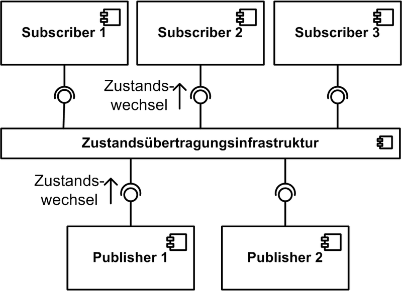

<!--

author:   Sebastian Zug, Galina Rudolf & André Dietrich
email:    sebastian.zug@informatik.tu-freiberg.de
version:  1.0.4
language: de
narrator: Deutsch Female

import: https://github.com/liascript/CodeRunner
        https://github.com/LiaTemplates/Pyodide

icon: https://upload.wikimedia.org/wikipedia/commons/d/de/Logo_TU_Bergakademie_Freiberg.svg
-->

[](https://liascript.github.io/course/?https://github.com/TUBAF-IfI-LiaScript/VL_Softwareentwicklung/blob/master/22_Events.md)

# Events

| Parameter                | Kursinformationen                                                                                                                                                                          |
| ------------------------ | ------------------------------------------------------------------------------------------------------------------------------------------------------------------------------------------ |
| **Veranstaltung:**       | `Vorlesung Softwareentwicklung`                                                                                                                                                             |
| **Semester**             | `Sommersemester 2022`                                                                                                                                                                      |
| **Hochschule:**          | `Technische Universität Freiberg`                                                                                                                                                          |
| **Inhalte:**             | `Events und Delegaten in der Anwendung`                                                                                                                                |
| **Link auf den GitHub:** | [https://github.com/TUBAF-IfI-LiaScript/VL_Softwareentwicklung/blob/master/22_Events.md](https://github.com/TUBAF-IfI-LiaScript/VL_Softwareentwicklung/blob/master/22_Events.md) |
| **Autoren**              | @author                                                                                                                                                                                    |


---------------------------------------------------------------------

## Allgemeine Hinweise

> **1. Nächste Woche Freitag findet keine Vorlesung statt!**

> **2. Verwenden Sie einen _Code Formater_, der Ihnen bei der Restrukturierung Ihres Codes hilft!**

> **3. Evaluieren Sie die Hinweise der Code Analyse sorgfältig, entwerfen Sie ggf. eigene Regeln.**

## Nachgefragt

In der letzten Veranstaltung fragte einer von Ihnen wie der selektive Zugriff auf die MultiCastDelegaten realisieren kann. Zur Erinnerung MulticastDelegate verfügt über eine verknüpfte Liste von Delegaten, die als Aufruf Liste bezeichnet wird und aus einem oder mehreren-Elementen besteht. Wenn ein Multicast Delegat aufgerufen wird, werden die Delegaten in der Aufruf Liste synchron in der Reihenfolge aufgerufen, in der Sie angezeigt werden.


```csharp           MultiCast
using System;
using System.Reflection;
using System.Collections.Generic;

public class Program
{
  public delegate int Calc(int x, int y);

  static int Add(int x, int y){
      Console.WriteLine("x + y");
      return x + y;
  }

  static int Multiply(int x, int y){
      Console.WriteLine("x * y");
      return x * y;
  }

  static int Divide(int x, int y){
      Console.WriteLine("x / y");
      return x / y;
  }

  public static void Main(string[] args){
    Calc computer3 = Add;
    computer3 += Multiply;
    computer3 += Multiply;
    computer3 += Divide;
    computer3 -= Add;
    Console.WriteLine("Zahl von eingebundenen Delegates {0}",
                      computer3.GetInvocationList().GetLength(0));

    var x = computer3.GetInvocationList();
    Console.WriteLine("Typ der Invocation List {0}", x.GetType());
    Console.WriteLine(x[0].DynamicInvoke(1,2));
    Console.WriteLine(x[1].DynamicInvoke(3,5));                        
  }
}
```
@LIA.eval(`["main.cs"]`, `mono main.cs`, `mono main.exe`)

> **Frage:** Wie ließe sich das Codebeispiel verbessern?

{{1}}
Nutzen Sie einen vorimplementierten (generischen) Delegaten


## Wiederholung

Wie war das noch mal, welche Elemente (Member) zeichnen einen Klasse unter C# aus?

                                      {{0-1}}
********************************************************************************

| **Bezeichnung**   |
| Konstanten    |
| Felder        |
| Methoden      |
| Eigenschaften |
| Indexer       |
| Ereignisse    |
| Operatoren    |
| Konstruktoren |
| Finalizer     |
| Typen         |


********************************************************************************
{{1}}
********************************************************************************
| **Bezeichnung** | **Bedeutung**                                                           |
| Konstanten      | Konstante Werte innerhalb einer Klasse                                  |
| Felder          | Variablen der Klasse                                                    |
| Methoden        | Funktionen, die der Klasse zugeordnet sind                              |
| Eigenschaften   | Aktionen beim Lesen und Schreiben auf geschützter Variablen             |
| Indexer         | Spezifikation eines Indexoperators für die Klasse                       |
| Ereignisse      | ?                                                                       |
| Operatoren      | Definition von eigenen Symbolen für die Arbeit mit Instanzen der Klasse |
| Konstruktoren   | Bündelung von Aktionen zur Initialisierung der Klasseninstanzen         |
| Finalizer       | Aktionen, die vor dem "Löschen" der Instanz ausgeführt werden           |
| Typen           | Geschachtelte Typen, die innerhalb der Klasse definiert werden          |


********************************************************************************

## Motivation und Idee der Events

Was haben wir mit den Delegaten erreicht? Wir sind in der Lage aus einer Klasse,
auf Methoden anderer Klassen zurückzugreifen, über die wir per Referenz
informiert wurden. Die aufgerufene Methode wird der aufrufenden Klasse über
einen Delegaten bekannt gegeben.

Damit sind die beiden Klassen nur über eine Funktionssignatur miteinander "lose"
gekoppelt. Welche Konzepte lassen sich damit umsetzen?

### Publish-Subscribe Prinzip

<!-- width="400px" -->

Publish-Subscribe (Pub / Sub) ist ein Nachrichtenmuster, bei dem Publisher Nachrichten an Abonnenten senden. In der Softwarearchitektur bietet Pub / Sub-Messaging  Ereignisbenachrichtigungen für verteilte Anwendungen, insbesondere für Anwendungen, die in kleinere, unabhängige Bausteine ​​entkoppelt sind.

Das Publish/Subscribe-Nachrichtenmodell hat folgende Vorteile:

+ Der Publisher braucht gar nicht zu wissen, wer Subscriber ist. Es erfolgt keine explizite Adressierung
+ Der Subscriber ist vom Publisher entkoppelt, er empfängt nur die Nachrichten, die für ihn auch relevant sind.
+ Der Subscriber kann sich jederzeit aus der Kommunikation zurückziehen oder ein anderes Topic subskribieren. Auf den Publisher hat das keine Auswirkung.
+ Damit ist die Messaging-Topologie dynamisch und flexibel. Zur Laufzeit können neue Subscriber hinzukommen.

C# etabliert für die Nutzung der Pub-Sub Kommunikation *Events*. Dies sind spezielle Delegate-Variablen, die mit den Schlüsselwort `event` als Felder von Klassen deklariert werden.

[^HKoziolek]: Wikipedia Publish/Subscribe Architekturstil für Software, Autor HKoziolek, https://de.wikipedia.org/wiki/Datei:Publish-Subscribe-Architekturstil.png

### Events in C#

{{0-1}}
********************************************************************************

Der Publisher ist eine Klasse, die ein Delegaten enthält. Der Publisher entscheidet damit darüber, wann Nachrichten versand werden.
Auf der anderen Seite finden sich die Subscriber-Methoden, die ausgehend vom aktivierten Delegaten im Publisher zur Ausführung kommen. Ein Subscriber hat keine Kenntnis von anderen Subscribern. Events sind ein Feature aus C# dass dieses Pattern formalisiert.

> Merke: Ein Event ist ein Klassenmember, dass diejenigen Features des Delegatenkonzepts nutzt, um eine Publisher-Subscribe Interaktion zu realisieren.

Im einfachsten Fall lässt sich das Event-Konzept folgendermaßen anwenden:

```csharp   Event.cs
// Schritt 1
// Wir definieren einen Delegat, der das Format der Subscriber Methoden
// (callbacks) spezifiziert - in diesem Beispiel ohne Parameter
// Hier wird ein nicht-generischer Handler genutzt.
public delegate void varAChangedHandler();

// Schritt 2
// Wir integrieren ein event in unser Publisher Klasse, dass den Delegaten
// abbildet
public class Publisher{
  public event varAChangedHandler OnAChangedHandler;

  // Schritt 3
  // Wir implementieren das "Feuern" des Events
  public magicMethod(){
     if (oldA != newA) OnAChangedHandler();
  }
}

// Schritt 4
// Implementieren des Subscribers - in diesem Fall wurde eine separate Klasse
// gewählt. Natürlich kann die Methode, die der Signatur von
// varAChangedHandler entspricht, auch in der Publisher-Klasse implementiert
// sein
public class Subscriber{
  public static void m_OnPropertyChanged(){
      Console.WriteLine("A was changed!");
  }
}

// Schritt 5
// "Einhängen" der Subscriber Methode in den Publisher-Delegate
public static void Main(string[] args){
  Publisher myPub = new Publisher();
  Subscriber mySub = new Subscriber();
  myPub.OnAChangedHandler += new varAChangedHandler(mySub.m_OnPropertyChanged);
}
```

Entsprechend der Darstellung in [Link](https://docs.microsoft.com/de-de/dotnet/csharp/programming-guide/events/index) sind Events durch folgende Eigenschaften definiert:

+ Der Publisher bestimmt, wann ein Ereignis ausgelöst wird. Die Subscriber bestimmen, welche  Aktion als Reaktion auf das Ereignis ausgeführt wird.

+ Ein Ereignis entstammt einem Publisher, kann aber mehrere Subscriber adressieren. Ein Abonnent kann mehrere Ereignisse von mehreren Herausgebern behandeln.

+ Ereignisse, die keine Subscriber haben, werden nie ausgelöst. Das bedeutet, dass ein Publisher die Subscriber kennen muss.

+ Ereignisse werden in der Regel verwendet, um Benutzeraktionen wie Mausklicks oder Menüauswahlen in GUI-Schnittstellen zu signalisieren.

+ In der .NET Framework-Klassenbibliothek basieren Ereignisse auf dem EventHandler-Delegaten und der EventArgs-Basisklasse.


********************************************************************************

                                   {{1-2}}
********************************************************************************

**Was passiert hinter den Kulissen?**

Wenn wir ein `event` deklarieren

```csharp
public class Publisher{
  public event VarAChangedHandler AChanged;
}
```
passieren folgende 3 Dinge:

1. Der Complier erzeugt einen privaten Delegaten mit sogenannten Event Accessoren (add und remove).

```csharp
VarAChangedHandler aChanged; // private Delegate
public event VarAChangedHandler AChanged
{
  add {aChanged += value;}
  remove {aChanged -= value;}
}
```

2. Der Compiler sucht innerhalb der Publisher Klasse nach Referenzen, die auf AChanged und lenkt diese auf das private Delegate um.
3. Der Compiler mappt alle += Operationen außerhalb auf die Zugriffsmethoden add and remove.

********************************************************************************

                                  {{2-3}}
********************************************************************************

Ok, nett, aber das würde ich gern an einem Beispiel sehen!

**Beispiel 1**

Das Beispiel vereinfacht das Vorgehen, in dem es Publisher und Subscriber in
einer Funktion zusammenfasst. Damit kann auf das Event uneingeschränkt zurückgegriffen werden.
Dazu gehört auch, dass das Event mit `Invoke` ausgelöst wird.


```csharp           MinimalEvent.cs
using System;
using System.Reflection;
using System.Collections.Generic;

public delegate void DelEventHandler();

class Program
{
    public static event DelEventHandler myEvent;
    public static void Main(string[] args){
        myEvent += new DelEventHandler(Fak1);
        myEvent += Fak2;
        myEvent += () => {Console.WriteLine("Fakultät 3");};
        myEvent.Invoke();
    }

    static void Fak1()
    {
        Console.WriteLine("Fakultät 1");
    }

    static void Fak2()
    {
        Console.WriteLine("Fakultät 2");
    }
}
```
@LIA.eval(`["main.cs"]`, `mono main.cs`, `mono main.exe`)

+ Erweitern Sie den Code so, dass Parameter an die Callback-Methoden übergeben werden können

********************************************************************************

                                  {{3-4}}
********************************************************************************

**Beispiel 2**

```csharp           StockExchange
using System;
using System.Reflection;
using System.Collections.Generic;

public delegate void DelPriceChangedHandler();

public class Stock{
    decimal price = 5;
    public event DelPriceChangedHandler OnPropertyPriceChanged;
    public decimal Price{
      get { return price; }
      set { if (price != value){
              if (OnPropertyPriceChanged != null){
                 OnPropertyPriceChanged();
                 price = value;
              }
            }
          }
    }
}

public class MailService{
  public static void stock_OnPropertyChanged(){
      Console.WriteLine("MAIL - Price of stock was changed!");
  }
}

public class Logging{
  public static void stock_OnPropertyChanged(){
      Console.WriteLine("LOG  -  Price of stock was changed!");
  }
}

class Program {
    public static void Main(string[] args){
        Stock GoogleStock = new Stock();
        GoogleStock.OnPropertyPriceChanged += MailService.stock_OnPropertyChanged;
        GoogleStock.OnPropertyPriceChanged += Logging.stock_OnPropertyChanged;
        Console.WriteLine("We change the stock price now!");
        GoogleStock.Price = 10;
    }
}
```
@LIA.eval(`["main.cs"]`, `mono main.cs`, `mono main.exe`)

**Ja, aber ... ** Was unterscheidet eine Delegate von einem Event? Was würde passieren, wenn wir
das Key-Wort aus dem Code entfernen?

Die Implementierung wäre nicht so robust, da folgende Möglichkeiten offen ständen:

| Eingriff                                                                                            | Bedeutung                                              | Verhindert |
| --------------------------------------------------------------------------------------------------- | ------------------------------------------------------ | ---------- |
| `GoogleStock.OnPropertyPriceChanged = null;`                                                        | Löscht alle Callback-Handler                           | ja         |
| `GoogleStock.OnPropertyPriceChanged = DelPriceChangedHandler(MailService.stock_OnPropertyChanged);` | Setzt einen einzigen Handler (und löscht alle anderen) | ja         |
| `GoogleStock.OnPropertyPriceChanged.Invoke();`                                                      | Auslösen des Events innerhalb eines Subscribers                                                       | ja         |

Was fehlt Ihnen an der Implementierung?

Richtig, die Möglichkeit auf die Daten zurückzugreifen.

********************************************************************************

## Events - Praktische Implementierung

Die Möglichkeit Parameter strukturiert und wiederverwendbar zu übergeben und
entsprechend generische EventHandler zu integrieren.

### Parameter

Welche Informationen sollten an die Subscriber weitergereicht werden? Zum einen
der auslösende Publisher (Wer ist verantwortlich?) und ggf. weitere Daten
zum Event (Warum ist die Information eingetroffen?).

Im Beispiel konzentrieren wir uns auf die Default-Delegates, die Bestandteil der
.NET Umgebung ist

| Delegate                |                                                  | Link                                                                                 |
| ----------------------- | ------------------------------------------------ | ------------------------------------------------------------------------------------ |
| `EventHandler Delegate` | `void EventHandler(object sender, EventArgs e)`` | [Link](https://docs.microsoft.com/de-de/dotnet/api/system.eventhandler?view=net-6.0) |
| `EventHandler<TEventArgs> Delegat` | `EventHandler<TEventArgs>(object? sender, TEventArgs e);`` | [Link](https://docs.microsoft.com/de-de/dotnet/api/system.eventhandler-1?view=net-6.0) |


```csharp           StockExchangeII
using System;
using System.Reflection;
using System.Collections.Generic;

//Brauchen wir nicht mehr, vielmehr wird auf einen vordefinierten EventHandler
//zurückgegriffen.
//public delegate void DelPriceChangedHandler();
public class Stock{
    decimal price = 5;
    // Hier ersetzen wir unser Delegate "DelPriceChangedHandler" durch den
    // Standard-Typ EventHandler
    public event EventHandler OnPropertyPriceChanged;
    public decimal Price{
      get { return price; }
      set { if (price != value){
              if (OnPropertyPriceChanged != null){
                 OnPropertyPriceChanged(this, EventArgs.Empty );
                 price = value;
              }
            }
          }
    }
}

public class MailService{
  public static void stock_OnPropertyChanged(object sender, EventArgs e){
      Console.WriteLine("MAIL - Price of stock was changed!");
      Console.WriteLine("Wer ruft? - {0}", sender);
      Console.WriteLine("Werte? - {0}", e);
  }
}

class Program {
    public static void Main(){
        Stock GoogleStock = new Stock();
        GoogleStock.OnPropertyPriceChanged += new
                EventHandler(MailService.stock_OnPropertyChanged);
        Console.WriteLine("We changed the stock price now!");
        GoogleStock.Price = 10;
    }
}
```
@LIA.eval(`["main.cs"]`, `mono main.cs`, `mono main.exe`)

### Generic Events

Nun wollen wir einen Schritt weitergehen und spezifischere Informationen mit dem
Event an die Subscriber weiterreichen. Dafür implementieren wir eine von
`EventArgs` abgeleitete Klasse.

```csharp
public class PriceChangedEventArgs : EventArgs
{
    public decimal Difference { get; set; }
}
```

Diese soll den Unterschied zwischen altem und neuen Preis umfassen, damit der
Subscriber die Relevanz der Information beurteilen kann.

Damit brauchen wir aber auch ein neues Delegate für unser nun nicht mehr
Standard Event

```csharp
void EventHandler(object sender, PriceChangedEventArgs e)
```

Um diese Anpassungen beim Datentyp zu realisieren exisitiert bereits eine
generischen Form von EventHandler mit der Signatur

```csharp
public delegate void EventHandler<TEventArgs>(object source,
                                              TEventArgs e)
                                              where TEventArgs: EventArgs;
```

```csharp           StockExchangeIII
using System;
using System.Reflection;
using System.Collections.Generic;

public class Stock{
    decimal price = 5;
    public event EventHandler<PriceChangedEventArgs> OnPropertyPriceChanged;
    public decimal Price{
      get { return price; }
      set { if (price != value){
              if (OnPropertyPriceChanged != null){
                 PriceChangedEventArgs myEventArgs = new PriceChangedEventArgs();
                 myEventArgs.Difference = price - value;
                 OnPropertyPriceChanged(this, myEventArgs );
                 price = value;
              }
            }
          }
    }
}

public class PriceChangedEventArgs : EventArgs
{
    public decimal Difference { get; set; }
}

public class MailService{
  public static void stock_OnPropertyChanged(object sender, PriceChangedEventArgs e){
      Console.WriteLine("MAIL - Price of stock was changed!");
      Console.WriteLine("Wer ruft? - {0}", sender);
      Console.WriteLine("Preisänderung? - {0}", e.Difference);
  }
}

class Program {
    public static void Main(string[] args){
        Stock GoogleStock = new Stock();
        GoogleStock.OnPropertyPriceChanged += new
                EventHandler<PriceChangedEventArgs>(MailService.stock_OnPropertyChanged);
        Console.WriteLine("We manipulate the stock price now!");
        GoogleStock.Price = 10;
    }
}
```
@LIA.eval(`["main.cs"]`, `mono main.cs`, `mono main.exe`)

### Grafische Nutzer Interfaces

siehe Codebeispiel `wpf_sharp` im Projektordner
