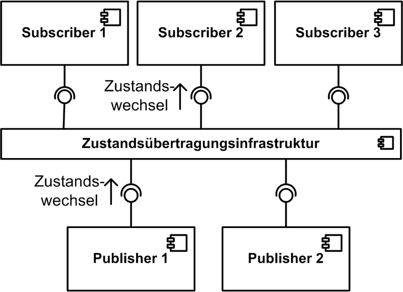

<!--

author:   Sebastian Zug, Galina Rudolf & André Dietrich
email:    sebastian.zug@informatik.tu-freiberg.de
version:  1.0.6
language: de
narrator: Deutsch Female
comment:  Publish-Subscribe Prinzip, Events in C#, generische Events
tags:      
logo:     

import: https://github.com/liascript/CodeRunner

import: https://raw.githubusercontent.com/TUBAF-IfI-LiaScript/VL_Softwareentwicklung/master/config.md

-->

[](https://liascript.github.io/course/?https://github.com/TUBAF-IfI-LiaScript/VL_Softwareentwicklung/blob/master/22_Events.md)

# Events

| Parameter                | Kursinformationen                                                                      |
| ------------------------ | -------------------------------------------------------------------------------------- |
| **Veranstaltung:**       | `Vorlesung Softwareentwicklung`                                                        |
| **Teil:**                | `22/27`                                                                                |
| **Semester**             | @config.semester                                                                       |
| **Hochschule:**          | @config.university                                                                     |
| **Inhalte:**             | @comment                                                                               |
| **Link auf den GitHub:** | https://github.com/TUBAF-IfI-LiaScript/VL_Softwareentwicklung/blob/master/22_Events.md |
| **Autoren**              | @author                                                                                |


---------------------------------------------------------------------

## Allgemeine Hinweise

> **0. Kennen Sie Ihren Editor und dessen Shortcuts!**

Wer flüssig programmieren will, sollte die Hände möglichst auf der Tastatur
lassen. Die folgende Auswahl deckt die Handgriffe ab, die im Alltag am meisten
Zeit sparen - die vollständige Referenz von VS Code gibt es als PDF für jede
Plattform:

+ [Windows](https://code.visualstudio.com/shortcuts/keyboard-shortcuts-windows.pdf)
+ [Linux](https://code.visualstudio.com/shortcuts/keyboard-shortcuts-linux.pdf)
+ [macOS](https://code.visualstudio.com/shortcuts/keyboard-shortcuts-macos.pdf)

> **1. Evaluieren Sie die Hinweise der Code Analyse sorgfältig, entwerfen Sie ggf. eigene Regeln.**

https://learn.microsoft.com/de-de/dotnet/fundamentals/code-analysis/overview?tabs=net-8

**Muss ich beim Kompilieren etwas angeben, um Fehler und Warnungen zu sehen?**

Die reinen **Compiler-Warnungen** (Codes der Form `CSxxxx`, z.B. "Variable nie
benutzt") zeigt `dotnet build` **ohne weitere Parameter** an. Beachten Sie aber:

+ `dotnet build` baut **inkrementell**: Ein zweiter Aufruf ohne Codeänderung
  kompiliert nichts neu - und wiederholt die Warnungen dann nicht. Mit
  `dotnet clean` oder dem Schalter `--no-incremental` erzwingen Sie eine
  Neuübersetzung.

Die eigentliche **Code-Analyse** (Qualitätsregeln der Form `CAxxxx`) ist
standardmäßig nur eingeschränkt aktiv. Voll einschalten lässt sie sich in der
Projektdatei:

```xml
<PropertyGroup>
  <EnableNETAnalyzers>true</EnableNETAnalyzers>
  <AnalysisLevel>latest-all</AnalysisLevel>
</PropertyGroup>
```

Nützliche Schalter beim Aufruf:

| Aufruf                            | Wirkung                                                        |
| --------------------------------- | ------------------------------------------------------------- |
| `dotnet build`                    | zeigt Warnungen, bricht aber nicht ab                         |
| `dotnet build --no-incremental`   | erzwingt Neuübersetzung -> Warnungen erscheinen erneut        |
| `dotnet build -warnaserror`       | behandelt **alle** Warnungen als Fehler (Build schlägt fehl)  |
| `dotnet build -warnaserror:CS0414` | macht **nur** die genannte Regel zum Fehler                  |

Das Hochstufen einzelner Warnungen zu Fehlern (`-warnaserror:CS....`) ist ein
einfaches Mittel, eine konkrete Regel beim Lernen nicht zu übersehen - genau so
wird es in Vorlesung [Vererbung](10_Vererbung.md) eingesetzt.

**Probieren Sie es selbst aus.** Reine Warnungen zeigt der LiaScript-CodeRunner
bei erfolgreichem Build **nicht** an (nur die Programmausgabe bzw. echte Fehler).
Um die Hinweise der Code-Analyse wirklich zu sehen, bauen Sie das vorbereitete
Mini-Projekt lokal:

> 📁 [`code/22_Events/CodeAnalysisDemo`](https://github.com/TUBAF-IfI-LiaScript/VL_Softwareentwicklung/tree/master/code/22_Events/CodeAnalysisDemo)
> - enthält Quelltext, Projektdatei und eine Schritt-für-Schritt-`README.md`.

## Nachgefragt

In der letzten Veranstaltung fragte einer von Ihnen wie der selektive Zugriff auf die MultiCastDelegaten realisieren kann. Zur Erinnerung MulticastDelegate verfügt über eine verknüpfte Liste von Delegaten, die als Aufruf Liste bezeichnet wird und aus einem oder mehreren-Elementen besteht. Wenn ein Multicast Delegat aufgerufen wird, werden die Delegaten in der Aufruf Liste synchron in der Reihenfolge aufgerufen, in der Sie angezeigt werden.

```ascii

Mulitcast Invocation List

+----------+----------+----------+----------+----------+----------+
| Add      | Multiply | Multiply | Divide   | Add      | Divide   |
+----------+----------+----------+----------+----------+----------+                               .
```
> **Frage:** Wie können wir unsere MultiCastDelegaten verwalten und selektiv auf einzelne Elemente zugreifen?

vgl. https://learn.microsoft.com/en-us/dotnet/api/system.delegate.getinvocationlist?view=net-8.0


```csharp           MultiCast
using System;
using System.Reflection;
using System.Collections.Generic;

public class Program
{
  public delegate int Calc(int x, int y);

  static int Add(int x, int y){
      Console.WriteLine("x + y");
      return x + y;
  }

  static int Multiply(int x, int y){
      Console.WriteLine("x * y");
      return x * y;
  }

  static int Divide(int x, int y){
      Console.WriteLine("x / y");
      return x / y;
  }

  public static void Main(string[] args){
    Calc computer = Add;
    computer += Multiply;
    computer += Multiply;
    computer += Divide;
    computer += Add;
    computer += Divide;
    computer -= Add;
    Console.WriteLine("Zahl von eingebundenen Delegates {0}",
                      computer.GetInvocationList().GetLength(0));

    // Individueller Aufruf der einzelnen Einträge
    var x = computer.GetInvocationList();
    Console.WriteLine("Typ der Invocation List {0}", x.GetType());
    Console.WriteLine(x[0].DynamicInvoke(1,2));
    Console.WriteLine(x[1].DynamicInvoke(3,5));   

    // Übergreifender Aufruf aller Einträge                     
    Console.WriteLine(computer(40,8));
  }
}
```
@LIA.evalWithDebug(`["main.cs"]`, `mcs main.cs`, `mono main.exe`)

> **Frage:** Wie ließe sich das Codebeispiel verbessern? Wie war das gleich noch `Func` oder `Action`?


## Wiederholung

Wie war das noch mal, welche Elemente (Member) zeichnen einen Klasse unter C# aus?

                                      {{0-1}}
********************************************************************************

| **Bezeichnung**   |
| Konstanten    |
| Felder        |
| Methoden      |
| Eigenschaften |
| Indexer       |
| Ereignisse    |
| Operatoren    |
| Konstruktoren |
| Finalizer     |
| Typen         |


********************************************************************************
{{1}}
********************************************************************************
| **Bezeichnung** | **Bedeutung**                                                           |
| Konstanten      | Konstante Werte innerhalb einer Klasse                                  |
| Felder          | Variablen der Klasse                                                    |
| Methoden        | Funktionen, die der Klasse zugeordnet sind                              |
| Eigenschaften   | Mechanismen zum Lesen und Schreiben auf geschützter Variablen           |
| Indexer         | Spezifikation eines Indexoperators für die Klasse                       |
| Ereignisse      | ?                                                                       |
| Operatoren      | Definition von eigenen Symbolen für die Arbeit mit Instanzen der Klasse |
| Konstruktoren   | Bündelung von Aktionen zur Initialisierung der Klasseninstanzen         |
| Finalizer       | Aktionen, die vor dem "Löschen" der Instanz ausgeführt werden           |
| Typen           | Geschachtelte Typen, die innerhalb der Klasse definiert werden          |


********************************************************************************

## Motivation und Idee der Events

Was haben wir mit den Delegaten erreicht? Wir sind in der Lage aus einer Klasse,
auf Methoden (einer anderer Klassen) zurückzugreifen, über die wir per Referenz
informiert wurden. Die aufgerufene Methode wird der aufrufenden Klasse über
einen Delegaten bekannt gegeben. Es erfolgt eine Typprüfung der Parameter.

Damit sind die beiden Klassen nur über eine Funktionssignatur miteinander "lose"
gekoppelt. Welche Konzepte lassen sich damit umsetzen?

> **Erinnerung an die letzte Vorlesung:** Wir haben dort eine `PhysicsEngine`
> gebaut, die eine Kollision *erkennt*, aber nicht weiß, *was dann passieren
> soll*. Die Reaktion wurde als `Action<GameObject>`-Delegat von außen in jedes
> Objekt hineingereicht. Das funktioniert - hat aber konzeptionelle Schwächen,
> die uns direkt zu den Events führen.

Schauen wir uns diese Schwächen an. Ein Delegat ist ein **ganz normales,
öffentliches Feld**. Jeder, der eine Referenz auf das Objekt hält, darf darauf
zugreifen - und zwar mit *vollen* Rechten:

```csharp
var coin = new GameObject { OnCollision = other => Punkte += 10 };

// ... an einer ganz anderen Stelle im Programm:
coin.OnCollision = null;        // (1) löscht ALLE Reaktionen anderer
coin.OnCollision(irgendwer);    // (2) FEUERT die Reaktion von außen - obwohl
                                //     gar keine echte Kollision stattfand!
```

Beide Zeilen sind bei einem Delegaten legal. Das verletzt aber die
Grundidee von Publish-Subscribe:

+ **(1)** Ein Subscriber darf sich an- und abmelden - aber nicht die
  Abonnements *aller anderen* überschreiben.
+ **(2)** *Auslösen* darf nur der Publisher (die Engine, die die Kollision
  feststellt) - niemand sonst.

Genau diese beiden Garantien stellt das Schlüsselwort `event` her. Ein Event
ist ein Delegat mit einem **Zugriffsschutz**: Von außen sind nur noch `+=`
(abonnieren) und `-=` (abbestellen) erlaubt; Zuweisen und Auslösen bleiben dem
Publisher vorbehalten. Wir greifen das PhysicsEngine-Beispiel später in diesem
Kapitel wieder auf und schreiben es konsequent auf Events um.

### Publish-Subscribe Prinzip

<!-- width="400px" -->

Publish-Subscribe (Pub / Sub) ist ein Nachrichtenmuster, bei dem Publisher Nachrichten an Abonnenten senden. In der Softwarearchitektur bietet Pub / Sub-Messaging  Ereignisbenachrichtigungen für verteilte Anwendungen, insbesondere für Anwendungen, die in kleinere, unabhängige Bausteine ​​entkoppelt sind.

Das Publish/Subscribe-Nachrichtenmodell hat folgende Vorteile:

+ Der Publisher braucht gar nicht zu wissen, wer Subscriber ist. Es erfolgt keine explizite Adressierung
+ Der Subscriber ist vom Publisher entkoppelt, er empfängt nur die Nachrichten, die für ihn auch relevant sind.
+ Der Subscriber kann sich jederzeit aus der Kommunikation zurückziehen oder ein anderes Topic subskribieren. Auf den Publisher hat das keine Auswirkung.
+ Damit ist die Messaging-Topologie dynamisch und flexibel. Zur Laufzeit können neue Subscriber hinzukommen.

C# etabliert für die Nutzung der Pub-Sub Kommunikation *Events*. Dies sind spezielle Delegate-Variablen, die mit den Schlüsselwort `event` als Felder von Klassen deklariert werden.

[^HKoziolek]: Wikipedia Publish/Subscribe Architekturstil für Software, Autor HKoziolek, https://de.wikipedia.org/wiki/Datei:Publish-Subscribe-Architekturstil.png

### Events in C#

{{0-1}}
********************************************************************************

Der Publisher ist eine Klasse, die eine Delegate-Variable enthält. Der Publisher entscheidet damit darüber, wann Nachrichten versandt werden.
Auf der anderen Seite finden sich die Subscriber-Methoden, die ausgehend vom aktivierten Delegaten im Publisher zur Ausführung kommen. Ein Subscriber hat keine Kenntnis von anderen Subscribern. Events sind ein Feature aus C# dass dieses Pattern formalisiert.

> Merke: Ein Event ist ein Klassenmember, dass die Features des Delegatenkonzepts nutzt, um eine Publisher-Subscribe Interaktion zu realisieren.

Im einfachsten Fall lässt sich das Event-Konzept folgendermaßen anwenden:

```csharp   Event.cs
// Schritt 1
// Wir definieren einen Delegat, der das Format der Subscriber Methoden
// (callbacks) spezifiziert - in diesem Beispiel ohne Parameter
// Hier wird ein nicht-generischer Handler genutzt.
public delegate void varAChangedHandler();

// Schritt 2
// Wir integrieren ein event in unser Publisher Klasse, dass den Delegaten
// abbildet
public class Publisher{
  public event varAChangedHandler OnAChangedHandler;

  // Schritt 3
  // Wir implementieren das "Feuern" des Events
  public void magicMethod(){
     if (oldA != newA) OnAChangedHandler();
  }
}

// Schritt 4
// Implementieren des Subscribers - in diesem Fall wurde eine separate Klasse
// gewählt. 
public class Subscriber{
  public void m_OnPropertyChanged(){
      Console.WriteLine("A was changed!");
  }
}

// Schritt 5
// "Einhängen" der Subscriber Methode in den Publisher-Delegate
public static void Main(string[] args){
  Publisher myPub = new Publisher();
  Subscriber mySub = new Subscriber();
  myPub.OnAChangedHandler += new varAChangedHandler(mySub.m_OnPropertyChanged);
  myPub.magicMethod();
}
```

Welche Konsequenzen ergeben sich daraus?

+ Der Publisher bestimmt, wann ein Ereignis ausgelöst wird. Die Subscriber bestimmen, welche  Aktion als Reaktion auf das Ereignis ausgeführt wird.

+ Es ist eine 1:n Relation. Ein Ereignis entstammt einem Publisher, kann aber mehrere Subscriber adressieren.

+ Achtung: Ereignisse, die keine Subscriber haben werfen NullReferenzException aus, wenn sie ausgelöst werden (OnAChangedHandler?.Invoke();).

+ Ereignisse werden in der Regel verwendet, um Benutzeraktionen wie Mausklicks oder Menüauswahlen in GUI-Schnittstellen zu signalisieren.

+ In der .NET Framework-Klassenbibliothek basieren Ereignisse auf dem EventHandler-Delegaten und der EventArgs-Basisklasse.


********************************************************************************

                                   {{1-2}}
********************************************************************************

**Beispiel 1**

Das Beispiel vereinfacht das Vorgehen, in dem es Publisher und Subscriber in
einer Funktion zusammenfasst. Damit kann auf das Event uneingeschränkt zurückgegriffen werden.
Dazu gehört auch, dass das Event mit `Invoke` ausgelöst wird.


```csharp           MinimalEvent.cs
using System;
using System.Reflection;
using System.Collections.Generic;

public delegate void DelEventHandler();

class Program
{
    public static event DelEventHandler myEvent;
    public static void Main(string[] args){
        myEvent += new DelEventHandler(Fak1);
        myEvent += Fak2;
        myEvent += () => {Console.WriteLine("Fakultät 3");};
        myEvent.Invoke();
    }

    static void Fak1()
    {
        Console.WriteLine("Fakultät 1");
    }

    static void Fak2()
    {
        Console.WriteLine("Fakultät 2");
    }
}
```
@LIA.evalWithDebug(`["main.cs"]`, `mcs main.cs`, `mono main.exe`)

********************************************************************************

                                  {{2-3}}
********************************************************************************

**Beispiel 2**

```csharp           StockExchange
using System;
using System.Reflection;
using System.Collections.Generic;

public delegate void DelPriceChangedHandler();

public class Stock{
    decimal price = 5;
    public event DelPriceChangedHandler OnPropertyPriceChanged;
    public decimal Price{
      get { return price; }
      set { if (price != value){
                price = value;
                if (OnPropertyPriceChanged != null){
                    OnPropertyPriceChanged();
                }
            }
          }
    }
}

public class MailService{
  public static void stock_OnPropertyChanged(){
      Console.WriteLine("MAIL - Price of stock was changed!");
  }
}

public class Logging{
  public static void stock_OnPropertyChanged(){
      Console.WriteLine("LOG  -  Price of stock was changed!");
  }
}

class Program {
    public static void Main(string[] args){
        Stock GoogleStock = new Stock();
        GoogleStock.OnPropertyPriceChanged += MailService.stock_OnPropertyChanged;
        GoogleStock.OnPropertyPriceChanged += Logging.stock_OnPropertyChanged;
        Console.WriteLine("We change the stock price now!");
        GoogleStock.Price = 10;
    }
}
```
@LIA.eval(`["main.cs"]`, `mcs main.cs`, `mono main.exe`)

### Praktische Umsetzung

**Was passiert hinter den Kulissen?**

Wenn wir ein `event` deklarieren

```csharp
public class Publisher{
  public event VarAChangedHandler AChanged;
}
```
passieren folgende 3 Dinge:

1. Der Complier erzeugt einen privaten Delegaten mit sogenannten Event Accessoren (add und remove).

```csharp
VarAChangedHandler aChanged; // private Delegate
public event VarAChangedHandler AChanged
{
  add {aChanged += value;}
  remove {aChanged -= value;}
}
```

2. Der Compiler sucht innerhalb der Publisher Klasse nach Referenzen auf `aChanged` und lenkt diese auf das private Delegate um.
3. Der Compiler mappt alle += bzw. -= Operationen außerhalb auf die Zugriffsmethoden add bzw. remove.

### Unterschied zum Delegaten

**Ja, aber ... ** Was unterscheidet eine Delegate von einem Event? Was würde passieren, wenn wir
das Key-Wort aus dem Code entfernen?

| Aspekt                       | Delegate (`delegate`)                                   | Event (`event`)                                                  |
| ---------------------------- | ------------------------------------------------------- | ---------------------------------------------------------------- |
| **Sprachelement**            | eigenständiger Typ (Referenz auf Methode(n))            | *Modifizierer* auf einem Delegate-Feld                           |
| **Grundidee**                | typsichere Methodenreferenz                             | formalisiertes Publish-Subscribe auf Basis eines Delegaten       |
| **Zuweisung von außen**      | `=` erlaubt (überschreibt alle Handler)                 | nur `+=` / `-=` erlaubt                                          |
| **Auslösen (`Invoke`)**      | von überall möglich, wo die Referenz sichtbar ist       | nur **innerhalb** der deklarierenden Klasse (Publisher)          |
| **Kapselung**                | gering - Feld liegt offen                               | hoch - Compiler erzeugt private `add`/`remove`-Accessoren        |
| **Beziehungsrichtung**       | Aufrufer ruft gezielt auf                               | Publisher benachrichtigt entkoppelt 1:n viele Subscriber         |
| **Typische Verwendung**      | Callbacks, Strategie-Parameter, `Func`/`Action`         | Benachrichtigungen, GUI-Ereignisse, Sensor-/Statusänderungen     |
| **Risiko bei Missbrauch**    | versehentliches Überschreiben / Fremd-Auslösen möglich  | durch das Schlüsselwort konstruktiv verhindert                   |

> **Merksatz:** Ein Event ist ein Delegat, dem die Sprache zwei Garantien
> aufzwingt - *nur abonnieren/abbestellen* von außen und *auslösen nur intern*.
> Technisch bleibt darunter ein ganz normaler Multicast-Delegat.

### Dasselbe Muster kennen Sie schon: Feld vs. Property

Dieses "ein Sprachelement kapselt ein einfacheres" ist kein Sonderfall der
Events. Sie haben es bereits bei **Feldern** und **Eigenschaften (Properties)**
gesehen: Ein Feld speichert einen Wert offen, eine Property legt eine
kontrollierte Zugriffsschicht (`get`/`set`) darüber.

| Aspekt                  | Feld (`field`)                          | Property (`get`/`set`)                                  |
| ----------------------- | --------------------------------------- | ------------------------------------------------------- |
| **Was ist es?**         | Variable der Klasse                     | Methodenpaar, das wie ein Feld benutzt wird             |
| **Zugriff von außen**   | direkt lesen *und* schreiben            | nur über `get`/`set` - einzeln begrenzbar (z.B. `private set`) |
| **Kontrolle**           | keine - jeder Wert ist zulässig         | Validierung, Umrechnung, Logging im Setter möglich      |
| **Kapselung**           | gering                                  | hoch                                                    |
| **Was wird gekapselt?** | nichts                                  | (meist) ein dahinterliegendes privates Feld             |

Stellt man beide Vergleiche nebeneinander, wird die Analogie sichtbar:

| Offene Variante | Gekapselte Variante | Sprach-Schlüssel               |
| --------------- | ------------------- | ------------------------------ |
| Feld            | Property            | `get` / `set`                  |
| Delegate        | Event               | `event` (-> `add` / `remove`)  |

> **Merke:** `event` verhält sich zu `delegate` wie eine `Property` zu einem
> `Feld` - in beiden Fällen schiebt die Sprache eine *kontrollierte
> Zugriffsschicht* vor ein offenes Member. Die Property erzeugt im Hintergrund
> `get`/`set`, das Event erzeugt `add`/`remove`.


## Events - Praktische Implementierung

Die Möglichkeit Parameter strukturiert und wiederverwendbar zu übergeben und
entsprechend generische EventHandler zu integrieren.

### Parameter

Welche Informationen sollten an die Subscriber weitergereicht werden? Zum einen
der auslösende Publisher (Wer ist verantwortlich?) und ggf. weitere Daten
zum Event (Warum ist die Information eingetroffen?).

Im Beispiel konzentrieren wir uns auf die Default-Delegates, die Bestandteil der
.NET Umgebung ist

| Delegate                           | Aufruf                                                    | Link                                                                                   |
| ---------------------------------- | --------------------------------------------------------- | -------------------------------------------------------------------------------------- |
| `EventHandler Delegate`            | `void EventHandler(object sender, EventArgs e)`           | [Link](https://learn.microsoft.com/de-de/dotnet/api/system.eventhandler)   |
| `EventHandler<TEventArgs> Delegat` | `EventHandler<TEventArgs>(object? sender, TEventArgs e);` | [Link](https://learn.microsoft.com/de-de/dotnet/api/system.eventhandler-1) |

Schauen wir uns zunächst den nicht-generischen `EventHandler` an. Dieser ist Bestandteil der .NET Umgebung und wird in der Regel für Events genutzt, die keine weiteren Informationen benötigen. Der Parameter `sender` ist der auslösende Publisher und `e` ist ein Objekt vom Typ `EventArgs`, das keine weiteren Informationen enthält.

```csharp           StockExchangeII
using System;
using System.Reflection;
using System.Collections.Generic;

//Brauchen wir nicht mehr, vielmehr wird auf einen vordefinierten EventHandler
//zurückgegriffen.
//public delegate void DelPriceChangedHandler();
public class Stock{
    decimal price = 5;
    // Hier ersetzen wir unser Delegate "DelPriceChangedHandler" durch den
    // Standard-Typ EventHandler
    public event EventHandler OnPropertyPriceChanged;
    public decimal Price{
      get { return price; }
      set { if (price != value){
                price = value;
                if (OnPropertyPriceChanged != null){
                    OnPropertyPriceChanged(this, EventArgs.Empty); 
                }
            }
          }
    }
}

public class MailService{
  public static void stock_OnPropertyChanged(object sender, EventArgs e){
      Console.WriteLine("MAIL - Price of stock was changed!");
      Console.WriteLine("Wer ruft? - {0}", sender);
      Console.WriteLine("Werte? - {0}", e);
  }
}

class Program {
    public static void Main(){
        Stock GoogleStock = new Stock();
        GoogleStock.OnPropertyPriceChanged += new
                EventHandler(MailService.stock_OnPropertyChanged);
        Console.WriteLine("We changed the stock price now!");
        GoogleStock.Price = 10;
    }
}
```
@LIA.eval(`["main.cs"]`, `mcs main.cs`, `mono main.exe`)

> [!IMPORTANT]
> Man müsste von EventArgs abgeleitete Klassen implementieren, um weitere Informationen an die Subscriber weiterzureichen. Das ist aber nicht immer notwendig. In vielen Fällen reicht es aus, den Publisher zu übergeben, damit der Subscriber die Relevanz der Information beurteilen kann.

### Generic Events

Nun wollen wir einen Schritt weitergehen und spezifischere Informationen mit dem
Event an die Subscriber weiterreichen. Dafür implementieren wir eine von
`EventArgs` abgeleitete Klasse.

```csharp
public class PriceChangedEventArgs : EventArgs
{
    public decimal Difference { get; set; }
}
```

Diese soll den Unterschied zwischen altem und neuen Preis umfassen, damit der
Subscriber die Relevanz der Information beurteilen kann.

Damit brauchen wir aber auch ein neues Delegate für unser nun nicht mehr
Standard Event

```csharp
void EventHandler(object sender, PriceChangedEventArgs e)
```

Um diese Anpassungen beim Datentyp zu realisieren existiert bereits eine
generischen Form von EventHandler mit der Signatur

```csharp
public delegate void EventHandler<TEventArgs>(object source,
                                              TEventArgs e)
                                              where TEventArgs: EventArgs;
```

```csharp           StockExchangeIII
using System;
using System.Reflection;
using System.Collections.Generic;

public class Stock{
    decimal price = 5;
    public event EventHandler<PriceChangedEventArgs> OnPropertyPriceChanged;
    public decimal Price{
      get { return price; }
      set { if (price != value){
                if (OnPropertyPriceChanged != null){
                    PriceChangedEventArgs myEventArgs = new PriceChangedEventArgs();
                    myEventArgs.Difference = price - value;
                    OnPropertyPriceChanged(this, myEventArgs);
                }
                price = value;
            }
          }
    }
}

public class PriceChangedEventArgs : EventArgs
{
    public decimal Difference { get; set; }
}

public class MailService{
  public static void stock_OnPropertyChanged(object sender, PriceChangedEventArgs e){
      Console.WriteLine("MAIL - Price of stock was changed!");
      Console.WriteLine("Wer ruft? - {0}", sender);
      Console.WriteLine("Preisänderung? - {0}", e.Difference);
  }
}

class Program {
    public static void Main(string[] args){
        Stock GoogleStock = new Stock();
        GoogleStock.OnPropertyPriceChanged += new
                EventHandler<PriceChangedEventArgs>(MailService.stock_OnPropertyChanged);
        Console.WriteLine("We manipulate the stock price now!");
        GoogleStock.Price = 10;
    }
}
```
@LIA.eval(`["main.cs"]`, `mcs main.cs`, `mono main.exe`)

### Praxisbeispiel: Die PhysicsEngine - jetzt mit Events

Erinnern Sie sich an die `PhysicsEngine` aus der letzten Vorlesung
([Kollisions-Callbacks in einer Physik-Engine](21_Delegaten.md#praxisbeispiel-kollisions-callbacks-in-einer-physik-engine))?
Dort trug jedes `GameObject` seine Reaktion selbst - in einem **öffentlichen
`Action`-Feld** (`OnCollision`), das die Engine bei einer Kollision aufrief.
*Ausgelöst* hat also schon damals die Engine; was uns aber fehlte, waren die
Garantien des `event`-Keywords und die Möglichkeit, dass **mehrere** Stellen auf
*dieselbe* Kollision reagieren.

**Was ändert sich - und was nicht?**

| Aspekt                        | Delegat (VL 21)                                       | Event (VL 22)                                                 |
| ----------------------------- | ----------------------------------------------------- | ------------------------------------------------------------- |
| Wer löst aus?                 | die Engine (`a.OnCollision?.Invoke(b)`)               | die Engine - *unverändert*                                    |
| Wo liegen die Handler?        | als Feld **in jedem `GameObject`**                    | gebündelt am **Event der Engine**                             |
| Auslösen von **außen**        | jeder mit `obj.OnCollision(x)` möglich                | unmöglich - `event` erlaubt nur `+=` / `-=`                   |
| Handler **überschreiben**     | `obj.OnCollision = ...` löscht bestehende             | unmöglich - nur Hinzufügen/Entfernen                          |
| Wie viele Reaktionen?         | genau **eine** pro Objekt                             | **beliebig viele** (1:n) - pro Objekt *und* querschnittlich   |
| Datenübergabe                 | nur das andere Objekt                                 | strukturiert über `CollisionEventArgs`                        |

Der eigentliche Gewinn liegt also nicht darin, *wer* auslöst (das war immer die
Engine), sondern in **Kapselung** (niemand außer der Engine kann feuern) und in
der **1:n-Beziehung**: Spieler und Münze bringen weiterhin ihr *eigenes*
Verhalten mit, und zusätzlich kann ein querschnittliches `SoundSystem` auf
*jede* Kollision hören - alle an derselben Ereignisquelle.

**Schritt 1 - Die Ereignisdaten als `EventArgs`-Klasse**

Statt nur das getroffene Objekt zu übergeben, bündeln wir alle relevanten
Informationen einer Kollision in einer eigenen, von `EventArgs` abgeleiteten
Klasse. Das ist die in .NET übliche, erweiterbare Form (vgl. `PriceChangedEventArgs`):

```csharp
public class CollisionEventArgs : EventArgs
{
    public GameObject First  { get; }
    public GameObject Second { get; }
    public double Overlap    { get; }   // wie stark überlappen die Objekte?

    public CollisionEventArgs(GameObject first, GameObject second, double overlap)
    {
        First   = first;
        Second  = second;
        Overlap = overlap;
    }
}
```

**Schritt 2 - Die Engine wird zum Publisher, die Objekte bleiben "schlau"**

Jetzt das komplette, lauffähige Beispiel. Drei Dinge sind wichtig:

1. Die Engine löst über die gekapselte `OnCollision`-Methode aus (Konvention
   `OnXxx`) - nur sie kann das Ereignis feuern.
2. **Spieler und Münze behalten ihr eigenes Verhalten** (wie in VL 21), sind aber
   jetzt *Subscriber* des Engine-Events. Über `e.First`/`e.Second` prüfen sie, ob
   *sie* überhaupt beteiligt sind.
3. Ein **querschnittliches `SoundSystem`** hört auf *alle* Kollisionen - das wäre
   mit dem einen `Action`-Feld pro Objekt aus VL 21 nicht gegangen.

```csharp           PhysicsEvents
using System;
using System.Collections.Generic;

// ---------- Ereignisdaten ----------
public class CollisionEventArgs : EventArgs
{
    public GameObject First  { get; }
    public GameObject Second { get; }
    public double Overlap    { get; }

    public CollisionEventArgs(GameObject first, GameObject second, double overlap)
    {
        First = first; Second = second; Overlap = overlap;
    }
}

// ---------- Spielobjekt: Daten + Hilfsmethode für "betrifft mich das?" ----------
public class GameObject
{
    public string Name;
    public double X;
    public double Width;

    public GameObject(string name, double x, double width)
    {
        Name = name; X = x; Width = width;
    }

    // Liefert das jeweils ANDERE Objekt - oder null, wenn ich nicht beteiligt bin.
    protected GameObject Other(CollisionEventArgs e)
    {
        if (e.First  == this) return e.Second;
        if (e.Second == this) return e.First;
        return null;
    }
}

// ---------- Spieler: reagiert nur auf EIGENE Kollisionen, spielerspezifisch ----------
public class Player : GameObject
{
    public int Health = 100;
    public Player(string name, double x, double width) : base(name, x, width) { }

    public void OnCollision(object sender, CollisionEventArgs e)
    {
        var other = Other(e);
        if (other == null) return;                 // mich betrifft es nicht
        Health -= 10;
        Console.WriteLine($"  [Spieler] trifft {other.Name} -> Health = {Health}");
    }
}

// ---------- Münze: eigenes, ANDERES Verhalten ----------
public class Coin : GameObject
{
    public Coin(string name, double x, double width) : base(name, x, width) { }

    public void OnCollision(object sender, CollisionEventArgs e)
    {
        var other = Other(e);
        if (other == null) return;
        Console.WriteLine($"  [Münze]   {other.Name} sammelt mich ein (+10 Punkte)");
    }
}

// ---------- Publisher ----------
public class PhysicsEngine
{
    private List<GameObject> objects = new List<GameObject>();

    // Das Event: von außen nur per += / -= erreichbar, Auslösen bleibt privat.
    public event EventHandler<CollisionEventArgs> Collision;

    public void Add(GameObject obj) => objects.Add(obj);

    // Konvention: gekapseltes Auslösen in einer protected/virtual OnXxx-Methode.
    protected virtual void OnCollision(CollisionEventArgs e)
    {
        // ?.Invoke schützt vor NullReferenceException, falls niemand abonniert hat.
        Collision?.Invoke(this, e);
    }

    public void DetectCollisions()
    {
        for (int i = 0; i < objects.Count; i++)
            for (int j = i + 1; j < objects.Count; j++)
            {
                var a = objects[i];
                var b = objects[j];
                double distance = Math.Abs(a.X - b.X);
                double limit    = (a.Width + b.Width) / 2;
                if (distance < limit)
                    OnCollision(new CollisionEventArgs(a, b, limit - distance));
            }
    }
}

// ---------- Querschnittlicher Subscriber: reagiert auf ALLE Kollisionen ----------
public class SoundSystem
{
    public void OnCollision(object sender, CollisionEventArgs e)
        => Console.WriteLine($"  [Sound]   *Bumm* ({e.First.Name} / {e.Second.Name})");
}

public class Program
{
    public static void Main(string[] args)
    {
        var engine = new PhysicsEngine();
        var player = new Player("Spieler", 10, 4);
        var coin   = new Coin("Münze", 12, 2);
        engine.Add(player);
        engine.Add(coin);

        // Objektspezifisch: Spieler und Münze abonnieren und filtern selbst
        engine.Collision += player.OnCollision;
        engine.Collision += coin.OnCollision;

        // Querschnittlich (1:n): das Sound-System hört ALLES
        var sound = new SoundSystem();
        engine.Collision += sound.OnCollision;

        Console.WriteLine("Engine-Tick 1:");
        engine.DetectCollisions();

        // Lebenszyklus: das Sound-System meldet sich zur Laufzeit wieder ab
        engine.Collision -= sound.OnCollision;
        Console.WriteLine("\nEngine-Tick 2 (Sound abgemeldet):");
        engine.DetectCollisions();
    }
}
```
@LIA.eval(`["main.cs"]`, `mcs main.cs`, `mono main.exe`)

Was haben wir gegenüber der Delegaten-Variante gewonnen?

+ **Objektspezifisches Verhalten bleibt erhalten:** `Player` und `Coin` reagieren
  weiterhin *unterschiedlich* - nur sind sie jetzt Subscriber und prüfen über
  `e.First`/`e.Second` selbst, ob die Kollision sie betrifft.
+ **Echte 1:n-Beziehung:** Zusätzlich hängt ein `SoundSystem` an *derselben*
  Quelle und hört auf *jede* Kollision. Mit dem einen `Action`-Feld pro Objekt
  (VL 21) war pro Objekt nur *eine* Reaktion möglich.
+ **Kapselung:** Nur die `PhysicsEngine` löst aus. Die `OnCollision`-Methode ist
  `protected` - eine abgeleitete Spezial-Engine darf das Auslösen verfeinern, ein
  *fremder* Aufrufer aber nicht. Von außen sind nur `+=` / `-=` möglich.
+ **Strukturierte Daten:** `CollisionEventArgs` transportiert beide Objekte und
  die Überlappung - jederzeit erweiterbar (z.B. Aufprallgeschwindigkeit), ohne
  die Signatur aller Subscriber zu brechen.
+ **Sauberer Lebenszyklus:** Mit `-=` meldet sich der Sound zur Laufzeit ab -
  und verpasst Tick 2. Genau dieses dynamische An-/Abmelden ist das Herz von
  Publish-Subscribe (und verhindert nebenbei Memory-Leaks durch "vergessene"
  Abonnenten).

### Events und Ausnahmebehandlung

                          {{0-1}}
******************************************************

> Welche Rückmeldung hätten Sie mit Blick auf die Flexibilität des Codes an einen Mitstreiter?

```csharp           MinimalEvent.cs
using System;
using System.Reflection;
using System.Collections.Generic;

public delegate void MyEventHandler(string message);

public class Publisher
{
    public event MyEventHandler MyEvent;
    public void RaiseEvent(string message)
    {
        MyEvent?.Invoke(message);
    }
}

public class Subscriber1
{
    //int x = 100;
    //int divider = 0;
    public void OnEventRaised(string message)
    {
        Console.WriteLine($"Sub 1 - Event received: {message}");
        //Console.WriteLine($"Sub 1 - Event received: {x / divider}");
    }
}

public class Subscriber2
{
    public void OnEventRaised(string message)
    {
        Console.WriteLine($"Sub 2 - Event received: {message}");
    }
}

class Program {
    public static void Main(string[] args){
        var publisher = new Publisher();
        var subscriber1 = new Subscriber1();
        publisher.MyEvent += subscriber1.OnEventRaised;
        var subscriber2 = new Subscriber2();
        publisher.MyEvent += subscriber2.OnEventRaised;
        publisher.RaiseEvent("Hallo Welt");
    }
}
```
@LIA.evalWithDebug(`["main.cs"]`, `mcs main.cs`, `mono main.exe`)

******************************************************

{{1-2}}
```csharp    Solution.cs
using System;
using System.Reflection;
using System.Collections.Generic;

// nicht mehr benötigt !
// public delegate void MyEventHandler(string message);

public class CustomEventArgs : EventArgs
{
    public string Message { get; }
    public CustomEventArgs(string msg)
    {
        Message = msg;
    }
}

public class Publisher
{
    public event EventHandler<CustomEventArgs> MyEvent;
    public void RaiseEvent(string message)
    {
	    foreach (var handler in MyEvent.GetInvocationList())
	    {
	        try
	        {
	            handler.DynamicInvoke(this, new CustomEventArgs(message));
	        }
	        catch (Exception ex)
	        {
	            Console.WriteLine($"Exception caught: {ex.Message}");
	        }
	    }
    }
}

public class Subscriber1
{
    int x = 100;
    int divider = 0;
    public void OnEventRaised(object sender, CustomEventArgs e)
    {
        Console.WriteLine($"Sub 1 - Event received: {e.Message}");
        Console.WriteLine($"Sub 1 - Event received: {x/divider}");
    }
}

public class Subscriber2
{
    public void OnEventRaised(object sender, CustomEventArgs e)
    {
        Console.WriteLine($"Sub 1 - Event received: {e.Message}");
    }
}

class Program {
    public static void Main(string[] args){
        var publisher = new Publisher();
        var subscriber1 = new Subscriber1();
        publisher.MyEvent += subscriber1.OnEventRaised;
        var subscriber2 = new Subscriber2();
        publisher.MyEvent += subscriber2.OnEventRaised;
        publisher.RaiseEvent("Hallo Welt");
    }
}
```
@LIA.evalWithDebug(`["main.cs"]`, `mcs main.cs`, `mono main.exe`)

**Worum geht es hier?**

Ein Event ist eine **1:n-Beziehung**: Ein einziges `MyEvent.Invoke(...)` ruft
*alle* Subscriber nacheinander entlang der Invocation List auf. Damit stellt sich
eine Frage, die bei einem einzelnen Methodenaufruf gar nicht auftaucht:

> Was passiert mit den übrigen Subscribern, wenn **einer** von ihnen eine
> Ausnahme wirft?

Beim direkten Auslösen (erstes Beispiel) gilt: Wirft ein Subscriber eine
Exception (hier die Division durch `0`), wird die **Invocation List sofort
abgebrochen**. Alle *nachfolgenden* Subscriber kommen nicht mehr zum Zug, und der
Fehler schlägt bis zum Publisher durch. Ein einziger fehlerhafter Subscriber legt
also das gesamte Event lahm.

Die Lösung (zweites Beispiel) durchläuft die Invocation List **manuell** mit
`GetInvocationList()` und kapselt jeden Aufruf einzeln in `try`/`catch`:

| Variante                                   | Fehler in einem Subscriber             |
| ------------------------------------------ | -------------------------------------- |
| `MyEvent.Invoke(...)` (Standard)           | bricht alle restlichen Subscriber ab   |
| Schleife über `GetInvocationList()` + `try`/`catch` | isoliert - die übrigen laufen weiter |

> **Intention:** Die lose Kopplung von Publish-Subscribe ist nur dann *robust*,
> wenn der Publisher nicht darauf vertraut, dass sich alle Subscriber "benehmen".
> Ein fehlerhafter Subscriber darf weder den Publisher noch die anderen
> Subscriber mitreißen. Genau diese **Isolation** stellt die manuelle Schleife
> her - der Preis dafür ist der langsamere `DynamicInvoke` und etwas mehr Code.

### Anpassung der Subscribe/Unsubscribe Methoden

In spezifischen Fällen kann es notwendig sein, die Subscriber-Methoden zu adaptieren. 

```csharp
private MyEventHandler _myEvent;

public event MyEventHandler MyEvent
{
    add
    {
        Console.WriteLine("Subscriber added");
        _myEvent += value;
    }
    remove
    {
        Console.WriteLine("Subscriber removed");
        _myEvent -= value;
    }
}
```

### Anonyme / Lambda Funktionen als Subscriber


```csharp           MinimalEvent.cs
using System;
using System.Reflection;
using System.Collections.Generic;

public class CustomEventArgs : EventArgs
{
    public string Message { get; }
    public CustomEventArgs(string msg)
    {
        Message = msg;
    }
}

public class Publisher
{
    public event EventHandler<CustomEventArgs> MyEvent;
    public void RaiseEvent(string message)
    {
        MyEvent?.Invoke(this, new CustomEventArgs(message));
    }
}

class Program {
    public static void Main(){
        var publisher = new Publisher();

        // Using an anonymous method
        publisher.MyEvent += delegate(object sender, CustomEventArgs args) 
        {
            Console.WriteLine($"Anonyme Method received: {args.Message}");
        };

        // Or using a lambda expression
        publisher.MyEvent += (sender, args) => Console.WriteLine($"Lambda expression received: {args.Message}");
        publisher.RaiseEvent("Hallo Welt");
    }
}
```
@LIA.evalWithDebug(`["main.cs"]`, `mcs main.cs`, `mono main.exe`)

Eine sehr anschauliche Darstellung dazu findet sich unter https://gehirnwindung.de/categories/csharp/tanz-den-lambda-mit-mir

## Exkurs: Von einzelnen Events zu Event-Strömen (Reactive Extensions)

Ein Event signalisiert immer *eine einzelne* Benachrichtigung: "Der Kurs hat
sich geändert." In der Praxis interessiert uns aber oft nicht das einzelne
Ereignis, sondern der **Strom** vieler Ereignisse über die Zeit - und Fragen wie
*"melde mich nur bei Kursen über 100"*, *"fasse alle Änderungen einer Sekunde
zusammen"* oder *"ignoriere Wiederholungen"*.

Ein einfacher Filter wie *"melde nur Kurse über 100"* lässt sich mit einem Event
problemlos umsetzen - ein `if` im Handler genügt:

```csharp
stock.OnPropertyPriceChanged += (s, e) => { if (e.NewPrice > 100) ... };
```

Bei *einem einzelnen* Wert gibt es also **keinen** Unterschied zwischen Event und
Observable. Interessant wird es erst, wenn eine Frage **mehrere Werte des Stroms
in Beziehung** setzt:

+ *"melde nur, wenn sich der Preis **geändert** hat"* (aktueller vs. vorheriger Wert)
+ *"fasse alle Änderungen **einer Sekunde** zusammen"*
+ *"nimm nur **jede dritte** Änderung"*

Ein Event sieht immer nur den *einen* gerade eingetroffenen Wert und hat **kein
Gedächtnis** über den Strom. Für solche Fragen müssten wir den Zustand (letzter
Wert, Zähler, Timer) **selbst** in Feldern mitführen. Die **Reactive Extensions
(Rx)** nehmen uns das ab: Sie behandeln den Ereignisstrom als ein
`IObservable<T>` - ein Objekt, das man mit Operatoren verarbeitet, die das
Gedächtnis bereits eingebaut haben (vgl. die LINQ-Operatoren in Vorlesung
[LINQ](25_LINQ.md)).

| Aspekt                       | Event (`event`)                          | Observable (Rx)                                  |
| ---------------------------- | ---------------------------------------- | ------------------------------------------------ |
| Sichtweise                   | **ein** Wert je Benachrichtigung         | der **ganze Strom** von Werten über die Zeit     |
| Kennt vorherige Werte?       | nein - selbst speichern                   | ja - Operatoren tragen das Gedächtnis            |
| Einzelwert prüfen (`> 100`)  | `if` im Handler                          | `.Where(...)` - **kein Unterschied**             |
| Werte in Beziehung setzen    | eigenes Zustandsfeld nötig               | `.DistinctUntilChanged()`, `.Buffer()`, ...      |
| Zeitbezug                    | manuell (Timer, Zustandsfelder)          | eingebaut (`Throttle`, `Buffer`, ...)            |
| Abmelden                     | `-=`                                     | `IDisposable.Dispose()`                          |

Rx ist Teil des NuGet-Pakets `System.Reactive` - wir binden es daher (wie schon
beim NuGet-Exkurs in [Build-Tools](18_Dokumentation_BuildTools.md) gezeigt) über
einen `PackageReference` in der Projektdatei ein. Damit läuft das Beispiel im
CodeRunner über `dotnet build`/`dotnet run`:

Wir bleiben bei unserem `Stock` aus dem Kapitel - mit seinem **ganz normalen
Event**. Rx erzeugt daraus mit `Observable.FromEventPattern` einen Strom: Der
`Stock` bleibt der Publisher, der Strom (`IObservable`) wird daraus nur
*abgeleitet*. Auf diesem Strom fragen wir mit `DistinctUntilChanged` nach **echten
Kursänderungen** - ein Operator, der sich den vorherigen Wert selbst merkt.

```csharp           Program.cs
using System;
using System.Reactive.Linq;

// Das bekannte Stock-Event aus dem Kapitel - unverändert.
public class PriceChangedEventArgs : EventArgs
{
    public decimal NewPrice { get; }
    public PriceChangedEventArgs(decimal p) { NewPrice = p; }
}

public class Stock
{
    decimal price;
    public event EventHandler<PriceChangedEventArgs> OnPropertyPriceChanged;
    public decimal Price
    {
        get => price;
        set { price = value; OnPropertyPriceChanged?.Invoke(this, new PriceChangedEventArgs(value)); }
    }
}

public class Program
{
    public static void Main()
    {
        var googleStock = new Stock();

        // Aus dem vorhandenen EVENT einen Strom (Observable) ableiten:
        var kursStrom = Observable
            .FromEventPattern<PriceChangedEventArgs>(
                h => googleStock.OnPropertyPriceChanged += h,
                h => googleStock.OnPropertyPriceChanged -= h)
            .Select(evt => evt.EventArgs.NewPrice);

        // Auf dem Strom: nur ECHTE Änderungen. DistinctUntilChanged merkt sich
        // dazu den vorherigen Wert - dieses "Gedächtnis" hat ein Event nicht.
        kursStrom
            .DistinctUntilChanged()
            .Subscribe(p => Console.WriteLine($"  geänderter Kurs: {p}"));

        Console.WriteLine("Kursverlauf: 100, 100, 105, 105, 100");
        foreach (var p in new decimal[] { 100, 100, 105, 105, 100 })
            googleStock.Price = p;
    }
}
```
```xml   -project.csproj
<Project Sdk="Microsoft.NET.Sdk">
  <PropertyGroup>
    <OutputType>Exe</OutputType>
    <TargetFramework>net8.0</TargetFramework>
  </PropertyGroup>
  <ItemGroup>
    <PackageReference Include="System.Reactive" Version="6.0.1" />
  </ItemGroup>
</Project>
```
@LIA.eval(`["Program.cs", "project.csproj"]`, `dotnet build -nologo`, `dotnet run -nologo`)

Der Kursverlauf `100, 100, 105, 105, 100` erzeugt nur die Ausgaben `100`, `105`,
`100` - die **Wiederholungen** filtert `DistinctUntilChanged` heraus. Mit einem
reinen Event müssten Sie den letzten Wert in einem eigenen Feld speichern und
selbst vergleichen:

```csharp
decimal letzter = decimal.MinValue;                 // Gedächtnis von Hand
googleStock.OnPropertyPriceChanged += (s, e) =>
{
    if (e.NewPrice != letzter)                      // selbst vergleichen
    {
        Console.WriteLine($"geänderter Kurs: {e.NewPrice}");
        letzter = e.NewPrice;                       // selbst aktualisieren
    }
};
```

Genau dieses manuelle Mitführen von Zustand nimmt Rx einem ab - und zwar für
beliebig komplexe Strom-Operationen.

> **Einordnung:** Rx ist kein Ersatz für Events, sondern deren Verallgemeinerung
> für komplexe, zeitabhängige Ereignisfolgen (Sensordaten, Nutzereingaben,
> Netzwerk-Streams). Wer das Prinzip vertieft, findet die LINQ-artigen Operatoren
> in der nächsten Vorlesung zu [LINQ](25_LINQ.md) wieder. Dokumentation:
> https://github.com/dotnet/reactive und https://reactivex.io