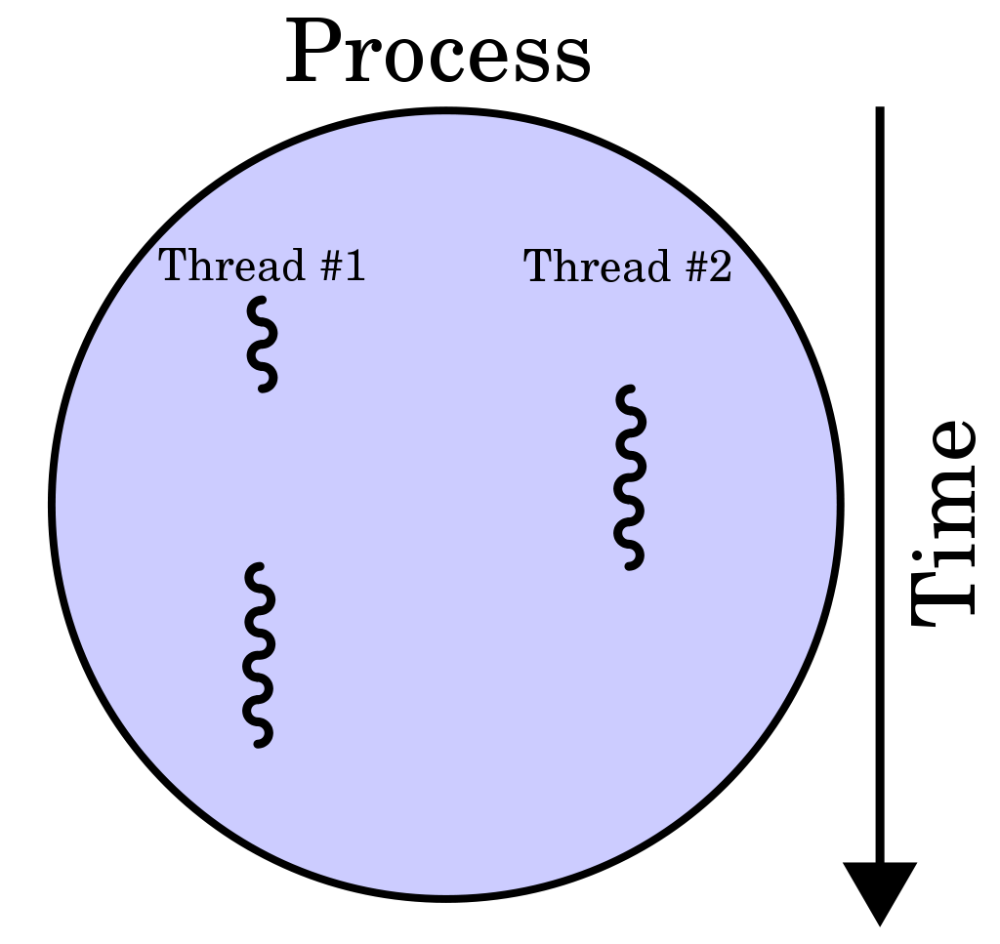

<!--

author:   Sebastian Zug & André Dietrich
email:    Sebastian.Zug@informatik.tu-freiberg.de & andre.dietrich@informatik.tu-freiberg.de
version:  0.0.1
language: de
narrator: Deutsch Female

import: https://raw.githubusercontent.com/liaScript/coderunner/master/README.md
        https://raw.githubusercontent.com/liaScript/rextester_template/master/README.md

-->

# Softwareentwicklung - 23 - Threads

**TU Bergakademie Freiberg - Sommersemester 2020**

Link auf die aktuelle Vorlesung im Versionsmanagementsystem GitHub

[https://github.com/SebastianZug/CsharpCourse/blob/SoSe2020/23_Threads.md](https://github.com/SebastianZug/CsharpCourse/blob/SoSe2020/23_Threads.md)

Die interaktive Form ist unter diese Link zu finden ->
[LiaScript Vorlesung 23](https://liascript.github.io/course/?https://raw.githubusercontent.com/SebastianZug/CsharpCourse/SoSe2020/23_Threads.md#1)

---------------------------------------------------------------------

## 7 Fragen in 7 Minuten

**1. Jetzt sind Sie dran ...**

**2. Jetzt sind Sie dran ...**

**3. Jetzt sind Sie dran ...**

**4. Jetzt sind Sie dran ...**

**5. Jetzt sind Sie dran ...**

**6. Jetzt sind Sie dran ...**

**7. Jetzt sind Sie dran ...**

## Neues aus der GitHub-Woche

1. Erläuterungen Frau Dr. Hawlitschek (OVGU Magdeburg)

2. ... für diejenigen, die im Sommer "noch nichts vorhaben" ... Wir suchen motivierte studentische Mitstreiter in diversen Projekten.


## Motivation - Threads

**Threads Basics**

Ein Ausführungs-Thread ist die kleinste Sequenz von programmierten Anweisungen, die unabhängig von einem Scheduler verwaltet werden kann, der typischerweise Teil des Betriebssystems ist. Die Implementierung von Threads und Prozessen unterscheidet sich von Betriebssystem zu Betriebssystem, aber in den meisten Fällen ist ein Thread ein Bestandteil eines Prozesses. Innerhalb eines Prozesses können mehrere Threads existieren, die gleichzeitig ausgeführt werden und Ressourcen wie Speicher gemeinsam nutzen, während verschiedene Prozesse diese Ressourcen nicht gemeinsam nutzen. Insbesondere teilen sich die Threads eines Prozesses seinen ausführbaren Code und die Werte seiner dynamisch zugewiesenen Variablen und seiner nicht thread-lokalen globalen Variablen zu einem bestimmten Zeitpunkt.

<!-- style="width: 70%; max-width: 320px;" --> [^Cburnett]

[^Cburnett]: https://commons.wikimedia.org/wiki/File:Multithreaded_process.svg, Autor I, Cburnett, GNU Free Documentation License, [Link](https://commons.wikimedia.org/wiki/Commons:GNU_Free_Documentation_License,_version_1.2)

Auf eine Single-Core Rechner organisiert das Betriebssystem Zeitscheiben (unter
Windows üblicherweise 20ms) um Nebenläufigkeit zu simulieren. Eine Multiprozessor-Maschine kann aber auch direkt auf die Rechenkapazität eines weiteren Prozessors
ausweichen und eine echte Parallelisierung umsetzen, die allerdings im Beispiel
durch den gemeinsamen Zugriff auf die Konsole limitiert ist.

Die Implementierung der Klasse Thread unter C# umfasst dabei folgende
Definitionen:

```csharp       ThreadClass
public delegate void ThreadStart();
public enum ThreadPriority (Normal, AboveNormal, BelowNormal, Highest, Lowest);
public enum TheadState (Unstarted, Running, Suspended, Stopped, Aborted, ...);

public sealed class Thread{
  public Thread (ThreadStart startMethod);
  ...
  public string Name {get; set;};
  public ThreadPriority Priority {get; set;};
  public ThreadState TreadState {get;};
  public bool IsAlive {get;};
  public bool IsBackground{get;};
  public void Start();
  public void Join();
  public void Abort();
  public static void Sleep(int milliseconds);
}
```

                   {{1}}
*******************************************************************************

Um die grundlegende Verwendung des Typs `Thread` zu veranschaulichen, nehmen wir an, Sie haben eine Konsolenanwendung, in der die `CurrentThread`-Eigenschaft ein Thread-Objekt abruft, das den aktuell ausgeführten Thread repräsentiert.

Das folgende Beispiel kann aus spezifischen Sicherheitsgründen nicht unter Rextester ausgeführt werden.

```csharp           ThreadBasicExample
using System;
using System.Threading;
namespace Rextester
{
    class Program
    {
        public static void Main(string[] args)
        {
            Console.WriteLine("**********Current Thread Informations***************\n");
            Thread t = Thread.CurrentThread;
            t.Name = "Primary_Thread";
            Console.WriteLine("Thread Name: {0}", t.Name);
            Console.WriteLine("Thread Status: {0}", t.IsAlive);
            Console.WriteLine("Priority: {0}", t.Priority);
            Console.WriteLine("isBackground: {0}", t.isBackground);
            Console.WriteLine("Context ID: {0}", Thread.CurrentContext.ContextID);
            Console.WriteLine("Current application domain: {0}",Thread.GetDomain().FriendlyName);
        }
    }
}
```


```Console
**********Current Thread Informations***************

Thread Name: Primary_Thread
Thread Status: True
Priority: Normal
Context ID: 0
Current application domain: main.exe
```

*******************************************************************************


              {{2}}
*******************************************************************************
```csharp           ThreadBasicExample
using System;
using System.Threading;

namespace Rextester
{
    class Printer{
      char ch;
      int sleepTime;

      public Printer(char c, int t){
        ch = c;
        sleepTime = t;
      }

      public void Print(){
        for (int i = 0; i<10;  i++){
          Console.Write(ch);
          Thread.Sleep(sleepTime);
        }
      }
    }

    class Program {
        public static void Main(string[] args){
            Printer a = new Printer ('a', 10);
            Printer b = new Printer ('b', 50);
            Printer c = new Printer ('c', 70);
            Thread PrinterA = new Thread(new ThreadStart(a.Print));
            Thread PrinterB = new Thread(new ThreadStart(b.Print));
            var watch = System.Diagnostics.Stopwatch.StartNew();
            PrinterA.Start();
            PrinterB.Start();
            c.Print();   // Ausführung im Main-Thread
            watch.Stop();
            var elapsedMs = watch.ElapsedMilliseconds;
            Console.WriteLine("\nDuration in ms: {0}", elapsedMs);
        }
    }
}
```
@Rextester.eval(@CSharp)

Die Ausführungsumgebung Rextester, in der obriger Code ausgeführt wird, stellt
einen einzelnen Prozessor bereit. Entsprechend kann davon ausgegangen werden,
dass jedem Thread im Beispiel $778ms/30$ Slots zur Verfügung stehen in denen
sie ausgeführt werden.

<!--
style="width: 100%; max-width: 720px; display: block; margin-left: auto; margin-right: auto;"
-->
````````````
Jeder Strich entspricht 10ms

Printer a  a-a-a-a-a-a-a-a-a
        b  b-----b-----b-----b-----b-----b-----
        c  c-------c-------c-------c-------c-------                            .
````````````


*******************************************************************************

### Thread-Zustände

Ein Thread in C# zu einem beliebigen Zeitpunkt existiert in einem der folgenden Zustände. Ein Thread liegt zu einem beliebigen Zeitpunkt nur in einem Zustand vor.

<!--
style="width: 100%; max-width: 720px; display: block; margin-left: auto; margin-right: auto;"
-->
````````````
                       .-----------.
                       | Unstarted |
                       .-----------.
                             |
                             v
                       .-----------.
+-+------------------->|  Started  |<--------------------------------+
| |                    .-----------.                                 |
| |                       |    ^                                     |
| | Interrupt or          v    |                                     |
| | sleep interval     .-----------.                                 |
| | expired            |  Running  |                                 |
| |                    .-----------.                                 |
| |                          |                                       |
| |        +-----------------+--------------+---------------+        |
| |        |                 |              |               |        |
| |        v                 v              v               v        |
| |  .-----------.    .-----------.   .-----------.   .-----------.  |
| +--| Wait/Join |    | Suspended |   |  Abort    |   |  Block    |--+
|    .-----------.    .-----------.   .-----------.   .-----------.
|                            |
+----------------------------+
        Resume                                               .
````````````

Wie wird der Thread-Objekt korrekt initialisiert? Viele Tutorials führen Beispiele auf, die wie folgt strukturiert sind, während im obrigen Beispiel der
Konstruktoraufruf von `Thread` ein weiteren Konstruktor `ThreadStart` adressiert:

```csharp
Thread threadA = new Thread(ExecuteA);
threadA.Start();
// vs
Thread threadB = new Thread(new ThreadStart(ExecuteB));
```

Der Konstruktor der Klasse `Thread` hat aber folgende Signatur:

| Konstruktor                               | Initialisiert eine neue Thread Klasse  ...                                                                                                                                                           |
| ----------------------------------------- | ---------------------------------------------------------------------------------------------------------------------------------------------------------------------------------------------------- |
| `Thread(ThreadStart)`              | ... auf der Basis einer Instanz von ThreadStart                                                                                                                                                                                                     |
|   `Thread(ThreadStart, Int32)`                                        |                                                  ... auf der Basis eine Instanz von ThreadStart unter Angabe der Größe des Stacks in Byte (aufgerundet auf entsprechende Page Size und unter Berücksichtigung der globalen Mindestgröße)                                                                                                                                                    |
| `Thread(ParameterizedThreadStart) `       | ... auf der Basis eine Instanz von ParameterizedThreadStart                                                                                                                                          |
| `Thread(ParameterizedThreadStart, Int32)` | ... auf der Basis eine Instanz von ParameterizedThreadStart unter Angabe der Größe des Stacks |

```csharp
Thread threadA = new Thread(ExecuteA);   // impliziter Cast zu ThreadStart
threadA.Start();

Thread threadB = new Thread(ExecuteB);   // impliziter Cast zu ParameterizedThreadStart
threadB.Start("abc");

var threadC new Thread(SomeMethod).Start(); // impliziter Cast und unmittelbarer Start
```

**Ergänzen Sie das oben aufgeführte Beispiel um die Möglichkeit das auszugebene Zeichen als Parameter zu übergeben!**

### Thread-Interaktion

Wie lässt sich eine Serialisierung von Threads realisieren? Im Beispiel soll die Ausführung des Printers C erst starten, wenn die beiden anderen Druckaufträge abgearbeitet wurden.

| Methode          | Bedeutung                                                               |
| ---------------- | ----------------------------------------------------------------------- |
| `t.Join()`       | Es wird so lange gewartet, bis der Thread t zum Abschluss gekommen ist. |
| `Thread.Sleep()` | Es wird für n Millisekunden gewartet.                                   |
| `Thread.Yield()`                 |                 Gibt den erteilten Zugriff auf die CPU sofort zurück.                                                        |

```csharp           ThreadBasic
using System;
using System.Threading;

namespace Rextester
{
    class Printer{
      char ch;
      int sleepTime;

      public Printer(char c, int t){
        ch = c;
        sleepTime = t;
      }

      public void Print(){
        for (int i = 0; i<10;  i++){
          Console.Write(ch);
          Thread.Sleep(sleepTime);
        }
      }
    }

    class Program {
        public static void Main(string[] args){
            Printer a = new Printer ('a', 10);
            Printer b = new Printer ('b', 50);
            Printer c = new Printer ('c', 70);
            Thread PrinterA = new Thread(new ThreadStart(a.Print));
            Thread PrinterB = new Thread(new ThreadStart(b.Print));
            PrinterA.Start();
            PrinterB.Start();
            Thread.Sleep(1000);    // Zeitabhängige Verzögerung des Hauptthreads
            //PrinterA.Join();     // <-
            //PrinterB.Join();
            c.Print();
        }
    }
}
```
@Rextester.eval(@CSharp)

Aus dem Gesamtkonzept des Threads ergeben sich mehrere Zustände, in denen sich dieser befinden kann:

| Zustand       | Bedeutung                                                                                             | Transition                                                            |
| ------------- | ----------------------------------------------------------------------------------------------------- | --------------------------------------------------------------------- |
| unstarted     | Thread ist initialisiert                                                                              | `t.Start();`                                                          |
| running       | Thread befindet sich gerade in der Ausführung                                                         |                                                                       |
| WaitSleepJoin | Thread wird wegen eines Sleep oder eines Join-Befehls nicht ausgeführt. Er nutzt keine Prozessorzeit. | Ablauf des Zeitfensters, Ende des mit `Join()` referenzierten Threads |
| Suspended     | Der Thread ist dauerhaft deaktiviert.                                                                 | `t.Resume() aktiviert ihn wieder`                                                                      |
| stopped       | Bearbeitung beendet                                                                                   |                                                                       |

Jeder Thread umfasst eine Feld vom Typ `ThreadState`, dass auf verschiedenen Ebenen dessen Parameter abbildet. Um nur die für uns relevanten Informationen
zu erfassen, benutzen wir eine kleine Funktion.

```csharp
public static ThreadState DetermineThreadState(this ThreadState ts){
  return ts & (ThreadState.Unstarted |
               ThreadState.Running |
               ThreadState.WaitSleepJoin |
               ThreadState.Stopped);

bool blocked = (Thread_a.ThreadState & ThreadState.WaitSleepJoin) != 0;
}
```

### Datenaustausch zwischen Threads

Jeder Thread realisiert dabei seinen eigenen Speicher, so dass die lokalen
Variablen separat abgelegt werden. Die Verwendung der lokalen Variablen ist
entsprechend geschützt.

```csharp           ThreadEncapsulation
using System;
using System.Threading;

namespace Rextester
{
    class Program {
        static void Execute(object output){
          for (int i = 0; i<10;  i++){
            Console.WriteLine(output + i.ToString());
          }
        }

        public static void Main(string[] args){
            new Thread(Execute).Start("New Tread :");
            Execute("MainTread :");
        }
    }
}
```
@Rextester.eval(@CSharp)

**Warum werden die beiden Threads ohne Unterbrechung sequentiell abgearbeitet? Welche Ergänzung ist notwendig, um einen zyklischen Wechsel zu erzwingen?**

Auf dem individuellen Stack eigenen Kopien der lokale Variablen
`count` angelegt, so dass die beiden Threads keine Interaktion realisieren.

Was aber, wenn ein Datenaustausch realisiert werden soll? Eine Möglichkeit der
Interaktion sind entsprechende Felder innerhalb einer gemeinsamen Objektinstanz.

Welches Problem ergibt sich aber dabei?

```csharp           ThreadManualLock
using System;
using System.Threading;

namespace Rextester
{
    class InteractiveThreads{
      public int count = 0;

      public void AddOne(){
        count = count + 1;
        Console.WriteLine("count {0}", count);
      }
    }

    class Program {
        public static void Main(string[] args){
            InteractiveThreads myThreads = new InteractiveThreads();
            for (int i = 0; i<10; i++){
              new Thread(myThreads.AddOne).Start();
            }
        }
    }
}
```
@Rextester.eval(@CSharp)

### Locking

Locking und Threadsicherheit sind zentrale Herausforderungen bei der Arbeit mit
Multithread-Anwendungen. Wie können wir im vorhergehenden Beispiel sicherstellen,
dass zwischen dem Laden von threadcount in ein Register, der Inkrementierung
und dem zurückschreiben nicht ein anderer Thread den Wert zwischenzeitlich manipuliert hat.

Für eine binäre Variable wird dabei von einem Test-And-Set Mechanisms gesprochen
der Thread-sicher sein muss. Wie können wir dies erreichen? Die Prüfung und Manipulation
muss atomar ausgeführt werden, dass heißt an dieser Stelle darf der ausführende
Thread nicht verdrängt werden.

Darauf aufbauend implementiert C# verschiedene Methoden:

| Threadsicherheit | Bemerkung                                       |
| ---------------- | ----------------------------------------------- |
| "exclusive lock" | Alleiniger Zugriff auf eine Codeabschnitt       |
| Monitor          |                                                 |
| Mutex            | Prozessübergreifende exklusive Sperrung         |
| Semaphor         | Zugriff auf einen Codeabschnitt durch n Threads |

```csharp
static readonly object locker = new object();

lock(locker){
  // code that should be "protected"
}
```

```csharp           lock.cs
using System;
using System.Threading;

namespace Rextester
{
    class InteractiveThreads{
      public int count = 0;

      public void AddOne(){
        lock(this)
        {
            count = count + 1;
        }
        Console.WriteLine("count {0}", count);
      }
    }

    class Program {
        public static void Main(string[] args){
            InteractiveThreads myThreads = new InteractiveThreads();
            for (int i = 0; i<10; i++){
              new Thread(myThreads.AddOne).Start();
            }
            Thread.Sleep(1000);
        }
    }
}
```
@Rextester.eval(@CSharp)

### Hintergrund und Vordergrund-Threads

Verwalteter Threads können als Hintergrund- oder Vordergrundthread definiert sein.
Hintergrundthreads unterscheiden sich von Vordergrundthreads durch die Beibehaltung
der Ausführungsumgebung nach dem Abschluss. Sobald alle Vordergrundthreads in einem
verwalteten Prozess (wobei die EXE-Datei eine verwaltete Assembly ist) beendet
sind, beendet das System alle Hintergrundthreads und fährt herunter.

Leider lässt sich dieses Verhalten in der hier verwendeten Ausführungsumgebung
nicht zeigen. Evaluieren Sie den folgenden Code, der sich auch im Code-Ordner
findet, lokal bei sich.

```csharp
using System;
using System.Threading;

namespace Rextester
{
    class Printer{
      char ch;
      int sleepTime;

      public Printer(char c, int t){
        ch = c;
        sleepTime = t;
      }

      public void Print(){
        for (int i = 0; i<10;  i++){
          Console.Write(ch);
          Thread.Sleep(sleepTime);
        }
      }
    }

    class Program {
        public static void printThreadProperties(Thread currentThread){
          Console.WriteLine("{0} - {1} - {2}", currentThread.Name,
                                               currentThread.Priority,
                                               currentThread.IsBackground);
        }

        public static void Main(string[] args){
            Thread MainThread = Thread.CurrentThread;
            MainThread.Name = "MainThread";
            printThreadProperties(MainThread);
            Printer a = new Printer ('a', 10);
            Printer b = new Printer ('b', 50);
            Printer c = new Printer ('c', 70);

            Thread PrinterA = new Thread(new ThreadStart(a.Print));
            PrinterA.IsBackground = true;
            Thread PrinterB = new Thread(new ThreadStart(b.Print));
            printThreadProperties(PrinterA);
            printThreadProperties(PrinterB);
            PrinterA.Start();
            PrinterB.Start();
            c.Print();
        }
    }
}
```

### Ausnahmebehandlung mit Threads

Ab .NET Framework, Version 2.0, erlaubt die CLR bei den meisten Ausnahmefehlern in Threads deren ordnungsgemäße Fortsetzung. Allerdings ist zu beachten, dass die
Fehlerbehandlung innerhalb des Threads zu erfolgen hat. Unbehandelte Ausnahmen auf der Thread-Ebene führen in der Regel zum Abbruch des gesamten Programms.


```csharp           ExceptionHandling
using System;
using System.Threading;

namespace Rextester
{
    class Program {

      public static void Calculate(object value){
        Console.WriteLine(5 / (int)value);
      }

      public static void Main(string[] args){
        Thread myThread = new Thread (Calculate);
        try{
          myThread.Start(0);
        }
        catch(DivideByZeroException)
        {
          Console.WriteLine("Achtung - Division durch Null");
        }
      }
    }
}
```
@Rextester.eval(@CSharp)

Analog kann das Abbrechen eines Threads als Ausnahme erkannt und in einer Behandlungsroutine organsiert werden.

```csharp           ThreadBasic
// Beispiel aus Mösenböck, Kompaktkurs C# 7
using System;
using System.Threading;

namespace Rextester
{
    class Program {

      static void Operate(){
        try{
          try{
            try{
              while (true);
            }catch (ThreadAbortException){Console.WriteLine("inner aborted");}
          }catch (ThreadAbortException){Console.WriteLine("outer aborted");}
        }finally {Console.WriteLine("finally");}
      }

      public static void Main(string[] args){
        Thread myThread = new Thread (Operate);
        myThread.Start();
        Thread.Sleep(1);
        myThread.Abort();   // <- Expliziter Abbruch des Threads
        myThread.Join();
        Console.WriteLine("done");
      }
    }
}
```
@Rextester.eval(@CSharp)


## Thread-Pool

Wann immer ein neuer Thread gestartet wird, bedarf es einiger 100 Millisekunden, um Speicher anzufordern, ihn zu initialisieren, usw. Diese relativ aufwändige Verfahren
wird durch die Nutzung von ThreadPools beschränkt, da diese als wiederverwendbare Threads vorgesehen sind.

Die `System.Threading.ThreadPool`-Klasse stellt einer Anwendung einen Pool von "Arbeitsthreads" bereit, die vom System verwaltet werden und Ihnen die Möglichkeit bieten, sich mehr auf Anwendungsaufgaben als auf die Threadverwaltung zu konzentrieren.

```csharp           ThreadPool
using System;
using System.Threading;

namespace Rextester
{
    class Program {

      // This thread procedure performs the task.
      static void Operate(Object stateInfo)
      {
          Console.WriteLine("Hello from the thread pool.");
      }

      public static void Main(string[] args){
        ThreadPool.QueueUserWorkItem(Operate);
        Console.WriteLine("Main thread does some work, then sleeps.");
        Thread.Sleep(1000);

        Console.WriteLine("Main thread exits.");
      }
    }
}
```
@Rextester.eval(@CSharp)

Das klingt sehr praktisch, was aber sind die Einschränkungen?

+ Für die Threads können keine Namen vergeben werden, damit wird das Debugging ggf. schwieriger.
+ Pooled Threads sind immer Background-Threads
+ Sie können keine individuellen Prioritäten festlegen.
+ Blockierte Threads im Pool senken die entsprechende Performance des Pools

## Laufzeitanalyse von Threads

An dieser Stelle liefert Visual Studio wichtige Tools für die Untersuchung der
Threadaktivitäten und Interaktionen. Im Folgenden sollen diese kurz vorgestellt werden.
