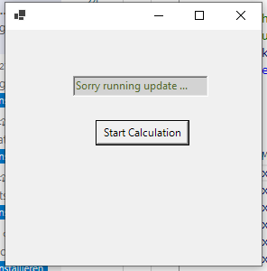

<!--

author:   Sebastian Zug, Galina Rudolf & André Dietrich
email:    sebastian.zug@informatik.tu-freiberg.de
version:  1.0.8
language: de
narrator: Deutsch Female
comment:  Multithreading Konzepte, Thread-Modell und Interaktion, Implementierung in C#, Datenaustausch, Locking, Thread-Pool
tags:      
logo:     

import: https://github.com/liascript/CodeRunner
        https://github.com/LiaTemplates/plantUML/blob/0.0.10/README.md

import: https://raw.githubusercontent.com/TUBAF-IfI-LiaScript/VL_Softwareentwicklung/master/config.md

-->

[](https://liascript.github.io/course/?https://github.com/TUBAF-IfI-LiaScript/VL_Softwareentwicklung/blob/master/23_Threads.md)

# Threads

| Parameter                | Kursinformationen                                                                       |
| ------------------------ | --------------------------------------------------------------------------------------- |
| **Veranstaltung:**       | `Vorlesung Softwareentwicklung`                                                         |
| **Teil:**                | `23/27`                                                                                 |
| **Semester**             | @config.semester                                                                        |
| **Hochschule:**          | @config.university                                                                      |
| **Inhalte:**             | @comment                                                                                |
| **Link auf den GitHub:** | https://github.com/TUBAF-IfI-LiaScript/VL_Softwareentwicklung/blob/master/23_Threads.md |
| **Autoren**              | @author                                                                                 |


---------------------------------------------------------------------

## Rückfrage letzte Woche 

https://liascript.github.io/course/?https://raw.githubusercontent.com/TUBAF-IfI-LiaScript/VL_Softwareentwicklung/master/21_Delegaten.md#10

> Hier gab es eine Rückfrage zum `ref` im Aufruf von Transformers. Dies ist nicht notwendig. Warum?

```csharp           ReplaceArray.cs
using System;

class Program
{
    static void ReplaceArray(int[] arr)
    {
        arr [0] = 42;  // Modifiziert nur die Werte im ursprüngliche Array
        //arr = new int[] { 99, 100, 101 };  // Neue Referenzzuweisung
    }

    static void Main()
    {
        int[] myArray = { 1, 2, 3 };
        ReplaceArray(myArray);

        foreach (int i in myArray)
            Console.Write(i + " ");  // Ausgabe: 1 2 3 (NICHT verändert!)
    }
}
```
@LIA.eval(`["main.cs"]`, `mcs main.cs`, `mono main.exe`)


## Motivation - Threads

Bisher haben wir rein sequentiell ablaufende Programme entworfen. Welches Problem generiert dieser Ansatz aber, wenn wir in unserer App einen Update-Service integrieren?





### Grundlagen

> Ein Ausführungs-Thread ist die kleinste Sequenz von programmierten Anweisungen, die unabhängig von einem Scheduler verwaltet werden kann, der typischerweise Teil des Betriebssystems ist.


Die Implementierung von Threads und Prozessen unterscheidet sich von Betriebssystem zu Betriebssystem, aber in den meisten Fällen ist ein Thread ein Bestandteil eines Prozesses.

Innerhalb eines Prozesses können mehrere Threads existieren, die gleichzeitig ausgeführt werden und Ressourcen wie Speicher gemeinsam nutzen, während verschiedene Prozesse diese Ressourcen nicht gemeinsam nutzen. Insbesondere teilen sich die Threads eines Prozesses seinen ausführbaren Code und die Werte seiner dynamisch zugewiesenen Variablen und seiner nicht thread-lokalen globalen Variablen zu einem bestimmten Zeitpunkt.

<!-- width="40%" -->

| **Kriterium**          | **Prozess**                                                     | **Thread**                                                            |
| ---------------------- | --------------------------------------------------------------- | --------------------------------------------------------------------- |
| **Definition**         | Eigenständiges Programm in Ausführung                           | Ausführungsstrang innerhalb eines Prozesses                           |
| **Adressraum**         | Getrennt von anderen Prozessen                                  | Gemeinsamer Adressraum mit anderen Threads desselben Prozesses        |
| **Ressourcenteilung**  | Ressourcen wie Dateien, Speicher sind nicht automatisch geteilt | Ressourcen wie Dateien, Speicher werden gemeinsam genutzt             |
| **Stack und Register** | Hat eigenen Stack und Registersatz                              | Hat eigenen Stack, aber gemeinsame Datenstruktur                      |
| **Kommunikation**      | Über Interprozesskommunikation (Pipes, Sockets, Shared Memory)  | Über gemeinsame Speicherbereiche möglich (direkt, schneller)          |
| **Erstellungsaufwand** | Relativ hoch                                                    | Gering                                                                |
| **Kontextwechsel**     | Teurer (mehr Daten müssen gespeichert/geladen werden)           | Schneller (weniger Overhead)                                          |
| **Fehlertoleranz**     | Stabiler – Fehler in einem Prozess beeinflussen andere nicht    | Fehler kann alle Threads im Prozess betreffen                         |
| **Sicherheit**         | Höher – Prozesse sind voneinander isoliert                      | Geringer – Threads können sich gegenseitig beeinflussen               |
| **Synchronisation**    | Komplex – durch IPC                                             | Notwendig, aber einfacher – z. B. durch Mutex, Semaphore              |
| **Typische Nutzung**   | Große, unabhängige Programme oder Module                        | Leichtgewichtige, parallele Aufgaben im selben Programm               |
| **Beispiel**           | Jeder Browser-Tab als eigener Prozess (z. B. Chrome)            | Jeder Client-Request im Server als Thread (z. B. Apache, Java-Server) |


### Erfassung der Performance

Wie messen wir aber die Geschwindigkeit eines Programms?

vgl. Projekt im Projektordner unter Nutzung des Pakets 

https://www.nuget.org/packages/BenchmarkDotNet

> BenchmarkDotNet funktioniert nur, wenn das Konsolenprojekt mit einer Release-Konfiguration erstellt wurde, d. h. mit angewandten Code-Optimierungen. Die Ausführung in Debug führt zu einem Laufzeitfehler.

## Implementierung unter C#

```csharp           ThreadApplicationPrinter
using System;
using System.Threading;

class Printer{
  char ch;
  int sleepTime;

  public Printer(char c, int t){
    ch = c;
    sleepTime = t;
  }

  public void Print(){
    for (int i = 0; i<10;  i++){
      Console.Write(ch);
      Thread.Sleep(sleepTime);
    }
  }
}

class Program {
    public static void Main(string[] args){
        Printer a = new Printer ('a', 10);
        Printer b = new Printer ('b', 50);
        Printer c = new Printer ('c', 70);

        var watch = System.Diagnostics.Stopwatch.StartNew();
        a.Print();
        b.Print();
        c.Print();
        watch.Stop();
        Console.WriteLine("\nDuration in ms: {0}", watch.ElapsedMilliseconds);        

        watch.Restart();
        Thread PrinterA = new Thread(new ThreadStart(a.Print));
        Thread PrinterB = new Thread(new ThreadStart(b.Print));
        PrinterA.Start();
        PrinterB.Start();
        c.Print();   // Ausführung im Main-Thread
        watch.Stop();
        Console.WriteLine("\nDuration in ms: {0}", watch.ElapsedMilliseconds);   
    }
}
```
@LIA.eval(`["main.cs"]`, `mcs main.cs`, `mono main.exe`)


Die Implementierung der Klasse Thread unter C# umfasst dabei folgende
Definitionen:

```csharp       ThreadClass
public delegate void ThreadStart();
public delegate void ParameterizedThreadStart(object? obj);
public enum ThreadPriority (Lowest = 0, BelowNormal = 1, Normal = 2, AboveNormal = 3, Highest = 4);
public enum ThreadState (Running = 0, Unstarted = 8, Stopped = 16, Suspended = 64, Stopped = 16, Aborted = 256, ...);

public sealed class Thread{
  public Thread (ThreadStart start);
  public Thread (ParameterizedThreadStart start);
  public Thread (ThreadStart start, int maxStackSize);
  public Thread (ParameterizedThreadStart start, int maxStackSize);
  ...
  public string Name {get; set;};
  public ThreadPriority Priority {get; set;};
  public ThreadState ThreadState {get;};
  public bool IsAlive {get;};
  public bool IsBackground{get;};
  public void Start();
  public void Join();
  public void Interrupt();
  public static void Sleep(int milliseconds);
  public static bool Yield ();
}
```

```csharp           ThreadBasicExample
using System;
using System.Threading;

class Program
{
    public static void Main(string[] args)
    {
        Console.WriteLine("**********Current Thread Informations***************\n");
        Thread t = Thread.CurrentThread;
        t.Name = "Primary_Thread";
        Console.WriteLine("Thread Name: {0}", t.Name);
        Console.WriteLine("Thread Status: {0}", t.ThreadState);
        Console.WriteLine("Priority: {0}", t.Priority);
        Console.WriteLine("Current application domain: {0}",Thread.GetDomain().FriendlyName);
    }
}
```
@LIA.eval(`["main.cs"]`, `mcs main.cs`, `mono main.exe`)

### Thread-Initialisierung

Wie wird das Thread-Objekt korrekt initialisiert? Viele Tutorials führen Beispiele auf, die wie folgt strukturiert sind, während im obrigen Beispiel der
Konstruktoraufruf von `Thread` einen weiteren Konstruktor `ThreadStart` adressiert:

```csharp  
Thread threadA = new Thread(ExecuteA);
threadA.Start();
// vs
Thread threadB = new Thread(new ThreadStart(ExecuteB));
```

```csharp    ThreadInit
using System;
using System.Threading;

class Calc  
{
    int paramA = 0;
    int paramB = 0;

    public Calc(int paramA, int paramB){
      this.paramA = paramA;
      this.paramB = paramB;
    }

    // Static method
    public static void getConst()
    {
        Console.WriteLine("Static funtion const = {0}", 3.14);
    }

    public void process()
    {
        Console.WriteLine("Result = {0}", paramA + paramB);
    }
}

class Program
{
    static void Main()
    {
        // explizite Übergabe des Delegaten auf statische Methode
        ThreadStart threadDelegate = new ThreadStart(Calc.getConst);
        Thread newThread = new Thread(threadDelegate);
        newThread.Start();

        // impliziter Cast zu ThreadStart (gleicher Delegat)
        newThread = new Thread(Calc.getConst);    
        newThread.Start();

        // explizite Übergabe des Delegaten auf Methode
        Calc c = new Calc(5, 6);
        threadDelegate = new ThreadStart(c.process);
        newThread = new Thread(threadDelegate);
        newThread.Start();

        // impliziter Cast zu ThreadStart (gleicher Delegat)
        newThread = new Thread(c.process);
        newThread.Start();
    }
}
```
@LIA.eval(`["main.cs"]`, `mcs main.cs`, `mono main.exe`)

Der Konstruktor der Klasse `Thread` hat aber folgende Signatur:


| Konstruktor                               | Initialisiert eine neue Thread Klasse  ...                                                                                                                                              |
| ----------------------------------------- | --------------------------------------------------------------------------------------------------------------------------------------------------------------------------------------- |
| `Thread(ThreadStart)`                     | ... auf der Basis einer Instanz von ThreadStart                                                                                                                                         |
| `Thread(ThreadStart, Int32)`              | ... auf der Basis einer Instanz von ThreadStart unter Angabe der Größe des Stacks in Byte (aufgerundet auf entsprechende Page Size und unter Berücksichtigung der globalen Mindestgröße) |
| `Thread(ParameterizedThreadStart) `       | ... auf der Basis einer Instanz von ParameterizedThreadStart                                                                                                                             |
| `Thread(ParameterizedThreadStart, Int32)` | ... auf der Basis einer Instanz von ParameterizedThreadStart unter Angabe der Größe des Stacks                                                                                           |


```csharp
// impliziter Cast zu ParameterizedThreadStart
Thread threadB = new Thread(ExecuteB);   
threadB.Start("abc");

// impliziter Cast und unmittelbarer Start
new Thread(SomeMethod).Start();
```

> **Aufgabe:** Ergänzen Sie das schon benutzte Beispiel um die Möglichkeit das auszugebene Zeichen als Parameter zu übergeben!

```csharp           ThreadApplicationPrinterParameter
using System;
using System.Threading;

class Printer{
  char ch;
  int sleepTime;

  public Printer(char c, int t){
    ch = c;
    sleepTime = t;
  }

  // Unsere Methode soll nun einen Parameter bekommen
  // public void Print(int count){
  // for (int i = 0; i<count;  i++){
  // public void Print(object? count){
  public void Print(object count){
    for (int i = 0; i<(count as int?);  i++){
      Console.Write(ch);
      Thread.Sleep(sleepTime);
    }
  }
}

class Program {
    public static void Main(string[] args){
        Printer a = new Printer ('a', 10);
        //Thread PrinterA = new Thread(new ThreadStart(a.Print));
        //PrinterA.Start();
        Thread PrinterA = new Thread(new ParameterizedThreadStart(a.Print));
        PrinterA.Start(5);
    }
}
```
@LIA.eval(`["main.cs"]`, `mcs main.cs`, `mono main.exe`)

Zur Übergabe von mehreren Parametern können Tupel oder Objekte benutzerdefinierter Klassen verwendet werden.

### Thread-Status

Aus dem Gesamtkonzept des Threads ergeben sich mehrere Zustände, in denen sich dieser befinden kann:

```text @plantUML.png
@startuml
hide empty description
[*] --> Unstarted
Unstarted --> Running : Start
Running --> WaitSleepJoin  : Thread Blocks
WaitSleepJoin --> Running  : Thread Unblocks
WaitSleepJoin --> StopRequested : Interrupt
Running --> Stopped : Thread Ends
Running --> StopRequested : Interrupt
StopRequested --> Stopped : Thread Ends
@enduml
```

| Zustand       | Bedeutung                                                                                             | 
| ------------- | ----------------------------------------------------------------------------------------------------- | 
| Unstarted     | Thread ist initialisiert                                                                              | 
| Running       | Thread befindet sich gerade in der Ausführung                                                         | 
| WaitSleepJoin | Thread wird wegen eines Sleep oder eines Join-Befehls nicht ausgeführt. Er nutzt keine Prozessorzeit. Oder der Thread wird blockiert, weil er auf eine Ressource wartet, die von einem anderen Thread gehalten wird.| 
| StopRequested | Thread wird zum Stoppen aufgefordert. Dies ist nur für den internen Gebrauch bestimmt.                |
| Stopped       | Bearbeitung beendet                                                                                   |

Jeder Thread umfasst ein Feld vom Typ `ThreadState`, dass auf verschiedenen Ebenen dessen Parameter abbildet. Das Enum ist dabei als Bitfeld konfiguriert (vgl [Doku](https://learn.microsoft.com/en-us/dotnet/api/system.flagsattribute?view=net-7.0)).

```csharp
public static ThreadState DetermineThreadState(this ThreadState ts){
  return ts & (ThreadState.Unstarted |
               ThreadState.Running |
               ThreadState.WaitSleepJoin |
               ThreadState.Stopped);

}
```

### Thread-Serialisierung

Wie lässt sich eine Serialisierung von Threads realisieren? Im Beispiel soll die Ausführung des "Printers C" erst starten, wenn die beiden anderen Druckaufträge abgearbeitet wurden.

| Methode          | Bedeutung                                                               |
| ---------------- | ----------------------------------------------------------------------- |
| `t.Join()`       | Es wird so lange gewartet, bis der Thread t zum Abschluss gekommen ist. |
| `Thread.Sleep(n)` | Es wird für n Millisekunden gewartet.                                   |
| `Thread.Yield()` | Gibt den erteilten Zugriff auf die CPU sofort zurück.                   |

```csharp           ThreadBasic
using System;
using System.Threading;

class Printer{
  char ch;
  int sleepTime;
  public Printer(char c, int t){
    ch = c;
    sleepTime = t;
  }
  public void Print(){
    for (int i = 0; i<10;  i++){
      Console.Write(ch);
      Thread.Sleep(sleepTime);
      //Thread.Yield();         // Freiwillige Abgabe an die CPU
    }
  }
}
class Program {
    public static void Main(string[] args){
        Printer a = new Printer ('a', 10);
        Printer b = new Printer ('b', 50);
        Printer c = new Printer ('c', 5);
        Thread PrinterA = new Thread(new ThreadStart(a.Print));
        Thread PrinterB = new Thread(new ThreadStart(b.Print));
        PrinterA.Start();
        PrinterB.Start();
        Thread.Sleep(1000);    // Zeitabhängige Verzögerung des Hauptthreads
        //PrinterA.Join();     // <-
        //PrinterB.Join();
        c.Print();
        Console.Write("Alle Threads beendet!");
    }
}
```
@LIA.eval(`["main.cs"]`, `mcs main.cs`, `mono main.exe`)


### Datenaustausch zwischen Threads

Jeder Thread realisiert dabei seinen eigenen Speicher, so dass die lokalen
Variablen separat abgelegt werden. Die Verwendung der lokalen Variablen ist
entsprechend geschützt.

```csharp           ThreadEncapsulation
using System;
using System.Threading;

class Program
{
    static void Execute(object output){
      int count = 0;
      for (int i = 0; i<10;  i++){
        Console.WriteLine(output + (count++).ToString());
        Thread.Sleep(10);
      }
    }

    public static void Main(string[] args){
        Thread thread_A = new Thread(Execute);
        thread_A.Start("New Thread 1:     ");
        Thread.Sleep(10);
        new Thread(Execute).Start("New Thread 2:     ");
        Execute("MainTread :");
    }
}
```
@LIA.eval(`["main.cs"]`, `mcs main.cs`, `mono main.exe`)

> Auf dem individuellen Stack werden die eigenen Kopien der lokalen Variable `count` angelegt, so dass die beiden Threads keine Interaktion realisieren.

Was aber, wenn ein Datenaustausch realisiert werden soll? Eine Möglichkeit der
Interaktion sind entsprechende Felder innerhalb einer gemeinsamen Objektinstanz.

Welches Problem ergibt sich aber dabei?

```csharp           ThreadStaticVariable
using System;
using System.Threading;

class InteractiveThreads
{
  // Gemeinsames Member der Klasse
  //[ThreadStatic] // <- gemeinsames Member innerhalb nur eines Threads, nur auf static anwendbar
  public static int count = 0;

  public void AddOne(){
    count++;
    Console.WriteLine("Nachher {0}", count);
  }
}

class Program
{
    public static void Main(string[] args){
        InteractiveThreads myThreads = new InteractiveThreads();
        for (int i = 0; i<100; i++){
          new Thread(myThreads.AddOne).Start();
        }
        Thread.Sleep(10000);
        Console.WriteLine("\n Fertig {0}", InteractiveThreads.count);
    }
}
```
@LIA.eval(`["main.cs"]`, `mcs main.cs`, `mono main.exe`)

> Ein Word zum Attribute `[ThreadStatic]` ... Warum das Ganze?

| Kriterium                     | Lokale Variable           | `[ThreadStatic]`                   |
| ----------------------------- | ------------------------- | ---------------------------------- |
| Sichtbarkeit                  | Nur innerhalb der Methode | Innerhalb der ganzen Klasse        |
| Lebensdauer                   | Pro Methodenausführung    | So lange wie der Thread lebt       |
| Automatisch thread-sicher?    | Ja (liegt auf dem Stack)  | Ja (jede Thread hat eigene Kopie)  |
| Geeignet für Wiederverwendung | Nein                      | Ja (z. B. Objektpools)             |
| Initialisierung möglich?      | Ja                        | Nein (muss manuell gemacht werden) |


```csharp           ThreadMemberVariable
using System;
using System.Threading;

class Calc  
{
    int paramA = 0;
    public void Inc()
    {
        paramA = paramA + 1;
        Console.WriteLine("Static funtion const = {0}", paramA);
    }
}

class Program
{
    public static void Main(string[] args){
        Calc c = new Calc();

        // Beide nachfolgende Thread teilen sich ein Objekt c, so dass
        // die Variable paramA von beiden Threads gemeinsam genutzt wird.
        // Das bedeutet, dass die Variable nicht thread-sicher ist!

        ThreadStart delThreadA = new ThreadStart(c.Inc);
        Thread newThread_A = new Thread(delThreadA);
        newThread_A.Start();

        ThreadStart delThreadB = new ThreadStart(c.Inc);
        Thread newThread_B = new Thread(delThreadB);
        newThread_B.Start();
    }
}
```
@LIA.eval(`["main.cs"]`, `mcs main.cs`, `mono main.exe`)

Thread-spezifische Daten in nicht-statischen Kontexten können in  `ThreadLocal<T>` oder `AsyncLocal<T>` verwaltet werden.

```csharp
private ThreadLocal<int> threadSpecificData = new ThreadLocal<int>(() => 0);

void ThreadMethod(int initialValue)
{
  threadSpecificData.Value = initialValue;
  //...
  threadSpecificData.Value++;
  //...
}
```

### Locking

Locking und Threadsicherheit sind zentrale Herausforderungen bei der Arbeit mit
Multithread-Anwendungen. Wie können wir im vorhergehenden Beispiel sicherstellen,
dass zwischen dem Laden von threadcount in ein Register, der Inkrementierung
und dem Zurückschreiben nicht ein anderer Thread den Wert zwischenzeitlich manipuliert hat?

Für eine binäre Variable wird dabei von einem Test-And-Set Mechanisms gesprochen
der Thread-sicher sein muss. Wie können wir dies erreichen? Die Prüfung und Manipulation
muss atomar ausgeführt werden, dass heißt an dieser Stelle darf der ausführende
Thread nicht verdrängt werden.

Darauf aufbauend implementiert C# verschiedene Methoden:

| Threadsicherheit | Bemerkung                                             |
| ---------------- | ----------------------------------------------------- |
| "exclusive lock" | Alleiniger Zugriff auf einen Codeabschnitt             |
| Monitor          | Erweiterter `lock` mit Bedingungsvariablen (`Wait`, `Pulse`, `PulseAll`) zum Warten und Signalisieren von Zustandsänderungen, synchronisierende Zugriffsprozeduren |
| Mutex (Mutual Exclusion) | Prozessübergreifende exklusive (binäre) Sperrung      |
| Semaphor         | Zugriff auf einen Codeabschnitt durch n Threads oder Prozesse, basierend auf einem Zählermechanismus |

```csharp
static readonly object locker = new object();

lock(locker){
  // kritische Region
}
```

```csharp           lock.cs
using System;
using System.Threading;

class Program
{
    static int counter = 0;
    static readonly object lockObj = new object();

    static void Main()
    {
        Thread[] threads = new Thread[10];

        for (int i = 0; i < threads.Length; i++)
        {
            threads[i] = new Thread(Increment);
            threads[i].Start();
        }

        foreach (var t in threads)
            t.Join();

        Console.WriteLine($"Endwert (mit lock): {counter}");
    }

    static void Increment()
    {
        for (int i = 0; i < 10000; i++)
        {
            lock (lockObj)
            {
                counter++;
            }
        }
    }
}
```
@LIA.eval(`["main.cs"]`, `mcs main.cs`, `mono main.exe`)

> `lock` ist eine syntaktische Abkürzung für die Verwendung des `Monitor`-Objekts. Es stellt sicher, dass nur ein Thread gleichzeitig auf den geschützten Codeabschnitt zugreifen kann.

### Hintergrund und Vordergrund-Threads

Threads können als Hintergrund- oder Vordergrundthread definiert sein.
Hintergrundthreads unterscheiden sich von Vordergrundthreads durch die Beibehaltung
der Ausführungsumgebung nach dem Abschluss. Sobald alle Vordergrundthreads in einem
verwalteten Prozess (wobei die EXE-Datei eine verwaltete Assembly ist) beendet
sind, beendet das System alle Hintergrundthreads.

```csharp    BackgroundThreads
using System;
using System.Threading;

class Printer{
  char ch;
  int sleepTime;

  public Printer(char c, int t){
    ch = c;
    sleepTime = t;
  }

  public void Print(){
    for (int i = 0; i<10;  i++){
      Console.Write(ch);
      Thread.Sleep(sleepTime);
    }
  }
}

class Program {
    public static void printThreadProperties(Thread currentThread){
      Console.WriteLine("{0} - {1} - {2}", currentThread.Name,
                                           currentThread.Priority,
                                           currentThread.IsBackground);
    }

    public static void Main(string[] args){
        Thread MainThread = Thread.CurrentThread;
        MainThread.Name = "MainThread";
        printThreadProperties(MainThread);
        Printer a = new Printer ('a', 10);
        Printer b = new Printer ('b', 50);
        Printer c = new Printer ('c', 1);
        Thread PrinterA = new Thread(new ThreadStart(a.Print));
        PrinterA.IsBackground = false;
        Thread PrinterB = new Thread(new ThreadStart(b.Print));
        PrinterB.IsBackground = false;
        printThreadProperties(PrinterA);
        printThreadProperties(PrinterB);
        PrinterA.Start();
        PrinterB.Start();
        c.Print();
    }
}
```
@LIA.eval(`["main.cs"]`, `mcs main.cs`, `mono main.exe`)

> Wie verhält sich das Programm, wenn Sie `Printer_.IsBackground = true;` einfügen?

Threads, die explizit mit der Thread-Klasse erstellt werden, sind standardmäßig Vordergrund-Threads.

## Ausnahmebehandlung mit Threads

Ab .NET Framework, Version 2.0, erlaubt die CLR bei den meisten Ausnahmefehlern in Threads deren ordnungsgemäße Fortsetzung. Allerdings ist zu beachten, dass die
Fehlerbehandlung innerhalb des Threads zu erfolgen hat. Unbehandelte Ausnahmen auf der Thread-Ebene führen in der Regel zum Abbruch des gesamten Programms.

> Verschieben Sie die Fehlerbehandlung in den Thread!

```csharp           ExceptionHandling
using System;
using System.Threading;

class Program {
  public static void Calculate(object value){ //object? value
    Console.WriteLine(5 / (int)value);        //(int?)value
  }

  public static void Main(string[] args){
    Thread myThread = new Thread (Calculate);
    try{
      myThread.Start(0);
    }
    catch(DivideByZeroException)
    {
      Console.WriteLine("Achtung - Division durch Null");
    }
  }
}
```
@LIA.eval(`["main.cs"]`, `mcs main.cs`, `mono main.exe`)

Analog kann das Abbrechen eines Threads als Ausnahme erkannt und in einer Behandlungsroutine organsiert werden.

```csharp           ThreadBasic
using System;
using System.Threading;

class Program {
  static void Operate(){
        try{
          while (true){
            Thread.Sleep(1000);
            Console.WriteLine("Thread - Ausgabe");
          }
        }
        catch (ThreadInterruptedException){
          Console.WriteLine("Thread interrupted");
        }
  }

  public static void Main(string[] args){
    Thread myThread = new Thread (Operate);
    myThread.Start();
    Thread.Sleep(3000);
    myThread.Interrupt();   // <- Abbruch des Threads   
    Console.WriteLine("fertig");
  }
}
```
@LIA.eval(`["main.cs"]`, `mcs main.cs`, `mono main.exe`)

## Unterschiede für die Thread-Implementierung 

| Aspekt           | C# (Delegat `ThreadStart`)                                                            | Java/C++ (Vererbung von `Thread`)                                         |
| ---------------- | ------------------------------------------------------------------------------------- | ------------------------------------------------------------------------- |
| **Grundidee**    | Delegation: Eine Methode wird als Parameter übergeben.                                | Vererbung: Die Funktionalität wird durch eine Subklasse definiert.        |
| **Thread-Logik** | Beliebige Methode mit passender Signatur kann als Thread-Startpunkt verwendet werden. | Die `run()`-Methode muss in der abgeleiteten Klasse überschrieben werden. |

```csharp           Csharp.cs
Thread t = new Thread(() => Console.WriteLine("Hello from thread!"));
t.Start();
```

```java           Java.java
class MyThread extends Thread {
    public void run() {
        System.out.println("Hello from thread!");
    }
}
new MyThread().start();
```

| Kriterium                       | C# Delegat                     | Java Vererbung                |
| ------------------------------- | ------------------------------ | ----------------------------- |
| **Flexibilität**                | ⭐⭐⭐⭐                       | ⭐⭐                          |
| **OOP-Konsistenz**              | ⭐⭐                           | ⭐⭐⭐⭐                      |
| **Moderne Best Practices**      | Besser mit Lambdas oder `Task` | Besser mit `Runnable`         |
| **Geeignet für komplexe Logik** | Sehr gut                       | Eingeschränkt durch Vererbung |


| Sprache    | Typischer Ansatz                                                   | Beschreibung                                                           |
| ---------- | ------------------------------------------------------------------ | ---------------------------------------------------------------------- |
| **C#**     | Delegat (`ThreadStart`)                                            | Delegat oder Lambda für Startmethode, keine Vererbung notwendig        |
| **Java**   | `Thread`-Vererbung oder `Runnable`                                 | Entweder durch Vererbung oder durch Übergabe eines `Runnable`-Objekts  |
| **Python** | `threading.Thread` mit Vererbung **oder** Übergabe eines Callables | Sehr flexibel: beides möglich                                          |
| **C++**    | `std::thread` mit Funktionsobjekten, Lambdas oder Funktionen       | Keine Vererbung, stattdessen Templates und generische Callable-Objekte |


## Thread-Pool

Wann immer ein neuer Thread gestartet wird, bedarf es einiger 100 Millisekunden, um Speicher anzufordern, ihn zu initialisieren, usw. Diese relativ aufwändige Verfahren
wird durch die Nutzung von ThreadPools beschränkt, da diese als wiederverwendbare Threads vorgesehen sind.

Die `System.Threading.ThreadPool`-Klasse stellt einer Anwendung einen Pool von "Arbeitsthreads" bereit, die vom System verwaltet werden und Ihnen die Möglichkeit bieten, sich mehr auf Anwendungsaufgaben als auf die Threadverwaltung zu konzentrieren.

                              
                            {{0-1}}
********************************************************************

```csharp           ThreadPool
using System;
using System.Threading;

class Program
{
    static void Main(string[] args)
    {
        // ThreadPool konfigurieren
        ThreadPool.SetMinThreads(4, 4);   // Warum geben wir hier mehrere Parameter an?
        ThreadPool.SetMaxThreads(8, 8);

        Console.WriteLine("Starte mehrere Aufgaben im ThreadPool...");
            
        // Kommentar 2:
        int taskCount = 5;
        CountdownEvent countdown = new CountdownEvent(taskCount);

        for (int i = 0; i < taskCount; i++)
        {
            // Kommentar 1:
            // Schleifenvariable in lokale Variable kopieren sonst "Gefangene Schleifenvariable" (Closure)
            int taskNum = i; 

            // Lambda-Ausdruck
            ThreadPool.QueueUserWorkItem(state => 
            {
                Console.WriteLine($"[Task {taskNum}] gestartet auf Thread {Thread.CurrentThread.ManagedThreadId}");
                ThreadPool.GetAvailableThreads(out int worker, out int iocp);
                Console.WriteLine($"Noch frei: {worker} WorkerThreads, {iocp} IOCP-Threads");

                // Simulierte Arbeit
                Thread.Sleep(500);

                Console.WriteLine($"[Task {taskNum}] beendet");
                countdown.Signal();
            });
        }

        // Zeige verfügbare Threads im Pool
        ThreadPool.GetAvailableThreads(out int workerThreads, out int completionPortThreads);
        Console.WriteLine($"Verfügbare WorkerThreads: {workerThreads}");
        Console.WriteLine($"Verfügbare CompletionPortThreads: {completionPortThreads}");

        // Warten, bis Threads ihre Arbeit tun können
        Console.WriteLine("Main-Thread wartet auf Aufgaben...");
        Thread.Sleep(2000); // grobes Warten – kein sauberes Synchronisieren !!!
        //countdown.Wait(); // wartet, bis alle Tasks fertig
        Console.WriteLine("Main-Thread beendet sich.");
    }
}
```
@LIA.eval(`["main.cs"]`, `mcs main.cs`, `mono main.exe`)

********************************************************************

                            {{1-2}}
********************************************************************

Das klingt sehr praktisch, was aber sind die Einschränkungen?

+ Für die Threads können keine Namen vergeben werden, damit wird das Debugging ggf. schwieriger.
+ Pooled Threads sind immer Background-Threads
+ Sie können keine individuellen Prioritäten festlegen.
+ Blockierte Threads im Pool senken die entsprechende Performance des Pools


********************************************************************

                            {{2-3}}
********************************************************************

> Wie weit kann ich mit Blick auf die Reihung eingreifen?

Noch mal zur Abgrenzung ...

```csharp         StartProcess.cs
using System;
using System.Diagnostics;

class Program {
    static void Main() {
        Process.Start("notepad.exe");  // Öffnet den Windows-Editor
    }
}
```

... und was bedeutet das?

| Ebene         | Wer steuert?         | Beschreibung                                                                    |
| ------------- | -------------------- | ------------------------------------------------------------------------------- |
| Prozess       | Betriebssystem       | CLR läuft in einem OS-Prozess                                                   |
| Native Thread | Betriebssystem       | `Thread`-Objekte in C# sind OS-Threads                                          |
| ThreadPool    | CLR + Betriebssystem | CLR entscheidet über Ausführung im Pool; OS entscheidet über Hardware-Zuteilung |

********************************************************************