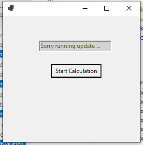
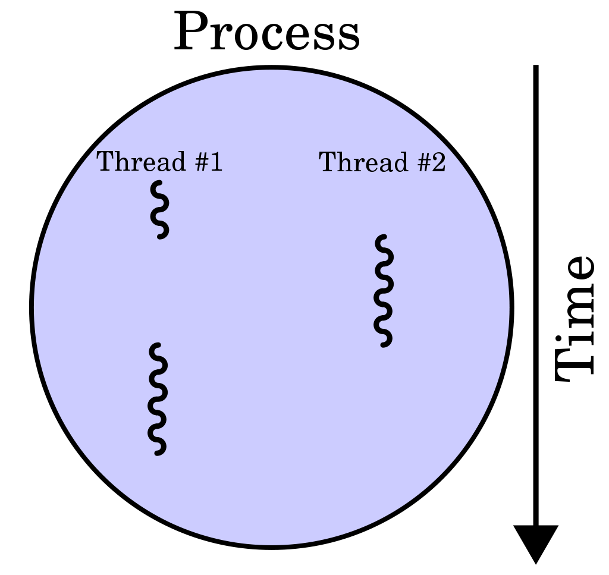

<!--

author:   Sebastian Zug, Galina Rudolf & André Dietrich
email:    sebastian.zug@informatik.tu-freiberg.de
version:  1.2.0
language: de
narrator: Deutsch Female
comment:  Multithreading Konzepte, Thread-Modell und Interaktion, Implementierung in C#, Datenaustausch, Locking, Thread-Pool
tags:      
logo:     

import: https://github.com/liascript/CodeRunner
        https://github.com/LiaTemplates/plantUML/blob/0.0.10/README.md

import: https://raw.githubusercontent.com/TUBAF-IfI-LiaScript/VL_Softwareentwicklung/master/config.md

-->

[](https://liascript.github.io/course/?https://github.com/TUBAF-IfI-LiaScript/VL_Softwareentwicklung/blob/master/23_Threads.md)

# Threads

| Parameter                | Kursinformationen                                                                       |
| ------------------------ | --------------------------------------------------------------------------------------- |
| **Veranstaltung:**       | `Vorlesung Softwareentwicklung`                                                         |
| **Teil:**                | `23/27`                                                                                 |
| **Semester**             | @config.semester                                                                        |
| **Hochschule:**          | @config.university                                                                      |
| **Inhalte:**             | @comment                                                                                |
| **Link auf den GitHub:** | https://github.com/TUBAF-IfI-LiaScript/VL_Softwareentwicklung/blob/master/23_Threads.md |
| **Autoren**              | @author                                                                                 |


---------------------------------------------------------------------

## Rückfrage letzte Woche 

https://liascript.github.io/course/?https://raw.githubusercontent.com/TUBAF-IfI-LiaScript/VL_Softwareentwicklung/master/21_Delegaten.md#10

> Hier gab es eine Rückfrage zum `ref` im Aufruf von Transformers. Dies ist nicht notwendig. Warum?

Der Schlüssel liegt in der Unterscheidung zwischen dem **Verweis** (liegt auf dem
Stack) und dem **Array-Objekt** selbst (liegt auf dem Heap). Ein `int[]` ist ein
Referenztyp - beim Aufruf wird aber der *Verweis by value* übergeben, also eine
**Kopie des Verweises**. Beide Kopien zeigen zunächst auf dasselbe Objekt:

<!-- style="display: block; margin-left: auto; margin-right: auto; max-width: 720px;" -->
```ascii
        STACK                                HEAP
   +----------------+
   | myArray  ●─────┼───────────────┐
   | (in Main)      |               │     +---+---+---+
   +----------------+               ├───► | 1 | 2 | 3 |   das eine Array-Objekt
   | arr      ●─────┼───────────────┘     +---+---+---+
   | (in Methode)   |   Kopie des Verweises
   +----------------+   -> zeigt auf DASSELBE Objekt


  Fall 1:  arr[0] = 42;            Fall 2:  arr = new int[]{99,..};
  ---------------------------      ------------------------------------
  ändert das Objekt im Heap        legt ein NEUES Objekt an und biegt
  -> über BEIDE Verweise sichtbar  nur die lokale Kopie `arr` darauf um

    arr ●──┐   +----+----+----+      myArray ●──► +-----+-----+-----+  (unberührt)
           ├─► | 42 |  2 |  3 |                   |   1 |   2 |   3 |
myArray ●──┘   +----+----+----+      arr     ●──► +-----+-----+-----+
                                                  |  99 | 100 | 101 |
   -> Ausgabe: 42 2 3                             +-----+-----+-----+
                                     -> Main sieht weiter: 1 2 3
```

Damit die **Neuzuweisung** (Fall 2) auch im `Main` ankommt, muss der Verweis
selbst *by reference* übergeben werden - genau das leistet `ref`. Das folgende
Beispiel stellt alle drei Fälle nebeneinander:

```csharp           ReplaceArray.cs
using System;

class Program
{
    // Fall 1: Inhalt ändern - wirkt nach außen, KEIN ref nötig
    static void ChangeContent(int[] arr)
    {
        arr[0] = 42;
    }

    // Fall 2: Referenz neu zuweisen - wirkt OHNE ref NICHT nach außen
    static void ReassignWithoutRef(int[] arr)
    {
        arr = new int[] { 99, 100, 101 };
    }

    // Fall 3: Referenz neu zuweisen MIT ref - wirkt nach außen
    static void ReassignWithRef(ref int[] arr)
    {
        arr = new int[] { 7, 8, 9 };
    }

    static void Print(string label, int[] a)
    {
        Console.Write(label);
        foreach (int i in a) Console.Write(i + " ");
        Console.WriteLine();
    }

    static void Main()
    {
        int[] myArray = { 1, 2, 3 };

        ChangeContent(myArray);
        Print("Nach ChangeContent:      ", myArray);   // 42 2 3

        ReassignWithoutRef(myArray);
        Print("Nach ReassignWithoutRef: ", myArray);   // 42 2 3  (Neuzuweisung verpufft)

        ReassignWithRef(ref myArray);
        Print("Nach ReassignWithRef:    ", myArray);   // 7 8 9   (jetzt wirkt sie)
    }
}
```
@LIA.eval(`["main.cs"]`, `mcs main.cs`, `mono main.exe`)

> **Fazit:** `ref` brauchen Sie nur, wenn die Methode dem Aufrufer eine **neue
> Referenz** übergeben soll (Fall 2/3). Um bloß den **Inhalt** eines bestehenden
> Objekts zu ändern (Fall 1), ist `ref` überflüssig - deshalb kam der Transformer
> in Vorlesung 21 ohne aus.


## Exkurs: Erfassung der Performance

Bevor wir uns der Nebenläufigkeit zuwenden, eine methodische Vorfrage: Wie messen
wir überhaupt die Geschwindigkeit eines Programms? Für einen groben Vergleich
genügt die `Stopwatch`-Klasse (die wir gleich im ersten Thread-Beispiel
verwenden). Für belastbare Aussagen ist sie jedoch trügerisch - JIT-Warmup,
Garbage Collection und Hintergrundlast verfälschen einzelne Messungen.

Für seriöses **Benchmarking** nutzt man daher ein spezialisiertes Werkzeug wie das
NuGet-Paket `BenchmarkDotNet`, das jede Messung mehrfach wiederholt, statistisch
auswertet und Warmup-Effekte herausrechnet.

https://www.nuget.org/packages/BenchmarkDotNet

Jede zu messende Methode wird mit `[Benchmark]` markiert; `BenchmarkRunner.Run<T>()`
übernimmt den Rest. Das folgende Beispiel vergleicht String-Verkettung mit dem
`StringBuilder`:

```csharp           Program.cs
using System.Text;
using BenchmarkDotNet.Attributes;
using BenchmarkDotNet.Running;

public class StringBenchmark
{
    [Benchmark]
    public string MitStringConcat()
    {
        string s = "";
        for (int i = 0; i < 1000; i++) s += "x";   // jedes Mal ein neuer String!
        return s;
    }

    [Benchmark]
    public string MitStringBuilder()
    {
        var sb = new StringBuilder();
        for (int i = 0; i < 1000; i++) sb.Append("x");
        return sb.ToString();
    }
}

class Program
{
    static void Main() => BenchmarkRunner.Run<StringBenchmark>();
}
```
```xml   -project.csproj
<Project Sdk="Microsoft.NET.Sdk">
  <PropertyGroup>
    <OutputType>Exe</OutputType>
    <TargetFramework>net8.0</TargetFramework>
  </PropertyGroup>
  <ItemGroup>
    <PackageReference Include="BenchmarkDotNet" Version="0.14.0" />
  </ItemGroup>
</Project>
```

Der Lauf erzeugt (nach einigen Minuten Mess- und Warmup-Läufen) eine Tabelle wie
diese:

```text
| Method           | Mean       | Error     | StdDev    |
|----------------- |-----------:|----------:|----------:|
| MitStringConcat  | 212.324 us | 3.7950 us | 5.0662 us |
| MitStringBuilder |   2.974 us | 0.0428 us | 0.0421 us |
```

> Die Verkettung ist rund **70× langsamer**: Da Strings unveränderlich sind, entsteht
> in jedem Schleifendurchlauf ein *neuer* String samt Kopie - der `StringBuilder`
> vermeidet das. Beachten Sie die Spalten `Error`/`StdDev`: Genau diese statistische
> Absicherung unterscheidet BenchmarkDotNet von einer einzelnen `Stopwatch`-Messung.

Wir zeigen den Lauf hier bewusst als *statische* Ausgabe: BenchmarkDotNet startet
für jede Methode wiederholt eigene Release-Prozesse und läuft dadurch deutlich
länger als die übrigen Beispiele. Ein einsatzfähiges Projekt zum Selbst-Ausführen
finden Sie im Code-Ordner der Vorlesung.

> **Achtung:** BenchmarkDotNet funktioniert nur, wenn das Konsolenprojekt in einer
> **Release-Konfiguration** erstellt wurde (`dotnet run -c Release`), d. h. mit
> angewandten Code-Optimierungen. Die Ausführung in Debug führt zu einem
> Laufzeitfehler.

## Motivation - Threads

Bisher haben wir rein sequentiell ablaufende Programme entworfen. Welches Problem generiert dieser Ansatz aber, wenn wir in unserer App einen Update-Service integrieren?





### Grundlagen

> Ein Ausführungs-Thread ist die kleinste Sequenz von programmierten Anweisungen, die unabhängig von einem Scheduler verwaltet werden kann, der typischerweise Teil des Betriebssystems ist.


Die Implementierung von Threads und Prozessen unterscheidet sich von Betriebssystem zu Betriebssystem, aber in den meisten Fällen ist ein Thread ein Bestandteil eines Prozesses.

Innerhalb eines Prozesses können mehrere Threads existieren, die gleichzeitig ausgeführt werden und Ressourcen wie Speicher gemeinsam nutzen, während verschiedene Prozesse diese Ressourcen nicht gemeinsam nutzen. Insbesondere teilen sich die Threads eines Prozesses seinen ausführbaren Code und die Werte seiner dynamisch zugewiesenen Variablen und seiner nicht thread-lokalen globalen Variablen zu einem bestimmten Zeitpunkt.

<!-- width="40%" -->

| **Kriterium**          | **Prozess**                                                     | **Thread**                                                            |
| ---------------------- | --------------------------------------------------------------- | --------------------------------------------------------------------- |
| **Definition**         | Eigenständiges Programm in Ausführung                           | Ausführungsstrang innerhalb eines Prozesses                           |
| **Adressraum**         | Getrennt von anderen Prozessen                                  | Gemeinsamer Adressraum mit anderen Threads desselben Prozesses        |
| **Ressourcenteilung**  | Ressourcen wie Dateien, Speicher sind nicht automatisch geteilt | Ressourcen wie Dateien, Speicher werden gemeinsam genutzt             |
| **Stack und Register** | Hat eigenen Stack und Registersatz                              | Hat eigenen Stack, aber gemeinsame Datenstruktur                      |
| **Kommunikation**      | Über Interprozesskommunikation (Pipes, Sockets, Shared Memory)  | Über gemeinsame Speicherbereiche möglich (direkt, schneller)          |
| **Erstellungsaufwand** | Relativ hoch                                                    | Gering                                                                |
| **Kontextwechsel**     | Teurer (mehr Daten müssen gespeichert/geladen werden)           | Schneller (weniger Overhead)                                          |
| **Fehlertoleranz**     | Stabiler – Fehler in einem Prozess beeinflussen andere nicht    | Fehler kann alle Threads im Prozess betreffen                         |
| **Sicherheit**         | Höher – Prozesse sind voneinander isoliert                      | Geringer – Threads können sich gegenseitig beeinflussen               |
| **Synchronisation**    | Komplex – durch IPC                                             | Notwendig, aber einfacher – z. B. durch Mutex, Semaphore              |
| **Typische Nutzung**   | Große, unabhängige Programme oder Module                        | Leichtgewichtige, parallele Aufgaben im selben Programm               |
| **Beispiel**           | Jeder Browser-Tab als eigener Prozess (z. B. Chrome)            | Jeder Client-Request im Server als Thread (z. B. Apache, Java-Server) |


### Und unser eigenes Programm?

Diese Begriffe sind nicht abstrakt - sie beschreiben **jedes Programm, das wir
starten**. Wenn Sie ein C#-Programm mit `dotnet run` (oder als `.exe`) ausführen,
passiert Folgendes:

+ Das Betriebssystem legt **einen Prozess** an, in dem die .NET-Laufzeit (CLR)
  geladen wird.
+ Die CLR ruft `Main` auf - und zwar auf dem **Hauptthread** (dem "Vordergrund-Thread").
  Bisher lief unser gesamter Code auf genau diesem einen Thread.
+ Wir sind aber **nicht allein**: Schon bevor wir selbst `new Thread(...)` aufrufen,
  unterhält die CLR eigene Hintergrundthreads (u. a. für die Speicherbereinigung /
  Garbage Collection und den Thread-Pool).

Das lässt sich sichtbar machen - der Prozess kennt sich selbst:

```csharp           Program.cs
using System;
using System.Diagnostics;
using System.Threading;

class Program
{
    public static void Main()
    {
        Process me = Process.GetCurrentProcess();

        Console.WriteLine("Prozessname : {0}", me.ProcessName);
        Console.WriteLine("Prozess-ID  : {0}", me.Id);
        Console.WriteLine("Hauptthread : {0} (führt Main aus)",
                          Thread.CurrentThread.ManagedThreadId);

        // Wie viele Threads laufen, OBWOHL wir selbst keinen gestartet haben?
        Console.WriteLine("Threads im Prozess: {0}", me.Threads.Count);
    }
}
```
```xml   -project.csproj
<Project Sdk="Microsoft.NET.Sdk">
  <PropertyGroup>
    <OutputType>Exe</OutputType>
    <TargetFramework>net8.0</TargetFramework>
  </PropertyGroup>
</Project>
```
@LIA.eval(`["Program.cs", "project.csproj"]`, `dotnet build -nologo`, `dotnet run -nologo`)

> Der Hauptthread trägt die `ManagedThreadId` 1 - auf ihm läuft unser `Main`.
> `me.Threads.Count` zählt dagegen die **Betriebssystem-Threads** des Prozesses und
> liefert eine Zahl **größer als 1** (typisch eine Handvoll), obwohl wir selbst noch
> keinen Thread erzeugt haben. Die genaue Zahl hängt von Laufzeit und Umgebung ab -
> entscheidend ist: Ein Prozess startet nie "leer", sondern bringt bereits einen
> ganzen Satz Threads mit. Alles Folgende bedeutet, diesem Prozess **weitere,
> eigene** Threads hinzuzufügen.

## Implementierung unter C#

In C# wird ein Thread durch die Klasse `System.Threading.Thread` repräsentiert. Das
Grundmuster ist immer gleich: Man übergibt dem Thread-Objekt eine **Methode**, die
er ausführen soll, und startet ihn mit `Start()`. Ab diesem Moment läuft die Methode
**nebenläufig** zum aufrufenden Code weiter.

Das erste Beispiel macht den Effekt messbar: Drei `Printer` geben nacheinander
Zeichen aus - zunächst rein **sequentiell** (`a.Print()`, dann `b.Print()`, dann
`c.Print()`), anschließend **parallel** über eigene Threads. Die `Stopwatch` misst
beide Varianten, damit der Zeitgewinn sichtbar wird.

```csharp           ThreadApplicationPrinter
using System;
using System.Threading;

class Printer{
  char ch;
  int sleepTime;

  public Printer(char c, int t){
    ch = c;
    sleepTime = t;
  }

  public void Print(){
    for (int i = 0; i<10;  i++){
      Console.Write(ch);
      Thread.Sleep(sleepTime);
    }
  }
}

class Program {
    public static void Main(string[] args){
        Printer a = new Printer ('a', 10);
        Printer b = new Printer ('b', 50);
        Printer c = new Printer ('c', 70);

        var watch = System.Diagnostics.Stopwatch.StartNew();
        a.Print();
        b.Print();
        c.Print();
        watch.Stop();
        Console.WriteLine("\nDuration in ms: {0}", watch.ElapsedMilliseconds);        

        watch.Restart();
        Thread PrinterA = new Thread(new ThreadStart(a.Print));
        Thread PrinterB = new Thread(new ThreadStart(b.Print));
        PrinterA.Start();
        PrinterB.Start();
        c.Print();   // Ausführung im Main-Thread
        watch.Stop();
        Console.WriteLine("\nDuration in ms: {0}", watch.ElapsedMilliseconds);   
    }
}
```
@LIA.eval(`["main.cs"]`, `mcs main.cs`, `mono main.exe`)


Die Implementierung der Klasse Thread unter C# umfasst dabei folgende
Definitionen:

```csharp       ThreadClass
public delegate void ThreadStart();
public delegate void ParameterizedThreadStart(object? obj);
public enum ThreadPriority (Lowest = 0, BelowNormal = 1, Normal = 2, AboveNormal = 3, Highest = 4);
public enum ThreadState (Running = 0, Unstarted = 8, Stopped = 16, Suspended = 64, Aborted = 256, ...);

public sealed class Thread{
  public Thread (ThreadStart start);
  public Thread (ParameterizedThreadStart start);
  public Thread (ThreadStart start, int maxStackSize);
  public Thread (ParameterizedThreadStart start, int maxStackSize);
  ...
  public string Name {get; set;};
  public ThreadPriority Priority {get; set;};
  public ThreadState ThreadState {get;};
  public bool IsAlive {get;};
  public bool IsBackground{get;};
  public void Start();
  public void Join();
  public void Interrupt();
  public static void Sleep(int milliseconds);
  public static bool Yield ();
}
```

Auch der Ausführungsstrang, auf dem `Main` läuft, ist ein solches `Thread`-Objekt.
Über `Thread.CurrentThread` erhält man eine Referenz darauf und kann seine
Eigenschaften (Name, Status, Priorität) auslesen oder setzen:

```csharp           ThreadBasicExample
using System;
using System.Threading;

class Program
{
    public static void Main(string[] args)
    {
        Console.WriteLine("**********Current Thread Informations***************\n");
        Thread t = Thread.CurrentThread;
        t.Name = "Primary_Thread";
        Console.WriteLine("Thread Name: {0}", t.Name);
        Console.WriteLine("Thread Status: {0}", t.ThreadState);
        Console.WriteLine("Priority: {0}", t.Priority);
        Console.WriteLine("Current application domain: {0}",Thread.GetDomain().FriendlyName);
    }
}
```
@LIA.eval(`["main.cs"]`, `mcs main.cs`, `mono main.exe`)

### Thread-Initialisierung

Wie wird ein Thread-Objekt korrekt initialisiert? Das Muster hat immer zwei
Schritte: Im **Konstruktor** legt man fest, *welche* Methode der Thread ausführt,
und mit **`Start()`** setzt man ihn in Gang. Wir gehen die Varianten der Reihe nach
durch - erst ohne, dann mit Parameter.

#### Schritt 1: Welche Methode? - der Delegat im Konstruktor

Das an den Konstruktor übergebene `PrintHello` ist kein Wert, sondern ein
**Delegat** - ein Verweis auf eine Methode mit passender Signatur (`void`, keine
Parameter, also ein `ThreadStart`). Diesen Delegaten kann man **implizit** (nur den
Methodennamen) oder **explizit** (in `new ThreadStart(...)` gehüllt) übergeben -
beides ist gleichwertig:

```csharp  
// PrintHello ist eine Methode:  static void PrintHello() { ... }

Thread threadA = new Thread(PrintHello);                    // implizit: Compiler baut den ThreadStart
threadA.Start();
// vs
Thread threadB = new Thread(new ThreadStart(PrintHello));  // explizit: ThreadStart selbst erzeugt
```

Das folgende Beispiel spielt beide Achsen durch - *explizit/implizit* und
*statische Methode/Instanzmethode*:

```csharp    ThreadInit
using System;
using System.Threading;

class Calc  
{
    int paramA = 0;
    int paramB = 0;

    public Calc(int paramA, int paramB){
      this.paramA = paramA;
      this.paramB = paramB;
    }

    // Static method
    public static void getConst()
    {
        Console.WriteLine("Static funtion const = {0}", 3.14);
    }

    public void process()
    {
        Console.WriteLine("Result = {0}", paramA + paramB);
    }
}

class Program
{
    static void Main()
    {
        // statische Methode, Delegat EXPLIZIT erzeugt
        ThreadStart threadDelegate = new ThreadStart(Calc.getConst);
        Thread newThread = new Thread(threadDelegate);
        newThread.Start();

        // statische Methode, Delegat IMPLIZIT (Compiler erzeugt den ThreadStart)
        newThread = new Thread(Calc.getConst);    
        newThread.Start();

        // Instanzmethode, Delegat EXPLIZIT erzeugt
        Calc c = new Calc(5, 6);
        threadDelegate = new ThreadStart(c.process);
        newThread = new Thread(threadDelegate);
        newThread.Start();

        // Instanzmethode, Delegat IMPLIZIT (gleiches Muster wie oben, nur auf einer Instanz)
        newThread = new Thread(c.process);
        newThread.Start();
    }
}
```
@LIA.eval(`["main.cs"]`, `mcs main.cs`, `mono main.exe`)

Beide gestarteten Methoden verhalten sich dabei **unterschiedlich** - nicht wegen
des Threads, sondern wegen ihres Bezugs zu den Daten:

+ `Calc.getConst()` ist **statisch**, also an die Klasse gebunden und **ohne
  Zugriff auf die Instanzfelder** `paramA`/`paramB` (es gibt kein `this`). Die
  Methode gibt daher nur die Konstante `3.14` aus - sie hat keinen eigenen Zustand.
+ `c.process()` ist eine **Instanzmethode**, die auf dem konkreten Objekt
  `c = new Calc(5, 6)` läuft und dessen Felder nutzt - Ausgabe `Result = 11`.

> **Ausblick:** Dieser Unterschied ist für Threads zentral. Eine statische, zustandslose
> Methode können sich beliebig viele Threads unbesorgt teilen. Sobald aber mehrere
> Threads **dieselbe Instanz** bearbeiten, greifen sie auf **dieselben Felder** zu -
> und genau daraus entsteht das Kernproblem der Nebenläufigkeit, die *Race Condition*,
> der wir uns weiter unten im Abschnitt [Locking](#locking) widmen.

#### Schritt 2: Starten - `Start()` rufen Sie immer

Egal welche der obigen Varianten Sie wählen: Ein Thread beginnt erst mit dem Aufruf
von `Start()` zu laufen. Der Blick auf die Konstruktoren zeigt, dass es zwei
Familien gibt - je nachdem, ob die Startmethode **parameterlos** ist oder **einen
Parameter** entgegennimmt:

| Konstruktor                               | Initialisiert eine neue Thread Klasse  ...                                                                                                                                              |
| ----------------------------------------- | --------------------------------------------------------------------------------------------------------------------------------------------------------------------------------------- |
| `Thread(ThreadStart)`                     | ... auf der Basis einer Instanz von ThreadStart                                                                                                                                         |
| `Thread(ThreadStart, Int32)`              | ... auf der Basis einer Instanz von ThreadStart unter Angabe der Größe des Stacks in Byte (aufgerundet auf entsprechende Page Size und unter Berücksichtigung der globalen Mindestgröße) |
| `Thread(ParameterizedThreadStart) `       | ... auf der Basis einer Instanz von ParameterizedThreadStart                                                                                                                             |
| `Thread(ParameterizedThreadStart, Int32)` | ... auf der Basis einer Instanz von ParameterizedThreadStart unter Angabe der Größe des Stacks                                                                                           |

Ohne Parameter bleibt `Start()` leer - Konstruktor und Start lassen sich sogar in
einer Zeile verbinden:

```csharp
// PrintHello ist parameterlos (ThreadStart)
Thread threadA = new Thread(PrintHello);
threadA.Start();                  // Start OHNE Argument

new Thread(PrintHello).Start();   // dasselbe, unmittelbar gestartet
```

#### Schritt 3: Einen Parameter übergeben - über `Start(...)`

Und wenn die Methode einen Wert braucht? Dann verwendet man den zweiten
Konstruktor, `ParameterizedThreadStart`. Der entscheidende Punkt - und ein
häufiger Stolperstein: Der Parameter wird **nicht am Konstruktor**, sondern erst
beim **Start** übergeben. Der Konstruktor legt fest, *was* läuft; `Start(...)`
liefert, *womit* es losläuft:

```csharp
Thread t = new Thread(a.Print);   // WAS ausgeführt wird (Delegat auf Print(object))
t.Start(5);                        // WOMIT es startet (Parameter erst hier!)
```

> **Aufgabe:** Ergänzen Sie das schon benutzte Beispiel um die Möglichkeit das auszugebene Zeichen als Parameter zu übergeben!

```csharp           ThreadApplicationPrinterParameter
using System;
using System.Threading;

class Printer{
  char ch;
  int sleepTime;

  public Printer(char c, int t){
    ch = c;
    sleepTime = t;
  }

  // ParameterizedThreadStart verlangt genau EINEN object-Parameter
  public void Print(object count){
    for (int i = 0; i<(count as int?);  i++){   // Rückcast von object -> int nötig
      Console.Write(ch);
      Thread.Sleep(sleepTime);
    }
  }
}

class Program {
    public static void Main(string[] args){
        Printer a = new Printer ('a', 10);
        Thread PrinterA = new Thread(new ParameterizedThreadStart(a.Print));
        PrinterA.Start(5);   // <- der Parameter wird hier übergeben
    }
}
```
@LIA.eval(`["main.cs"]`, `mcs main.cs`, `mono main.exe`)

Der Preis dieses Weges: `ParameterizedThreadStart` akzeptiert immer nur `object`.
Die Methode muss den Wert selbst **zurückcasten** (`count as int?`), und der
Compiler kann den Typ nicht prüfen - `Start("abc")` würde anstandslos übersetzt und
erst zur Laufzeit scheitern.

#### Zwischenschritt: Was ist eine *Closure*? (noch ohne Thread)

Bevor wir das auf Threads anwenden, lösen wir den Begriff **Closure** losgelöst vom
Threading. Ein Lambda ist nicht nur ein Stück Code - es kann Variablen aus seiner
**Umgebung einfangen** und mitnehmen. Code *plus* die eingefangenen Variablen
zusammen ergeben eine Closure (dt. *Abschluss*).

Das folgende Beispiel gibt eine Funktion zurück, die sich einen eigenen Zähler
merkt - ganz ohne Thread:

```csharp           ClosureCounter
using System;

class Program
{
    // Gibt eine FUNKTION zurück, die sich einen eigenen Zähler merkt.
    static Func<int> ErzeugeZähler()
    {
        int stand = 0;                              // lokale Variable
        return () => { stand++; return stand; };    // Lambda fängt 'stand' ein
    }

    static void Main()
    {
        Func<int> zähler = ErzeugeZähler();

        // ErzeugeZähler() ist längst beendet - trotzdem lebt 'stand' weiter:
        Console.WriteLine(zähler());   // 1
        Console.WriteLine(zähler());   // 2
        Console.WriteLine(zähler());   // 3

        // Ein ZWEITER Zähler hat seinen EIGENEN, unabhängigen Stand:
        Func<int> anderer = ErzeugeZähler();
        Console.WriteLine(anderer());  // 1  (nicht 4!)
        Console.WriteLine(zähler());   // 4  (der erste zählt unbeirrt weiter)
    }
}
```
@LIA.eval(`["main.cs"]`, `mcs main.cs`, `mono main.exe`)

Zwei Beobachtungen erklären den ganzen Mechanismus:

+ Obwohl `ErzeugeZähler()` bereits zurückgekehrt ist, **lebt `stand` weiter** - die
  Closure hält die Variable am Leben, solange das Lambda existiert. Der Compiler legt
  dafür im Hintergrund eine unsichtbare Hilfsklasse an, in der `stand` als Feld liegt.
+ Jeder Aufruf von `ErzeugeZähler()` erzeugt eine **eigene** Closure mit **eigenem**
  `stand`. Deshalb zählt `anderer` unabhängig von `zähler`.

> **Merke:** Eine Closure fängt die **Variable selbst** ein, nicht eine Momentaufnahme
> ihres Wertes. Genau diese Eigenschaft macht sie gleich für die Parameterübergabe an
> Threads nützlich - kann aber auch zur Falle werden (siehe die "gefangene
> Schleifenvariable" beim [Thread-Pool](#thread-pool)).

#### Der modernere Weg: Parameter per Lambda

Zurück zu den Threads: Genau diesen Mechanismus nutzt man, um einem Thread einen
Parameter mitzugeben. Man verwendet einen **Lambda-Ausdruck**, der den Parameter als
*Closure* einfängt. Die Methode darf dann typsicher bei `int` bleiben, und `Start()`
ist wieder parameterlos. Die auskommentierte Zeile am Ende zeigt, dass die
Typprüfung nun tatsächlich greift - kommentieren Sie sie ein, verweigert schon der
Compiler die Übersetzung:

```csharp           ThreadLambdaParameter
using System;
using System.Threading;

class Printer{
  char ch;
  int sleepTime;

  public Printer(char c, int t){
    ch = c;
    sleepTime = t;
  }

  // Typsicher: int statt object - der Compiler kennt den Parametertyp
  public void Print(int count){
    for (int i = 0; i < count; i++){
      Console.Write(ch);
      Thread.Sleep(sleepTime);
    }
  }
}

class Program {
    public static void Main(string[] args){
        Printer drucker = new Printer('a', 10);   // 'a' = auszugebendes Zeichen
        int anzahl = 5;                            // wie oft?

        // Lambda fängt drucker UND anzahl als Closure ein -> Start() ohne Argument
        Thread PrinterA = new Thread(() => drucker.Print(anzahl));
        PrinterA.Start();
        PrinterA.Join();
        Console.WriteLine("\nfertig");

        // Typprüfung in Aktion: diese Zeile lässt sich NICHT übersetzen, weil
        // Print(int) keinen string akzeptiert - Fehler schon beim Kompilieren:
        // new Thread(() => drucker.Print("abc")).Start();   // CS1503
    }
}
```
@LIA.eval(`["main.cs"]`, `mcs main.cs`, `mono main.exe`)

> Die Notwendigkeit, den Parameter an `Start` zu hängen, ist also **kein Naturgesetz
> von Threads**, sondern eine Eigenheit von `ParameterizedThreadStart`. Mit Lambdas
> umgeht man sie - und übergibt so auch bequem **mehrere** Parameter. Alternativ
> lassen sich diese in einem Tupel oder Objekt einer benutzerdefinierten Klasse
> bündeln.

### Thread-Status

Aus dem Gesamtkonzept des Threads ergeben sich mehrere Zustände, in denen sich dieser befinden kann:

```text @plantUML.png
@startuml
hide empty description
[*] --> Unstarted
Unstarted --> Running : Start
Running --> WaitSleepJoin  : Thread Blocks
WaitSleepJoin --> Running  : Thread Unblocks
WaitSleepJoin --> StopRequested : Interrupt
Running --> Stopped : Thread Ends
Running --> StopRequested : Interrupt
StopRequested --> Stopped : Thread Ends
@enduml
```

| Zustand       | Bedeutung                                                                                             | 
| ------------- | ----------------------------------------------------------------------------------------------------- | 
| Unstarted     | Thread ist initialisiert                                                                              | 
| Running       | Thread befindet sich gerade in der Ausführung                                                         | 
| WaitSleepJoin | Thread wird wegen eines Sleep oder eines Join-Befehls nicht ausgeführt. Er nutzt keine Prozessorzeit. Oder der Thread wird blockiert, weil er auf eine Ressource wartet, die von einem anderen Thread gehalten wird.| 
| StopRequested | Thread wird zum Stoppen aufgefordert. Dies ist nur für den internen Gebrauch bestimmt.                |
| Stopped       | Bearbeitung beendet                                                                                   |

Jeder Thread umfasst ein Feld vom Typ `ThreadState`, dass auf verschiedenen Ebenen dessen Parameter abbildet. Das Enum ist dabei als Bitfeld konfiguriert (vgl [Doku](https://learn.microsoft.com/en-us/dotnet/api/system.flagsattribute?view=net-7.0)).

```csharp
public static ThreadState DetermineThreadState(this ThreadState ts){
  return ts & (ThreadState.Unstarted |
               ThreadState.Running |
               ThreadState.WaitSleepJoin |
               ThreadState.Stopped);

}
```

### Thread-Serialisierung

Wie lässt sich eine Serialisierung von Threads realisieren? Im Beispiel soll die Ausführung des "Printers C" erst starten, wenn die beiden anderen Druckaufträge abgearbeitet wurden.

| Methode          | Bedeutung                                                               |
| ---------------- | ----------------------------------------------------------------------- |
| `t.Join()`       | Es wird so lange gewartet, bis der Thread t zum Abschluss gekommen ist. |
| `Thread.Sleep(n)` | Es wird für n Millisekunden gewartet.                                   |
| `Thread.Yield()` | Gibt den erteilten Zugriff auf die CPU sofort zurück.                   |

```csharp           ThreadBasic
using System;
using System.Threading;

class Printer{
  char ch;
  int sleepTime;
  public Printer(char c, int t){
    ch = c;
    sleepTime = t;
  }
  public void Print(){
    for (int i = 0; i<10;  i++){
      Console.Write(ch);
      Thread.Sleep(sleepTime);
      //Thread.Yield();         // Freiwillige Abgabe an die CPU
    }
  }
}
class Program {
    public static void Main(string[] args){
        Printer a = new Printer ('a', 10);
        Printer b = new Printer ('b', 50);
        Printer c = new Printer ('c', 5);
        Thread PrinterA = new Thread(new ThreadStart(a.Print));
        Thread PrinterB = new Thread(new ThreadStart(b.Print));
        PrinterA.Start();
        PrinterB.Start();
        Thread.Sleep(1000);    // Zeitabhängige Verzögerung des Hauptthreads
        //PrinterA.Join();     // <-
        //PrinterB.Join();
        c.Print();
        Console.Write("Alle Threads beendet!");
    }
}
```
@LIA.eval(`["main.cs"]`, `mcs main.cs`, `mono main.exe`)

Das Beispiel nutzt bewusst den **falschen** Weg, um dessen Schwäche vorzuführen:
`Thread.Sleep(1000)` wartet pauschal eine Sekunde und *hofft*, dass A und B bis dahin
fertig sind. Und das geht hier scheinbar auf - aber **nur, weil wir das Zeitverhalten
von A und B kennen**:

+ A druckt 10 Zeichen à 10 ms = **100 ms**
+ B druckt 10 Zeichen à 50 ms = **500 ms**

Die 1000 ms sind also großzügig über der längsten Laufzeit (500 ms) - deshalb
funktioniert es. Wir konnten die Zahl nur passend wählen, weil `sleepTime` und
Iterationszahl fest im Code stehen. **Genau das ist in echtem Code nie der Fall:**
Wie lange ein Netzwerkzugriff, eine Datei­operation oder eine Berechnung dauert,
weiß man vorher nicht - jede geratene Wartezeit ist entweder zu kurz (Fehler) oder
zu lang (Zeitverschwendung).

> **Experiment:** Ersetzen Sie `Thread.Sleep(1000)` durch `Thread.Sleep(300)`. Jetzt
> ist B (500 ms) noch nicht fertig, wenn C startet - und die Ausgabe zerfranst:
>
> ```
> abaaaabaaaaabbbbccccccbcccc...bbb
> ```
>
> Zwischen den `c` tauchen noch `b` auf, teils sogar **nach** dem Ende von C. Die
> geforderte Reihenfolge "erst A und B, dann C" ist gebrochen.

Die korrekte Lösung steht schon auskommentiert im Code: **`Join()`**. Aktiviert man
`PrinterA.Join()` und `PrinterB.Join()` (und entfernt das `Sleep`), wartet der
Hauptthread **genau so lange, bis A und B tatsächlich fertig sind** - unabhängig
davon, wie lange das dauert:

```
abaaaabaaaaabbbbbbbbcccccccccc
```

> **Kernaussage:** `Sleep` synchronisiert über eine **geratene Zeit**, `Join` über das
> **tatsächliche Ereignis** "Thread beendet". Nur Letzteres ist korrekt, sobald man die
> Laufzeiten nicht kennt. Dasselbe Muster begegnet uns bei `Task` in der nächsten
> Vorlesung wieder (dort steht neben einem `Sleep` der Kommentar *"grobes Warten - kein
> sauberes Synchronisieren"*, sauber gelöst mit `Task.WhenAll`).

### Datenaustausch zwischen Threads

Jeder Thread realisiert dabei seinen eigenen Speicher, so dass die lokalen
Variablen separat abgelegt werden. Die Verwendung der lokalen Variablen ist
entsprechend geschützt.

```csharp           ThreadEncapsulation
using System;
using System.Threading;

class Program
{
    static void Execute(object output){
      int count = 0;
      for (int i = 0; i<10;  i++){
        Console.WriteLine(output + (count++).ToString());
        Thread.Sleep(10);
      }
    }

    public static void Main(string[] args){
        Thread thread_A = new Thread(Execute);
        thread_A.Start("New Thread 1:     ");
        Thread.Sleep(10);
        new Thread(Execute).Start("New Thread 2:     ");
        Execute("MainTread :");
    }
}
```
@LIA.eval(`["main.cs"]`, `mcs main.cs`, `mono main.exe`)

> Auf dem individuellen Stack werden die eigenen Kopien der lokalen Variable `count` angelegt, so dass die beiden Threads keine Interaktion realisieren.

Was aber, wenn ein Datenaustausch realisiert werden soll? Eine Möglichkeit der
Interaktion sind entsprechende Felder innerhalb einer gemeinsamen Objektinstanz.

Welches Problem ergibt sich aber dabei?

```csharp           ThreadStaticVariable
using System;
using System.Threading;

class InteractiveThreads
{
  // Gemeinsames Member der Klasse - alle Threads teilen sich DIESE eine Variable
  public static int count = 0;

  // Jeder Thread zählt viele Male hoch - ohne jeden Schutz
  public void AddMany(){
    for (int i = 0; i < 100000; i++){
      count++;                      // NICHT atomar: laden -> +1 -> zurückschreiben
    }
  }
}

class Program
{
    public static void Main(string[] args){
        InteractiveThreads myThreads = new InteractiveThreads();
        Thread[] threads = new Thread[10];

        for (int i = 0; i < 10; i++){
          threads[i] = new Thread(myThreads.AddMany);
          threads[i].Start();
        }
        foreach (var t in threads) t.Join();   // auf ALLE Threads warten

        Console.WriteLine("Erwartet:    {0}", 10 * 100000);
        Console.WriteLine("Tatsächlich: {0}", InteractiveThreads.count);
    }
}
```
@LIA.eval(`["main.cs"]`, `mcs main.cs`, `mono main.exe`)

Erwartet wären `10 × 100000 = 1000000`. Tatsächlich kommt eine **kleinere, bei jedem
Lauf andere** Zahl heraus - zum Beispiel:

```
Erwartet:    1000000
Tatsächlich: 214326      (nächster Lauf: 226635, dann 288320, ...)
```

Der Grund: `count++` sieht wie *ein* Schritt aus, ist aber in Wahrheit **drei** -
Wert laden, um eins erhöhen, zurückschreiben. Werden zwei Threads mitten in dieser
Folge unterbrochen, überschreiben sie sich gegenseitig:

```
Thread X liest count = 41
Thread Y liest count = 41     <- noch bevor X zurückschreibt
Thread X schreibt 42
Thread Y schreibt 42          <- ein ++ ist verloren (sollte 43 sein)
```

Diese Situation - mehrere Threads verändern **ungeschützt** dieselben Daten und das
Ergebnis hängt vom zufälligen Zeitablauf ab - heißt **Race Condition** und ist das
Kernproblem der Nebenläufigkeit.

> **Warum vorher scheinbar alles "gut" ging:** Ein einzelnes `count++` (wie im
> lokalen Beispiel) ist so schnell vorbei, dass sich die Threads fast nie
> überlappen - der Fehler *existiert*, zeigt sich aber kaum. Genau das macht Race
> Conditions so gefährlich: Sie bestehen jeden oberflächlichen Test und schlagen erst
> unter Last zu. Erst die 100000 Wiederholungen oben machen die Kollisionen sichtbar.
> Die Lösung folgt weiter unten im Abschnitt [Locking](#locking).

> **Warum überhaupt `static`?** Das `static` dient hier als **kürzester Weg zu einer
> geteilten Variable** - `count` gehört der Klasse, also sehen es alle Threads ohne
> weiteres Zutun. In echtem Code setzt man `static` nicht *ein*, damit geteilt wird,
> sondern weil ein Wert **konzeptionell zur Klasse gehört**: ein globaler Zähler
> ("wie viele Objekte wurden erzeugt?"), ein gemeinsamer Cache, ein Logger. Dass er
> dann geteilt wird, ist gewollt - und genau deshalb tritt dort die Race Condition
> auf. Wichtig: **Nicht `static` verursacht den Fehler, sondern das Teilen.** `static`
> ist nur einer von zwei Wegen dorthin - der zweite folgt sofort.

Das Problem beschränkt sich nämlich nicht auf statische Variablen. Teilen sich mehrere
Threads **dasselbe Objekt**, gilt dasselbe für dessen Instanzfelder - im folgenden
Beispiel greifen beide Threads über `c.Inc()` auf `paramA` derselben Instanz zu:

```csharp           ThreadMemberVariable
using System;
using System.Threading;

class Calc  
{
    int paramA = 0;
    public void Inc()
    {
        paramA = paramA + 1;
        Console.WriteLine("Static funtion const = {0}", paramA);
    }
}

class Program
{
    public static void Main(string[] args){
        Calc c = new Calc();

        // Beide nachfolgende Thread teilen sich ein Objekt c, so dass
        // die Variable paramA von beiden Threads gemeinsam genutzt wird.
        // Das bedeutet, dass die Variable nicht thread-sicher ist!

        ThreadStart delThreadA = new ThreadStart(c.Inc);
        Thread newThread_A = new Thread(delThreadA);
        newThread_A.Start();

        ThreadStart delThreadB = new ThreadStart(c.Inc);
        Thread newThread_B = new Thread(delThreadB);
        newThread_B.Start();
    }
}
```
@LIA.eval(`["main.cs"]`, `mcs main.cs`, `mono main.exe`)

### Getrennter Zustand pro Thread

Bisher war geteilter Zustand das *Problem*. Manchmal will man aber genau das
Gegenteil: eine Variable, von der **jeder Thread seine eigene Kopie** hat - ganz
ohne Locking, weil es dann nichts zu teilen gibt. C# bietet dafür zwei Werkzeuge,
je nachdem ob die Variable statisch oder instanzgebunden ist:

+ **`[ThreadStatic]`** - ein Attribut für ein **statisches Feld**. Trotz `static`
  bekommt jeder Thread seine eigene, unabhängige Kopie.
+ **`ThreadLocal<T>`** (bzw. `AsyncLocal<T>`) - dasselbe Prinzip für **nicht-statische**
  Kontexte, mit dem Vorteil einer sauberen Initialisierung über einen Lambda.

> **Aber ist ein Instanzfeld nicht ohnehin "lokal"?** Naheliegender Einwand - und der
> Kern des Missverständnisses. Getrennt ist nur, was auf dem **Stack** liegt: lokale
> Variablen und Parameter. Ein **Instanzfeld liegt im Objekt auf dem Heap** - und
> teilen sich zwei Threads *dasselbe* Objekt (wie im `ThreadMemberVariable`-Beispiel
> oben), teilen sie sich auch dessen Felder. Ein Instanzfeld ist also **nur dann**
> pro Thread getrennt, wenn jeder Thread ein *eigenes* Objekt hat. Braucht man
> getrennten Zustand *innerhalb eines geteilten Objekts*, reicht ein normales Feld
> nicht - **genau dafür** gibt es `ThreadLocal<T>`.

```csharp
class Worker
{
  // Variante 1: statisches Feld, pro Thread getrennt
  [ThreadStatic] 
  static int zähler;

  // Variante 2: instanzgebunden, mit Startwert 0
  ThreadLocal<int> zählerLocal = new ThreadLocal<int>(() => 0);
}
```

Der Kontrast zu den bisherigen Variablen-Arten:

| Kriterium                     | Lokale Variable           | `[ThreadStatic]` / `ThreadLocal<T>`   |
| ----------------------------- | ------------------------- | ------------------------------------- |
| Sichtbarkeit                  | Nur innerhalb der Methode | Innerhalb der ganzen Klasse           |
| Lebensdauer                   | Pro Methodenausführung    | So lange wie der Thread lebt          |
| Automatisch thread-sicher?    | Ja (liegt auf dem Stack)  | Ja (jeder Thread hat eigene Kopie)    |
| Geeignet für Wiederverwendung | Nein                      | Ja (z.B. Objektpools)                 |
| Initialisierung möglich?      | Ja                        | `[ThreadStatic]` nein / `ThreadLocal<T>` ja |

> **Abgrenzung:** `[ThreadStatic]` ist **nicht** die Lösung für das Race-Beispiel von
> oben - im Gegenteil, es *entfernt* das Sharing. Es passt, wenn Threads bewusst
> getrennten Zustand brauchen (z.B. ein eigener Puffer je Thread). Wollen Threads
> Daten wirklich *teilen* und trotzdem korrekt zählen, brauchen wir **Locking** - das
> ist das nächste Thema.

### Locking

Locking und Threadsicherheit sind zentrale Herausforderungen bei der Arbeit mit
Multithread-Anwendungen. Wie können wir im vorhergehenden Beispiel sicherstellen,
dass zwischen dem Laden von threadcount in ein Register, der Inkrementierung
und dem Zurückschreiben nicht ein anderer Thread den Wert zwischenzeitlich manipuliert hat?

Für eine binäre Variable wird dabei von einem Test-And-Set Mechanisms gesprochen
der Thread-sicher sein muss. Wie können wir dies erreichen? Die Prüfung und Manipulation
muss atomar ausgeführt werden, dass heißt an dieser Stelle darf der ausführende
Thread nicht verdrängt werden.

Darauf aufbauend implementiert C# verschiedene Methoden:

| Threadsicherheit | Bemerkung                                             |
| ---------------- | ----------------------------------------------------- |
| "exclusive lock" | Alleiniger Zugriff auf einen Codeabschnitt             |
| Monitor          | Erweiterter `lock` mit Bedingungsvariablen (`Wait`, `Pulse`, `PulseAll`) zum Warten und Signalisieren von Zustandsänderungen, synchronisierende Zugriffsprozeduren |
| Mutex (Mutual Exclusion) | Prozessübergreifende exklusive (binäre) Sperrung      |
| Semaphor         | Zugriff auf einen Codeabschnitt durch n Threads oder Prozesse, basierend auf einem Zählermechanismus |

```csharp
static readonly object locker = new object();

lock(locker){
  // kritische Region
}
```

```csharp           lock.cs
using System;
using System.Threading;

class Program
{
    static int counter = 0;
    static readonly object lockObj = new object();

    static void Main()
    {
        Thread[] threads = new Thread[10];

        for (int i = 0; i < threads.Length; i++)
        {
            threads[i] = new Thread(Increment);
            threads[i].Start();
        }

        foreach (var t in threads)
            t.Join();

        Console.WriteLine($"Endwert (mit lock): {counter}");
    }

    static void Increment()
    {
        for (int i = 0; i < 10000; i++)
        {
            lock (lockObj)
            {
                counter++;
            }
        }
    }
}
```
@LIA.eval(`["main.cs"]`, `mcs main.cs`, `mono main.exe`)

> `lock` ist eine syntaktische Abkürzung für die Verwendung des `Monitor`-Objekts. Es stellt sicher, dass nur ein Thread gleichzeitig auf den geschützten Codeabschnitt zugreifen kann.

### Hintergrund und Vordergrund-Threads

Threads können als Hintergrund- oder Vordergrundthread definiert sein.
Hintergrundthreads unterscheiden sich von Vordergrundthreads durch die Beibehaltung
der Ausführungsumgebung nach dem Abschluss. Sobald alle Vordergrundthreads in einem
verwalteten Prozess (wobei die EXE-Datei eine verwaltete Assembly ist) beendet
sind, beendet das System alle Hintergrundthreads.

```csharp    BackgroundThreads
using System;
using System.Threading;

class Printer{
  char ch;
  int sleepTime;

  public Printer(char c, int t){
    ch = c;
    sleepTime = t;
  }

  public void Print(){
    for (int i = 0; i<10;  i++){
      Console.Write(ch);
      Thread.Sleep(sleepTime);
    }
  }
}

class Program {
    public static void printThreadProperties(Thread currentThread){
      Console.WriteLine("{0} - {1} - {2}", currentThread.Name,
                                           currentThread.Priority,
                                           currentThread.IsBackground);
    }

    public static void Main(string[] args){
        Thread MainThread = Thread.CurrentThread;
        MainThread.Name = "MainThread";
        printThreadProperties(MainThread);
        Printer a = new Printer ('a', 10);
        Printer b = new Printer ('b', 50);
        Printer c = new Printer ('c', 1);
        Thread PrinterA = new Thread(new ThreadStart(a.Print));
        PrinterA.IsBackground = false;
        Thread PrinterB = new Thread(new ThreadStart(b.Print));
        PrinterB.IsBackground = false;
        printThreadProperties(PrinterA);
        printThreadProperties(PrinterB);
        PrinterA.Start();
        PrinterB.Start();
        c.Print();
    }
}
```
@LIA.eval(`["main.cs"]`, `mcs main.cs`, `mono main.exe`)

> Wie verhält sich das Programm, wenn Sie `Printer_.IsBackground = true;` einfügen?

Threads, die explizit mit der Thread-Klasse erstellt werden, sind standardmäßig Vordergrund-Threads.

## Ausnahmebehandlung mit Threads

Ab .NET Framework, Version 2.0, erlaubt die CLR bei den meisten Ausnahmefehlern in Threads deren ordnungsgemäße Fortsetzung. Allerdings ist zu beachten, dass die
Fehlerbehandlung innerhalb des Threads zu erfolgen hat. Unbehandelte Ausnahmen auf der Thread-Ebene führen in der Regel zum Abbruch des gesamten Programms.

> Verschieben Sie die Fehlerbehandlung in den Thread!

```csharp           ExceptionHandling
using System;
using System.Threading;

class Program {
  public static void Calculate(object value){ //object? value
    Console.WriteLine(5 / (int)value);        //(int?)value
  }

  public static void Main(string[] args){
    Thread myThread = new Thread (Calculate);
    try{
      myThread.Start(0);
    }
    catch(DivideByZeroException)
    {
      Console.WriteLine("Achtung - Division durch Null");
    }
  }
}
```
@LIA.eval(`["main.cs"]`, `mcs main.cs`, `mono main.exe`)

Analog kann das Abbrechen eines Threads als Ausnahme erkannt und in einer Behandlungsroutine organsiert werden.

```csharp           ThreadBasic
using System;
using System.Threading;

class Program {
  static void Operate(){
        try{
          while (true){
            Thread.Sleep(1000);
            Console.WriteLine("Thread - Ausgabe");
          }
        }
        catch (ThreadInterruptedException){
          Console.WriteLine("Thread interrupted");
        }
  }

  public static void Main(string[] args){
    Thread myThread = new Thread (Operate);
    myThread.Start();
    Thread.Sleep(3000);
    myThread.Interrupt();   // <- Abbruch des Threads   
    Console.WriteLine("fertig");
  }
}
```
@LIA.eval(`["main.cs"]`, `mcs main.cs`, `mono main.exe`)

## Unterschiede für die Thread-Implementierung 

| Aspekt           | C# (Delegat `ThreadStart`)                                                            | Java/C++ (Vererbung von `Thread`)                                         |
| ---------------- | ------------------------------------------------------------------------------------- | ------------------------------------------------------------------------- |
| **Grundidee**    | Delegation: Eine Methode wird als Parameter übergeben.                                | Vererbung: Die Funktionalität wird durch eine Subklasse definiert.        |
| **Thread-Logik** | Beliebige Methode mit passender Signatur kann als Thread-Startpunkt verwendet werden. | Die `run()`-Methode muss in der abgeleiteten Klasse überschrieben werden. |

```csharp           Csharp.cs
Thread t = new Thread(() => Console.WriteLine("Hello from thread!"));
t.Start();
```

```java           Java.java
class MyThread extends Thread {
    public void run() {
        System.out.println("Hello from thread!");
    }
}
new MyThread().start();
```

| Kriterium                       | C# Delegat                     | Java Vererbung                |
| ------------------------------- | ------------------------------ | ----------------------------- |
| **Flexibilität**                | ⭐⭐⭐⭐                       | ⭐⭐                          |
| **OOP-Konsistenz**              | ⭐⭐                           | ⭐⭐⭐⭐                      |
| **Moderne Best Practices**      | Besser mit Lambdas oder `Task` | Besser mit `Runnable`         |
| **Geeignet für komplexe Logik** | Sehr gut                       | Eingeschränkt durch Vererbung |


| Sprache    | Typischer Ansatz                                                   | Beschreibung                                                           |
| ---------- | ------------------------------------------------------------------ | ---------------------------------------------------------------------- |
| **C#**     | Delegat (`ThreadStart`)                                            | Delegat oder Lambda für Startmethode, keine Vererbung notwendig        |
| **Java**   | `Thread`-Vererbung oder `Runnable`                                 | Entweder durch Vererbung oder durch Übergabe eines `Runnable`-Objekts  |
| **Python** | `threading.Thread` mit Vererbung **oder** Übergabe eines Callables | Sehr flexibel: beides möglich                                          |
| **C++**    | `std::thread` mit Funktionsobjekten, Lambdas oder Funktionen       | Keine Vererbung, stattdessen Templates und generische Callable-Objekte |


## Thread-Pool

Wann immer ein neuer Thread gestartet wird, bedarf es einiger 100 Millisekunden, um Speicher anzufordern, ihn zu initialisieren, usw. Diese relativ aufwändige Verfahren
wird durch die Nutzung von ThreadPools beschränkt, da diese als wiederverwendbare Threads vorgesehen sind.

Die `System.Threading.ThreadPool`-Klasse stellt einer Anwendung einen Pool von "Arbeitsthreads" bereit, die vom System verwaltet werden und Ihnen die Möglichkeit bieten, sich mehr auf Anwendungsaufgaben als auf die Threadverwaltung zu konzentrieren.

                              
                            {{0-1}}
********************************************************************

Statt selbst `Thread`-Objekte zu erzeugen, reicht man dem Pool über
`QueueUserWorkItem` einfach die **Aufgaben** und überlässt ihm, sie auf seinen
verwalteten Threads auszuführen. Um den Effekt sichtbar zu machen, begrenzen wir den
Pool bewusst auf **drei** Threads und geben **sechs** Aufgaben ab:

```csharp           Program.cs
using System;
using System.Threading;

class Program
{
    static void Main(string[] args)
    {
        // Pool auf genau 3 Threads festnageln (Min UND Max - sonst greift die Grenze nicht)
        ThreadPool.SetMinThreads(3, 3);
        ThreadPool.SetMaxThreads(3, 3);

        int taskCount = 6;

        // CountdownEvent: zählt von 6 herunter und gibt Wait() frei, sobald 0 erreicht ist.
        // (ThreadPool-Threads gehören dem Pool - wir können sie nicht per Join abwarten.)
        CountdownEvent fertig = new CountdownEvent(taskCount);

        for (int i = 0; i < taskCount; i++)
        {
            int nr = i;   // eigene Kopie pro Durchlauf (sonst "gefangene Schleifenvariable")

            ThreadPool.QueueUserWorkItem(_ =>
            {
                Console.WriteLine($"Aufgabe {nr} startet auf Thread {Thread.CurrentThread.ManagedThreadId}");
                Thread.Sleep(500);      // etwas Arbeit
                Console.WriteLine($"Aufgabe {nr} fertig");
                fertig.Signal();        // diese Aufgabe ist fertig -> Zähler -1
            });
        }

        fertig.Wait();   // warten, bis alle sechs Aufgaben Signal() gerufen haben
        Console.WriteLine("Alle Aufgaben erledigt.");
    }
}
```
```xml   -project.csproj
<Project Sdk="Microsoft.NET.Sdk">
  <PropertyGroup>
    <OutputType>Exe</OutputType>
    <TargetFramework>net8.0</TargetFramework>
  </PropertyGroup>
</Project>
```
@LIA.eval(`["Program.cs", "project.csproj"]`, `dotnet build -nologo`, `dotnet run -nologo`)

Die Ausgabe zeigt das Kernverhalten des Pools - die sechs Aufgaben laufen in **zwei
Wellen à drei**, nicht alle gleichzeitig - mit Mono funktioniert das nicht, deshalb hier noch mal als Ausgabe.

```
Aufgabe 0 startet auf Thread 4
Aufgabe 1 startet auf Thread 6
Aufgabe 2 startet auf Thread 7    <- nur DREI laufen parallel
Aufgabe 0 fertig
Aufgabe 1 fertig
Aufgabe 2 fertig
Aufgabe 3 startet auf Thread 7    <- erst jetzt die nächste Welle,
Aufgabe 4 startet auf Thread 4       auf DENSELBEN Threads (4, 6, 7)
Aufgabe 5 startet auf Thread 6
...
```

Zwei Beobachtungen erklären den Sinn des ThreadPools:

+ **Nur drei Aufgaben laufen gleichzeitig.** Die restlichen warten in einer
  Warteschlange, bis ein Thread frei wird. So verhindert der Pool, dass 1000 Aufgaben
  auch 1000 Threads erzeugen - er entkoppelt die *Anzahl der Aufgaben* von der
  *Anzahl der Threads*.
+ **Welle 2 nutzt dieselben Thread-IDs** wie Welle 1 (hier 4, 6, 7). Die Threads
  werden also **wiederverwendet** statt neu erzeugt - genau das spart die eingangs
  erwähnten "einige 100 Millisekunden" pro Thread-Start.

Zwei Detail-Techniken stecken noch im Code:

+ **`int nr = i;`** kopiert die Schleifenvariable in eine *eigene* Variable pro
  Durchlauf. Ohne diese Kopie würden alle Lambdas dieselbe Variable `i` einfangen
  (Closure!) und am Ende oft denselben - zu großen - Wert ausgeben. Das ist genau die
  "gefangene Schleifenvariable" aus dem [Closure-Exkurs](#thread-initialisierung).
+ **`CountdownEvent`** ersetzt hier das `Join`: Da Pool-Threads uns nicht gehören,
  warten wir stattdessen darauf, dass alle Aufgaben ihr `Signal()` abgegeben haben -
  echtes Warten auf ein Ereignis statt eines geratenen `Thread.Sleep`.

********************************************************************

                            {{1-2}}
********************************************************************

Das klingt sehr praktisch, was aber sind die Einschränkungen?

+ Für die Threads können keine Namen vergeben werden, damit wird das Debugging ggf. schwieriger.
+ Pooled Threads sind immer Background-Threads
+ Sie können keine individuellen Prioritäten festlegen.
+ Blockierte Threads im Pool senken die entsprechende Performance des Pools


********************************************************************

                            {{2-3}}
********************************************************************

> Wie weit kann ich mit Blick auf die Reihung eingreifen?

Noch mal zur Abgrenzung ...

```csharp         StartProcess.cs
using System;
using System.Diagnostics;

class Program {
    static void Main() {
        Process.Start("notepad.exe");  // Öffnet den Windows-Editor
    }
}
```

... und was bedeutet das?

| Ebene         | Wer steuert?         | Beschreibung                                                                    |
| ------------- | -------------------- | ------------------------------------------------------------------------------- |
| Prozess       | Betriebssystem       | CLR läuft in einem OS-Prozess                                                   |
| Native Thread | Betriebssystem       | `Thread`-Objekte in C# sind OS-Threads                                          |
| ThreadPool    | CLR + Betriebssystem | CLR entscheidet über Ausführung im Pool; OS entscheidet über Hardware-Zuteilung |

********************************************************************