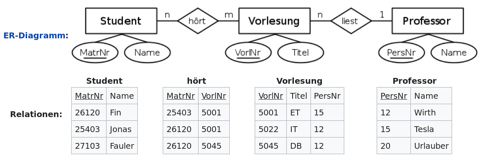

<!--

author:   Sebastian Zug, Galina Rudolf & André Dietrich
email:    sebastian.zug@informatik.tu-freiberg.de
version:  1.0.1
language: de
narrator: Deutsch Female

import: https://github.com/liascript/CodeRunner
        https://raw.githubusercontent.com/liaTemplates/AlaSQL/master/README.md

icon: https://upload.wikimedia.org/wikipedia/commons/d/de/Logo_TU_Bergakademie_Freiberg.svg
-->

[](https://liascript.github.io/course/?https://github.com/TUBAF-IfI-LiaScript/VL_Softwareentwicklung/blob/master/25_LINQ.md)

# Language-Integrated Query

| Parameter                | Kursinformationen                                                                                                                                                                          |
| ------------------------ | ------------------------------------------------------------------------------------------------------------------------------------------------------------------------------------------ |
| **Veranstaltung:**       | `Vorlesung Softwareentwicklung`                                                                                                                                                             |
| **Semester**             | `Sommersemester 2022`                                                                                                                                                                      |
| **Hochschule:**          | `Technische Universität Freiberg`                                                                                                                                                          |
| **Inhalte:**             | `LINQ Konzepte und Anwendung`                                                                                                                                |
| **Link auf den GitHub:** | [https://github.com/TUBAF-IfI-LiaScript/VL_Softwareentwicklung/blob/master/25_LINQ.md](https://github.com/TUBAF-IfI-LiaScript/VL_Softwareentwicklung/blob/master/25_LINQ.md) |
| **Autoren**              | @author                                                                                                                                                                                    |


---------------------------------------------------------------------

## Fragen aus den Projekten

> Frage: Was ist eigentlich eine csv Datei?

Das Dateiformat CSV _comma-separated values_und beschreibt den Aufbau einer Textdatei zur Speicherung oder zum Austausch einfach strukturierter Daten. Die Dateinamenserweiterung lautet .csv.

```text Prüfungsliste.csv
# Prüfungen im SoSe
16.07.2022 8:00, Theoretische Physik, mündlich, 30min
18.07.2022 10:00, Technische Mechanik, schriftlich, 2h
...
```

Wie werten wir das Ganze aus?

```csharp  csvExampleI.cs9
using System;
using System.Collections.Generic;
using System.Collections;
using System.Linq;
using System.Text;
using Microsoft.VisualBasic.FileIO;

class Student{
	 public string name;
	 public int id;
	 public string topic;

	 public override string ToString(){
	 	  return $"{this.id} - {this.name}";
	 }
}

class ReadingCSV
{
   public static void Main()
    {
        var path = @"Data.csv";
        List<Student> studentList = new List<Student>();
        using (TextFieldParser csvReader = new TextFieldParser(path))
        {
            csvReader.CommentTokens = new string[] { "#" };
            csvReader.SetDelimiters(new string[] { "," });
            csvReader.HasFieldsEnclosedInQuotes = true;
            csvReader.ReadLine();

            while (!csvReader.EndOfData)
            {
                // Read current line fields, pointer moves to the next line.
                string[] fields = csvReader.ReadFields();
                var newRecord = new Student
                {
                	   id = Int32.Parse(fields[0]),
                	   name = fields[1],
                	   topic = fields[2]
                };
                studentList.Add(newRecord);
            }
        }
        foreach(var student in studentList){
        	 Console.WriteLine(student);
        }
    }
}
```
```xml   -myproject.csproj
<Project Sdk="Microsoft.NET.Sdk">
  <PropertyGroup>
    <OutputType>Exe</OutputType>
    <TargetFramework>net5.0</TargetFramework>
  </PropertyGroup>
</Project>
```
```text Data.csv
StudentID, StudentName, Topic
1, Humboldt, Geography
2, Hardenberg, Geography
3, Rammler, Process engineering
4, Winkler, Chemistry
5, Reich, Chemistry
```
@LIA.eval(`["Program.cs", "project.csproj", "Data.csv"]`, `dotnet build -nologo`, `dotnet run -nologo`)


Alternative Umsetzung mit `DataFrames` [Link](https://dotnet.microsoft.com/en-us/apps/machinelearning-ai/ml-dotnet). Dafür muss das Paket `ML.NET` installiert werden (vgl. erweiterte Projektkonfigurationsdatei).

```csharp  csvExampleII.cs9
using System;
using System.Collections.Generic;
using Microsoft.Data.Analysis;

class ReadingCSV
{
   public static void Main()
    {
        var path = @"Data.csv";
        var students = DataFrame.LoadCsv(path, separator:',',header:true);

        Console.WriteLine(students.Info());
        var topicStat = students["Topics"].ValueCounts();
        Console.WriteLine(topicStat);
    }
}
```
```xml   -myproject.csproj
<Project Sdk="Microsoft.NET.Sdk">
  <PropertyGroup>
    <OutputType>Exe</OutputType>
    <TargetFramework>net5.0</TargetFramework>
  </PropertyGroup>
  <ItemGroup>
    <PackageReference Include="Microsoft.Data.Analysis" Version="0.19.1" />
</ItemGroup>

</Project>
```
```text Data.csv
StudentID, StudentName, Topic
1, Humboldt, Geography
2, Hardenberg, Geography
3, Rammler, Process engineering
4, Winkler, Chemistry
5, Reich, Chemistry
```
@LIA.eval(`["Program.cs", "project.csproj", "Data.csv"]`, `dotnet build -nologo`, `dotnet run -nologo`)


## Motivation

Gegeben sei das Datenset eines Comic-Begeisterten in Form einer generischen
Liste `List<T>`.

1. Bestimmen Sie die Zahl der Einträge unseres Datensatzes
2. Filtern Sie die Liste der Comic Figuren nach dem Alter und
3. Sortieren Sie die Liste nach dem Anfangsbuchstaben des Namens.

<!-- data-marker="45 0 45 50 error;" -->
```csharp    conventionalFiltering
using System;
using System.Collections.Generic;


public class Character{
  protected string name;
  public int geburtsjahr;
  private static int Count;
  int index;
  public Character(string name, int geburtsjahr){
    this.name = name;
    this.geburtsjahr = geburtsjahr;
    index = Count;
    Count = Count + 1;
  }
  public override string ToString(){
    string row = string.Format("|{0,6} | {1,-15} | {2,8} |",
                                    index, name, geburtsjahr);
    return row;
  }
}

public class Program
{
  public static void Main(string[] args){
    List<Character> ComicHeros = new List<Character>{
       new Character("Spiderman", 1962),
       new Character("Donald Duck", 1931),
       new Character("Superman", 1938)
    };
    Console.WriteLine("Alle Einträge in der Datenbank:");
    Console.WriteLine("| Index | Name            | Ursprung |");
    foreach (Character c in ComicHeros){
      Console.WriteLine(c);
    }
    // Und nun? Wie filtern wir?
  }
}
```
@LIA.eval(`["main.cs"]`, `mono main.cs`, `mono main.exe`)

                    {{1}}
********************************************************************************

Die intuitive Lösung könnte folgendermaßen daher kommen:

Die Dokumentation von `List<T>` findet sich unter folgendem [Link](https://docs.microsoft.com/de-de/dotnet/api/system.collections.generic.list-1.removeall?view=netcore-3.1)

1. Wir "erinnern" uns an das `Count` Member der Klasse `List`.
2. Für die Filteroperation implementieren Sie eine Loop. Sie können dazu `foreach` verwenden, weil `List<T>` das Interface `IEnumerable` implementiert.
3. Die Sortieroperation bedingt die Anwendung einer Vergleichsoperation zwischen den Elementen der Liste. Eine Variante ist die Implementierung des Interfaces `IComparable` zu diesem Zweck.

```csharp    Solution
using System;
using System.Collections.Generic;


public class Character: IComparable{
  protected string name;
  public int geburtsjahr;
  private static int Count;
  int index;
  public Character(string name, int geburtsjahr){
    this.name = name;
    this.geburtsjahr = geburtsjahr;
    index = Count;
    Count = Count + 1;
  }
  public override string ToString(){
    string row = string.Format("|{0,6} | {1,-15} | {2,8} |",
                                    index, name, geburtsjahr);
    return row;
  }
  public int CompareTo(object obj){
    if (obj == null) return 1;
    Character otherCharacter = obj as Character;
    return string.Compare(this.name, otherCharacter.name);
  }
}

public class Program
{
  public static void Main(string[] args){
    List<Character> ComicHeros = new List<Character>{
       new Character("Spiderman", 1962),
       new Character("Donald Duck", 1931),
       new Character("Superman", 1938)
    };
    Console.WriteLine($"\nEinträge in der Datenbank: {ComicHeros.Count}");
    Console.WriteLine("\nGefilterte Einträge in der Datenbank:");
    Console.WriteLine("| Index | Name            | Ursprung |");
    List<Character> ComicHerosFiltered = new List<Character>();
    foreach (Character c in ComicHeros){
      if (c.geburtsjahr < 1950) ComicHerosFiltered.Add(c);
    }
    foreach (Character c in ComicHerosFiltered){
      Console.WriteLine(c);
    }
    Console.WriteLine("\nSortierte Einträge in der Datenbank:");
    Console.WriteLine("| Index | Name            | Ursprung |");
    ComicHeros.Sort();
    foreach (Character c in ComicHeros){
      Console.WriteLine(c);
    }
  }
}
```
@LIA.eval(`["main.cs"]`, `mono main.cs`, `mono main.exe`)

> Eine Menge Aufwand für einen simple Operation! Welche zusätzlichen Probleme werden auftreten, wenn Sie eine solche Kette aus Datenerfassung, Verarbeitung und Ausgabe in realen Anwendungen umsetzen?

********************************************************************************

                        {{2}}
********************************************************************************

Alternativ schauen wir uns weiter im Kanon der `List<T>` Klasse um und realisieren die Methoden `RemoveAll()` oder `Sort()`.

`RemoveAll()` zum Beispiel entfernt alle Elemente, die mit den Bedingungen
übereinstimmen, die durch das angegebene Prädikat definiert werden. Interessant
ist dabei die Umsetzung. Ein Prädikat ist eine generischer Delegat der einen
Instanzen eines Typs `T` auf ein Kriterium hin evaluiert und einen Bool-Wert
als Ausgabe generiert.

```csharp
public int RemoveAll (Predicate<T> match);
public delegate bool Predicate<in T>(T obj);
```

Analog kann `Sort()` mit einem entsprechenden Delegaten `Comparison` verknüpft werden.

```csharp
public void Sort (Comparison<T> comparison);
public delegate int Comparison<in T>(T x, T y);
```

```csharp    Solution
using System;
using System.Collections.Generic;


public class Character: IComparable{
  protected string name;
  public int year;
  private static int Count;
  int index;
  public Character(string name, int year){
    this.name = name;
    this.year = year;
    index = Count;
    Count = Count + 1;
  }

  public override string ToString(){
    string row = string.Format("|{0,6} | {1,-15} | {2,8} |",
                                    index, name, year);
    return row;
  }

  public int CompareTo(object obj){
    if (obj == null) return 1;
    Character otherCharacter = obj as Character;
    return string.Compare(this.name, otherCharacter.name);
  }
}

public class Program
{
  private static bool before1950(Character entry)
  {
    return entry.year > 1950;
  }

  private static int sortByYear(Character x, Character y)
  {
     int output = 0;
     if (y.year < x.year) output = 1;
     if (y.year > x.year) output = -1;
     return output;
  }

  public static void Main(string[] args){
    List<Character> ComicHeros = new List<Character>{
       new Character("Spiderman", 1962),
       new Character("Donald Duck", 1931),
       new Character("Superman", 1938)
    };
    ComicHeros.RemoveAll(before1950);
    //ComicHeros.RemoveAll(x => x.year > 1950);
    //ComicHeros.Sort(sortByYear);
    foreach (Character c in ComicHeros){
      Console.WriteLine(c);
    }
  }
}
```
@LIA.eval(`["main.cs"]`, `mono main.cs`, `mono main.exe`)

Allerdings bleibt die Darstellung von komplexeren Abfragen wie `filtere die Helden heraus, die vor 1950 geboren sind, extrahiere die Vornamen und sortiere diese in Aufsteigender alphabetischer Folge` zu einem unübersichtlichen Darstellungsformat.

********************************************************************************


                        {{3}}
********************************************************************************

Die Methoden für den Datenzugriff und die Manipulation abhängig vom Datentyp
(Felder, Objektlisten) und der Herkunft (XML-Dokumente, Datenbanken,
Excel-Dateien, usw.).

Welche alternativen Konzepte bestehen für die Verarbeitung
von datengetriebenen Anfragen?

********************************************************************************

### Exkurs SQL

                                  {{0-1}}
*******************************************************************************

Hier folgt ein kurzer Einschub zum Thema *Structured Query Language* (SQL) ... um allen Teilnehmern eine sehr
grundlegende Sicht zu vermitteln:

SQL ist eine Datenbanksprache zur Definition von Datenstrukturen in relationalen
Datenbanken sowie zum Bearbeiten (Einfügen, Verändern, Löschen) und Abfragen von
darauf basierenden Datenbeständen.

Ausgangspunkt sind Datenbanktabellen, die Abfragen dienen dabei der Generierung
spezifischer Informationssets:

| Buchnummer | Autor              | Verlag                    | Datum | Titel                  |
| ---------- | ------------------ | ------------------------- | ----- | ---------------------- |
| 123456     | Hans Vielschreiber | Musterverlag              | 2007  | Wir lernen SQL         |
| 123457     | J. Gutenberg       | Gutenberg und Co.         | 1452  | Drucken leicht gemacht |
| 123458     | Galileo Galilei    | Inquisition International | 1640  | Eppur si muove         |
| 123459     | Charles Darwin     | Vatikan Verlag            | 1860  | Adam und Eva           |

+ "Alle Bücher mit Buchnummern von 123400 bis 123500"
+ "Alle Buchnummern mit Autoren, die im 19. Jahrhundert erschienen."
+ "In welchem Jahrhundert veröffentlichte welcher Verlag die meisten Bücher?"
+ ...

SQL basiert auf der relationalen Algebra, ihre Syntax ist relativ
einfach aufgebaut und semantisch an die englische Umgangssprache angelehnt. Die
Bezeichnung SQL bezieht sich auf das englische Wort “query” (deutsch:
„Abfrage“). Mit Abfragen werden die in einer Datenbank gespeicherten Daten
abgerufen, also dem Benutzer oder einer Anwendersoftware zur Verfügung gestellt.
Durch den Einsatz von SQL strebt man die Unabhängigkeit der Anwendungen vom
eingesetzten Datenbankmanagementsystem an.

SQL-Aufrufe sind deklarativ, weil der Entwickler hier nur das WAS und nicht das
WIE festlegt. Dabei strukturieren sich die Befehle in 4 Kategorien:

+ Befehle zur Abfrage und Aufbereitung der gesuchten Informationen
+ Befehle zur Datenmanipulation (Ändern, Einfügen, Löschen)
+ Befehle zur Definition des Datenbankschemas
+ Befehle für die Rechteverwaltung und Transaktionskontrolle.

Eine Datenbanktabelle stellt eine Datenbank-Relation dar. Die Relation ist Namensgeber und Grundlage der relationalen Datenbanken.




*******************************************************************************

                                  {{1-2}}
*******************************************************************************

**Erzeugung der Tabellen**

``` sql
CREATE TABLE Student;
INSERT INTO Student SELECT * from ?;
```
``` text -student.csv
MatrNr,Name
26120,Fichte
25403,Jonas
27103,Fauler
```
@AlaSQL.eval_with_csv

``` sql
CREATE TABLE hoert;
INSERT INTO hoert SELECT * from ?;
```
``` text -hoert.csv
MatrNr,VorlNr
26120,5001
25403,5001
27103,5045
```
@AlaSQL.eval_with_csv


``` sql
CREATE TABLE Vorlesung;
INSERT INTO Vorlesung SELECT * from ?;
```
``` text -vorlesung.csv
VorlNr,Titel,PersNr
5001,ET,15
5022,IT,12
5045,DB,12
```
@AlaSQL.eval_with_csv

``` sql
CREATE TABLE Professor;
INSERT INTO Professor SELECT * from ?;
```
``` text -prof.csv
PersNr,Name
12,Wirth
15,Tesla
20,Urlauber
```
@AlaSQL.eval_with_csv

*******************************************************************************

                                {{2}}
*******************************************************************************

**Beispiele**

``` sql    Auslesen aller Spalten und aller Zeilen
SELECT *
FROM Student;
```
@AlaSQL.eval


``` sql     Abfrage mit Spaltenauswahl
SELECT VorlNr, Titel
FROM Vorlesung;
```
@AlaSQL.eval

``` sql      Abfrage mit eindeutigen Werten
SELECT DISTINCT MatrNr
FROM hoert;
```
@AlaSQL.eval

``` sql        Abfrage mit Filter und Sortierung
SELECT VorlNr, Titel
FROM Vorlesung
WHERE Titel = 'ET';
```
@AlaSQL.eval

`LIKE` kann mit verschiedenen Platzhaltern verwendet werden: _ steht für ein einzelnes beliebiges Zeichen, % steht für eine beliebige Zeichenfolge. Manche Datenbanksysteme bieten weitere solche Wildcard-Zeichen an, etwa für Zeichenmengen.

`ORDER BY` öffnet die Möglichkeit die Reihung anzupassen.

``` sql   Verbund
SELECT Vorlesung.VorlNr, Vorlesung.Titel, Professor.PersNr, Professor.Name
FROM Professor
INNER JOIN Vorlesung ON Professor.PersNr = Vorlesung.PersNr;
```
@AlaSQL.eval

`JOIN` erlaubt es die Relationen zwischen einzelnen Datenbanktabellen aufzulösen. Dabei kann mit `INNER` und `OUTER` bzw `LEFT` und `RIGHT` die Auswahl über der Schnittmenge beschrieben werden.

``` sql   Gruppierung mit Aggregat-Funktionen
SELECT COUNT(Vorlesung.PersNr) AS Anzahl, Professor.PersNr, Professor.Name
FROM Professor LEFT JOIN Vorlesung
ON Professor.PersNr = Vorlesung.PersNr
GROUP BY Professor.Name, Professor.PersNr;
```
@AlaSQL.eval

****************************************************************

[^DatenbankSchema]: Wikipedia "SQL", Nils Boßung, https://de.wikipedia.org/wiki/SQL#/media/Datei:SQL-Beispiel.svg

## LINQ Umsetzung

*Language Integrated Query* (LINQ) zielt auf die direkte Integration von
Abfragefunktionen in die Sprache. Dafür definieren C# (wie auch VB.NET und F#)
eigene Schlüsselwörter sowie eine Menge an vorbestimmten
LINQ-Methoden. Diese können aber durch den Anwender in der jeweiligen Sprache
erweitert werden.

```csharp  LINQexample.cs
var query =
   from e in employees
   where e.DepartmentId == 5
   select e;
```

LINQ-Anweisungen sind unmittelbar als Quelltext in .NET-Programme eingebettet.
Somit kann der Code durch den Compiler auf Fehler geprüft werden. Andere
Verfahren wie *ActiveX Data Objects* ADO und *Open Database Connectivity* ODBC
hingegen verwenden Abfragestrings. Diese können erst zur Laufzeit interpretiert
werden; dann wirken Fehler gravierender und sind schwieriger zu analysieren.

> Innerhalb des Quellprogramms in C# oder VB.NET präsentiert LINQ die Abfrage-Ergebnisse als streng typisierte Aufzählungen. Somit gewährleistet es Typsicherheit bereits zur Übersetzungszeit wobei ein minimaler Codeeinsatz zurRealisierung von Filter-, Sortier- und Gruppiervorgänge in Datenquellen investiert wird.


Merkmale von LINQ

+ Die Arbeit mit Abfrageausdrücken ist einfach, da sie viele vertraute Konstrukte der Sprache C# verwenden.

+ Alle Variablen in einem Abfrageausdruck sind stark typisiert, obwohl dieser in der Regel nicht explizit angegeben wird. Der Compiler übernimmt die Ableitung.

+ Eine Abfrage wird erst ausgeführt, wenn Sie über der Abfragevariable iteriert wird. Folglich muss die Quelle in einer iterierbaren Form vorliegen.

+ Zur Kompilierzeit werden Abfrageausdrücke gemäß den in der C#-Spezifikation festgelegten Regeln in Methodenaufrufe des Standardabfrageoperators konvertiert. Die Abfragesyntax ist aber einfacher zu lesen.

+ LINQ kombiniert Abfrageausdrücke und Methodenaufrufe (`count` oder `max`). Hierin liegt die Flexibilität des Konzeptes.

Diese Veranstaltung konzentriert sich auf die *LINQ to Objects* Realisierung von
LINQ. Dabei können Abfragen mit einer beliebigen `IEnumerable`- oder `IEnumerable<T>`-Auflistungen angewandt werden.

[^LinqAnbieter]: Wikimedia https://commons.wikimedia.org/wiki/File:AnbieterLINQ.png, Author 'Mussklprozz'

### Exkurs "Erweiterungsmethoden"
<!--
  comment: Extensions.cs
  ..............................................................................
  1. Füge eine weitere Funktion mit input output Konfigurationen ein
  ```
  public static myString ExtendText(this myString input)
  {
     input.content = input.content + " extended!";
     return input;
  }
  ```
  ~~~~~~~~~~~~~~~~~~~~~~~~~~~~~~~~~~~~~~~~~~~~~~~~~~~~~~~~~~~~~~~~~~~~~~~~~~~~~
-->

Erweiterungsmethoden ergänzen den Umfang von bestehenden Methoden einer Klasse ohne selbst in diesem Typ deklariert worden zu sein. Man beschreibt eine statische Methode und ordnet diese einer Klasse über den Typ des ersten Parameters zu.

> **Merke:** Erweiterungsmethoden stellen das bisherige Konzept der Deklaration von Klassen (etwas) auf den Kopf. Sie ermöglichen es zusätzliche Funktionalität "anzuhängen".

Das folgende Beispiel unterstreicht den Unterschied zur bereits vorgestellten Methode der partiellen Methoden, die eine verteilte Implementierung einer Klasse erlaubt. Hierfür muss der Quellcode vorliegen, die Erweiterungsmethode `Print()` kann auch auf eine Bibliothek angewandt werden.

```csharp           Extensions.cs
using System;

// Ergänzung mit partiellen Implementierungen - Nur zur Abgrenzung im
// enthalten Beispiel

//  .----- Explizite Erlaubnis zur Erweiterung
//  v
public partial class MyPartitalString
{
   public string content;
   public MyPartitalString(string content)
   {
     this.content = content;
   }
}

public partial class MyPartitalString
{
   public void sayHello() => Console.WriteLine("Say Hello!");
}

////////////////////////////////////////////////////////////////////////////

class MyString
{
   public string content;
   public MyString(string content)
   {
     this.content = content;
   }
}

// Erweiterungsmethode in einer separaten Klasse
static class Exporter
{
    public static void print(this MyString input, string newString)
    {
       Console.WriteLine(input.content + newString);
    }
}

class Program
{
    public static void Main(string[] args)
    {
      MyPartitalString text1 = new MyPartitalString("Bla fasel");
      text1.sayHello();

      MyString text2 = new MyString("Bla fasel");
      text2.print("-Hossa");
    }
}
```
@LIA.eval(`["main.cs"]`, `mono main.cs`, `mono main.exe`)

Erweiterungsmethoden schaffen uns die Möglichkeit weitere Funktionalität zu
integrieren und gleichzeitig Datenobjekte durch eine Verarbeitungskette "hindurchzureichen". Erweitern Sie die statische Klasse doch mal um eine Methode, die dem Inhalt der Membervariable `content` zusätzlichen Information einfügt.

Das Ganze ist natürlich noch recht behäbig, weil wir zwingend von einem bestimmten Typen ausgehen. Dies lässt sich über eine generische Implementierung lösen.

```csharp           GenericExtensions.cs
using System;

abstract class myAbstractString{
    public string content;
    public myAbstractString(string content)
    {
      this.content = content;
    }
    public void sayClassName() => Console.WriteLine(this.GetType().Name);
}

class myString: myAbstractString
{
   public myString(string content): base(content) {}
}

class yourString: myAbstractString
{
   public yourString(string content): base(content) {}
}

static class Exporter
{
    public static void Print<T>(this T input) where T: myAbstractString
    {
       Console.WriteLine(input.content);
       input.sayClassName();
    }
}

class Program
{
    public static void Main(string[] args)
    {
      myString A = new myString("Bla fasel");
      A.Print();
      yourString B = new yourString("Bla blub");
      B.Print();
    }
}
```
@LIA.eval(`["main.cs"]`, `mono main.cs`, `mono main.exe`)

Sie können Erweiterungsmethoden verwenden, um eine Klasse oder eine Schnittstelle zu erweitern, jedoch nicht, um sie zu überschreiben. Entsprechen wird eine Erweiterungsmethode mit dem gleichen Namen und der gleichen Signatur wie eine Schnittstellen- oder Klassenmethode nie aufgerufen.

### Exkurs "Anonyme Typen"

Anonyme Typen erlauben die Spezifikation eines Satzes von schreibgeschützten Eigenschaften, ohne zunächst explizit einen Typ definieren zu müssen. Der Typname wird dabei automatisch generiert.

Anonyme Typen enthalten mindestens eine schreibgeschützte Eigenschaft, alle anderen Arten von Klassenmembern sind ausgeschlossen.

```csharp           Extensions.cs
using System;

//class Irgendwas{
//  pubic string text;
//  public int zahl;
//}

class Program
{
    public static void Main(string[] args)
    {
        //          .---- Hier steckt der Unterschied - keine Typangabe
        //          v
        var v = new  {text = "Das ist ein Text", zahl = 1};
        Console.WriteLine($"text = {v.text}, zahl = {v.zahl}");
        Console.WriteLine(v);
        //v.text = "asfsa";
        Console.WriteLine($"type = {v.GetType().Name}");
        var myPropertyInfo = v.GetType().GetProperties();
        Console.WriteLine("\nProperties:");
        for (int i = 0; i < myPropertyInfo.Length; i++)
        {
            Console.WriteLine(myPropertyInfo[i].ToString());
        }
    }
}
```
@LIA.eval(`["main.cs"]`, `mono main.cs`, `mono main.exe`)

Der Vorteil anonymer Typen liegt in ihrer Flexibilität. Die eigentlichen Daten werden entsprechend den Ergebnissen einer Funktion erzeugt.


### Exkurs "Enumarables"

<!-- size="350px" -->

```csharp
public interface IEnumerable<out T> : System.Collections.IEnumerable{
  public IEnumerator<T> = GetEnumerator();
}

public interface IEnumerator<out T> : IDisposable,
                                      System.Collections.IEnumerator{
  public object Current { get; }
  public bool MoveNext ();
  public void Reset ();
}
```

Zur Wiederholung soll nochmals ein kurzes Implementierungsbeispiel gezeigt
werden. An dieser Stelle wird eine Klasse myStrings umgesetzt, die als
Enumerationstyp realisiert werden soll. Entsprechend implementiert die Klasse
`IEnumerable` das Interface `IEnumerable<string>` und referenziert einen
Enumeratortyp `StringEnumerator`, der wiederum das Interface generische
Interface `IEnumerator<string>` umsetzt.

Transformieren Sie folgendes Codefragment in eine UML Darstellung.

```csharp           GenericIEnumerable
using System;
using System.Collections;
using System.Collections.Generic;

class myStrings : IEnumerable<string>{
   // eigentliche Daten
   public string []  str_arr = new string[] {"one" , "two" ,"three", "four", "five"};

   // "Verwaltungsoverhead"
   public IEnumerator<string> GetEnumerator()
   {
       IEnumerator<string> r = new StringEnumerator(this);
       return r ;
   }
   IEnumerator IEnumerable.GetEnumerator()
   {
       return GetEnumerator() ;
   }
}

class StringEnumerator : IEnumerator<string>{
    int index;
    myStrings sp;

    public StringEnumerator (myStrings str_obj){
       index = -1 ;
       sp = str_obj ;
    }

    object IEnumerator.Current{
      get
        { return sp.str_arr[ index ] ; }
    }

    public string Current{
      get
        { return sp.str_arr[ index ] ; }
    }

    public bool MoveNext( ){
       if ( index < sp.str_arr.Length - 1 ){
           index++ ;
           return true ;
       }
       return false ;
    }

    public void Reset( ){
       index = -1 ;
    }

    public void Dispose(){
      // pass
    }
}

class Program {
    public static void Main(string[] args){
      myStrings spp = new myStrings();
      foreach( string i in spp)
              System.Console.WriteLine(i);
    }
}
```
@LIA.eval(`["main.cs"]`, `mono main.cs`, `mono main.exe`)


Welchen Vorteil habe ich verglichen mit einer nicht-enumerate Datenstruktur, zum
Beispiel einem array? Im Hinblick auf eine konkrete Implementierung ist zwischen
dem Komfort der erweiterten API und den Performance-Eigenschaften abzuwägen.

Einen Überblick dazu bietet unter anderem die Diskussion unter
https://stackoverflow.com/questions/169973/when-should-i-use-a-list-vs-a-linkedlist/29263914#29263914


## LINQ - Grundlagen

Sie können LINQ zur Abfrage beliebiger aufzählbarer Auflistungen wie `List<T>`, `Array` oder `Dictionary<TKey,TValue>` verwenden. Die Auflistung kann entweder benutzerdefiniert sein oder von einer .NET Framework-API zurückgegeben werden.

Alle LINQ-Abfrageoperationen bestehen aus drei unterschiedlichen Aktionen:

+ Abrufen der Datenquelle
+ Erstellen der Abfrage
+ Ausführen der Abfrage

Für ein einfaches Beispiel, das Filtern einer Liste von Zahlenwerten realisiert
sich dies wie folgt:

```csharp           LINQBasicExample
using System;
using System.Threading;
using System.Collections.Generic;
using System.Linq;

class Program {
    public static void Main(string[] args){
      // Spezifikation der Datenquelle
      int[] scores = new int[] { 55, 97, 92, 81, 60 };
      // Definition der Abfrage
      IEnumerable<int> scoreQuery =
          from score in scores    // Bezug zur Datenquelle
          where score > 80        // Filterkriterium
          select score;           // "Projektion" des Rückgabewertes
      // Execute the query.
      foreach (int i in scoreQuery)
      {
          Console.Write(i + " ");
      }
    }
}
```
@LIA.eval(`["main.cs"]`, `mono main.cs`, `mono main.exe`)


**Datenquellen**

| Zugriff            | Bedeutung                                                            |
| ------------------ | -------------------------------------------------------------------- |
| LINQ to Objects    | Zugriff auf Objektlisten und -Hierarchien im Arbeitsspeicher         |
| LINQ to SQL        | Abfrage und Bearbeitung von Daten in MS-SQL-Datenbanken              |
| LINQ to Entities   | Abfrage und Bearbeitung von Daten im relationalen Modell von ADO.NET |
| LINQ to XML        | Zugriff auf XML-Inhalte                                              |
| LINQ to DataSet    | Zugriff auf ADO.NET-Datensammlungen und -Tabellen                    |
| LINQ to SharePoint | Zugriff auf SharePoint-Daten                                         |

Im Rahmen dieser Veranstaltung konzentrieren wir uns auf die LINQ to Objects
Variante.

**Query Ausdrücke**

Insgesamt sind 7 Query-Klauseln vorimplementiert, können aber durch Erweiterungsmethoden ergänzt werden.

| Ausdruck | Bedeutung                                         |
| -------- | ------------------------------------------------- |
| from     | definieren der Laufvariable und einer Datenquelle |
| where    | filtert die Daten nach bestimten Kriterien      |
| orderby  | sortiert die Elemente                             |
| select   | projeziert die Laufvariable auf die Ergebnisfolge |
| group    | bildet Gruppen innerhalb der Ergebnismenge        |
| join     | vereinigt Elemente mehrere Datenquellen           |
| let      | definiert eine Hilfsvariable                      |

```csharp
class Student{
  public string Name;
  public int Id;
  public string Subject{get; set;}
  public Student(){}
}

// Collection Initialization
List<Student> students = new List<Student>{
  new Student("Max Müller"){Subject = "Technische Informatik", id = 1},
  new Student("Maria Maier"){Subject = "Softwareentwicklung", id = 2},
  new Student("Martin Morawschek"){Subject = "Höhere Mathematik I", id = 3}
}

// Implizite Typdefinition
var result = from s in students         // Spezifikation der Datenquelle
             where s.Subject == "Softwarentwicklung"
             orderby s.Name
             select new (s.Name, s.Id)  // Projektion der Ausgabe

// explizite Typdefinition
IEnumerable<Student> result = from s in students
                              ...
```

Im vorangehenden Beispiel ist `students` die Datenquelle, über der die Abfrage
bearbeitet wird. Der List-Datentyp implementiert das Interface `IEnumerable<T>`.
Die letzte Zeile bildet das Ergebnis auf die Rückgabe ab, dem Interface
entsprechen auf ein `IEnumerable<Student>` mit den Feldern Name und Id.

Die Berechnung der Folge wird nicht als Ganzes realisiert sondern bei einer
Iteration durch den Datentyp `List<Student>`.

Für nicht-generische Typen (die also `IEnumerable` anstatt `IEnumerable<T>` unmittelbar) implementieren, muss zusätzlich der Typ der Laufvariable angegeben werden, da diese nicht aus der Datenquelle ermittelt werden kann.

```csharp           StudentListExample
using System;
using System.Collections.Generic;
using System.Linq;

public class Student
{
    public string FirstName { get; set; }
    public string LastName { get; set; }
    public int[] Scores { get; set; }
}

class Program {
  public static void Main(string[] args){
    //ArrayList StudentList = new ArrayList();  <-- Nicht mehr benutzen
    List<Student> StudentList = new List<Student>();
    StudentList.Add(
        new Student{
            FirstName = "Svetlana", LastName = "Müller", Scores = new int[] { 98, 92, 81, 60 }
            });
    StudentList.Add(
        new Student {
            FirstName = "Claire", LastName = "O’Donnell", Scores = new int[] { 75, 84, 91, 39 }
            });
    var query = from student in StudentList
                where student.Scores[0] > 95
                select student;
    foreach (Student s in query)
        Console.WriteLine(s.LastName + ": " + s.Scores[0]);
  }
}
```
@LIA.eval(`["main.cs"]`, `mono main.cs`, `mono main.exe`)

Welche Struktur ergibt sich dabei generell für eine LINQ-Abfrage? Ein Query
beginnt immer mit einer `from`-Klausel und endet mit einer `select` oder `group`-Klausel.

Allgemeingültig lässt sich, entsprechend den Ausführungen in [Mössenböck](#12) folgende Syntax ableiten:

```
QueryExpr =
   "from" [Type] variable "in" SrcExpr
   QueryBody
QueryBody =
   { "from" [Type] variable "in" SrcExpr
   | "where" BoolExpr
   | "orderby" Expr ["ascending" | "descending"] {"," Expr ["ascending" | "descending"]}
   | "join" [Type] variable "in" SrcExpr "on" Expr "equals" Expr ["into" variable]
   | "let" variable "=" Expr
   }
   ( "select" ProjectionExpr ["into" variable QueryBody]
   | "group" ProjectionExpr "by" Expr ["into" variable QueryBody]
   ).
```

Mit der isolierten Definition der Abfragen können diese mehrfach auf die Daten
angewandt werden. Man spricht dabei von einer "verzögerten Ausführung" - jeder
Aufruf der Ausgabe generiert eine neue Abfrage.

```csharp           DelayedEvaluation
using System;
using System.Threading;
using System.Collections.Generic;
using System.Linq;

class Program
{
    public static void Main(string[] args){
      var numbers = new List<int>() {1,2,3,4};
      // Spezifikation der Anfrage
      var query = from x in numbers
                  select x;
      Console.WriteLine(query.GetType());
      // Manipulation der Daten
      numbers.Add(5);
      Console.WriteLine(query.Count());
      // Manipulation und erneute Anwendung der Abfrage
      numbers.Add(6);
      Console.WriteLine(query.Count()); // 6
    }
}
```
@LIA.eval(`["main.cs"]`, `mono main.cs`, `mono main.exe`)

### Hinter den Kulissen

Der Compiler transformiert LINQ-Anfragen in der Abfragesyntax in
Lambda-Ausdrücke, Erweiterungsmethoden, Objektinitializer und anonyme Typen.
Dabei sprechen wir von der Methodensyntax. Abfragesyntax und Methodensyntax sind
semantisch identisch, aber viele Benutzer finden die Abfragesyntax einfacher und
leichter zu lesen. Da aber einige Abfragen nur in der Methodensyntax möglich
sind, müssen sie diese bisweilen nutzen. Beispiele dafür sind `Max()`, `Min()`,
oder `Take()`.

Nehmen wir also nochmals eine Anzahl von Studenten an, die in einer generischen
Liste erfasst wurden:

```csharp
List<Student> students = new List<Student>({
  new Student{
      Id = "123sdf234"
      FirstName = "Svetlana",
      LastName = "Omelchenko",
      Field = "Computer Science",
      Scores = new int[] { 98, 92, 81, 60 }
  };
  //...
  });

var result = from s in students
             where s.Field == "Computer Science"
             orderby s.LastName
             select new {s.LastName, s.Id};
```

Der Compiler generiert daraus folgenden Code:

```csharp
IEnumerable<Student> result = students
                              .Where(s => s.Field == "Computer Science" )
                              .OrderBy(s => s.LastName)
                              .Select(s => new {s.LastName, s.Id});
```

Wieso hat meine Klasse `Student` plötzlich eine Methode `where`? Hier nutzen wir eine automatisch generierte Erweiterungsmethoden.

Dabei wird die eigentliche Filterfunktion als Delegat übergeben, dies wiederum
kann durch eine Lambdafunktion ausgedrückt werden.
https://docs.microsoft.com/de-de/dotnet/api/system.linq.enumerable.where?view=netframework-4.8

Dabei beschreiben die Lambdafunktionen sogenannten Prädikate, Funktionen, die eine
bestimmte Bedingung prüfen und einen boolschen Wert zurückgeben.

```csharp        WhereExample
using System;
using System.Threading;
using System.Collections.Generic;
using System.Linq;

class Program {
    public static bool filterme(int num){
        bool result = false;
        if (num > 10) result = true;
        return result;
    }

    public static void Main(string[] args){
      int[] numbers = { 0, 30, 20, 15, 90, 85, 40, 75 };
      //Func<int, bool> filter = delegate(int num) { return num > 10; };
      Func<int, bool> filter = filterme;
      IEnumerable<int> query =
          numbers.Where(filter);
      //IEnumerable<int> query =
      //      numbers.Where(s => s > 10);
      foreach (int number in query)
      {
          Console.WriteLine(number);
      }
    }
}
```
@LIA.eval(`["main.cs"]`, `mono main.cs`, `mono main.exe`)

## Basisfunktionen von LINQ

Mit LINQ lassen sich Elementaroperationen definieren, die dann im Ganzen die Mächtigkeit des Konzeptes ausmachen.

### Filtern
<!--
  comment: FilterExample.cs
  ..............................................................................
  1. Füge eine eigenständige Methode für die Bestimmung von geraden Zahlen ein
  ```
  public static bool even(int value)
  {
     return value % 2 == 0;
  }
  ```
  ~~~~~~~~~~~~~~~~~~~~~~~~~~~~~~~~~~~~~~~~~~~~~~~~~~~~~~~~~~~~~~~~~~~~~~~~~~~~~
-->

Das Beispiel zur Filterung einer Customer-Tabelle wurde der C# Dokumentation
unter https://docs.microsoft.com/de-de/dotnet/csharp/programming-guide/concepts/linq/basic-linq-query-operations
entnommen.

Die üblichste Abfrageoperation ist das Anwenden eines Filters in Form eines
booleschen Ausdrucks. Das Filtern bewirkt, dass im Ergebnis nur die Elemente
enthalten sind, für die der Ausdruck eine wahre Aussage liefert.

Das Ergebnis wird durch Verwendung der `where`-Klausel erzeugt. Faktisch gibt
der Filter an, welche Elemente nicht in die Quellsequenz eingeschlossen werden
sollen. In folgendem Beispiel werden nur die customers zurückgegeben, die eine
Londoner Adresse haben.

```csharp
var queryLondonCustomers = from customer in customers
                           where customer.City == "London"
                           select customer;
```

Sie können die logischen Operatoren `&&` und `||` verwenden, um so viele Filterausdrücke wie
benötigt in der `where`-Klausel anzuwenden.

```csharp        FilterExample
using System;
using System.Threading;
using System.Collections.Generic;
using System.Linq;

class Program {
  public static bool even(int value)
  {
     return value % 2 == 0;
  }

  public static void Main(string[] args){
    var numbers = new List<int>() {-1, 7,11,21,32,42};
    var query = from i in numbers
                where i < 40 && i > 0
                select i;
    foreach (var x in query)
      Console.WriteLine(x);
  }
}
```
@LIA.eval(`["main.cs"]`, `mono main.cs`, `mono main.exe`)

Die entsprechenden Operatoren können aber auch um eigenständige Methoden ergänzt
werden. Versuchen Sie zum Beispiel die Bereichsabfrage um eine Prüfung zu
erweitern, ob der Zahlenwert gerade ist.

### Gruppieren

Die group-Klausel ermöglicht es, die Ergebnisse auf der Basis eines Merkmals
zusammenzufassen. Die group-Klausel gibt entsprechend eine Sequenz von
`IGrouping<TKey,TElement>`-Objekten zurück, die null oder mehr Elemente
enthalten, die mit dem Schlüsselwert `TKey` für die Gruppe übereinstimmen. Der
Compiler leiten den Typ des Schlüssels anhand der Parameter von `group` her.
IGrouping selbst implementiert das Interface `IEnumerable` und kann damit
iteriert werden.

```csharp
var queryCustomersByCity =
    from customer in customers
    group customer by customer.City;

// customerGroup is an IGrouping<string, Customer> now!
foreach (var customerGroup in queryCustomersByCity)   // Iteration 1
{
    Console.WriteLine(customerGroup.Key);
    foreach (Customer customer in customerGroup)      // Iteration 2
    {
        Console.WriteLine("    {0}", customer.Name);
    }
}
```

Dabei können die Ergebnisse einer Gruppierung wiederum Ausgangsbasis für eine
weitere Abfrage sein, wenn das Resultat mit `into` in einem Zwischenergebnis
gespeichert wird.

```csharp        GroupByExample
using System;
using System.Threading;
using System.Collections.Generic;
using System.Linq;


class Student{
  public string Name;
  public int id;
  public string Subject{get; set;}
  public Student(){}
  public Student(string name){
     this.Name = name;
  }
}

class Program {
    public static void Main(string[] args){
      List<Student> students = new List<Student>{
        new Student("Max Müller"){Subject = "Technische Informatik", id = 1},
        new Student("Maria Maier"){Subject = "Softwareentwicklung", id = 2},
        new Student("Martin Morawschek"){Subject = "Höhere Mathematik I", id = 3},
        new Student("Katja Schulz"){Subject = "Technische Informatik", id = 4},
        new Student("Karl Tischer"){Subject = "Softwareentwicklung", id = 5},
      };
      var query = from s in students
                  group s by s.Subject;
      foreach (var studentGroup in query)
      {
          Console.WriteLine(studentGroup.Key);
          foreach (Student student in studentGroup)
          {
                Console.WriteLine("    {0}", student.Name);
          }
       }
       var query2 = from s in students
                    group s by s.Subject into sg
                    select new {Subject = sg.Key, Count = sg.Count()};
       Console.WriteLine();
       foreach (var group in query2){
         Console.WriteLine(group.Count + " students attend in " + group.Subject);
       }
    }
}
```
@LIA.eval(`["main.cs"]`, `mono main.cs`, `mono main.exe`)

### Sortieren

Bei einem Sortiervorgang werden die Elemente einer Sequenz auf Grundlage eines
oder mehrerer Attribute sortiert. Mit dem ersten Sortierkriterium wird eine
primäre Sortierung der Elemente ausgeführt. Sie können die Elemente innerhalb
jeder primären Sortiergruppe sortieren, indem Sie ein zweites Sortierkriterium
angeben.

```csharp
var queryLondonCustomers = from customer in customers
                           orderby customer.City, customer.Street descending
                           select customer;
```

```csharp        SortExample
using System;
using System.Threading;
using System.Collections.Generic;
using System.Linq;


class Student{
  public string Name;
  public int id;
  public string Subject{get; set;}
  public Student(){}
  public Student(string name){
     this.Name = name;
  }
}

class Program {
    public static void Main(string[] args){
      List<Student> students = new List<Student>{
        new Student("Max Müller"){Subject = "Technische Informatik", id = 1},
        new Student("Maria Maier"){Subject = "Softwareentwicklung", id = 2},
        new Student("Martin Morawschek"){Subject = "Höhere Mathematik I", id = 3},
        new Student("Katja Schulz"){Subject = "Technische Informatik", id = 4},
        new Student("Karl Tischer"){Subject = "Softwareentwicklung", id = 5},
      };
       var query = from s in students
                   orderby s.Subject descending
                   select s;
       foreach (var student in query){
         Console.WriteLine("{0,-22} - {1}", student.Subject, student.Name);
       }
    }
}
```
@LIA.eval(`["main.cs"]`, `mono main.cs`, `mono main.exe`)

### Ausgaben

Die select-Klausel generiert aus den Ergebnissen der Abfrage das Resultat und
definiert damit das Format jedes zurückgegebenen Elements. Dies kann

+ den vollständigen Datensatz umfassen,
+ lediglich eine Teilmenge der Member oder
+ einen völlig neuen Datentypen.

Wenn die select-Klausel etwas anderes als eine Kopie des Quellelements erzeugt,
wird dieser Vorgang als Projektion bezeichnet.

```csharp        SelectExample
using System;
using System.Threading;
using System.Collections.Generic;
using System.Linq;


class Student{
  public string Name;
  public int id;
  public string Subject{get; set;}
  public Student(){}
  public Student(string name){
     this.Name = name;
  }
}

class Program {
    public static void Main(string[] args){
      List<Student> students = new List<Student>{
        new Student("Max Müller"){Subject = "Technische Informatik", id = 1},
        new Student("Maria Maier"){Subject = "Softwareentwicklung", id = 2},
        new Student("Martin Morawschek"){Subject = "Höhere Mathematik I", id = 3},
        new Student("Katja Schulz"){Subject = "Technische Informatik", id = 4},
        new Student("Karl Tischer"){Subject = "Softwareentwicklung", id = 5},
      };
       var query = from s in students
                   select new {Surname = s.Name.Split(' ')[0]};
       Console.WriteLine(query.GetType());
       foreach (var student in query){
         Console.WriteLine(student.Surname);
       }
    }
}
```
@LIA.eval(`["main.cs"]`, `mono main.cs`, `mono main.exe`)

Einen guten Überblick zu den Konzequenzen einer Projektion gibt die Webseite
https://docs.microsoft.com/de-de/dotnet/csharp/programming-guide/concepts/linq/type-relationships-in-linq-query-operations


## Aufgabe der Woche

Für die Vereinigten Staaten liegen umfangreiche Datensätze zur Namensgebung von
Neugeborenen seit 1880 vor. Eine entsprechende csv-Datei (comma separated file)
findet sich im Projektordner und /data, sie umfasst 258.000 Einträge. Diese sind
wie folgt gegliedert

```
1880,"John",0.081541,"boy"
1880,"William",0.080511,"boy"
1880,"James",0.050057,"boy"
```

Die erste Spalte gibt das Geburtsjahr, die zweite den Vornamen, die Dritte den
Anteil der mit diesem Vornamen benannten Kinder und die vierte das Geschlecht an.

Der Datensatz steht zum Download unter
https://osf.io/d2vyg/
bereit.

Lesen Sie aus den Daten die jeweils am häufigsten vergebenen Vornamen aus und
bestimmen Sie deren Anteil innerhalb des Jahrganges.
