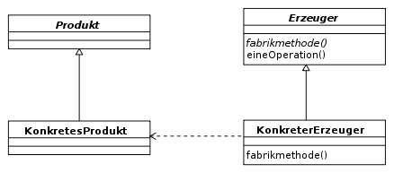
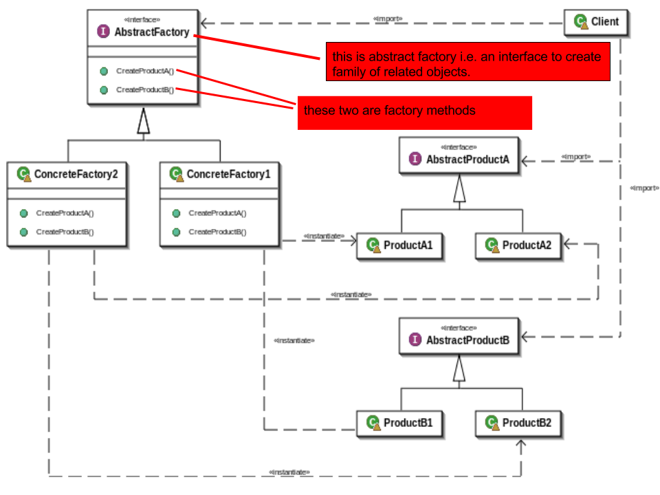

<!--

author:   Sebastian Zug, Galina Rudolf & André Dietrich
email:    sebastian.zug@informatik.tu-freiberg.de
version:  1.0.1
language: de
narrator: Deutsch Female

import: https://github.com/liascript/CodeRunner
        https://raw.githubusercontent.com/liaTemplates/AlaSQL/master/README.md

icon: https://upload.wikimedia.org/wikipedia/commons/d/de/Logo_TU_Bergakademie_Freiberg.svg
-->

[](https://liascript.github.io/course/?https://github.com/TUBAF-IfI-LiaScript/VL_Softwareentwicklung/blob/master/26_DesignPattern.md)

# Entwurfsmuster

| Parameter                | Kursinformationen                                                                                                                                                                          |
| ------------------------ | ------------------------------------------------------------------------------------------------------------------------------------------------------------------------------------------ |
| **Veranstaltung:**       | `Vorlesung Softwareentwicklung`                                                                                                                                                             |
| **Semester**             | `Sommersemester 2022`                                                                                                                                                                      |
| **Hochschule:**          | `Technische Universität Freiberg`                                                                                                                                                          |
| **Inhalte:**             | `Überblick Entwurfsmuster`                                                                                                                                |
| **Link auf den GitHub:** | [https://github.com/TUBAF-IfI-LiaScript/VL_Softwareentwicklung/blob/master/26_DesignPattern.md](https://github.com/TUBAF-IfI-LiaScript/VL_Softwareentwicklung/blob/master/26_DesignPattern.md) |
| **Autoren**              | @author                                                                                                                                                                                    |


---------------------------------------------------------------------

## Wiederholung - Polymorphie

Polymorphie ist ein Konzept in der objektorientierten Programmierung, das
ermöglicht, dass ein Bezeichner abhängig von seiner Verwendung Objekte
unterschiedlichen Datentyps annimmt.

> Polymorphie "Vielgestaltigkeit" bezeichnet die Situation, dass ein und das gleiche "Etwas" je nach "Situation" verschiedene "Gestalt" annehmen kann.

| Bezeichnung | Bedeutung im Kontext der Objektorierung                   |
| ----------- | --------------------------------------------------------- |
| Etwas       | Instanz einer Klasse aus einer Vererbungshierachie        |
| Situation   | Typ der Instanz beim Aufruf                               |
| Gestalt     | ausgeführter Code                                         |

Voraussetzung ist, dass Methoden gleichen Namens für die Basisklasse und die erbende Klasse besteht. Im Beispiel ist dies `Object` und `Shape` bzw `int`.

```csharp
class A {...}
class B: A {...}
class C: A {...}

A a = new A();
a = new B();
a = new C();

//B b = new A();    verboten
```

Wir unterscheiden entsprechend den dynamischen und den statischen Typ der Variablen A. Eine Referenz des Typs `A` zeigt auf eine Instanz von `B` oder `C`.

Der dynamische Typ kann zur Laufzeit geprüft (`is`) und durch Cast-Operationen (`as`) angepasst werden.

Dieser Mechanismus wird beim sogenannten Boxing und Unboxing deutlich:

```csharp    Polymorphie
using System;

public class Shape{
    protected int m_xpos;
    protected int m_ypos;
    public Shape(){}
    public Shape(int x, int y){
        m_xpos = x;
        m_ypos = y;
    }
    public virtual void Draw(){
        Console.WriteLine("Drawing a SHAPE at {0},{1}", m_xpos, m_ypos);
    }
    public override string ToString(){
        return String.Format("Shape at [x,y] {0},{1}", m_xpos, m_ypos);
    }
}

public class Program {
  public static void Main(string[] args){
    int i = 123;
    object o = i;
    //object o = (object)i;  // identisches explizites boxing
    //+-- Statischer Typ von obj
    //|                +-- Dynamischer Typ von obj
    //|                |
    Object obj = new Shape();
    if (obj is Object) Console.WriteLine("Objekt Typ");
    if (obj is Shape) Console.WriteLine("Shape Typ");
  }
}
```
@LIA.eval(`["main.cs"]`, `mono main.cs`, `mono main.exe`)

> Merke: Boxing und Unboxing sind Cast-Operationen die eine Variable in eine Instanz von `object` konvertieren und umgekehrt.

> Merke: `(Shape) obj` generiert eine Exception, wenn die Umwandlung fehlschlägt. Bei der Verwendung des Schlüsselwortes `as` in `obj as Shape` wird in diesem Fall ein `null` zurückgegeben.

*Wie wende ich das Ganze an?*

Anwendungsbeispiel:

<!-- size="350px" -->

In folgendem Beispiel wurde allein die Klasse `Circle` implementiert. Es exisitiert eine Methode `Draw()`, die auf der Ebene der Basisklasse und der erbenden Klasse besteht.

> Merke: Polymorphie bezieht sich auf Methoden mit einer gleichen Signatur. Die Signatur wird durch die Parameterzahl, -typ, art (`ref`, `out`) und die Sichtbarkeitsattribute bestimmt. Unterscheiden sich die Methoden im Bezug auf Parameter sprechen wir vom Überladen von Methoden. 

Die Implementierung in `Square` kann die aus `Shape` ignorieren, verdecken oder überschreiben.

```csharp  Overriding
using System;
using System.Collections.Generic;

public class Shape{
    public void Draw()
    {
        Console.WriteLine("Drawing a SHAPE");
    }
}

public class Square : Shape{
    public void Draw(string output)
    {
      Console.WriteLine($"Drawing a SQUARE with {output}");
    }
 }

public class Program {
  public static void Main(string[] args){
    Shape sh = new Shape();
    sh.Draw();
    Square sq = new Square();
    sq.Draw("Tralla");
    //sq.Draw();
  }
}
```
```xml
<Project Sdk="Microsoft.NET.Sdk">
  <PropertyGroup>
    <OutputType>Exe</OutputType>
    <TargetFramework>net5.0</TargetFramework>
  </PropertyGroup>
</Project>
```
@LIA.eval(`["Program.cs", "project.csproj"]`, `dotnet build -nologo`, `dotnet run -nologo`)

Erklären Sie die Bedeutung der Schlüsselworte `virtual` und `override`.

                                    {{0-1}}
*******************************************************************************

|                                          | **Virtuelle Member**           |
| Schlüsselwort                            | `virtual`                   |
| Implementierung in der Basisklasse       | muss implementiert werden   |
| Überschreiben in der abgeleiteten Klasse |  `override` |

In Bezug auf die Polymorphie bestimmen  die Schlüsselworte `new` und `override`
das Verhalten:

+ `override` realisiert eine "angepasste" Implementierung der Methode der Basisklasse
+ `new` implementiert eine völlig neue Methode, die keinen Bezug mehr zur Basisklassenfunktion hat

*******************************************************************************
                                    {{1-3}}
*******************************************************************************

|                                          | **Virtuelle Member**          | **Abstrakte Member**          |
| Schlüsselwort                            | `virtual`                 | `abstract`                |
| Implementierung in der Basisklasse       | muss implementiert werden | keine Implementierung     |
| Überschreiben in der abgeleiteten Klasse | `override`                | muss überschrieben werden |

Beide Konzepte können auf Methoden (hier vorrangig betrachtet), Eigenschaften, Ereignisse und Indexer angewandt werden

*******************************************************************************

                                    {{2-3}}
*******************************************************************************

Und wie war das noch mal mit den abstrakten Klassen, wie hängt deren Konzept mit
abstrakten Elementen zusammen?

+ Sie können keine Instanzen einer abstrakten Klasse erstellen.
+ Eine abstrakte Klasse kann abstrakte oder normale, nicht abstrakte Mitglieder enthalten.
+ Eine abstrakte Klasse kann selbst von einer anderen abstrakten Klasse abgeleitet werden
+ Jede von einer abstrakten Klasse abgeleitete Klasse muss alle abstrakten Mitglieder der Klasse mithilfe des Schlüsselworts `override` implementieren, es sei denn, die abgeleitete Klasse ist selbst abstrakt.

*******************************************************************************

## Design Pattern (Entwurfsmuster)

+ Design Pattern sind spezielle Muster für Interaktionen und Zusammenhänge  der Bestandteile einer Softwarelösung. 
+ Sie präsentieren Implementierungsmodelle, die für häufig wiederkehrende Abläufe (Generierung und Maskierung von Objekten) eine flexible und gut wartbare Realisierung sicherstellen. 
+ Dafür werden die  Abläufe abstrahiert und auf generisch anwendbare Muster reduziert, die dann mit domänenspezifische Bezeichnern versehen nicht nur für die vereinfachte Umsetzung sondern auch für die Kommunikation dazu genutzt werden. Dies vereinfacht die Interaktion zwischen Softwarearchitekten, Programmierer und andere Projektmitglieder.

> Design Pattern sind Strukturen, Modelle, Schablonen und Muster, die sich zur Entwicklung stabiler Softwaremodelle nutzen lassen.

Entwurfsmuster für Software orientieren sich eng an den grundlegenden Prinzipien der objektorientierten Programmierung:

+ Vererbung
+ Kapselung
+ Polymorphie

Dabei sollte ein Muster:

+ ein oder mehrere Standardprobleme lösen,
+ die Lesbarkeit und Wartbarkeit des Codes erhöhen
+ auf die Nutzung sprachspezifischer Feature verzichten, um eine Übertragbarkeit sicherzustellen
+ ein eindeutiges Set von Begriffen definieren
+ Denkanstöße für den eigenen Entwurf liefern

### Kategorien

Kategorien von Design Pattern aus dem Entwurfsmusterkatalog des Autorenquartetts Gang of Four (GoF):

1. Erzeugungsmuster (englisch creational patterns)

    Realisieren die Erzeugung von Objekten und entkoppeln die Konstruktion eines Objekts von seiner Repräsentation.

2. Strukturmuster (englisch structural patterns)

    Erleichtern den Entwurf von Software durch vorgefertigte Schablonen für Beziehungen zwischen Klassen.

3. Verhaltensmuster (englisch behavioral patterns)

    Modellieren komplexes Verhalten der Software und erhöhen damit die Flexibilität der Software hinsichtlich ihres Verhaltens.

> ACHTUNG: Entwurfsmuster sind keine Wunderwaffe und kein Garant für gutes Design! Möglichst viele Design Pattern zu nutzen verbaut mitunter den Blick auf elegantere Lösungen.


### Erzeugungsmuster - Singleton Pattern

                                         {{0-1}}
********************************************************************************

Das Singleton  ist ein in der Softwareentwicklung eingesetztes Entwurfsmuster
und gehört zur Kategorie der Erzeugungsmuster. Es stellt sicher, dass von einer
Klasse genau ein Objekt existiert. Dieses Singleton ist darüber hinaus
üblicherweise global verfügbar. Es soll sicher gestellt werden, dass ein
Resourcenzugriff kanalisiert wird, z.B. die Protokoll-Ausgabe in eine Datei erfolgt oder 
Druckaufträge in einen einzigen Puffer geschrieben werden. 


**Beispiel**

Ausgangspunkt der Überlegungen ist die Implementierung einer Klasse
`PrinterDriver`. Über die entsprechenden Hashcodes kann gezeigt werden, dass es
sich um unterschiedliche Instanzen der Klasse handelt.

Welche Möglichkeiten sehen Sie diese Implementierung anzupassen, so dass das
Singleton-Pattern realisiert wird?

```csharp    SingletonPatternStart
using System;

public class PrinterDriver{
  public void print(string text){
     Console.WriteLine("!PRINT {0}", text);
  }
}

public class Program {
  public static void Main(string[] args){
    // zwei Instanzen von PrinterDriver
    PrinterDriver MyPrinter = new PrinterDriver();
    PrinterDriver FaultyPrinterInstance = new PrinterDriver();
    Console.WriteLine(MyPrinter.GetHashCode());
    Console.WriteLine(FaultyPrinterInstance.GetHashCode());
  }
}
```
@LIA.eval(`["main.cs"]`, `mono main.cs`, `mono main.exe`)

Offenbar kann der Druckertreiber mehrfach instantiiert werden. Welche Möglichkeiten sehen sie?

********************************************************************************

                                     {{1-3}}
********************************************************************************

** Variante 1**

> ACHTUNG: Auf den ersten Blick mag die folgende Lösung plausibel erscheinen, sie hat aber einen zentralen Makel! Welche Einschränkung sehen Sie?

```csharp    SingletonPatternStart
using System;

public class PrinterDriver{
  private PrinterDriver(){}
  private static PrinterDriver printerDriverInstance;

  public static PrinterDriver getInstance(){
      if (printerDriverInstance == null){
          printerDriverInstance = new PrinterDriver();
      }
      return printerDriverInstance;
  }
  public void print(string text){
     Console.WriteLine("!PRINT {0}", text);
  }
}

public class Program {
  public static void Main(string[] args){
    PrinterDriver MyPrinter = PrinterDriver.getInstance();
    PrinterDriver FaultyPrinterInstance = PrinterDriver.getInstance();
    Console.WriteLine(MyPrinter.GetHashCode());
    Console.WriteLine(FaultyPrinterInstance.GetHashCode());
  }
}
```
@LIA.eval(`["main.cs"]`, `mono main.cs`, `mono main.exe`)

Von *Lazy Creation* (verzögerte Instanziierung) spricht man, wenn das einzige Objekt der Klasse erst erzeugt
wird, wenn es benötigt wird. Ziel ist, dass der Speicherbedarf und die
Rechenzeit für die Instantiierung des Objektes nur dann aufgewendet werden, wenn
das Objekt wirklich benötigt wird. Hierzu wird der Konstruktor ausschließlich
beim ersten Aufruf der Funktion `getInstance()` aufgerufen.

********************************************************************************

                                    {{2-3}}
********************************************************************************

Unter Rextester gelingt es leider nicht die Threads so zu konfigurieren, dass
mehrere Instanzen der Klasse entstehen. Wenn Sie aber den nachfolgenden Code
in Ihre Entwicklungsumgebung kopieren, können Sie den Effekt gut beobachten.

```csharp    SingletonPatternWithoutThreadSafety
using System;
using System.Threading;

public sealed class PrinterDriver{
  private PrinterDriver(){}
  private static PrinterDriver printerDriverInstance;
  public static int InstanceCount = 0;
  public static PrinterDriver getInstance(){
      Thread.Sleep(10);
      if (printerDriverInstance == null){
          printerDriverInstance = new PrinterDriver();
          InstanceCount ++;
          System.Console.WriteLine("New Driver instantiated!");
      }
      return printerDriverInstance;
  }
  public void print(string text){
     Console.WriteLine("!PRINT {0}", text);
  }
}

public class Program {
  public static void CheckInitialization() {
      PrinterDriver localInstance = PrinterDriver.getInstance();
  }
  public static void Main(string[] args){
    for (int i = 0; i < 10; i++){
        new Thread(CheckInitialization).Start();
    }
    Thread.Sleep(1000);
    Console.WriteLine("{0} Instances of PrinterDriver established!", arg0: PrinterDriver.InstanceCount);
  }
}
```
@LIA.eval(`["main.cs"]`, `mono main.cs`, `mono main.exe`)

Bei nebenläufigen (verteilten) Systemen gilt es auch sicherzustellen, dass wirklich nur eine Instanz existiert.

Welche Lösung sehen Sie?

********************************************************************************

                                    {{3-4}}
********************************************************************************

Als Lösungsansatz können die Synchronisationsmethoden aus der Laufzeitumgebung
nutzen. `lock` garantiert, dass lediglich ein Thread einen bestimmten
Codeabschnitt betreten hat und blockiert alle anderen. Eine mögliche Lösung
könnte wie folgt aussehen:

```csharp    SingletonPatternWithoutThreadSafety
using System;
using System.Threading;

public sealed class PrinterDriver{
  private PrinterDriver(){}
  private static PrinterDriver printerDriverInstance;
  // Zusätzliches Feld "padlock"
  private static readonly object padlock = new object();
  public static int InstanceCount = 0;
  public static PrinterDriver getInstance(){
      Thread.Sleep(100);
      lock (padlock)
      {
         if (printerDriverInstance == null){
            printerDriverInstance = new PrinterDriver();
            InstanceCount ++;
            System.Console.WriteLine("New Driver instantiated!");
          }
      }
      return printerDriverInstance;
  }
  public void print(string text){
     Console.WriteLine("!PRINT {0}", text);
  }
}

public class Program {
  public static void CheckInitialization() {
      PrinterDriver localInstance = PrinterDriver.getInstance();
  }
  public static void Main(string[] args){
    for (int i = 0; i < 10; i++){
        new Thread(CheckInitialization).Start();
    }
    Thread.Sleep(1000);
    Console.WriteLine("{0} Instances of PrinterDriver established!", arg0: PrinterDriver.InstanceCount);
  }
}
```
@LIA.eval(`["main.cs"]`, `mono main.cs`, `mono main.exe`)

********************************************************************************

                                    {{4-5}}
********************************************************************************

Die einfachste Form der Realisierung kann aber mit `System.Lazy<T>` ab .NET 4 umgesetzt werden. Alles was man dabei braucht ist ein Delegate auf den Konstruktor des Singletons.

```csharp    SingletonPatternWithoutThreadSafety
using System;

public sealed class PrinterDriver{
    //private static readonly Lazy<PrinterDriver> lazy = new Lazy<PrinterDriver> (() => new PrinterDriver());
    private static readonly Lazy<PrinterDriver> lazy = new Lazy<PrinterDriver> (getInstance);
    static PrinterDriver getInstance(){
      return new PrinterDriver();
    }
    public static PrinterDriver Instance {
      get { return lazy.Value; }
    }
    private PrinterDriver(){}
    public void print(string text){
       Console.WriteLine("!PRINT {0}", text);
    }
}

public class Program {
  public static void Main(string[] args){
     PrinterDriver MyPrinter = PrinterDriver.Instance;
     PrinterDriver FaultyPrinterInstance = PrinterDriver.Instance;
     Console.WriteLine(MyPrinter.GetHashCode());
     Console.WriteLine(FaultyPrinterInstance.GetHashCode());
     MyPrinter.print("Singleton - Aus die Maus");
  }
}
```
@LIA.eval(`["main.cs"]`, `mono main.cs`, `mono main.exe`)


********************************************************************************

### Strukturmuster Adapter Pattern

Ausgangspunkt für das Beispiel ist die Notwendigkeit eine externes Buchungssystem mit einer Mitarbeiterdatenbank zu verknüpfen. Dabei sind Sie als Entwickler mit zwei Formen der Datenhaltung konfrontiert. Während Ihr Managementsystem für die Mitarbeiter `HRSystem` auf ein Array von strings setzt, erwartet das einzubindende Buchungssystem eine (generische) Liste von strings.

```csharp
public class HRSystem{
   public string[][] GetEmployees(){
     string[][] employees = new string[4][];
     employees[0] = new string[] { "100", "Deepak", "Team Leader" };
     employees[1] = new string[] { "101", "Rohit", "Developer" };
     employees[2] = new string[] { "102", "Gautam", "Developer" };
     employees[3] = new string[] { "103", "Dev", "Tester" };

     return employees;
   }
}

public class ThirdPartyBillingSystem
{
   ...
   public void ShowEmployeeList(){
     List<string> employee = employeeSource.GetEmployeeList();
     ...
   }
   ...
}
```

Der Adapter (englisch adapter pattern) – auch als Wrapper bezeichnet –
ist ein Entwurfsmuster das zur Übersetzung einer Schnittstelle in eine andere
dient. Dadurch wird die Kommunikation von Klassen mit zueinander inkompatiblen
Schnittstellen ermöglich.


```csharp    Adapter
// Das Beispiel ist motiviert durch den Code auf der Seite
// https://www.dotnettricks.com/learn/designpatterns/adapter-design-pattern-dotnet

using System;
using System.Collections.Generic;

public interface ITarget{       //Ziel
  List<string> GetEmployeeList();
}

public class ThirdPartyBillingSystem //Klient
{
  private ITarget employeeSource; 
  public ThirdPartyBillingSystem(ITarget employeeSource){
   this.employeeSource = employeeSource;
  }
  public void ShowEmployeeList(){
   List<string> employee = employeeSource.GetEmployeeList();
   //To DO: Implement you business logic
   Console.WriteLine("######### Employee List ##########");
   foreach (var item in employee){
     Console.Write(item);
   }
  }
}

public class HRSystem{  //Dienst
  public string[][] GetEmployees(){
    string[][] employees = new string[4][];
    employees[0] = new string[] { "100", "Deepak", "Team Leader" };
    employees[1] = new string[] { "101", "Rohit", "Developer" };
    employees[2] = new string[] { "102", "Gautam", "Developer" };
    employees[3] = new string[] { "103", "Dev", "Tester" };
    return employees;
  }
}

public class EmployeeAdapter : HRSystem, ITarget{  //Adapter
  public List<string> GetEmployeeList(){
    List<string> employeeList = new List<string>();
    string[][] employees = GetEmployees();
    foreach (string[] employee in employees)
    {
      employeeList.Add(employee[0]);
      employeeList.Add(",");
      employeeList.Add(employee[1]);
      employeeList.Add(",");
      employeeList.Add(employee[2]);
      employeeList.Add("\n");
    }
    return employeeList;
  }
}

public class Program {
  public static void Main(string[] args){
    ITarget Itarget = new EmployeeAdapter();
    ThirdPartyBillingSystem client = new ThirdPartyBillingSystem(Itarget);
    client.ShowEmployeeList();
  }
}
```
@LIA.eval(`["main.cs"]`, `mono main.cs`, `mono main.exe`)

[^WikipediaAdapter]: Wikipedia "Entwurfsmuster Objektadapter", Autor jarling, https://commons.wikimedia.org/wiki/File:Objektadapter.svg

### Erzeugungsmuster (Abstract) Factory Pattern

Der Begriff Factory Pattern bezeichnet ein Entwurfsmuster, das beschreibt, wie
ein Objekt durch Aufruf einer Methode anstatt durch direkten Aufruf eines
Konstruktors erzeugt wird.

Eine abstrakte "Fabrikmethode" dient dabei als Schnittstelle zur Erstellung
eines Objektes. Die konkrete Implementierung der Erzeugung neuer Objekte findet
jedoch nicht in der Oberklasse statt, sondern in von ihr abgeleiteten
Unterklassen, die die besagte abstrakte Methode implementieren.

Das Muster beschreibt somit die Erzeugung von Produktobjekten, deren konkreter
Typ ein Untertyp einer abstrakten Produktklasse ist, welcher von Unterklassen
einer Erzeugerklasse bestimmt wird. Es wird manchmal auch als „virtueller
Konstruktor“ bezeichnet.



Der Begriff Fabrikmethode wird in der Praxis auch oft einfach nur für eine statische Methode verwendet, die ein neues Objekt erzeugt, vergleichbar einem Konstruktor.

```csharp
// SomeObject o = new SomeObject();
// Aufruf einer Fabrikmethode statt des Konstruktors
SomeObject o = SomeObjectFactory.createNewInstance();
```

Fabrikmethoden entkoppeln ihre Aufrufer von Implementierungen konkreter Produkt-Klassen:

+ leichtere Anpassbarkeit bei Veränderungen
+ der fest definierte Name des Konstruktors kann durch eine aussagekräftigere Methode ersetzt werden.

```csharp    SimpleFactoryPattern
using System;

public interface IVehicle {}
public class MonoWheel : IVehicle {}
public class Car : IVehicle {}
public class Motorbike : IVehicle {}
public class Truck : IVehicle {}

public static class VehicleFactory
{
   public static IVehicle Build(int numberOfWheels)
   {
      switch (numberOfWheels)
      {
         case 1:
             return new MonoWheel();
         case 2:
         case 3:
             return new Motorbike();
         case 4:
             return new Car();
         default :
             return new Truck();
       }
   }
}

public class Program {
  public static void Main(string[] args){
    var vehicle = VehicleFactory.Build(2);
    Console.WriteLine($" You built a {vehicle.GetType().Name}");
  }
}
```
@LIA.eval(`["main.cs"]`, `mono main.cs`, `mono main.exe`)

Dabei können zwei grundsätzliche Varianten unterschieden werden:

| Pattern                  | Bedeutung                                                                                      |
| ------------------------ | ---------------------------------------------------------------------------------------------- |
| Factory pattern          | Implementiert den Zugriff auf eine Familie von Produkten über einen Konkreten Erzeuger.        |
| Abstract Factory pattern | Implementiert den Zugriff auf unterschiedliche Produktklassen über eine Familie von Erzeugern. |




[^StackOverflow]: Diskussion zum Unterschied zwischen Factory Pattern, vermeindlicher Autor des Bildes "Tyring", https://stackoverflow.com/questions/1001767/what-is-the-basic-difference-between-the-factory-and-abstract-factory-design-pat

[^WikipediaFactory]: Wikipedia "Entwurfsmuster Fabrikmethode", Autor jarling, https://de.wikipedia.org/wiki/Fabrikmethode#/media/Datei:Fabrikmethode.svg

Beispiel:

```csharp
// https://de.wikipedia.org/wiki/Fabrikmethode
abstract class Mahlzeit { }

// konkretes Produkt
class Pizza : Mahlzeit { }

// noch ein konkretes Produkt
class Rostwurst : Mahlzeit { }

// Erzeuger
abstract class Restaurant {
    // Die abstrakte Factory-Methode, die von Erzeugern implementiert werden muss.
    protected abstract void MahlzeitZubereiten();

    // Diese Methode benutzt die Factory-Methode.
    public void MahlzeitLiefern() {
        MahlzeitZubereiten(); // Aufruf der Factory-Methode
    }
}

// konkreter Erzeuger für konkretes Produkt "Pizza"
class Pizzeria : Restaurant {
    // Implementierung der abstrakten Methode der Basisklasse
    protected override void MahlzeitZubereiten() {
        //Objekt der Klasse Pizza erzeugen
    }
}

// konkreter Erzeuger für konkretes Produkt "Rostwurst"
class Rostwurstbude : Restaurant {
    // Implementierung der abstrakten Methode der Basisklasse
    protected override void MahlzeitZubereiten() {
        //Objekt der Klasse Rostwurst erzeugen
    }
}

class Program
{
    public static void Main() {
       Pizzeria daToni=new Pizzeria();
       daToni.MahlzeitLiefern();

       Rostwurstbude brunosImbiss=new Rostwurstbude();
       brunosImbiss.MahlzeitLiefern();
       }
}
```


### Verhaltensmuster State Pattern

Die Abbildung von Zustandsmaschinen ist ein häufig wiederkehrendes Motiv. Nehmen
wir an, das wir eine Rollenspielfigur modellieren wollen. Dabei bestehen
lediglich drei emotionale Zustände, die Figur kann eine neutrale, eine
aggressive oder eine  freundliche Position einnehmen. Üblicherweise würde sich
diese Einschätzung auf den Gegenüber beziehen. Bei komplexeren Sozialstrukturen
müsste eine Zuordnung zu einzelnen Charakteren gewährleistet sein.

In einer tabellarischen State-Maschine Darstellung ergibt sich dann folgendes Bild:

|            | Happy                  | Neutral   | Aggressive              |
| ---------- | ---------------------- | --------- | ----------------------- |
| Happy      | DealingWith, Addressed | DealingWith |                         |
| Neutral    |                        | Addressed | DealingWith, Addresssed |
| Aggressive | Provoked               | Provoked  | Provoked                |


Und wie implementieren wir das Ganze? Zunächst intuitiv mittels einer einzigen
Klasse und switch-case Statements.

```csharp    StateMachineSwitchCase
using System;

public enum Feeling {Happy, Aggressive, Neutral};
public class Character{
    public byte state;
    private string name;
    public Character(string name,
                     byte state =(byte)Feeling.Happy )
    {
        this.name = name;
        this.state = state;
    }

    public void PrintState(){
        Console.WriteLine("{0} ", (Feeling)state);
    }

    public void Provoked(){
        switch ((Feeling)this.state)
        {
            case Feeling.Happy:
            case Feeling.Neutral:
                Console.WriteLine("{0}: Jetzt hast Du meine Laune verdorben!", name);
                this.state = (byte)Feeling.Aggressive;
                break;
            case Feeling.Aggressive:
                Console.WriteLine("{0}: Mich kannst Du nicht wütender machen", name);
                break;
            default:
                Console.WriteLine("NOT IMPLEMENTED!");
                break;
        }
        PrintState();
    }

    public void Addressed(){
        switch ((Feeling)this.state)
        {
            case Feeling.Happy:
            case Feeling.Neutral:
                Console.WriteLine("{0}: Dein Geschnack ändert meine Stimmung nicht", name);
                break;
            case Feeling.Aggressive:
                Console.WriteLine("{0}: Na gut, bin Dir nicht mehr böse!", name);
                this.state = (byte)Feeling.Neutral;
                break;
            default:
                 Console.WriteLine("NOT IMPLEMENTED!");
                break;
        }
        PrintState();
    }

    public void DealingWith(){
        switch ((Feeling)this.state)
        {
            case Feeling.Happy:
                Console.WriteLine("{0}: Nett mit Dir Geschäfte zu machen!", name);
                break;
            case Feeling.Aggressive:
                Console.WriteLine("{0}: Jup, ein gutes Geschäft, fühle mich besser!", name);
                this.state = (byte)Feeling.Neutral;
                break;
            case Feeling.Neutral:
                Console.WriteLine("{0}: Super Deal, wir sind jetzt dicke Kumpels!", name);
                this.state = (byte)Feeling.Happy;
                break;
            default:
                Console.WriteLine("NOT IMPLEMENTED!");
                break;
        }
        PrintState();
    }
}

public class Program {
    public static void Main(string[] args){
        Character Golum = new Character("Golum");
        Golum.Provoked();
        Golum.DealingWith();
        Golum.Addressed();
    }
}
```
@LIA.eval(`["main.cs"]`, `mono main.cs`, `mono main.exe`)

Welche Probleme sehen Sie?

Wie wäre es mit folgender neuen Anforderung: Um die Modellierung zu erweitern
sollen Wahrscheinlichkeiten beim Übergang eingeführt werden. Damit muss jeder
Transition eine eigene Zahl zugeordnet werden, die vom aktuellen Zustand, der
Transition und einer Zufallsvariablen abhängt.

+ Unleserlichkeit und Unübersichtlichkeit.

    Der Code bildet den Zustandsautomaten nicht aus Zustands- sondern aus Transitionssicht ab. Entsprechend ist das Verhalten für jeden Zustand über die Methoden `DealingWith`, `Àddressed` und `Provoked` verteilt. Man stelle sich nur den Entwurf mit 10 oder mehr Zuständen und 15 Methoden vor.

+ Schlechte Wartbarkeit und Erweiterbarkeit.

    Sollen neue Zustände eingeführt werden, so muss umständlich JEDE Operation um einen weiteren Fall erweitert werden. Die Fehlerträchtigkeit hierbei ist enorm.

+ In jedem Zustand sind alle Transitionsfunktionen möglich

     Wenn wir annehmen, dass nur im `Feeling.Happy` Fall eine bestimmte Interaktion stattfinden kann, sollten wir in allen anderen Zuständen deren Aufruf auch nicht ermöglichen.


Der State Pattern ist ein Entwurfsmuster, das zur Kapselung unterschiedlicher,
zustandsabhängiger Verhaltensweisen eines Objektes eingesetzt. Grundsätzlich
gilt, dass das Verhalten eines Objekts abhängig von seinem Zustand dargestellt
wird.  Entsprechend wird hier jeder Fall der switch-Anweisung in einer eigenen
Klasse implementiert, so dass der Zustand des Objektes selbst wieder ein Objekt
ist, das unabhängig von anderen Objekten ist. Gleichzeitig realisieren wir
eine Abstraktionsebene durch ein Interface oder eine Basisklasse. Gegen diese
wird die Anwendung, hier die Klasse `Character` entwickelt.

<!-- size="350px" -->

```csharp    StateMachine
using System;

public abstract class AbstractState{
    public Character figure;
    public AbstractState(Character figure){
        this.figure = figure;
    }
    public abstract void Provoked();
    public abstract void Addressed();
    public abstract void DealingWith();
}

public class HappyState : AbstractState{
    public HappyState(Character figure): base(figure) {}
    public override void Provoked(){
        Console.WriteLine("{0} is Happy but switches to Aggressive", figure.name);
        figure.setState(new AggressiveState(figure));
    }

    public override void Addressed(){
        Console.WriteLine("{0} is Happy", figure.name);
    }

    public override void DealingWith(){
        Console.WriteLine("{0} is DealingWith", figure.name);
    }
}

public class AggressiveState : AbstractState{
    public AggressiveState(Character figure): base(figure) {}
    public override void Provoked(){
        Console.WriteLine("{0} is Agrgessive", figure.name);
    }

    public override void Addressed(){
        Console.WriteLine("{0} is Aggressive but switches to Neutral", figure.name);
        figure.setState(new NeutralState(figure));
    }

    public override void DealingWith(){
        Console.WriteLine("{0} is Aggressive but switches to Neutral", figure.name);
        figure.setState(new NeutralState(figure));
    }
}

public class NeutralState : AbstractState{
    public NeutralState(Character figure): base(figure) {}
    public override void Provoked(){
        Console.WriteLine("{0} is Neutral but swiches to Agrgessive", figure.name);
        figure.setState(new AggressiveState(figure));
    }

    public override void Addressed(){
        Console.WriteLine("{0} is Neutral", figure.name);
    }

    public override void DealingWith(){
        Console.WriteLine("{0} is Aggressive but switches to Neutral", figure.name);
        figure.setState(new HappyState(figure));
    }
}

public class Character{
    private AbstractState currentState;
    public string name;
    public Character(string name){
        this.name = name;
        currentState = new HappyState(this);
    }

    public void setState(AbstractState newState){
        currentState = newState;
    }

    public void Addressed(){
        currentState.Addressed();
    }

    public void Provoked(){
        currentState.Provoked();
    }

    public void DealingWith(){
        currentState.DealingWith();
    }
}

public class Program {
    public static void Main(string[] args){
        Character Golum = new Character("Golum");
        Golum.Provoked();
        Golum.DealingWith();
    }
}
```
@LIA.eval(`["main.cs"]`, `mono main.cs`, `mono main.exe`)

1. Was müssen Sie tun, um einen weitere Zustand hinzuzufügen?
2. Wie können wir eine zusätzliche Transition integrieren?
3. Wie lassen sich Methoden einbetten, die nur von bestimmten Zuständen realisiert werden?

## Anti-Pattern

Anti-Pattern bilden das Gegenstück zu Pattern und sind Lösungsansätze, die ungünstig oder gar schädlich sind. 

**Projektmanagement-Anti-Pattern**

+ Blendwerk - nicht fertige Funktionen, welche als fertig vorgetäuscht werden.
+ Aufgeblähte Software - Software, die mit unnötigen Zusatzfunktionen oder Ressourcenverschwendung aufgebläht wird und damit den eigentlichen Anwendungszweck kaum oder gar nicht verbessert. 
+ ...

**Entwurfs-Anti-Pattern**

+ Gasfabrik - unnötig komplexe Systementwürfe für relativ simple Probleme bezeichnet.
+ Gottobjekt (Gottklasse, Blob) - ein Objekt, das zu viel weiß bzw. macht. Die Aufteilung nach Verantwortlichkeiten, Kapselung und die Einhaltung von Entwurfsmustern helfen, diesem Muster zu begegnen. 
+ ...

**Programmierungs-Anti-Pattern**

+ Zwiebel - Programmcode, bei dem neue Funktionalität um (oder über) die alte gelegt wird.
+ Copy and Paste - Programmierer entwickelt den Code nicht neu, sondern bedient sich sich bereits existenter Quelltexte. 
+ Magische Werte - hartkodierte und nur mit besonderem Wissen über die konkrete Verwendung zu verstehende Werte.
+ ...

**Organisations-, Management- bzw. Prozess-Anti-Pattern**

+ Wunderwaffe - ist ein bevorzugter Lösungsweg, der als universell anwendbar angesehen wird.

    “if all you have is a hammer, everything looks like a nail.” – Abraham Maslow

+ Das Rad neu erfinden - die stetige Neuerstellung von Software – ohne bestehende Lösungen oder Frameworks zu nutzen. 
+ Das quadratische Rad neu erfinden - die Bereitstellung einer schlechten Lösung, wenn eine gute Lösung bereits existiert. 
+ ...
