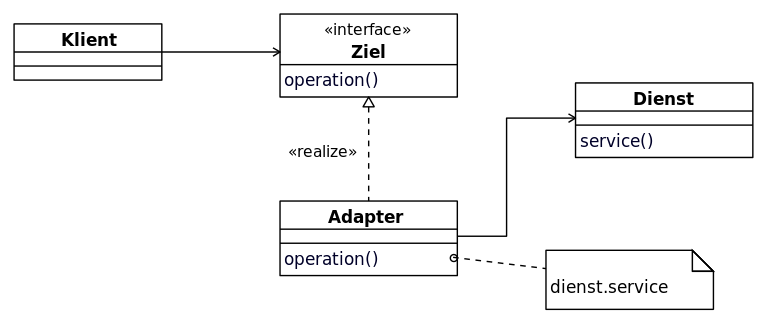

<!--
author:   Sebastian Zug & André Dietrich
email:    zug@ovgu.de   & andre.dietrich@ovgu.de
version:  0.0.1
language: de
narrator: Deutsch Female

import: https://raw.githubusercontent.com/LiaTemplates/Rextester/master/README.md
import: https://raw.githubusercontent.com/LiaTemplates/WebDev/master/README.md
import: https://raw.githubusercontent.com/liaTemplates/AlaSQL/master/README.md

script:  https://cdnjs.cloudflare.com/ajax/libs/echarts/4.1.0/echarts-en.min.js
-->


# Vorlesung Softwareentwicklung - 27 - Design Patterns II

--------------------------------------------------------------------
Link auf die aktuelle Vorlesung im Versionsmanagementsystem GitHub

https://github.com/liaScript/CsharpCourse/blob/master/27_DesignPatternII.md

Die interaktive Form ist unter diese Link zu finden ->
[LiaScript Vorlesung 27](https://liascript.github.io/course/?https://raw.githubusercontent.com/liaScript/CsharpCourse/master/27_DesignPatternII.md#1)

---------------------------------------------------------------------

**Wie weit sind wir schon gekommen?**

c# Schlüsselwörter:

|`abstract`   |`as`      |`base`    |`bool`      |`break`     |`byte`     |
|`case`       |`catch`   |`char`    |`checked`   |`class`     |`const`    |
|`continue`   |`decimal` | default  |`delegate`  |`do`        |`double`   |
|`else`       |`enum`    |`event`   | explicit   | extern     |`false`    |
|`finally`    | fixed    |`float`   |`for`       |`foreach`   |`goto`     |
|`if`         | implicit |`in`      |`int`       | interface  |`internal` |
|`is`         |`lock`    |`long`    |`namespace` |`new`       |`null`     |
|`object`     |`operator`|`out`     |`override`  |`params`    |`private`  |
|`protected`  |`public`  | readonly |`ref`       |`return`    |`sbyte`    |
|`sealed`     |`short`   | sizeof   | stackalloc |`static`    |`string`   |
|`struct`     |`switch`  |`this`    |`throw`     |`true`      |`try`      |
|`typeof`     |`uint`    |`ulong`   |`unchecked` | unsafe     |`ushort`   |
|`using`      |`virtual` |`void`    | volatile   |`while`     |           |


Auf die Auführung der kontextabhängigen Schlüsselwörter wie `where` oder
`ascending` wurde hier verzichtet.

---


## Rückmeldung Evaluation

**Vielen Dank für Ihre Teilnahme an der Lehrevaluation!**

"An vielen Stellen habe ich mir gewünscht, dass Beispiele aus der Praxis erwähnt werden, wann welche Taktiken sinnvoller sind ... überhaupt Beispiel wozu Bibliotheken gebraucht werden."

"Relativ viele, teils unbekannte Fachbegriffe in den Erklärungen"

"Der schwarze Programmierhintergrund macht es schwer lesbar."

"Es war schwer die Internet Adresse zu erreichen"

"manchmal ist der Stoff so trocken und "unnütz", dass man in der konkreten Programmierung damit nichts anfangen kann ... wozu die ganze Theorie"

"Übungen thematisch paralleler zur Vorlesung gestalten, um gelernte Programmiertechniken sofort anzuwenden."

## RoboCup Team der TU Freiberg

Noch nicht genug zum programmieren, löten und schrauben?

| <!-- width="100%" --> | <!-- width="100%" --> |
| <!-- width="100%" --> | <!-- width="100%" --> |

https://www.heise.de/ct/artikel/Meisterschaft-der-Maschinen-RoboCup-Work-3746064.html

Interesse? ... [sebastian.zug@informatik.tu-freiberg.de](sebastian.zug@informatik.tu-freiberg.de)


## Kontrollfragen

*1. Welche Bedeutung hat das Singelton Pattern? Wie wird es umgesetzt?*

*2. Was verbirgt sich hinter dem Begriff Continuous Integration?*

*3. Wie werden Nullables verwendet?*

                               {{1-2}}
*******************************************************************************

Um gleichermaßen "nicht-besetzte" Werte-Variablen zu ermöglichen integriert C#
das Konzept der sogenannte null-fähige Typen (*nullable types*) ein. Dazu wird
dem Typnamen ein  Fragezeichen angehängt. Damit ist es möglich diesen auch den
Wert `null` zuzuweisen bzw. der Compiler realisiert dies.

<!-- --{{0}}-- Idee des Codefragments:
    * einfache Variable ist mit null initialisierbar
    * Standardkonstruktor realisiert korrekte null Initialisierung
-->
```csharp                                      Iniitalisation
using System;

namespace Rextester
{
  //public struct Person{
  //  string name;
  //  int? alter;
  //}

  public class Program
  {
    public static void Main(string[] args){
      int? i = null;
      if (i == null) Console.WriteLine("Die Variable hat keinen Wert!")
      else Console.WriteLine("Der Wert der Variablen ist {0}", i)
    }
  }
}
```
@Rextester.eval(@CSharp)

Jeder Typ? wird vom Compiler dazu in einen generischen Typ `Nullable<Typ>`
transformiert, der folgende Methoden implementiert:

```csharp
public struct Nullable <T>{
  private bool defined;
  public bool HasValue {get;}
  ...
  private T value;
  public T Value {get;}
  ...
  public T GetValueOrDefault()   // value oder default Value entsprechend der
                                 // der Liste unter dem untenstehenden Link
  ...
}
```

https://docs.microsoft.com/de-de/dotnet/csharp/language-reference/keywords/default-values-table

Jetzt mal konkret, wozu brauche ich das?

* dass Sie Messwerte erfassen und diese in eine Datei schreiben, Ihr Sensor generiert Zeitweise fehlerhafte Werte. Sie können dies Situation mit einzelnen Flags in einem struct ausweisen oder aber den Wert direkt als ungültig kennzeichnen.
* in einer Umfrage haben Teilnehmer einzelne Fragen nicht beantwortet. Die zugehörigen Variablen werden als `null` gekennzeichnet.

Bei der weiteren Verwendung generieren `null`-Werte bei der Berechnung keine
Fehler sondern produzieren wiederum einen `null`-Wert. Entsprechend werden
Ergebnisse wiederum auf einen `Type?` abgebildet. Der ungesetzte Zustand pflanzt
sich also fort.

<!-- --{{0}}-- Idee des Codefragments:
    * einfache Variable ist mit null initialisierbar
    * Standardkonstruktor realisiert korrekte null Initialisierung
-->
```csharp                                      Iniitalisation
using System;

namespace Rextester
{
  public class Program
  {
    public static void Main(string[] args){
      int? i = null;
      int a = 5;
      if (a + i == null)
        Console.WriteLine("Das Ergebnis der Rechnung ist null!");
      // int c = a + i;                        // Compilerfeler
      // int c = a + i.Value;                  // Ausnahme für i == null
      // int c = a + i.GetValueOrDefault();    // Ausblendung von i == null mit
                                               // Standardwert   
      // int? c= a + i;
      // int d = c ?? -1;                      // Spezifikation einer eigenen
                                               // Null-Repräsenation
    }
  }
}
```
@Rextester.eval(@CSharp)

*******************************************************************************

---------------------------------------------------------------------


### Strukturmuster - Adapter Pattern

Ausgangspunkt für das Beispiel ist die Notwendigkeit eine externes
Buchungssystem mit einer Mitarbeiterdatenbank zu verknüpfen. Dabei sind Sie als
Entwickler mit zwei Formen der Datenhaltung konfrontiert. Während Ihr
Managementsystem für die Mitarbeiter `HRSystem` auf ein Array von strings setzt,
erwartet das einzubindende Buchungssystem eine (generische) Liste von strings.  

```csharp
public class HRSystem{
   public string[][] GetEmployees(){
     string[][] employees = new string[4][];   
     employees[0] = new string[] { "100", "Deepak", "Team Leader" };
     employees[1] = new string[] { "101", "Rohit", "Developer" };
     employees[2] = new string[] { "102", "Gautam", "Developer" };
     employees[3] = new string[] { "103", "Dev", "Tester" };

     return employees;
   }
}

public class ThirdPartyBillingSystem
{
   ...
   public void ShowEmployeeList(){
     List<string> employee = employeeSource.GetEmployeeList();
     ...
   }
   ...
}
```

Der Adapter (englisch adapter pattern) – auch als Wrapper bezeichnet –
ist ein Entwurfsmuster das zur Übersetzung einer Schnittstelle in eine andere
dient. Dadurch wird die Kommunikation von Klassen mit zueinander inkompatiblen
Schnittstellen ermöglich.

<!-- width="50%" -->  [WikipediaAdapter](#7)

```csharp    Adapter
// Das Beispiel ist motiviert durch den Code auf der Seite
// https://www.dotnettricks.com/learn/designpatterns/adapter-design-pattern-dotnet

using System;
using System.Collections.Generic;

namespace Rextester
{

  public interface ITarget{
    List<string> GetEmployeeList();
  }

  public class ThirdPartyBillingSystem
  {
     private ITarget employeeSource;

     public ThirdPartyBillingSystem(ITarget employeeSource){
       this.employeeSource = employeeSource;
     }

     public void ShowEmployeeList(){
       List<string> employee = employeeSource.GetEmployeeList();
       //To DO: Implement you business logic

       Console.WriteLine("######### Employee List ##########");
       foreach (var item in employee){
         Console.Write(item);
       }
     }
  }

  public class HRSystem{
     public string[][] GetEmployees(){
       string[][] employees = new string[4][];   
       employees[0] = new string[] { "100", "Deepak", "Team Leader" };
       employees[1] = new string[] { "101", "Rohit", "Developer" };
       employees[2] = new string[] { "102", "Gautam", "Developer" };
       employees[3] = new string[] { "103", "Dev", "Tester" };
       return employees;
     }
  }

  public class EmployeeAdapter : HRSystem, ITarget{
       public List<string> GetEmployeeList(){
         List<string> employeeList = new List<string>();
         string[][] employees = GetEmployees();
         foreach (string[] employee in employees)
         {
           employeeList.Add(employee[0]);
           employeeList.Add(",");
           employeeList.Add(employee[1]);
           employeeList.Add(",");
           employeeList.Add(employee[2]);
           employeeList.Add("\n");
         }

         return employeeList;
       }
    }

   public class Program {
      public static void Main(string[] args){
       ITarget Itarget = new EmployeeAdapter();
       ThirdPartyBillingSystem client = new ThirdPartyBillingSystem(Itarget);
       client.ShowEmployeeList();
     }
  }

}
```
@Rextester.eval(@CSharp)


### Erzeugungsmuster (Abstract) Factory Pattern

Der Begriff Factory Pattern bezeichnet ein Entwurfsmuster, das beschreibt, wie
ein Objekt durch Aufruf einer Methode anstatt durch direkten Aufruf eines
Konstruktors erzeugt wird.

Eine abstrakte "Fabrikmethode" dient dabei als Schnittstelle zur Erstellung
eines Objektes. Die konkrete Implementierung der Erzeugung neuer Objekte findet
jedoch nicht in der Oberklasse statt, sondern in von ihr abgeleiteten
Unterklassen, die die besagte abstrakte Methode implementieren.

Das Muster beschreibt somit die Erzeugung von Produktobjekten, deren konkreter
Typ ein Untertyp einer abstrakten Produktklasse ist, welcher von Unterklassen
einer Erzeugerklasse bestimmt wird. Es wird manchmal auch als „virtueller
Konstruktor“ bezeichnet.

<!-- width="50%" -->  [WikipediaFactory](#7)

Der Begriff Fabrikmethode wird in der Praxis auch oft einfach nur für eine statische Methode verwendet, die ein neues Objekt erzeugt, vergleichbar einem Konstruktor.


```csharp
// SomeObject o = new SomeObject();
// Aufruf einer Fabrikmethode statt des Konstruktors
SomeObject o = SomeObjectFactory.createNewInstance();
```

Fabrikmethoden entkoppeln ihre Aufrufer von Implementierungen konkreter Produkt-Klassen:

+ leichtere Anpassbarkeit bei Veränderungen
+ der fest definierte Name des Konstruktors kann durch eine aussagekräftigere Methode ersetzt werden.

Dabei können zwei grundsätzliche Varianten unterschieden werden:

| Pattern | Bedeutung |
| ------- | --------- |
| Factory pattern  | Implementiert den Zugriff auf eine Familie von Produkten über einen Konkreten Erzeuger. |
| Abstract Factory pattern | Implementiert den Zugriff auf unterschiedliche Produktklassen über eine Familie von Erzeugern. |


<!-- width="60%" -->  [StackOverflow](#7)


### Verhaltensmuster State Pattern

Die Abbildung von Zustandsmaschinen ist ein häufig wiederkehrendes Motiv. Nehmen
wir an, das wir eine Rollenspielfigur modellieren wollen. Dabei bestehen
lediglich drei  emotionale Zustände, die Figur kann eine neutrale, eine
aggressive oder eine  freundliche Position einnehmen. Üblicherweise würde sich
diese Einschätzung auf den Gegenüber beziehen. Bei komplexeren Sozialstrukturen
müsste eine Zuordnung zu einzelnen Charakteren gewährleistet sein.

In einer tabellarischen State-Maschine Darstellung ergibt sich dann folgendes Bild:

|            | Happy                  | Neutral   | Aggressive              |
| ---------- | ---------------------- | --------- | ----------------------- |
| Happy      | DealingWith, Addressed |           |                         |
| Neutral    |                        | Addressed | DealingWith, Addresssed |
| Aggressive | Provoked               | Provoked  | Provoked                |


Und wie implementieren wir das Ganze? Zunächst intuitiv mittels einer einzigen
Klasse und switch-case Statements.

```csharp    StateMachineSwitchCase
using System;

namespace Rextester
{
    public enum Feeling {Happy, Aggressive, Neutral};

    public class Character{
        public byte state;
        private string name;

        public Character(string name, byte state =(byte)Feeling.Happy ){
            this.name = name;
            this.state = state;
        }

        public void PrintState(){
            Console.WriteLine("{0} ", (Feeling)state);
        }

        public void Provoked(){
            switch ((Feeling)this.state)
            {
                case Feeling.Happy:
                case Feeling.Neutral:
                    Console.WriteLine("{0}: Jetzt hast Du meine Laune verdorben!", name);
                    this.state = (byte)Feeling.Aggressive;
                    break;
                case Feeling.Aggressive:
                    Console.WriteLine("{0}: Mich kannst Du nicht wütender machen", name);
                    break;
                default:
                    Console.WriteLine("NOT IMPLEMENTED!");
                    break;
            }
            PrintState();
        }

        public void Addressed(){
            switch ((Feeling)this.state)
            {
                case Feeling.Happy:
                case Feeling.Neutral:
                    Console.WriteLine("{0}: Dein Geschnack ändert meine Stimmung nicht", name);
                    break;
                case Feeling.Aggressive:
                    Console.WriteLine("{0}: Na gut, bin Dir nicht mehr böse!", name);
                    this.state = (byte)Feeling.Neutral;
                    break;              
                default:
                     Console.WriteLine("NOT IMPLEMENTED!");
                    break;
            }
            PrintState();
        }

        public void DealingWith(){
            switch ((Feeling)this.state)
            {
                case Feeling.Happy:
                    Console.WriteLine("{0}: Nett mit Dir Geschäfte zu machen!", name);
                    break;
                case Feeling.Aggressive:
                    Console.WriteLine("{0}: Jup, ein gutes Geschäft, fühle mich besser!", name);
                    this.state = (byte)Feeling.Neutral;
                    break;
                case Feeling.Neutral:
                    Console.WriteLine("{0}: Super Deal, wir sind jetzt dicke Kumpels!", name);
                    this.state = (byte)Feeling.Happy;
                    break;
                default:
                    Console.WriteLine("NOT IMPLEMENTED!");
                    break;
            }
            PrintState();
        }
    }

    public class Program {
        public static void Main(string[] args){
            Character Golum = new Character("Golum");
            Golum.Provoked();
            Golum.DealingWith();
            Golum.Addressed();
        }
    }
}
```
@Rextester.eval(@CSharp)

Welche Probleme sehen Sie?

Wie wäre es mit folgender neuen Anforderung: Um die Modellierung "spielbar" zu
sollen Wahrscheinlichkeiten beim Übergang eingeführt werden. Damit muss jeder
Transition eine eigene Zahl zugeordnet werden, die vom aktuellen Zustand, der
Transition und einer Zufallsvariablen abhängt.

+ Unleserlichkeit und Unübersichtlichkeit.

    Der Code bildet den Zustandsautomaten nicht aus Zustands- sondern aus Transitionssicht ab. Entsprechend ist das Verhalten für jeden Zustand über die Methoden `DealingWith`, `Àddressed` und `Provoked` verteilt. Man stelle sich nur den Entwurf mit 10 oder mehr Zuständen und 15 Methoden vor.

+ Schlechte Wartbarkeit und Erweiterbarkeit.

    Sollen neue Zustände eingeführt werden, so muss umständlich JEDE Operation um einen weiteren Fall erweitert werden. Die Fehlerträchtigkeit hierbei ist enorm.

+ In jedem Zustand sind alle Transitionsfunktionen möglich

     Wenn wir annehmen, dass nur im `Feeling.Happy` Fall eine bestimmte Interaktion stattfinden kann, sollten wir in allen anderen Zuständen deren Aufruf auch nicht ermöglichen.  


Der State Pattern ist ein Entwurfsmuster, das zur Kapselung unterschiedlicher,
zustandsabhängiger Verhaltensweisen eines Objektes eingesetzt. Grundsätzlich
gilt, dass das Verhalten eines Objekts abhängig von seinem Zustand dargestellt
wird.  Entsprechend wird hier jeder Fall der switch-Anweisung in einer eigenen
Klasse implementiert, so dass der Zustand des Objektes selbst wieder ein Objekt
ist, das unabhängig von anderen Objekten ist. Gleichzeitig realisieren wir
eine Abstraktionsebene durch ein Interface oder eine Basisklasse. Gegen diese
wird die Anwendung, hier die Klasse `Character` entwickelt.

<!-- size="350px" -->

```csharp    StateMachine
using System;

namespace Rextester
{
    public abstract class AbstractState{
        public Character figure;
        public AbstractState(Character figure){
            this.figure = figure;
        }
        public abstract void Provoked();
        public abstract void Addressed();
        public abstract void DealingWith();
    }

    public class HappyState : AbstractState{
        public HappyState(Character figure): base(figure) {}

        public override void Provoked(){
            Console.WriteLine("{0} is Happy but switches to Aggressive", figure.name);
            figure.setState(new AggressiveState(figure));
        }

        public override void Addressed(){
            Console.WriteLine("{0} is Happy", figure.name);
        }

        public override void DealingWith(){
            Console.WriteLine("{0} is DealingWith", figure.name);
        }
    }

    public class AggressiveState : AbstractState{
        public AggressiveState(Character figure): base(figure) {}

        public override void Provoked(){
            Console.WriteLine("{0} is Agrgessive", figure.name);
        }

        public override void Addressed(){
            Console.WriteLine("{0} is Aggressive but switches to Neutral", figure.name);
            figure.setState(new NeutralState(figure));
        }

        public override void DealingWith(){
            Console.WriteLine("{0} is Aggressive but switches to Neutral", figure.name);
            figure.setState(new NeutralState(figure));
        }
    }

    public class NeutralState : AbstractState{
        public NeutralState(Character figure): base(figure) {}

        public override void Provoked(){
            Console.WriteLine("{0} is Neutral but swiches to Agrgessive", figure.name);
            figure.setState(new AggressiveState(figure));
        }

        public override void Addressed(){
            Console.WriteLine("{0} is Neutral", figure.name);
        }

        public override void DealingWith(){
            Console.WriteLine("{0} is Aggressive but switches to Neutral", figure.name);
            figure.setState(new HappyState(figure));
        }
    }

    public class Character{

        private AbstractState currentState;
        public string name;

        public Character(string name){
            this.name = name;
            currentState = new HappyState(this);
        }

        public void setState(AbstractState newState){
            currentState = newState;
        }

        public void Addressed(){
            currentState.Addressed();
        }

        public void Provoked(){
            currentState.Provoked();
        }

        public void DealingWith(){
            currentState.DealingWith();
        }
    }

    public class Program {
        public static void Main(string[] args){
            Character Golum = new Character("Golum");
            Golum.Provoked();
            Golum.DealingWith();

        }
    }
}
```
@Rextester.eval(@CSharp)

1. Was müssen Sie tuen, um einen weitere Zustand hinzuzufügen?
2. Wie können wir eine zusätzliche Transition integrieren?
3. Wie lassen sich Methoden einbetten, die nur von bestimmten Zuständen realisiert werden?

## Anhang

**Referenzen**

[WikipediaAdapter] Wikipedia "Entwurfsmuster Objektadapter", Autor jarling, https://commons.wikimedia.org/wiki/File:Objektadapter.svg

[WikipediaFactory] Wikipedia "Entwurfsmuster Fabrikmethode", Autor jarling, https://de.wikipedia.org/wiki/Fabrikmethode#/media/Datei:Fabrikmethode.svg

[StackOverflow] Diskussion zum Unterschied zwischen Factory Pattern, vermeindlicher Autor des Bildes Tyring, https://stackoverflow.com/questions/1001767/what-is-the-basic-difference-between-the-factory-and-abstract-factory-design-pat

**Autoren**

Sebastian Zug, André Dietrich
