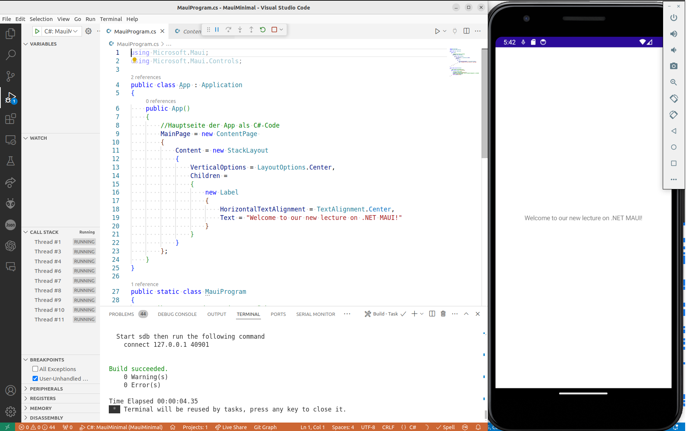
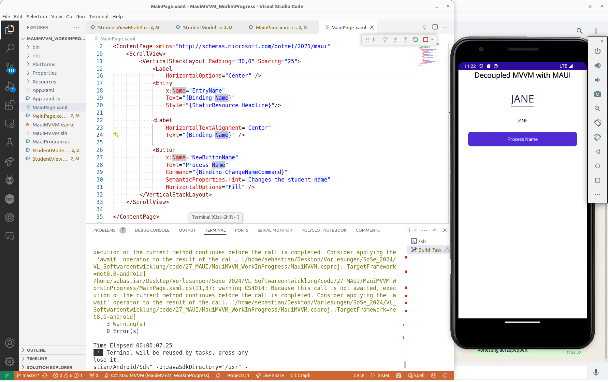

<!--

author:   Galina Rudolf, Sebastian Zug, 
email:    sebastian.zug@informatik.tu-freiberg.de
version:  1.0.4
language: de
narrator: Deutsch Female
comment:  Grundlagen der Programmierung mit MAUI
tags:      
logo:     

import: https://github.com/liascript/CodeRunner
        https://raw.githubusercontent.com/liascript-templates/plantUML/master/README.md

import: https://raw.githubusercontent.com/TUBAF-IfI-LiaScript/VL_Softwareentwicklung/master/config.md

-->

[](https://liascript.github.io/course/?https://github.com/TUBAF-IfI-LiaScript/VL_Softwareentwicklung/blob/master/27_MAUI.md)

# GUI Programmierung mit .NET MAUI

| Parameter                | Kursinformationen                                                                    |
| ------------------------ | ------------------------------------------------------------------------------------ |
| **Veranstaltung:**       | `Vorlesung Softwareentwicklung`                                                      |
| **Teil:**                | `27/27`                                                                              |
| **Semester**             | @config.semester                                                                     |
| **Hochschule:**          | @config.university                                                                   |
| **Inhalte:**             | @comment                                                                             |
| **Link auf den GitHub:** | https://github.com/TUBAF-IfI-LiaScript/VL_Softwareentwicklung/blob/master/27_MAUI.md |
| **Autoren**              | @author                                                                              |


---------------------------------------------------------------------

# .NET MAUI 

"MAUI" in .NET MAUI steht für *Multi-platform App UI* und hat keine direkte Verbindung zur hawaiianischen Insel Maui.

. [https://commons.wikimedia.org/wiki/File:Maui_Landsat_Photo.jpg](https://commons.wikimedia.org/wiki/File:Maui_Landsat_Photo.jpg)")


## GUI

                   {{0-1}}
************************************************

**Zeitreise ins Jahr 1984 - Word 1.1** 

> Was fehlt Ihnen?

<iframe style="width: 100%; max-width: 900px; height: 70vh" src="https://www.pcjs.org/software/pcx86/app/microsoft/word/1.15/"></iframe>

> Many Thanks to pcjs Development Team for their great work!

************************************************

                   {{1-2}}
************************************************

> GUI - eine Form von Benutzerschnittstelle eines Computers mit der Aufgabe Anwendungssoftware auf einem Rechner mittels grafischer Symbole, Steuerelemente oder auch Widgets genannt, bedienbar zu machen.
>
> [Wikipedia Grafische Benutzeroberfläche](https://de.wikipedia.org/wiki/Grafische_Benutzeroberfl%C3%A4che)


Steve Jobs besuchte das Xerox PARC (Palo Alto Research Center) in den späten 1970er Jahren und war beeindruckt von den Technologien, die er dort sah, insbesondere von der grafischen Benutzeroberfläche. Er erkannte sofort das Potenzial und implementierte ähnliche Konzepte in den Apple Lisa und später in den Macintosh. Jobs soll gesagt haben, dass der Besuch bei Xerox PARC einer der inspirierendsten Momente seiner Karriere war.


 - Autor Jojo345 https://de.wikipedia.org/wiki/Xerox_Alto#/media/Datei:Xerox_Alto_mit_Rechner.JPG")

 mit einem geöffneten Arbeitsfenster und Maus, am unteren Bildschirmrand halbverdeckt einige der Desktop-Symbole wie „Disk“ und „Papierkorb“ - Autor Marcin Wichary, https://de.wikipedia.org/wiki/Apple_Lisa#/media/Datei:Apple_Lisa_2_with_Profile_HD_cropped.jpg")

************************************************

### Warum grafisch?

> Zitat: "The screen is a window through which one sees a virtual world. The challenge is to make the world look real, act real, sound real, and feel real." – Ivan Sutherland

+ Benutzerfreundlich und intuitiv bedienbar, optimalere Lernkurve für weniger technisch versierte Benutzer 
+ Umfangreiche Möglichkeiten komplexe Daten zu visualisieren durch Diagramme, Tabellen und Grafiken 
+ Interaktivität und Echtzeit-Feedback bei verschiedenen Eingabesystemen
+ Minimierung von Eingabefehler durch eine gezielte Nutzerführung
+ Ästhetik 

### Programmierframeworks

**Java**

+ Abstract Window Toolkit (AWT): ältere Java-GUI-Bibliothek, ist plattformabhängig, da es direkt auf die nativen GUI-Komponenten des jeweiligen Betriebssystems zugreift, hat eingeschränkte Funktionalität im Vergleich zu neueren Toolkits und ist weniger flexibel.

+ Swing: etablierte GUI-Toolkit-Bibliothek, die in der Standardbibliothek von Java enthalten ist, ist plattformunabhängig, hat umfangreiche Dokumentation und eine einfache Handhabung. Veraltet im Vergleich zu neueren Technologien, weniger moderne UI.

+ [JavaFX](https://openjfx.io/): bietet eine reichhaltige Bibliothek für die Erstellung von ansprechenden grafischen Benutzeroberflächen (moderne UI-Designs, CSS-Styling, FXML für deklarative UI-Definitionen).

**C# (.NET)**

+ [Windows Forms](https://learn.microsoft.com/de-de/dotnet/desktop/winforms/overview/?view=netdesktop-8.0): Teil des .NET Frameworks, ermöglicht die schnelle Erstellung von Desktop-Anwendungen für Windows (nur für Windows), gut in Visual Studio integriert aber weniger leistungsfähig und flexibel als neuere Technologien.

+ WPF (Windows Presentation Foundation): ein moderneres GUI-Toolkit in .NET, das reichhaltige grafische Benutzeroberflächen (nur für Windows) und Databinding-Funktionen unterstützt. Unterstützt Vektor-Grafiken, umfangreiche Styling- und Animationsmöglichkeiten, leistungsfähiges Databinding, aber eine steilere Lernkurve im Vergleich zu Windows Forms.

+ MAUI (Multi-platform App UI): ein neues plattformübergreifendes GUI-Toolkit, das die Erstellung von Anwendungen für Windows, macOS, iOS und Android ermöglicht.

**C++**

+ [Qt](https://www.qt.io/): ein plattformübergreifendes GUI-Toolkit, das eine umfassende Bibliothek für die Entwicklung von Desktop- und Embedded-Anwendungen bietet, plattformunabhängig, leistungsfähig, umfangreiche Dokumentation, C++-basierte Signal-Slot-Mechanik, aber komplex.

+ [MFC](https://learn.microsoft.com/de-de/cpp/mfc/mfc-application-architecture-classes?view=msvc-170) (Microsoft Foundation Classes): eine Bibliothek von Klassen, die von Microsoft zur Unterstützung der GUI-Entwicklung (nur in Windows) bereitgestellt wird, in Visual Studio integriert, veraltet.


### Einstiegsbeispiel

```python
import tkinter as tk
from tkinter import messagebox

def say_hello():
    messagebox.showinfo("Status",
                        "Aus kleinem Anfang entspringen alle Dinge - Cicero")

window = tk.Tk()
window.title("Beispiel-GUI")
window.geometry('520x300')

hello_button = tk.Button(window, text="Ich bin keine einfache Anzeige ",
                        command=say_hello)
hello_button.pack(pady=20)

window.mainloop()
```

Was sind die Kernelemente einer GUI-Anwendung?

+ **Fenster**: Die Hauptoberfläche, die alle anderen Elemente enthält.
+ **Widgets**: Interaktive Elemente wie Schaltflächen, Textfelder, Listen, Menüs, usw.
+ **Layouts**: Die Anordnung der Widgets im Fenster.
+ **Ereignisse**: Aktionen, die durch Benutzerinteraktionen ausgelöst werden.
+ **Logik**: Die Programmlogik, die auf Benutzeraktionen reagiert.

## .NET MAUI - mehr als GUI

https://de.wikipedia.org/wiki/.NET_MAUI 

https://learn.microsoft.com/de-de/dotnet/maui/what-is-maui?view=net-maui-8.0

> .NET MAUI (Multi-Platform App UI) ist ein plattformübergreifendes Framework zum Erstellen nativer Mobil- und Desktop-Apps mit C# und XAML.
>
> --Handbuch von .NET MAUI 8 


NET MAUI vereint Android-, iOS-, macOS- und Windows-APIs in einer einzigen API, die eine Write-Once-Run-Anywhere-Entwicklung ermöglicht und gleichzeitig umfassenden Zugriff auf alle Aspekte der jeweiligen nativen Plattform bietet.


In einer .NET MAUI-Anwendung schreiben Sie Code, der hauptsächlich mit der .NET MAUI-API (1) interagiert. Die .NET MAUI nutzt dann direkt die APIs der nativen Plattform (3). Darüber hinaus kann der Anwendungscode bei Bedarf direkt auf die APIs der Plattform zugreifen (2).

.NET Multi-Platform App UI (.NET MAUI)-Apps können für die folgenden Plattformen geschrieben werden:

+ Android 5.0 (API 21) oder höher ist erforderlich.
+ iOS 11 oder höher ist erforderlich.
+ macOS 10.15 oder höher mit Mac Catalyst.
+ Windows 11 und Windows 10, Version 1809 oder höher, mit Windows UI Library (WinUI) 3.

> Und was ist mit Linux? https://github.com/dotnet/maui/discussions/339

> Alternativen? https://github.com/dotnet/maui/discussions/7779

**MAUI- Geschichte**:

+ 2004 - Start des Mono Projekts von Miguel de Icaza und Nat Friedman eine Open-Source-Implementierung von Microsofts .NET Framework
+ 2011 - Xamarin wurde gegründet, um die Entwicklung von plattformübergreifenden mobilen Anwendungen zu ermöglichen
+ 2012 - Erste Version von Xamarin.Mac 
+ 2014 - Xamarin.Forms wurde eingeführt, um plattformübergreifende UIs zu erstellen
+ 2016 - Microsoft übernahm Xamarin
+ 2020 -  Microsoft kündigte .NET MAUI erstmals auf der Build-Konferenz an. Die Idee war, eine weiterentwickelte Version von Xamarin.Forms zu schaffen, die eine einzige Codebasis bietet, um Anwendungen für iOS, Android, Windows und macOS zu entwickeln.
+ 2022 - Veröffentlichung von MAUI als Teil von .NET 6
+ 2023 - aktuelle Version MAUI in .NET 8


### Minibeispiel (ohne XAML, nur C#)

> Der Code des Beispiels ist im Projektordner unter `/code/27_MAUI/MauiMinimal` zu finden. Versuchen Sie die Struktur nachzuvollziehen und die dabei verwendeten Merkmale der Sprache C# zu identifizieren.

```csharp 
using Microsoft.Maui;
using Microsoft.Maui.Controls;

public class App : Application
{
    public App()
    {
        //Hauptseite der App als C#-Code
        MainPage = new ContentPage 
        {
            Content = new StackLayout
            {
                VerticalOptions = LayoutOptions.Center,
                Children =
                {
                    new Label
                    {
                        HorizontalTextAlignment = TextAlignment.Center,
                        Text = "Welcome to our new lecture on .NET MAUI!"
                    }
                }
            }
        };
    }
}

public static class MauiProgram
{
    //gibt Instanz der MauiApp zurück
    public static MauiApp CreateMauiApp()
    {
        //erstellt Builder-Objekt
        var builder = MauiApp.CreateBuilder();
        //konfiguriert Builder-Objekt: App als Haupteinstiegspunkt zu verwenden
        builder .UseMauiApp<App>();
        return builder.Build();
    }
}
```




### XAML

              {{0-1}}
*************************************

https://learn.microsoft.com/de-de/dotnet/maui/xaml/?view=net-maui-8.0

Die eXtensible Application Markup Language (XAML) ist eine XML-basierte Sprache, die statt Instanziieren und Initialisieren von Objekten im Programmcode diese in statischen Hierarchien speziell für die Benutzeroberflächen organisiert.

XAML eignet sich auch gut für die Verwendung mit dem Model-View-ViewModel (MVVM)-Muster für Definition der Ansicht. 

In einer XAML-Datei können komplette Benutzeroberflächen mit allen .NET MAUI-Views, Layouts und Pages sowie benutzerdefinierten Klassen definiert werden. 

XAML hat gegenüber gleichwertigem Code einige Vorteile:

+ XAML ist häufig prägnant und lesbarer als gleichwertiger Code.
+ Die Verhältnisse von übergeordneten (untergeordneten) Elementen sind klar erkennbar.

Nachteile bzw. Einschränkungen:

+ XAML darf keinen Code enthalten, z.B. keine Kontroll-Strukturen und in der Regel keine Klassen instanziieren, die keinen parameterlosen Konstruktor definieren, und Methoden aufrufen. 
+ Alle Ereignishandler müssen in der Regel in einer Codedatei definiert werden.

*************************************

              {{1-2}}
*************************************

Syntax
===============

Wichtigste Syntaxelemente:

+ **Elemente** repräsentieren UI-Komponenten wie Pages, Layouts, Buttons, Labels usw.
+ **Attribute** definieren Eigenschaften dieser Elemente (FontSize, TextColor, ...) und sind oft elementspezifisch. Alle Elemente können jedoch das Attribut `x:Name` verwenden, um das Element zu identifizieren und darauf im Code-behind zuzugreifen.

```xml
<ContentPage>
    <!-- UI-Inhalt hier -->
</ContentPage>
```

```xml
<Label x:Name="LabelBeschiftung" Text="Eine Beschriftung" FontSize="20" TextColor="Black" />
```

+ **Ereignisse** verbinden die UI mit der Logik im Code-behind.

```xml
<Button Text="Click Me" Clicked="OnButtonClicked" />
```

+ **xmlns**: deklariert XML-Namespaces, um XAML-Elemente zu identifizieren.
+ **x:Class**: stellt die Verbindung zur entsprechenden Klasse in der Code-behind-Datei her (Namespace.Class)

```xml
<ContentPage xmlns="http://schemas.microsoft.com/dotnet/2021/maui"
             xmlns:x="http://schemas.microsoft.com/winfx/2009/xaml"
             x:Class="Anwendung1.MainPage">
```


*************************************

              {{2-3}}
*************************************

.NET MAUI-Apps können die Darstellung der Benutzeroberfläche auf Plattformbasis mithilfe der Klassen `OnPlatform` und `On` anpassen.

```xml
<ContentPage xmlns="http://schemas.microsoft.com/dotnet/2021/maui"
             xmlns:x="http://schemas.microsoft.com/winfx/2009/xaml"
             x:Class="...">
    <ContentPage.Padding>
        <OnPlatform x:TypeArguments="Thickness" Default="20">
            <On Platform="iOS, Android" Value="10,20,20,10" />
        </OnPlatform>
    </ContentPage.Padding>
    ...
</ContentPage>
```

*************************************

### Minibeispiel mit XAML 

Um die Benutzeroberfläche zu erstellen werden in einer Maui-Anwendung die Klassen aus C# und XAML kombiniert. Dabei wird der strukturelle Aufbau und das Design der Benutzeroberfläche in XAML definiert, während die Logik und Funktionalität der Anwendung in C# implementiert wird. Beide Teile arbeiten zusammen, um eine vollständige Anwendung zu erstellen. Es existieren für jede Klasse zwei Dateien, .xaml- Datei und .xaml.cs (C#-Code-Behind)-Datei, die üblicherweise zur Laufzeit (als CIL-Code) zusammengeführt werden. 

https://learn.microsoft.com/de-de/dotnet/maui/xaml/fundamentals/get-started?view=net-maui-8.0

Achtung: Partielle Klassen!

Application 
=================

Die Application-Klasse repräsentiert die gesamte Anwendung. Sie dient als Einstiegspunkt und zentraler Verwalter der App.

Hauptfunktionen:

+ Initialisiert die App und ihre Ressourcen.
+ Verwaltet den Lebenszyklus der App (z.B. Starten, Beenden, Anhalten, Fortsetzen).
+ Definiert globale Ressourcen und Styles, die in der gesamten App verwendet werden können.
+ Gestaltet die Hauptseite der Anwendung, die beim Start angezeigt wird.

Methoden:

+ für die Behandlung von Lebenszyklusereignissen,
+ zum Erstellen neuer Windows für die Anwendung. Die .NET MAUI-Anwendung hat standardmäßig ein einziges Fenster, aber Sie können zusätzliche Fenster erstellen und starten.

```csharp App.xaml.cs
public partial class App : Application
{
	public App()
	{
		InitializeComponent();
		MainPage = new AppShell();
	}
}
```

```xml App.xaml
<?xml version = "1.0" encoding = "UTF-8" ?>
<Application xmlns="http://schemas.microsoft.com/dotnet/2021/maui"
             xmlns:x="http://schemas.microsoft.com/winfx/2009/xaml"
             xmlns:local="clr-namespace:MAUIErstesBeispiel"
             x:Class="MAUIErstesBeispiel.App">
    <Application.Resources>
        <ResourceDictionary>
            <ResourceDictionary.MergedDictionaries>
                <ResourceDictionary Source="Resources/Styles/Colors.xaml" />
                <ResourceDictionary Source="Resources/Styles/Styles.xaml" />
            </ResourceDictionary.MergedDictionaries>
        </ResourceDictionary>
    </Application.Resources>
</Application>
```


Shell 
=================

Die Shell-Klasse beschreibt die visuelle Hierarchie der App, ist ein Container für die gesamte App-Navigation. Sie bietet eine einheitliche Möglichkeit, die Navigationsstruktur und das Erscheinungsbild der App zu definieren.

Hauptfunktionen:

+ Verwaltung von Routen und Navigation innerhalb der App.
+ Unterstützung von Flyout-Menüs, Tab-Leisten und Seitenhierarchien.
+ Ermöglicht die Konfiguration von URI-basierten Navigationen und Deep Linking.

```csharp AppShell.xaml.cs
public partial class AppShell : Shell
{
	public AppShell()
	{
		InitializeComponent();
	}
}
```

```xml AppShell.xaml
<?xml version="1.0" encoding="UTF-8" ?>
<Shell
    x:Class="MAUIErstesBeispiel.AppShell"
    xmlns="http://schemas.microsoft.com/dotnet/2021/maui"
    xmlns:x="http://schemas.microsoft.com/winfx/2009/xaml"
    xmlns:local="clr-namespace:MAUIErstesBeispiel"
    Shell.FlyoutBehavior="Disabled"
    Title="MAUIErstesBeispiel">

    <ShellContent
        Title="Home"
        ContentTemplate="{DataTemplate local:MainPage}"
        Route="MainPage" />

</Shell>
```

Content Page
=================

Die ContentPage-Klasse ist die grundlegende Seite für die Anzeige von Inhalten in der App. Jede Seite stellt eine einzelne Ansicht dar, die vom Benutzer angezeigt wird.

Hauptfunktionen:

+ Enthält Views und Layouts, die auf der Seite angezeigt werden.
+ Ermöglicht das Festlegen und Verwalten des Seiteninhalts, einschließlich Header, Footer und Hauptinhalt.
+ Unterstützt Lebenszyklusereignisse wie Appearing und Disappearing für die Verwaltung der Seitendarstellung.

```csharp MainPage.xaml.cs
public partial class MainPage : ContentPage
{
	int count = 0;

	public MainPage()
	{
		InitializeComponent();
	}

	private void OnCounterClicked(object sender, EventArgs e)
	{
		count++;

		if (count == 1)
			CounterBtn.Text = $"Clicked {count} time";
		else
			if (count > 10)
				CounterBtn.Text = $"Clicked enough";
			else
				CounterBtn.Text = $"Clicked {count} times";

		SemanticScreenReader.Announce(CounterBtn.Text);
	}
}
```

```xml MainPage.xaml
<?xml version="1.0" encoding="utf-8" ?>
<ContentPage xmlns="http://schemas.microsoft.com/dotnet/2021/maui"
             xmlns:x="http://schemas.microsoft.com/winfx/2009/xaml"
             x:Class="MAUIErstesBeispiel.MainPage">
    <ScrollView ...>
        <VerticalStackLayout>
            <Image ... />
            <Label ... />
            <Label ... />
            <Button ... />
        </VerticalStackLayout>
    </ScrollView>
</ContentPage>
```

Wenn eine .NET MAUI - Klasse erstellt wird, wird eine LoadFromXaml-Methode indirekt aufgerufen. Dies geschieht, weil die Code-Behind-Datei für eine XAML-Klasse die Methode InitializeComponent von ihrem Konstruktor aus aufruft:

```csharp
private void InitializeComponent() //generiert für MainPage
{
    global::Microsoft.Maui.Controls.Xaml.Extensions.LoadFromXaml(this, typeof(MainPage));
    //...
}
```
Fazit: Mit .NET MAUI kann die Benutzeroberfläche einer App auch dynamisch nur mithilfe von C#-Code erstellt werden. Effizienter ist jedoch die Benutzeroberfläche statisch zur Kompilierzeit mit XAML (Extensible Application Mark-up Language) zu definieren. 
XAML ermöglicht es, den Benutzeroberflächencode von dem Verhaltenscode zu trennen, damit beide sich einfacher verwalten lassen.


### Kompilierungsprozess

+ NET MAUI XAML wird mit dem XAML-Compiler (XAMLC) direkt in Intermediate Language (IL) kompiliert (XAML-Kompilierung). Dieser IL-Code enthält alle notwendigen Instruktionen zur Erstellung der UI-Elemente und deren Eigenschaften.
+ Der IL-Code aus den XAML-Dateien wird mit dem IL-Code aus den Code-Behind-Dateien (.xaml.cs) und dem restlichen C#-Code der Anwendung zusammengeführt.
+ Der gesamte IL-Code wird dann zu einer ausführbaren Datei für die Zielplattform zusammengeführt.

Verwendung : 
+ Für das **Debugging** stellt die XAML-Kompilierung eine Kompilierungszeitüberprüfung von XAML bereit, konvertiert jedoch nicht den XAML-Code in die Il-Datei in der Assembly. Stattdessen werden XAML-Dateien als eingebettete Ressourcen im App-Paket enthalten und zur Laufzeit ausgewertet. 
+ Für Apps, die mit der Releasekonfiguration erstellt wurden, stellt die XAML-Kompilierung die Kompilierungszeitüberprüfung von XAML bereit und konvertiert den XAML-Code in eine IL, die in die Assembly geschrieben wurde. 

XAML-Kompilierung kann deaktiviert werden, was jedoch nicht empfohlen wird, da XAML dann zur Laufzeit analysiert und interpretiert wird, wodurch die App-Leistung reduziert wird.


## Trennung View Modell

> Wie bauen wir nun aber eine Anwendung, die nicht nur eine einfache Benutzeroberfläche hat, sondern Daten erfasst, verarbeitet und speichert? Wie können wir die Benutzeroberfläche von der Logik trennen, um die Wartbarkeit und Erweiterbarkeit zu verbessern?

Starten wir zunächst mit einem Gegenbeispiel, das SIe auch im Code Ordner des Projekts unter `/code/27_MAUI/MauiTerrible` finden.

```csharp
// THIS CODE IS A MOTIVATION EXAMPLE FOR MVC OR MVVM PATTERNS. IT IS NOT
// A RECOMMENDED PRACTICE TO USE THIS CODE IN PRODUCTION!

public class App : Application
{
    public App()
    {
        Student data = new Student("John");
        data.ChangePropertyAfterDelay(5);

        var entry = new Entry { Placeholder = "Enter a new name here!" };

        var label = new Label { 
            HorizontalTextAlignment = TextAlignment.Center,
            Text = $"Current Name is {data.Name}" 
        };

        var button = new Button { Text = "Submit" };

        button.Clicked += (sender, args) =>
        {
            data.Name = entry.Text;
        };

        data.NameHasChanged += () => label.Text = $"Current Name is {data.Name}";

        MainPage = new ContentPage
        {
            Content = new StackLayout
            {
                VerticalOptions = LayoutOptions.Center,
                Children = { entry, button, label }
            }
        };
    }
}

public class Student
{
    public event Action NameHasChanged;
    private string _name;
    public string Name
    {
        get => _name;
        set
        {
            if (_name != value)
            {
                _name = value;
                NameHasChanged?.Invoke();
            }
        }
    }

    public Student(string name)
    {
        Name = name;
    }

    public async Task ChangePropertyAfterDelay(int delayInSeconds)
    {
        await Task.Delay(delayInSeconds * 1000);
        Name = "Jane";
        Console.WriteLine("Property updated to: " + Name);
    }
}

public static class MauiProgram
{
    public static MauiApp CreateMauiApp()
    {
        var builder = MauiApp.CreateBuilder();
        builder.UseMauiApp<App>();
        return builder.Build();
    }
}
```

Nachteile:

+ Alles läuft in einem Thread.
+ Keine klare Trennung von Daten, Logik und Benutzeroberfläche.
+ Die Testbarkeit ist sehr eingeschränkt.


### Model View Controller

> Model View Controller (MVC, Modell-Ansicht-Steuerung) ist ein Entwurfsmuster zur Unterteilung einer Software in die drei Komponenten Datenmodell (model), Ansicht (view) und Programmsteuerung (controller) ... Ziel des Musters ist ein flexibler Programmentwurf, der eine spätere Änderung oder Erweiterung erleichtert und eine Wiederverwendbarkeit der einzelnen Komponenten ermöglicht.

Im den Fällen, wenn das dasselbe Modell mit einem anderen Framework oder für ein anderes Betriebssystem visualisiert werden soll, müssen nur Controller und View neu implementiert werden.

+ **Model** enthält Daten (und die Geschäftslogik) der Anwendung. Es ist unabhängig von der Benutzeroberfläche und der Programmsteuerung.
+ **View**  ist für die Darstellung der Daten des Modells und die Realisierung der Benutzerinteraktionen zuständig. Der View beobachtet das Modell und aktualisiert sich automatisch, wenn sich die Daten ändern. Gleichzeitig leitet er Benutzerinteraktionen an den Controller weiter.
+ **Contoller** verwaltet die Ansicht und das Modell, im Allgemeinen wertet er die Benutzerinteraktionen von View und passt das Modell an (oder umgekehrt).

Auf einem sehr abstrakten Level kann man den Informationsfluss wie folgt verstehen.

```ascii 
              Send Data            Request Information
          +-----------------+      +-------------------+           
          |                 |      |                   |        
          v                 |      |                   v        
      +------------+     +------------+ Response +------------+  
      | View       |     | Controller |<---------| Model      |  
      +------------+     +------------+          +------------+  
          |                     ^
 Response |                     | Request
          .------> User --------. 
```

### Model-View-ViewModel

> .NET MAUI verwendet in der Regel das "Model-View-ViewModel" (MVVM)-Entwurfsmuster, eine Variante des MVC, das speziell für die Entwicklung von Benutzeroberflächen vorgesehen ist. MVBM sieht vor eine Trennung zwischen Darstellung und Logik der Benutzerschnittstelle (UI) und des Software-Backends.

**Komponenten**:

**Model**: Die Daten- und Geschäftslogikschicht. Diese Komponente sollte unabhängig von der Benutzeroberfläche sein. Veränderungen im Datenbestand sollten automatisch an die ViewModel-Komponente weitergeleitet werden.

**View**: Die Darstellungsschicht ist für das Layout und die Anzeige der Daten verantwortlich. In .NET MAUI wird die View häufig durch XAML-Dateien (eXtensible Application Markup Language) beschrieben.

**ViewModel**: Die Vermittlungsschicht zwischen Model und View enthält die Bindungslogik und verbindet die Daten im Model mit der Darstellung in der View. Das ViewModel übernimmt auch die Benutzerinteraktionen und stellt diese Daten für die View bereit.

 ermöglicht die Trennung von View (z. B. XAML-Markup oder HTML) und Model für die Darstellung. Autor: Ugaya40, MVVM Pattern, https://upload.wikimedia.org/wikipedia/commons/thumb/8/87/MVVMPattern.png/440px-MVVMPattern.png")")


| **Kriterium**          | **Model-View-Controller (MVC)**                      | **Model-View-ViewModel (MVVM)**                             |
|------------------------|-------------------------------------------------------|-------------------------------------------------------------|
| **Komponenten**        | Model, View, Controller                               | Model, View, ViewModel                                      |
| **Datenfluss**         | Benutzer → View → Controller → Model → View           | Benutzer → View ↔ ViewModel ↔ Model                          |
| **Zentrale Rolle**     | Controller                                            | ViewModel                                                   |
| **Interaktion**        | View sendet Ereignisse an den Controller              | View bindet direkt an das ViewModel (Data Binding)          |
| **Aktualisierung**     | Controller aktualisiert das Model, das Model die View | ViewModel aktualisiert das Model und die View durch Datenbindung |

### Beispiel

```text @plantUML
@startuml
View --> ViewModel : Bindings (Name, ChangeNameCommand)
ViewModel -> Model : Set Initiate Name "John"
ViewModel -> View : Name "John"
ViewModel -> ViewModel : Renew Name to "Jane" after 5s
ViewModel -> Model : Set Initiate Name "Jane"
ViewModel -> View : Name "Jane"
User -> View : Push Button "Process Name"
View -> ViewModel : ChangeNameCommand
ViewModel -> Model : Call ".toUpper"
Model -> ViewModel : return string 
ViewModel -> View : Name with uppers 
@enduml
```

> Das Codebeispiel `MauiMVVMMinimal` im Projektordner `/code/27_MAUI/MauiMVVM_WorkInProgress` zeigt die Implementierung des Patterns anhand von "Bindings" in .NET MAUI.


