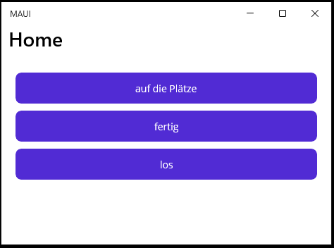
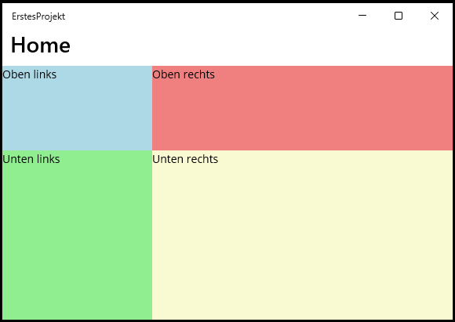
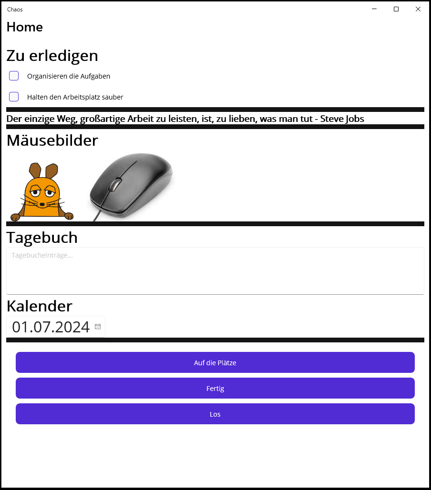
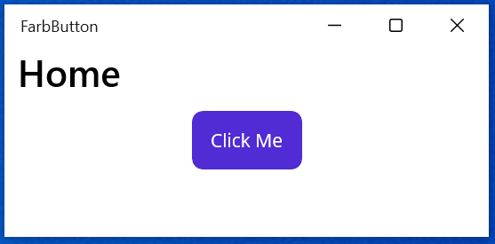
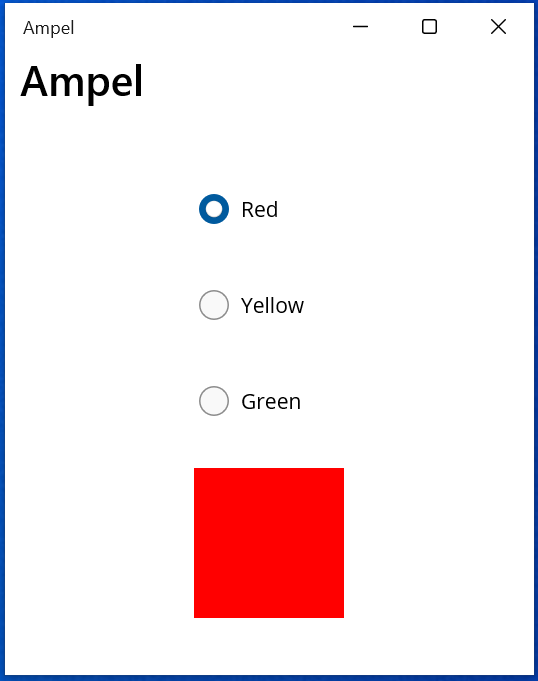
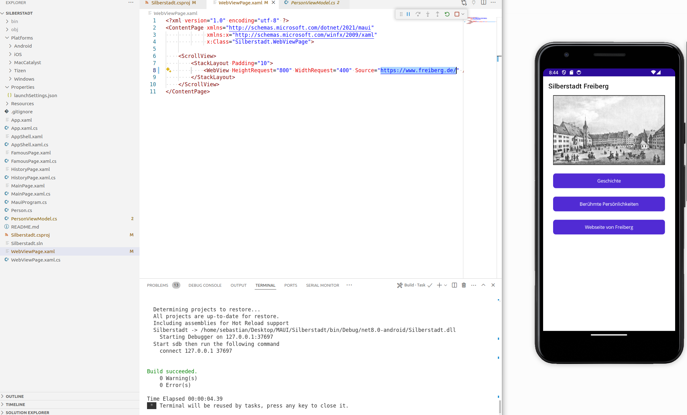

<!--

author:   Galina Rudolf, Sebastian Zug, 
email:    sebastian.zug@informatik.tu-freiberg.de
version:  1.0.0
language: de
narrator: Deutsch Female
comment:  Elemente der Programmierung mit MAUI, Testen von Maui Anwendungen 
tags:      
logo:     

import: https://github.com/liascript/CodeRunner
        https://raw.githubusercontent.com/liascript-templates/plantUML/master/README.md

import: https://raw.githubusercontent.com/TUBAF-IfI-LiaScript/VL_Softwareentwicklung/master/config.md

-->

[](https://liascript.github.io/course/?https://github.com/TUBAF-IfI-LiaScript/VL_Softwareentwicklung/blob/master/28_MAUI_II.md)

# .NET MAUI Elemente 

| Parameter                | Kursinformationen                                                                       |
|--------------------------|-----------------------------------------------------------------------------------------|
| **Veranstaltung:**       | `Vorlesung Softwareentwicklung`                                                         |
| **Teil:**                | `28/27`                                                                                 |
| **Semester**             | @config.semester                                                                        |
| **Hochschule:**          | @config.university                                                                      |
| **Inhalte:**             | @comment                                                                                |
| **Link auf den GitHub:** | https://github.com/TUBAF-IfI-LiaScript/VL_Softwareentwicklung/blob/master/28_MAUI_II.md |
| **Autoren**              | @author                                                                                 |


---------------------------------------------------------------------

## Frage aus der letzten Veranstaltung

> Wie können die Formate von Elementen (Schriftgrößen, Arten usw.) einheitlich gestaltet werden?

```xml 
<Label 
    Text="Hier mache ich was ich will"
    FontSize=16>

<Label
    Text="Hello, World!"
    Style="{StaticResource Headline}"
    SemanticProperties.HeadingLevel="Level1" />

<Label
    Text="Welcome to &#10;.NET Multi-platform App UI"
    Style="{StaticResource SubHeadline}"
    SemanticProperties.HeadingLevel="Level2"
    SemanticProperties.Description="Welcome to dot net Multi platform App U I" />
```

> Beispiel im Projektordner `/code/27_Maui/MauiDemo` gezeigt. 

In `App.xaml` werden die Ressourcen referenziert:

```xml
    <ResourceDictionary Source="Resources/Styles/Colors.xaml" />
    <ResourceDictionary Source="Resources/Styles/Styles.xaml" />
```

Diese enthalten die Definitionen für die Text und Farbstile für einzelne Elemente und hierarchische Vorgaben.

## Koordinatensystem und Einheiten

> Differenzierung nach Einheiten (geräteunabhängige/abhängig) und Anordnungsarten (absolut/relativ) 

                    {{0-1}}
**********************************************************

Der Ursprungspunkt (0,0) befindet sich in der oberen linken Ecke des Containers (z.B. des Bildschirms, eines Fensters oder eines Panels).Die x-Achse verläuft horizontal von links nach rechts. Die y-Achse verläuft vertikal von oben nach unten.

```ascii 
+-------------------------+
|+-----------------------+|
||+-----> x              ||
||| (0,0)                ||
|||                      ||
||v                      || 
||y                      ||                                                                 .
...

```

+ Um Elemente präzise zu positionieren, müssen deren x- und y-Koordinaten innerhalb des Containers festgelegt werden (absolute Positionierung). Relative Positionierung bezieht sich auf andere Elemente oder den Container.
+ Die Breite und Höhe von UI-Elementen können ebenfalls mit festen Größen oder relativ zur Größe des Containers oder anderer Elemente definiert werden.
+ Für die pixelgenaue Positionierung können in **Ausnahmefällen** absolute Einheiten verwendet werden, z.B. in spezifischen Layouts wie AbsoluteLayout.
  
```csharp
// Absolute layout in code behind (px example)
var absoluteLayout = new AbsoluteLayout();
AbsoluteLayout.SetLayoutBounds(label, new Rectangle(0, 0, 200, 50)); // Position and size
```

```
<ContentPage xmlns="http://schemas.microsoft.com/dotnet/2021/maui"
             xmlns:x="http://schemas.microsoft.com/winfx/2009/xaml"
             x:Class="AbsoluteLayoutDemos.Views.XAML.StylishHeaderDemoPage"
             Title="Stylish header demo">
    <AbsoluteLayout Margin="20">
        <BoxView Color="Silver"
                 AbsoluteLayout.LayoutBounds="0, 10, 200, 5" />
        <Label Text="Stylish Header"
               FontSize="24"
               AbsoluteLayout.LayoutBounds="30, 25" />
    </AbsoluteLayout>
</ContentPage>
```

Die Werte "0, 10, 200, 5" geben die Position (x=0, y=10) und die Größe (width=200, height=5) des BoxView-Elements in Pixeln an.

**********************************************************

                    {{1-2}}
**********************************************************

Um die Konsistenz der Benutzeroberfläche auf verschiedenen Geräten mit unterschiedlichen Pixeldichten sicherzustellen verwendet MAUI standardmäßig *geräteunabhängige Einheiten*, die an die Pixeldichte des Bildschirms angepasst werden (Grid, StackLayout, FlexLayout, FontSize, Padding, Margin).

```xml
<Label Text="Hello, World!"
       FontSize="16" /> <!-- FontSize in device-independent units (like dp) -->
```

```xml 
<ScrollView>
        <VerticalStackLayout
            Padding="30,0">    <!-- Padding mit zwei Dimensionen -->
            <Image
                Source="dotnet_bot.png"
                HeightRequest="185"
                Aspect="AspectFit"
                Margin="20" />   <!-- Margin mit einer Dimension -->
                                 <!-- Margin="0,20,15,5">
                                 <!-- links, oben, rechts unten -->
```

```ascii 

+-----------------------------------------+
|        ^
|        | Margin                           VerticalStackLayout
|        v
|Margin+---------------------------------+
|<---->| 
|      | Padding
|      |<---->+-----------------------
|      |      | Children 1
|      |      |
|      |      |
|      |      +---------------------- 
|      |
|      +---------------------------------+
|        ^
|        | Margin
|        v
|      +---------------------------------+
|      | Padding
|      |<---->+-----------------------
|      |      | Children 2
|      |      |                                                                                .

...
```

**********************************************************

                    {{2-3}}
**********************************************************


Relative Angaben für Position (Größe): 

+ Die Ausrichtung einer View, relativ zu ihrem übergeordneten Element, kann gesteuert werden, indem die Eigenschaft HorizontalOptions oder VerticalOptions der View auf eines der öffentlichen Felder aus der LayoutOptions-Struktur festgelegt wird. Die öffentlichen Felder sind Start, Center, End und Fill.


```xml
<StackLayout>
  ...
  <Label Text="Start" BackgroundColor="Gray" HorizontalOptions="Start" />
  <Label Text="Center" BackgroundColor="Gray" HorizontalOptions="Center" />
  <Label Text="End" BackgroundColor="Gray" HorizontalOptions="End" />
  <Label Text="Fill" BackgroundColor="Gray" HorizontalOptions="Fill" />
</StackLayout>
```

```ascii 
+-----------------------------------------+
| +--------+                              |                               
| | Start  |                              |             
| +--------+                              |             
|                                         |             
|                +--------+               | 
|                | Center |               |    
|                +--------+               |
|                                         |
|                              +--------+ |
|                              | End    | |
|                              +--------+ |
|                                         |
| +-------------------------------------+ | 
| | Fill                                | |
| +-------------------------------------+ |
+-----------------------------------------+                                                   .
```

+ Durch die Einstellung von HorizontalOptions und VerticalOptions auf LayoutOptions.Fill ("Fill") kann erreicht werden, dass ein Element übereinstimmend mit dem übergeordneten Element dargestellt wird.

```xml
<StackLayout>
    <BoxView Color="Silver" 
        HorizontalOptions="Fill" 
        VerticalOptions="Fill" />
</StackLayout>
```

> Vergleich Beispiel im Projektordner '/code/27_Maui/MauiDemo' gezeigt.

**********************************************************

## Steuerelemente

Die Benutzeroberfläche einer .NET Multi-Platform (.NET MAUI)-App besteht aus Objekten, die den nativen Steuerelementen jeder Zielplattform zugeordnet sind.

Die Hauptsteuerelementgruppen, die zum Erstellen der Benutzeroberfläche einer .NET MAUI-App verwendet werden, sind Seiten, Layouts und Ansichten. Eine .NET MAUI-Seite nimmt im Allgemeinen den gesamten Bildschirm oder das gesamte Fenster ein. Die Seite enthält normalerweise ein Layout, das Ansichten und möglicherweise andere Layouts abbildet. Seiten, Layouts und Ansichten leiten sich von der `VisualElement`-Klasse ab. Diese Klasse stellt eine Vielzahl von Eigenschaften, Methoden und Ereignissen bereit, die in abgeleiteten Klassen nützlich sind.

> Neben den Basiselementen von Maui existiert eine Vielzahl von vorgefertigten spezifischen Steuerelementen, die zum Teil im communitytoolkit enthalten sind.
>
> https://learn.microsoft.com/de-de/dotnet/communitytoolkit/maui/views/
> 
> https://learn.microsoft.com/de-de/dotnet/maui/user-interface/controls/?view=net-maui-8.0

### Pages


**ContentPage:** zeigt eine einzelne Ansicht an und ist der am häufigsten verwendete Seitentyp. 

**FlyoutPage:**	ist eine Seite, die zwei verwandte Seiten mit Informationen verwaltet – eine Flyout-Seite, die Elemente darstellt, und eine Detailseite, die Informationen zu Elementen auf der Flyout-Seite darstellt. 

**NavigationPage:** stellt eine hierarchische Navigation bereit, bei welcher in der Vorwärts- und in der Rückwärtsrichtung durch Seiten navigiert werden kann. 

**TabbedPage:** besteht aus einer Reihe von Seiten, die über Registerkarten auf dem oberen oder unteren Seitenrand navigierbar sind.

#### Klassendiagramm


#### Seitenwechsel im Quellcode

```csharp
button.Clicked += async (sender, args) =>
{
    await Navigation.PushAsync(new HelloXamlPage());
};
```

### Layouts

Layoutklassen ermöglichen das Anordnen und Gruppieren von UI-Steuerelementen.


+ **StackLayout** - organisiert Elemente in einem eindimensionalen Stapel, entweder horizontal oder vertikal (auch über Orientation-Eigenschaft)

  + **HorizontalStackLayout**
  + **VerticalStackLayout**

+ **Grid**
+ **FlexLayout**: kann Elemente sowohl horizontal als auch vertikal in einem flexiblen Raster anordnen (FlexDirection: Row, Column, RowReverse, ColumnReverse). Es bricht die Zeile oder Spalte um, wenn zu viele Elemente vorhanden sind, um in eine einzelne Zeile oder Spalte zu passen.
+ **AbsoluteLayout**: legt Position und Größe von untergeordneten Elementen mit expliziten Werten fest. Die Position wird durch die obere linke Ecke des untergeordneten Elements relativ zur oberen linken Ecke des AbsoluteLayout in geräteunabhängigen Einheiten angegeben.

```xml
<StackLayout Margin="20,20,20,20" Spacing="10">
    <Button Text="auf die Plätze" />
    <Button Text="fertig" />
    <Button Text="los" />
</StackLayout>
```



```csharp
using Microsoft.Maui.Controls;

namespace MauiApp
{
    public partial class MainPage : ContentPage
    {
        public MainPage()
        {
            var grid = new Grid
            {
                RowDefinitions =
                {
                    new RowDefinition { 
                        Height = new GridLength(1, GridUnitType.Star) },
                    new RowDefinition { 
                        Height = new GridLength(2, GridUnitType.Star) },
                },
                ColumnDefinitions =
                {
                    new ColumnDefinition { 
                        Width = new GridLength(1, GridUnitType.Star) },
                    new ColumnDefinition { 
                        Width = new GridLength(2, GridUnitType.Star) },
                }
            };

            var label1 = new Label
            {
                Text = "Oben links",
                BackgroundColor = Colors.LightBlue
            };

            var label2 = new Label
            {
                Text = "Oben rechts",
                BackgroundColor = Colors.LightCoral
            };

            var label3 = new Label
            {
                Text = "Unten links",
                BackgroundColor = Colors.LightGreen
            };

            var label4 = new Label
            {
                Text = "Unten rechts",
                BackgroundColor = Colors.LightGoldenrodYellow
            };


			grid.Children.Add(label1);
            Grid.SetRow(label1, 0);
            Grid.SetColumn(label1, 0);

            grid.Children.Add(label2);
            Grid.SetRow(label2, 0);
            Grid.SetColumn(label2, 1);

            grid.Children.Add(label3);
            Grid.SetRow(label3, 1);
            Grid.SetColumn(label3, 0);

            grid.Children.Add(label4);
            Grid.SetRow(label4, 1);
            Grid.SetColumn(label4, 1);

            Content = grid;
        }
    }
}
```



Um gewünschte Layout zu erstellen ist es unter Umständen notwendig die Layouts zu verschachteln.

#### Klassendiagramm


### Views (Controls, Widgets) 
https://learn.microsoft.com/de-de/dotnet/maui/user-interface/controls/?view=net-maui-8.0

.NET MAUI-Ansichten sind die UI-Objekte wie Labels, Schaltflächen, Schieberegler etc, die häufig als Steuerelemente oder Widgets in anderen Umgebungen bezeichnet werden.

#### Eine Auswahl der Views:

**Label**: einfache Textausgabe

**Button**: Schalter

**Entry**: Texteingabe

**Editor**: ermöglicht die Eingabe und Bearbeitung mehrerer Textzeilen

**CheckBox**: Ankreuzfeld


**RadioButton**: Auswahlschalter einer RadioGroup


**Bild**: Image zeigt ein Bild an, das aus einer lokalen Datei, einem URI oder einem Datenstrom geladen werden kann. Unterstützt werden die standardmäßigen Plattformbildformate einschließlich animierter GIFs und lokale SVG-Dateien (Scalable Vector Graphics).

Eigenschaften: 

+ Aspect, definiert den Skalierungsmodus des Bilds.
+ Source vom Typ ImageSource, gibt die Quelle des Bilds an: FromFile, FromUri, FromStream.


```xml
<Image Source="dotnet_bot.png" />
<Image Source="https://aka.ms/campus.jpg" />
```

```csharp
Image image1 = new Image
{
    Source = ImageSource.FromFile("dotnet_bot.png")
};
// Image image1 = new Image { Source = "dotnet_bot.png" };

Image image2 = new Image();
image2.Source = new UriImageSource
{
    Uri = new Uri("https://tu-freiberg.de/themes/custom/tubaf_barrio/logo.svg"),
    CacheValidity = new TimeSpan(10,0,0,0)
};

Image image3 = new Image
{
    Source = ImageSource.FromStream(() => stream)
};
```

**Web-View**:

```xml
<WebView HeightRequest="800" WidthRequest="400" Source="https://tu-freiberg.de" />
```

```csharp
WebView webView = new WebView
{
    Source = "https://tu-freiberg.de"
};

//...

webView.Reload();
```
Quellen:

https://learn.microsoft.com/de-de/dotnet/maui/user-interface/controls/label?view=net-maui-8.0

https://learn.microsoft.com/de-de/dotnet/maui/user-interface/controls/button?view=net-maui-8.0

https://learn.microsoft.com/de-de/dotnet/maui/user-interface/controls/radiobutton?view=net-maui-8.0

https://learn.microsoft.com/de-de/dotnet/maui/user-interface/controls/checkbox?view=net-maui-8.0

https://learn.microsoft.com/de-de/dotnet/maui/user-interface/controls/entry?view=net-maui-8.0

https://learn.microsoft.com/de-de/dotnet/maui/user-interface/controls/editor?view=net-maui-8.0

https://learn.microsoft.com/de-de/dotnet/maui/user-interface/controls/image?view=net-maui-8.0

https://learn.microsoft.com/de-de/dotnet/maui/user-interface/controls/webview?view=net-maui-8.0&pivots=devices-android

#### Klassendiagramm


Nicht behandelt wurden weitere GUI-Elemente wie 
Graphiken, Windows, Dialoge, Toolbars, Menüs.

### Handler

.NET Multi-platform App UI (.NET MAUI) bietet eine Sammlung plattformübergreifender Schnittstellendarstellungen, die die Steuerelemente abstrahiert. Plattformübergreifende Steuerelemente, die diese Schnittstellen implementieren, werden als virtuelle Ansichten bezeichnet. Handler ordnen diese virtuellen Ansichten Steuerelementen auf jeder Plattform zu, die als systemeigene Ansichten bezeichnet werden. Handler sind auch für die Instanziierung der zugrunde liegenden nativen Ansicht und das Zuordnen der plattformübergreifenden Steuerelement-API zur nativen Ansichts-API verantwortlich. Beispielsweise ordnet ein Handler unter iOS ein .NET MAUI Button einem iOS UIButton zu. Unter Android ist die Button Zuordnung zu einem AppCompatButton: 


Auf .NET MAUI-Handler wird über ihre steuerelementspezifische Schnittstelle zugegriffen, z. B. IButton für einen Button.

```csharp
namespace Microsoft.Maui
{
	/// <summary>
	/// Represents a <see cref="IView"/> that reacts to touch events.
	/// </summary>
	public interface IButton : IView, IPadding, IButtonStroke
	{
		/// <summary>
		/// Occurs when the button is pressed.
		/// </summary>
		void Pressed();

		/// <summary>
		/// Occurs when the button is released.
		/// </summary>
		void Released();

		/// <summary>
		/// Occurs when the button is clicked/tapped.
		/// </summary>
		void Clicked();
	}
}
```

Quelle:

https://learn.microsoft.com/de-de/dotnet/maui/user-interface/handlers/?view=net-maui-8.0

https://github.com/dotnet/maui/blob/cf42c193957a530af1a0551284c40e72e55780f9/src/Core/src/Core/IButton.cs

### Komplettes Beispiel mit verschieden Views

Chaos on the desk:

```xml
<?xml version="1.0" encoding="utf-8" ?>
<ContentPage xmlns="http://schemas.microsoft.com/dotnet/2021/maui"
             xmlns:x="http://schemas.microsoft.com/winfx/2009/xaml"
             x:Class="Chaos.MainPage">

   <ScrollView>
        <StackLayout Padding="10">            
            <!-- Zu erledigen -->
            <Label Text="Zu erledigen" FontAttributes="Bold" FontSize="Large" />
            <HorizontalStackLayout>
                <CheckBox IsChecked="False" VerticalOptions="Center"/>
                <Label Text="Organisieren der Aufgaben" VerticalOptions="Center"/>
            </HorizontalStackLayout>
            <HorizontalStackLayout>
                <CheckBox IsChecked="False" VerticalOptions="Center"/> 
                <Label Text="Den Arbeitsplatz sauber halten" VerticalOptions="Center"/>
            </HorizontalStackLayout>
            <BoxView HeightRequest="10" /> <!-- Spacer -->
            <!-- Kluge Sprüche -->
            <Label Text="Computer werden kleiner und kleiner, bald verschwinden sie völlig - Ephraim Kishon" 
                   FontAttributes="Bold" FontSize="Small" />
            <BoxView HeightRequest="10" /> <!-- Spacer -->
            <!-- Mäusebilder aus Ressorces/Images-->
            <Label Text="Mäusebilder" FontAttributes="Bold" FontSize="Large" />
            <HorizontalStackLayout>
                <Image Source="maus1.png" Aspect="AspectFit" HeightRequest="150" />
                <Image Source="maus2.jpg" Aspect="AspectFit" HeightRequest="150" />
            </HorizontalStackLayout>
            <BoxView HeightRequest="10" /> <!-- Spacer -->
            <!-- Tagebuch -->
            <Label Text="Tagebuch" FontAttributes="Bold" FontSize="Large" />
            <Editor Placeholder="Tagebucheinträge..." HeightRequest="100" />
            <!-- Kalenderansicht -->
            <Label Text="Kalender" FontAttributes="Bold" FontSize="Large" />
            <DatePicker FontSize="Large" Date="07/01/2024" />
            <BoxView HeightRequest="10" /> <!-- Spacer -->
        </StackLayout>
    </ScrollView>

</ContentPage>
```


## App-Lebenszyklus

.NET MAUI löst plattformübergreifende Lebenszyklusereignisse aus:


+ Wenn eine App zum ersten Mal installiert oder ein Gerät gestartet wird, kann die App als **Not Running** betrachtet werden. 
+ Wenn die App gestartet wird, werden die Ereignisse `Created` und `Activated` ausgelöst und die App wechselt zu **Running**. 
+ Wenn ein anderes App-Fenster den Fokus erhält, wird das `Deactivated`-Ereignis ausgelöst und die App wechselt zu **Deactivated**. 
+ Wechselt der Benutzer zu einer anderen App oder kehrt zum Home-Bildschirm des Geräts zurück, sodass das App-Fenster nicht mehr sichtbar ist, werden die Ereignisse `Deactivated` und `Stopped` ausgelöst und die App wird gestoppt (**Stopped**). 
+ Wenn der Benutzer zur App zurückkehrt, wird das `Resumed`-Ereignis ausgelöst, und die App wechselt zum Zustand **Running**. 
+ Wennn die App von einem Benutzer beendet wird, während sie ausgeführt wird, wird die App erst inaktiv (**Deactived**),  dann gestoppt (**Stopped**) und schließlich wird das Ereignis `Destroying` ausgelöst und die App beendet. Ebenso kann das Gerät die App beenden, falls sie aufgrund von Ressourcenbeschränkungen bereits gestoppt ist.

Die App-Klasse ist der Einstiegspunkt einer MAUI-Anwendung und wird verwendet, um die Lebensdauer der Anwendung zu verwalten und die Hauptseite der Anwendung "MainPage" in einem Window festzulegen.
Auf Desktop-Plattformen hat das Window-Objekt einen vollständigen Lebenszyklus.
Mobile Plattformen fokussieren sich auf den Lebenszyklus von Aktivitäten (Android) und View-Controllern (iOS), welche durch die Page-Klasse abstrahiert werden.


Die MainActivity wird von der Android-Laufzeitumgebung gestartet. Sie ist im plattformspezifischen Android-Projekt definiert und initialisiert die MAUI-Anwendung.
Die App-Klasse wird von der MainActivity aufgerufen und initialisiert die plattformübergreifende Anwendung. In der App-Klasse wird die MainPage festgelegt.

Eine vereinfachte Darstellung des Android-Aktivitätslebenszyklus:


### App-Lebenszyklus-Ereignisse

+ Plattformübergreifende Lebenszyklusereignisse sind verschiedenen Plattformereignissen zugeordnet

| Event           | Android   | Windows                                        |                                                                                     |
|:----------------|:----------|:-----------------------------------------------|:------------------------------------------------------------------------------------|
| **Created**     | OnCreate  | Created                                        | das systemeigene Fenster wird erstellt, ist aber möglicherweise noch nicht sichtbar |
| **Activated**   | OnResume  | Activated (CodeActivated und PointerActivated) | das fokussierte Fenster ist oder wird sichtbar                                      |
| **Deactivated** | OnPause   | Activated (Deactivated)                        | das Fenster ist nicht mehr fokussiert, aber möglicherweise weiterhin sichtbar       |
| **Stopped**     | OnStop    | VisibilityChanged                              | das Fenster ist nicht mehr sichtbar                                                 |
| **Resumed**     | OnRestart | Resumed                                        | die App wurde gestoppt und dann wieder fortgesetzt                                  |
| **Destroying**  | OnDestroy | Closed                                         | das systemeigene Fenster wird zerstört                                              |

###  App-Lebenszyklus-Methoden

Zusätzlich zu diesen Ereignissen verfügt die Klasse Window über die folgenden überschreibbaren Lebenszyklusmethoden:
    OnCreated,
    OnActivated, 
    OnDeactivated, 
    OnStopped, 
    OnResumed, 
    OnDestroying, 
    OnBackgrounding (wird aufgerufen, wenn das Backgrounding-Ereignis ausgelöst wird).

```csharp
using System.Diagnostics;
namespace MyMauiApp
{
    public partial class App : Application
    {
        public App()
        {
            InitializeComponent();
            MainPage = new MainPage();
        }

        protected override Window CreateWindow(IActivationState activationState)
        {
            Window window = base.CreateWindow(activationState);
            window.Created += (s, e) =>
            {
                // Custom code:
                Debug.WriteLine("Window created at: " + DateTime.Now);           //Logging
                if (!Connectivity.NetworkAccess.HasFlag(NetworkAccess.Internet)) //Connectivity
                {
                    MainPage.DisplayAlert("No Internet", "Please check your internet connection.", "OK");
                }
            };

            return window;
        }
    }
}
```

oder 

```csharp
namespace MyMauiApp
{
    public class MyWindow : Window
    {
        public MyWindow() : base()
        {
        }

        public MyWindow(Page page) : base(page)
        {
        }

        protected override void OnCreated()
        {
            // Custom code
        }
    }
}
```

```csharp
using Android.App;
using Android.Content.PM;
using Android.OS;

namespace MyMauiApp
{
    [Activity(Theme = "@style/Maui.SplashTheme", MainLauncher = true, ConfigurationChanges = ConfigChanges.ScreenSize | ConfigChanges.Orientation | ConfigChanges.UiMode | ConfigChanges.ScreenLayout | ConfigChanges.SmallestScreenSize | ConfigChanges.Density)]
    public class MainActivity : MauiAppCompatActivity
    {
        protected override void OnCreate(Bundle savedInstanceState)
        {
            base.OnCreate(savedInstanceState);
            SetContentView(Resource.Layout.activity_main);
            // Android spezifische Initialisierungen
        }
    }   
}
```

### Page-Lebenszyklus-Ereignisse (Methoden)

Der Lebenszyklus einer Page umfasst die Konstruktion der Seite, das Erscheinen (Appearing), Interaktionen und Updates während der Anzeige, das Verschwinden (Disappearing) und schließlich die Destruktion. 

+ **Appearing**: wird ausgelöst, wenn eine Seite angezeigt wird
+ **Disappearing**: wird ausgelöst, wenn eine Seite ausgeblendet wird.

```csharp
protected override void OnAppearing()
{
    base.OnAppearing();
    // Aktion
}
```

Das Überschreiben von entsprechenden Methoden ermöglicht die spezifische Logik zu verschiedenen Zeitpunkten im Lebenszyklus einer Seite zu implementieren.

## Ereignisbehandlung

Die Eventbehandlung in .NET MAUI umfasst die Reaktion auf verschiedene Ereignisse, die sowohl durch Benutzeraktionen wie Klicks auf Buttons bzw. Texteingaben in Editoren als auch durch Systemereignisse, wie das Laden von Seiten, Netzwerkänderungen, Timerabläufe oder Hardwareereignisse (z.B. das Drehen des Geräts), ausgelöst werden können.

Ereignisse können direkt in XAML oder im Code abonniert werden. 

### Benutzeraktion

Benutzeraktionen umfassen alle Interaktionen (mit Mouse, Taste, ..., Touch, Swipe, ... ), die der Benutzer mit der Benutzeroberfläche ausführt, wie z.B. Klicken, Tippen, Streichen, usw. Ein Button-Steuerelement kann beispielsweise auf die Ereignisse Clicked, Pressed und Released reagieren, während ein Entry-Steuerelement über Ereignisse wie TextChanged verfügt. Hier eine Auswahl:

+ Button- und Mauseingaben:

| Event        | wird ausgelöst                                                      |
|:-------------|:--------------------------------------------------------------------|
| **Clicked**  | wenn ein Button oder ein anderes klickbares Element angeklickt wird |
| **Pressed**  | wenn ein Element gedrückt wird                                      |
| **Released** | wenn ein gedrücktes Element losgelassen wird                        |

```csharp
Button button = new Button { Text = "Click Me" };
button.Clicked += (sender, args) => { /* Aktion */ };
button.Pressed += (sender, args) => { /* Aktion */ };
button.Released += (sender, args) => { /* Aktion */ };
```



```csharp
public partial class MainPage : ContentPage
{
        public MainPage()
        {
            InitializeComponent();

            // Button erstellen
            Button button = new Button
            {
                Text = "Click Me",
                HorizontalOptions = LayoutOptions.Center,
                VerticalOptions = LayoutOptions.Center
            };

            // Clicked-Ereignis hinzufügen
            button.Clicked += (sender, args) =>
            {
                //?
            };

            // Pressed-Ereignis hinzufügen
            button.Pressed += (sender, args) =>
            {
                button.BackgroundColor = Colors.Blue;
            };

            // Released-Ereignis hinzufügen
            button.Released += (sender, args) =>
            {
                button.BackgroundColor = Colors.Yellow;
            };

            // Button zur Seite hinzufügen
            Content = new StackLayout
            {
                Children = { button }
            };
        }
    }
```

+ Button, Label, Image (und einige andere) unterstützen Tap-Gesten; Image, CollectionView (und andere) die Swipe-Gesten. Diese Controls können durch Gestenerkenner (TapGestureRecognizer, SwipeGestureRecognizer, etc.) erweitert werden.

| Event      | wird ausgelöst                                      |
|:-----------|:----------------------------------------------------|
| **Tapped** | wenn auf ein Element getippt (doppelt getippt) wird |
| **Swiped** | wenn eine Wischgeste erkannt wird                   |

```csharp
var tapGestureRecognizer = new TapGestureRecognizer();
//var doubleTapGestureRecognizer = new TapGestureRecognizer { NumberOfTapsRequired = 2 };
tapGestureRecognizer.Tapped += (sender, args) => { /* Aktion */ };
image.GestureRecognizers.Add(tapGestureRecognizer);
```

```csharp
var swipeGestureRecognizer = new SwipeGestureRecognizer { Direction = SwipeDirection.Left };
swipeGestureRecognizer.Swiped += (sender, args) => { /* Aktion */ };
image.GestureRecognizers.Add(swipeGestureRecognizer);
```

+ Eingabefelder (Entry)

| Event           | wird ausgelöst                                                                                |
|:----------------|:----------------------------------------------------------------------------------------------|
| **TextChanged** | wenn der Text in einem Eingabefeld geändert wird                                              |
| **Completed**   | wenn die Eingabe in einem Eingabefeld abgeschlossen wird (z.B. durch Drücken der Enter-Taste) |

```csharp
Entry entry = new Entry { Placeholder = "Enter text" };
entry.TextChanged += (sender, args) => { /* Aktion */ };
entry.Completed += (sender, args) => { /* Aktion */ };
```
+ Listen

| Event            | wird ausgelöst                                   |
|:-----------------|:-------------------------------------------------|
| **ItemSelected** | wenn ein Element in einer Liste ausgewählt wird  |
| **ItemTapped**   | wenn auf ein Element in einer Liste getippt wird |


```csharp
ListView listView = new ListView();
listView.ItemSelected += (sender, args) => { /* Aktion */ };
```

+ RadioButton

| Event              | wird ausgelöst |
|:-------------------|:---------------|
| **CheckedChanged** |                |

`

```xml
    <ScrollView>
        <StackLayout VerticalOptions="Center" HorizontalOptions="Center" Spacing="20">
            <!-- RadioButtons for color selection -->
            <RadioButton Content="Red"
                        GroupName="colors"
                        CheckedChanged="OnColorsRadioButtonCheckedChanged" />
            <RadioButton Content="Yellow"
                        GroupName="colors"
                        CheckedChanged="OnColorsRadioButtonCheckedChanged" />
            <RadioButton Content="Green"
                        GroupName="colors"
                        CheckedChanged="OnColorsRadioButtonCheckedChanged" />
            <BoxView x:Name="ColorDisplay"
                    WidthRequest="100"
                    HeightRequest="100"
                    Color="Gray" />
        </StackLayout>
    </ScrollView>
```

```csharp
public partial class MainPage : ContentPage
{
	public MainPage()
	{
		InitializeComponent();
	}

    void OnColorsRadioButtonCheckedChanged(object sender, CheckedChangedEventArgs e)
    {
        if (e.Value == true)
        {
            var radioButton = sender as RadioButton;
            switch (radioButton.Content.ToString())
            {
                case "Red":
                       ColorDisplay.Color = Colors.Red;
                       break;
                case "Yellow":
                       ColorDisplay.Color = Colors.Yellow;
                       break;
                 case "Green":
                        ColorDisplay.Color = Colors.Green;
                        break;
                }
        }
    }
}
``` 

### Ereignis registrieren im Code

**Vorteil**: Events können zur Laufzeit abonniert und abbestellt werden, was eine flexible Reaktion auf dynamische UI-Zustände ermöglicht.

**Ereignismethoden** müssen die folgenden Signaturanforderungen erfüllen:

+ Sie können keinen Wert zurückgeben (void).
+ Sie müssen zwei Parameter übernehmen: ein object-Verweis, der das Objekt angibt, dass das Ereignis ausgelöst hat (als Sender bezeichnet), und einen EventArgs-Parameter, der alle Argumente enthält, die vom Sender an den Ereignishandler übergeben werden.
+ Der Ereignishandler sollte private sein. Dies ist zwar nicht zwingend erforderlich, aber wenn Sie einen Ereignishandler als öffentlich definieren, kann von außen auf ihn zugegriffen werden, und er könnte von einer anderen Aktion aufgerufen werden.
+ Der Ereignishandler kann `async` sein, wenn asynchrone Vorgänge ausgeführt werden müssen.

```csharp
public partial class MainPage : ContentPage, IPage
{
    public MainPage()
    {
        InitializeComponent();
        Counter.Clicked += OnCounterClicked;
    }

    ...

    private void OnCounterClicked(object sender, EventArgs e)
    {
        ...
    }
}
Counter.Clicked -= OnCounterClicked;
```

Neben benannten Methoden können auch anonyme Methoden oder Lambda-Ausdrücke zur Eventbehandlung verwendet werden, was besonders nützlich für kurze und einmalige Event-Handler ist.

**Argumente der Eventhandler für Benutzeraktionen**

- Touch- und Mauseingaben: EventArgs, TappedEventArgs, SwipedEventArgs
- Eingabefelder und Formulare: TextChangedEventArgs, CompletedEventArgs
- Liste und Sammlung: SelectedItemChangedEventArgs, ItemTappedEventArgs

| Klasse                           | enthaltene Informationen                                                                                            |
|:---------------------------------|:--------------------------------------------------------------------------------------------------------------------|
| **EventArgs**                    | Allgemeine Basisklasse für Ereignisdaten, enthält keine spezifischen Informationen                                  |
| **TappedEventArgs**              | über das Tippen, wie die Anzahl der Taps und die Position                                                           |
| **SwipedEventArgs**              | über eine Wischgeste, wie die Richtung und die Geschwindigkeit der Geste                                            |
| **TextChangedEventArgs**         | Änderungen im Text, einschließlich des neuen und alten Textwertes                                                   |
| **CompletedEventArgs**           | Wird verwendet, wenn eine Eingabe in einem Eingabefeld abgeschlossen wird, enthält keine zusätzlichen Informationen |
| **SelectedItemChangedEventArgs** | über das ausgewählte Element in einer Liste, einschließlich des neuen ausgewählten Elements                         |
| **ItemTappedEventArgs**          | über ein angetipptes Element in einer Liste, wie das angetippte Element und dessen Position                         |


### Ereignis registrieren im XAML-Markup

Eine Ereigniseigenschaft (z.B. Clicked bei Button) kann im XAML-Markup einer Seite mit dem Namen der Methode, die bei Auslösung des Ereignisses ausgeführt werden soll, initialisiert werden. 

```xml
<Button Text="Click Me" Clicked="OnButtonClicked" />
```

Die Event-Handler-Methoden werden im Code-behind definiert. 

```csharp
private void OnButtonClicked(object sender, EventArgs e)
{
    // Reaktion auf Button-Click
}
```

`InitializeComponent`-Methode, die im Konstruktor der Code-behind-Klasse aufgerufen wird, kümmert sich u.a. um die Verknüpfung von Event-Handler mit dem Event.

### Systemereignisse

Systemereignisse werden von der Plattform oder dem System ausgelöst (nicht durch Benutzeraktionen). Hier eine Auswahl:

+ `SizeChanged`, `OrientationChanged` werden ausgelöst, wenn sich die Größe eines Elements bzw. die Ausrichtung des Gerätes ändert.

```csharp
ContentPage page = new ContentPage();
page.SizeChanged += (sender, args) => { /* Aktion */ };
```

```csharp
var currentOrientation = DeviceDisplay.MainDisplayInfo.Orientation;
DeviceDisplay.MainDisplayInfoChanged += (sender, args) =>
{
    var orientation = args.DisplayInfo.Orientation;
    // Aktion
};
```
+ Veränderung des Netzwerkstatus (`ConnectivityChanged`) 

```csharp
Connectivity.ConnectivityChanged += (sender, args) =>
{
    var access = args.NetworkAccess;
    var profiles = args.ConnectionProfiles;
    // Aktion
};
```

**Argumente der Eventhandler für Systemereignisse**

- Gerätezustand und Orientierung: SizeChangedEventArgs, DisplayInfoChangedEventArgs
- Netzwerkstatus: ConnectivityChangedEventArgs
  
| Klasse                           | Informationen                                                                                    |
|:---------------------------------|:-------------------------------------------------------------------------------------------------|
| **SizeChangedEventArgs**         | Größenänderung eines Elements, einschließlich der neuen und alten Größe                          |
| **DisplayInfoChangedEventArgs**  | Änderungen in der Anzeige, wie neue Anzeigeeigenschaften (z.B. Auflösung, Orientierung)          |
| **ConnectivityChangedEventArgs** | Änderungen im Netzwerkstatus, wie die aktuelle Netzwerkanbindung und verfügbare Verbindungstypen |

## Multi-Threading

Notwendigkeit der Thread-Verwendung s. Vorlesung ...

https://learn.microsoft.com/de-de/dotnet/maui/platform-integration/appmodel/main-thread?view=net-maui-8.0

Problem: Die meisten Betriebssysteme verwenden für den Code, der die Benutzeroberfläche umfasst ein Thread. Dieser Thread wird als Hauptthread, Benutzeroberflächenthread oder UI-Thread bezeichnet. Die Verwendung dieses Modells ist notwendig, um Ereignisse der Benutzeroberfläche ordnungsgemäß zu serialisieren.  Der Nachteil dieses Modells ist, dass der Code, der auf Elemente der Benutzeroberfläche zugreift, ebenfalls im Hauptthread der Anwendung ausgeführt werden muss.

Ausführen von Code im UI-Thread aus einem sekundären Thread:

```csharp
MainThread.BeginInvokeOnMainThread(() =>
{
    // Code to run on the main thread
});
```

oder mit Abfrage: 

```csharp
void MyMainThreadCode() // method of main thread
{
    // Code to run on the main thread
}

if (MainThread.IsMainThread)
    MyMainThreadCode();

else
    MainThread.BeginInvokeOnMainThread(MyMainThreadCode);
```

Weitere Methoden:  

| Methode                                    | Argumente       | Rückgabe                       | Zweck                                                                      |
|:-------------------------------------------|:----------------|:-------------------------------|:---------------------------------------------------------------------------|
| `InvokeOnMainThreadAsync<T>`               | `Func<T>`       | `Task<T>`                      | Ruft `Func<T>` auf dem Hauptthread auf und wartet auf den Abschluss.       |
| `InvokeOnMainThreadAsync`                  | `Action`        | `Task`                         | Ruft `Action` auf dem Hauptthread auf und wartet auf den Abschluss.        |
| `InvokeOnMainThreadAsync<T>`               | `Func<Task<T>>` | `Task<T>`                      | Ruft `Func<Task<T>>` auf dem Hauptthread auf und wartet auf den Abschluss. |
| `InvokeOnMainThreadAsync`                  | `Func<Task>`    | `Task`                         | Ruft `Func<Task>` auf dem Hauptthread auf und wartet auf den Abschluss.    |
| `GetMainThreadSynchronizationContextAsync` |                 | `Task<SynchronizationContext>` | Gibt `SynchronizationContext` für den Hauptthread zurück                   |

Beispiel:

```csharp
private void OnClicked(object sender, EventArgs e)
{
    Task.Run(async () => 
    {
        Thread.Sleep(2000);
        string ergebnis="404";
        MainThread.BeginInvokeOnMainThread(() =>
        {
            EvaluateLabel.Text=antwort;
        });					
    });
}
```

```xml
<Label
    x:Name="EvaluateLabel"
    Text=" " />
<Button
    x:Name="Btn"
    Text="Click me" 
    Clicked="OnClicked"
    HorizontalOptions="Fill" />
```

```csharp
using Microsoft.Maui.Controls.Shapes;
namespace Ampel2;

public partial class MainPage : ContentPage
{
    private Ellipse colorDisplay;
	IDispatcherTimer timer;
    private string[] colors = {"Yellow", "Red", "Yellow", "Green" };
    private int colorIndex = 0;

    public MainPage()
    {
        InitializeComponent();
		colorDisplay = new Ellipse				
		{ 
			Fill=Colors.Green,
         	WidthRequest=100, HeightRequest=100,
         	HorizontalOptions=LayoutOptions.Center 
		};

		timer = Dispatcher.CreateTimer();
		timer.Interval = TimeSpan.FromMilliseconds(2000);
		timer.Tick += (s, e) =>
		{
			colorIndex = (colorIndex + 1) % colors.Length;
            MainThread.BeginInvokeOnMainThread(() =>
            {
				switch (colors[colorIndex])
				{
					case "Red":
						colorDisplay.Fill = Colors.Red;
						break;
					case "Yellow":
						colorDisplay.Fill = Colors.Yellow;
						break;
					case "Green":
						colorDisplay.Fill = Colors.Green;
						break;
				}
        	});
		};
		timer.Start();
        Content = new StackLayout
        {
            Children = { colorDisplay }
        };
    }

    protected override void OnDisappearing()
    {
        base.OnDisappearing();
        timer.Stop(); 
    }
}
```

## Datenbindung

Eine .NET Multiplattform App UI (.NET MAUI) App besteht aus einer oder mehreren Pages, von denen jede typischerweise mehrere Benutzerschnittstellen-Objekte enthält. Eine der Hauptaufgaben der App besteht darin, diese Views zu synchronisieren. Häufig stehen die Views für Werte einer zugrunde liegenden Datenquelle, und die Benutzer verändern die Views, um die Daten zu verändern. Wenn die View verändert wird, müssen alle zugrunde liegenden Daten und andere View diese Änderung nachvollziehen. Das kann über Eventhandler realisiert werden. 

Die Datenbindung automatisiert diesen Prozess und macht Ereignishandler überflüssig. Datenbindungen können sowohl in XAML als auch in Code implementiert werden, sind aber in XAML weitaus häufiger, da sie dazu beitragen, die Größe der Code-Behind-Datei zu reduzieren. Bindungsaktualisierungen werden von .NET MAUI an den UI-Thread automatisch übermittelt. 

Datenbindung ist also die Verknüpfung von Eigenschaften zweier Objekte. Eines der beiden Objekte ist immer ein von View abgeleitetes Element. Das andere Objekt ist

+ ein weiteres View-Derivat, meist auf der gleichen Seite
+ oder ein Objekt in einer Codedatei.

```csharp
public partial class BasicCodeBindingPage : ContentPage
{
    public BasicCodeBindingPage()
    {
        InitializeComponent();

        label.BindingContext = slider;
        label.SetBinding(Label.RotationProperty, "Value");
    }
}
```

Beispiel (https://learn.microsoft.com/de-de/dotnet/maui/fundamentals/data-binding/basic-bindings?view=net-maui-8.0): 

```xml
<ContentPage xmlns="http://schemas.microsoft.com/dotnet/2021/maui"
             xmlns:x="http://schemas.microsoft.com/winfx/2009/xaml"
             x:Class="DataBindingDemos.BasicXamlBindingPage"
             Title="Basic XAML Binding">
    <StackLayout Padding="10, 0">
        <Label Text="TEXT"
               FontSize="80"
               HorizontalOptions="Center"
               VerticalOptions="Center"
               BindingContext="{x:Reference Name=slider}"
               Rotation="{Binding Path=Value}" />

        <Slider x:Name="slider"
                Maximum="360"
                VerticalOptions="Center" />
    </StackLayout>
</ContentPage>
```

In diesem Beispiel ist das Label das Bindungsziel, und der Slider ist die Bindungsquelle. Änderungen der Slider-Quelle wirken sich auf die Drehung des Label-Ziels aus. 

oder 

```csharp
public partial class BasicCodeBindingPage : ContentPage
{
    public BasicCodeBindingPage()
    {
        InitializeComponent();

        label.BindingContext = slider;
        label.SetBinding(Label.RotationProperty, "Value");
    }
}
```
## Beispiel mit Eventhandling

```xml MainPage
<?xml version="1.0" encoding="utf-8" ?>
<ContentPage xmlns="http://schemas.microsoft.com/dotnet/2021/maui"
             xmlns:x="http://schemas.microsoft.com/winfx/2009/xaml"
             x:Class="MitInteraktionen.MainPage">

    <ScrollView>
        <VerticalStackLayout
            Padding="30,0"
            Spacing="5">
        <Button Text="Zu erledigen" Clicked="OnZuErledigenClicked" />
        <Button Text="Notiz hinzufügen" Clicked="OnNotizHinzufuegenClicked" />
        <Button Text="Termin eintragen" Clicked="OnTerminEintragenClicked" />
        </VerticalStackLayout>
    </ScrollView>
</ContentPage>
```

```csharp MainPage
public partial class MainPage : ContentPage
{
	public MainPage()
	{
		InitializeComponent();
	}

    private async void OnZuErledigenClicked(object sender, EventArgs e)
    {
        await Navigation.PushAsync(new ZuErledigenPage());
    }

    private async void OnNotizHinzufuegenClicked(object sender, EventArgs e)
    {
        await Navigation.PushAsync(new NotizHinzufuegenPage());
    }

    private async void OnTerminEintragenClicked(object sender, EventArgs e)
    {
        await Navigation.PushAsync(new TerminEintragenPage());
    }
}
```

```xml ZuErledigenPage
<?xml version="1.0" encoding="utf-8" ?>
<ContentPage xmlns="http://schemas.microsoft.com/dotnet/2021/maui"
             xmlns:x="http://schemas.microsoft.com/winfx/2009/xaml"
             x:Class="MitInteraktionen.ZuErledigenPage">

    <StackLayout Padding="10">
        <StackLayout Orientation="Horizontal">
            <CheckBox IsChecked="False" VerticalOptions="Center" />
            <Label Text="Zimmer aufräumen" VerticalOptions="Center" />
        </StackLayout>
        <StackLayout Orientation="Horizontal">
            <CheckBox IsChecked="False" VerticalOptions="Center" />
            <Label Text="Kuchen backen" VerticalOptions="Center" />
        </StackLayout>
    </StackLayout>
</ContentPage>
```

```csharp ZuErledigenPage
public partial class ZuErledigenPage : ContentPage
{
	public ZuErledigenPage()
	{
		InitializeComponent();
	}
}
```

```xml NotizHinzufuegenPage
<?xml version="1.0" encoding="utf-8" ?>
<ContentPage xmlns="http://schemas.microsoft.com/dotnet/2021/maui"
             xmlns:x="http://schemas.microsoft.com/winfx/2009/xaml"
             x:Class="MitInteraktionen.NotizHinzufuegenPage">

    <StackLayout Padding="10">
        <Editor x:Name="NotizEditor" Placeholder="Schreibe deine Notiz hier..." HeightRequest="200" />
        <Button Text="Speichern" Clicked="OnSpeichernClicked" />
    </StackLayout>
</ContentPage>
```

```xml NotizHinzufuegenPage
public partial class NotizHinzufuegenPage : ContentPage
{
    public NotizHinzufuegenPage()
    {
        InitializeComponent();
    }

    private async void OnSpeichernClicked(object sender, EventArgs e)
    {
        DateTime thisDay = DateTime.Today;
        string not=thisDay.ToString() +"\n"+ NotizEditor.Text;
        using (StreamWriter outputFile = new StreamWriter("Notizen.txt"))
        {
            await outputFile.WriteAsync(not);
        }
        await DisplayAlert("Gespeichert", "Deine Notiz wurde gespeichert.", "OK");
    }
}
```

```xml TerminEintragenPage
<?xml version="1.0" encoding="utf-8" ?>
<ContentPage xmlns="http://schemas.microsoft.com/dotnet/2021/maui"
             xmlns:x="http://schemas.microsoft.com/winfx/2009/xaml"
             x:Class="MitInteraktionen.TerminEintragenPage">

    <StackLayout Padding="10">
        <Label Text="Kalender" FontAttributes="Bold" FontSize="Large" />
        <DatePicker x:Name="SelectDate" FontSize="Large"/>
        <Button Text="Speichern" Clicked="OnSpeichernClicked" />
    </StackLayout>
</ContentPage>
```

```xml TerminEintragenPage
public partial class TerminEintragenPage : ContentPage
{
    public TerminEintragenPage()
    {
        InitializeComponent();
    }

    private void OnSpeichernClicked(object sender, EventArgs e)
    {
        string dat=SelectDate.Date.ToString();
        DisplayAlert("Gespeichert", $"Dein Termin {dat} wurde gespeichert.", "OK");
    }
}
```


## Plattformspezifische Verzeichnisse und Dateien

### Android-Manifest

+ Platforms\Android\AndroidManifest.xml 
+ wird als Teil des .NET MAUI-Build-Prozesses auf Android generiert 
+ beinhaltet Eigenschaften der gesamten App, Berechtigungen, Komponenten (wie Activity)
  
```xml
<?xml version="1.0" encoding="utf-8"?>
<manifest xmlns:android="http://schemas.android.com/apk/res/android">
	<application android:allowBackup="true" android:icon="@mipmap/appicon" android:roundIcon="@mipmap/appicon_round" android:supportsRtl="true"></application>
	<uses-permission android:name="android.permission.ACCESS_NETWORK_STATE" />
	<uses-permission android:name="android.permission.INTERNET" />
    <activity android:label="My Maui App"
          android:name="crc64bdb9c38958c20c7c.MainActivity">
        <intent-filter>
                <action android:name="android.intent.action.MAIN" />
                <category android:name="android.intent.category.LAUNCHER" />
        </intent-filter>
</activity>
</manifest>
```

### Plattformspezifische Einstellungen im  Quellcode

```csharp
#if WINDOWS
using Microsoft.UI;
using Microsoft.UI.Windowing;
using Windows.Graphics;
#endif
public partial class App : Application
{
    const int WindowWidth = 600;
    const int WindowHeight = 800;
	public App()
	{
		InitializeComponent();
        Microsoft.Maui.Handlers.WindowHandler.Mapper.AppendToMapping(nameof(IWindow), (handler, view) =>
        {
            #if WINDOWS
            var mauiWindow = handler.VirtualView;
            var nativeWindow = handler.PlatformView;
            nativeWindow.Activate();
            IntPtr windowHandle = WinRT.Interop.WindowNative.GetWindowHandle(nativeWindow);
            WindowId windowId = Microsoft.UI.Win32Interop.GetWindowIdFromWindow(windowHandle);
            AppWindow appWindow = Microsoft.UI.Windowing.AppWindow.GetFromWindowId(windowId);
            appWindow.Resize(new SizeInt32(WindowWidth, WindowHeight));
            #endif
        });

		MainPage = new AppShell();
	}
}
//using Microsoft.Extensions.Logging;
```

## Praktische Hinweise

+ Installation: Maui-Paket, Extensions, Android

https://learn.microsoft.com/de-de/dotnet/maui/get-started/installation?view=net-maui-8.0&tabs=visual-studio-code

+ Erstellen und Ausführen von Projekt

https://learn.microsoft.com/de-de/dotnet/maui/get-started/first-app?pivots=devices-android&view=net-maui-8.0&tabs=visual-studio-code

https://learn.microsoft.com/de-de/dotnet/maui/get-started/first-app?pivots=devices-windows&view=net-maui-8.0&tabs=visual-studio-code

## Finales Beispiel

https://github.com/galinarudollf/Silberstadt

